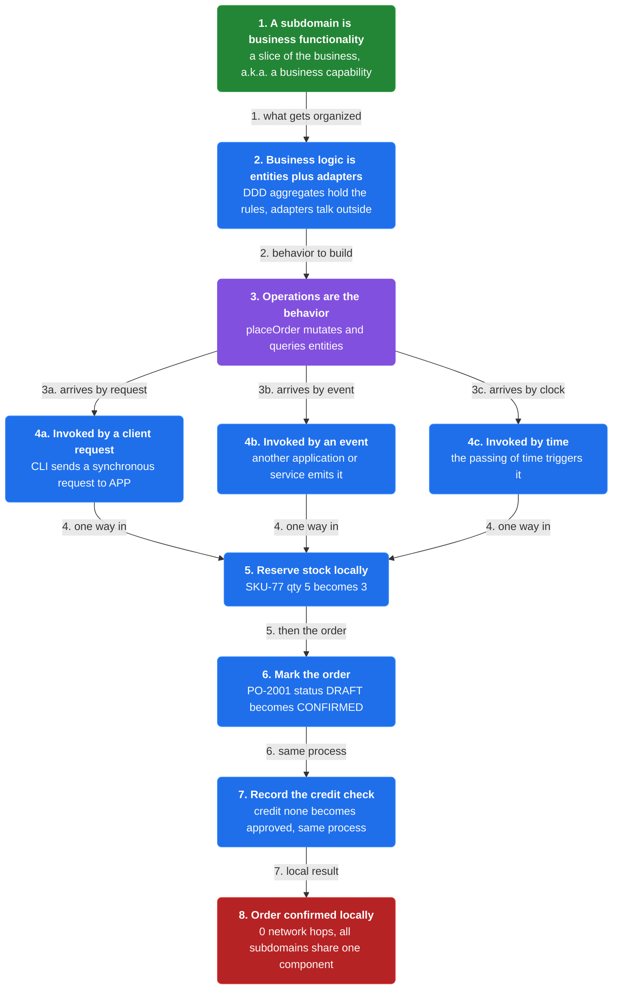
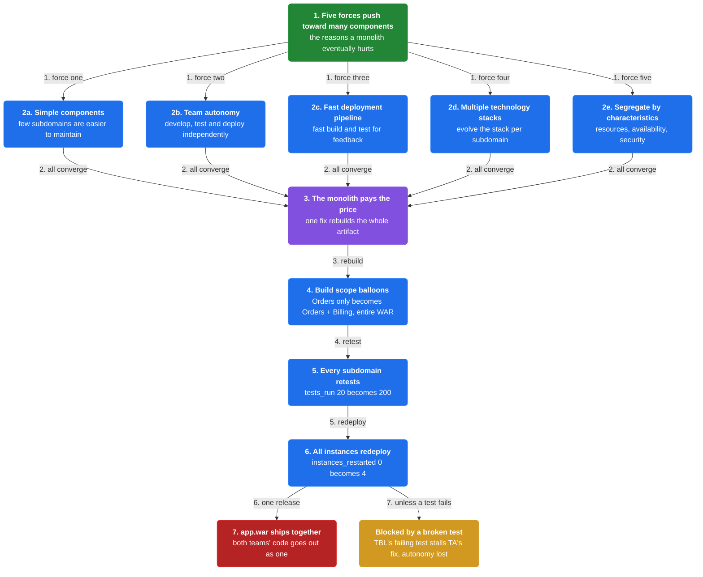
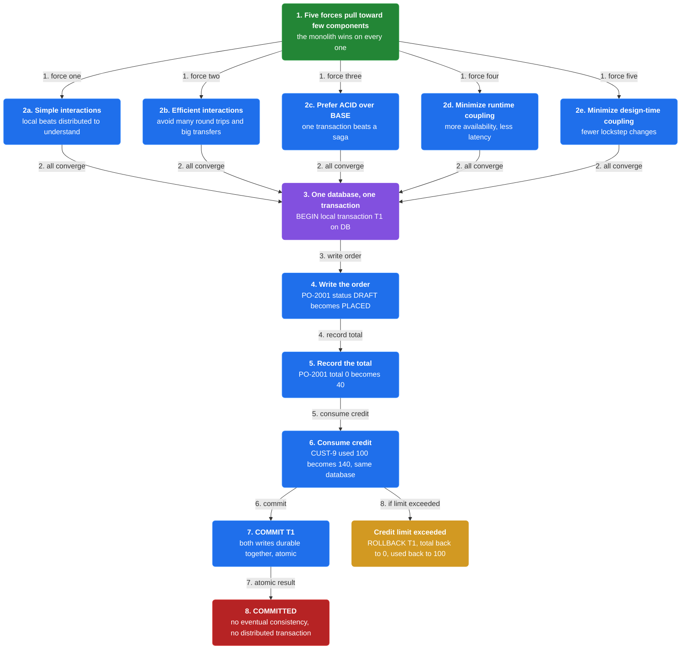
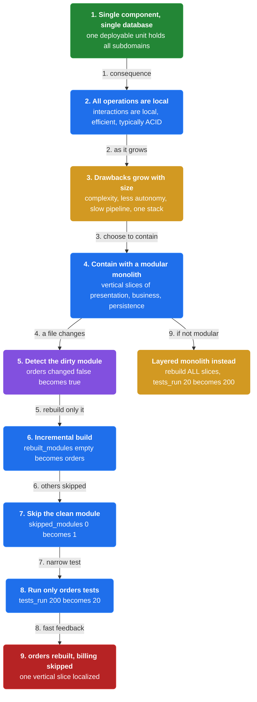

# Chapter 1: Monolithic Architecture

> Structure the application as a single deployable/executable component that uses a single database and contains all subdomains, so every operation is local.

_Also known as: Chris Richardson · Microservice Patterns Ch. 1 · microservices.io /patterns/monolithic.html_

## Flow

### Subdomains and operations

> **Why this matters:** The unit being organized is the subdomain — a slice of business functionality — and the behavior is a set of operations that mutate and query business entities.



1. **A subdomain is business functionality** — A subdomain is an implementable model of a slice of business functionality, a.k.a. a business capability.

2. **Business logic is entities plus adapters** — It consists of business logic — business entities (DDD aggregates) that implement business rules — plus adapters that communicate with the outside world.

3. **Operations are the behavior** — The subdomains implement the application's behavior, a set of system operations that mutate and query business entities.

4. **Operations arrive three ways** — An operation is invoked by a synchronous or asynchronous client request, by an event from another application or service, or by the passing of time.

```java
// ORDER SIDE — one operation runs entirely inside ONE component (no network hops)
// PARTIES: CLI = customer client · APP = the monolith · DB = its single database
// DEF: entity — a business entity (a DDD aggregate) that implements business rules and holds state; here order entity "PO-2001" = {status:"DRAFT"}
// DEF: inventory — the Inventory subdomain's stock, keyed by SKU; here inventory entity "SKU-77" = {qty:5}
// DEF: order — the Order subdomain's data, keyed by purchase-order id; here order "PO-2001" = {status:"DRAFT"}
// STATE (before):
//    order_entities : { "PO-2001": {status:"DRAFT"} }
//    inventory_entities : { "SKU-77": {qty:5} }
// DEF: placeOrder · CALLED BY: CLI sending a synchronous request to APP
// -> order_id : "PO-2001" · -> sku : "SKU-77" · -> qty : 2
//    step 1 · reserve stock : inventory_entities["SKU-77"].qty : 5 -> 3   BECAUSE the operation mutates the Inventory subdomain's entity
//    step 2 · mark the order : order_entities["PO-2001"].status : "DRAFT" -> "CONFIRMED"
//    step 3 · record the credit check : credit_check : "none" -> "approved"   BECAUSE the Credit subdomain runs in the same process
// <- order_status : "CONFIRMED" · 0 network hops (all subdomains share one component)
```

### The five dark energy forces

> **Why this matters:** Five forces push the architecture toward many small components; they are the reasons a monolith eventually hurts.



1. **Simple components** — Simple components consisting of few subdomains are easier to understand and maintain than complex components.

2. **Team autonomy** — A team needs to develop, test and deploy its software independently of other teams.

3. **Fast deployment pipeline** — Fast feedback and high deployment frequency require components that are fast to build and test.

4. **Support multiple technology stacks** — Subdomains are sometimes implemented in a variety of technologies, and developers need to evolve the stack.

5. **Segregate by characteristics** — Subdomains may need different resource, availability and security characteristics, so they should be segregable.

```java
// PIPELINE SIDE — one team's change rebuilds the ONE shared component
// PARTIES: TA = Team Orders · TBL = Team Billing · CI = the single pipeline
// STATE (before):
//    component : { subdomains: ["Orders","Billing"], artifact: "app.war" }
//    tests_run : 20
//    instances : 4
//    instances_restarted : 0
// DEF: change · CALLED BY: TA committing a one-line fix in the Orders subdomain
// -> commit : "fix tax rounding in Orders"
//    step 1 · rebuild the whole artifact : build_scope : "Orders only" -> "Orders + Billing (entire WAR)"
//    step 2 · rerun every subdomain's tests : tests_run : 20 -> 200   BECAUSE one artifact means every subdomain retests
//    step 3 · redeploy all instances : instances_restarted : 0 -> 4   BECAUSE a single WAR replaces every instance, including Billing's traffic
// <- release : "app.war" shipped · both teams' code goes out together
//    alt TBL has a broken test : TA's fix is blocked -> team autonomy lost
```

### The five dark matter forces

> **Why this matters:** Five opposing forces pull the architecture toward few components and local interactions; the monolith wins on every one of them.



1. **Simple interactions** — An operation that is local to a component, or a few simple interactions, is easier to understand and troubleshoot than a distributed one.

2. **Efficient interactions** — A distributed operation with many network round trips and large data transfers can be too inefficient.

3. **Prefer ACID over BASE** — It is easier to implement an operation as an ACID transaction than as an eventually consistent saga.

4. **Minimize runtime coupling** — Less runtime coupling maximizes availability and reduces the latency of an operation.

5. **Minimize design-time coupling** — Less design-time coupling reduces lockstep changes across services, which improves productivity.

```java
// DATABASE SIDE — one operation spanning two subdomains stays ACID in ONE database
// PARTIES: APP = the monolith · DB = its single database
// DEF: credit — the Credit subdomain's ledger, keyed by customer id; here credit entity "CUST-9" = {used:100}
// DEF: entity — a business entity (a DDD aggregate) that implements business rules and holds state; here order entity "PO-2001" = {status:"DRAFT", total:0}
// DEF: order — the Order subdomain's rows, keyed by purchase-order id; here order "PO-2001" = {status:"DRAFT", total:0}
// STATE (before):
//    order_entities : { "PO-2001": {status:"DRAFT", total:0} }
//    credit_entities : { "CUST-9": {used:100} }
// DEF: placeOrder · CALLED BY: APP, invoked synchronously
// -> order_id : "PO-2001" · -> customer : "CUST-9" · -> amount : 40
//    step 1 · BEGIN local transaction T1 on DB (a single transaction, not a saga)
//    step 2 · write the order : order_entities["PO-2001"].status : "DRAFT" -> "PLACED"
//    step 3 · record the total : order_entities["PO-2001"].total : 0 -> 40
//    step 4 · consume credit : credit_entities["CUST-9"].used : 100 -> 140   BECAUSE both subdomains' rows live in the one database
//    step 5 · COMMIT T1 -> both writes durable together (atomic)
// <- result : "COMMITTED" · no eventual consistency, no distributed transaction
//    alt credit limit exceeded : ROLLBACK T1 -> total back to 0 and used back to 100 (all-or-nothing)
```

### The monolith solution and its containment

> **Why this matters:** The single component resolves the dark matter forces but risks the dark energy ones; the craft is containing those risks as the app grows.



1. **Single component, single database** — Structure the application as one deployable/executable component using a single database, containing all subdomains.

2. **All operations are local** — Because there is a single component, interactions are local, efficient and typically ACID.

3. **Drawbacks grow with size** — The drawbacks — complexity, less team autonomy, a slow pipeline, one stack, no segregation — worsen as the app and team count grow.

4. **Contain with a modular monolith** — Organize subdomains into vertical slices of presentation, business and persistence logic, and speed up the pipeline.

```java
// BUILD SIDE — a modular monolith localizes a change to one vertical slice
// PARTIES: DEV = a developer in Team Orders · CI = build tool with incremental builds
// DEF: rebuilt — the modules recompiled in this build because only their files changed; here rebuilt = ["orders"]
// STATE (before):
//    modules : { "orders": {changed:false}, "billing": {changed:false} }
//    rebuilt_modules : []
//    skipped_modules : 0
//    tests_run : 200
// DEF: change · CALLED BY: DEV editing one file in the orders slice
// -> file : "orders/pricing.kt"
//    step 1 · detect the dirty module : modules["orders"].changed : false -> true
//    step 2 · incremental build : rebuilt_modules : [] -> ["orders"]   BECAUSE only the orders module changed
//    step 3 · skip the clean module : skipped_modules : 0 -> 1
//    step 4 · run only orders tests : tests_run : 200 -> 20   BECAUSE billing was not recompiled
// <- build : "orders" rebuilt · billing skipped
//    alt layered (non-modular) monolith : rebuild ALL slices -> tests_run : 20 -> 200 (back to full)
```


## Key Concepts

### The Problem

**All subdomains in one component.** The single component resolves the five dark matter forces — interactions stay local and efficient, ACID is easy, and there is no runtime or design-time coupling between components.


### The Solution

Structure the application as a single deployable/executable component that uses a single database and contains all of the application's subdomains.


### Key Facts

| Fact | Detail | In the wild |
|---|---|---|
| Single component + single database | Structure the application as a single deployable/executable component that uses a single database and contains all of the application's subdomains. | You can run multiple instances behind a load balancer to scale and improve availability. |
| The dark energy forces come back | A monolith is harder to understand and maintain, gives teams less autonomy, slows the deployment pipeline, locks in a single technology stack, and cannot segregate subdomains by their characteristics. | The deployment pipeline is potentially slow since there is a single large application that needs to be built and tested. |
| A modular monolith contains the damage | You can increase maintainability and team autonomy by organizing subdomains into vertical slices (presentation, business and persistence logic) and accelerate the pipeline with an automated merge queue, incremental builds, and parallelized build and test steps. | These mitigations reduce, but do not remove, the dark energy forces; the microservice architecture is the alternative pattern that addresses the limitations. |


### Tradeoffs & When

- A monolith is harder to understand and maintain, gives teams less autonomy, slows the deployment pipeline, locks in a single technology stack, and cannot segregate subdomains by their characteristics.
- You can increase maintainability and team autonomy by organizing subdomains into vertical slices (presentation, business and persistence logic) and accelerate the pipeline with an automated merge queue, incremental builds, and parallelized build and test steps.


<details><summary>All concepts (index)</summary>

### Problem: All subdomains in one component

**Why.** The monolithic architecture puts every subdomain into one deployable component, so no single team can evolve its slice in isolation.

**Claim.** The single component resolves the five dark matter forces — interactions stay local and efficient, ACID is easy, and there is no runtime or design-time coupling between components.

**Grounding.** The pattern's solution specifies a single deployable/executable component using a single database; all operations are local because there is a single component.

**In the wild.** Netflix, Amazon.com and eBay each began as monoliths, and most web applications before 2012 were built this way.
### Solution: Single component + single database

**Why.** Keeping all subdomains in one process and one database makes every operation a local call with no network round trips.

**Claim.** Structure the application as a single deployable/executable component that uses a single database and contains all of the application's subdomains.

**Grounding.** A Java web application ships as a single WAR file on a container such as Tomcat; a Rails application is a single directory hierarchy deployed via Phusion Passenger on Apache/Nginx or JRuby on Tomcat.

**In the wild.** You can run multiple instances behind a load balancer to scale and improve availability.
### Tradeoff: The dark energy forces come back

**Why.** As the application grows in size and in number of teams, the monolith's drawbacks become more severe.

**Claim.** A monolith is harder to understand and maintain, gives teams less autonomy, slows the deployment pipeline, locks in a single technology stack, and cannot segregate subdomains by their characteristics.

**Grounding.** The resulting-context drawbacks are that all teams share one code base and must coordinate, and one large application must be built and tested together.

**In the wild.** The deployment pipeline is potentially slow since there is a single large application that needs to be built and tested.
### Tradeoff: A modular monolith contains the damage

**Why.** The key challenge is minimizing the drawbacks rather than eliminating the monolith outright.

**Claim.** You can increase maintainability and team autonomy by organizing subdomains into vertical slices (presentation, business and persistence logic) and accelerate the pipeline with an automated merge queue, incremental builds, and parallelized build and test steps.

**Grounding.** The issues section lists modularizing the monolith and applying physical design principles to reduce build-time coupling.

**In the wild.** These mitigations reduce, but do not remove, the dark energy forces; the microservice architecture is the alternative pattern that addresses the limitations.

</details>


## Quiz

1. What is a subdomain in this pattern?

   - A. A deployable component that runs on Tomcat
   - B. An implementable model of a slice of business functionality
   - C. A load balancer in front of the monolith
   - D. A message broker that delivers events

<details><summary>Reveal answer</summary>

**B.** A subdomain is an implementable model of a slice of business functionality, a.k.a. a business capability — the unit the architecture organizes, not a deployment artifact or infrastructure (so A, C and D are wrong).

</details>

2. Which force is one of the five dark ENERGY forces?

   - A. Simple interactions
   - B. Efficient interactions
   - C. Team autonomy
   - D. Prefer ACID over BASE

<details><summary>Reveal answer</summary>

**C.** The five dark energy forces — simple components, team autonomy, fast deployment pipeline, multiple technology stacks, segregate by characteristics — push toward many components. Simple interactions, efficient interactions and ACID are dark matter forces that pull toward one component.

</details>

3. How are operations implemented in the monolithic solution?

   - A. As distributed sagas across services
   - B. As local operations, since there is a single component
   - C. Via an API gateway
   - D. As eventually consistent transactions

<details><summary>Reveal answer</summary>

**B.** Since there is a single component, all operations are local — no distributed transactions, API gateway or eventual consistency is needed inside the monolith, which is why A, C and D are wrong.

</details>

4. What happens to the monolith's drawbacks as the application grows?

   - A. They disappear because operations stay local
   - B. They become more severe as size and team count increase
   - C. They only affect the deployment pipeline
   - D. They are solved by running more instances

<details><summary>Reveal answer</summary>

**B.** The drawbacks (complexity, less team autonomy, slow pipeline, single stack, no segregation) become more severe as the application grows in size and complexity and the number of teams increases; running more instances only scales, it does not fix these.

</details>

