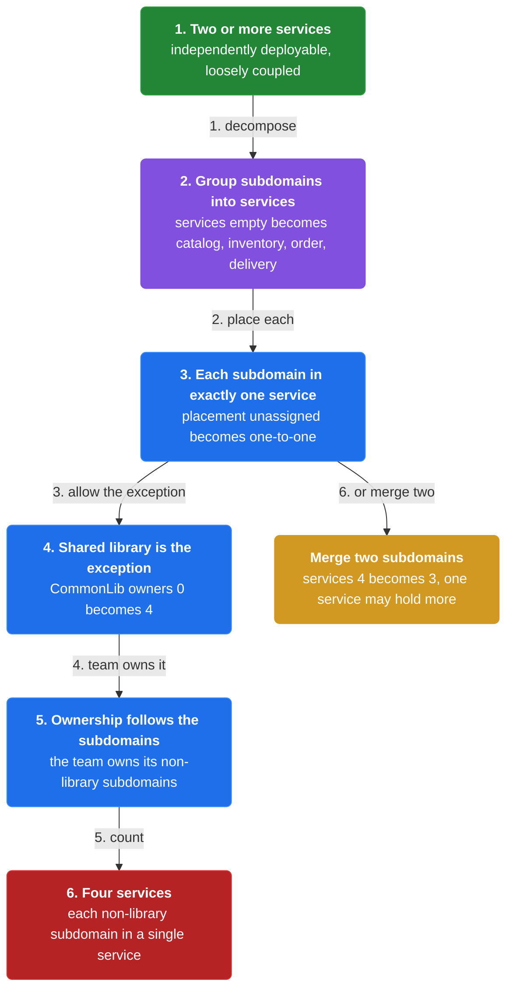
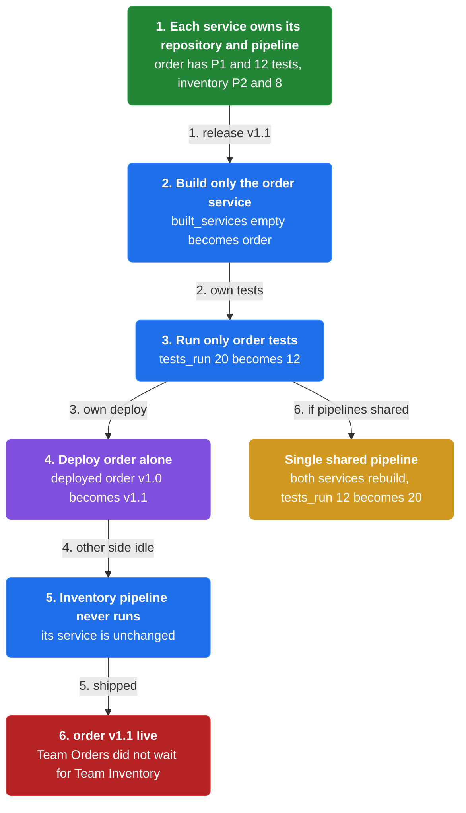
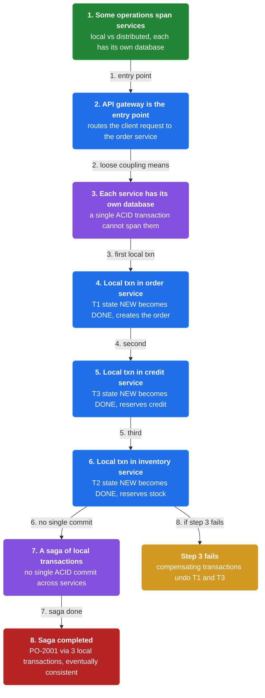
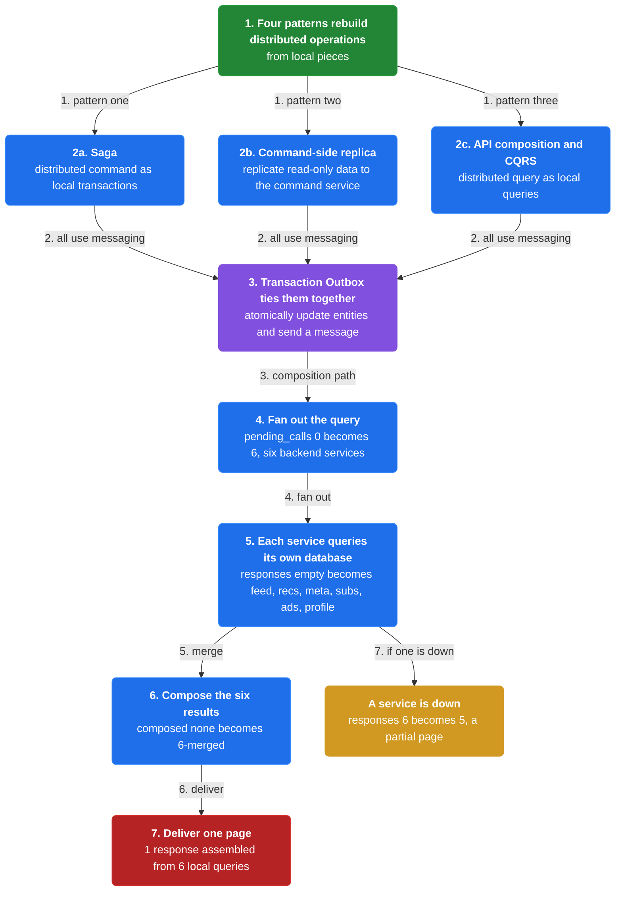
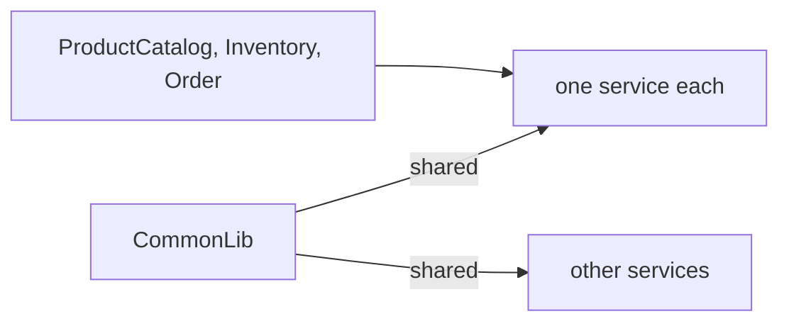
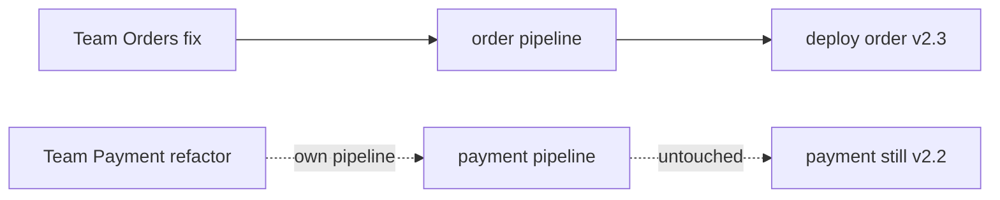
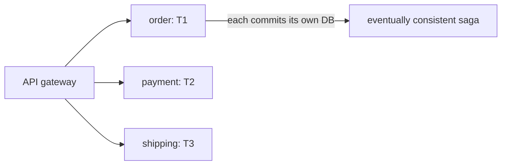
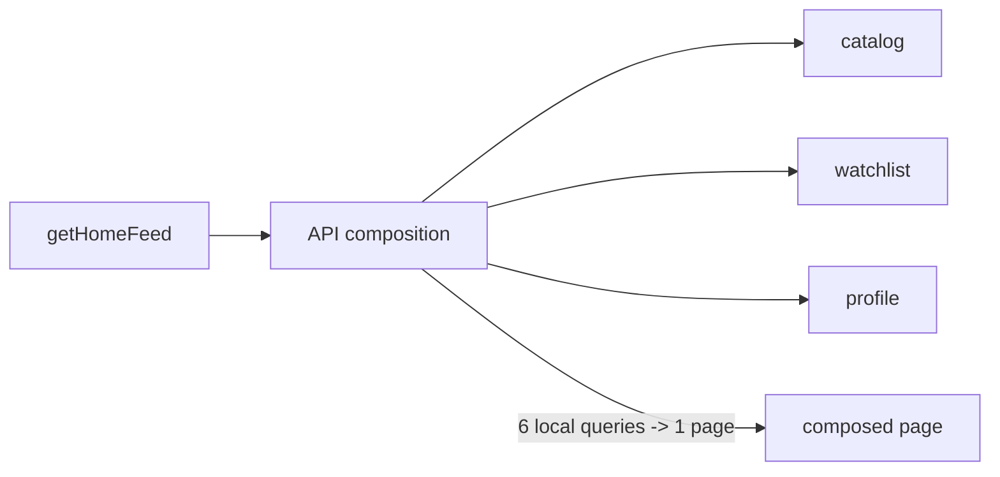

# Chapter 2: Microservice Architecture

> Structure the application as a set of two or more independently deployable, loosely coupled services, each owning one or more subdomains.

_Also known as: Chris Richardson · Microservice Patterns Ch. 2 · microservices.io /patterns/microservices.html_

## Flow

### Services group subdomains

> **Why this matters:** The microservice pattern turns the same subdomains into independently deployable services, with one rule about how subdomains may be shared.



1. **Two or more services** — Structure the application as a set of two or more independently deployable, loosely coupled components, a.k.a. services.

2. **Each service owns one or more subdomains** — A service consists of one or more subdomains, and each subdomain is part of a single service.

3. **Shared libraries are the exception** — A shared-library subdomain is the one subdomain that may be used by multiple services.

4. **Ownership follows the subdomains** — A service is owned by the team (or teams) that owns its non-library subdomains.

```java
// DESIGN SIDE — assign each subdomain to exactly one service (shared library excepted)
// PARTIES: ARC = architect applying the microservice pattern
// STATE (before):
//    subdomains : { "ProductCatalog":{type:"business"}, "Inventory":{type:"business"}, "Order":{type:"business"}, "Delivery":{type:"business"}, "CommonLib":{type:"library"} }
//    services : []
// DEF: decompose · CALLED BY: ARC grouping subdomains into services
// -> subdomain_list : ["ProductCatalog","Inventory","Order","Delivery","CommonLib"]
//    step 1 · create a service per business subdomain : services : [] -> ["catalog","inventory","order","delivery"]
//    step 2 · place each subdomain in exactly one service : placement : "unassigned" -> "one-to-one"
//    step 3 · share the library across services : CommonLib.owners : 0 -> 4   BECAUSE a shared-library subdomain is the one allowed exception used by multiple services
// <- service_count : 4 · each non-library subdomain belongs to a single service
//    alt merge two subdomains into one service : services : 4 -> 3  (a service may hold more than one subdomain)
```

### Independent deployability

> **Why this matters:** Independence is the whole point: each service gets its own repository and pipeline so teams ship without waiting on each other.



1. **Own source code repository** — To be independently deployable, each service typically has its own source code repository.

2. **Own deployment pipeline** — Each service also has its own deployment pipeline, which builds, tests and deploys the service.

3. **Teams ship independently** — A team can develop, test and deploy its service independently of other teams.

4. **Fast per-service feedback** — Each service is fast to test since it is relatively small, and can be deployed independently.

```java
// DEPLOY SIDE — two services ship independently through their own pipelines
// PARTIES: TO = Team Orders · TI = Team Inventory · P1 = order pipeline · P2 = inventory pipeline
// DEF: built — the services compiled in this release by their own pipeline; here built = ["order"]
// DEF: service — an independently deployable, loosely coupled component with its own repository and pipeline; here service "order" = "v1.0"
// STATE (before):
//    repos : { "order": {pipeline:"P1", tests:12}, "inventory": {pipeline:"P2", tests:8} }
//    deployed : { "order": "v1.0", "inventory": "v1.0" }
//    built_services : []
//    tests_run : 20
// DEF: release · CALLED BY: TO shipping order v1.1 while TI is mid-change
// -> change : "order v1.1"
//    step 1 · build only the order service : built_services : [] -> ["order"]
//    step 2 · run only order tests : tests_run : 20 -> 12   BECAUSE each service has its own pipeline and its own tests
//    step 3 · deploy order alone : deployed["order"] : "v1.0" -> "v1.1"
//    step 4 · inventory pipeline never runs (its service is unchanged)
// <- release : "order v1.1 live" · TO did not wait for TI
//    alt a single shared pipeline : both services rebuild -> tests_run : 12 -> 20 (lockstep)
```

### Distributed operations

> **Why this matters:** Some system operations are local to one service, but the ones that span services must be rebuilt from local transactions because each service has its own database.



1. **Local vs distributed operations** — Some system operations are local to a single service, while others are distributed across multiple services.

2. **Each service has its own database** — Loose coupling requires each service to have its own database, so a single ACID transaction cannot span services.

3. **A distributed operation is a saga** — A distributed command is implemented as a saga: a series of local transactions.

4. **The API gateway is the entry point** — An API gateway is typically the application's entry point, and it uses the service collaboration patterns for distributed operations.

```java
// ORDER SIDE — a distributed command spans three services as a saga of local transactions
// PARTIES: API = API gateway · OSV = order service · ISV = inventory service · CSV = credit service
// DEF: local — a transaction confined to one service and its own database, with no cross-service commit; here local txn "T1" = {service:"order", state:"NEW"}
// DEF: txn — a transaction, the atomic unit of work each service runs against its own database; here txn = "T1"
// STATE (before):
//    local_txns : { "T1": {service:"order", state:"NEW"}, "T2": {service:"inventory", state:"NEW"}, "T3": {service:"credit", state:"NEW"} }
// DEF: placeOrder · CALLED BY: API routing a client request to the order service
// -> order_id : "PO-2001" · -> amount : 40
//    step 1 · local txn in OSV : local_txns["T1"].state : "NEW" -> "DONE"  (creates the order)
//    step 2 · local txn in CSV : local_txns["T3"].state : "NEW" -> "DONE"  (reserves credit)
//    step 3 · local txn in ISV : local_txns["T2"].state : "NEW" -> "DONE"  (reserves stock)
//    step 4 · each service commits against its OWN database — no single ACID commit
// <- saga : "PO-2001" completed via 3 local transactions (eventually consistent, not ACID)
//    alt step 3 fails : compensating transactions undo T1 and T3 -> local_txns["T1"].state : "DONE" -> "UNDONE"
```

### The collaboration patterns and known uses

> **Why this matters:** Four patterns rebuild a distributed operation from local pieces, and the big web properties show them at scale.



1. **Saga** — Saga implements a distributed command as a series of local transactions.

2. **Command-side replica** — Command-side replica replicates read-only data to the service that implements a command.

3. **API composition and CQRS** — API composition and CQRS each implement a distributed query as a series of local queries.

4. **Transaction Outbox ties it together** — Saga, Command-side replica and CQRS use asynchronous messaging, and typically need the Transaction Outbox pattern to atomically update entities and send a message.

```java
// GATEWAY SIDE — one distributed query becomes a series of local queries (API composition)
// PARTIES: GW = API gateway · SVC1..SVC6 = six backend services, each with its own DB
// STATE (before):
//    responses : []
//    fanout : 6
//    delivered : 0
// DEF: getHomeFeed · CALLED BY: a client device requesting its feed
// -> device : "smart-tv-8001" · -> api_call : 1
//    step 1 · fan out the query : pending_calls : 0 -> 6   BECAUSE each API call fans out to an average of six backend services
//    step 2 · each service queries its OWN database : responses : [] -> ["feed","recs","meta","subs","ads","profile"]
//    step 3 · compose the six results : composed : "none" -> "6-merged"
//    step 4 · deliver one page : delivered : 0 -> 1
// <- page : 1 response assembled from 6 local queries (no shared database)
//    alt a service is down : responses : 6 -> 5 (a partial page — availability trades off)
```


## Interview Questions

### Q1

An architect is turning a monolith's subdomains into services and must decide which subdomains go into which service, and whether any may be shared.

**Interviewer's question:** How does the microservice architecture assign subdomains to services, and which single subdomain is allowed to be shared across services?

**Solution:** Each service owns one or more subdomains, each subdomain belongs to exactly one service, and only a shared-library subdomain may be used by many.

**System-design components:**
- Service — one or more subdomains
- Subdomain — belongs to a single service
- Shared-library subdomain — the one allowed exception
- Team ownership — follows the non-library subdomains



```java
// DESIGN SIDE — assign each subdomain to exactly one service; a shared library is the lone exception
// PARTIES: ARC = architect applying the microservice pattern
// STATE (before):
//    subdomains : { "ProductCatalog":{type:"business"}, "Inventory":{type:"business"}, "Order":{type:"business"}, "CommonLib":{type:"library"} }
//    services : []
// DEF: decompose · CALLED BY: ARC grouping subdomains into services
// -> subdomain_list : ["ProductCatalog","Inventory","Order","CommonLib"]
//    step 1 · create a service per business subdomain : services : [] -> ["catalog","inventory","order"]
//    step 2 · place each subdomain in exactly one service : placement : "unassigned" -> "one-to-one"
//    step 3 · share the library across all three : CommonLib.owners : 0 -> 3   BECAUSE a shared-library subdomain is the one allowed exception
// <- service_count : 3 · every non-library subdomain belongs to a single service
//    alt merge two subdomains : services : 3 -> 2  (a service may hold more than one subdomain)
```

_This is exactly the services-group-subdomains rule, including the shared-library exception, in this chapter._

_Covers:_ Services group subdomains

_From the 28 problems:_ 01-scale-from-zero-to-millions · 03-framework-for-system-design-interviews

### Q2

Team Orders wants to ship a fix while Team Payment is mid-refactor. Under the monolith both had to ship together; the lead asks what microservices change.

**Interviewer's question:** What makes a service independently deployable, and how does that let one team ship without waiting on another?

**Solution:** Each service gets its own source repository and its own build-test-deploy pipeline, so a team ships its service alone.

**System-design components:**
- Own source repository per service
- Own deployment pipeline
- Per-service tests
- Independent release



```java
// DEPLOY SIDE — a team ships its service alone through its own repository and pipeline
// PARTIES: TO = Team Orders · TP = Team Payment · P1 = order pipeline · P2 = payment pipeline
// STATE (before):
//    repos : { "order": {pipeline:"P1", tests:14}, "payment": {pipeline:"P2", tests:9} }
//    deployed : { "order": "v2.2", "payment": "v2.2" }
//    built_services : []
//    tests_run : 23
// DEF: release · CALLED BY: TO shipping order v2.3 while TP is mid-change
// -> change : "order v2.3"
//    step 1 · build only the order service : built_services : [] -> ["order"]
//    step 2 · run only order tests : tests_run : 23 -> 14   BECAUSE each service has its own pipeline and its own tests
//    step 3 · deploy order alone : deployed["order"] : "v2.2" -> "v2.3"
//    step 4 · payment pipeline never runs (its service is unchanged)
// <- release : "order v2.3 live" · TO did not wait for TP
//    alt one shared pipeline : both services rebuild -> tests_run : 14 -> 23 (lockstep)
```

_This is exactly independent deployability — own repo, own pipeline — in this chapter._

_Covers:_ Independent deployability

_From the 28 problems:_ 01-scale-from-zero-to-millions · 03-framework-for-system-design-interviews

### Q3

A 'checkout' command must now touch order, payment, and shipping services, each with its own database. The team realizes a single ACID commit no longer spans them.

**Interviewer's question:** Why can't one ACID transaction span services, and how is a distributed command implemented instead?

**Solution:** Loose coupling requires a database per service, so a distributed command becomes a saga — a series of local transactions, eventually consistent.

**System-design components:**
- Database per service
- Local transaction — confined to one service
- Saga — series of local transactions
- API gateway — the entry point



```java
// ORDER SIDE — a distributed command spans three services, each committing to its own database
// PARTIES: API = API gateway · OSV = order service · PSV = payment service · SSV = shipping service
// DEF: local — a transaction confined to one service and its own database; here local txn "T1" = {service:"order", state:"NEW"}
// STATE (before):
//    local_txns : { "T1": {service:"order", state:"NEW"}, "T2": {service:"payment", state:"NEW"}, "T3": {service:"shipping", state:"NEW"} }
// DEF: checkout · CALLED BY: API routing a client request to the order service
// -> order_id : "PO-8801" · -> amount : 25
//    step 1 · local txn in OSV : local_txns["T1"].state : "NEW" -> "DONE"  (creates the order)
//    step 2 · local txn in PSV : local_txns["T2"].state : "NEW" -> "DONE"  (charges the card)
//    step 3 · local txn in SSV : local_txns["T3"].state : "NEW" -> "DONE"  (schedules the shipment)
//    step 4 · each service commits against its OWN database — no single ACID commit
// <- saga : "PO-8801" completed via 3 local transactions (eventually consistent, not ACID)
//    alt step 3 fails : compensating transactions undo T1 and T2 -> local_txns["T1"].state : "DONE" -> "UNDONE"
```

_This is exactly the distributed-operation-to-saga move forced by a database per service._

_Covers:_ Distributed operations · The collaboration patterns and known uses

_From the 28 problems:_ 01-scale-from-zero-to-millions · 03-framework-for-system-design-interviews

### Q4

A client requests its home feed, which needs data from six services. The team asks how to build it without a shared database.

**Interviewer's question:** What are the four service collaboration patterns, and which ones implement a distributed query as a series of local queries?

**Solution:** Saga and Command-side replica serve distributed commands; API composition and CQRS serve distributed queries as local queries; all rely on Transaction Outbox for messaging.

**System-design components:**
- Saga — distributed command
- Command-side replica — replicated read data
- API composition + CQRS — distributed query
- Transaction Outbox — atomic publish



```java
// GATEWAY SIDE — one distributed query becomes a series of local queries (API composition)
// PARTIES: GW = API gateway · SVC1..SVC6 = six backend services, each with its own DB
// STATE (before):
//    responses : []
//    pending_calls : 0
//    fanout : 6
//    delivered : 0
// DEF: getHomeFeed · CALLED BY: a client device requesting its feed
// -> device : "tablet-4007" · -> api_call : 1
//    step 1 · fan out the query : pending_calls : 0 -> 6   BECAUSE each API call fans out to an average of six backend services
//    step 2 · each service queries its OWN database : responses : [] -> ["catalog","watchlist","ratings","search","profile","ads"]
//    step 3 · compose the six results : composed : "none" -> "6-merged"
//    step 4 · deliver one page : delivered : 0 -> 1
// <- page : 1 response assembled from 6 local queries (no shared database)
//    alt a service is down : responses : 6 -> 5 (a partial page — availability trades off)
```

_This is exactly the four collaboration patterns and API composition's local-query assembly in this chapter._

_Covers:_ The collaboration patterns and known uses · Distributed operations

_From the 28 problems:_ 01-scale-from-zero-to-millions · 03-framework-for-system-design-interviews

## Key Concepts

### The Problem

**Distributed operations replace local ones.** Some distributed operations are complex and hard to troubleshoot, potentially inefficient, and may need eventually consistent (non-ACID) transaction management.


### The Solution

Structure the application as a set of two or more independently deployable, loosely coupled services; each service owns one or more subdomains and typically has its own source repository and its own build, test and deploy pipeline.


### Key Facts

| Fact | Detail | In the wild |
|---|---|---|
| Independently deployable, loosely coupled services | Structure the application as a set of two or more independently deployable, loosely coupled services; each service owns one or more subdomains and typically has its own source repository and its own build, test and deploy pipeline. | Netflix, Amazon and eBay each evolved from a monolith into a service-oriented architecture of many backend services. |
| A database per service forces sagas | Distributed operations must be implemented as a series of local transactions, which is why the service collaboration patterns exist. | These patterns trade a single ACID commit for eventual consistency across services. |
| Four collaboration patterns rebuild the operation | Saga implements a distributed command as a series of local transactions; Command-side replica replicates read-only data to the command service; API composition and CQRS implement a distributed query as a series of local queries. | The choice between them is a core design challenge when defining a good service architecture. |


### Tradeoffs & When

- Distributed operations must be implemented as a series of local transactions, which is why the service collaboration patterns exist.
- Saga implements a distributed command as a series of local transactions; Command-side replica replicates read-only data to the command service; API composition and CQRS implement a distributed query as a series of local queries.


<details><summary>All concepts (index)</summary>

### Problem: Distributed operations replace local ones

**Why.** Splitting the application into services means some operations now span multiple services instead of running locally in one component.

**Claim.** Some distributed operations are complex and hard to troubleshoot, potentially inefficient, and may need eventually consistent (non-ACID) transaction management.

**Grounding.** The resulting-context drawbacks name complex, inefficient interactions and the need for non-ACID transactions because loose coupling requires each service to have its own database.

**In the wild.** Amazon.com's website application calls 100-150 services to build a single web page.
### Solution: Independently deployable, loosely coupled services

**Why.** Independent deployability is what lets small teams ship fast, so each service needs its own repository and pipeline.

**Claim.** Structure the application as a set of two or more independently deployable, loosely coupled services; each service owns one or more subdomains and typically has its own source repository and its own build, test and deploy pipeline.

**Grounding.** The solution states each subdomain is part of a single service except shared-library subdomains, and an API gateway is typically the entry point.

**In the wild.** Netflix, Amazon and eBay each evolved from a monolith into a service-oriented architecture of many backend services.
### Tradeoff: A database per service forces sagas

**Why.** Loose coupling requires each service to have its own database, so a single ACID transaction can no longer span services.

**Claim.** Distributed operations must be implemented as a series of local transactions, which is why the service collaboration patterns exist.

**Grounding.** The Saga, Command-side replica and CQRS patterns use asynchronous messaging and typically need the Transaction Outbox pattern to atomically update entities and send a message.

**In the wild.** These patterns trade a single ACID commit for eventual consistency across services.
### Tradeoff: Four collaboration patterns rebuild the operation

**Why.** A distributed operation still has to run somewhere, so the monolith's single operation is rebuilt from local pieces.

**Claim.** Saga implements a distributed command as a series of local transactions; Command-side replica replicates read-only data to the command service; API composition and CQRS implement a distributed query as a series of local queries.

**Grounding.** The issues section lists exactly these four service collaboration patterns.

**In the wild.** The choice between them is a core design challenge when defining a good service architecture.

</details>


## Quiz

1. What does the microservice architecture structure the application as?

   - A. A single deployable component with one database
   - B. A set of two or more independently deployable, loosely coupled services
   - C. A shared library used by one service
   - D. A load balancer with one instance

<details><summary>Reveal answer</summary>

**B.** The solution is a set of two or more independently deployable, loosely coupled services. A single component with one database is the monolith (A); C and D are not the pattern either.

</details>

2. Which subdomain is allowed to be used by multiple services?

   - A. A core subdomain
   - B. A generic subdomain
   - C. A shared-library subdomain
   - D. A supporting subdomain

<details><summary>Reveal answer</summary>

**C.** Each subdomain is part of a single service except shared-library subdomains, which may be used by multiple services. Core, generic and supporting are a different (DDD) classification, not the sharing rule.

</details>

3. Which service collaboration pattern implements a distributed query as a series of local queries?

   - A. Saga
   - B. API composition
   - C. Command-side replica
   - D. Transaction Outbox

<details><summary>Reveal answer</summary>

**B.** API composition (and CQRS) implement a distributed query as a series of local queries. Saga implements a distributed command; Command-side replica replicates read-only data; Transaction Outbox atomically publishes messages — so A, C and D are wrong.

</details>

4. On average, how many backend calls does each Netflix API call fan out to?

   - A. One
   - B. Two
   - C. Six
   - D. One hundred

<details><summary>Reveal answer</summary>

**C.** Netflix handles over a billion calls a day to its streaming API from over 800 device types, and each API call fans out to an average of six backend calls.

</details>

