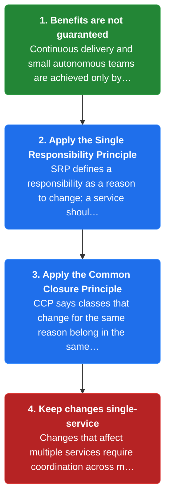
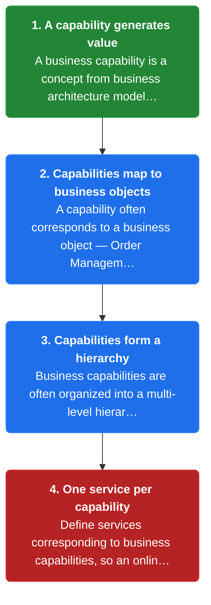
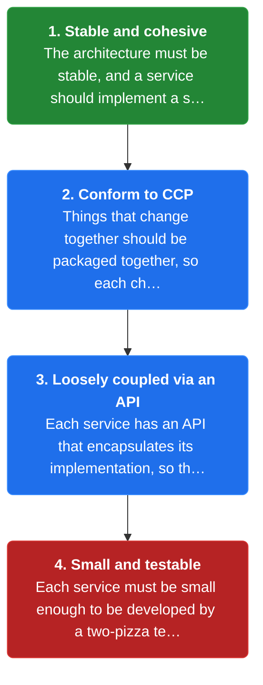
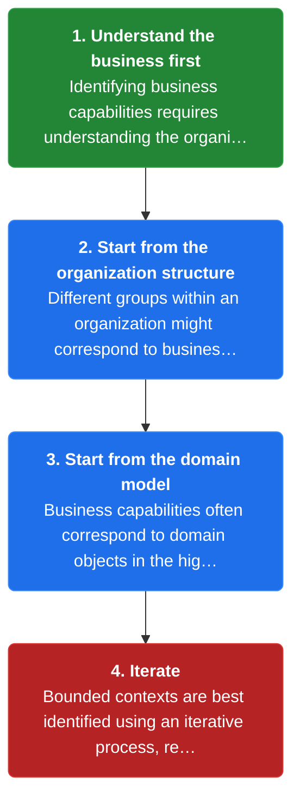

# Chapter 3: Decompose by Business Capability

> Define services corresponding to business capabilities — the things the business does in order to generate value.

_Also known as: Chris Richardson · Microservice Patterns Ch. 3 · microservices.io /patterns/decomposition/decompose-by-business-capability.html_

## Flow

### Why decomposition must be deliberate

> **Why this matters:** Microservice benefits are not automatic; they come only from a decomposition where each change touches one service — the goal of SRP and CCP.



1. **Benefits are not guaranteed** — Continuous delivery and small autonomous teams are achieved only by careful functional decomposition of the application into services.

2. **Apply the Single Responsibility Principle** — SRP defines a responsibility as a reason to change; a service should have one reason to change and implement a small set of strongly related functions.

3. **Apply the Common Closure Principle** — CCP says classes that change for the same reason belong in the same package, so a rule change touches only one service.

4. **Keep changes single-service** — Changes that affect multiple services require coordination across multiple teams, which slows development.

```java
// CHANGE SIDE — one business rule change must touch one service (CCP), not many
// PARTIES: DEV = developer · SVC_O = order service · SVC_I = inventory service · SVC_D = delivery service
// STATE (before):
//    change_impact : { "SVC_O":0, "SVC_I":0, "SVC_D":0 }
//    teams_to_coordinate : 0
// DEF: change · CALLED BY: DEV changing the tax rule
// -> rule : "tax_rule"
//    step 1 · locate the owning service : owner : "unknown" -> "SVC_O"   BECAUSE the rule is packaged with the code that changes with it (CCP)
//    step 2 · edit only that service : change_impact["SVC_O"] : 0 -> 1
//    step 3 · coordinate one team : teams_to_coordinate : 0 -> 1
// <- services_touched : 1 · teams_to_coordinate : 1
//    alt rule scattered across 3 services : services_touched : 1 -> 3 (three teams must coordinate)
```

### Business capabilities define the services

> **Why this matters:** A business capability is what the business does to generate value, and it often maps to a business object — a stable, natural service boundary.



1. **A capability generates value** — A business capability is a concept from business architecture modeling: something the business does in order to generate value.

2. **Capabilities map to business objects** — A capability often corresponds to a business object — Order Management is responsible for orders, Customer Management for customers.

3. **Capabilities form a hierarchy** — Business capabilities are often organized into a multi-level hierarchy, such as Product/Service development and Product/Service delivery.

4. **One service per capability** — Define services corresponding to business capabilities, so an online store gets product catalog, inventory, order and delivery services.

```java
// DECOMPOSITION SIDE — each business capability becomes one service
// PARTIES: ARC = architect · CAP = business-capability model
// STATE (before):
//    capabilities : { "product_catalog":{object:"Product"}, "inventory":{object:"Stock"}, "order":{object:"Order"}, "delivery":{object:"Shipment"} }
//    services : []
//    owners : {}
// DEF: decompose · CALLED BY: ARC mapping the online store's capabilities to services
// -> capability_set : ["product_catalog","inventory","order","delivery"]
//    step 1 · one service per capability : services : [] -> ["catalog","inventory","order","delivery"]
//    step 2 · attach the business object each capability manages : owners : {} -> {"catalog":"Product","inventory":"Stock","order":"Order","delivery":"Shipment"}
//    step 3 · place them under a top-level capability category : category : "none" -> "Product/Service delivery"   BECAUSE capabilities form a multi-level hierarchy
// <- service_count : 4 · each service corresponds to one business capability
//    alt merge delivery into order : services : 4 -> 3  (a capability group can map to one service)
```

### Forces the decomposition must satisfy

> **Why this matters:** A good decomposition keeps the architecture stable, services cohesive and loosely coupled, and each service small enough for a two-pizza team.



1. **Stable and cohesive** — The architecture must be stable, and a service should implement a small set of strongly related functions.

2. **Conform to CCP** — Things that change together should be packaged together, so each change affects only one service.

3. **Loosely coupled via an API** — Each service has an API that encapsulates its implementation, so the implementation can change without affecting clients.

4. **Small and testable** — Each service must be small enough to be developed by a two-pizza team of 6-10 people and be testable, with autonomous ownership.

```java
// SIZING SIDE — a service must fit a two-pizza team (6-10 people) and hide its implementation behind an API
// PARTIES: ORG = engineering org
// STATE (before):
//    team : { members: 2 }
//    service_api : { exposed: 0 }
// DEF: size_check · CALLED BY: ORG validating a proposed service boundary
// -> members : 2
//    step 1 · grow the team into the 6-10 band : team.members : 2 -> 7   BECAUSE a service must be developable by a two-pizza team of 6-10 people
//    step 2 · encapsulate the implementation : service_api.exposed : 0 -> 1   BECAUSE loose coupling needs an API the client calls, not internals
//    step 3 · confirm the service is testable at its size : testable : "unknown" -> "yes"
// <- verdict : "fits" · 7 members in [6,10] · implementation hidden behind an API
//    alt team stays at 2 : verdict : "fits" -> "split the service"  (two people cannot own a too-large service)
```

### Identifying the capabilities

> **Why this matters:** You find capabilities by understanding the business — its purpose, structure, processes and expertise — starting from the org structure and the domain model.



1. **Understand the business first** — Identifying business capabilities requires understanding the organization's purpose, structure, business processes and areas of expertise.

2. **Start from the organization structure** — Different groups within an organization might correspond to business capabilities or capability groups.

3. **Start from the domain model** — Business capabilities often correspond to domain objects in the high-level domain model.

4. **Iterate** — Bounded contexts are best identified using an iterative process, refining the boundaries over time.

```java
// IDENTIFICATION SIDE — find capabilities from the org structure and the domain model
// PARTIES: ARC = architect analyzing the organization
// STATE (before):
//    org_groups : { "Merchandising":{}, "Warehouse":{}, "Customer Service":{} }
//    domain_objects : { "Product":{}, "Order":{} }
//    capabilities : []
// DEF: identify · CALLED BY: ARC deriving capabilities from two starting points
// -> group : "Warehouse"
//    step 1 · map an org group to a capability : capabilities : [] -> ["inventory management"]
//    step 2 · cross-check the domain model : domain_objects["Order"].capability : "none" -> "order management"   BECAUSE capabilities often correspond to domain objects
//    step 3 · record the area of expertise : expertise : "none" -> "warehouse operations"   BECAUSE expertise marks a distinct capability area
// <- capabilities : ["inventory management","order management"] · found via org structure + domain model
//    alt a capability is missed : capabilities : 2 -> 3 on a later pass (identification is iterative)
```


## Key Concepts

### The Problem

**Microservice benefits are not automatic.** Careful functional decomposition into cohesive services is what actually enables independent deployment and small autonomous teams.


### The Solution

Define services corresponding to business capabilities; a capability often corresponds to a business object — Order Management is responsible for orders, Customer Management for customers.


### Key Facts

| Fact | Detail | In the wild |
|---|---|---|
| Services correspond to business capabilities | Define services corresponding to business capabilities; a capability often corresponds to a business object — Order Management is responsible for orders, Customer Management for customers. | An online store decomposes into product catalog, inventory, order and delivery management, each becoming a service. |
| Capabilities form a multi-level hierarchy | An enterprise application has top-level categories such as Product/Service development, Product/Service delivery and Demand generation, with finer capabilities nested beneath them. | Choosing too coarse a level merges capabilities; too fine a level fragments them. |
| Identifying capabilities takes business understanding | Capabilities are identified by analyzing the organization's purpose, structure, business processes and areas of expertise, using an iterative process. | Different groups within an organization might correspond to capabilities or capability groups. |


### Tradeoffs & When

- An enterprise application has top-level categories such as Product/Service development, Product/Service delivery and Demand generation, with finer capabilities nested beneath them.
- Capabilities are identified by analyzing the organization's purpose, structure, business processes and areas of expertise, using an iterative process.


<details><summary>All concepts (index)</summary>

### Problem: Microservice benefits are not automatic

**Why.** You get faster delivery only if you decompose the application into the right services; the benefits are not guaranteed by adopting microservices.

**Claim.** Careful functional decomposition into cohesive services is what actually enables independent deployment and small autonomous teams.

**Grounding.** The context states the two benefits are achieved only by careful functional decomposition, and applies SRP and CCP to service design.

**In the wild.** A change that touches several services forces coordination across several teams, which slows development.
### Solution: Services correspond to business capabilities

**Why.** A business capability is a stable, value-generating unit of the business, so it makes a stable boundary for a service.

**Claim.** Define services corresponding to business capabilities; a capability often corresponds to a business object — Order Management is responsible for orders, Customer Management for customers.

**Grounding.** The solution defines a business capability as something a business does to generate value, drawn from business architecture modeling.

**In the wild.** An online store decomposes into product catalog, inventory, order and delivery management, each becoming a service.
### Tradeoff: Capabilities form a multi-level hierarchy

**Why.** Capabilities are not flat; they are organized into a hierarchy, so the depth you pick determines service size.

**Claim.** An enterprise application has top-level categories such as Product/Service development, Product/Service delivery and Demand generation, with finer capabilities nested beneath them.

**Grounding.** The solution states business capabilities are often organized into a multi-level hierarchy.

**In the wild.** Choosing too coarse a level merges capabilities; too fine a level fragments them.
### Tradeoff: Identifying capabilities takes business understanding

**Why.** You cannot derive capabilities from code alone; you must understand what the business does.

**Claim.** Capabilities are identified by analyzing the organization's purpose, structure, business processes and areas of expertise, using an iterative process.

**Grounding.** The issues section lists organization structure and the high-level domain model as starting points, and notes capabilities often correspond to domain objects.

**In the wild.** Different groups within an organization might correspond to capabilities or capability groups.

</details>


## Quiz

1. What is a business capability?

   - A. A technical layer such as the database
   - B. Something the business does in order to generate value
   - C. A two-pizza team of 6-10 people
   - D. A deployment pipeline

<details><summary>Reveal answer</summary>

**B.** A business capability is a concept from business architecture modeling: something the business does in order to generate value. The other options are engineering artifacts, not capabilities.

</details>

2. Applying the Single Responsibility Principle to a service means it should...

   - A. have one reason to change and implement a small set of strongly related functions
   - B. share one database with every other service
   - C. be deployed by every team
   - D. expose no API

<details><summary>Reveal answer</summary>

**A.** SRP defines a responsibility as a reason to change; a service should have only one reason to change and be cohesive. Sharing a database, cross-team deployment and hiding the API all contradict the pattern's forces.

</details>

3. The Common Closure Principle states that...

   - A. classes that change for the same reason should be in the same package
   - B. every service must have its own database
   - C. teams must be collocated
   - D. changes must be deployed weekly

<details><summary>Reveal answer</summary>

**A.** CCP states that classes that change for the same reason should be in the same package, so each change touches only one service. The other options are not part of CCP.

</details>

4. Good starting points for identifying business capabilities are...

   - A. the network topology and the load balancer
   - B. the organization structure and the high-level domain model
   - C. the CI pipeline and the merge queue
   - D. the frontend framework and the database vendor

<details><summary>Reveal answer</summary>

**B.** The issues section names organization structure and the high-level domain model as starting points. The other options describe infrastructure, not sources of business capability boundaries.

</details>

