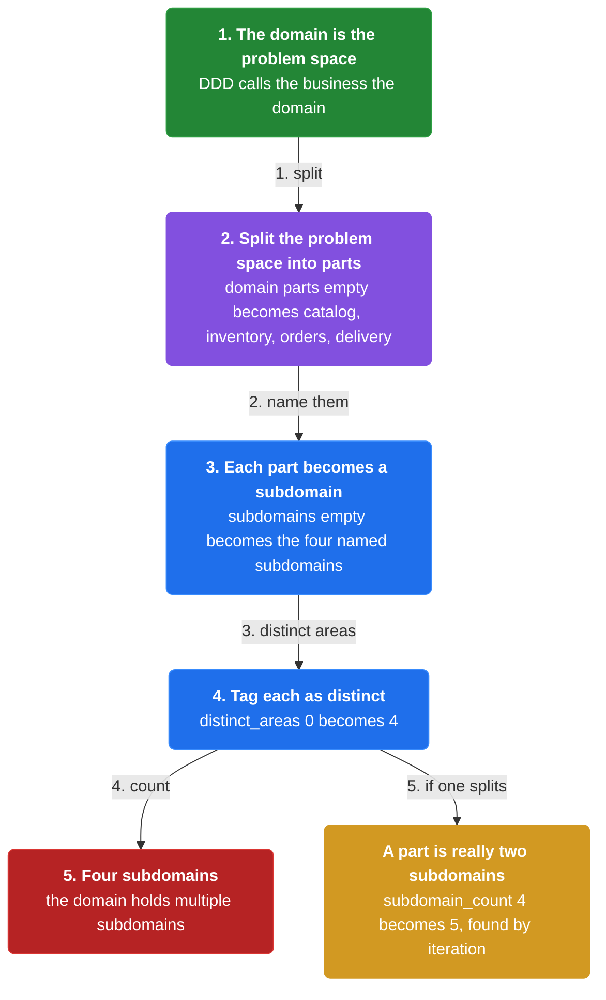
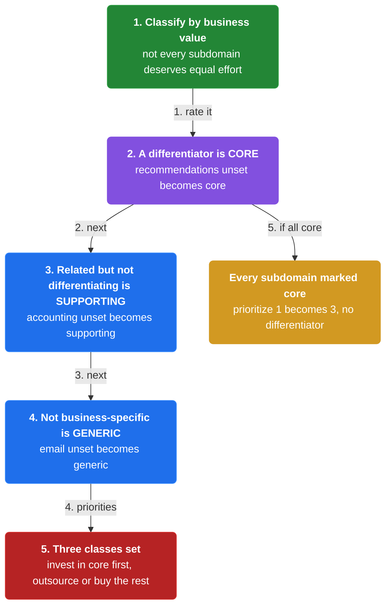
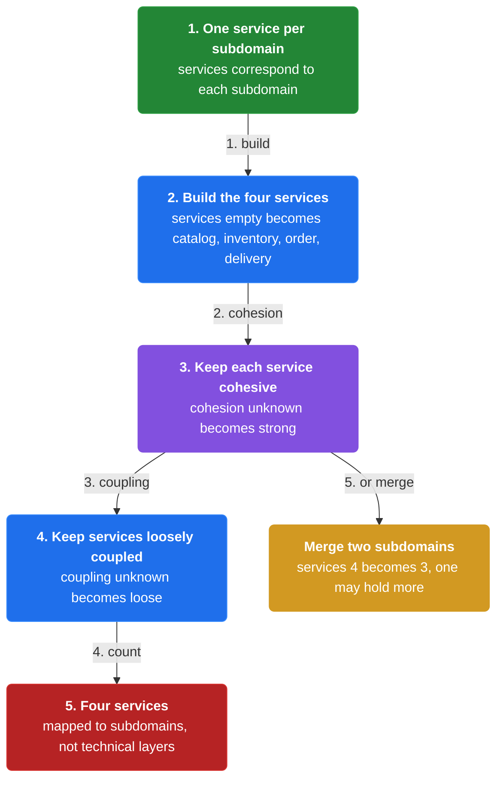
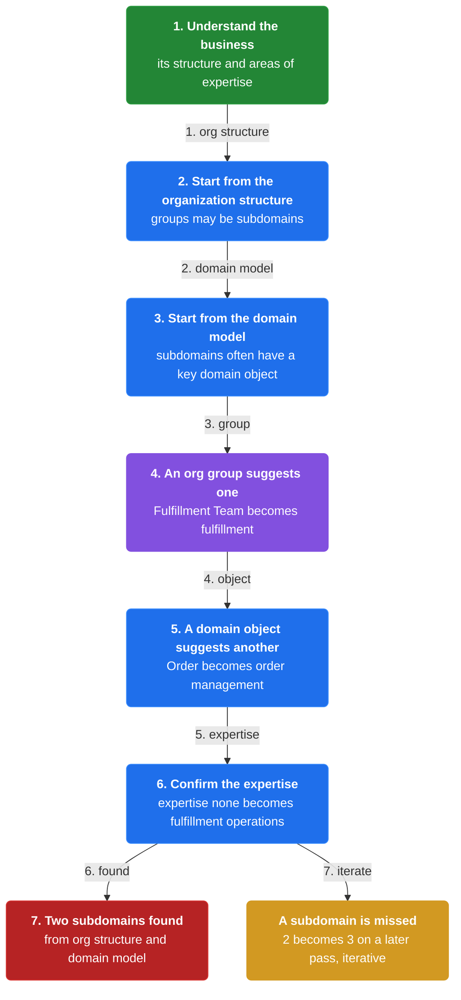
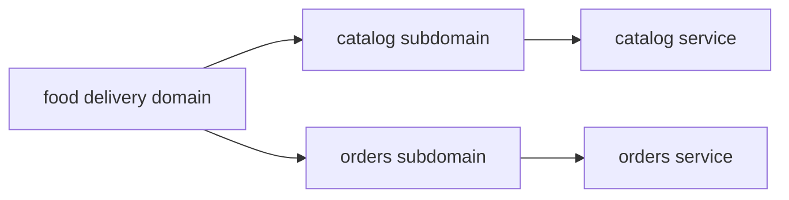
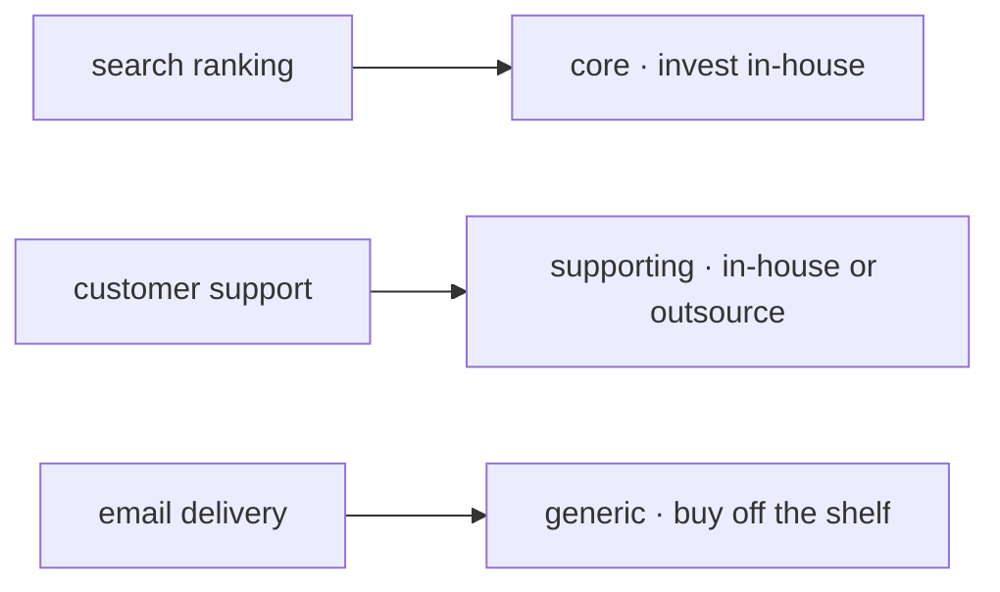
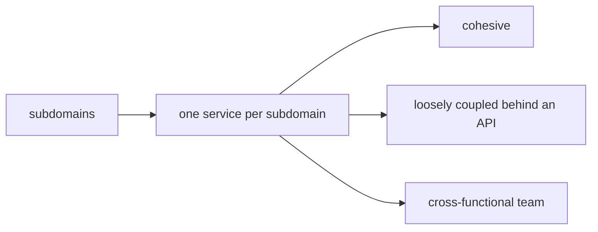
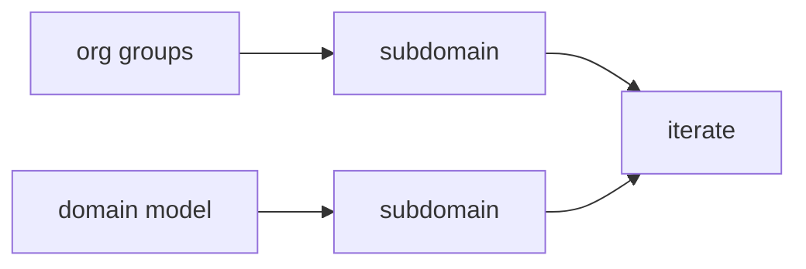

# Chapter 4: Decompose by Subdomain

> Define services corresponding to Domain-Driven Design subdomains — distinct parts of the business, classified as core, supporting, or generic.

_Also known as: Chris Richardson · Microservice Patterns Ch. 4 · microservices.io /patterns/decomposition/decompose-by-subdomain.html_

## Flow

### The domain and its subdomains

> **Why this matters:** DDD calls the application's problem space the domain, and its parts are subdomains — the boundaries this pattern turns into services.



1. **The domain is the problem space** — DDD refers to the application's problem space — the business — as the domain.

2. **A domain has multiple subdomains** — A domain consists of multiple subdomains, and each subdomain corresponds to a different part of the business.

3. **Subdomains are the service boundaries** — Define services corresponding to DDD subdomains, so each part of the business becomes a service.

4. **An online store example** — The subdomains of an online store include product catalog, inventory management, order management and delivery management.

```java
// DECOMPOSITION SIDE — the DDD domain (the business) splits into subdomains
// PARTIES: ARC = architect · DOM = the domain (the application's problem space)
// STATE (before):
//    domain : { parts: [] }
//    subdomains : []
// DEF: split · CALLED BY: ARC modeling the domain of an online store
// -> domain : "online store"
//    step 1 · split the problem space into parts : domain.parts : [] -> ["catalog","inventory","orders","delivery"]
//    step 2 · each part becomes a subdomain : subdomains : [] -> ["product catalog","inventory management","order management","delivery management"]
//    step 3 · tag each as a distinct part of the business : distinct_areas : 0 -> 4   BECAUSE each subdomain corresponds to a different part of the business
// <- subdomain_count : 4 · the domain holds multiple subdomains
//    alt a part is really two subdomains : subdomain_count : 4 -> 5 (a subdomain is found by iteration)
```

### Classify each subdomain

> **Why this matters:** Not every subdomain deserves the same investment, so DDD classifies them by business value before you build.



1. **Core subdomains** — Core subdomains are the key differentiator for the business and the most valuable part of the application.

2. **Supporting subdomains** — Supporting subdomains relate to what the business does but are not a differentiator; they can be implemented in-house or outsourced.

3. **Generic subdomains** — Generic subdomains are not specific to the business and are ideally implemented using off-the-shelf software.

4. **Invest where it matters** — The classification tells you where to concentrate in-house effort versus outsource or buy.

```java
// CLASSIFICATION SIDE — each subdomain is core, supporting, or generic
// PARTIES: ARC = architect · BIZ = the business
// STATE (before):
//    subdomains : { "recommendations":{class:"unset"}, "accounting":{class:"unset"}, "email":{class:"unset"} }
// DEF: classify · CALLED BY: ARC rating each subdomain's value to the business
// -> subdomain : "recommendations"
//    step 1 · a differentiator is CORE : subdomains["recommendations"].class : "unset" -> "core"   BECAUSE it is the key differentiator and most valuable part
//    step 2 · related-but-not-differentiating is SUPPORTING : subdomains["accounting"].class : "unset" -> "supporting"  (in-house or outsourced)
//    step 3 · not business-specific is GENERIC : subdomains["email"].class : "unset" -> "generic"   BECAUSE it should be bought off the shelf
// <- classes : "core","supporting","generic" · investment priority: core first
//    alt every subdomain marked core : prioritize : 1 -> 3 (no differentiator is wrong — value is what matters)
```

### Map subdomains to services

> **Why this matters:** Each subdomain becomes one service, keeping the result cohesive and loosely coupled — the same forces as business-capability decomposition.



1. **One service per subdomain** — The corresponding microservice architecture has services corresponding to each subdomain.

2. **Cohesive services** — Each service implements a small set of strongly related functions, so services are cohesive.

3. **Loosely coupled services** — Each service encapsulates its implementation behind an API, so services are loosely coupled.

4. **Teams around business value** — Development teams are cross-functional, autonomous and organized around delivering business value rather than technical features.

```java
// MAPPING SIDE — each subdomain of the online store becomes one service
// PARTIES: ARC = architect
// STATE (before):
//    subdomains : ["product catalog","inventory management","order management","delivery management"]
//    services : []
// DEF: map · CALLED BY: ARC turning subdomains into services
// -> subdomain_list : ["product catalog","inventory management","order management","delivery management"]
//    step 1 · one service per subdomain : services : [] -> ["catalog","inventory","order","delivery"]
//    step 2 · keep each service cohesive : cohesion : "unknown" -> "strong"   BECAUSE each service is one subdomain with one set of functions
//    step 3 · keep services loosely coupled : coupling : "unknown" -> "loose"   (each service owns its subdomain's model)
//    step 4 · a client query is served by the service owning that subdomain : query "GET /orders/O-1" -> served by "order"   BECAUSE order management maps to the order service
// <- service_count : 4 · services correspond to subdomains, not to technical layers · queries route to the owning service (read path)
//    alt merge two subdomains : services : 4 -> 3  (a service may contain more than one subdomain)
```

### Identifying the subdomains

> **Why this matters:** Like business capabilities, subdomains are found by analyzing the business and its structure, starting from the org structure and the domain model.



1. **Understand the business** — Identifying subdomains requires understanding the business, its organizational structure and the different areas of expertise.

2. **Start from the organization structure** — Different groups within an organization might correspond to subdomains.

3. **Start from the domain model** — Subdomains often have a key domain object in the high-level domain model.

4. **Iterate** — Subdomains are best identified using an iterative process, refining boundaries over time.

```java
// IDENTIFICATION SIDE — find subdomains from the org structure and the domain model
// PARTIES: ARC = architect
// DEF: domain — the business problem space DDD decomposes into subdomains; here the online store, whose key domain objects are "Order" and "Product"
// DEF: model — the high-level domain model holding the key domain objects that suggest subdomains; here { "Order":{}, "Product":{} } = 2 objects
// DEF: org — the organization structure whose groups may correspond to subdomains; here { "Catalog Team":{}, "Fulfillment Team":{} } = 2 groups
// STATE (before):
//    org_groups : { "Catalog Team":{}, "Fulfillment Team":{} }
//    domain_model : { "Order":{}, "Product":{} }
//    subdomains : []
// DEF: identify · CALLED BY: ARC deriving subdomains from two starting points
// -> group : "Fulfillment Team"
//    step 1 · an org group suggests a subdomain : subdomains : [] -> ["fulfillment"]
//    step 2 · a key domain object suggests another : domain_model["Order"].subdomain : "none" -> "order management"   BECAUSE subdomains often have a key domain object
//    step 3 · confirm the area of expertise : expertise : "none" -> "fulfillment operations"   BECAUSE areas of expertise mark distinct subdomains
// <- subdomains : ["fulfillment","order management"] · found from org structure + domain model
//    alt a subdomain is missed : subdomains : 2 -> 3 on a later pass (identification is iterative)
```


## Interview Questions

### Q1

A food-delivery startup is one codebase. The architect wants service boundaries that match how the business actually thinks about itself, not technical layers.

**Interviewer's question:** In DDD terms, what is the domain, how do its subdomains relate to the business, and how do they become service boundaries?

**Solution:** The domain is the problem space — the business itself; a domain consists of multiple subdomains, each a different part of the business, and each subdomain becomes one service.

**System-design components:**
- Domain — the problem space
- Subdomain — a distinct part of the business
- One service per subdomain



```java
// DECOMPOSITION SIDE — the DDD domain (the business) splits into subdomains, each becoming a service
// PARTIES: ARC = architect · DOM = the domain (the application's problem space)
// STATE (before):
//    domain : { parts: [] }
//    subdomains : []
//    services : []
// DEF: split · CALLED BY: ARC modeling the domain of a food-delivery business
// -> domain : "food delivery"
//    step 1 · split the problem space into parts : domain.parts : [] -> ["catalog","kitchen","orders","riders"]
//    step 2 · each part becomes a subdomain : subdomains : [] -> ["restaurant catalog","kitchen operations","order management","rider dispatch"]
//    step 3 · each subdomain becomes a service : services : [] -> ["catalog","kitchen","order","dispatch"]
//    step 4 · count the distinct parts : distinct_areas : 0 -> 4   BECAUSE each subdomain corresponds to a different part of the business
// <- service_count : 4 · the domain holds multiple subdomains, one service each
//    alt a part is really two subdomains : service_count : 4 -> 5 (a subdomain is found by iteration)
```

_This is exactly the domain/subdomain definition and the one-service-per-subdomain mapping in this chapter._

_Covers:_ The domain and its subdomains

_From the 28 problems:_ 01-scale-from-zero-to-millions · 03-framework-for-system-design-interviews

### Q2

The delivery team must decide where to pour in-house effort. It lists three candidates: the search-ranking engine, the customer-support tools, and the email delivery pipeline.

**Interviewer's question:** How do the core, supporting, and generic classifications tell the team where to concentrate effort versus outsource or buy?

**Solution:** Core subdomains are the key differentiator and most valuable; supporting relate to the business but are not differentiators; generic are not business-specific and are ideally bought off the shelf.

**System-design components:**
- Core — key differentiator
- Supporting — related but not differentiating
- Generic — off-the-shelf software



```java
// CLASSIFICATION SIDE — each subdomain is core, supporting, or generic, deciding the investment
// PARTIES: ARC = architect · BIZ = the business
// STATE (before):
//    subdomains : { "search ranking":{class:"unset"}, "customer support":{class:"unset"}, "email delivery":{class:"unset"} }
//    investment : {}
// DEF: classify · CALLED BY: ARC rating each subdomain's value to the business
// -> subdomain : "search ranking"
//    step 1 · a differentiator is CORE : subdomains["search ranking"].class : "unset" -> "core"   BECAUSE it is the key differentiator and most valuable part
//    step 2 · related-but-not-differentiating is SUPPORTING : subdomains["customer support"].class : "unset" -> "supporting"
//    step 3 · not business-specific is GENERIC : subdomains["email delivery"].class : "unset" -> "generic"   BECAUSE it is ideally bought off the shelf
//    step 4 · route the effort : investment : {} -> {"search ranking":"in-house","customer support":"in-house or outsource","email delivery":"buy"}
// <- classes : "core","supporting","generic" · investment priority: core first
//    alt every subdomain marked core : investment : 1 -> 3 core entries (no differentiator is wrong — value decides)
```

_This is exactly the three-way DDD classification and its investment consequence in this chapter._

_Covers:_ Classify each subdomain

_From the 28 problems:_ 01-scale-from-zero-to-millions · 03-framework-for-system-design-interviews

### Q3

With subdomains identified, the architect maps each to a service and insists the result stay cohesive, loosely coupled, and owned by teams organized around business value.

**Interviewer's question:** When mapping subdomains to services, what properties must the resulting services have, and how are teams organized?

**Solution:** Each subdomain becomes one service; services stay cohesive and loosely coupled behind an API, and teams are cross-functional and organized around delivering business value.

**System-design components:**
- One service per subdomain
- Cohesive services
- Loosely coupled services behind an API
- Cross-functional teams around business value



```java
// MAPPING SIDE — each subdomain of the food-delivery business becomes one cohesive, loosely coupled service
// PARTIES: ARC = architect
// STATE (before):
//    subdomains : ["restaurant catalog","kitchen operations","order management","rider dispatch"]
//    services : []
//    coupling : "unset"
// DEF: map · CALLED BY: ARC turning subdomains into services
// -> subdomain_list : ["restaurant catalog","kitchen operations","order management","rider dispatch"]
//    step 1 · one service per subdomain : services : [] -> ["catalog","kitchen","order","dispatch"]
//    step 2 · keep each service cohesive : cohesion : "unknown" -> "strong"   BECAUSE each service is one subdomain with one set of functions
//    step 3 · keep services loosely coupled : coupling : "unset" -> "loose"   BECAUSE each service encapsulates its implementation behind an API
//    step 4 · organize teams around value : team_focus : "technical layer" -> "business value"
// <- service_count : 4 · services correspond to subdomains, not to technical layers
//    alt merge two subdomains : services : 4 -> 3  (a service may contain more than one subdomain)
```

_This is exactly the one-service-per-subdomain mapping and its cohesion, coupling, and team forces in this chapter._

_Covers:_ Map subdomains to services

_From the 28 problems:_ 01-scale-from-zero-to-millions · 03-framework-for-system-design-interviews

### Q4

The architect has no written list of subdomains. She starts from the company's org groups and the high-level domain model to find them.

**Interviewer's question:** What are the two starting points for identifying subdomains, and why is the process iterative?

**Solution:** Start from the organization structure and the high-level domain model — subdomains often have a key domain object — then refine the boundaries iteratively.

**System-design components:**
- Organization structure
- High-level domain model
- Areas of expertise
- Iterative refinement



```java
// IDENTIFICATION SIDE — find subdomains from the org structure and the domain model
// PARTIES: ARC = architect analyzing the business
// DEF: domain — the business problem space DDD decomposes into subdomains; here food delivery, whose key domain objects are "Menu" and "Delivery"
// DEF: org — the organization structure whose groups may correspond to subdomains; here { "Kitchen Ops":{}, "Dispatch Team":{} } = 2 groups
// STATE (before):
//    org_groups : { "Kitchen Ops":{}, "Dispatch Team":{} }
//    domain_model : { "Menu":{}, "Delivery":{} }
//    subdomains : []
// DEF: identify · CALLED BY: ARC deriving subdomains from two starting points
// -> group : "Dispatch Team"
//    step 1 · an org group suggests a subdomain : subdomains : [] -> ["rider dispatch"]
//    step 2 · a key domain object suggests another : domain_model["Menu"].subdomain : "none" -> "restaurant catalog"   BECAUSE subdomains often have a key domain object
//    step 3 · confirm the area of expertise : expertise : "none" -> "dispatching operations"   BECAUSE areas of expertise mark distinct subdomains
// <- subdomains : ["rider dispatch","restaurant catalog"] · found from org structure + domain model
//    alt a subdomain is missed : subdomains : 2 -> 3 on a later pass (identification is iterative)
```

_This is exactly the two starting points and the iterative identification process in this chapter._

_Covers:_ Identifying the subdomains

_From the 28 problems:_ 01-scale-from-zero-to-millions · 03-framework-for-system-design-interviews

## Key Concepts

### The Problem

**The same decomposition question, a DDD lens.** The benefits of microservices still require careful functional decomposition; SRP and CCP still apply to the resulting services.


### The Solution

Define services corresponding to DDD subdomains; a domain consists of multiple subdomains, each corresponding to a different part of the business.


### Key Facts

| Fact | Detail | In the wild |
|---|---|---|
| Services correspond to DDD subdomains | Define services corresponding to DDD subdomains; a domain consists of multiple subdomains, each corresponding to a different part of the business. | An online store's subdomains include product catalog, inventory management, order management and delivery management. |
| Classify each subdomain: core, supporting, generic | Core subdomains are the key differentiator and most valuable; supporting subdomains relate to the business but are not differentiators; generic subdomains are not business-specific and are ideally bought off the shelf. | The classification tells you where to concentrate in-house effort versus outsource or buy. |
| Identifying subdomains needs the business | Subdomains are identified by analyzing the business, its organizational structure and its areas of expertise, iteratively. | Different groups in the organization might correspond to subdomains. |


### Tradeoffs & When

- Core subdomains are the key differentiator and most valuable; supporting subdomains relate to the business but are not differentiators; generic subdomains are not business-specific and are ideally bought off the shelf.
- Subdomains are identified by analyzing the business, its organizational structure and its areas of expertise, iteratively.


<details><summary>All concepts (index)</summary>

### Problem: The same decomposition question, a DDD lens

**Why.** Decomposing into services is still unsolved, but now the business is modeled the way DDD describes it — as a domain of subdomains.

**Claim.** The benefits of microservices still require careful functional decomposition; SRP and CCP still apply to the resulting services.

**Grounding.** The context is the same as decompose-by-business-capability: small 6-10 person teams, one or more services each, benefits not automatic.

**In the wild.** A service must stay small enough to be developed by a two-pizza team and be testable.
### Solution: Services correspond to DDD subdomains

**Why.** DDD calls the application's problem space the domain, and its parts are subdomains — natural service boundaries.

**Claim.** Define services corresponding to DDD subdomains; a domain consists of multiple subdomains, each corresponding to a different part of the business.

**Grounding.** The solution states each subdomain corresponds to a different part of the business.

**In the wild.** An online store's subdomains include product catalog, inventory management, order management and delivery management.
### Tradeoff: Classify each subdomain: core, supporting, generic

**Why.** Not every subdomain deserves the same investment, so DDD classifies them by business value.

**Claim.** Core subdomains are the key differentiator and most valuable; supporting subdomains relate to the business but are not differentiators; generic subdomains are not business-specific and are ideally bought off the shelf.

**Grounding.** The solution gives exactly this three-way classification.

**In the wild.** The classification tells you where to concentrate in-house effort versus outsource or buy.
### Tradeoff: Identifying subdomains needs the business

**Why.** Like capabilities, subdomains are found by understanding the business, not by reading code.

**Claim.** Subdomains are identified by analyzing the business, its organizational structure and its areas of expertise, iteratively.

**Grounding.** The issues section names organization structure and the high-level domain model — where subdomains often have a key domain object — as starting points.

**In the wild.** Different groups in the organization might correspond to subdomains.

</details>


## Quiz

1. In DDD, what is the domain?

   - A. The application's database
   - B. The application's problem space — the business
   - C. A network of services
   - D. A deployment artifact

<details><summary>Reveal answer</summary>

**B.** DDD refers to the application's problem space — the business — as the domain. The database, network and deployment artifact are technical, not the domain.

</details>

2. Which subdomain class is the key differentiator and most valuable part of the application?

   - A. Core
   - B. Supporting
   - C. Generic
   - D. Shared library

<details><summary>Reveal answer</summary>

**A.** Core subdomains are the key differentiator for the business and the most valuable part of the application. Supporting and generic are lower-value, and shared library is not a DDD class.

</details>

3. Which subdomain class is ideally implemented with off-the-shelf software?

   - A. Core
   - B. Supporting
   - C. Generic
   - D. In-house

<details><summary>Reveal answer</summary>

**C.** Generic subdomains are not specific to the business and are ideally implemented using off-the-shelf software. Core and supporting are business-related (in-house or outsourced), so A, B and D are wrong.

</details>

4. Good starting points for identifying subdomains are...

   - A. organization structure and the high-level domain model
   - B. the API gateway and the message broker
   - C. the CI pipeline and the cache
   - D. the UI framework and the container runtime

<details><summary>Reveal answer</summary>

**A.** The issues section names organization structure and the high-level domain model — where subdomains often have a key domain object — as starting points. The other options are infrastructure, not sources of subdomain boundaries.

</details>

