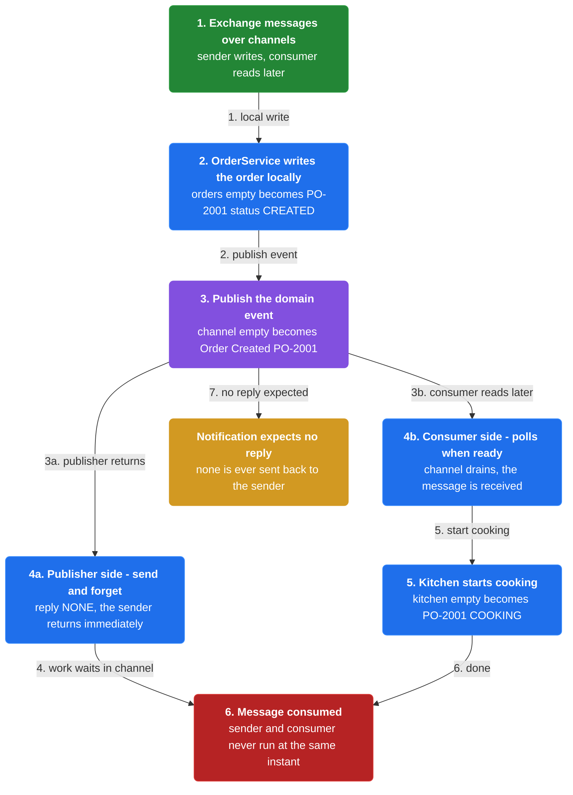
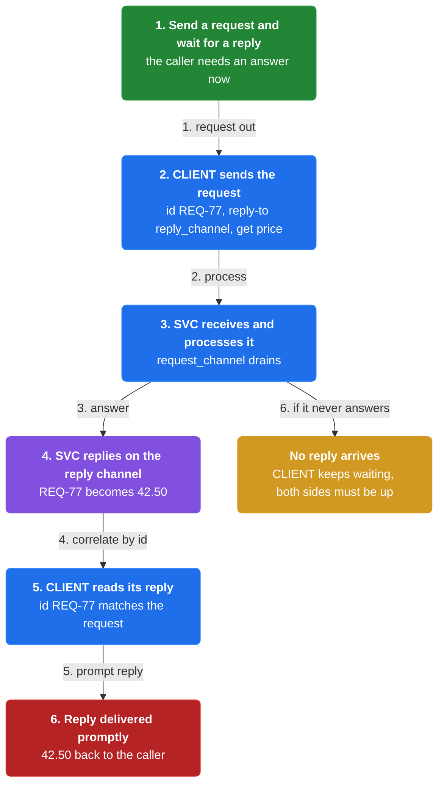
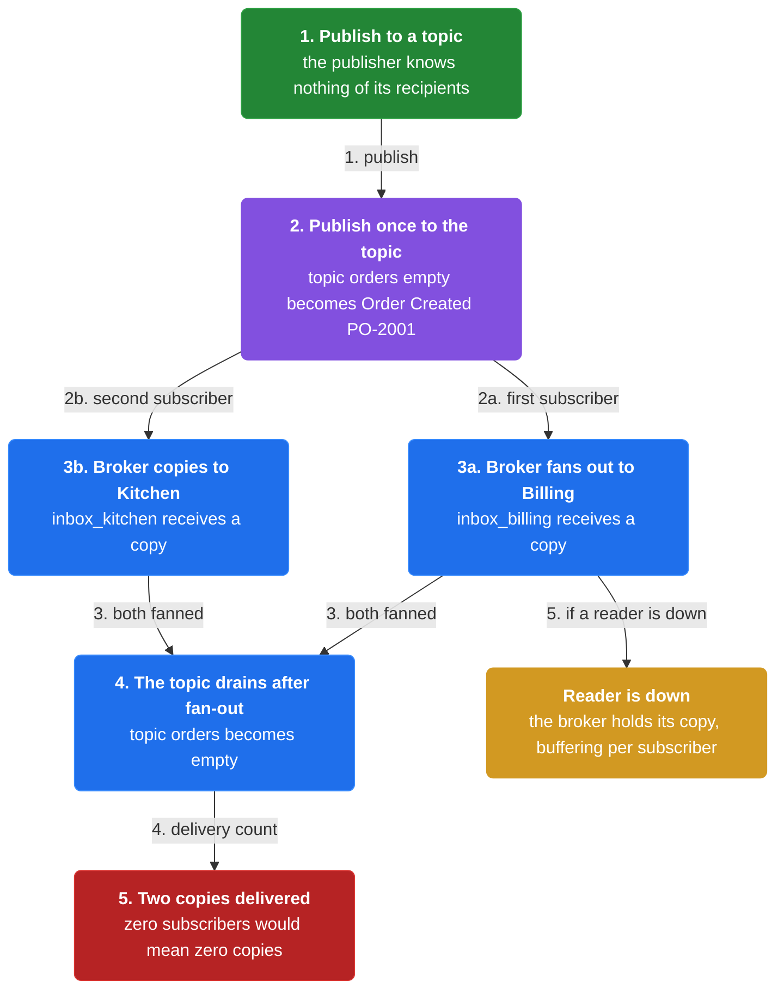
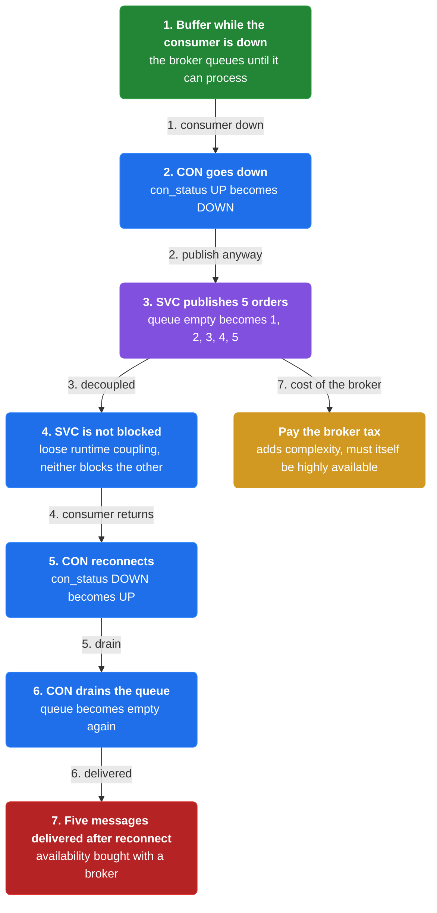

# Chapter 5: Messaging

> Asynchronous inter-service communication where services exchange messages over messaging channels.

_Also known as: Chris Richardson · Microservice Patterns Ch. 5 · microservices.io /patterns/communication-style/messaging.html_

## Flow

### Publish over a messaging channel

> **Why this matters:** Synchronous calls tie the caller to the callee; sending an event over a channel decouples the two so the sender never waits.



1. **Exchange messages over channels** — A sender writes a message to a channel and a consumer reads it later; the two never run at the same instant.

2. **Publish the domain event** — OrderService publishes an **Order Created** event when it creates an Order, as in the FTGO example.

3. **Send and forget** — A notification expects no reply and none is sent, so the sender returns immediately.

```java
// ORDER SERVICE SIDE — publish an Order Created event to a channel; the consumer reads it later
// PARTIES: SVC = Order Service · BRK = message broker · CON = Kitchen consumer
// STATE (before):
//    orders : {}
//    channel : []
//    kitchen : {}
// DEF: create_order · CALLED BY: U1 placing an order (FTGO OrderService)
// -> order_id : "PO-2001" · -> event : "OrderCreated"
//    step 1 · SVC writes the order locally      : orders : {} -> { "PO-2001": { status: "CREATED" } }
//    step 2 · SVC publishes the event to BRK    : channel : [] -> [ "OrderCreated(PO-2001)" ]
//    step 3 · SVC returns immediately           : reply : "NONE"  BECAUSE a notification sends no reply
// <- event : "OrderCreated(PO-2001)" sits in the channel, waiting for CON
//
// DEF: consume · CALLED BY: CON polling BRK whenever it is ready
// -> poll : channel = [ "OrderCreated(PO-2001)" ]
//    step 1 · CON receives the message          : channel : [ "OrderCreated(PO-2001)" ] -> []
//    step 2 · CON starts cooking the order      : kitchen : {} -> { "PO-2001": "COOKING" }
// <- message : "OrderCreated(PO-2001)" consumed · SVC and CON never run at the same instant
```

### Request/response style

> **Why this matters:** Sometimes a caller needs an answer now; the request/response style sends a request and expects a prompt reply.



1. **Send a request message** — A service sends a request to a recipient and waits for a reply.

2. **Correlate the reply** — A **reply-to** channel and a correlation id tie the reply back to its request.

3. **Expect a prompt reply** — The reply is expected promptly, unlike the eventual reply of request/asynchronous response.

```java
// CONSUMER SERVICE SIDE — request/response: send a request, expect a prompt reply over a channel
// PARTIES: CLIENT = Consumer · BRK = message broker · SVC = Provider service
// DEF: channel — a named conduit through which messages flow from sender to receiver; here the reply_to channel "reply_channel" carried "REQ-77:42.50"
// DEF: reply — the answer the provider returns to the caller over the reply channel; here "42.50" for request "REQ-77"
// STATE (before):
//    request_channel : []
//    reply_channel : []
// DEF: request_price · CALLED BY: CLIENT needing a price now
// -> request : { id: "REQ-77", reply_to: "reply_channel", body: "get price" }
//    step 1 · CLIENT sends the request to BRK   : request_channel : [] -> [ "REQ-77:get price" ]
//    step 2 · SVC receives and processes it     : request_channel : [ "REQ-77:get price" ] -> []
//    step 3 · SVC replies on the reply channel  : reply_channel : [] -> [ "REQ-77:42.50" ]
//    step 4 · CLIENT reads its reply            : reply_channel : [ "REQ-77:42.50" ] -> []
// <- reply : "42.50" delivered to CLIENT · id "REQ-77" matches the request
//    alt no reply : CLIENT keeps waiting  BECAUSE both sides must be available for the duration
```

### Publish/subscribe style

> **Why this matters:** One event often matters to several services; publish/subscribe fans a message out to zero or more recipients.



1. **Publish to a topic** — A publisher writes a message to a topic and knows nothing of its recipients.

2. **Broker fans out** — The broker delivers a copy to each subscriber.

3. **Zero or more recipients** — With no subscribers the message goes nowhere; with several, each gets a copy.

```java
// BROKER SIDE — publish/subscribe: one publisher, two subscribers (zero or more recipients)
// PARTIES: PUB = Order Service · BRK = message broker · SUB1 = Billing · SUB2 = Kitchen
// DEF: inbox — a per-subscriber mailbox the broker delivers one copy into; here inbox_billing and inbox_kitchen each receive "OrderCreated(PO-2001)"
// STATE (before):
//    topic : { "orders": [] }
//    inbox_billing : []
//    inbox_kitchen : []
// DEF: publish_order_created · CALLED BY: PUB after an order is created
// -> event : "OrderCreated(PO-2001)"
//    step 1 · PUB publishes once to the topic   : topic["orders"] : [] -> [ "OrderCreated(PO-2001)" ]
//    step 2 · BRK fans out to the first reader  : inbox_billing : [] -> [ "OrderCreated(PO-2001)" ]
//    step 3 · BRK copies to the second reader   : inbox_kitchen : [] -> [ "OrderCreated(PO-2001)" ]
//    step 4 · the topic drains after fan-out    : topic["orders"] : [ "OrderCreated(PO-2001)" ] -> []
// <- delivery : 2 copies of "OrderCreated(PO-2001)" · zero subscribers would mean 0 copies
//    alt reader down : BRK holds its copy  BECAUSE the broker buffers per subscriber
```

### Availability through buffering

> **Why this matters:** The broker holds messages until a consumer can process them, buying availability at the cost of running a broker.



1. **Buffer while the consumer is down** — The broker keeps messages queued until the consumer is able to process them.

2. **Loose runtime coupling** — The sender is decoupled from the consumer, so neither blocks the other.

3. **Pay the broker tax** — A broker adds complexity and must itself be highly available; request/reply over messaging is more complex.

4. **Compose with outbox, saga, CQRS** — The Transactional Outbox sends messages inside a database transaction; Saga and CQRS build on messaging.

```java
// BROKER SIDE — buffering buys availability: consumer down, broker holds the queue until it returns
// PARTIES: BRK = message broker · SVC = Order Service (publisher) · CON = Consumer
// STATE (before):
//    queue : []
//    con_status : "UP"
// DEF: publish_while_down · CALLED BY: SVC publishing 5 orders while CON is down
// -> count : 5
//    step 1 · CON goes down                     : con_status : "UP" -> "DOWN"
//    step 2 · SVC publishes order 1             : queue : [] -> [ 1 ]
//    step 3 · SVC publishes orders 2 to 5       : queue : [ 1 ] -> [ 1, 2, 3, 4, 5 ]
//    step 4 · SVC is not blocked                BECAUSE the broker buffers messages until the consumer can process them
// <- queue : [ 1, 2, 3, 4, 5 ] held while con_status stays "DOWN"
//
// DEF: drain_on_reconnect · CALLED BY: CON reconnecting
// -> reconnect : "true"
//    step 1 · CON comes back up                 : con_status : "DOWN" -> "UP"
//    step 2 · CON drains the queue              : queue : [ 1, 2, 3, 4, 5 ] -> []
// <- delivery : 5 messages delivered after reconnect · availability bought with the cost of running a broker
```


## Key Concepts

### The Problem

**Tight runtime coupling.** Synchronous communication results in tight runtime coupling.


### The Solution

Services communicate by exchanging messages over messaging channels, asynchronously.


### Key Facts

| Fact | Detail | In the wild |
|---|---|---|
| Messaging over channels | Services communicate by exchanging messages over messaging channels, asynchronously. | FTGO OrderService publishes an Order Created event when it creates an Order. |
| Loose coupling and availability | Messaging decouples the sender from the consumer and improves availability because the broker buffers messages until the consumer can process them. | A consumer that is down misses nothing: the broker holds the queue and delivers when it returns. |
| Broker complexity | Messaging adds the complexity of a message broker, which must itself be highly available, and request/reply over messaging is more complex. | A broker outage now takes down every pair of services that communicate through it. |


### Tradeoffs & When

- Messaging decouples the sender from the consumer and improves availability because the broker buffers messages until the consumer can process them.
- Messaging adds the complexity of a message broker, which must itself be highly available, and request/reply over messaging is more complex.


<details><summary>All concepts (index)</summary>

### Problem: Tight runtime coupling

**Why.** Synchronous calls force the caller and the callee to be alive for the whole request, so one slow or dead service stalls every service that calls it.

**Claim.** Synchronous communication results in tight runtime coupling.

**Grounding.** The reference lists it as a force: both the client and service must be available for the duration of the request.

**In the wild.** A REST call chain where an outage in the last hop blocks the first hop and cascades upstream.
### Solution: Messaging over channels

**Why.** The sender should hand off work without waiting for the receiver.

**Claim.** Services communicate by exchanging messages over messaging channels, asynchronously.

**Grounding.** The solution: use asynchronous messaging; services exchange messages over channels, as with Kafka or RabbitMQ.

**In the wild.** FTGO OrderService publishes an Order Created event when it creates an Order.
### Tradeoff: Loose coupling and availability

**Why.** Asynchrony should buy resilience, not just style.

**Claim.** Messaging decouples the sender from the consumer and improves availability because the broker buffers messages until the consumer can process them.

**Grounding.** The resulting context lists loose runtime coupling and improved availability as benefits.

**In the wild.** A consumer that is down misses nothing: the broker holds the queue and delivers when it returns.
### Tradeoff: Broker complexity

**Why.** A buffer in the middle is a new system to run.

**Claim.** Messaging adds the complexity of a message broker, which must itself be highly available, and request/reply over messaging is more complex.

**Grounding.** The resulting context lists broker complexity as a drawback and more-complex request/reply as an issue.

**In the wild.** A broker outage now takes down every pair of services that communicate through it.

</details>


## Quiz

1. How do services communicate in the Messaging pattern?

   - A. Synchronous HTTP calls between services
   - B. By exchanging messages over messaging channels
   - C. By writing to a shared database
   - D. By remote procedure invocation

<details><summary>Reveal answer</summary>

**B.** Messaging is asynchronous: services exchange messages over channels. Synchronous HTTP (A) and RPI (D) are the RPI pattern, and a shared database (C) is not an inter-process protocol.

</details>

2. Which style expects a reply promptly?

   - A. Notifications
   - B. Publish/subscribe
   - C. Request/response
   - D. Request/asynchronous response

<details><summary>Reveal answer</summary>

**C.** Request/response expects a prompt reply. Request/asynchronous response (D) expects the reply only eventually; notifications (A) expect no reply at all; publish/subscribe (B) sends to zero or more recipients.

</details>

3. Why does messaging improve availability?

   - A. The broker buffers messages until the consumer can process them
   - B. The client and service must both be available
   - C. It removes the need for a broker
   - D. It only supports request/reply

<details><summary>Reveal answer</summary>

**A.** The broker holds messages while the consumer is down. Options B and D describe RPI drawbacks, and C contradicts messaging, which requires a broker.

</details>

4. Which related pattern sends messages as part of a database transaction?

   - A. Saga
   - B. CQRS
   - C. Transactional Outbox
   - D. Domain-specific protocol

<details><summary>Reveal answer</summary>

**C.** The Transactional Outbox sends messages inside a database transaction. Saga (A) and CQRS (B) use messaging but are not the transactional-send mechanism; the Domain-specific protocol (D) is an alternative to messaging.

</details>

