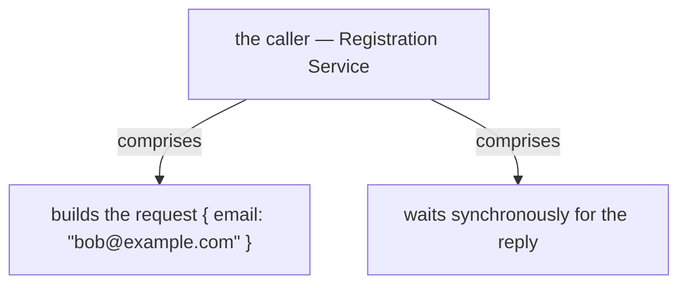
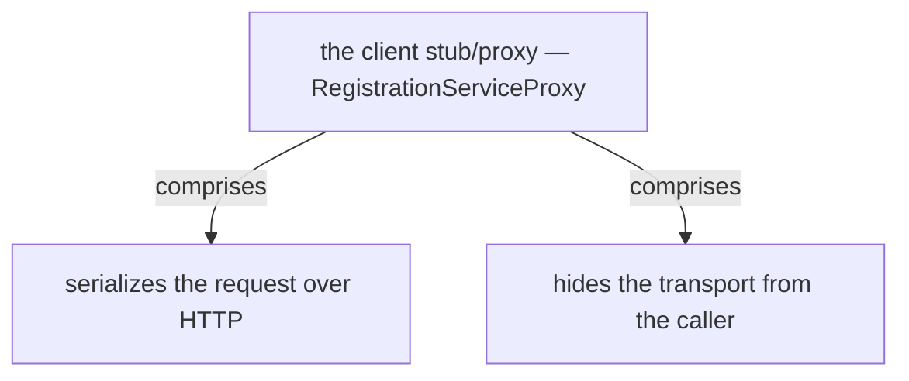
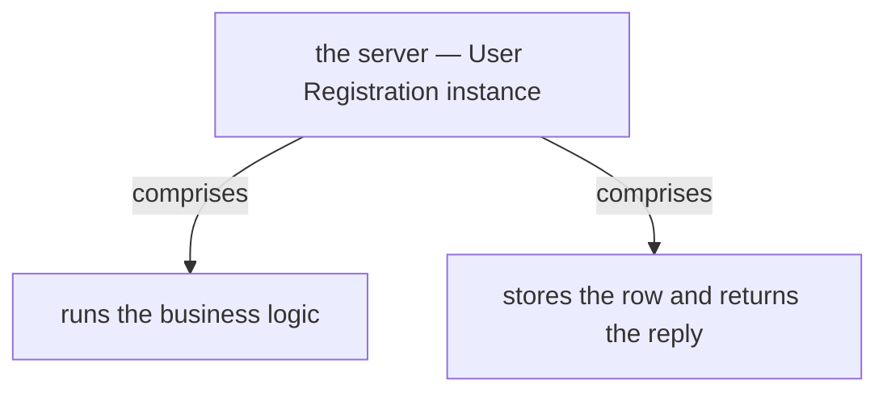

# Chapter 6: Remote Procedure Invocation

> Synchronous inter-service communication where a client uses a request/reply-based protocol to invoke a service.

_Also known as: Chris Richardson · Microservice Patterns Ch. 6 · microservices.io /patterns/communication-style/rpi.html_

## Flow

### Invoke over request/reply

> **Why this matters:** RPI is the familiar synchronous call: the client sends a request and waits for a reply, with no broker in between.

1. **Send a request** — The client uses a request/reply protocol (REST, gRPC, or Apache Thrift) to call a service.

2. **Wait for the reply** — The client blocks until the reply arrives, then carries on.

3. **Map the response** — A 200 OK yields the new id; RegistrationServiceProxy returns **Right(id)**.

```java
// CLIENT SIDE — RPI: the client POSTs a request and waits for a reply, with no broker in between
// PARTIES: CLIENT = Registration Service · SVC = User Registration service (remote)
// STATE (before):
//    request : null
//    status : "PENDING"
//    verdict : "UNSET"
//    result : null
//    url : "http://user-reg:8080/register"
// DEF: registerUser · CALLED BY: a new user signing up (RestTemplate.postForEntity)
// -> email : "ada@example.com" · -> password : "s3cret"
//    step 1 · CLIENT POSTs the request to SVC  : request : null -> { email: "ada@example.com", password: "s3cret" }
//    step 2 · SVC creates the user and answers : status : "PENDING" -> 200
//    step 3 · CLIENT reads the status code     : verdict : "UNSET" -> "OK"
//    step 4 · CLIENT returns the new id        : result : null -> "user-9"
// <- reply : "user-9" (Right) · one request, one prompt reply over HTTP
```

### Map errors to typed results

> **Why this matters:** A failed or duplicate call must become a typed result, not an unhandled exception.

1. **Catch the status** — The proxy inspects the HTTP status code of the response.

2. **Map 200 to success** — An **HttpStatus.OK** returns Right(id).

3. **Map CONFLICT to an error** — An HttpClientErrorException with CONFLICT becomes **Left(DuplicateRegistrationError)**.

```java
// CLIENT SIDE — RPI error path: a duplicate sign-up maps a 409 CONFLICT to a typed error
// PARTIES: CLIENT = Registration Service · SVC = User Registration service (remote)
// STATE (before):
//    request : null
//    status : "PENDING"
//    verdict : "UNSET"
//    result : null
//    url : "http://user-reg:8080/register"
// DEF: registerUser_duplicate · CALLED BY: the same email signing up twice
// -> email : "ada@example.com" · -> password : "s3cret"
//    step 1 · CLIENT POSTs the request again    : request : null -> { email: "ada@example.com" }
//    step 2 · SVC finds the email already taken : status : "PENDING" -> 409
//    step 3 · CLIENT matches the 409            : verdict : "UNSET" -> "CONFLICT"
//    step 4 · CLIENT returns the typed error    : result : null -> "DuplicateRegistrationError"
// <- reply : "DuplicateRegistrationError" (Left) · the 409 becomes a domain error
//    alt SVC down : no reply at all  BECAUSE client and service must both be available for the whole call
```

### The availability price

> **Why this matters:** Because both client and service must be up for the whole interaction, RPI reduces availability and blocks threads.

1. **Both sides must be available** — Client and service must be available for the duration of the interaction.

2. **Threads wait** — The caller thread is held while it waits for the reply.

3. **Only request/reply** — RPI usually cannot express notifications, publish/subscribe, or async response.

```java
// CLIENT SIDE — RPI availability: client and service must both be available for the whole call
// PARTIES: CLIENT = Registration Service · SVC = User Registration service (unresponsive)
// STATE (before):
//    thread : "FREE"
//    elapsed_ms : 0
//    timeout_ms : 800
//    verdict : "UNSET"
// DEF: registerUser_unavailable · CALLED BY: a sign-up while SVC is unresponsive
// -> request : { email: "ada@example.com" }
//    step 1 · CLIENT blocks its thread on the call : thread : "FREE" -> "WAITING"
//    step 2 · SVC is down, so no reply arrives     : elapsed_ms : 0 -> 800
//    step 3 · the timer expires and the call fails : verdict : "UNSET" -> "TIMEOUT"
//    step 4 · the thread is released               : thread : "WAITING" -> "FREE"
// <- reply : "TIMEOUT" after 800 ms · 800 ms of the caller thread spent waiting
//    alt SVC slow but alive : the reply arrives late  BECAUSE there is no broker to buffer the work
```

### Discovery and resilience wiring

> **Why this matters:** A client must find a service instance and guard the call: discovery resolves the location, a circuit breaker contains failure.

1. **Discover the instance** — The client needs to discover locations of service instances, via client-side or server-side discovery.

2. **Resolve the URL from config** — Externalized configuration supplies the network location (the **user_registration_url**).

3. **Guard with a circuit breaker** — A client typically uses a Circuit Breaker to improve reliability (the **@HystrixCommand** wrapper).

```java
// CLIENT SIDE — RPI wiring: discover an instance, resolve its URL, then invoke behind a breaker
// PARTIES: CLIENT = Registration Service · DISC = service registry · SVC = User Registration instance
// STATE (before):
//    registry : { "user-registration": "10.0.0.7:8080" }
//    lookup : null
//    location : null
//    url : null
//    request : null
// DEF: resolve_and_call · CALLED BY: CLIENT before its first call
// -> service_name : "user-registration"
//    step 1 · CLIENT asks DISC for an instance   : lookup : null -> "user-registration"
//    step 2 · DISC returns a network location    : location : null -> "10.0.0.7:8080"
//    step 3 · CLIENT builds the URL              : url : null -> "http://10.0.0.7:8080/register"
//    step 4 · CLIENT invokes SVC behind a breaker : request : null -> { email: "ada@example.com" }
// <- reply : "user-9" · the URL came from discovery, the call rides behind a circuit breaker
//    alt breaker open : the call fails fast without touching SVC  BECAUSE a client typically uses a Circuit Breaker
```


## System Design Interview

> **The question:** Design synchronous service-to-service calls. Premise: a caller goes through a client stub/proxy, HTTP transport, and a server skeleton into business logic and back, so the caller blocks for a reply.

**The pipeline:** caller → client stub/proxy → transport (HTTP) → server skeleton → business logic → reply

### the caller — Registration Service

_Role: caller_



### the client stub/proxy — RegistrationServiceProxy

_Role: interface (client proxy)_



### the server — User Registration instance

_Role: server_



```java
// SYSTEM DESIGN — RPI as a pipeline: caller -> client stub/proxy -> transport (HTTP) -> server skeleton -> business logic -> reply
// PARTIES: CLIENT = Registration Service (caller: builds the request and waits for the reply) · STUB = client proxy RegistrationServiceProxy (interface: hides the HTTP transport) · SVC = User Registration instance (server: runs the business logic and returns the reply)
// DEF: request — the payload a caller sends over RPI; here { email: "bob@example.com" }
// DEF: reply — the answer the service returns on the same connection; here "user-14"
// DEF: proxy — the client-side stub hiding the transport; here RegistrationServiceProxy -> "http://10.0.2.9:8080/register"
// STATE (before):
//    request : {}       // the payload the caller sends over RPI
//    reply   : "none"   // the answer the service returns on the same connection
//    status  : "PENDING"  // the HTTP status of the in-flight call
// DEF: place_registration · CALLED BY: CLIENT after the user submits an email
// -> email : "bob@example.com" · -> service_name : "user-registration"
//    step 1 · CLIENT calls the stub : request : {} -> { email: "bob@example.com" }
//    step 2 · STUB serializes over HTTP : status : "PENDING" -> "IN_FLIGHT"
//    step 3 · SVC runs the logic and stores the row : reply : "none" -> "user-14"
//    step 4 · STUB deserializes and returns the reply : status : "IN_FLIGHT" -> "DONE"
// <- reply : "user-14" · the caller reads its answer on the same synchronous connection
//    alt service down : the call hangs or fails fast  BECAUSE both ends must be alive for the whole interaction
```

## Interview Questions

### Q1

A new user signs up through the registration service, which calls the user-registration service over HTTP and needs the new user id before it can proceed.

**Interviewer's question:** How does RPI invoke a remote service with a request/reply protocol, and what does a 200 OK produce?

**Solution:** The client sends a request using a request/reply protocol such as REST, blocks until the reply arrives, and maps a 200 OK to the new id as Right(id).

**System-design components:**
- Client (proxy)
- Request/reply protocol (REST)
- Remote service
- Right(id) result

```java
// CLIENT SIDE — RPI: the client POSTs a request and waits for a reply, with no broker in between
// PARTIES: CLIENT = Registration Service · SVC = User Registration service (remote)
// STATE (before):
//    request : null
//    status : "PENDING"
//    verdict : "UNSET"
//    result : null
//    url : "http://user-reg:8080/register"
// DEF: registerUser · CALLED BY: a new user signing up (RestTemplate.postForEntity)
// -> email : "bob@example.com" · -> password : "hunter2"
//    step 1 · CLIENT POSTs the request to SVC : request : null -> { email: "bob@example.com", password: "hunter2" }
//    step 2 · SVC creates the user and answers : status : "PENDING" -> 200
//    step 3 · CLIENT reads the status code : verdict : "UNSET" -> "OK"
//    step 4 · CLIENT returns the new id : result : null -> "user-14"
// <- reply : "user-14" (Right) · one request, one prompt reply over HTTP
```

_This is exactly the RPI request/reply call and the Right(id) success mapping in this chapter._

_Covers:_ Invoke over request/reply

_From the 28 problems:_ 01-scale-from-zero-to-millions · 03-framework-for-system-design-interviews

### Q2

The same email tries to sign up a second time, and the user-registration service rejects it with a CONFLICT status.

**Interviewer's question:** How does RPI map a failed or duplicate call to a typed result instead of an unhandled exception?

**Solution:** The proxy inspects the HTTP status code: a 200 OK becomes Right(id), and an HttpClientErrorException with CONFLICT becomes Left(DuplicateRegistrationError).

**System-design components:**
- Status-code inspection
- 200 -> Right(id)
- 409 CONFLICT -> Left(DuplicateRegistrationError)

```java
// CLIENT SIDE — RPI error path: a duplicate sign-up maps a 409 CONFLICT to a typed error
// PARTIES: CLIENT = Registration Service · SVC = User Registration service (remote)
// STATE (before):
//    request : null
//    status : "PENDING"
//    verdict : "UNSET"
//    result : null
//    url : "http://user-reg:8080/register"
// DEF: registerUser_duplicate · CALLED BY: the same email signing up twice
// -> email : "bob@example.com" · -> password : "hunter2"
//    step 1 · CLIENT POSTs the request again : request : null -> { email: "bob@example.com" }
//    step 2 · SVC finds the email already taken : status : "PENDING" -> 409
//    step 3 · CLIENT matches the 409 : verdict : "UNSET" -> "CONFLICT"
//    step 4 · CLIENT returns the typed error : result : null -> "DuplicateRegistrationError"
// <- reply : "DuplicateRegistrationError" (Left) · the 409 becomes a domain error
//    alt SVC down : no reply at all  BECAUSE client and service must both be available for the whole call
```

_This is exactly the status-to-typed-result mapping in this chapter._

_Covers:_ Map errors to typed results

_From the 28 problems:_ 01-scale-from-zero-to-millions · 03-framework-for-system-design-interviews

### Q3

The user-registration service has gone unresponsive, and the registration service keeps calling it during a sign-up.

**Interviewer's question:** Why does RPI reduce availability, and what happens to the caller thread while it waits?

**Solution:** Client and service must both be available for the whole interaction; the caller thread is held while it waits, so an unresponsive callee burns the caller's capacity.

**System-design components:**
- Both sides available
- Blocked caller thread
- Timeout expiry
- No broker to buffer

```java
// CLIENT SIDE — RPI availability: client and service must both be available for the whole call
// PARTIES: CLIENT = Registration Service · SVC = User Registration service (unresponsive)
// STATE (before):
//    thread : "FREE"
//    elapsed_ms : 0
//    timeout_ms : 800
//    verdict : "UNSET"
// DEF: registerUser_unavailable · CALLED BY: a sign-up while SVC is unresponsive
// -> request : { email: "bob@example.com" }
//    step 1 · CLIENT blocks its thread on the call : thread : "FREE" -> "WAITING"
//    step 2 · SVC is down, so no reply arrives : elapsed_ms : 0 -> 800
//    step 3 · the timer expires and the call fails : verdict : "UNSET" -> "TIMEOUT"
//    step 4 · the thread is released : thread : "WAITING" -> "FREE"
// <- reply : "TIMEOUT" after 800 ms · 800 ms of the caller thread spent waiting
//    alt SVC slow but alive : the reply arrives late  BECAUSE there is no broker to buffer the work
```

_This is exactly the availability price — both sides available and threads held — in this chapter._

_Covers:_ The availability price

_From the 28 problems:_ 01-scale-from-zero-to-millions · 03-framework-for-system-design-interviews

### Q4

Before its first call, the registration service must find a user-registration instance and guard the call against failure.

**Interviewer's question:** What discovery and resilience wiring does an RPI client need to reach an instance safely?

**Solution:** The client discovers the instance's location via client-side or server-side discovery, resolves its URL from externalized configuration, and invokes behind a circuit breaker.

**System-design components:**
- Service discovery
- Externalized config URL
- Circuit breaker wrapper

```java
// CLIENT SIDE — RPI wiring: discover an instance, resolve its URL, then invoke behind a breaker
// PARTIES: CLIENT = Registration Service · DISC = service registry · SVC = User Registration instance
// STATE (before):
//    registry : { "user-registration": "10.0.2.9:8080" }
//    lookup : null
//    location : null
//    url : null
//    request : null
// DEF: resolve_and_call · CALLED BY: CLIENT before its first call
// -> service_name : "user-registration"
//    step 1 · CLIENT asks DISC for an instance : lookup : null -> "user-registration"
//    step 2 · DISC returns a network location : location : null -> "10.0.2.9:8080"
//    step 3 · CLIENT builds the URL : url : null -> "http://10.0.2.9:8080/register"
//    step 4 · CLIENT invokes SVC behind a breaker : request : null -> { email: "bob@example.com" }
// <- reply : "user-14" · the URL came from discovery, the call rides behind a circuit breaker
//    alt breaker open : the call fails fast without touching SVC  BECAUSE a client typically uses a Circuit Breaker
```

_This is exactly the discovery-plus-circuit-breaker wiring in this chapter._

_Covers:_ Discovery and resilience wiring

_From the 28 problems:_ 01-scale-from-zero-to-millions · 03-framework-for-system-design-interviews

## Key Concepts

### The Problem

**Synchronous coupling.** Synchronous communication results in tight runtime coupling between client and service.


### The Solution

The client uses a request/reply-based protocol to make requests to a service, via REST, gRPC, or Apache Thrift.

```java
// CLIENT SIDE — RPI: the client POSTs a request and waits for a reply, with no broker in between
// PARTIES: CLIENT = Registration Service · SVC = User Registration service (remote)
// STATE (before):
//    request : null
//    status : "PENDING"
//    verdict : "UNSET"
//    result : null
//    url : "http://user-reg:8080/register"
// DEF: registerUser · CALLED BY: a new user signing up (RestTemplate.postForEntity)
// -> email : "bob@example.com" · -> password : "hunter2"
//    step 1 · CLIENT POSTs the request to SVC : request : null -> { email: "bob@example.com", password: "hunter2" }
//    step 2 · SVC creates the user and answers : status : "PENDING" -> 200
//    step 3 · CLIENT reads the status code : verdict : "UNSET" -> "OK"
//    step 4 · CLIENT returns the new id : result : null -> "user-14"
// <- reply : "user-14" (Right) · one request, one prompt reply over HTTP
```


### Key Facts

| Fact | Detail | In the wild |
|---|---|---|
| Request/reply invocation | The client uses a request/reply-based protocol to make requests to a service, via REST, gRPC, or Apache Thrift. | RegistrationServiceProxy POSTs a RegistrationBackendRequest and returns the new id on a 200 OK. |
| Simple, familiar, no broker | RPI is simple and familiar, request/reply is easy, and the system is simpler because there is no intermediate broker. | A two-service system where a plain REST call needs no queue, topic, or broker to keep alive. |
| Only request/reply, reduced availability | RPI usually only supports request/reply, and availability is reduced because client and service must be available for the whole interaction. | A caller cannot send a fire-and-forget notification through an RPI-only API. |


### Tradeoffs & When

- RPI is simple and familiar, request/reply is easy, and the system is simpler because there is no intermediate broker.
- RPI usually only supports request/reply, and availability is reduced because client and service must be available for the whole interaction.


<details><summary>All concepts (index)</summary>

### Problem: Synchronous coupling

**Why.** When a call is synchronous, both ends must be alive for the whole interaction, so a slow or dead callee stalls the caller.

**Claim.** Synchronous communication results in tight runtime coupling between client and service.

**Grounding.** The reference lists it as a force: both the client and service must be available for the duration of the request.

**In the wild.** A registration call that blocks until the user service answers, holding the caller thread the entire time.
### Solution: Request/reply invocation

**Why.** Sometimes a service genuinely needs an immediate answer from another service.

**Claim.** The client uses a request/reply-based protocol to make requests to a service, via REST, gRPC, or Apache Thrift.

**Grounding.** The solution: use RPI; the client uses a request/reply protocol; the examples are REST, gRPC, and Apache Thrift.

**In the wild.** RegistrationServiceProxy POSTs a RegistrationBackendRequest and returns the new id on a 200 OK.
### Tradeoff: Simple, familiar, no broker

**Why.** A system is easier to run when there is no intermediate component to operate.

**Claim.** RPI is simple and familiar, request/reply is easy, and the system is simpler because there is no intermediate broker.

**Grounding.** The resulting context lists simplicity, easy request/reply, and no broker as benefits.

**In the wild.** A two-service system where a plain REST call needs no queue, topic, or broker to keep alive.
### Tradeoff: Only request/reply, reduced availability

**Why.** Synchrony is a restriction, not just a style choice.

**Claim.** RPI usually only supports request/reply, and availability is reduced because client and service must be available for the whole interaction.

**Grounding.** The resulting context lists the pattern restriction and reduced availability as drawbacks.

**In the wild.** A caller cannot send a fire-and-forget notification through an RPI-only API.

</details>


## Quiz

1. What protocol does an RPI client use to call a service?

   - A. A request/reply-based protocol
   - B. A fire-and-forget protocol
   - C. A publish/subscribe protocol
   - D. A shared-memory protocol

<details><summary>Reveal answer</summary>

**A.** RPI is defined by a request/reply-based protocol. Fire-and-forget (B) and publish/subscribe (C) are messaging styles, and shared memory (D) is not inter-process communication.

</details>

2. Which is NOT an RPI technology named in the reference?

   - A. REST
   - B. gRPC
   - C. Apache Thrift
   - D. Apache Kafka

<details><summary>Reveal answer</summary>

**D.** Kafka is a message broker, not an RPI mechanism. REST (A), gRPC (B), and Apache Thrift (C) are the RPI examples.

</details>

3. Which is a benefit of RPI?

   - A. It supports publish/subscribe
   - B. It is simple, familiar, and needs no broker
   - C. It buffers messages while the consumer is down
   - D. It decouples sender from consumer

<details><summary>Reveal answer</summary>

**B.** RPI is simple, familiar, and broker-free. Options A, C, and D are messaging benefits, not RPI benefits.

</details>

4. Which is a drawback of RPI?

   - A. The broker must be highly available
   - B. Client and service must both be available for the whole interaction
   - C. It cannot use REST
   - D. It requires Kafka

<details><summary>Reveal answer</summary>

**B.** RPI reduces availability because both sides must be up for the duration. Options A and D are messaging broker concerns, and C is false since REST is an RPI example.

</details>

