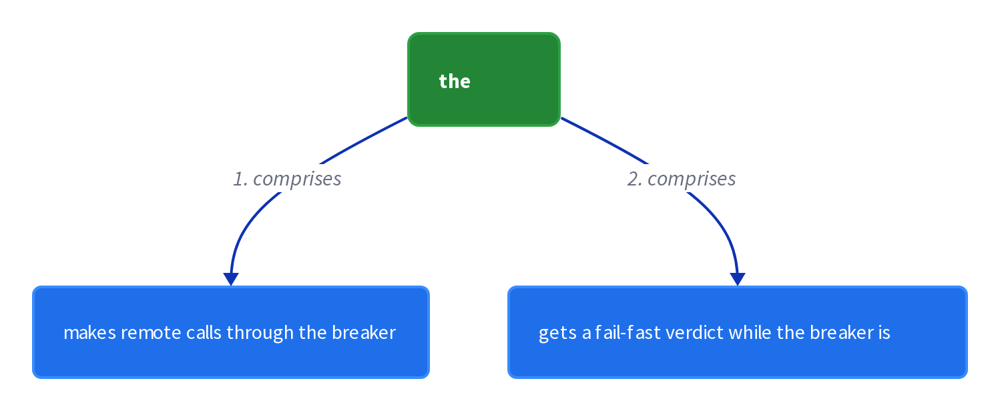

# Chapter 7: Circuit Breaker

> A proxy that trips after consecutive failures, fails fast during a timeout, and probes before resuming.

_Also known as: Chris Richardson · Microservice Patterns Ch. 7 · microservices.io /patterns/reliability/circuit-breaker.html_

## Flow

### Trip on consecutive failures

> **Why this matters:** A cascade starts when a caller keeps waiting on a dead service; the breaker counts failures and opens once they cross a threshold.

1. **Count consecutive failures** — The proxy increments a counter on each failed call.

2. **Cross the threshold** — When the count crosses the threshold, the breaker trips.

3. **Open the circuit** — For the timeout period, all attempts fail immediately.

```java
// PROXY SIDE — CLOSED state: a breaker trips when consecutive failures cross the threshold
// PARTIES: CLIENT = caller thread · PROXY = circuit breaker · SVC = remote service (down)
// STATE (before):
//    breaker : { state: "CLOSED", consecutive_failures: 0, threshold: 3, timeout_s: 60 }
//    remote_calls : 0
// DEF: forward · CALLED BY: CLIENT, three requests in a row at 00:00:00, 00:00:01, 00:00:02
// -> request : "get-user-1"
//    step 1 · PROXY forwards the call to SVC    : remote_calls : 0 -> 1
//    step 2 · SVC is down; a failure is counted : consecutive_failures : 0 -> 1
//    step 3 · the second call fails             : consecutive_failures : 1 -> 2
//    step 4 · the third call hits the threshold : consecutive_failures : 2 -> 3  BECAUSE 3 >= threshold 3
//    step 5 · PROXY opens the circuit           : state : "CLOSED" -> "OPEN"
// <- verdict : "OPEN" tripped at 00:00:02 · every later attempt fails immediately for the timeout
```

### Fail fast while open

> **Why this matters:** While open, no thread is wasted on the dead service: attempts fail immediately instead of blocking.

1. **Reject without calling** — Attempts to invoke the remote service fail immediately.

2. **Protect the caller** — Threads are not consumed waiting for an unresponsive service.

3. **Stop the cascade** — The failure of one service no longer drains the services that call it.

```java
// PROXY SIDE — OPEN state: while open, every attempt fails immediately, so SVC is never touched
// PARTIES: CLIENT = caller thread · PROXY = circuit breaker · SVC = remote service (down)
// STATE (before):
//    breaker : { state: "OPEN", timeout_s: 60, opened_at: "00:00:02" }
//    attempts : 0
//    svc_calls : 0
//    elapsed : 0
// DEF: reject · CALLED BY: CLIENT, requests arriving at 00:00:10 and 00:00:30 inside the 60 s window
// -> request : "get-user-2" at 00:00:10
//    step 1 · PROXY sees the window is not over : elapsed : 0 -> 8  BECAUSE 00:00:10 - 00:00:02 = 8 s < 60 s
//    step 2 · PROXY rejects without touching SVC : attempts : 0 -> 1
//    step 3 · a second request also fails fast   : attempts : 1 -> 2
//    step 4 · SVC received nothing               : svc_calls : 0 -> 0  BECAUSE the breaker short-circuits
// <- verdict : "FAIL_FAST" twice (00:00:10, 00:00:30) · threads freed at once, SVC untouched
```

### Probe in half-open

> **Why this matters:** After the timeout the breaker lets a limited number of test requests through; their outcome decides recovery or another timeout.

1. **Timeout expires** — The breaker allows a limited number of test requests to pass through.

2. **Success resumes operation** — If those requests succeed, the breaker resumes normal operation.

3. **Failure restarts the timeout** — If there is a failure, the timeout period begins again.

```java
// PROXY SIDE — HALF-OPEN state: after the timeout, one test request is allowed through
// PARTIES: CLIENT = caller thread · PROXY = circuit breaker · SVC = remote service (recovered)
// STATE (before):
//    breaker : { state: "OPEN", consecutive_failures: 3, timeout_s: 60, opened_at: "00:00:02", probe_count: 0 }
//    reply : null
// DEF: probe · CALLED BY: CLIENT, the first request after the timeout, at 00:01:02
// -> request : "get-user-3" at 00:01:02
//    step 1 · the timeout has expired           : state : "OPEN" -> "HALF-OPEN"  BECAUSE 00:01:02 - 00:00:02 = 60 s >= 60 s
//    step 2 · PROXY lets the test request pass  : probe_count : 0 -> 1
//    step 3 · SVC answers OK this time          : reply : null -> "user-3"
//    step 4 · success resumes normal operation  : state : "HALF-OPEN" -> "CLOSED"
//    step 5 · the failure counter resets        : consecutive_failures : 3 -> 0
// <- verdict : "CLOSED" resumed at 00:01:02 · normal operation restored
//    alt test request fails : state : "HALF-OPEN" -> "OPEN"  BECAUSE the timeout period begins again
```

### Tune thresholds carefully

> **Why this matters:** Choosing timeout values is hard: too tight creates false positives, too loose hides real outages behind latency.

1. **False positives** — A too-short timeout trips on a healthy but slow service.

2. **Excessive latency** — A too-long timeout delays detection of a real failure.

3. **The one hard dial** — The challenge is choosing values without false positives or excessive latency.

```java
// PROXY SIDE — tuning: a too-short timeout marks a healthy but slow service as failed
// PARTIES: CLIENT = caller thread · PROXY = circuit breaker · SVC = remote service (slow but alive)
// STATE (before):
//    breaker : { state: "CLOSED", consecutive_failures: 0, threshold: 3, timeout_ms: 200 }
//    remote_calls : 0
//    verdict : "UNSET"
//    reply : null
//    avg_latency_ms : 450
// DEF: call · CALLED BY: CLIENT, a request against a service that answers in about 450 ms
// -> request : "get-user-4"
//    step 1 · PROXY forwards the call          : remote_calls : 0 -> 1
//    step 2 · SVC is alive but needs 450 ms     : reply : null -> "user-4" at 450 ms
//    step 3 · PROXY gave up at 200 ms           : verdict : "UNSET" -> "TIMEOUT"  BECAUSE 450 ms > timeout_ms 200
//    step 4 · the timeout counts as a failure   : consecutive_failures : 0 -> 1
// <- verdict : "TIMEOUT" recorded as a failure · a healthy service is marked down, a false positive
//    alt timeout too long : 5000 ms waits through real outages  BECAUSE excessive latency hides the failure
```


## System Design Interview

> **The question:** Design failure isolation for a downstream dependency. Premise: a breaker proxy sits between the caller and a downstream service; on consecutive failures it trips open and fails fast, so a down service cannot stall its caller.

**The pipeline:** caller → breaker proxy → downstream service

<a href="../diagrams/d2/decomp/ch07-0.png"></a>

### the caller

_Role: caller_

- makes remote calls through the breaker
- gets a fail-fast verdict while the breaker is OPEN

### the breaker proxy

_Role: breaker_

- failure counter (trips at threshold 4)
- timeout timer (250 ms)
- state machine CLOSED / OPEN / HALF-OPEN

### the downstream service

_Role: server_

- answers calls while healthy
- times out when degraded

```java
// SYSTEM DESIGN — the circuit breaker as a pipeline: caller -> breaker proxy -> downstream service
// PARTIES: CLIENT = client (caller: makes remote calls through the breaker) · PROXY = circuit breaker proxy (breaker: trips after a threshold of failures, fails fast, lets test requests through) · SVC = downstream service (server: answers the call)
// DEF: breaker — the stateful switch between the caller and the service; here { state:"CLOSED", consecutive_failures:0, threshold:4, timeout_ms:250 }
// DEF: failure — a call that ended in error or timeout; here "charge-card-4"
// STATE (before):
//    breaker : { state:"CLOSED", consecutive_failures:0, threshold:4, timeout_ms:250 }
//    remote_calls : 0
//    consecutive_failures : 0
//    verdict : "UNSET"
// DEF: call · CALLED BY: CLIENT, a request that keeps timing out
// -> request : "charge-card-4"
//    step 1 · CLIENT calls through the proxy : remote_calls : 0 -> 1
//    step 2 · SVC times out and the proxy records a failure : consecutive_failures : 0 -> 4
//    step 3 · PROXY reads the counter against the threshold : breaker.state : "CLOSED" -> "OPEN"
//    step 4 · PROXY fails fast : verdict : "UNSET" -> "OPEN"
// <- verdict : "OPEN" · further calls fail immediately without touching SVC
//    alt after timeout : PROXY lets one test request through  BECAUSE a half-open breaker probes the service before resuming
```

## Interview Questions

### Q1

A checkout service calls a payments service that has died. Calls keep arriving, and the breaker must stop the cascade before it spreads.

**Interviewer's question:** What makes a circuit breaker trip, and what happens once it does?

**Solution:** The proxy counts consecutive failures; when the count crosses a threshold it trips, and for the timeout period all attempts fail immediately.

**System-design components:**
- Failure counter
- Threshold
- Tripped (OPEN) state
- Immediate rejection

```java
// PROXY SIDE — CLOSED state: a breaker trips when consecutive failures cross the threshold
// PARTIES: CLIENT = caller thread · PROXY = circuit breaker · SVC = remote service (down)
// STATE (before):
//    breaker : { state: "CLOSED", consecutive_failures: 0, threshold: 4, timeout_s: 60 }
//    remote_calls : 0
// DEF: forward · CALLED BY: CLIENT, four requests in a row at 00:00:00, 00:00:01, 00:00:02, 00:00:03
// -> request : "charge-card-1"
//    step 1 · PROXY forwards the call to SVC : remote_calls : 0 -> 1
//    step 2 · SVC is down; a failure is counted : consecutive_failures : 0 -> 1
//    step 3 · the second call fails : consecutive_failures : 1 -> 2
//    step 4 · the third call fails : consecutive_failures : 2 -> 3
//    step 5 · the fourth call hits the threshold : consecutive_failures : 3 -> 4  BECAUSE 4 >= threshold 4
//    step 6 · PROXY opens the circuit : state : "CLOSED" -> "OPEN"
// <- verdict : "OPEN" tripped at 00:00:03 · every later attempt fails immediately for the timeout
```

_This is exactly the trip-on-consecutive-failures mechanism in this chapter._

_Covers:_ Trip on consecutive failures

_From the 28 problems:_ 01-scale-from-zero-to-millions · 03-framework-for-system-design-interviews

### Q2

The payments service is down and the breaker has tripped. New checkout requests keep arriving within the timeout window.

**Interviewer's question:** While the breaker is open, what happens to incoming attempts, and why does it stop the cascade?

**Solution:** Attempts fail immediately without calling the service, so threads are not consumed waiting, and the failure of one service no longer drains its callers.

**System-design components:**
- Open breaker
- Fail-fast rejection
- Protected caller threads

```java
// PROXY SIDE — OPEN state: while open, every attempt fails immediately, so SVC is never touched
// PARTIES: CLIENT = caller thread · PROXY = circuit breaker · SVC = remote service (down)
// STATE (before):
//    breaker : { state: "OPEN", timeout_s: 60, opened_at: "00:00:03" }
//    attempts : 0
//    svc_calls : 0
//    elapsed : 0
// DEF: reject · CALLED BY: CLIENT, requests arriving at 00:00:10 and 00:00:30 inside the 60 s window
// -> request : "charge-card-2" at 00:00:10
//    step 1 · PROXY sees the window is not over : elapsed : 0 -> 7  BECAUSE 00:00:10 - 00:00:03 = 7 s < 60 s
//    step 2 · PROXY rejects without touching SVC : attempts : 0 -> 1
//    step 3 · a second request also fails fast : attempts : 1 -> 2
//    step 4 · SVC received nothing : svc_calls : 0 -> 0  BECAUSE the breaker short-circuits
// <- verdict : "FAIL_FAST" twice (00:00:10, 00:00:30) · threads freed at once, SVC untouched
```

_This is exactly the fail-fast-while-open behavior in this chapter._

_Covers:_ Fail fast while open

_From the 28 problems:_ 01-scale-from-zero-to-millions · 03-framework-for-system-design-interviews

### Q3

The payments service has recovered, but the breaker is still open. The timeout is about to expire and the team watches the first request after it.

**Interviewer's question:** What does the breaker do in the half-open state, and how do the probe's outcomes decide recovery or re-trip?

**Solution:** After the timeout it lets a limited number of test requests through; success resumes normal operation, and a failure restarts the timeout period.

**System-design components:**
- Timeout expiry
- Limited test requests
- Resume on success
- Re-trip on failure

```java
// PROXY SIDE — HALF-OPEN state: after the timeout, one test request is allowed through
// PARTIES: CLIENT = caller thread · PROXY = circuit breaker · SVC = remote service (recovered)
// STATE (before):
//    breaker : { state: "OPEN", consecutive_failures: 4, timeout_s: 60, opened_at: "00:00:03", probe_count: 0 }
//    reply : null
// DEF: probe · CALLED BY: CLIENT, the first request after the timeout, at 00:01:03
// -> request : "charge-card-3" at 00:01:03
//    step 1 · the timeout has expired : state : "OPEN" -> "HALF-OPEN"  BECAUSE 00:01:03 - 00:00:03 = 60 s >= 60 s
//    step 2 · PROXY lets the test request pass : probe_count : 0 -> 1
//    step 3 · SVC answers OK this time : reply : null -> "approved"
//    step 4 · success resumes normal operation : state : "HALF-OPEN" -> "CLOSED"
//    step 5 · the failure counter resets : consecutive_failures : 4 -> 0
// <- verdict : "CLOSED" resumed at 00:01:03 · normal operation restored
//    alt test request fails : state : "HALF-OPEN" -> "OPEN"  BECAUSE the timeout period begins again
```

_This is exactly the half-open probe and its two outcomes in this chapter._

_Covers:_ Probe in half-open

_From the 28 problems:_ 01-scale-from-zero-to-millions · 03-framework-for-system-design-interviews

### Q4

The team sets a 250 ms timeout, but the payments service reliably answers in about 600 ms even when healthy.

**Interviewer's question:** What is the one hard dial in a circuit breaker, and what are the two failure modes of tuning it wrong?

**Solution:** Choosing timeout values is the challenge: too short creates false positives on a healthy but slow service, and too long hides real outages behind latency.

**System-design components:**
- Timeout threshold
- False positives
- Excessive latency

```java
// PROXY SIDE — tuning: a too-short timeout marks a healthy but slow service as failed
// PARTIES: CLIENT = caller thread · PROXY = circuit breaker · SVC = remote service (slow but alive)
// STATE (before):
//    breaker : { state: "CLOSED", consecutive_failures: 0, threshold: 4, timeout_ms: 250 }
//    remote_calls : 0
//    verdict : "UNSET"
//    reply : null
//    avg_latency_ms : 600
// DEF: call · CALLED BY: CLIENT, a request against a service that answers in about 600 ms
// -> request : "charge-card-4"
//    step 1 · PROXY forwards the call : remote_calls : 0 -> 1
//    step 2 · SVC is alive but needs 600 ms : reply : null -> "approved" at 600 ms
//    step 3 · PROXY gave up at 250 ms : verdict : "UNSET" -> "TIMEOUT"  BECAUSE 600 ms > timeout_ms 250
//    step 4 · the timeout counts as a failure : consecutive_failures : 0 -> 1
// <- verdict : "TIMEOUT" recorded as a failure · a healthy service is marked down, a false positive
//    alt timeout too long : 5000 ms waits through real outages  BECAUSE excessive latency hides the failure
```

_This is exactly the threshold-tuning tradeoff in this chapter._

_Covers:_ Tune thresholds carefully

_From the 28 problems:_ 01-scale-from-zero-to-millions · 03-framework-for-system-design-interviews

## Key Concepts

### The Problem

**Cascading failure.** Threads are consumed while waiting for an unresponsive service, causing resource exhaustion that cascades failure across the application.


### The Solution

The client invokes a remote service through a proxy that trips after a threshold of consecutive failures, fails fast for a timeout, then lets test requests through.

```java
// PROXY SIDE — CLOSED state: a breaker trips when consecutive failures cross the threshold
// PARTIES: CLIENT = caller thread · PROXY = circuit breaker · SVC = remote service (down)
// STATE (before):
//    breaker : { state: "CLOSED", consecutive_failures: 0, threshold: 4, timeout_s: 60 }
//    remote_calls : 0
// DEF: forward · CALLED BY: CLIENT, four requests in a row at 00:00:00, 00:00:01, 00:00:02, 00:00:03
// -> request : "charge-card-1"
//    step 1 · PROXY forwards the call to SVC : remote_calls : 0 -> 1
//    step 2 · SVC is down; a failure is counted : consecutive_failures : 0 -> 1
//    step 3 · the second call fails : consecutive_failures : 1 -> 2
//    step 4 · the third call fails : consecutive_failures : 2 -> 3
//    step 5 · the fourth call hits the threshold : consecutive_failures : 3 -> 4  BECAUSE 4 >= threshold 4
//    step 6 · PROXY opens the circuit : state : "CLOSED" -> "OPEN"
// <- verdict : "OPEN" tripped at 00:00:03 · every later attempt fails immediately for the timeout
```


### Key Facts

| Fact | Detail | In the wild |
|---|---|---|
| Breaker proxy | The client invokes a remote service through a proxy that trips after a threshold of consecutive failures, fails fast for a timeout, then lets test requests through. | Netflix Hystrix implements it; @EnableCircuitBreaker and @HystrixCommand wire it on RegistrationServiceProxy. |
| Services absorb downstream failure | The breaker lets services handle the failure of the services they invoke, instead of propagating it. | An API Gateway and a server-side discovery router both use the breaker to invoke services safely. |
| Threshold tuning | It is challenging to choose timeout values without creating false positives or introducing excessive latency. | A 200 ms timeout trips on a healthy service that answers in 450 ms, marking it down for no reason. |


### Tradeoffs & When

- The breaker lets services handle the failure of the services they invoke, instead of propagating it.
- It is challenging to choose timeout values without creating false positives or introducing excessive latency.


<details><summary>All concepts (index)</summary>

### Problem: Cascading failure

**Why.** A slow or dead service makes callers wait, and waiting callers burn their own capacity.

**Claim.** Threads are consumed while waiting for an unresponsive service, causing resource exhaustion that cascades failure across the application.

**Grounding.** The context warns that precious resources such as threads are consumed, leading to resource exhaustion and cascading failure.

**In the wild.** One dead checkout service saturates every upstream service that calls it, taking the whole site down.
### Solution: Breaker proxy

**Why.** The caller should stop hitting a service that is already failing.

**Claim.** The client invokes a remote service through a proxy that trips after a threshold of consecutive failures, fails fast for a timeout, then lets test requests through.

**Grounding.** The solution: a proxy like an electrical breaker; the threshold trips it, the timeout fails fast, and test requests resume or re-trip.

**In the wild.** Netflix Hystrix implements it; @EnableCircuitBreaker and @HystrixCommand wire it on RegistrationServiceProxy.
### Tradeoff: Services absorb downstream failure

**Why.** A contained failure should not spread.

**Claim.** The breaker lets services handle the failure of the services they invoke, instead of propagating it.

**Grounding.** The resulting context lists this as the benefit.

**In the wild.** An API Gateway and a server-side discovery router both use the breaker to invoke services safely.
### Tradeoff: Threshold tuning

**Why.** The breaker has one dial, and it is hard to set.

**Claim.** It is challenging to choose timeout values without creating false positives or introducing excessive latency.

**Grounding.** The resulting context names this as the issue.

**In the wild.** A 200 ms timeout trips on a healthy service that answers in 450 ms, marking it down for no reason.

</details>


## Quiz

1. What happens when consecutive failures cross the threshold?

   - A. The breaker trips and all attempts fail immediately for a timeout
   - B. The remote service is restarted
   - C. Requests are retried without limit
   - D. The client switches to messaging

<details><summary>Reveal answer</summary>

**A.** Crossing the threshold trips the breaker, and for the timeout period all attempts fail immediately. The other options are not part of the pattern.

</details>

2. After the timeout expires, the breaker does what?

   - A. Allows a limited number of test requests through
   - B. Stays open permanently
   - C. Immediately floods the service with all traffic
   - D. Deletes the failed service

<details><summary>Reveal answer</summary>

**A.** A limited number of test requests are allowed; success resumes normal operation, failure restarts the timeout. Options B, C, and D are wrong.

</details>

3. What resource is consumed while a caller waits on an unresponsive service?

   - A. Threads
   - B. Disk space
   - C. Network ports only
   - D. No resource at all

<details><summary>Reveal answer</summary>

**A.** Threads are the precious resource consumed while waiting, which can lead to resource exhaustion. Disk (B) and ports (C) are not the stated resource, and D is false.

</details>

4. What is the main challenge in using a circuit breaker?

   - A. Choosing timeout values without false positives or excessive latency
   - B. Finding a message broker
   - C. It cannot wrap REST calls
   - D. It stops all failures from happening

<details><summary>Reveal answer</summary>

**A.** Tuning timeout values is the stated issue: too tight causes false positives, too loose adds latency. Options B and C are false, and D overstates what the breaker does.

</details>

