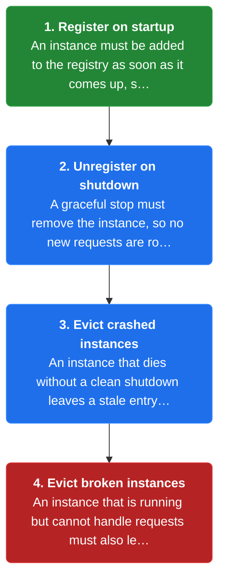
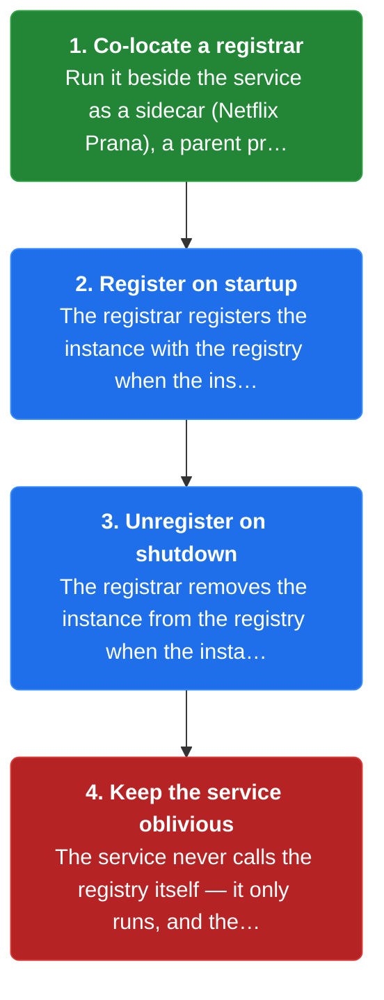
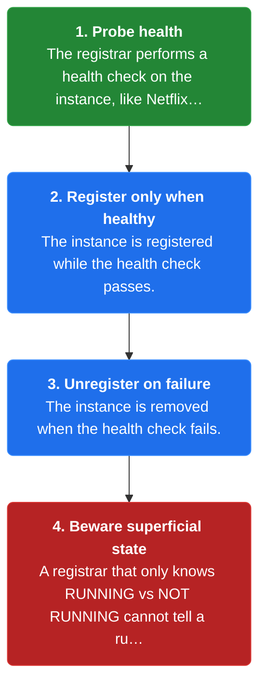

# Chapter 8: Third-Party Registration

> A separate third-party registrar registers a service instance with the registry on startup and unregisters it on shutdown, so the service stays free of registration code.

_Also known as: Chris Richardson · Microservice Patterns Ch. 8 · microservices.io /patterns/3rd-party-registration.html_

## Flow

### The registration lifecycle

> **Why this matters:** Without registration and unregistration, the registry drifts from reality: new instances stay invisible while dead or broken instances keep receiving traffic.



1. **Register on startup** — An instance must be added to the registry as soon as it comes up, so discovery can return it.

2. **Unregister on shutdown** — A graceful stop must remove the instance, so no new requests are routed to it.

3. **Evict crashed instances** — An instance that dies without a clean shutdown leaves a **stale entry** behind.

4. **Evict broken instances** — An instance that is running but cannot handle requests must also leave the registry.

```java
// REGISTRY SIDE — why the registration lifecycle exists: stale entries route requests to dead endpoints
// PARTIES: SVC = order-service instance · REG = service registry · CLI = a client resolving order-service
// STATE (before):
//    registry : {"order-service" -> [{"host":"10.0.1.7","port":8080}]}
//    live_count : 1
// DEF: a second instance boots · CALLED BY: the autoscaler adding capacity
// -> boot : {"host":"10.0.1.8","port":8080}
//    step 1 · register on startup : registry["order-service"] : [{"host":"10.0.1.7","port":8080}] -> [{"host":"10.0.1.7","port":8080},{"host":"10.0.1.8","port":8080}]
//    step 2 · live_count : 1 -> 2   BECAUSE the new instance registered itself on startup
// DEF: the 10.0.1.8 instance crashes · CALLED BY: a hard kill with no clean shutdown
// -> crash : "10.0.1.8"
//    step 1 · process dies : live_count : 2 -> 1   BECAUSE 10.0.1.8 is now a dead process
//    step 2 · stale entry persists : registry["order-service"] : [2 entries] -> [2 entries, one dead]   BECAUSE no unregister ran
// <- discovery result : ["10.0.1.7:8080","10.0.1.8:8080"]   (CLI can be routed to the dead host)
//    alt clean shutdown : SVC sends unregister -> registry["order-service"] : [{"host":"10.0.1.7","port":8080},{"host":"10.0.1.8","port":8080}] -> [{"host":"10.0.1.7","port":8080}]
```

### A third party owns register/unregister

> **Why this matters:** Moving the register/unregister duty out of the service keeps the service simple and language-agnostic, so a non-JVM app can be registered by a sidecar like Netflix Prana.



1. **Co-locate a registrar** — Run it beside the service as a sidecar (Netflix Prana), a parent process (Container buddy), or a Docker helper (Registrator).

2. **Register on startup** — The registrar registers the instance with the registry when the instance starts.

3. **Unregister on shutdown** — The registrar removes the instance from the registry when the instance stops.

4. **Keep the service oblivious** — The service never calls the registry itself — it only runs, and the registrar acts on its behalf.

```java
// REGISTRAR SIDE — a separate process registers and unregisters the instance on its behalf
// PARTIES: SVC = order-service instance · RGR = third-party registrar (sidecar) · REG = service registry
// DEF: proc — the service's OS process whose lifecycle the registrar watches; here svc_proc = "STOPPED" -> "STARTED" on host "10.0.1.7"
// STATE (before):
//    registry : {"order-service" -> []}
//    svc_proc : "STOPPED"
//    discoverable : "false"
// DEF: registrar watches the service process · CALLED BY: RGR polling the local process every 5s
// -> observed : "STARTED"   (SVC process on host 10.0.1.7 came up)
//    step 1 · RGR sees START : svc_proc : "STOPPED" -> "STARTED"
//    step 2 · RGR registers SVC : registry["order-service"] : [] -> [{"host":"10.0.1.7","port":8080}]
//    step 3 · discoverable : "false" -> "true"   BECAUSE the registry now holds the entry
// <- registry row : "order-service" -> [{"host":"10.0.1.7","port":8080}]
//    alt process stops : RGR sees STOP -> registry["order-service"] : [{"host":"10.0.1.7","port":8080}] -> []
```

### Health-check gating and its blind spot

> **Why this matters:** A registrar can probe an instance's health and register or unregister it on the result, but its view may be shallow, so a process that is up yet broken can slip through.



1. **Probe health** — The registrar performs a health check on the instance, like Netflix Prana.

2. **Register only when healthy** — The instance is registered while the health check passes.

3. **Unregister on failure** — The instance is removed when the health check fails.

4. **Beware superficial state** — A registrar that only knows RUNNING vs NOT RUNNING cannot tell a running-but-broken instance apart.

```java
// REGISTRAR SIDE — health-check gating decides whether an instance stays registered
// PARTIES: SVC = order-service instance · RGR = registrar with a health check · REG = registry
// STATE (before):
//    registry : {"order-service" -> [{"host":"10.0.1.7","port":8080}]}
//    health : "PASS"
//    pass_count : 0
// DEF: registrar health-checks SVC · CALLED BY: RGR every 10s
// -> probe_1 : "GET /health" -> "200 OK"   (healthy)
//    step 1 · probe passes : pass_count : 0 -> 1   BECAUSE probe_1 answered 200, SVC stays registered
// -> probe_2 : "GET /health" -> "503 Service Unavailable"   (the instance is now broken)
//    step 2 · health : "PASS" -> "FAIL"   BECAUSE probe_2 answered 503
//    step 3 · RGR unregisters SVC : registry["order-service"] : [{"host":"10.0.1.7","port":8080}] -> []
// <- registry row : "order-service" -> []   (broken instance removed)
//    alt shallow registrar : RGR sees only "RUNNING" -> the broken 10.0.1.7 stays registered (superficial state risk)
```


## Key Concepts

### The Problem

**Registration is a lifecycle duty.** An instance must be registered on startup, unregistered on shutdown, and evicted if it crashes or runs but cannot handle requests.


### The Solution

A third-party registrar registers the instance when it starts and unregisters it when it stops, so the service never talks to the registry itself.


### Key Facts

| Fact | Detail | In the wild |
|---|---|---|
| A third party owns register/unregister | A third-party registrar registers the instance when it starts and unregisters it when it stops, so the service never talks to the registry itself. | Netflix Prana runs as a sidecar for non-JVM apps and registers them with Eureka; Registrator and Container buddy do the same for Docker containers. |
| Health-check gating vs superficial state | The registrar can health-check the instance and register or unregister it based on the result, but a naive registrar only sees RUNNING or NOT RUNNING. | A health-checking registrar removes a 503-ing instance; a superficial one leaves it registered until the process dies. |
| Another critical component | Unless the registrar is part of the infrastructure, it is another component to install, configure, and maintain, and it must be highly available. | Kubernetes and Marathon fold the registrar into built-in infrastructure; a standalone Registrator adds an extra moving part you must run. |


### Tradeoffs & When

- The registrar can health-check the instance and register or unregister it based on the result, but a naive registrar only sees RUNNING or NOT RUNNING.
- Unless the registrar is part of the infrastructure, it is another component to install, configure, and maintain, and it must be highly available.


<details><summary>All concepts (index)</summary>

### Problem: Registration is a lifecycle duty

**Why.** A service instance is only reachable through discovery if the registry knows where it lives, so every start and stop must be reflected in the registry.

**Claim.** An instance must be registered on startup, unregistered on shutdown, and evicted if it crashes or runs but cannot handle requests.

**Grounding.** Richardson's three forces: register on startup and unregister on shutdown; unregister crashed instances; unregister running-but-incapable instances.

**In the wild.** Leaving a dead endpoint registered means a client-side or server-side discovery lookup can still route a request to a host that will never answer.
### Solution: A third party owns register/unregister

**Why.** Embedding registration calls in every service complicates the service and ties it to one registry, so the duty is moved out.

**Claim.** A third-party registrar registers the instance when it starts and unregisters it when it stops, so the service never talks to the registry itself.

**Grounding.** Richardson's solution: "A 3rd party registrar is responsible for registering and unregistering a service instance."

**In the wild.** Netflix Prana runs as a sidecar for non-JVM apps and registers them with Eureka; Registrator and Container buddy do the same for Docker containers.
### Tradeoff: Health-check gating vs superficial state

**Why.** A registrar that only knows a process is running cannot tell whether it can still answer requests.

**Claim.** The registrar can health-check the instance and register or unregister it based on the result, but a naive registrar only sees RUNNING or NOT RUNNING.

**Grounding.** Richardson notes the registrar may have "superficial knowledge of the state of the service instance" while some, like Prana, perform a health check.

**In the wild.** A health-checking registrar removes a 503-ing instance; a superficial one leaves it registered until the process dies.
### Tradeoff: Another critical component

**Why.** The registrar now sits on the path to discovery, so its own availability becomes a system concern.

**Claim.** Unless the registrar is part of the infrastructure, it is another component to install, configure, and maintain, and it must be highly available.

**Grounding.** Richardson lists this as the drawback: it is a critical system component that needs to be highly available.

**In the wild.** Kubernetes and Marathon fold the registrar into built-in infrastructure; a standalone Registrator adds an extra moving part you must run.

</details>


## Quiz

1. What does a third-party registrar do on behalf of a service instance?

   - A. It registers the instance on startup and unregisters it on shutdown
   - B. It writes the instance's business logic
   - C. It routes each client request to the instance
   - D. It stores the service's persistent data

<details><summary>Reveal answer</summary>

**A.** The registrar owns the registration lifecycle: it registers the instance when it starts and unregisters it when it stops (the reference's solution). B, C, and D describe application logic, routing, and storage, none of which are the registrar's job.

</details>

2. Which is a benefit of third-party registration over self-registration?

   - A. The registrar always knows the instance's full internal state
   - B. The service code is less complex because it is not responsible for registering itself
   - C. It removes the need for a service registry
   - D. It requires no additional component to run

<details><summary>Reveal answer</summary>

**B.** The reference says the service code is less complex than with self-registration because it does not register itself. A is wrong (the registrar often has only superficial state), C is wrong (a registry is still required), and D is wrong (the registrar is itself an extra component).

</details>

3. Which of these is an example of a third-party registrar?

   - A. Netflix Prana, a sidecar that registers a non-JVM app with Eureka
   - B. Ribbon, an HTTP client that queries Eureka
   - C. The API gateway
   - D. Spring Cloud Config

<details><summary>Reveal answer</summary>

**A.** Prana is listed as a sidecar that registers a non-JVM application with Eureka. Ribbon is a client-side discovery client, not a registrar; the API gateway and Spring Cloud Config are unrelated to registration.

</details>

4. What is a drawback of third-party registration?

   - A. It couples the service to the registry
   - B. It adds the most network hops
   - C. It cannot perform health checks
   - D. The registrar may only know RUNNING vs NOT RUNNING, and it is another critical component that must be highly available

<details><summary>Reveal answer</summary>

**D.** The reference lists both drawbacks: superficial state knowledge, and the cost of installing, configuring, and keeping a critical component highly available. A is self-registration's drawback, B is server-side discovery's, and C is false because some registrars like Prana do health-check.

</details>

