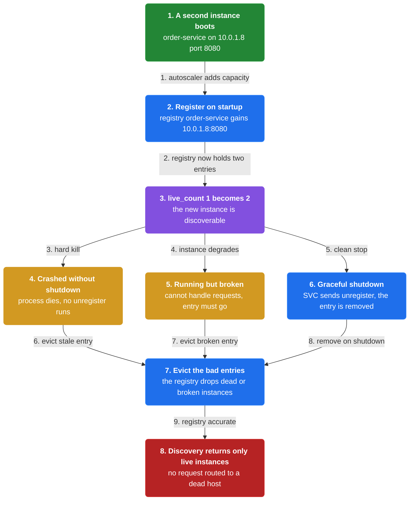
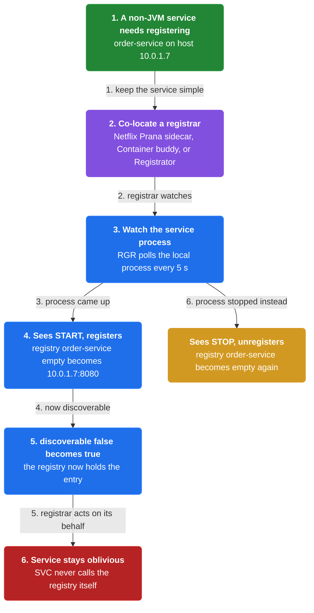
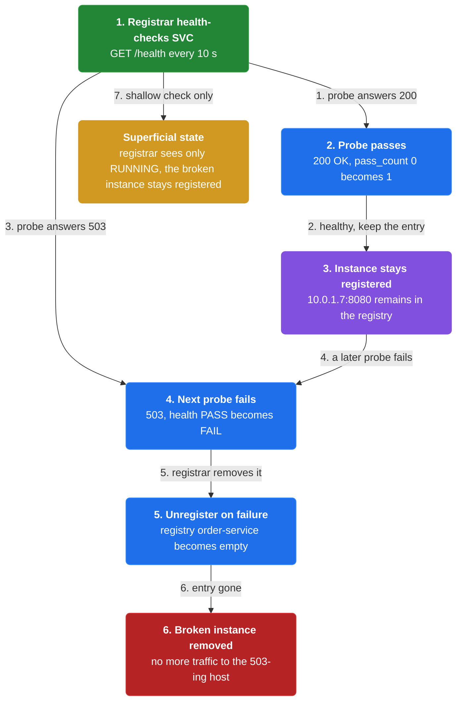
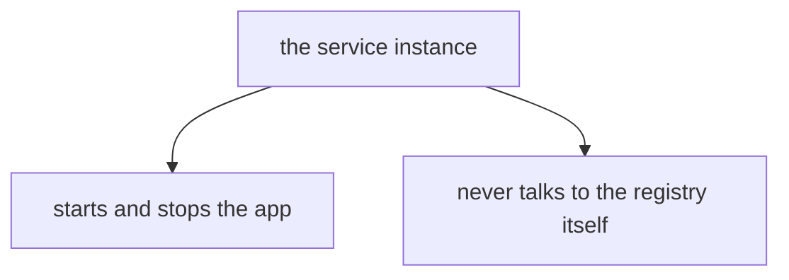
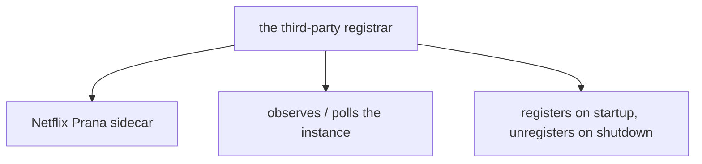
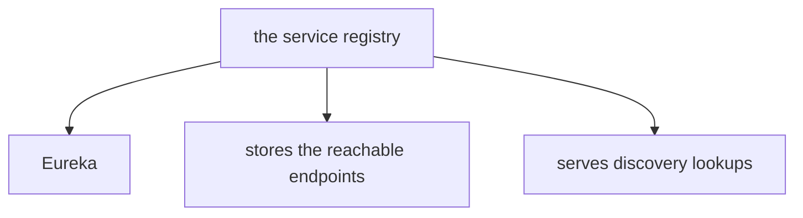
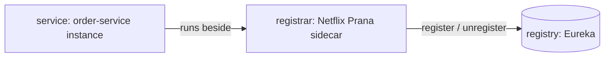
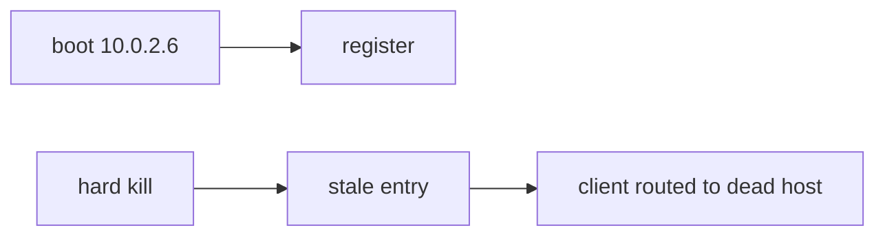
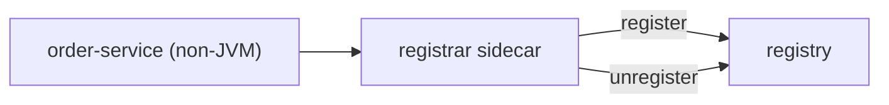
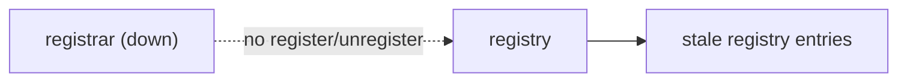

# Chapter 8: Third-Party Registration

> A separate third-party registrar registers a service instance with the registry on startup and unregisters it on shutdown, so the service stays free of registration code.

_Also known as: Chris Richardson · Microservice Patterns Ch. 8 · microservices.io /patterns/3rd-party-registration.html_

## Flow

### The registration lifecycle

> **Why this matters:** Without registration and unregistration, the registry drifts from reality: new instances stay invisible while dead or broken instances keep receiving traffic.



1. **Register on startup** — An instance must be added to the registry as soon as it comes up, so discovery can return it.

2. **Unregister on shutdown** — A graceful stop must remove the instance, so no new requests are routed to it.

3. **Evict crashed instances** — An instance that dies without a clean shutdown leaves a **stale entry** behind.

4. **Evict broken instances** — An instance that is running but cannot handle requests must also leave the registry.

```java
// REGISTRY SIDE — why the registration lifecycle exists: stale entries route requests to dead endpoints
// PARTIES: SVC = order-service instance · REG = service registry · CLI = a client resolving order-service
// STATE (before):
//    registry : {"order-service" -> [{"host":"10.0.1.7","port":8080}]}
//    live_count : 1
// DEF: a second instance boots · CALLED BY: the autoscaler adding capacity
// -> boot : {"host":"10.0.1.8","port":8080}
//    step 1 · register on startup : registry["order-service"] : [{"host":"10.0.1.7","port":8080}] -> [{"host":"10.0.1.7","port":8080},{"host":"10.0.1.8","port":8080}]
//    step 2 · live_count : 1 -> 2   BECAUSE the new instance registered itself on startup
// DEF: the 10.0.1.8 instance crashes · CALLED BY: a hard kill with no clean shutdown
// -> crash : "10.0.1.8"
//    step 1 · process dies : live_count : 2 -> 1   BECAUSE 10.0.1.8 is now a dead process
//    step 2 · stale entry persists : registry["order-service"] : [2 entries] -> [2 entries, one dead]   BECAUSE no unregister ran
// <- discovery result : ["10.0.1.7:8080","10.0.1.8:8080"]   (CLI can be routed to the dead host)
//    alt clean shutdown : SVC sends unregister -> registry["order-service"] : [{"host":"10.0.1.7","port":8080},{"host":"10.0.1.8","port":8080}] -> [{"host":"10.0.1.7","port":8080}]
```

### A third party owns register/unregister

> **Why this matters:** Moving the register/unregister duty out of the service keeps the service simple and language-agnostic, so a non-JVM app can be registered by a sidecar like Netflix Prana.



1. **Co-locate a registrar** — Run it beside the service as a sidecar (Netflix Prana), a parent process (Container buddy), or a Docker helper (Registrator).

2. **Register on startup** — The registrar registers the instance with the registry when the instance starts.

3. **Unregister on shutdown** — The registrar removes the instance from the registry when the instance stops.

4. **Keep the service oblivious** — The service never calls the registry itself — it only runs, and the registrar acts on its behalf.

```java
// REGISTRAR SIDE — a separate process registers and unregisters the instance on its behalf
// PARTIES: SVC = order-service instance · RGR = third-party registrar (sidecar) · REG = service registry
// DEF: proc — the service's OS process whose lifecycle the registrar watches; here svc_proc = "STOPPED" -> "STARTED" on host "10.0.1.7"
// STATE (before):
//    registry : {"order-service" -> []}
//    svc_proc : "STOPPED"
//    discoverable : "false"
// DEF: registrar watches the service process · CALLED BY: RGR polling the local process every 5s
// -> observed : "STARTED"   (SVC process on host 10.0.1.7 came up)
//    step 1 · RGR sees START : svc_proc : "STOPPED" -> "STARTED"
//    step 2 · RGR registers SVC : registry["order-service"] : [] -> [{"host":"10.0.1.7","port":8080}]
//    step 3 · discoverable : "false" -> "true"   BECAUSE the registry now holds the entry
// <- registry row : "order-service" -> [{"host":"10.0.1.7","port":8080}]
//    alt process stops : RGR sees STOP -> registry["order-service"] : [{"host":"10.0.1.7","port":8080}] -> []
```

### Health-check gating and its blind spot

> **Why this matters:** A registrar can probe an instance's health and register or unregister it on the result, but its view may be shallow, so a process that is up yet broken can slip through.



1. **Probe health** — The registrar performs a health check on the instance, like Netflix Prana.

2. **Register only when healthy** — The instance is registered while the health check passes.

3. **Unregister on failure** — The instance is removed when the health check fails.

4. **Beware superficial state** — A registrar that only knows RUNNING vs NOT RUNNING cannot tell a running-but-broken instance apart.

```java
// REGISTRAR SIDE — health-check gating decides whether an instance stays registered
// PARTIES: SVC = order-service instance · RGR = registrar with a health check · REG = registry
// STATE (before):
//    registry : {"order-service" -> [{"host":"10.0.1.7","port":8080}]}
//    health : "PASS"
//    pass_count : 0
// DEF: registrar health-checks SVC · CALLED BY: RGR every 10s
// -> probe_1 : "GET /health" -> "200 OK"   (healthy)
//    step 1 · probe passes : pass_count : 0 -> 1   BECAUSE probe_1 answered 200, SVC stays registered
// -> probe_2 : "GET /health" -> "503 Service Unavailable"   (the instance is now broken)
//    step 2 · health : "PASS" -> "FAIL"   BECAUSE probe_2 answered 503
//    step 3 · RGR unregisters SVC : registry["order-service"] : [{"host":"10.0.1.7","port":8080}] -> []
// <- registry row : "order-service" -> []   (broken instance removed)
//    alt shallow registrar : RGR sees only "RUNNING" -> the broken 10.0.1.7 stays registered (superficial state risk)
```


## System Design Interview

**The pipeline:** service instance → third-party registrar → service registry

### the service instance

_Role: service_



### the third-party registrar

_Role: registrar_



### the service registry

_Role: registry_





```java
// SYSTEM DESIGN — third-party registration as a pipeline: service instance -> third-party registrar -> service registry
// PARTIES: SVC = order-service instance (service: runs the app and never talks to the registry) · RGR = third-party registrar Netflix Prana (registrar: registers on startup, unregisters on shutdown) · REG = service registry Eureka (registry: stores the reachable endpoints)
// DEF: instance — a runnable copy of a service at a network location; here {"host":"10.0.2.5","port":8080}
// DEF: entry — a reachable endpoint stored in the registry; here "order-service" -> [{"host":"10.0.2.5","port":8080}]
// DEF: registrar — the sidecar that owns register/unregister; here Netflix Prana polling every 5 s
// STATE (before):
//    registry : {}       // Eureka holds no entry for order-service yet
//    process_state : "STOPPED"  // the service instance has not started
// DEF: register_instance · CALLED BY: RGR when the service instance boots
// -> instance : {"host":"10.0.2.5","port":8080}
//    step 1 · SVC starts, doing nothing registry-related : process_state : "STOPPED" -> "RUNNING"
//    step 2 · RGR polls SVC and writes the entry to REG : registry : {} -> { "order-service": [{"host":"10.0.2.5","port":8080}] }
//    step 3 · REG stores the entry and serves discovery lookups : lookup : "none" -> "10.0.2.5:8080"
//    step 4 · a client reads the registry and reaches SVC : request : "none" -> "GET /orders"
// <- entry : "order-service" -> [{"host":"10.0.2.5","port":8080}] · the service never talked to the registry itself
//    alt registrar down : no register/unregister runs and the registry drifts stale  BECAUSE the registrar sits on the discovery path
```

## Interview Questions

### Q1

A second order-service instance boots at 10.0.2.6, then gets hard-killed with no clean shutdown. A client resolves order-service and may be routed to a dead host.

**Interviewer's question:** Why does registration need a full lifecycle — register, unregister, evict crashed and broken instances?

**Solution:** An instance must be registered on startup, unregistered on shutdown, and evicted if it crashes or runs but cannot handle requests, or the registry drifts from reality.

**System-design components:**
- Register on startup
- Unregister on shutdown
- Evict crashed instances
- Evict broken instances



```java
// REGISTRY SIDE — why the registration lifecycle exists: stale entries route requests to dead endpoints
// PARTIES: SVC = order-service instance · REG = service registry · CLI = a client resolving order-service
// STATE (before):
//    registry : {"order-service" -> [{"host":"10.0.2.5","port":8080}]}
//    live_count : 1
// DEF: a second instance boots · CALLED BY: the autoscaler adding capacity
// -> boot : {"host":"10.0.2.6","port":8080}
//    step 1 · register on startup : registry["order-service"] : [{"host":"10.0.2.5","port":8080}] -> [{"host":"10.0.2.5","port":8080},{"host":"10.0.2.6","port":8080}]
//    step 2 · live_count : 1 -> 2   BECAUSE the new instance registered itself on startup
// DEF: the 10.0.2.6 instance crashes · CALLED BY: a hard kill with no clean shutdown
// -> crash : "10.0.2.6"
//    step 1 · process dies : live_count : 2 -> 1   BECAUSE 10.0.2.6 is now a dead process
//    step 2 · stale entry persists : registry["order-service"] : [2 entries] -> [2 entries, one dead]   BECAUSE no unregister ran
// <- discovery result : ["10.0.2.5:8080","10.0.2.6:8080"]   (CLI can be routed to the dead host)
//    alt clean shutdown : SVC sends unregister -> registry["order-service"] : [{"host":"10.0.2.5","port":8080},{"host":"10.0.2.6","port":8080}] -> [{"host":"10.0.2.5","port":8080}]
```

_This is exactly the registration lifecycle and the stale-entry danger in this chapter._

_Covers:_ The registration lifecycle

_From the 28 problems:_ 01-scale-from-zero-to-millions

### Q2

A non-JVM service must appear in the registry, but the team does not want to embed registry calls inside it.

**Interviewer's question:** How does a third-party registrar own register/unregister while keeping the service oblivious?

**Solution:** A separate registrar — a sidecar like Prana, a parent process, or a Docker helper — registers the instance on startup and unregisters it on shutdown, acting on the service's behalf.

**System-design components:**
- Co-located registrar (sidecar/parent/helper)
- Register on startup
- Unregister on shutdown
- Service stays oblivious



```java
// REGISTRAR SIDE — a separate process registers and unregisters the instance on its behalf
// PARTIES: SVC = order-service instance · RGR = third-party registrar (sidecar) · REG = service registry
// DEF: proc — the service's OS process whose lifecycle the registrar watches; here svc_proc = "STOPPED" -> "STARTED" on host "10.0.2.5"
// STATE (before):
//    registry : {"order-service" -> []}
//    svc_proc : "STOPPED"
//    discoverable : "false"
// DEF: registrar watches the service process · CALLED BY: RGR polling the local process every 5s
// -> observed : "STARTED"   (SVC process on host 10.0.2.5 came up)
//    step 1 · RGR sees START : svc_proc : "STOPPED" -> "STARTED"
//    step 2 · RGR registers SVC : registry["order-service"] : [] -> [{"host":"10.0.2.5","port":8080}]
//    step 3 · discoverable : "false" -> "true"   BECAUSE the registry now holds the entry
// <- registry row : "order-service" -> [{"host":"10.0.2.5","port":8080}]
//    alt process stops : RGR sees STOP -> registry["order-service"] : [{"host":"10.0.2.5","port":8080}] -> []
```

_This is exactly the third-party registrar owning register/unregister in this chapter._

_Covers:_ A third party owns register/unregister

_From the 28 problems:_ 01-scale-from-zero-to-millions

### Q3

A registrar health-checks its instance: the first probe passes, but the second returns 503 because the instance is now broken.

**Interviewer's question:** How does health-check gating decide registration, and what is its blind spot?

**Solution:** The registrar registers the instance while the health check passes and unregisters it on failure; a shallow registrar that only knows RUNNING vs NOT RUNNING cannot see a running-but-broken instance.

**System-design components:**
- Health probe
- Register when healthy
- Unregister on failure
- Superficial RUNNING/NOT RUNNING view


```java
// REGISTRAR SIDE — health-check gating decides whether an instance stays registered
// PARTIES: SVC = order-service instance · RGR = registrar with a health check · REG = registry
// STATE (before):
//    registry : {"order-service" -> [{"host":"10.0.2.5","port":8080}]}
//    health : "PASS"
//    pass_count : 0
// DEF: registrar health-checks SVC · CALLED BY: RGR every 10s
// -> probe_1 : "GET /health" -> "200 OK"   (healthy)
//    step 1 · probe passes : pass_count : 0 -> 1   BECAUSE probe_1 answered 200, SVC stays registered
// -> probe_2 : "GET /health" -> "503 Service Unavailable"   (the instance is now broken)
//    step 2 · health : "PASS" -> "FAIL"   BECAUSE probe_2 answered 503
//    step 3 · RGR unregisters SVC : registry["order-service"] : [{"host":"10.0.2.5","port":8080}] -> []
// <- registry row : "order-service" -> []   (broken instance removed)
//    alt shallow registrar : RGR sees only "RUNNING" -> the broken 10.0.2.5 stays registered (superficial state risk)
```

_This is exactly the health-check gating and its superficial-state blind spot in this chapter._

_Covers:_ Health-check gating and its blind spot

_From the 28 problems:_ 01-scale-from-zero-to-millions

### Q4

The team runs the registrar themselves rather than relying on Kubernetes or Marathon to fold it into the infrastructure.

**Interviewer's question:** What does the registrar add to the system, and why must it be highly available?

**Solution:** Unless it is part of the infrastructure, the registrar is another component to install, configure, and maintain, and because it sits on the path to discovery it must be highly available.

**System-design components:**
- Registrar on the discovery path
- Install/configure/maintain burden
- High availability requirement



```java
// REGISTRAR SIDE — the registrar is a critical component: if it dies, register/unregister stops and the registry drifts
// PARTIES: RGR = registrar · REG = registry · SVC = order-service instance
// STATE (before):
//    registrar : "UP"
//    registry : {"order-service" -> [{"host":"10.0.2.5","port":8080}]}
//    pending_registration : "none"
// DEF: the registrar fails · CALLED BY: the registrar process crashing
// -> crash : "registrar"
//    step 1 · registrar goes down : registrar : "UP" -> "DOWN"
//    step 2 · a new instance boots but nothing registers it : pending_registration : "none" -> "10.0.2.6"   BECAUSE the registrar is not there to register it
//    step 3 · the registry stays stale : registry["order-service"] : [{"host":"10.0.2.5","port":8080}] -> [{"host":"10.0.2.5","port":8080}]   BECAUSE no unregister/register can run
// <- registry state : the new 10.0.2.6 stays invisible · discovery returns only 10.0.2.5
//    alt infrastructure-owned : Kubernetes folds the registrar into built-in infrastructure, so there is no extra process to keep alive
```

_This is exactly the another-critical-component drawback of third-party registration in this chapter._

_Covers:_ A third party owns register/unregister · Health-check gating and its blind spot

_From the 28 problems:_ 01-scale-from-zero-to-millions

## Key Concepts

### The Problem

**Registration is a lifecycle duty.** An instance must be registered on startup, unregistered on shutdown, and evicted if it crashes or runs but cannot handle requests.


### The Solution

A third-party registrar registers the instance when it starts and unregisters it when it stops, so the service never talks to the registry itself.


### Key Facts

| Fact | Detail | In the wild |
|---|---|---|
| A third party owns register/unregister | A third-party registrar registers the instance when it starts and unregisters it when it stops, so the service never talks to the registry itself. | Netflix Prana runs as a sidecar for non-JVM apps and registers them with Eureka; Registrator and Container buddy do the same for Docker containers. |
| Health-check gating vs superficial state | The registrar can health-check the instance and register or unregister it based on the result, but a naive registrar only sees RUNNING or NOT RUNNING. | A health-checking registrar removes a 503-ing instance; a superficial one leaves it registered until the process dies. |
| Another critical component | Unless the registrar is part of the infrastructure, it is another component to install, configure, and maintain, and it must be highly available. | Kubernetes and Marathon fold the registrar into built-in infrastructure; a standalone Registrator adds an extra moving part you must run. |


### Tradeoffs & When

- The registrar can health-check the instance and register or unregister it based on the result, but a naive registrar only sees RUNNING or NOT RUNNING.
- Unless the registrar is part of the infrastructure, it is another component to install, configure, and maintain, and it must be highly available.


<details><summary>All concepts (index)</summary>

### Problem: Registration is a lifecycle duty

**Why.** A service instance is only reachable through discovery if the registry knows where it lives, so every start and stop must be reflected in the registry.

**Claim.** An instance must be registered on startup, unregistered on shutdown, and evicted if it crashes or runs but cannot handle requests.

**Grounding.** Richardson's three forces: register on startup and unregister on shutdown; unregister crashed instances; unregister running-but-incapable instances.

**In the wild.** Leaving a dead endpoint registered means a client-side or server-side discovery lookup can still route a request to a host that will never answer.
### Solution: A third party owns register/unregister

**Why.** Embedding registration calls in every service complicates the service and ties it to one registry, so the duty is moved out.

**Claim.** A third-party registrar registers the instance when it starts and unregisters it when it stops, so the service never talks to the registry itself.

**Grounding.** Richardson's solution: "A 3rd party registrar is responsible for registering and unregistering a service instance."

**In the wild.** Netflix Prana runs as a sidecar for non-JVM apps and registers them with Eureka; Registrator and Container buddy do the same for Docker containers.
### Tradeoff: Health-check gating vs superficial state

**Why.** A registrar that only knows a process is running cannot tell whether it can still answer requests.

**Claim.** The registrar can health-check the instance and register or unregister it based on the result, but a naive registrar only sees RUNNING or NOT RUNNING.

**Grounding.** Richardson notes the registrar may have "superficial knowledge of the state of the service instance" while some, like Prana, perform a health check.

**In the wild.** A health-checking registrar removes a 503-ing instance; a superficial one leaves it registered until the process dies.
### Tradeoff: Another critical component

**Why.** The registrar now sits on the path to discovery, so its own availability becomes a system concern.

**Claim.** Unless the registrar is part of the infrastructure, it is another component to install, configure, and maintain, and it must be highly available.

**Grounding.** Richardson lists this as the drawback: it is a critical system component that needs to be highly available.

**In the wild.** Kubernetes and Marathon fold the registrar into built-in infrastructure; a standalone Registrator adds an extra moving part you must run.

</details>


## Quiz

1. What does a third-party registrar do on behalf of a service instance?

   - A. It registers the instance on startup and unregisters it on shutdown
   - B. It writes the instance's business logic
   - C. It routes each client request to the instance
   - D. It stores the service's persistent data

<details><summary>Reveal answer</summary>

**A.** The registrar owns the registration lifecycle: it registers the instance when it starts and unregisters it when it stops (the reference's solution). B, C, and D describe application logic, routing, and storage, none of which are the registrar's job.

</details>

2. Which is a benefit of third-party registration over self-registration?

   - A. The registrar always knows the instance's full internal state
   - B. The service code is less complex because it is not responsible for registering itself
   - C. It removes the need for a service registry
   - D. It requires no additional component to run

<details><summary>Reveal answer</summary>

**B.** The reference says the service code is less complex than with self-registration because it does not register itself. A is wrong (the registrar often has only superficial state), C is wrong (a registry is still required), and D is wrong (the registrar is itself an extra component).

</details>

3. Which of these is an example of a third-party registrar?

   - A. Netflix Prana, a sidecar that registers a non-JVM app with Eureka
   - B. Ribbon, an HTTP client that queries Eureka
   - C. The API gateway
   - D. Spring Cloud Config

<details><summary>Reveal answer</summary>

**A.** Prana is listed as a sidecar that registers a non-JVM application with Eureka. Ribbon is a client-side discovery client, not a registrar; the API gateway and Spring Cloud Config are unrelated to registration.

</details>

4. What is a drawback of third-party registration?

   - A. It couples the service to the registry
   - B. It adds the most network hops
   - C. It cannot perform health checks
   - D. The registrar may only know RUNNING vs NOT RUNNING, and it is another critical component that must be highly available

<details><summary>Reveal answer</summary>

**D.** The reference lists both drawbacks: superficial state knowledge, and the cost of installing, configuring, and keeping a critical component highly available. A is self-registration's drawback, B is server-side discovery's, and C is false because some registrars like Prana do health-check.

</details>

