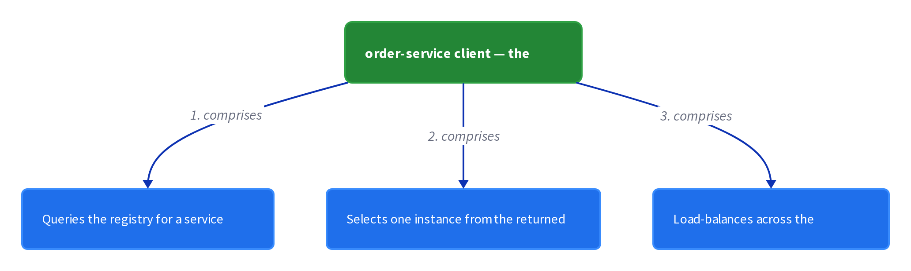
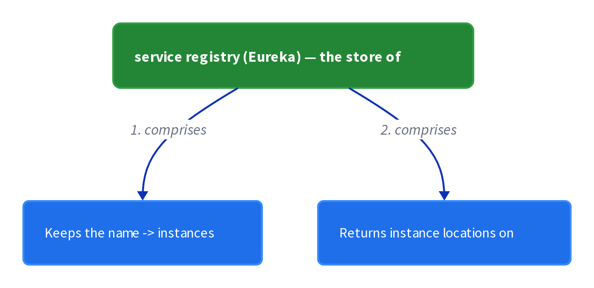
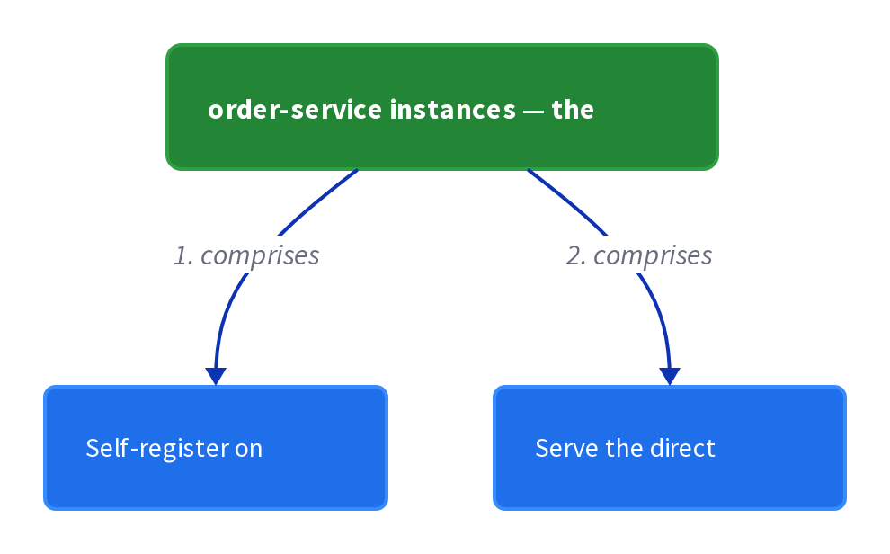

# Chapter 9: Client-Side Discovery

> When making a request, the client queries the service registry for the network location of a service instance and calls that instance directly, instead of routing through a load balancer.

_Also known as: Chris Richardson · Microservice Patterns Ch. 9 · microservices.io /patterns/client-side-discovery.html_

## Flow

### Why fixed locations no longer work

> **Why this matters:** Instances under dynamic IPs and load-driven scaling cannot be reached by a fixed host and port, so clients need a lookup mechanism.

1. **From method calls to fixed endpoints** — Monoliths used language-level calls; traditional deployments used fixed, well-known hosts and ports.

2. **Dynamic IPs** — VMs and containers are usually assigned dynamic IP addresses.

3. **Varying instance counts** — An EC2 Autoscaling Group adjusts the number of instances based on load.

4. **A lookup is needed** — Clients need a mechanism to reach a dynamically changing set of ephemeral instances.

```java
// CLIENT SIDE — a hardcoded host:port goes stale the moment instances move, motivating a lookup mechanism
// PARTIES: CLI = order-service client · SVC = order-service instances
// DEF: call — one request the client sends to the order-service = call_status "ok", which becomes "connection refused" once the endpoint goes stale
// DEF: instance — one running copy of the order-service = the VM at instance_ip "10.0.1.7"
// DEF: ip — the network address of an instance = "10.0.1.7", replaced by "10.0.1.9" when the autoscaler scales out
// STATE (before):
//    endpoint : "http://10.0.1.7:8080"
//    instance_ip : "10.0.1.7"
//    call_status : "ok"
// DEF: an autoscaling event moves the instance · CALLED BY: the EC2 Autoscaling Group
// -> scale_event : "replace 10.0.1.7 with 10.0.1.9"
//    step 1 · instance_ip : "10.0.1.7" -> "10.0.1.9"   BECAUSE the autoscaler replaced the VM
//    step 2 · endpoint : "http://10.0.1.7:8080" -> "http://10.0.1.7:8080 (stale)"   BECAUSE the client still points at the old IP
//    step 3 · call_status : "ok" -> "connection refused"   BECAUSE the client dials the dead 10.0.1.7
// <- call result : "connection refused"   (the client never learned the new location)
//    alt with discovery : CLI queries a registry -> endpoint : "http://10.0.1.7:8080 (stale)" -> "http://10.0.1.9:8080"
```

### Resolve via the registry on every call

> **Why this matters:** The core move: the client asks the registry where an instance lives, then calls that instance directly — no router in the middle.

1. **Ask the registry** — The client queries the Service Registry, which knows the locations of all instances.

2. **Get a location** — The registry returns the network location (host and port) of an available instance.

3. **Call the instance directly** — The client sends the request straight to that instance over HTTP/REST or another remote API.

4. **Chassis does the work** — This lookup is typically handled by a **microservice chassis** framework.

```java
// CLIENT SIDE — resolve a logical name to a concrete instance, then call that instance directly
// PARTIES: CLI = order-service client · REG = service registry · SVC = order-service instances
// STATE (before):
//    registry : {"order-service" -> [{"host":"10.0.1.7","port":8080},{"host":"10.0.1.8","port":8080}]}
//    resolved : []
//    target : "none"
// DEF: a client wants to call order-service · CALLED BY: CLI placing an order
// -> request : "POST /orders"
//    step 1 · query the registry : CLI asks REG for "order-service"
//    step 2 · resolve : resolved : [] -> ["10.0.1.7:8080","10.0.1.8:8080"]   BECAUSE the registry returns all known instances
//    step 3 · pick one : target : "none" -> "10.0.1.7:8080"   BECAUSE the client load-balances across the returned set
// <- call : "POST http://10.0.1.7:8080/orders"   (the client calls the instance directly)
//    alt second attempt : the first instance is busy -> target : "10.0.1.7:8080" -> "10.0.1.8:8080"
```

### Eureka and Ribbon wire it together

> **Why this matters:** Spring Cloud hides the lookup: a logical name in the URL is resolved by Eureka and Ribbon into a concrete network location.

1. **Logical name, not IP** — user_registration_url is set to http://REGISTRATION-SERVICE/user — a logical service name.

2. **Enable the Eureka client** — @EnableEurekaClient turns on the Eureka client in the chassis.

3. **Load-balance with Ribbon** — @LoadBalanced configures the RestTemplate to use Ribbon, which queries Eureka to route requests.

4. **Resolve and call** — The RestTemplate resolves the logical name to a network location and calls an instance.

```java
// CLIENT SIDE — the chassis (Spring Cloud) resolves a logical name via Eureka + Ribbon under the hood
// PARTIES: CLI = RegistrationServiceProxy · RBN = Ribbon (HTTP client) · EUK = Eureka (registry) · SVC = registration-service instance
// DEF: resttemplate — the Spring HTTP client whose URL host is resolved by Ribbon = restTemplate_target "unresolved", rewritten to "10.0.2.4:8080"
// DEF: target — the network location a request is routed to = "10.0.2.4:8080"
// STATE (before):
//    eureka_registry : {"registration-service" -> [{"host":"10.0.2.4","port":8080}]}
//    restTemplate_target : "unresolved"
//    instances : []
// DEF: the proxy registers a user · CALLED BY: CLI calling restTemplate.postForEntity
// -> request_url : "http://REGISTRATION-SERVICE/user"   (a logical name, not an IP)
//    step 1 · @LoadBalanced intercepts : restTemplate_target : "unresolved" -> "REGISTRATION-SERVICE"   BECAUSE the URL host is a logical service name
//    step 2 · Ribbon asks Eureka : instances : [] -> [{"host":"10.0.2.4","port":8080}]   BECAUSE Ribbon queried Eureka for "registration-service"
//    step 3 · route to the instance : restTemplate_target : "REGISTRATION-SERVICE" -> "10.0.2.4:8080"   BECAUSE Ribbon rewrites the logical name to a network location
// <- http call : "POST http://10.0.2.4:8080/user"   (the request now hits a real instance)
//    alt no instance found : Ribbon gets [] -> restTemplate_target : "REGISTRATION-SERVICE" -> "unresolved" (the call fails)
```

### Fewer hops, but coupled to the registry

> **Why this matters:** Client-side discovery wins on hops, but it couples the client to the registry and must be re-implemented in every language your clients use.

1. **Fewer moving parts** — Client-side discovery has fewer moving parts and network hops than server-side discovery.

2. **Coupled to the registry** — The client is coupled to the Service Registry.

3. **Per-language logic** — Discovery logic must be implemented per language/framework, such as Java/Scala or JavaScript/NodeJS.

4. **Prana for non-JVM** — Netflix Prana offers an HTTP-proxy approach to discovery for non-JVM clients.

```java
// CLIENT SIDE — hop-count comparison: client-side discovery takes fewer hops and moving parts than server-side
// PARTIES: CLI = client · REG = registry · SVC = order-service instance · RTR = router (server-side only)
// STATE (before):
//    mode : "client-side"
//    hops_client_side : 0
//    hops_server_side : 0
//    parts_client_side : 0
//    parts_server_side : 0
// DEF: measure one request's cost · CALLED BY: CLI sending one request
// -> request : "POST /orders"
//    step 1 · hops_client_side : 0 -> 2   BECAUSE the client hops to REG then to SVC (two hops)
//    step 2 · hops_server_side : 0 -> 3   BECAUSE the client hops to RTR, which hops to REG then SVC (three hops)
//    step 3 · moving parts : parts_client_side : 0 -> 2, parts_server_side : 0 -> 3   BECAUSE server-side adds the router as an extra component
// <- comparison : "2 hops vs 3 hops"   (client-side wins on hops, but couples the client to the registry)
//    alt non-JVM client : Netflix Prana runs a local HTTP proxy -> the client keeps its 2-hop path without JVM discovery code
```


## System Design Interview

> **The question:** Design service discovery where the client picks the instance. Premise: the client queries the service registry and load-balances across service instances itself, so no server-side hop is needed.

**The pipeline:** client → service registry → service instances (client load-balances)

### order-service client — the client

_Role: client_



### service registry (Eureka) — the store of locations

_Role: service registry_



### order-service instances — the targets

_Role: service instances_



```java
// SYSTEM DESIGN — client-side discovery as a pipeline: client -> service registry -> service instances (the client load-balances and calls one instance directly, no router)
// PARTIES: CLI = order-service client (queries the registry, load-balances, and calls an instance directly) · REG = service registry (Eureka) · SVC = order-service instances (self-register and serve requests)
// DEF: registry — REG's map of service name -> instances; here {"order-service" -> ["10.0.1.7:8080", "10.0.1.8:8080"]}
// DEF: list — the instances REG returns for one name; here ["10.0.1.7:8080", "10.0.1.8:8080"]
// DEF: target — the one instance location the client picks; here "10.0.1.7:8080"
// DEF: status — the outcome of the direct call; here "200 OK"
// STATE (before):
//    registry : {"order-service" -> ["10.0.1.7:8080", "10.0.1.8:8080"]}
//    list     : []
//    target   : "none"
//    status   : "none"
// DEF: resolve_and_call · CALLED BY: CLI placing an order
// -> request : "POST /orders"
//    step 1 · CLI queries REG for "order-service"    list : [] -> ["10.0.1.7:8080", "10.0.1.8:8080"]   BECAUSE REG returns every known instance for the name
//    step 2 · CLI load-balances across the set    target : "none" -> "10.0.1.7:8080"   BECAUSE the client picks one instance from the returned list
//    step 3 · CLI calls the instance directly    status : "none" -> "200 OK"   BECAUSE the request goes straight to the chosen instance, no router
// <- call : "POST http://10.0.1.7:8080/orders"   (2 hops: CLI->REG then CLI->SVC)
```

## Interview Questions

### Q1

An order-service client still dials a hardcoded 10.0.3.7, but the autoscaler has just replaced that VM with 10.0.3.9.

**Interviewer's question:** Why do fixed host:port locations break in a microservice deployment, and what mechanism replaces them?

**Solution:** Instances get dynamic IPs and vary in count under autoscaling, so a fixed location goes stale; clients need a lookup mechanism to reach the changing set of instances.

**System-design components:**
- Dynamic IPs
- Autoscaling group
- Stale fixed endpoint
- Lookup mechanism

```java
// CLIENT SIDE — a hardcoded host:port goes stale the moment instances move, motivating a lookup mechanism
// PARTIES: CLI = order-service client · SVC = order-service instances
// DEF: call — one request the client sends to the order-service = call_status "ok", which becomes "connection refused" once the endpoint goes stale
// DEF: instance — one running copy of the order-service = the VM at instance_ip "10.0.3.7"
// DEF: ip — the network address of an instance = "10.0.3.7", replaced by "10.0.3.9" when the autoscaler scales out
// STATE (before):
//    endpoint : "http://10.0.3.7:8080"
//    instance_ip : "10.0.3.7"
//    call_status : "ok"
// DEF: an autoscaling event moves the instance · CALLED BY: the EC2 Autoscaling Group
// -> scale_event : "replace 10.0.3.7 with 10.0.3.9"
//    step 1 · instance_ip : "10.0.3.7" -> "10.0.3.9"   BECAUSE the autoscaler replaced the VM
//    step 2 · endpoint : "http://10.0.3.7:8080" -> "http://10.0.3.7:8080 (stale)"   BECAUSE the client still points at the old IP
//    step 3 · call_status : "ok" -> "connection refused"   BECAUSE the client dials the dead 10.0.3.7
// <- call result : "connection refused"   (the client never learned the new location)
//    alt with discovery : CLI queries a registry -> endpoint : "http://10.0.3.7:8080 (stale)" -> "http://10.0.3.9:8080"
```

_This is exactly the dynamic-instances force that motivates client-side discovery in this chapter._

_Covers:_ Why fixed locations no longer work

_From the 28 problems:_ 01-scale-from-zero-to-millions

### Q2

An order-service client must place an order but does not know which instances are up right now.

**Interviewer's question:** How does the client resolve a logical service name to a concrete instance on every call?

**Solution:** The client queries the service registry, which knows all instance locations, then calls the chosen instance directly — no router in the middle.

**System-design components:**
- Service registry query
- Returned instance set
- Direct call to the instance

```java
// CLIENT SIDE — resolve a logical name to a concrete instance, then call that instance directly
// PARTIES: CLI = order-service client · REG = service registry · SVC = order-service instances
// STATE (before):
//    registry : {"order-service" -> [{"host":"10.0.3.7","port":8080},{"host":"10.0.3.8","port":8080}]}
//    resolved : []
//    target : "none"
// DEF: a client wants to call order-service · CALLED BY: CLI placing an order
// -> request : "POST /orders"
//    step 1 · query the registry : CLI asks REG for "order-service"
//    step 2 · resolve : resolved : [] -> ["10.0.3.7:8080","10.0.3.8:8080"]   BECAUSE the registry returns all known instances
//    step 3 · pick one : target : "none" -> "10.0.3.7:8080"   BECAUSE the client load-balances across the returned set
// <- call : "POST http://10.0.3.7:8080/orders"   (the client calls the instance directly)
//    alt second attempt : the first instance is busy -> target : "10.0.3.7:8080" -> "10.0.3.8:8080"
```

_This is exactly the query-the-registry-then-call-directly mechanism in this chapter._

_Covers:_ Resolve via the registry on every call

_From the 28 problems:_ 01-scale-from-zero-to-millions

### Q3

The registration proxy's configured URL is http://REGISTRATION-SERVICE/user — a logical name, not an IP — and the team wants to know how it ever reaches a real host.

**Interviewer's question:** How do Eureka and Ribbon turn a logical service name into a network location?

**Solution:** @EnableEurekaClient turns on the Eureka client, and @LoadBalanced makes the RestTemplate use Ribbon, which queries Eureka and rewrites the logical name to a network location.

**System-design components:**
- @EnableEurekaClient
- @LoadBalanced RestTemplate
- Ribbon (queries Eureka)
- Resolved network location

```java
// CLIENT SIDE — the chassis (Spring Cloud) resolves a logical name via Eureka + Ribbon under the hood
// PARTIES: CLI = RegistrationServiceProxy · RBN = Ribbon (HTTP client) · EUK = Eureka (registry) · SVC = registration-service instance
// DEF: resttemplate — the Spring HTTP client whose URL host is resolved by Ribbon = restTemplate_target "unresolved", rewritten to "10.0.4.4:8080"
// DEF: target — the network location a request is routed to = "10.0.4.4:8080"
// STATE (before):
//    eureka_registry : {"registration-service" -> [{"host":"10.0.4.4","port":8080}]}
//    restTemplate_target : "unresolved"
//    instances : []
// DEF: the proxy registers a user · CALLED BY: CLI calling restTemplate.postForEntity
// -> request_url : "http://REGISTRATION-SERVICE/user"   (a logical name, not an IP)
//    step 1 · @LoadBalanced intercepts : restTemplate_target : "unresolved" -> "REGISTRATION-SERVICE"   BECAUSE the URL host is a logical service name
//    step 2 · Ribbon asks Eureka : instances : [] -> [{"host":"10.0.4.4","port":8080}]   BECAUSE Ribbon queried Eureka for "registration-service"
//    step 3 · route to the instance : restTemplate_target : "REGISTRATION-SERVICE" -> "10.0.4.4:8080"   BECAUSE Ribbon rewrites the logical name to a network location
// <- http call : "POST http://10.0.4.4:8080/user"   (the request now hits a real instance)
//    alt no instance found : Ribbon gets [] -> restTemplate_target : "REGISTRATION-SERVICE" -> "unresolved" (the call fails)
```

_This is exactly the Eureka-plus-Ribbon wiring in this chapter._

_Covers:_ Eureka and Ribbon wire it together

_From the 28 problems:_ 01-scale-from-zero-to-millions

### Q4

The team weighs client-side discovery against a server-side router for the same request path.

**Interviewer's question:** How do the two discovery approaches compare on hops and coupling, and what per-language cost does client-side discovery carry?

**Solution:** Client-side discovery has fewer moving parts and network hops but couples the client to the registry, and discovery logic must be re-implemented per language or framework.

**System-design components:**
- Client-side: 2 hops
- Server-side: 3 hops
- Client coupled to registry
- Per-language discovery logic

```java
// CLIENT SIDE — hop-count comparison: client-side discovery takes fewer hops and moving parts than server-side
// PARTIES: CLI = client · REG = registry · SVC = order-service instance · RTR = router (server-side only)
// STATE (before):
//    mode : "client-side"
//    hops_client_side : 0
//    hops_server_side : 0
//    parts_client_side : 0
//    parts_server_side : 0
// DEF: measure one request's cost · CALLED BY: CLI sending one request
// -> request : "POST /orders"
//    step 1 · hops_client_side : 0 -> 2   BECAUSE the client hops to REG then to SVC (two hops)
//    step 2 · hops_server_side : 0 -> 3   BECAUSE the client hops to RTR, which hops to REG then SVC (three hops)
//    step 3 · moving parts : parts_client_side : 0 -> 2, parts_server_side : 0 -> 3   BECAUSE server-side adds the router as an extra component
// <- comparison : "2 hops vs 3 hops"   (client-side wins on hops, but couples the client to the registry)
//    alt non-JVM client : Netflix Prana runs a local HTTP proxy -> the client keeps its 2-hop path without JVM discovery code
```

_This is exactly the fewer-hops-versus-coupling tradeoff in this chapter._

_Covers:_ Fewer hops, but coupled to the registry

_From the 28 problems:_ 01-scale-from-zero-to-millions

## Key Concepts

### The Problem

**Dynamic instances break fixed locations.** A client needs a mechanism to reach a dynamically changing set of ephemeral service instances.


### The Solution

The client queries a Service Registry, which knows all instance locations, then calls the chosen instance directly.

```java
// CLIENT SIDE — a hardcoded host:port goes stale the moment instances move, motivating a lookup mechanism
// PARTIES: CLI = order-service client · SVC = order-service instances
// DEF: call — one request the client sends to the order-service = call_status "ok", which becomes "connection refused" once the endpoint goes stale
// DEF: instance — one running copy of the order-service = the VM at instance_ip "10.0.3.7"
// DEF: ip — the network address of an instance = "10.0.3.7", replaced by "10.0.3.9" when the autoscaler scales out
// STATE (before):
//    endpoint : "http://10.0.3.7:8080"
//    instance_ip : "10.0.3.7"
//    call_status : "ok"
// DEF: an autoscaling event moves the instance · CALLED BY: the EC2 Autoscaling Group
// -> scale_event : "replace 10.0.3.7 with 10.0.3.9"
//    step 1 · instance_ip : "10.0.3.7" -> "10.0.3.9"   BECAUSE the autoscaler replaced the VM
//    step 2 · endpoint : "http://10.0.3.7:8080" -> "http://10.0.3.7:8080 (stale)"   BECAUSE the client still points at the old IP
//    step 3 · call_status : "ok" -> "connection refused"   BECAUSE the client dials the dead 10.0.3.7
// <- call result : "connection refused"   (the client never learned the new location)
//    alt with discovery : CLI queries a registry -> endpoint : "http://10.0.3.7:8080 (stale)" -> "http://10.0.3.9:8080"
```


### Key Facts

| Fact | Detail | In the wild |
|---|---|---|
| Query the registry on every call | The client queries a Service Registry, which knows all instance locations, then calls the chosen instance directly. | The RegistrationServiceProxy resolves http://REGISTRATION-SERVICE/user by asking Eureka and routing through Ribbon. |
| Fewer hops, but coupled to the registry | Client-side discovery has fewer moving parts and network hops than server-side, yet couples the client to the registry. | Two hops (client to registry, client to instance) beat a router round-trip, at the price of every client knowing the registry. |
| One discovery client per language | You must implement client-side discovery for each programming language or framework, such as Java/Scala or JavaScript/NodeJS. | A JVM service uses Ribbon; a non-JVM client can use Prana to proxy to Eureka instead of porting the client. |


### Tradeoffs & When

- Client-side discovery has fewer moving parts and network hops than server-side, yet couples the client to the registry.
- You must implement client-side discovery for each programming language or framework, such as Java/Scala or JavaScript/NodeJS.


<details><summary>All concepts (index)</summary>

### Problem: Dynamic instances break fixed locations

**Why.** Services call each other, but in containers and VMs the instance count and their locations change constantly, so any fixed host:port breaks.

**Claim.** A client needs a mechanism to reach a dynamically changing set of ephemeral service instances.

**Grounding.** Richardson's forces: VMs and containers get dynamic IPs, and an EC2 Autoscaling Group varies the number of instances with load.

**In the wild.** A monolith used language-level calls; a traditional deployment used fixed well-known locations — neither survives an autoscaled container fleet.
### Solution: Query the registry on every call

**Why.** The client must learn the location fresh, because the location changes between requests.

**Claim.** The client queries a Service Registry, which knows all instance locations, then calls the chosen instance directly.

**Grounding.** Richardson's solution: "the client obtains the location of a service instance by querying a Service Registry," typically via a microservice chassis.

**In the wild.** The RegistrationServiceProxy resolves http://REGISTRATION-SERVICE/user by asking Eureka and routing through Ribbon.
### Tradeoff: Fewer hops, but coupled to the registry

**Why.** Going straight from client to instance removes a middleman, but it binds the client to the registry interface.

**Claim.** Client-side discovery has fewer moving parts and network hops than server-side, yet couples the client to the registry.

**Grounding.** Richardson lists both: a benefit ("fewer moving parts and network hops") and a drawback ("couples the client to the Service Registry").

**In the wild.** Two hops (client to registry, client to instance) beat a router round-trip, at the price of every client knowing the registry.
### Tradeoff: One discovery client per language

**Why.** Discovery logic lives in the client, so it must be re-implemented wherever a client runs.

**Claim.** You must implement client-side discovery for each programming language or framework, such as Java/Scala or JavaScript/NodeJS.

**Grounding.** Richardson names the per-language cost and points to Netflix Prana as an HTTP-proxy workaround for non-JVM clients.

**In the wild.** A JVM service uses Ribbon; a non-JVM client can use Prana to proxy to Eureka instead of porting the client.

</details>


## Quiz

1. How does a client-side discovery client learn where a service instance lives?

   - A. It asks the router or load balancer
   - B. It queries the service registry and then calls the instance directly
   - C. It hardcodes each instance's IP and port
   - D. It asks DNS to return a port number

<details><summary>Reveal answer</summary>

**B.** The client queries the Service Registry, which knows all instance locations, then calls the chosen instance itself. A is server-side discovery (a router), C is a fixed-location deployment, and D is not the mechanism described.

</details>

2. In the example application, which value is a logical name that gets resolved by discovery?

   - A. http://user-registration-url
   - B. http://REGISTRATION-SERVICE/user
   - C. http://eureka-host
   - D. http://ribbon-client

<details><summary>Reveal answer</summary>

**B.** The reference sets user_registration_url to http://REGISTRATION-SERVICE/user, and REGISTRATION-SERVICE is the logical service name resolved to a network location. A, C, and D are not the value used in the reference.

</details>

3. Which two Netflix OSS components implement the example's client-side discovery?

   - A. Eureka (registry) and Ribbon (HTTP client that queries it)
   - B. Zuul and Hystrix
   - C. Prana and Registrator
   - D. ELB and an autoscaling group

<details><summary>Reveal answer</summary>

**A.** Eureka is the Service Registry and Ribbon is the HTTP client that queries Eureka to route to an instance. B is routing/resilience, C is third-party registration, and D is server-side discovery.

</details>

4. Which is a drawback of client-side discovery?

   - A. It has more moving parts than server-side discovery
   - B. It couples the client to the registry and requires discovery logic per language/framework
   - C. It requires a separate router component
   - D. It adds the most network hops

<details><summary>Reveal answer</summary>

**B.** The reference lists coupling to the registry and the per-language implementation cost. A and D invert the truth (client-side has fewer parts and fewer hops), and C describes server-side discovery's router.

</details>

