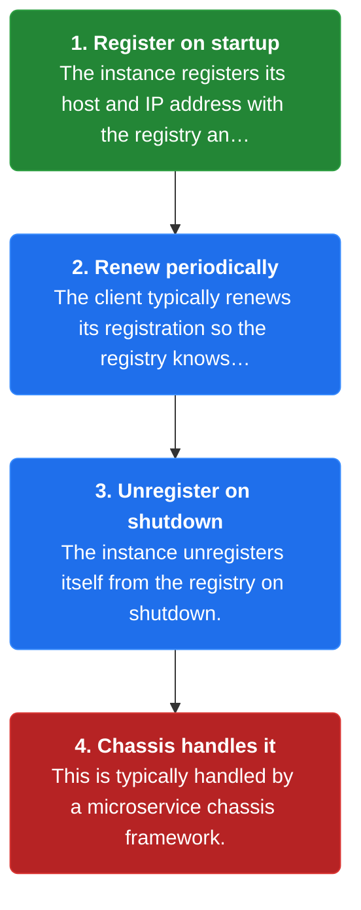
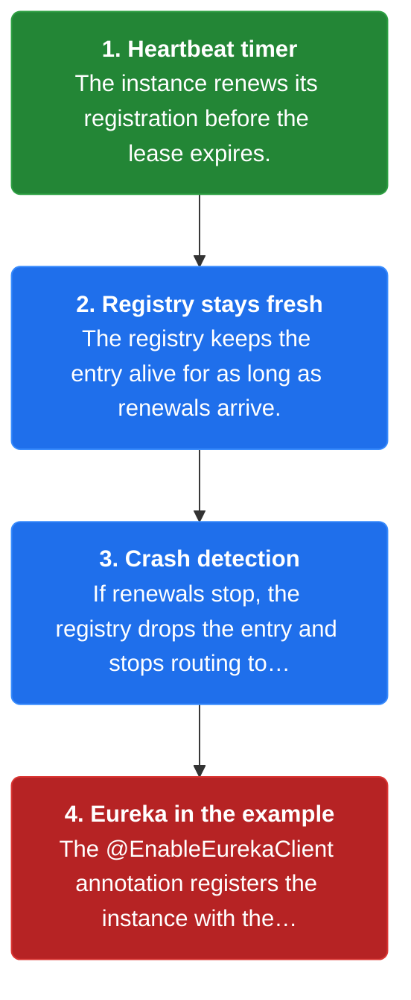
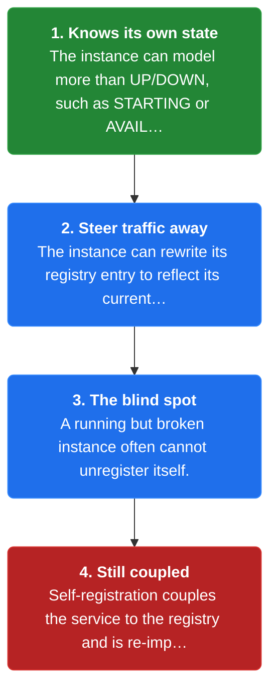

# Chapter 10: Self-Registration

> A service instance registers itself with the service registry on startup, periodically renews its registration, and unregisters itself on shutdown.

_Also known as: Chris Richardson · Microservice Patterns Ch. 10 · microservices.io /patterns/self-registration.html_

## Flow

### The instance registers itself

> **Why this matters:** The instance is the best source of its own location, so it can register its host and IP itself and make itself discoverable.



1. **Register on startup** — The instance registers its host and IP address with the registry and makes itself available.

2. **Renew periodically** — The client typically renews its registration so the registry knows it is still alive.

3. **Unregister on shutdown** — The instance unregisters itself from the registry on shutdown.

4. **Chassis handles it** — This is typically handled by a **microservice chassis** framework.

```java
// SERVICE SIDE — the instance registers its own host and IP on startup and unregisters on shutdown
// PARTIES: SVC = order-service instance · REG = service registry
// STATE (before):
//    registry : {"order-service" -> []}
//    self_state : "DOWN"
// DEF: the service boots · CALLED BY: SVC startup on host 10.0.1.7
// -> boot : {"host":"10.0.1.7","ip":"10.0.1.7","port":8080}
//    step 1 · SVC registers itself : registry["order-service"] : [] -> [{"host":"10.0.1.7","ip":"10.0.1.7","port":8080}]
//    step 2 · SVC marks itself available : self_state : "DOWN" -> "AVAILABLE"
// <- registry row : "order-service" -> [{"host":"10.0.1.7","ip":"10.0.1.7","port":8080}]   (now discoverable)
//    alt shutdown : SVC unregisters itself -> registry["order-service"] : [{"host":"10.0.1.7","ip":"10.0.1.7","port":8080}] -> []
```

### Renewal keeps the entry alive

> **Why this matters:** Because instances die without notice, a lease that must be renewed is what lets the registry tell alive from dead.



1. **Heartbeat timer** — The instance renews its registration before the lease expires.

2. **Registry stays fresh** — The registry keeps the entry alive for as long as renewals arrive.

3. **Crash detection** — If renewals stop, the registry drops the entry and stops routing to the dead instance.

4. **Eureka in the example** — The @EnableEurekaClient annotation registers the instance with the Eureka registry.

```java
// SERVICE SIDE — the instance periodically renews its registration so the registry knows it is still alive
// PARTIES: SVC = order-service instance · REG = service registry
// STATE (before):
//    registry : {"order-service" -> [{"host":"10.0.1.7","port":8080,"ttl":30}]}
//    renew_count : 0
// DEF: the lease approaches expiry · CALLED BY: SVC heartbeat timer every 30s
// -> renew : "heartbeat"   (sent before the ttl lapses)
//    step 1 · SVC renews : renew_count : 0 -> 1   BECAUSE the timer fired
//    step 2 · REG extends the entry : registry["order-service"] : [{"host":"10.0.1.7","port":8080,"ttl":30}] -> [{"host":"10.0.1.7","port":8080,"ttl":60}]
// <- registry row : "order-service" -> [{"host":"10.0.1.7","port":8080,"ttl":60}]   (the lease was pushed out)
//    alt missed renewal : no heartbeat arrives -> REG evicts the entry when ttl : 60 -> 0
```

### A richer state model, with a blind spot

> **Why this matters:** Self-registration gives a richer state model than UP/DOWN, but it fails exactly when an instance is too broken to notice it should leave.



1. **Knows its own state** — The instance can model more than UP/DOWN, such as STARTING or AVAILABLE.

2. **Steer traffic away** — The instance can rewrite its registry entry to reflect its current state.

3. **The blind spot** — A running but broken instance often cannot unregister itself.

4. **Still coupled** — Self-registration couples the service to the registry and is re-implemented per language.

```java
// SERVICE SIDE — self-registration knows its own state, but a broken instance often lacks the self-awareness to leave
// PARTIES: SVC = order-service instance · REG = service registry
// STATE (before):
//    registry : {"order-service" -> [{"host":"10.0.1.7","port":8080,"state":"AVAILABLE"}]}
//    self_state : "AVAILABLE"
//    traffic_routed : "all"
// DEF: the instance degrades internally · CALLED BY: a dependency that stops responding
// -> degrade : "dependency timeout"
//    step 1 · SVC models its own state : self_state : "AVAILABLE" -> "STARTING"   BECAUSE the instance knows a state model richer than UP/DOWN
//    step 2 · SVC rewrites its entry : registry["order-service"] : [{"host":"10.0.1.7","port":8080,"state":"AVAILABLE"}] -> [{"host":"10.0.1.7","port":8080,"state":"STARTING"}]
//    step 3 · traffic steered away : traffic_routed : "all" -> "none"   BECAUSE callers skip STARTING instances
// <- registry row : "order-service" -> [{"host":"10.0.1.7","port":8080,"state":"STARTING"}]
//    alt no self-awareness : SVC runs but cannot handle requests -> it never unregisters itself, the stale entry stays
```


## Key Concepts

### The Problem

**The registry must know who is alive.** Instances must be registered on startup, unregistered on shutdown, and removed when they crash or can no longer handle requests.


### The Solution

On startup the instance registers its host and IP, periodically renews the registration, and unregisters on shutdown.


### Key Facts

| Fact | Detail | In the wild |
|---|---|---|
| The instance registers itself | On startup the instance registers its host and IP, periodically renews the registration, and unregisters on shutdown. | A Spring Boot service annotated with @EnableEurekaClient registers itself with the Eureka registry. |
| A richer state model | Because the instance knows its own state, it can implement a state model richer than UP/DOWN, such as STARTING or AVAILABLE. | An instance can mark itself STARTING and steer traffic away before it is ready, something a superficial RUNNING/NOT RUNNING check cannot express. |
| Lacking self-awareness | An instance that is running but unable to handle requests often lacks the self-awareness to unregister itself. | A hung thread or exhausted pool leaves the process alive, so the instance stays registered and keeps receiving doomed requests. |


### Tradeoffs & When

- Because the instance knows its own state, it can implement a state model richer than UP/DOWN, such as STARTING or AVAILABLE.
- An instance that is running but unable to handle requests often lacks the self-awareness to unregister itself.


<details><summary>All concepts (index)</summary>

### Problem: The registry must know who is alive

**Why.** Discovery only works if the registry has an accurate, current list of instances, and that list changes every time an instance starts, stops, crashes, or degrades.

**Claim.** Instances must be registered on startup, unregistered on shutdown, and removed when they crash or can no longer handle requests.

**Grounding.** Richardson's three forces for registration apply to self-registration too: startup, shutdown, crash, and running-but-incapable instances.

**In the wild.** A stale entry means a client-side or server-side lookup can route a request to an instance that will never answer.
### Solution: The instance registers itself

**Why.** Nobody knows an instance's own host and IP better than the instance, so it can register those details directly.

**Claim.** On startup the instance registers its host and IP, periodically renews the registration, and unregisters on shutdown.

**Grounding.** Richardson's solution: the instance "registers itself (host and IP address)" and "must typically periodically renew its registration."

**In the wild.** A Spring Boot service annotated with @EnableEurekaClient registers itself with the Eureka registry.
### Tradeoff: A richer state model

**Why.** An instance that registers itself can express more about itself than a foreign observer can see from outside.

**Claim.** Because the instance knows its own state, it can implement a state model richer than UP/DOWN, such as STARTING or AVAILABLE.

**Grounding.** Richardson gives this as the benefit of self-registration over a third-party registrar.

**In the wild.** An instance can mark itself STARTING and steer traffic away before it is ready, something a superficial RUNNING/NOT RUNNING check cannot express.
### Tradeoff: Lacking self-awareness

**Why.** The same introspection that gives a rich state model fails exactly when the instance is unhealthy enough to need removing.

**Claim.** An instance that is running but unable to handle requests often lacks the self-awareness to unregister itself.

**Grounding.** Richardson lists this as a drawback, alongside coupling the service to the registry and re-implementing logic per language.

**In the wild.** A hung thread or exhausted pool leaves the process alive, so the instance stays registered and keeps receiving doomed requests.

</details>


## Quiz

1. In self-registration, who registers the instance with the registry?

   - A. A third-party registrar process
   - B. The service instance itself, on startup
   - C. The router that fronts the registry
   - D. The registry polls the network for instances

<details><summary>Reveal answer</summary>

**B.** The instance is responsible for registering itself, with its host and IP, on startup. A is the third-party alternative, C is server-side discovery, and D is not how registration works.

</details>

2. Why must the instance periodically renew its registration?

   - A. To change its IP address
   - B. So the registry knows it is still alive
   - C. To re-encode its hostname
   - D. To increment its port number

<details><summary>Reveal answer</summary>

**B.** The reference says the client must typically renew its registration so the registry knows it is still alive; a missed renewal means the entry is dropped. A, C, and D are not the purpose of renewal.

</details>

3. What benefit does self-registration offer?

   - A. It removes the need for a service registry
   - B. It lets the instance model its own state as more than UP/DOWN, such as STARTING or AVAILABLE
   - C. It avoids coupling the service to the registry
   - D. It requires no chassis framework

<details><summary>Reveal answer</summary>

**B.** Because the instance knows its own state, it can implement a richer state model than UP/DOWN. A is false (a registry is still required), C inverts the coupling drawback, and D is false because this is typically handled by a chassis.

</details>

4. What is a drawback of self-registration?

   - A. A running-but-broken instance often lacks the self-awareness to unregister itself
   - B. It is always handled by a separate sidecar
   - C. It cannot use Eureka
   - D. It requires a third-party registrar

<details><summary>Reveal answer</summary>

**A.** The reference lists the lack of self-awareness as a drawback, alongside coupling to the registry and per-language logic. B and D describe third-party registration, and C is false because the example uses Eureka.

</details>

