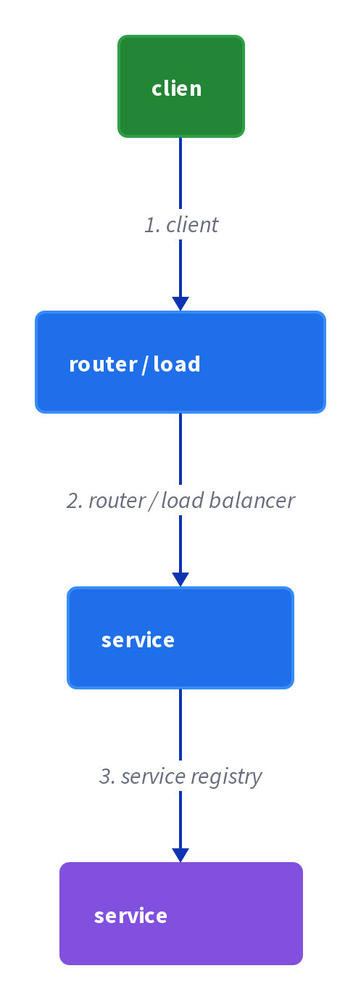

# Chapter 11: Server-Side Discovery

> The client makes a request to a router at a well-known location, which queries the service registry and forwards the request to an available service instance.

_Also known as: Chris Richardson · Microservice Patterns Ch. 11 · microservices.io /patterns/server-side-discovery.html_

## Flow

### A router hides the instances

> **Why this matters:** Instead of teaching every client the registry, the application teaches it one well-known router address that hides the changing instances.

1. **Call the router** — The client makes a request via a router (load balancer) at a well-known location.

2. **Router queries the registry** — The router queries a service registry, which might be built into the router.

3. **Forward to an instance** — The router forwards the request to an available service instance.

4. **Client stays simple** — The client never performs discovery — it just calls the router.

```java
// ROUTER SIDE — the client calls a well-known router, which consults the registry and forwards to an instance
// PARTIES: CLI = client · RTR = router (load balancer) · REG = service registry · SVC = order-service instance
// DEF: router — the load balancer the client calls at a well-known address = RTR, which forwards to router_target "10.0.1.7:8080"
// DEF: target — the instance location the router forwards to = "10.0.1.7:8080"
// STATE (before):
//    registry : {"order-service" -> [{"host":"10.0.1.7","port":8080},{"host":"10.0.1.8","port":8080}]}
//    lookup : []
//    router_target : "unset"
//    forwarded : "none"
// DEF: a client sends a request · CALLED BY: CLI calling the router's well-known address
// -> request : "POST http://router.example.com/orders"
//    step 0 · the instances write these rows at startup : registry["order-service"] : [] -> [{"host":"10.0.1.7","port":8080},{"host":"10.0.1.8","port":8080}]   BECAUSE each instance writes its own row on boot (self-registration)
//    step 1 · RTR queries REG : lookup : [] -> ["10.0.1.7:8080","10.0.1.8:8080"]   BECAUSE the router asks the registry for available instances
//    step 2 · RTR picks one : router_target : "unset" -> "10.0.1.7:8080"
//    step 3 · RTR forwards : forwarded : "none" -> "10.0.1.7:8080"   BECAUSE the router relays the request to the chosen instance
// <- forwarded call : "POST http://10.0.1.7:8080/orders"   (the client never resolved the instance itself)
```

### ELB: router and registry in one

> **Why this matters:** AWS ELB collapses the router and the registry into one managed component, which is why it is the canonical example.

1. **ELB as router** — A client makes HTTP(s) requests or TCP connections to the ELB, which load-balances across EC2 instances.

2. **ELB as registry** — The ELB also functions as a Service Registry.

3. **External or internal** — An ELB can load-balance Internet traffic or, in a VPC, internal traffic.

4. **Two ways to register** — EC2 instances are registered with the ELB explicitly via an API call, or automatically via an autoscaling group.

```java
// ELB SIDE — the load balancer is also the registry; instances register explicitly or via an autoscaling group
// PARTIES: CLI = client · ELB = Elastic Load Balancer (router + registry) · EC2 = service instances
// DEF: target — one EC2 instance the ELB load-balances across = elb_targets hosts "10.0.3.1" and "10.0.3.2"
// STATE (before):
//    elb_targets : {"order-service" -> [{"id":"i-abc","host":"10.0.3.1"},{"id":"i-def","host":"10.0.3.2"}]}
// DEF: an autoscaling group adds an instance · CALLED BY: the ASG scaling out
// -> scale_out : {"id":"i-ghi","host":"10.0.3.3"}
//    step 1 · ASG registers with ELB : elb_targets["order-service"] : [{"id":"i-abc","host":"10.0.3.1"},{"id":"i-def","host":"10.0.3.2"}] -> [{"id":"i-abc","host":"10.0.3.1"},{"id":"i-def","host":"10.0.3.2"},{"id":"i-ghi","host":"10.0.3.3"}]
//    step 2 · target count : 2 -> 3   BECAUSE the autoscaling group registered the new EC2 instance
// <- load-balanced set : ["10.0.3.1","10.0.3.2","10.0.3.3"]   (ELB now spreads traffic across 3 instances)
//    alt explicit API call : an operator calls the ELB register-target API -> target count : 3 -> 3 (the same i-ghi is already present)
```

### Cluster proxies on every host

> **Why this matters:** In a cluster, the router moves onto each host as a local proxy, so a client only ever dials a local port.

1. **A proxy on each host** — Kubernetes and Marathon run a proxy on each host that acts as a server-side discovery router.

2. **Connect to the local port** — The client connects to the local proxy using the port assigned to that service.

3. **Proxy forwards** — The proxy forwards the request to a service instance running somewhere in the cluster.

```java
// CLUSTER SIDE — each host runs a proxy; the client connects to the local proxy's port and it forwards into the cluster
// PARTIES: CLI = client on a host · PRX = per-host proxy (server-side router) · SVC = service instance in the cluster
// DEF: cluster — the set of hosts whose services the proxy reaches = cluster_map mapping order-service to "port 8080"
// DEF: proxy — the per-host router the client dials at a local port = PRX, which forwards to proxy_target "10.0.4.9:8080"
// DEF: target — the instance location the proxy forwards to = "10.0.4.9:8080"
// STATE (before):
//    cluster_map : {"order-service" -> "port 8080"}
//    proxy_target : "unset"
//    selected : []
//    forwarded : "none"
// DEF: a client calls a service · CALLED BY: CLI connecting to the local proxy
// -> connect : "localhost:8080"   (the port assigned to order-service)
//    step 1 · proxy resolves the port : proxy_target : "unset" -> "order-service"   BECAUSE port 8080 is assigned to order-service in the cluster
//    step 2 · proxy finds an instance : selected : [] -> ["10.0.4.9:8080"]   BECAUSE the proxy looks up the cluster for order-service
//    step 3 · proxy forwards : forwarded : "none" -> "10.0.4.9:8080"   BECAUSE it relays the request to that instance
// <- forwarded call : "POST http://10.0.4.9:8080/orders"   (the client only ever spoke to localhost:8080)
//    alt another host : its local proxy forwards the same port to a different pod 10.0.4.12
```

### Costs: extra hops, protocols, replication

> **Why this matters:** The price of a simpler client is an extra hop and an extra component that must be replicated and must speak the right protocols.

1. **Extra hop** — More network hops are required than with client-side discovery.

2. **Install and configure** — Unless part of the cloud, the router is another component to install and configure.

3. **Replicate it** — The router must be replicated for availability and capacity.

4. **Protocol support** — The router must support the needed protocols (HTTP, gRPC, Thrift) unless it is a TCP-based router.

```java
// ROUTER SIDE — server-side discovery adds a network hop and a component that must be replicated and protocol-fit
// PARTIES: CLI = client · RTR = router · REG = registry · SVC = order-service instance
// STATE (before):
//    hops : 0
//    router_replicas : 1
//    supported : ["http"]
// DEF: measure one request's cost · CALLED BY: CLI sending a request through the router
// -> request : "POST /orders"
//    step 1 · hops : 0 -> 3   BECAUSE the path is CLI -> RTR -> REG -> SVC, one more hop than client-side discovery's 2
//    step 2 · replicate the router : router_replicas : 1 -> 2   BECAUSE the router must be replicated for availability and capacity
//    step 3 · protocol check : supported : ["http"] -> ["http","tcp"]   BECAUSE the router must speak the clients' protocols unless it is a TCP-based router
// <- cost summary : "3 hops, 2 replicas, protocols [http, tcp]"   (more moving parts than client-side)
```


## System Design Interview

> **The question:** Design service discovery behind a router. Premise: the client calls a router or load balancer, which queries the service registry and forwards to a live instance, so the client stays simple.

**The pipeline:** client → router / load balancer → service registry → service instances



### client — calls only the router

_Role: client_

- Dials the router at a well-known address
- Never performs discovery itself

### router / load balancer — the router

_Role: router / load balancer_

- Queries the registry for available instances
- Picks one instance
- Forwards the request to it

### service registry (Eureka) — the registry

_Role: registry_

- Holds the name -> instances map
- Returns instance locations on query

### order-service instances — the instances

_Role: service instances_

- Self-register on startup
- Serve the forwarded request

```java
// SYSTEM DESIGN — server-side discovery as a pipeline: client -> router/load balancer -> service registry -> service instances (the client never discovers)
// PARTIES: CLI = client (calls only the router) · RTR = router (load balancer that queries the registry and forwards) · REG = service registry (Eureka) · SVC = order-service instances
// DEF: registry — REG's map of service name -> instances; here {"order-service" -> ["10.0.1.7:8080", "10.0.1.8:8080"]}
// DEF: list — the instances REG returns; here ["10.0.1.7:8080", "10.0.1.8:8080"]
// DEF: target — the instance the router forwards to; here "10.0.1.7:8080"
// DEF: status — the forwarded call's result; here "200 OK"
// STATE (before):
//    registry : {"order-service" -> ["10.0.1.7:8080", "10.0.1.8:8080"]}
//    list     : []
//    target   : "unset"
//    status   : "none"
// DEF: forward_request · CALLED BY: CLI calling the router's well-known address
// -> request : "POST http://router.example.com/orders"
//    step 1 · RTR queries REG for "order-service"    list : [] -> ["10.0.1.7:8080", "10.0.1.8:8080"]   BECAUSE the router asks the registry for available instances
//    step 2 · RTR picks an instance    target : "unset" -> "10.0.1.7:8080"   BECAUSE the router load-balances across the returned set
//    step 3 · RTR forwards to the instance    status : "none" -> "200 OK"   BECAUSE the router relays the request to the chosen instance
// <- forwarded call : "POST http://10.0.1.7:8080/orders"   (the client never resolved an instance itself)
```

## Interview Questions

### Q1

A client must call order-service but has no discovery logic. The application teaches it one well-known router address instead of the registry.

**Interviewer's question:** How does a router hide the changing set of instances from the client?

**Solution:** The client calls a router (load balancer) at a well-known location; the router queries the registry and forwards the request to an available instance, so the client never performs discovery.

**System-design components:**
- Well-known router address
- Registry query by the router
- Forward to an instance
- Discovery-free client

```java
// ROUTER SIDE — the client calls a well-known router, which consults the registry and forwards to an instance
// PARTIES: CLI = client · RTR = router (load balancer) · REG = service registry · SVC = order-service instance
// DEF: router — the load balancer the client calls at a well-known address = RTR, which forwards to router_target "10.0.3.7:8080"
// DEF: target — the instance location the router forwards to = "10.0.3.7:8080"
// STATE (before):
//    registry : {"order-service" -> [{"host":"10.0.3.7","port":8080},{"host":"10.0.3.8","port":8080}]}
//    lookup : []
//    router_target : "unset"
//    forwarded : "none"
// DEF: a client sends a request · CALLED BY: CLI calling the router's well-known address
// -> request : "POST http://router.example.com/orders"
//    step 1 · RTR queries REG : lookup : [] -> ["10.0.3.7:8080","10.0.3.8:8080"]   BECAUSE the router asks the registry for available instances
//    step 2 · RTR picks one : router_target : "unset" -> "10.0.3.7:8080"
//    step 3 · RTR forwards : forwarded : "none" -> "10.0.3.7:8080"   BECAUSE the router relays the request to the chosen instance
// <- forwarded call : "POST http://10.0.3.7:8080/orders"   (the client never resolved the instance itself)
```

_This is exactly the router-hides-the-instances mechanism in this chapter._

_Covers:_ A router hides the instances

_From the 28 problems:_ 01-scale-from-zero-to-millions

### Q2

The team runs on AWS and wants a single managed component to act as both the load balancer and the registry for order-service.

**Interviewer's question:** How does an ELB collapse the router and the registry into one, and how do instances get registered?

**Solution:** The ELB load-balances traffic (router) and also functions as the registry; instances are registered explicitly via an API call or automatically via an autoscaling group.

**System-design components:**
- ELB as router
- ELB as registry
- Explicit API registration
- Autoscaling-group registration

```java
// ELB SIDE — the load balancer is also the registry; instances register explicitly or via an autoscaling group
// PARTIES: CLI = client · ELB = Elastic Load Balancer (router + registry) · EC2 = service instances
// DEF: target — one EC2 instance the ELB load-balances across = elb_targets hosts "10.0.5.1" and "10.0.5.2"
// STATE (before):
//    elb_targets : {"order-service" -> [{"id":"i-abc","host":"10.0.5.1"},{"id":"i-def","host":"10.0.5.2"}]}
// DEF: an autoscaling group adds an instance · CALLED BY: the ASG scaling out
// -> scale_out : {"id":"i-ghi","host":"10.0.5.3"}
//    step 1 · ASG registers with ELB : elb_targets["order-service"] : [{"id":"i-abc","host":"10.0.5.1"},{"id":"i-def","host":"10.0.5.2"}] -> [{"id":"i-abc","host":"10.0.5.1"},{"id":"i-def","host":"10.0.5.2"},{"id":"i-ghi","host":"10.0.5.3"}]
//    step 2 · target count : 2 -> 3   BECAUSE the autoscaling group registered the new EC2 instance
// <- load-balanced set : ["10.0.5.1","10.0.5.2","10.0.5.3"]   (ELB now spreads traffic across 3 instances)
//    alt explicit API call : an operator calls the ELB register-target API -> target count : 3 -> 3 (the same i-ghi is already present)
```

_This is exactly the ELB-as-router-and-registry behavior in this chapter._

_Covers:_ ELB: router and registry in one

_From the 28 problems:_ 01-scale-from-zero-to-millions

### Q3

The team runs a cluster where a proxy lives on every host, so a client only ever dials a local port.

**Interviewer's question:** How do cluster proxies on every host implement server-side discovery?

**Solution:** Each host runs a proxy; the client connects to the local proxy's port for the service, and the proxy forwards the request to an instance somewhere in the cluster.

**System-design components:**
- Per-host proxy
- Local port per service
- Proxy forwarding into the cluster

```java
// CLUSTER SIDE — each host runs a proxy; the client connects to the local proxy's port and it forwards into the cluster
// PARTIES: CLI = client on a host · PRX = per-host proxy (server-side router) · SVC = service instance in the cluster
// DEF: cluster — the set of hosts whose services the proxy reaches = cluster_map mapping order-service to "port 8080"
// DEF: proxy — the per-host router the client dials at a local port = PRX, which forwards to proxy_target "10.0.6.9:8080"
// DEF: target — the instance location the proxy forwards to = "10.0.6.9:8080"
// STATE (before):
//    cluster_map : {"order-service" -> "port 8080"}
//    proxy_target : "unset"
//    selected : []
//    forwarded : "none"
// DEF: a client calls a service · CALLED BY: CLI connecting to the local proxy
// -> connect : "localhost:8080"   (the port assigned to order-service)
//    step 1 · proxy resolves the port : proxy_target : "unset" -> "order-service"   BECAUSE port 8080 is assigned to order-service in the cluster
//    step 2 · proxy finds an instance : selected : [] -> ["10.0.6.9:8080"]   BECAUSE the proxy looks up the cluster for order-service
//    step 3 · proxy forwards : forwarded : "none" -> "10.0.6.9:8080"   BECAUSE it relays the request to that instance
// <- forwarded call : "POST http://10.0.6.9:8080/orders"   (the client only ever spoke to localhost:8080)
//    alt another host : its local proxy forwards the same port to a different pod 10.0.6.12
```

_This is exactly the cluster-proxy form of server-side discovery in this chapter._

_Covers:_ Cluster proxies on every host

_From the 28 problems:_ 01-scale-from-zero-to-millions

### Q4

The team chose server-side discovery and now accounts for its costs before shipping.

**Interviewer's question:** What are the costs of server-side discovery compared to client-side?

**Solution:** More network hops than client-side discovery, plus a router that must be installed, configured, replicated for availability and capacity, and made to support the needed protocols.

**System-design components:**
- Extra network hop
- Install/configure the router
- Replicate the router
- Protocol support (HTTP, gRPC, Thrift)

```java
// ROUTER SIDE — server-side discovery adds a network hop and a component that must be replicated and protocol-fit
// PARTIES: CLI = client · RTR = router · REG = registry · SVC = order-service instance
// STATE (before):
//    hops : 0
//    router_replicas : 1
//    supported : ["http"]
// DEF: measure one request's cost · CALLED BY: CLI sending a request through the router
// -> request : "POST /orders"
//    step 1 · hops : 0 -> 3   BECAUSE the path is CLI -> RTR -> REG -> SVC, one more hop than client-side discovery's 2
//    step 2 · replicate the router : router_replicas : 1 -> 3   BECAUSE the router must be replicated for availability and capacity
//    step 3 · protocol check : supported : ["http"] -> ["http","grpc","thrift"]   BECAUSE the router must speak the clients' protocols
// <- cost summary : "3 hops, 3 replicas, protocols [http, grpc, thrift]"   (more moving parts than client-side)
//    alt cloud-managed : an ELB absorbs install/configure/replicate -> the operator burden falls to the cloud provider
```

_This is exactly the extra-hop and replication/protocol costs in this chapter._

_Covers:_ Costs: extra hops, protocols, replication

_From the 28 problems:_ 01-scale-from-zero-to-millions

## Key Concepts

### The Problem

**The client cannot track instances.** The client needs a stable, well-known address to call, behind which the changing set of instances is hidden.


### The Solution

The client calls a router (load balancer) at a well-known location; the router queries a registry and forwards to an available instance.

```java
// ROUTER SIDE — the client calls a well-known router, which consults the registry and forwards to an instance
// PARTIES: CLI = client · RTR = router (load balancer) · REG = service registry · SVC = order-service instance
// DEF: router — the load balancer the client calls at a well-known address = RTR, which forwards to router_target "10.0.3.7:8080"
// DEF: target — the instance location the router forwards to = "10.0.3.7:8080"
// STATE (before):
//    registry : {"order-service" -> [{"host":"10.0.3.7","port":8080},{"host":"10.0.3.8","port":8080}]}
//    lookup : []
//    router_target : "unset"
//    forwarded : "none"
// DEF: a client sends a request · CALLED BY: CLI calling the router's well-known address
// -> request : "POST http://router.example.com/orders"
//    step 1 · RTR queries REG : lookup : [] -> ["10.0.3.7:8080","10.0.3.8:8080"]   BECAUSE the router asks the registry for available instances
//    step 2 · RTR picks one : router_target : "unset" -> "10.0.3.7:8080"
//    step 3 · RTR forwards : forwarded : "none" -> "10.0.3.7:8080"   BECAUSE the router relays the request to the chosen instance
// <- forwarded call : "POST http://10.0.3.7:8080/orders"   (the client never resolved the instance itself)
```


### Key Facts

| Fact | Detail | In the wild |
|---|---|---|
| A router in front of the registry | The client calls a router (load balancer) at a well-known location; the router queries a registry and forwards to an available instance. | AWS ELB acts as both router and registry; Kubernetes and Marathon run a proxy on each host for the same purpose. |
| Simpler client, extra hops | The client code is simpler because it just calls the router, but more network hops are required than with client-side discovery. | Client to router to instance (via the registry) is one hop longer than client to registry to instance. |
| A router to replicate and protocol-fit | Unless it is part of the cloud, the router must be installed and configured, replicated for availability and capacity, and it must support the needed protocols (HTTP, gRPC, Thrift) unless it is a TCP-based router. | A cloud-managed ELB removes the operational cost; a self-run router restores it, including the replication burden. |


### Tradeoffs & When

- The client code is simpler because it just calls the router, but more network hops are required than with client-side discovery.
- Unless it is part of the cloud, the router must be installed and configured, replicated for availability and capacity, and it must support the needed protocols (HTTP, gRPC, Thrift) unless it is a TCP-based router.


<details><summary>All concepts (index)</summary>

### Problem: The client cannot track instances

**Why.** Instances appear and disappear under dynamic IPs, so a client that must pick an instance directly cannot keep up.

**Claim.** The client needs a stable, well-known address to call, behind which the changing set of instances is hidden.

**Grounding.** Richardson's context mirrors client-side discovery: dynamic IPs and load-varying instance counts break fixed locations.

**In the wild.** Rather than teaching every client the registry, the application teaches it one router address.
### Solution: A router in front of the registry

**Why.** A well-known middleman can absorb the lookup and forwarding that would otherwise live in each client.

**Claim.** The client calls a router (load balancer) at a well-known location; the router queries a registry and forwards to an available instance.

**Grounding.** Richardson's solution: the router "queries a service registry, which might be built into the router, and forwards the request."

**In the wild.** AWS ELB acts as both router and registry; Kubernetes and Marathon run a proxy on each host for the same purpose.
### Tradeoff: Simpler client, extra hops

**Why.** Moving discovery to the router simplifies the client but lengthens the request path.

**Claim.** The client code is simpler because it just calls the router, but more network hops are required than with client-side discovery.

**Grounding.** Richardson lists both: simpler client code, and "more network hops are required than when using Client Side Discovery."

**In the wild.** Client to router to instance (via the registry) is one hop longer than client to registry to instance.
### Tradeoff: A router to replicate and protocol-fit

**Why.** The router is now on the request path, so it must scale and speak the right protocols.

**Claim.** Unless it is part of the cloud, the router must be installed and configured, replicated for availability and capacity, and it must support the needed protocols (HTTP, gRPC, Thrift) unless it is a TCP-based router.

**Grounding.** Richardson lists these as drawbacks of server-side discovery.

**In the wild.** A cloud-managed ELB removes the operational cost; a self-run router restores it, including the replication burden.

</details>


## Quiz

1. How does a client reach an instance in server-side discovery?

   - A. It queries the registry and calls the instance directly
   - B. It calls a router at a well-known location, which forwards to an instance
   - C. It broadcasts to every instance
   - D. It hardcodes each host and port

<details><summary>Reveal answer</summary>

**B.** The client makes a request via a router at a well-known location; the router queries the registry and forwards to an available instance. A is client-side discovery, and C and D are not the pattern.

</details>

2. In the AWS example, what two roles does the ELB play?

   - A. Router (load balancer) and service registry
   - B. Database and message broker
   - C. Sidecar and third-party registrar
   - D. API gateway and backend-for-frontend

<details><summary>Reveal answer</summary>

**A.** The ELB load-balances traffic (router) and also functions as a Service Registry. B, C, and D are unrelated roles.

</details>

3. How do EC2 instances get registered with the ELB?

   - A. Only by editing a config file
   - B. Explicitly via an API call, or automatically as part of an autoscaling group
   - C. Only by the client at request time
   - D. The ELB never registers instances

<details><summary>Reveal answer</summary>

**B.** The reference says EC2 instances are registered either explicitly via an API call or automatically as part of an autoscaling group. A, C, and D contradict this.

</details>

4. Which is a drawback of server-side discovery?

   - A. The client code is simpler
   - B. More network hops than client-side discovery, and the router must be installed, configured, and replicated
   - C. The client is coupled to the registry
   - D. It cannot handle TCP traffic

<details><summary>Reveal answer</summary>

**B.** The reference lists extra network hops and the install/configure/replicate burden as drawbacks. A is a benefit, C is client-side discovery's drawback, and D is false because a TCP-based router can handle TCP.

</details>

