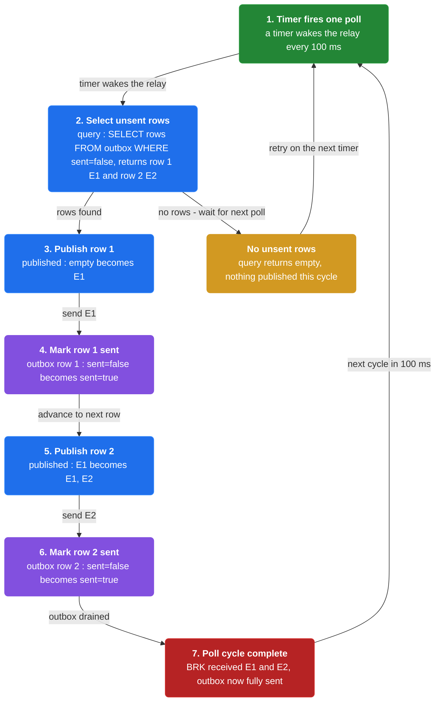
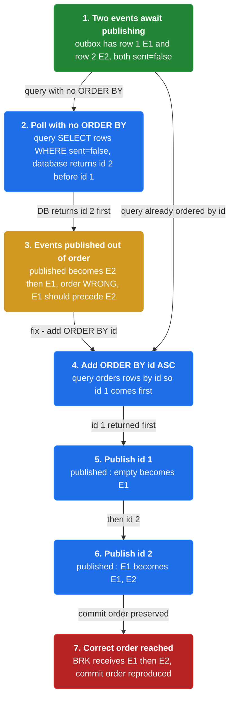
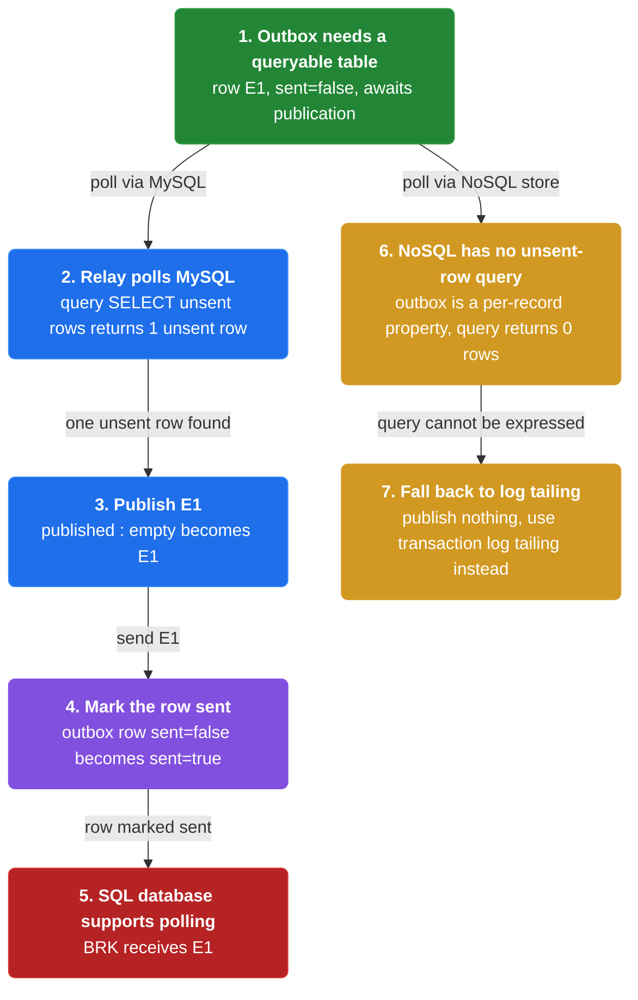
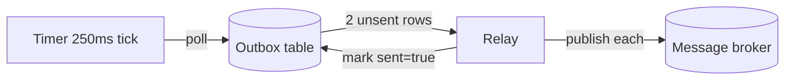
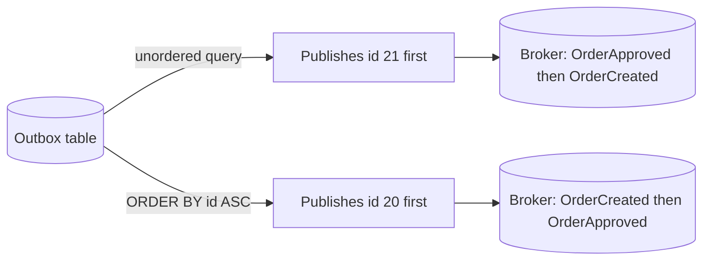
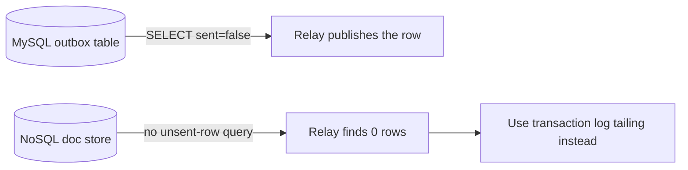
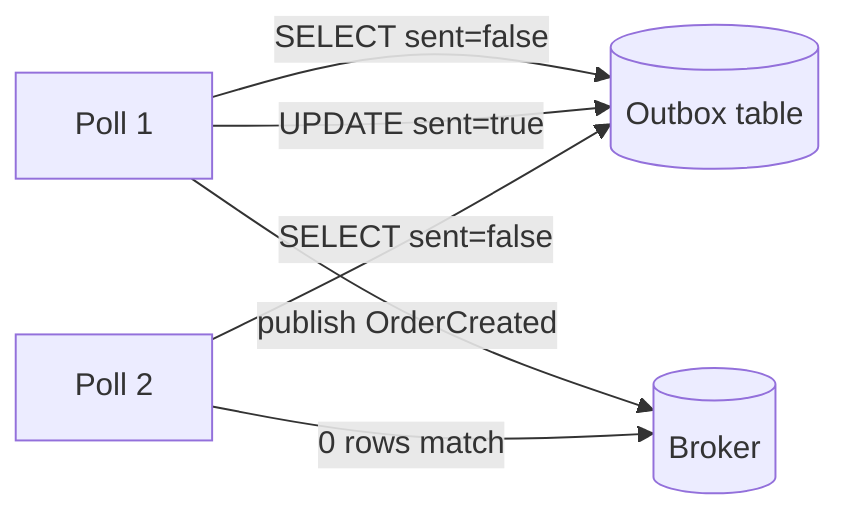

# Chapter 12: Polling Publisher

> Publish outbox messages to the broker by polling the database outbox table on an interval.

_Also known as: Chris Richardson · Microservice Patterns Ch.12 · microservices.io /patterns/data/polling-publisher.html_

## Flow

### Poll the outbox table

> **Why this matters:** Once the Transactional Outbox pattern has stored events in the database, something must move them to the broker; polling the outbox table with a plain SQL query is the simplest relay.



1. **Select unsent rows** — A relay process runs a query for outbox rows that have not yet been sent.

2. **Publish each row** — The relay publishes each returned message or event to the broker.

3. **Mark the row sent** — The relay updates the row so the next poll skips it.

```java
// RELAY SIDE — one poll cycle moves unsent outbox rows to the broker
// PARTIES: RLY = relay · DB = relational database · BRK = message broker
// STATE (before):
//    outbox : [ (1, "E1", sent=false), (2, "E2", sent=false) ]
//    published : [ ]
// DEF: poll_once · CALLED BY: a timer firing every 100 ms
// -> query : SELECT * FROM outbox WHERE sent=false   // returns [ (1,"E1",sent=false), (2,"E2",sent=false) ]
//    step 1 · fetch rows    : rows : [ ] -> [ (1,"E1",sent=false), (2,"E2",sent=false) ]
//    step 2 · publish row 1 : published : [ ] -> [ "E1" ]
//    step 3 · mark row 1    : outbox : [(1,"E1",sent=false),(2,"E2",sent=false)] -> [(1,"E1",sent=true),(2,"E2",sent=false)]
//    step 4 · publish row 2 : published : [ "E1" ] -> [ "E1", "E2" ]
//    step 5 · mark row 2    : outbox : [(1,"E1",sent=true),(2,"E2",sent=false)] -> [(1,"E1",sent=true),(2,"E2",sent=true)]
// <- output : BRK received [ "E1", "E2" ] · outbox now fully sent
```

### Publishing in order is tricky

> **Why this matters:** The relay must reproduce the order the application wrote events in, but a naive poll without an explicit ordering can hand the broker events out of order.



1. **Order by a sequence** — The relay orders unsent rows by their outbox id so earlier events are read first.

2. **Watch the query order** — Without an ORDER BY, the database may return rows in any order, not commit order.

3. **Add ORDER BY id** — Ordering the query by id makes the poll reproduce the insertion sequence.

```java
// RELAY SIDE — the same aggregate's two events must reach the broker in commit order
// PARTIES: RLY = relay · DB = relational database · BRK = message broker
// STATE (before):
//    outbox : [ (1, "E1", sent=false), (2, "E2", sent=false) ]
//    published : [ ]
// DEF: poll_without_order · CALLED BY: the relay running a query with no ORDER BY
// -> query : SELECT * FROM outbox WHERE sent=false   // returns rows in DB order, here id 2 first
//    step 1 · publish id 2 : published : [ ] -> [ "E2" ]     BECAUSE the query returned id 2 before id 1
//    step 2 · publish id 1 : published : [ "E2" ] -> [ "E2", "E1" ]
// <- output : BRK receives [ "E2", "E1" ] · order WRONG (E1 should precede E2)
// DEF: poll_with_order · CALLED BY: the relay adding ORDER BY id to the same query
// -> query : SELECT * FROM outbox WHERE sent=false ORDER BY id ASC   // returns id 1 then id 2
//    step 1 · publish id 1 : published : [ ] -> [ "E1" ]     BECAUSE ORDER BY id returns the committed-first row first
//    step 2 · publish id 2 : published : [ "E1" ] -> [ "E1", "E2" ]
// <- output : BRK receives [ "E1", "E2" ] · order CORRECT
```

### Any SQL database, not every NoSQL store

> **Why this matters:** Polling is portable because it only needs a standard query, but a database that cannot express the unsent-row query cannot use this relay.



1. **A plain SELECT is enough** — Any SQL database exposes the outbox table to a standard query for unsent rows.

2. **NoSQL may lack the query** — Some NoSQL stores cannot query across records for the unsent outbox property.

3. **Use log tailing there** — For those stores, transaction log tailing is the alternative relay.

```java
// RELAY SIDE — polling needs a queryable outbox: any SQL database has it, some NoSQL stores do not
// PARTIES: RLY = relay · SQLDB = MySQL database · NOSQL = NoSQL document store · BRK = message broker
// DEF: outbox — the table of stored events awaiting publication to the broker = row (1, "E1", sent=false)
// DEF: sql — the queryable relational access an SQL database gives the outbox = "SELECT * FROM outbox WHERE sent=false" returns 1 unsent row
// STATE (before):
//    outbox_sql : [ (1, "E1", sent=false) ]
//    outbox_nosql : { "rec-9" : { "event" : "E1", "sent" : false } }
//    published : [ ]
// DEF: poll_sql · CALLED BY: the relay against MySQL
// -> query : SELECT * FROM outbox WHERE sent=false    // matches : 1 unsent row
//    step 1 · publish E1 : published : [ ] -> [ "E1" ]          BECAUSE MySQL returns the one unsent row
//    step 2 · mark sent  : outbox_sql : [(1,"E1",sent=false)] -> [(1,"E1",sent=true)]
// <- output : BRK receives [ "E1" ] · SQLDB supports polling
// DEF: poll_nosql · CALLED BY: the relay against a NoSQL store with no unsent-row query
// -> query : SELECT * FROM outbox WHERE sent=false    // matches : 0 rows (the query cannot be expressed)
//    step 1 · publish nothing : published : [ ] -> [ ]  (0 messages sent)   BECAUSE the outbox is a per-record property with no global sent index
// <- output : BRK receives 0 messages · NOSQL cannot poll, so the relay uses transaction log tailing instead
```


## Interview Questions

### Q1

You have applied the Transactional Outbox pattern and your order service now stores events in a database table, but nothing moves them to the message broker yet. The downstream consumers are starved because the events never leave the database.

**Interviewer's question:** What is the Polling Publisher, and how does one poll cycle move unsent outbox rows to the broker?

**Solution:** A relay process repeatedly queries the outbox table for unsent rows, publishes each row to the broker, then marks the row sent so the next poll skips it.

**System-design components:**
- Outbox table — events awaiting publication
- Relay process — runs the poll on an interval
- Unsent-row query — SELECT ... WHERE sent=false
- Mark-sent update — sets sent=true per published row
- Message broker — receives the published events



```java
// RELAY SIDE — one poll cycle drains two unsent outbox rows into the broker
// PARTIES: RLY = relay process · DB = PostgreSQL outbox table · BRK = message broker
// DEF: outbox — the table of stored events awaiting publication = [ (10, "OrderCreated", sent=false), (11, "PaymentAuthorized", sent=false) ]
// STATE (before):
//    outbox : [ (10, "OrderCreated", sent=false), (11, "PaymentAuthorized", sent=false) ]
//    published : [ ]
// DEF: poll_once · CALLED BY: a scheduler tick every 250 ms
// -> query : SELECT * FROM outbox WHERE sent=false   // returns 2 unsent rows
//    step 1 · fetch rows    : rows : [ ] -> [ (10, "OrderCreated", sent=false), (11, "PaymentAuthorized", sent=false) ]
//    step 2 · publish row 10 : published : [ ] -> [ "OrderCreated" ]
//    step 3 · mark row 10    : outbox : [(10,"OrderCreated",sent=false),(11,"PaymentAuthorized",sent=false)] -> [(10,"OrderCreated",sent=true),(11,"PaymentAuthorized",sent=false)]
//    step 4 · publish row 11 : published : [ "OrderCreated" ] -> [ "OrderCreated", "PaymentAuthorized" ]
//    step 5 · mark row 11    : outbox : [(10,"OrderCreated",sent=true),(11,"PaymentAuthorized",sent=false)] -> [(10,"OrderCreated",sent=true),(11,"PaymentAuthorized",sent=true)]
// <- output : BRK received [ "OrderCreated", "PaymentAuthorized" ] · outbox now fully sent
```

_This is the Polling Publisher: select unsent outbox rows, publish each to the broker, then mark each row sent._

_Covers:_ Poll the outbox table

_From the 28 problems:_ 19-distributed-message-queue

### Q2

Your order aggregate wrote two events in one transaction — OrderCreated then OrderApproved — and a downstream consumer must apply them in that exact order. Your relay just ran a query with no ORDER BY, and the consumer saw OrderApproved arrive before OrderCreated.

**Interviewer's question:** Why is publishing events in order tricky for a polling relay, and how do you fix it?

**Solution:** Add an explicit ORDER BY on the outbox row id so the poll reads rows in insertion order and publishes the earlier event first.

**System-design components:**
- Outbox row id — the insertion sequence
- Unordered query — SELECT without ORDER BY
- Ordered query — SELECT ... ORDER BY id ASC
- Message broker — receives events in publish order



```java
// RELAY SIDE — ordering: the same order's two events must reach the broker in commit order
// PARTIES: RLY = relay · DB = MySQL outbox table · BRK = message broker
// DEF: outbox — the table of stored events = [ (20, "OrderCreated", sent=false), (21, "OrderApproved", sent=false) ]
// STATE (before):
//    outbox : [ (20, "OrderCreated", sent=false), (21, "OrderApproved", sent=false) ]
//    published : [ ]
// DEF: poll_without_order · CALLED BY: the relay running a query with no ORDER BY
// -> query : SELECT * FROM outbox WHERE sent=false   // DB returns id 21 first
//    step 1 · publish id 21 : published : [ ] -> [ "OrderApproved" ]   BECAUSE the query returned id 21 before id 20
//    step 2 · publish id 20 : published : [ "OrderApproved" ] -> [ "OrderApproved", "OrderCreated" ]
// <- output : BRK receives [ "OrderApproved", "OrderCreated" ] · order WRONG (OrderCreated must precede OrderApproved)
// DEF: poll_with_order · CALLED BY: the relay adding ORDER BY id to the query
// -> query : SELECT * FROM outbox WHERE sent=false ORDER BY id ASC   // returns id 20 then id 21
//    step 1 · publish id 20 : published : [ ] -> [ "OrderCreated" ]   BECAUSE ORDER BY id returns the committed-first row first
//    step 2 · publish id 21 : published : [ "OrderCreated" ] -> [ "OrderCreated", "OrderApproved" ]
// <- output : BRK receives [ "OrderCreated", "OrderApproved" ] · order CORRECT
```

_This is the Polling Publisher's ordering tradeoff — a poll must reproduce insertion order with an explicit ORDER BY id._

_Covers:_ Publishing events in order is tricky

_From the 28 problems:_ 19-distributed-message-queue

### Q3

Your team stores domain events in a NoSQL document store where each document has its own sent flag, but there is no query that can find all unsent documents across the store. Your relay cannot find anything to publish.

**Interviewer's question:** Why does the Polling Publisher work with any SQL database but not every NoSQL store, and what is the fallback?

**Solution:** Polling needs a queryable outbox table with an unsent-row query; a NoSQL store where the outbox is a per-record property with no global unsent query cannot be polled, so you use transaction log tailing instead.

**System-design components:**
- SQL database — exposes the outbox as a queryable table
- NoSQL store — outbox is a per-record property
- Unsent-row query — cannot be expressed in the NoSQL store
- Transaction log tailing — the alternative relay



```java
// RELAY SIDE — polling needs a queryable outbox: any SQL database has it, some NoSQL stores do not
// PARTIES: RLY = relay · SQLDB = MySQL database · NOSQL = NoSQL document store · BRK = message broker
// DEF: outbox_sql — the queryable table = [ (30, "OrderCreated", sent=false) ]
// DEF: outbox_nosql — a per-record property with no global sent index = { "rec-9" : { "event" : "OrderCreated", "sent" : false } }
// STATE (before):
//    outbox_sql : [ (30, "OrderCreated", sent=false) ]
//    outbox_nosql : { "rec-9" : { "event" : "OrderCreated", "sent" : false } }
//    published : [ ]
// DEF: poll_sql · CALLED BY: the relay against MySQL
// -> query : SELECT * FROM outbox WHERE sent=false   // matches : 1 unsent row
//    step 1 · publish OrderCreated : published : [ ] -> [ "OrderCreated" ]   BECAUSE MySQL returns the one unsent row
//    step 2 · mark row 30 : outbox_sql : [(30,"OrderCreated",sent=false)] -> [(30,"OrderCreated",sent=true)]
// <- output : BRK receives [ "OrderCreated" ] · SQLDB supports polling
// DEF: poll_nosql · CALLED BY: the relay against the NoSQL store
// -> query : SELECT * FROM outbox WHERE sent=false   // matches : 0 rows (query cannot be expressed)
//    step 1 · publish nothing : published : [ ] -> [ ]   BECAUSE the outbox is a per-record property with no global sent index
// <- output : BRK receives 0 messages · NOSQL cannot be polled, so the relay uses transaction log tailing
```

_This is the Polling Publisher's portability tradeoff — it needs a queryable outbox, which SQL gives and some NoSQL stores do not._

_Covers:_ Any SQL database, not every NoSQL store

_From the 28 problems:_ 19-distributed-message-queue

### Q4

Your relay runs every 250 ms. After one poll publishes a row and marks it sent, you want to be sure the next poll does not republish the same event and spam the broker.

**Interviewer's question:** How does marking a row sent change what the next poll selects, and why is the sent flag essential?

**Solution:** Marking a row sent means the next poll's WHERE sent=false query no longer returns it, so each event is published once per successful mark.

**System-design components:**
- Sent flag — sent=false vs sent=true per row
- Poll 1 — publishes and marks the row
- Poll 2 — selects only sent=false rows
- Broker — receives no duplicate from the relay



```java
// RELAY SIDE — two consecutive polls: after a row is marked sent, the next poll skips it
// PARTIES: RLY = relay · DB = MySQL outbox table · BRK = message broker
// DEF: outbox — the table of stored events = [ (40, "OrderCreated", sent=false) ]
// STATE (before):
//    outbox : [ (40, "OrderCreated", sent=false) ]
//    published : [ ]
// DEF: poll_1 · CALLED BY: a timer tick at t=0ms
// -> query : SELECT * FROM outbox WHERE sent=false   // returns row 40
//    step 1 · publish row 40 : published : [ ] -> [ "OrderCreated" ]
//    step 2 · mark row 40 : outbox : [(40,"OrderCreated",sent=false)] -> [(40,"OrderCreated",sent=true)]
// <- output : BRK received [ "OrderCreated" ] · outbox row 40 is now sent=true
// DEF: poll_2 · CALLED BY: the next timer tick at t=250ms
// -> query : SELECT * FROM outbox WHERE sent=false   // returns 0 rows
//    step 1 · publish nothing : published : [ "OrderCreated" ] -> [ "OrderCreated" ]   BECAUSE row 40 no longer matches sent=false
// <- output : BRK receives 0 new messages · the sent flag prevented a duplicate publish
```

_This is the Polling Publisher's mark-sent step — the sent flag is what lets the next poll skip already-published rows._

_Covers:_ Poll the outbox table

_From the 28 problems:_ 19-distributed-message-queue

## Key Concepts

### The Problem

**The outbox has events but no way out.** Something must discover the unsent outbox rows and hand each one to the broker.


### The Solution

Publish messages by polling the outbox table: select unsent rows, publish each, then mark it sent.


### Key Facts

| Fact | Detail | In the wild |
|---|---|---|
| Poll the outbox table | Publish messages by polling the outbox table: select unsent rows, publish each, then mark it sent. | The Eventuate Tram framework implements polling. |
| Publishing events in order is tricky | The relay needs an explicit ordering, and a query without ORDER BY can deliver events out of sequence. | Ordering by the outbox row id is the standard fix. |
| Works with any SQL database, not all NoSQL | A store where the outbox is a per-record property, with no global unsent-row query, cannot be polled. | Stores that cannot be polled fall back to transaction log tailing. |


### Tradeoffs & When

- The relay needs an explicit ordering, and a query without ORDER BY can deliver events out of sequence.
- A store where the outbox is a per-record property, with no global unsent-row query, cannot be polled.


<details><summary>All concepts (index)</summary>

### Problem: The outbox has events but no way out

**Why.** The Transactional Outbox pattern leaves messages sitting in a database table, and they only matter once they reach the message broker.

**Claim.** Something must discover the unsent outbox rows and hand each one to the broker.

**Grounding.** The reference problem statement: how to publish messages and events in the outbox in the database to the message broker.

**In the wild.** This is the relay half of transactional messaging; the outbox pattern creates the need for it.
### Solution: Poll the outbox table

**Why.** The outbox is just a table, so a recurring query can read whatever has not been sent yet.

**Claim.** Publish messages by polling the outbox table: select unsent rows, publish each, then mark it sent.

**Grounding.** The reference solution is one sentence: publish messages by polling the database outbox table.

**In the wild.** The Eventuate Tram framework implements polling.
### Tradeoff: Publishing events in order is tricky

**Why.** A poll must reproduce the order events were inserted, but the database does not hand rows back in order unless asked.

**Claim.** The relay needs an explicit ordering, and a query without ORDER BY can deliver events out of sequence.

**Grounding.** The reference lists "tricky to publish events in order" as a drawback.

**In the wild.** Ordering by the outbox row id is the standard fix.
### Tradeoff: Works with any SQL database, not all NoSQL

**Why.** Polling only needs a standard SELECT against a queryable table, which every SQL database provides.

**Claim.** A store where the outbox is a per-record property, with no global unsent-row query, cannot be polled.

**Grounding.** The reference lists "works with any SQL database" as a benefit and "not all NoSQL databases support this pattern" as a drawback.

**In the wild.** Stores that cannot be polled fall back to transaction log tailing.

</details>


## Quiz

1. What problem does the Polling Publisher solve?

   - A. How to atomically write business data and an event together.
   - B. How to publish the outbox messages stored in the database to the message broker.
   - C. How to make consumers idempotent.
   - D. How to replace the message broker with a database.

<details><summary>Reveal answer</summary>

**B.** The outbox pattern stores messages in the database, and the Polling Publisher is the relay that moves them to the broker. A is the Transactional Outbox problem, C is a consumer concern, and D is not a stated goal.

</details>

2. How does the relay discover events to publish?

   - A. The broker pushes events to the relay.
   - B. It tails the database transaction log.
   - C. It polls the database outbox table for unsent rows.
   - D. Consumers notify it directly.

<details><summary>Reveal answer</summary>

**C.** Polling publishes messages by repeatedly querying the outbox table for rows that are not yet sent. B is the alternative (transaction log tailing), and A and D are not how this pattern works.

</details>

3. Why is publishing events in order tricky for a polling relay?

   - A. Polling always preserves order for free.
   - B. A query without an explicit ordering may return rows out of commit order.
   - C. Events have no ordering requirement at all.
   - D. The broker reorders messages after they arrive.

<details><summary>Reveal answer</summary>

**B.** The database does not guarantee a row order unless the query asks for one, so an unordered poll can publish a later event before an earlier one. A and C are false, and D is not the mechanism.

</details>

4. Why do not all NoSQL databases support this pattern?

   - A. They have no message broker integration.
   - B. They cannot be polled when the outbox is a per-record property with no unsent-row query.
   - C. They always lose events on rollback.
   - D. They require 2PC to poll.

<details><summary>Reveal answer</summary>

**B.** Polling needs a queryable outbox table; where the outbox is a property on each record and no query can find unsent rows, polling cannot work. A, C, and D are not stated in the reference.

</details>

