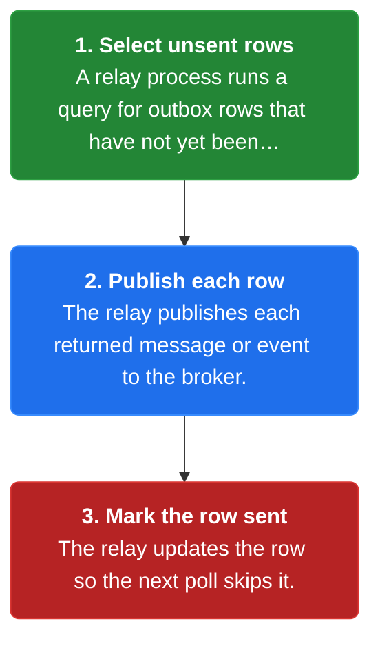
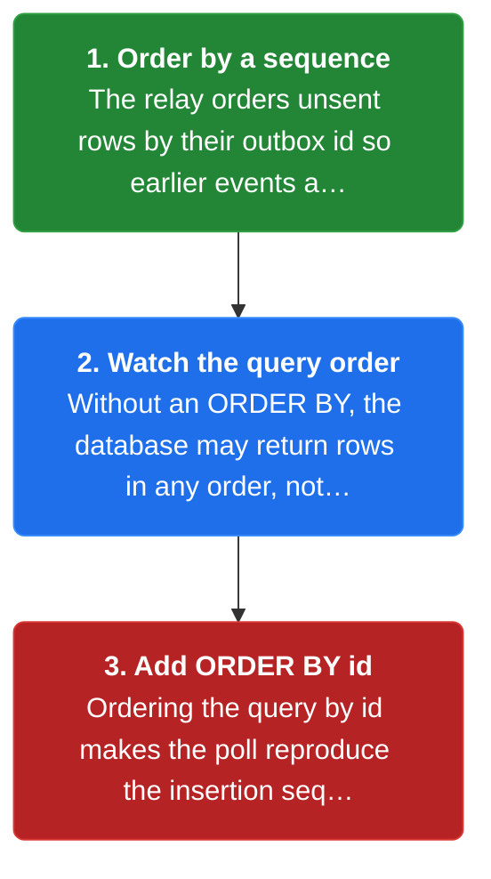
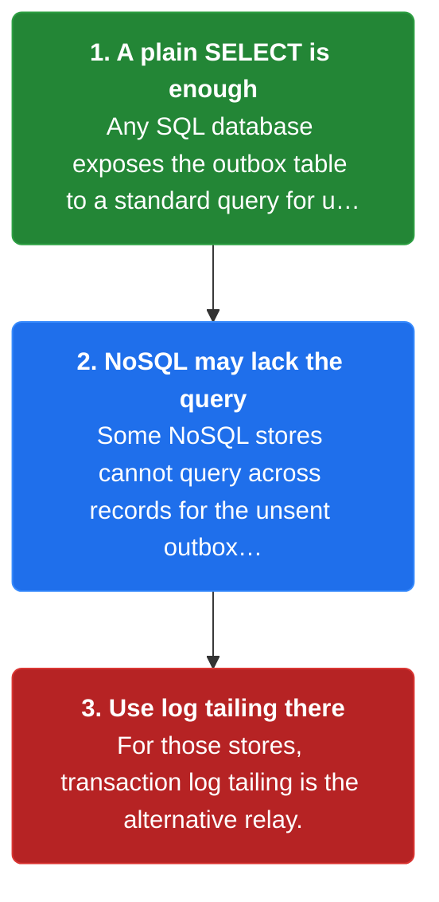

# Chapter 12: Polling Publisher

> Publish outbox messages to the broker by polling the database outbox table on an interval.

_Also known as: Chris Richardson · Microservice Patterns Ch.12 · microservices.io /patterns/data/polling-publisher.html_

## Flow

### Poll the outbox table

> **Why this matters:** Once the Transactional Outbox pattern has stored events in the database, something must move them to the broker; polling the outbox table with a plain SQL query is the simplest relay.



1. **Select unsent rows** — A relay process runs a query for outbox rows that have not yet been sent.

2. **Publish each row** — The relay publishes each returned message or event to the broker.

3. **Mark the row sent** — The relay updates the row so the next poll skips it.

```java
// RELAY SIDE — one poll cycle moves unsent outbox rows to the broker
// PARTIES: RLY = relay · DB = relational database · BRK = message broker
// STATE (before):
//    outbox : [ (1, "E1", sent=false), (2, "E2", sent=false) ]
//    published : [ ]
// DEF: poll_once · CALLED BY: a timer firing every 100 ms
// -> query : SELECT * FROM outbox WHERE sent=false   // returns [ (1,"E1",sent=false), (2,"E2",sent=false) ]
//    step 1 · fetch rows    : rows : [ ] -> [ (1,"E1",sent=false), (2,"E2",sent=false) ]
//    step 2 · publish row 1 : published : [ ] -> [ "E1" ]
//    step 3 · mark row 1    : outbox : [(1,"E1",sent=false),(2,"E2",sent=false)] -> [(1,"E1",sent=true),(2,"E2",sent=false)]
//    step 4 · publish row 2 : published : [ "E1" ] -> [ "E1", "E2" ]
//    step 5 · mark row 2    : outbox : [(1,"E1",sent=true),(2,"E2",sent=false)] -> [(1,"E1",sent=true),(2,"E2",sent=true)]
// <- output : BRK received [ "E1", "E2" ] · outbox now fully sent
```

### Publishing in order is tricky

> **Why this matters:** The relay must reproduce the order the application wrote events in, but a naive poll without an explicit ordering can hand the broker events out of order.



1. **Order by a sequence** — The relay orders unsent rows by their outbox id so earlier events are read first.

2. **Watch the query order** — Without an ORDER BY, the database may return rows in any order, not commit order.

3. **Add ORDER BY id** — Ordering the query by id makes the poll reproduce the insertion sequence.

```java
// RELAY SIDE — the same aggregate's two events must reach the broker in commit order
// PARTIES: RLY = relay · DB = relational database · BRK = message broker
// STATE (before):
//    outbox : [ (1, "E1", sent=false), (2, "E2", sent=false) ]
//    published : [ ]
// DEF: poll_without_order · CALLED BY: the relay running a query with no ORDER BY
// -> query : SELECT * FROM outbox WHERE sent=false   // returns rows in DB order, here id 2 first
//    step 1 · publish id 2 : published : [ ] -> [ "E2" ]     BECAUSE the query returned id 2 before id 1
//    step 2 · publish id 1 : published : [ "E2" ] -> [ "E2", "E1" ]
// <- output : BRK receives [ "E2", "E1" ] · order WRONG (E1 should precede E2)
// DEF: poll_with_order · CALLED BY: the relay adding ORDER BY id to the same query
// -> query : SELECT * FROM outbox WHERE sent=false ORDER BY id ASC   // returns id 1 then id 2
//    step 1 · publish id 1 : published : [ ] -> [ "E1" ]     BECAUSE ORDER BY id returns the committed-first row first
//    step 2 · publish id 2 : published : [ "E1" ] -> [ "E1", "E2" ]
// <- output : BRK receives [ "E1", "E2" ] · order CORRECT
```

### Any SQL database, not every NoSQL store

> **Why this matters:** Polling is portable because it only needs a standard query, but a database that cannot express the unsent-row query cannot use this relay.



1. **A plain SELECT is enough** — Any SQL database exposes the outbox table to a standard query for unsent rows.

2. **NoSQL may lack the query** — Some NoSQL stores cannot query across records for the unsent outbox property.

3. **Use log tailing there** — For those stores, transaction log tailing is the alternative relay.

```java
// RELAY SIDE — polling needs a queryable outbox: any SQL database has it, some NoSQL stores do not
// PARTIES: RLY = relay · SQLDB = MySQL database · NOSQL = NoSQL document store · BRK = message broker
// STATE (before):
//    outbox_sql : [ (1, "E1", sent=false) ]
//    outbox_nosql : { "rec-9" : { "event" : "E1", "sent" : false } }
//    published : [ ]
// DEF: poll_sql · CALLED BY: the relay against MySQL
// -> query : SELECT * FROM outbox WHERE sent=false    // matches : 1 unsent row
//    step 1 · publish E1 : published : [ ] -> [ "E1" ]          BECAUSE MySQL returns the one unsent row
//    step 2 · mark sent  : outbox_sql : [(1,"E1",sent=false)] -> [(1,"E1",sent=true)]
// <- output : BRK receives [ "E1" ] · SQLDB supports polling
// DEF: poll_nosql · CALLED BY: the relay against a NoSQL store with no unsent-row query
// -> query : SELECT * FROM outbox WHERE sent=false    // matches : 0 rows (the query cannot be expressed)
//    step 1 · publish nothing : published : [ ] -> [ ]  (0 messages sent)   BECAUSE the outbox is a per-record property with no global sent index
// <- output : BRK receives 0 messages · NOSQL cannot poll, so the relay uses transaction log tailing instead
```


## Key Concepts

### The Problem

**The outbox has events but no way out.** Something must discover the unsent outbox rows and hand each one to the broker.


### The Solution

Publish messages by polling the outbox table: select unsent rows, publish each, then mark it sent.


### Key Facts

| Fact | Detail | In the wild |
|---|---|---|
| Poll the outbox table | Publish messages by polling the outbox table: select unsent rows, publish each, then mark it sent. | The Eventuate Tram framework implements polling. |
| Publishing events in order is tricky | The relay needs an explicit ordering, and a query without ORDER BY can deliver events out of sequence. | Ordering by the outbox row id is the standard fix. |
| Works with any SQL database, not all NoSQL | A store where the outbox is a per-record property, with no global unsent-row query, cannot be polled. | Stores that cannot be polled fall back to transaction log tailing. |


### Tradeoffs & When

- The relay needs an explicit ordering, and a query without ORDER BY can deliver events out of sequence.
- A store where the outbox is a per-record property, with no global unsent-row query, cannot be polled.


<details><summary>All concepts (index)</summary>

### Problem: The outbox has events but no way out

**Why.** The Transactional Outbox pattern leaves messages sitting in a database table, and they only matter once they reach the message broker.

**Claim.** Something must discover the unsent outbox rows and hand each one to the broker.

**Grounding.** The reference problem statement: how to publish messages and events in the outbox in the database to the message broker.

**In the wild.** This is the relay half of transactional messaging; the outbox pattern creates the need for it.
### Solution: Poll the outbox table

**Why.** The outbox is just a table, so a recurring query can read whatever has not been sent yet.

**Claim.** Publish messages by polling the outbox table: select unsent rows, publish each, then mark it sent.

**Grounding.** The reference solution is one sentence: publish messages by polling the database outbox table.

**In the wild.** The Eventuate Tram framework implements polling.
### Tradeoff: Publishing events in order is tricky

**Why.** A poll must reproduce the order events were inserted, but the database does not hand rows back in order unless asked.

**Claim.** The relay needs an explicit ordering, and a query without ORDER BY can deliver events out of sequence.

**Grounding.** The reference lists "tricky to publish events in order" as a drawback.

**In the wild.** Ordering by the outbox row id is the standard fix.
### Tradeoff: Works with any SQL database, not all NoSQL

**Why.** Polling only needs a standard SELECT against a queryable table, which every SQL database provides.

**Claim.** A store where the outbox is a per-record property, with no global unsent-row query, cannot be polled.

**Grounding.** The reference lists "works with any SQL database" as a benefit and "not all NoSQL databases support this pattern" as a drawback.

**In the wild.** Stores that cannot be polled fall back to transaction log tailing.

</details>


## Quiz

1. What problem does the Polling Publisher solve?

   - A. How to atomically write business data and an event together.
   - B. How to publish the outbox messages stored in the database to the message broker.
   - C. How to make consumers idempotent.
   - D. How to replace the message broker with a database.

<details><summary>Reveal answer</summary>

**B.** The outbox pattern stores messages in the database, and the Polling Publisher is the relay that moves them to the broker. A is the Transactional Outbox problem, C is a consumer concern, and D is not a stated goal.

</details>

2. How does the relay discover events to publish?

   - A. The broker pushes events to the relay.
   - B. It tails the database transaction log.
   - C. It polls the database outbox table for unsent rows.
   - D. Consumers notify it directly.

<details><summary>Reveal answer</summary>

**C.** Polling publishes messages by repeatedly querying the outbox table for rows that are not yet sent. B is the alternative (transaction log tailing), and A and D are not how this pattern works.

</details>

3. Why is publishing events in order tricky for a polling relay?

   - A. Polling always preserves order for free.
   - B. A query without an explicit ordering may return rows out of commit order.
   - C. Events have no ordering requirement at all.
   - D. The broker reorders messages after they arrive.

<details><summary>Reveal answer</summary>

**B.** The database does not guarantee a row order unless the query asks for one, so an unordered poll can publish a later event before an earlier one. A and C are false, and D is not the mechanism.

</details>

4. Why do not all NoSQL databases support this pattern?

   - A. They have no message broker integration.
   - B. They cannot be polled when the outbox is a per-record property with no unsent-row query.
   - C. They always lose events on rollback.
   - D. They require 2PC to poll.

<details><summary>Reveal answer</summary>

**B.** Polling needs a queryable outbox table; where the outbox is a property on each record and no query can find unsent rows, polling cannot work. A, C, and D are not stated in the reference.

</details>

