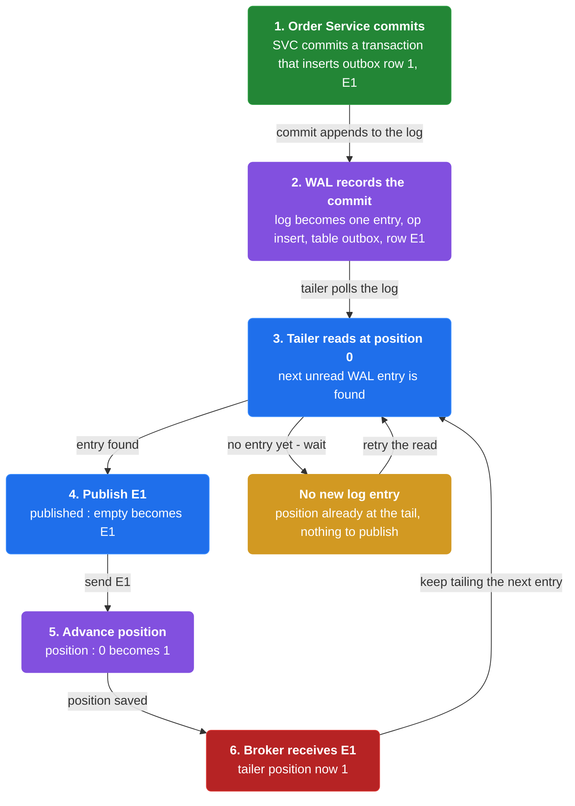
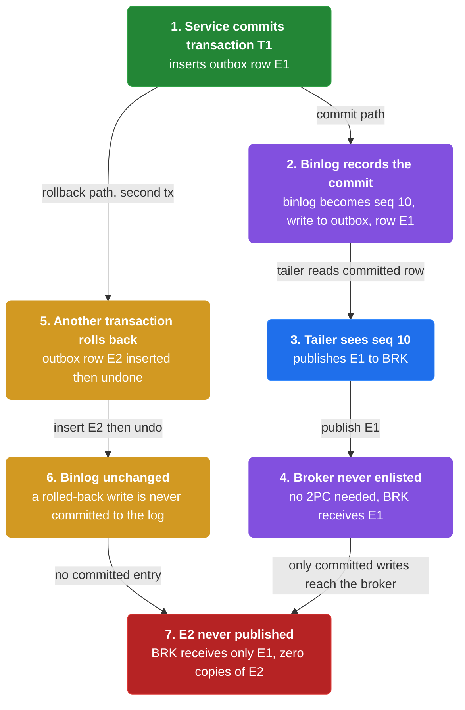
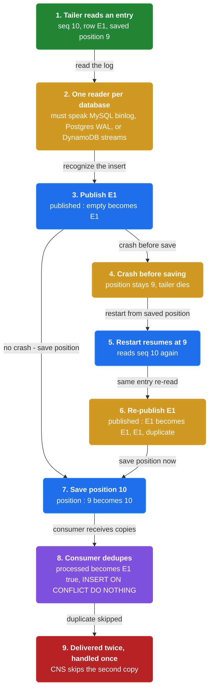

# Chapter 13: Transaction Log Tailing

> Tail the database transaction log and publish each outbox message as the log records its commit.

_Also known as: Chris Richardson · Microservice Patterns Ch.13 · microservices.io /patterns/data/transaction-log-tailing.html_

## Flow

### Tail the transaction log

> **Why this matters:** Instead of polling the outbox table, the relay reads the database's own transaction log and publishes every message the log shows was committed to the outbox.



1. **Read the log** — The relay tails the database transaction log: MySQL binlog, Postgres WAL, or DynamoDB streams.

2. **Find outbox inserts** — Each outbox insert shows up as a log entry the relay can recognize.

3. **Publish each entry** — The relay publishes the message embedded in each outbox insert to the broker.

```java
// TAILER SIDE — the relay reads the database transaction log and publishes each committed outbox insert
// PARTIES: SVC = Order Service · DB = PostgreSQL database · LOG = its write-ahead log (WAL) · TLR = log tailer · BRK = message broker
// STATE (before):
//    outbox : [ ]
//    log : [ ]
//    position : 0
//    published : [ ]
// DEF: commit_outbox · CALLED BY: SVC committing a transaction that inserts an outbox row
// -> event : "E1"
//    step 1 · insert outbox row  : outbox : [ ] -> [ (1, "E1") ]
//    step 2 · WAL records commit : log : [ ] -> [ { "op":"insert", "table":"outbox", "row":(1,"E1") } ]   BECAUSE the commit is appended to the WAL as a log entry
// <- output : DB has (1,"E1") committed · WAL has 1 new entry
// DEF: tail_once · CALLED BY: TLR reading the WAL at its saved position 0
// -> read : next WAL entry at position 0
//    step 1 · read next entry : entry : "none" -> { "op":"insert", "row":(1,"E1") }   BECAUSE position 0 is the first unread WAL entry
//    step 2 · publish E1      : published : [ ] -> [ "E1" ]
//    step 3 · advance position : position : 0 -> 1
// <- output : BRK receives [ "E1" ] · tailer position now 1
```

### No 2PC and guaranteed accurate

> **Why this matters:** Tailing the log gets the outbox's atomicity for free: the log records only committed writes, so the relay can never publish an event from a transaction that rolled back.



1. **The log records commits only** — A rolled-back transaction's outbox insert never appears in the committed log.

2. **Relay publishes committed rows** — Every message the relay publishes is backed by a committed outbox row.

3. **No broker enlistment** — The broker is never part of the database transaction, so no 2PC is needed.

```java
// TAILER SIDE — the log carries only committed writes, so a rolled-back event is never published
// PARTIES: SVC = Order Service · DB = MySQL database · LOG = its binlog · TLR = log tailer · BRK = message broker
// STATE (before):
//    outbox : [ ]
//    binlog : [ ]
//    published : [ ]
// DEF: commit_tx · CALLED BY: SVC committing a transaction
// -> event : "E1"
//    step 1 · insert outbox row : outbox : [ ] -> [ (1, "E1") ]
//    step 2 · binlog append     : binlog : [ ] -> [ { "seq":10, "op":"write", "table":"outbox", "row":(1,"E1") } ]   BECAUSE the commit is written to the binlog
// <- output : TLR sees seq 10 and publishes "E1" · no 2PC (BRK is never enlisted)
// DEF: rollback_tx · CALLED BY: SVC rolling back a different transaction
// -> event : "E2"
//    step 1 · insert outbox row : outbox : [ (1,"E1") ] -> [ (1,"E1"), (2,"E2") ]
//    step 2 · rollback          : outbox : [ (1,"E1"), (2,"E2") ] -> [ (1,"E1") ]   BECAUSE the rollback undoes the insert
//    step 3 · binlog unchanged  : binlog : [ { "seq":10, "op":"write", "table":"outbox", "row":(1,"E1") } ] -> [ { "seq":10, "op":"write", "table":"outbox", "row":(1,"E1") } ]   BECAUSE a rolled-back write is not committed to the binlog
// <- output : TLR never sees "E2" · BRK receives only "E1" (0 copies of "E2")
```

### Database-specific and duplicate-prone

> **Why this matters:** Log tailing is accurate but couples the relay to one database's log format, and a relay that crashes mid-read can publish the same entry twice.



1. **One reader per database** — The tailer must understand MySQL binlog, Postgres WAL, or DynamoDB streams specifically.

2. **Track the log position** — The tailer records how far it has read so a restart can resume.

3. **Dedupe on the consumer** — A crash between publish and position-write re-reads an entry, so consumers must be idempotent.

```java
// TAILER SIDE — a crash between publish and position-save re-reads an entry, so consumers dedupe
// PARTIES: TLR = log tailer · DB = MySQL database · BRK = message broker · CNS = consumer service
// STATE (before):
//    binlog : [ { "seq":10, "row":(1,"E1") } ]
//    position : 9
//    published : [ ]
//    processed : { }
// DEF: tail_seq10 · CALLED BY: TLR reading the next binlog entry
// -> read : entry seq 10
//    step 1 · publish E1 : published : [ ] -> [ "E1" ]
//    step 2 · CRASH      : position : 9 -> 9    // tailer dies BEFORE saving seq 10, so position stays 9
// <- outcome : BRK has [ "E1" ] · saved position still 9
// DEF: tail_restart · CALLED BY: TLR after restart, resuming from saved position 9
// -> read : entry seq 10 again    // position 9 means seq 10 is re-read
//    step 1 · re-publish E1 : published : [ "E1" ] -> [ "E1", "E1" ]   BECAUSE seq 10 was published but never marked as saved, so duplicate
//    step 2 · save position : position : 9 -> 10
//    step 3 · CNS dedupes   : processed : { } -> { "E1" : true }       BECAUSE CNS runs INSERT ... ON CONFLICT DO NOTHING on its processed table
// <- output : BRK delivered "E1" twice · CNS handled it once (the second copy is skipped)
```


## Key Concepts

### The Problem

**The outbox is committed but sits idle.** A relay must discover each committed outbox message and publish it to the broker.


### The Solution

Tail the log and publish each outbox insert to the broker, using MySQL binlog, Postgres WAL, or DynamoDB table streams.


### Key Facts

| Fact | Detail | In the wild |
|---|---|---|
| Tail the database transaction log | Tail the log and publish each outbox insert to the broker, using MySQL binlog, Postgres WAL, or DynamoDB table streams. | The Eventuate Tram framework implements transaction log tailing. |
| Accurate, and no 2PC | The relay publishes only committed writes and never enlists the broker in the transaction, so no 2PC is used. | A rolled-back transaction leaves no committed log entry, so it is never published. |
| Database-specific and duplicate-prone | The solution requires database-specific tooling, and avoiding duplicate publishing is tricky, so consumers must dedupe. | The tailer saves its log position, and consumers track processed message ids. |


### Tradeoffs & When

- The relay publishes only committed writes and never enlists the broker in the transaction, so no 2PC is used.
- The solution requires database-specific tooling, and avoiding duplicate publishing is tricky, so consumers must dedupe.


<details><summary>All concepts (index)</summary>

### Problem: The outbox is committed but sits idle

**Why.** The Transactional Outbox pattern leaves messages in the database, and they only matter once they reach the broker.

**Claim.** A relay must discover each committed outbox message and publish it to the broker.

**Grounding.** The reference problem statement: how to publish messages and events in the outbox in the database to the message broker.

**In the wild.** The outbox pattern creates the need for this pattern.
### Solution: Tail the database transaction log

**Why.** The database already writes every committed change to a transaction log, so the relay can read that instead of the table.

**Claim.** Tail the log and publish each outbox insert to the broker, using MySQL binlog, Postgres WAL, or DynamoDB table streams.

**Grounding.** The reference solution names exactly those three database-specific mechanisms.

**In the wild.** The Eventuate Tram framework implements transaction log tailing.
### Tradeoff: Accurate, and no 2PC

**Why.** The log is the database's own record of committed changes, so accuracy comes from the database, not from the relay.

**Claim.** The relay publishes only committed writes and never enlists the broker in the transaction, so no 2PC is used.

**Grounding.** The reference lists "no 2PC" and "guaranteed to be accurate" as benefits.

**In the wild.** A rolled-back transaction leaves no committed log entry, so it is never published.
### Tradeoff: Database-specific and duplicate-prone

**Why.** Each database has its own log format, and a relay that restarts mid-read can re-publish an entry.

**Claim.** The solution requires database-specific tooling, and avoiding duplicate publishing is tricky, so consumers must dedupe.

**Grounding.** The reference lists "relatively obscure", "requires database specific solutions", and "tricky to avoid duplicate publishing" as drawbacks.

**In the wild.** The tailer saves its log position, and consumers track processed message ids.

</details>


## Quiz

1. How does transaction log tailing discover events to publish?

   - A. It polls the outbox table with a SQL query.
   - B. It reads the database transaction log and publishes each outbox insert.
   - C. The broker subscribes to the database directly.
   - D. Consumers request events from the tailer.

<details><summary>Reveal answer</summary>

**B.** Tailing reads the database transaction log and publishes each committed outbox insert. A is the Polling Publisher alternative, and C and D are not how this pattern works.

</details>

2. Which database-specific log mechanisms does the reference name?

   - A. Redis pub/sub and Kafka topics.
   - B. MySQL binlog, Postgres WAL, and AWS DynamoDB table streams.
   - C. SQL indexes and materialized views.
   - D. Oracle redo logs only.

<details><summary>Reveal answer</summary>

**B.** The reference lists MySQL binlog, Postgres WAL, and AWS DynamoDB table streams as the database-dependent mechanisms. A and C are not log mechanisms, and D omits two of the three named mechanisms.

</details>

3. Why does log tailing stay accurate without 2PC?

   - A. It asks the broker to confirm each write.
   - B. The log records only committed writes, so a rolled-back event never appears and is never published.
   - C. It uses a distributed lock across the database and broker.
   - D. It republishes every event twice for safety.

<details><summary>Reveal answer</summary>

**B.** The database's log contains only committed changes, so the tailer can never publish an event from a transaction that rolled back, and the broker is never enlisted. A, C, and D are not how the pattern achieves accuracy.

</details>

4. Why is avoiding duplicate publishing tricky?

   - A. The database deletes log entries unpredictably.
   - B. A tailer that crashes after publishing but before saving its position re-reads and re-publishes the same entry.
   - C. The broker refuses to accept a message twice.
   - D. Consumers never receive the same message twice.

<details><summary>Reveal answer</summary>

**B.** The crash window between publishing and saving the log position means an entry is re-read and re-published on restart, so consumers must be idempotent. A, C, and D are not stated and misdescribe the mechanism.

</details>

