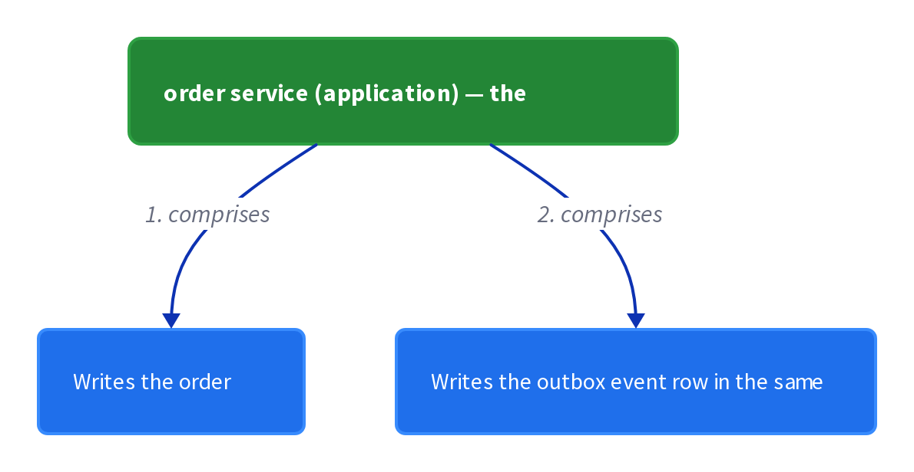
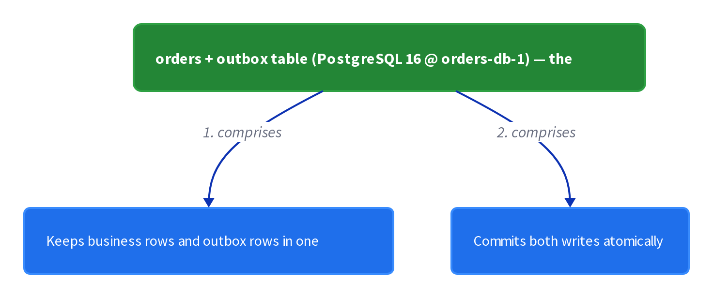
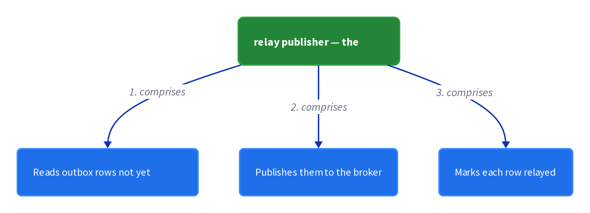
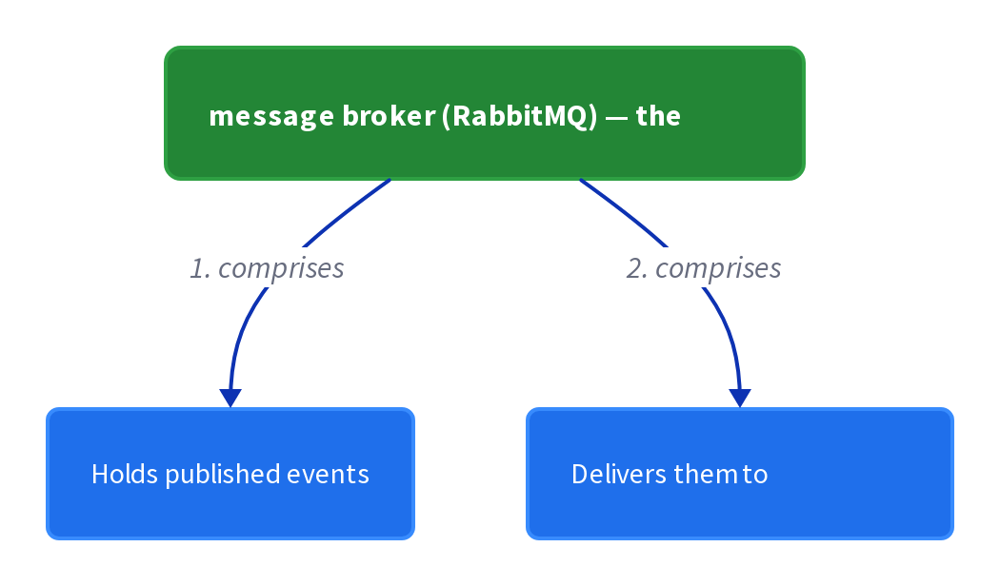

# Chapter 14: Transactional Outbox

> Store a message in a database outbox table inside the same transaction that updates business data, then let a separate relay publish it to the broker.

_Also known as: Application events · Chris Richardson · Microservice Patterns Ch.14 · microservices.io /patterns/data/transactional-outbox.html_

## Flow

### One transaction for the write and the message

> **Why this matters:** A command must change business data and publish an event as one atomic step, but 2PC across the database and broker is not viable; without atomicity you either lose the event for a committed change or leak an event from a rolled-back transaction.

1. **Update the aggregate** — The sender applies its normal business change to the database inside a local transaction.

2. **Insert the outbox row** — In that same transaction it inserts the message or event into the outbox table.

3. **Commit both or neither** — Commit makes the business row and the outbox row durable together; rollback drops both.

```java
// ORDER SERVICE SIDE — commit a business write and its event together, without 2PC
// PARTIES: SVC = Order Service · DB = PostgreSQL 16 @ orders-db-1 (orders + outbox tables live in this ONE instance, so a single COMMIT covers both) · BRK = message broker
// STATE (before):
//    orders : { }
//    outbox : [ ]
//    tx : "none"
// DEF: create_order · CALLED BY: U1 placing an order
// -> order_id : "PO-2001" · -> total : 100.00
//    step 1 · begin T1          : tx : "none" -> "open"       BECAUSE SVC starts a local transaction (BRK is NOT enlisted, so no 2PC)
//    step 2 · insert business   : orders : { } -> { "PO-2001" : "PENDING" }
//    step 3 · insert outbox row : outbox : [ ] -> [ (1, "order_created") ]
//    step 4 · commit T1         : tx : "open" -> "committed"  BECAUSE both rows live in the same local transaction
// <- result : outbox : [ (1, "order_created") ] · BRK received 0 messages so far
//    alt rollback T1 : orders : { } -> { } · outbox : [ (1, "order_created") ] -> [ ] · event NOT published  BECAUSE the rollback undoes both inserts
```

### The relay publishes in order

> **Why this matters:** A separate relay reads the outbox and hands messages to the broker, and it must reproduce the order the application wrote them in.

1. **Read unsent rows in order** — The relay selects outbox rows that are not yet sent, ordered by their id.

2. **Publish each to the broker** — Each row is published to the broker topic in the order it was read.

3. **Mark the row sent** — The relay updates the row so a later poll will not re-publish it.

```java
// RELAY SIDE — publish unsent outbox rows to the broker in the order they were inserted
// PARTIES: RLY = message relay · DB = PostgreSQL 16 @ orders-db-1 (orders + outbox tables live in this ONE instance, so a single COMMIT covers both) · BRK = message broker
// STATE (before):
//    outbox : [ (1, "E1", sent=false), (2, "E2", sent=false) ]
//    published : [ ]
// DEF: relay_poll · CALLED BY: a polling loop, every 100 ms
// -> query : SELECT * FROM outbox WHERE sent=false ORDER BY id ASC   // returns id 1 then id 2
//    step 1 · fetch rows  : pending : [ ] -> [ (1, "E1"), (2, "E2") ]   BECAUSE ORDER BY id returns the committed-first row first
//    step 2 · publish E1  : published : [ ] -> [ "E1" ]                 BECAUSE id 1 is the first row read
//    step 3 · mark id 1   : outbox : [(1,"E1",sent=false),(2,"E2",sent=false)] -> [(1,"E1",sent=true),(2,"E2",sent=false)]
//    step 4 · publish E2  : published : [ "E1" ] -> [ "E1", "E2" ]
//    step 5 · mark id 2   : outbox : [(1,"E1",sent=true),(2,"E2",sent=false)] -> [(1,"E1",sent=true),(2,"E2",sent=true)]
// <- output : BRK receives [ "E1", "E2" ] in id order · outbox fully sent
```

### The crash window means at-least-once

> **Why this matters:** The relay can crash after publishing a message but before recording that it did, so it publishes the same message again on restart; consumers must tolerate duplicates.

1. **Publish then mark** — The relay publishes a row and only then marks it sent, leaving a window between the two writes.

2. **Crash inside the window** — If the relay dies after publish but before marking, the row is still unsent.

3. **Consumer dedupes** — The consumer records each processed message id and skips any it has already handled.

```java
// RELAY + CONSUMER SIDE — a crash between publish and mark re-sends the row, so the consumer dedupes
// PARTIES: RLY = message relay · DB = PostgreSQL 16 @ orders-db-1 (orders + outbox tables live in this ONE instance, so a single COMMIT covers both) · BRK = message broker · CNS = consumer service
// STATE (before):
//    outbox : [ (1, "E1", sent=false) ]
//    published : [ ]
//    processed : { }
// DEF: relay_publish · CALLED BY: the relay on its next poll
// -> row : (1, "E1", sent=false)
//    step 1 · publish E1 to BRK : published : [ ] -> [ "E1" ]       // BRK now holds one copy
//    step 2 · CRASH before mark : outbox : [(1,"E1",sent=false)] -> [(1,"E1",sent=false)]   // the relay dies; row still unsent
// <- outcome : BRK delivered "E1" once · outbox row (1,"E1") still sent=false
// DEF: relay_restart · CALLED BY: the relay after restart, polling again
// -> query : SELECT * FROM outbox WHERE sent=false    // returns (1, "E1", sent=false) again
//    step 1 · re-publish E1 : published : [ "E1" ] -> [ "E1", "E1" ]   BECAUSE the row was never marked sent, so at-least-once duplicate
//    step 2 · mark id 1     : outbox : [(1,"E1",sent=false)] -> [(1,"E1",sent=true)]
//    step 3 · CNS dedupes   : processed : { } -> { "E1" : true }       BECAUSE CNS runs INSERT ... ON CONFLICT DO NOTHING on its processed table
// <- output : BRK delivered "E1" twice · CNS handled it once (the second copy is idempotently skipped)
```

### Ordering must survive multiple instances

> **Why this matters:** When several service instances update the same aggregate, each commits its own event, yet the broker must still receive them in the order the transactions committed.

1. **Sequence by commit order** — Each committed transaction inserts its outbox row, and the row id grows with commit order.

2. **Order by the row id** — The relay reads rows ordered by id, not by which instance wrote them.

3. **Preserve T1 before T2** — Because T1 committed before T2, event E1 is published before E2.

```java
// TWO SERVICE INSTANCES SIDE — one aggregate, two commits, and the broker still sees them in order
// PARTIES: SVC1 = Order Service instance A · SVC2 = Order Service instance B · DB = PostgreSQL 16 @ orders-db-1 (the ONE instance both order-service instances commit to) · BRK = message broker
// STATE (before):
//    aggregate : { "PO-2001" : "PENDING" }
//    outbox : [ ]
// DEF: tx_T1 · CALLED BY: SVC1 updating aggregate "PO-2001"
// -> txn : "T1"
//    step 1 · update aggregate : aggregate : { "PO-2001" : "PENDING" } -> { "PO-2001" : "APPROVED" }
//    step 2 · insert outbox    : outbox : [ ] -> [ (1, "E1") ]   BECAUSE T1 commits first, its outbox row gets id 1
// <- commit T1 : outbox now [ (1, "E1") ]
// DEF: tx_T2 · CALLED BY: SVC2 updating the same aggregate "PO-2001"
// -> txn : "T2"
//    step 1 · update aggregate : aggregate : { "PO-2001" : "APPROVED" } -> { "PO-2001" : "SHIPPED" }
//    step 2 · insert outbox    : outbox : [ (1, "E1") ] -> [ (1, "E1"), (2, "E2") ]   BECAUSE T2 commits after T1, its row gets id 2
// <- commit T2 : outbox now [ (1, "E1"), (2, "E2") ] · relay reads by id and publishes "E1" before "E2"
```


## System Design Interview

> **The question:** Design reliable message publication. Premise: the application writes the business row and the outbox row in one database transaction, and a relay publishes the outbox, so a message is never lost or sent without its state change.

**The pipeline:** application tx → outbox table → relay publisher → broker

### order service (application) — the application

_Role: application_



### orders + outbox table (PostgreSQL 16 @ orders-db-1) — the database

_Role: database_



### relay publisher — the relay

_Role: relay_



### message broker (RabbitMQ) — the broker

_Role: broker_



```java
// SYSTEM DESIGN — transactional outbox as a pipeline: application tx -> outbox table (same database) -> relay publisher -> broker (reliable, no dual-write)
// PARTIES: SVC = order service (application) · DB = PostgreSQL 16 @ orders-db-1 (orders + outbox in one instance) · RLY = relay publisher · BRK = message broker (RabbitMQ) · CNS = subscriber
// DEF: orders — the business table; here [ ("PO-77", "PENDING"), ("PO-2001", "APPROVED") ]
// DEF: outbox — the event table written in the same tx; here [ (1, "OrderPlaced", "PO-77"), (2, "PaymentAuthorized", "PO-2001") ]
// DEF: event — an event the relay publishes from an outbox row; here {"type":"OrderPlaced","order_id":"PO-77"}
// DEF: status — a row's relay flag; here "unsent" -> "sent"
// STATE (before):
//    orders : [ ("PO-77", "PENDING"), ("PO-2001", "APPROVED") ]
//    outbox : []
//    event  : "none"
//    status : "unsent"
// DEF: place_order · CALLED BY: SVC handling POST /orders
// -> request : {"order_id":"PO-77"}
//    step 1 · SVC writes order and outbox row atomically    outbox : [] -> [ (1, "OrderPlaced", "PO-77") ]   BECAUSE both writes share one database transaction
//    step 2 · SVC commits the transaction    orders : [("PO-77","PENDING"),("PO-2001","APPROVED")] -> [("PO-77","PENDING"),("PO-2001","APPROVED")]   BECAUSE the order and event become visible together, never half-written
//    step 3 · RLY publishes the outbox row    event : "none" -> {"type":"OrderPlaced","order_id":"PO-77"}   BECAUSE the relay reads the row and hands it to BRK
//    step 4 · RLY marks the row relayed    status : "unsent" -> "sent"   BECAUSE the flag stops the row being republished
// <- outcome : BRK holds [ "OrderPlaced" ] · the order and event never diverge (same tx)
```

## Interview Questions

### Q1

Your order service must create an order and publish an OrderPlaced event, but a crash between the database write and the broker publish would either lose the event or leak one for a rolled-back write. You refuse to use 2PC.

**Interviewer's question:** How does the Transactional Outbox make the data change and its event atomic without 2PC?

**Solution:** The service inserts the outbox row in the same local transaction that updates the aggregate, so commit makes both durable and rollback drops both; a separate relay publishes later.

**System-design components:**
- Business write — the aggregate update in the local transaction
- Outbox row — the event stored in the same transaction
- Local commit — makes both rows durable together
- Relay — publishes outbox rows after commit

```java
// ORDER SERVICE SIDE — commit a business write and its event together, without 2PC
// PARTIES: SVC = Order Service · DB = PostgreSQL 16 @ orders-db-1 (orders + outbox tables live in this ONE instance, so a single COMMIT covers both) · BRK = message broker
// STATE (before):
//    orders : { }
//    outbox : [ ]
//    tx : "none"
// DEF: place_order · CALLED BY: U7 placing order "PO-77"
// -> order_id : "PO-77" · -> total : 45.00
//    step 1 · begin T1 : tx : "none" -> "open"   BECAUSE SVC starts a local transaction (BRK is NOT enlisted, so no 2PC)
//    step 2 · insert business : orders : { } -> { "PO-77" : "PENDING" }
//    step 3 · insert outbox row : outbox : [ ] -> [ (101, "OrderPlaced") ]
//    step 4 · commit T1 : tx : "open" -> "committed"   BECAUSE both rows live in the same local transaction
// <- result : outbox : [ (101, "OrderPlaced") ] · BRK received 0 messages so far
//    alt rollback T1 : orders : { } -> { } · outbox : [ (101, "OrderPlaced") ] -> [ ] · event NOT published   BECAUSE the rollback undoes both inserts
```

_This is the Transactional Outbox — one local transaction writes the business data and the outbox row together._

_Covers:_ One transaction for the write and the message

_From the 28 problems:_ 26-payment-system · 19-distributed-message-queue

### Q2

Two events for the same order — OrderPlaced then PaymentAuthorized — sit in your outbox, and the relay must hand them to the broker in that exact order.

**Interviewer's question:** How does the outbox relay publish messages in the order the application wrote them?

**Solution:** The relay selects unsent rows ordered by id and publishes each in that order, then marks it sent.

**System-design components:**
- Outbox row id — insertion order
- Ordered query — ORDER BY id ASC
- Publish step — one row per broker send
- Mark-sent — UPDATE per row

```java
// RELAY SIDE — publish unsent outbox rows to the broker in the order they were inserted
// PARTIES: RLY = message relay · DB = PostgreSQL 16 @ orders-db-1 (orders + outbox tables live in this ONE instance, so a single COMMIT covers both) · BRK = message broker
// STATE (before):
//    outbox : [ (101, "OrderPlaced", sent=false), (102, "PaymentAuthorized", sent=false) ]
//    published : [ ]
// DEF: relay_poll · CALLED BY: a polling loop, every 200 ms
// -> query : SELECT * FROM outbox WHERE sent=false ORDER BY id ASC   // returns id 101 then id 102
//    step 1 · fetch rows : pending : [ ] -> [ (101, "OrderPlaced"), (102, "PaymentAuthorized") ]   BECAUSE ORDER BY id returns the committed-first row first
//    step 2 · publish id 101 : published : [ ] -> [ "OrderPlaced" ]
//    step 3 · mark id 101 : outbox : [(101,"OrderPlaced",sent=false),(102,"PaymentAuthorized",sent=false)] -> [(101,"OrderPlaced",sent=true),(102,"PaymentAuthorized",sent=false)]
//    step 4 · publish id 102 : published : [ "OrderPlaced" ] -> [ "OrderPlaced", "PaymentAuthorized" ]
//    step 5 · mark id 102 : outbox : [(101,"OrderPlaced",sent=true),(102,"PaymentAuthorized",sent=false)] -> [(101,"OrderPlaced",sent=true),(102,"PaymentAuthorized",sent=true)]
// <- output : BRK receives [ "OrderPlaced", "PaymentAuthorized" ] in id order · outbox fully sent
```

_This is the Transactional Outbox relay — ordered by id, so earlier events are published first._

_Covers:_ The relay publishes in order

_From the 28 problems:_ 26-payment-system · 19-distributed-message-queue

### Q3

Your relay published an outbox row then crashed before marking it sent. On restart it publishes the same row again, and the consumer now sees the event twice.

**Interviewer's question:** Why does the Transactional Outbox give at-least-once delivery, and what must consumers do?

**Solution:** The relay can crash between publishing and marking, so a restart re-publishes the still-unsent row; consumers record processed message ids and skip duplicates.

**System-design components:**
- Publish-then-mark window
- Crash — row still unsent
- Restart — re-publishes the row
- Consumer processed table — dedupes

```java
// RELAY + CONSUMER SIDE — a crash between publish and mark re-sends the row, so the consumer dedupes
// PARTIES: RLY = message relay · DB = PostgreSQL 16 @ orders-db-1 (orders + outbox tables live in this ONE instance, so a single COMMIT covers both) · BRK = message broker · CNS = consumer service
// STATE (before):
//    outbox : [ (101, "OrderPlaced", sent=false) ]
//    published : [ ]
//    processed : { }
// DEF: relay_publish · CALLED BY: the relay on its next poll
// -> row : (101, "OrderPlaced", sent=false)
//    step 1 · publish OrderPlaced to BRK : published : [ ] -> [ "OrderPlaced" ]
//    step 2 · CRASH before mark : outbox : [(101,"OrderPlaced",sent=false)] -> [(101,"OrderPlaced",sent=false)]   // the relay dies; row still unsent
// <- outcome : BRK delivered "OrderPlaced" once · outbox row (101,"OrderPlaced") still sent=false
// DEF: relay_restart · CALLED BY: the relay after restart, polling again
// -> query : SELECT * FROM outbox WHERE sent=false   // returns (101, "OrderPlaced", sent=false) again
//    step 1 · re-publish OrderPlaced : published : [ "OrderPlaced" ] -> [ "OrderPlaced", "OrderPlaced" ]   BECAUSE the row was never marked sent, so at-least-once duplicate
//    step 2 · mark id 101 : outbox : [(101,"OrderPlaced",sent=false)] -> [(101,"OrderPlaced",sent=true)]
//    step 3 · CNS dedupes : processed : { } -> { "OrderPlaced" : true }   BECAUSE CNS runs INSERT ... ON CONFLICT DO NOTHING on its processed table
// <- output : BRK delivered "OrderPlaced" twice · CNS handled it once (the second copy is idempotently skipped)
```

_This is the Transactional Outbox's at-least-once tradeoff — the publish-mark window forces consumer idempotency._

_Covers:_ The crash window means at-least-once

_From the 28 problems:_ 26-payment-system · 19-distributed-message-queue

### Q4

Two instances of your order service update the same order — instance A approves it, instance B ships it — each committing its own event to the shared outbox. The broker must still see Approved before Shipped.

**Interviewer's question:** How does event ordering survive multiple service instances writing to the same outbox?

**Solution:** Each committed transaction gets an outbox row whose id grows with commit order; the relay reads by id, so T1 (Approved) is published before T2 (Shipped).

**System-design components:**
- Instance A — commits T1 first
- Instance B — commits T2 second
- Outbox row id — commit order
- Relay — publishes by id

```java
// TWO SERVICE INSTANCES SIDE — one aggregate, two commits, and the broker still sees them in order
// PARTIES: SVC1 = Order Service instance A · SVC2 = Order Service instance B · DB = PostgreSQL 16 @ orders-db-1 (the ONE instance both order-service instances commit to) · BRK = message broker
// STATE (before):
//    aggregate : { "PO-77" : "PENDING" }
//    outbox : [ ]
// DEF: tx_T1 · CALLED BY: SVC1 updating aggregate "PO-77"
// -> txn : "T1"
//    step 1 · update aggregate : aggregate : { "PO-77" : "PENDING" } -> { "PO-77" : "APPROVED" }
//    step 2 · insert outbox : outbox : [ ] -> [ (1, "OrderApproved") ]   BECAUSE T1 commits first, its outbox row gets id 1
// <- commit T1 : outbox now [ (1, "OrderApproved") ]
// DEF: tx_T2 · CALLED BY: SVC2 updating the same aggregate "PO-77"
// -> txn : "T2"
//    step 1 · update aggregate : aggregate : { "PO-77" : "APPROVED" } -> { "PO-77" : "SHIPPED" }
//    step 2 · insert outbox : outbox : [ (1, "OrderApproved") ] -> [ (1, "OrderApproved"), (2, "OrderShipped") ]   BECAUSE T2 commits after T1, its row gets id 2
// <- commit T2 : outbox now [ (1, "OrderApproved"), (2, "OrderShipped") ] · relay reads by id and publishes "OrderApproved" before "OrderShipped"
```

_This is the Transactional Outbox's ordering guarantee — the outbox row id reproduces commit order across instances._

_Covers:_ Ordering must survive multiple instances

_From the 28 problems:_ 26-payment-system · 19-distributed-message-queue

## Key Concepts

### The Problem

**The write and the message drift apart.** Without atomicity, a committed database change can lose its event (crash before send) or an event can escape a transaction that rolls back.


### The Solution

The service inserts an outbox row in the same transaction that updates the aggregate; a separate relay later publishes those rows to the broker.

```java
// ORDER SERVICE SIDE — commit a business write and its event together, without 2PC
// PARTIES: SVC = Order Service · DB = PostgreSQL 16 @ orders-db-1 (orders + outbox tables live in this ONE instance, so a single COMMIT covers both) · BRK = message broker
// STATE (before):
//    orders : { }
//    outbox : [ ]
//    tx : "none"
// DEF: place_order · CALLED BY: U7 placing order "PO-77"
// -> order_id : "PO-77" · -> total : 45.00
//    step 1 · begin T1 : tx : "none" -> "open"   BECAUSE SVC starts a local transaction (BRK is NOT enlisted, so no 2PC)
//    step 2 · insert business : orders : { } -> { "PO-77" : "PENDING" }
//    step 3 · insert outbox row : outbox : [ ] -> [ (101, "OrderPlaced") ]
//    step 4 · commit T1 : tx : "open" -> "committed"   BECAUSE both rows live in the same local transaction
// <- result : outbox : [ (101, "OrderPlaced") ] · BRK received 0 messages so far
//    alt rollback T1 : orders : { } -> { } · outbox : [ (101, "OrderPlaced") ] -> [ ] · event NOT published   BECAUSE the rollback undoes both inserts
```


### Key Facts

| Fact | Detail | In the wild |
|---|---|---|
| One outbox row per event, in the same transaction | The service inserts an outbox row in the same transaction that updates the aggregate; a separate relay later publishes those rows to the broker. | Eventuate Tram implements this pattern. |
| At-least-once delivery to consumers | Consumers must be idempotent, typically by recording the ids of messages they have already processed. | A processed-message table guarded by INSERT ... ON CONFLICT DO NOTHING is the standard dedupe. |
| Ordering must be preserved | Each committed transaction publishes one event, and T1 preceding T2 means E1 must be published before E2. | Relays rely on the outbox row order to reproduce that sequence. |


### Tradeoffs & When

- Consumers must be idempotent, typically by recording the ids of messages they have already processed.
- Each committed transaction publishes one event, and T1 preceding T2 means E1 must be published before E2.


<details><summary>All concepts (index)</summary>

### Problem: The write and the message drift apart

**Why.** A service command must update aggregates in the database AND send events to a broker, but 2PC across the two is not viable and coupling the service to both is undesirable.

**Claim.** Without atomicity, a committed database change can lose its event (crash before send) or an event can escape a transaction that rolls back.

**Grounding.** The reference: sending a message mid-transaction is unreliable because there is no guarantee the transaction commits, and sending after commit has no guarantee the service will not crash first.

**In the wild.** Any saga participant or domain-event publisher hits this: it must change state and publish in one step.
### Solution: One outbox row per event, in the same transaction

**Why.** If the message is stored in the database as part of the business transaction, the message and the data change share one atomic commit.

**Claim.** The service inserts an outbox row in the same transaction that updates the aggregate; a separate relay later publishes those rows to the broker.

**Grounding.** The participants named in the reference are Sender, Database, Message outbox (a table in a relational database, or a property on each record in NoSQL), and Message relay.

**In the wild.** Eventuate Tram implements this pattern.
### Tradeoff: At-least-once delivery to consumers

**Why.** The relay can crash after publishing but before marking a row sent, so on restart it publishes the same message again.

**Claim.** Consumers must be idempotent, typically by recording the ids of messages they have already processed.

**Grounding.** The reference notes the relay might publish a message more than once, and that consumers usually need idempotency anyway because a broker can deliver a message more than once.

**In the wild.** A processed-message table guarded by INSERT ... ON CONFLICT DO NOTHING is the standard dedupe.
### Tradeoff: Ordering must be preserved

**Why.** Events must reach the broker in the order the service sent them, even when several service instances update the same aggregate.

**Claim.** Each committed transaction publishes one event, and T1 preceding T2 means E1 must be published before E2.

**Grounding.** The reference gives the T1 to E1, T2 to E2 example and lists ordering across multiple service instances as a force.

**In the wild.** Relays rely on the outbox row order to reproduce that sequence.

</details>


## Quiz

1. What is the core mechanism of the Transactional Outbox pattern?

   - A. Use 2PC to commit the database and the broker together.
   - B. Store the message in a database table in the same transaction that updates business data, then relay it.
   - C. Send the message to the broker before committing the database transaction.
   - D. Have each consumer poll the service for its events.

<details><summary>Reveal answer</summary>

**B.** The pattern stores the message in an outbox as part of the business transaction and lets a separate relay publish it. A is wrong because 2PC is explicitly rejected; C is wrong because a pre-commit send can escape a rollback; D is a pull model, not the outbox mechanism.

</details>

2. Why is 2PC between the database and the broker not used?

   - A. It is faster than the alternatives.
   - B. It guarantees the broker receives each message exactly once.
   - C. The database and/or the broker might not support it, and coupling the service to both is undesirable.
   - D. It removes the need for consumer idempotency.

<details><summary>Reveal answer</summary>

**C.** The reference lists non-support and undesirable coupling as the reasons 2PC is not viable. A is false, and B and D overstate 2PC, which does not guarantee exactly-once delivery or remove idempotency needs.

</details>

3. What happens if the relay crashes after publishing a message but before marking the outbox row sent?

   - A. The message is permanently lost.
   - B. The relay publishes the same message again on restart, so consumers must be idempotent.
   - C. The database transaction rolls back automatically.
   - D. The broker discards the duplicate on its own.

<details><summary>Reveal answer</summary>

**B.** Because the row is still marked unsent, a restarted relay re-publishes it, giving at-least-once delivery. A and C are wrong because nothing is lost or rolled back; D is wrong because brokers do not dedupe on the consumer's behalf.

</details>

4. How must event ordering be preserved across multiple service instances updating the same aggregate?

   - A. The broker sorts events alphabetically.
   - B. Each transaction publishes its event, and if T1 precedes T2 then E1 must be published before E2.
   - C. Order does not matter for events.
   - D. A single global lock serializes every service.

<details><summary>Reveal answer</summary>

**B.** The reference requires that T1 to E1 and T2 to E2, with T1 preceding T2, mean E1 is published before E2, even across instances. A and D are mechanisms the pattern does not rely on; C contradicts the stated force.

</details>

