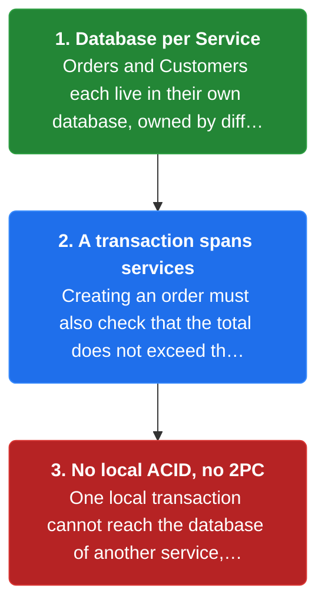
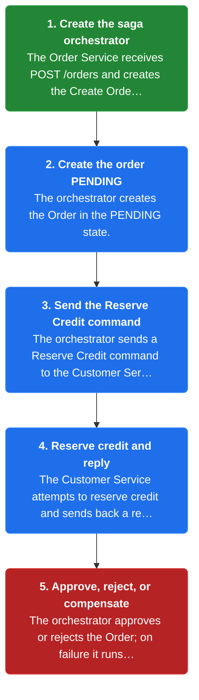
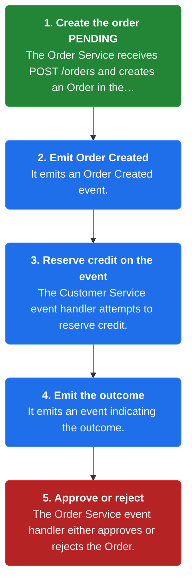
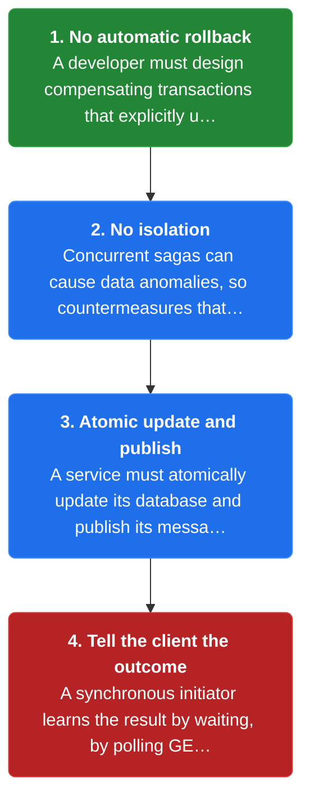

# Chapter 15: Saga

> Implement each business transaction that spans services as a sequence of local transactions, each updating its own database and publishing a message or event to trigger the next, with compensating transactions that undo earlier changes when a step fails.

_Also known as: Chris Richardson · Microservice Patterns Ch.15 (p.114) · microservices.io /patterns/data/saga.html_

## Flow

### Transactions that span services

> **Why this matters:** With Database per Service, Orders and Customers live in different databases owned by different services, so one local ACID transaction cannot both insert the order and check the credit limit. 2PC is not an option, so a different mechanism is needed for transactions that span services.



1. **Database per Service** — Orders and Customers each live in their own database, owned by different services.

2. **A transaction spans services** — Creating an order must also check that the total does not exceed the credit limit.

3. **No local ACID, no 2PC** — One local transaction cannot reach the database of another service, and two-phase commit is not an option.

```java
// ORDER SERVICE SIDE — a local ACID transaction cannot reach the credit data that lives in another service
// PARTIES: ORD = Order Service · ORDDB = Orders database · CS = Customer Service · CSDB = Customers database
// DEF: credit — the customer's spending limit owned by the Customer Service = 100.00 (the order total that must not exceed it)
// STATE (before):
//    orders : {}
//    customer_credit : {}          // owned by CS in CSDB, invisible to ORDDB
// DEF: create_order · CALLED BY: CLIENT via POST /orders
// -> order_id : "PO-2001" · -> total : 100.00
//    step 1 · BEGIN a local transaction on ORDDB (the broker and CSDB are NOT enlisted)
//    step 2 · INSERT the order   // orders : {} -> {"PO-2001":"PENDING"}
//    step 3 · try to deduct credit   // customer_credit : {} -> ERROR "no such table"  BECAUSE customers lives in CSDB, not ORDDB
//    step 4 · the UPDATE fails, so the transaction aborts   // orders : {"PO-2001":"PENDING"} -> {} (rolled back)
// <- outcome : "ROLLBACK" · the one-database transaction cannot span the two services
//    alt 2PC : would enlist ORDDB and CSDB, but 2PC is not an option BECAUSE it couples the services and can block
```

### Orchestration: an orchestrator directs the steps

> **Why this matters:** Orchestration keeps the sequence in one place: an orchestrator object tells each participant which local transaction to run next, so the happy path and every failure path are explicit and one component owns the whole saga.



1. **Create the saga orchestrator** — The Order Service receives POST /orders and creates the Create Order saga orchestrator.

2. **Create the order PENDING** — The orchestrator creates the Order in the PENDING state.

3. **Send the Reserve Credit command** — The orchestrator sends a Reserve Credit command to the Customer Service.

4. **Reserve credit and reply** — The Customer Service attempts to reserve credit and sends back a reply indicating the outcome.

5. **Approve, reject, or compensate** — The orchestrator approves or rejects the Order; on failure it runs compensating transactions that undo earlier steps.

```java
// ORDER SERVICE SIDE — an orchestrated create-order saga across three services, with a failure and full compensation
// PARTIES: CLIENT = the user · ORD = Order Service (runs the orchestrator) · CS = Customer Service · KIT = Kitchen Service
// DEF: credit — the customer's available balance a saga step reserves and releases = { "CUST-7" : 500.00 }
// STATE (before):
//    orders : {}
//    customer_credit : { "CUST-7" : 500.00 }     // available credit, owned by Customer Service
//    reserved : {}                               // sagas CS has already reserved for (idempotency guard)
//    tickets : {}                                // owned by Kitchen Service
// DEF: create-order saga orchestrator · created by ORD when CLIENT POSTs /orders
// -> order_id : "PO-2001" · -> customer_id : "CUST-7" · -> total : 100.00
//    step 1 · LT1 on ORD : create the order   // orders : {} -> {"PO-2001":"PENDING"}
//    step 2 · send ReserveCredit(saga="SAGA-1", amount=100.00) to CS
//    step 3 · LT2 on CS : if "SAGA-1" already in reserved -> skip (idempotent retry); else reserve   // reserved : {} -> {"SAGA-1"} · customer_credit : {"CUST-7":500.00} -> {"CUST-7":400.00}  BECAUSE 100.00 of the 500.00 is held
//    step 4 · CS replies "credit_reserved" -> orchestrator sends CreateTicket(order_id="PO-2001") to KIT
//    step 5 · LT3 on KIT : the ticket is rejected BECAUSE the item is not available   // tickets : {} -> {} (nothing created)
//    step 6 · KIT replies "ticket_rejected" -> the orchestrator runs the COMPENSATING transactions
//    step 7 · COMPENSATE LT2 : ReleaseCredit(saga="SAGA-1", amount=100.00) to CS   // customer_credit : {"CUST-7":400.00} -> {"CUST-7":500.00}  BECAUSE the held 100.00 is returned
//    step 8 · COMPENSATE LT1 : reject the order   // orders : {"PO-2001":"PENDING"} -> {"PO-2001":"REJECTED"}
// <- outcome : "OrderRejected" · order REJECTED, credit fully released, no ticket created
//    alt success : KIT replies "ticket_created" -> orders : {"PO-2001":"PENDING"} -> {"PO-2001":"APPROVED"} (no compensation)
//       -> a retried ReserveCredit(saga="SAGA-1") is skipped BECAUSE "SAGA-1" is already in reserved (ON CONFLICT / already-seen guard)
```

### Choreography: events trigger the next step

> **Why this matters:** Choreography distributes the sequence: each local transaction publishes a domain event that triggers the next service's local transaction, so there is no central coordinator to maintain.



1. **Create the order PENDING** — The Order Service receives POST /orders and creates an Order in the PENDING state.

2. **Emit Order Created** — It emits an Order Created event.

3. **Reserve credit on the event** — The Customer Service event handler attempts to reserve credit.

4. **Emit the outcome** — It emits an event indicating the outcome.

5. **Approve or reject** — The Order Service event handler either approves or rejects the Order.

```java
// ORDER SERVICE SIDE — choreography: each local transaction publishes a domain event that triggers the next local transaction
// PARTIES: ORD = Order Service · CS = Customer Service · BRK = the events travelling between them
// DEF: credit — the customer's available balance a saga step reserves = { "CUST-7" : 500.00 }
// DEF: event — a domain message a service publishes to trigger the next local transaction = "OrderCreated"
// STATE (before):
//    orders : {}
//    customer_credit : { "CUST-7" : 500.00 }
//    credit_events : []
// DEF: choreographed handler chain · one event carries the saga forward, no orchestrator
// -> POST /orders : total = 100.00
//    step 1 · LT1 on ORD : create the order   // orders : {} -> {"PO-2001":"PENDING"}
//    step 2 · ORD publishes "OrderCreated"   // the event triggers the next local transaction in CS
//    step 3 · CS handler receives "OrderCreated" and reserves credit   // customer_credit : {"CUST-7":500.00} -> {"CUST-7":400.00}  BECAUSE 100.00 is reserved
//    step 4 · CS publishes "CreditReserved"   // credit_events : [] -> ["CreditReserved"]
//    step 5 · ORD handler receives "CreditReserved" and approves   // orders : {"PO-2001":"PENDING"} -> {"PO-2001":"APPROVED"}
// <- outcome : order "PO-2001" APPROVED · no central coordinator — each event is the trigger for the next step
```

### Resulting context: compensation, isolation, reliability

> **Why this matters:** A saga has no automatic rollback and no ACID isolation, and a service cannot enlist both its database and the message broker in one distributed transaction. Knowing the trade-offs lets you design compensating transactions and a reliable outcome signal to the client.



1. **No automatic rollback** — A developer must design compensating transactions that explicitly undo earlier changes.

2. **No isolation** — Concurrent sagas can cause data anomalies, so countermeasures that implement isolation are needed.

3. **Atomic update and publish** — A service must atomically update its database and publish its message, using patterns such as the Transactional Outbox.

4. **Tell the client the outcome** — A synchronous initiator learns the result by waiting, by polling GET /orders/{id}, or by an event such as a webhook.

```java
// ORDER SERVICE SIDE — how a synchronous client learns the outcome of an asynchronous saga
// PARTIES: CLIENT = the user · ORD = Order Service
// STATE (before):
//    orders : { "PO-2001" : { status : "PENDING" } }
//    poll_count : 0
// DEF: client outcome for order "PO-2001" · the POST returned the id while the saga was still running
// -> GET /orders/PO-2001 : poll #1
//    step 1 · first poll   // poll_count : 0 -> 1  BECAUSE the client issued its first status query
//    step 2 · ORD returns status "PENDING"   // the saga has not finished — credit not yet reserved
//    step 3 · in the background the saga completes: credit reserved, then approved   // orders : {"PO-2001":{status:"PENDING"}} -> {"PO-2001":{status:"APPROVED"}}
// -> GET /orders/PO-2001 : poll #2
//    step 4 · second poll   // poll_count : 1 -> 2  BECAUSE the client polls again
//    step 5 · ORD returns status "APPROVED"
// <- outcome : "APPROVED" · alt = reply only when the saga completes, or push "OrderApproved" over a websocket/webhook instead of polling
```


## Key Concepts

### The Problem

**A transaction spans multiple services.** You need a mechanism to implement transactions that span multiple services, because a local ACID transaction cannot reach across databases and 2PC is not an option.


### The Solution

Implement each business transaction that spans services as a saga: a sequence of local transactions, each updating its database and publishing a message or event to trigger the next.


### Key Facts

| Fact | Detail | In the wild |
|---|---|---|
| A sequence of local transactions with compensation | Implement each business transaction that spans services as a saga: a sequence of local transactions, each updating its database and publishing a message or event to trigger the next. | Choreography (events trigger the next service) or orchestration (an orchestrator tells participants what to do). |
| No automatic rollback | A developer must design compensating transactions that explicitly undo changes made earlier in the saga, rather than relying on automatic rollback. | A rejected order releases its reserved credit and marks the order rejected. |
| No ACID isolation | The lack of isolation means concurrent execution can cause data anomalies, so a saga developer must typically use countermeasures, design techniques that implement isolation. | A second saga may read a credit balance that a first saga has reserved but not yet committed. |


### Tradeoffs & When

- A developer must design compensating transactions that explicitly undo changes made earlier in the saga, rather than relying on automatic rollback.
- The lack of isolation means concurrent execution can cause data anomalies, so a saga developer must typically use countermeasures, design techniques that implement isolation.


<details><summary>All concepts (index)</summary>

### Problem: A transaction spans multiple services

**Why.** Database per Service gives each service its own database, but a business transaction like creating an order also checks a credit limit that lives in another service.

**Claim.** You need a mechanism to implement transactions that span multiple services, because a local ACID transaction cannot reach across databases and 2PC is not an option.

**Grounding.** Orders and Customers are in different databases owned by different services, so the application cannot simply use a local ACID transaction.

**In the wild.** An e-commerce store where a new order must not exceed the credit limit of the customer.
### Solution: A sequence of local transactions with compensation

**Why.** Each step is a local transaction that only touches one database, so it stays ACID and simple.

**Claim.** Implement each business transaction that spans services as a saga: a sequence of local transactions, each updating its database and publishing a message or event to trigger the next.

**Grounding.** If a local transaction fails because it violates a business rule, the saga executes compensating transactions that undo the changes made by the preceding local transactions.

**In the wild.** Choreography (events trigger the next service) or orchestration (an orchestrator tells participants what to do).
### Tradeoff: No automatic rollback

**Why.** There is no ACID transaction manager to undo a partially completed saga.

**Claim.** A developer must design compensating transactions that explicitly undo changes made earlier in the saga, rather than relying on automatic rollback.

**Grounding.** Each step that commits must have a matching undo step, like releasing credit that was reserved.

**In the wild.** A rejected order releases its reserved credit and marks the order rejected.
### Tradeoff: No ACID isolation

**Why.** Multiple sagas and transactions run concurrently, so their intermediate states are visible to each other.

**Claim.** The lack of isolation means concurrent execution can cause data anomalies, so a saga developer must typically use countermeasures, design techniques that implement isolation.

**Grounding.** Careful analysis is needed to select and correctly implement the countermeasures.

**In the wild.** A second saga may read a credit balance that a first saga has reserved but not yet committed.

</details>


## Quiz

1. What is a saga?

   - A. A distributed transaction that uses two-phase commit across services
   - B. A sequence of local transactions, each updating its own database and publishing a message or event to trigger the next
   - C. A single database transaction that locks every table it touches
   - D. A message broker that guarantees exactly-once delivery

<details><summary>Reveal answer</summary>

**B.** A saga is a sequence of local transactions, each updating its own database and publishing a message or event to trigger the next. A is wrong because 2PC is explicitly not an option. C is wrong because a saga spans multiple databases and cannot be one local transaction. D is wrong because a saga is not a broker.

</details>

2. In an orchestration-based saga, who tells the participants what local transactions to execute?

   - A. Each service, by watching for events
   - B. A message broker routing table
   - C. An orchestrator object
   - D. A database trigger

<details><summary>Reveal answer</summary>

**C.** An orchestrator object tells the participants what local transactions to execute. A describes choreography, not orchestration. B and D are not how a saga is coordinated.

</details>

3. What happens when a local transaction fails because it violates a business rule?

   - A. The saga restarts from the first step
   - B. The saga executes a series of compensating transactions that undo the preceding local transactions
   - C. The saga retries the same transaction forever
   - D. The database rolls back all services automatically

<details><summary>Reveal answer</summary>

**B.** The saga executes compensating transactions that undo the changes made by the preceding local transactions. A and C are wrong because a saga does not restart or retry forever. D is wrong because there is no automatic rollback across services.

</details>

4. Which of these is a drawback of the saga pattern?

   - A. It requires two-phase commit
   - B. It cannot span more than two services
   - C. Lack of automatic rollback and lack of isolation
   - D. It prevents concurrent execution of transactions

<details><summary>Reveal answer</summary>

**C.** The drawbacks are lack of automatic rollback (compensating transactions must be designed) and lack of isolation (countermeasures are needed). A is wrong because 2PC is not an option. B is wrong because a saga can span many services. D is wrong because sagas run concurrently.

</details>

