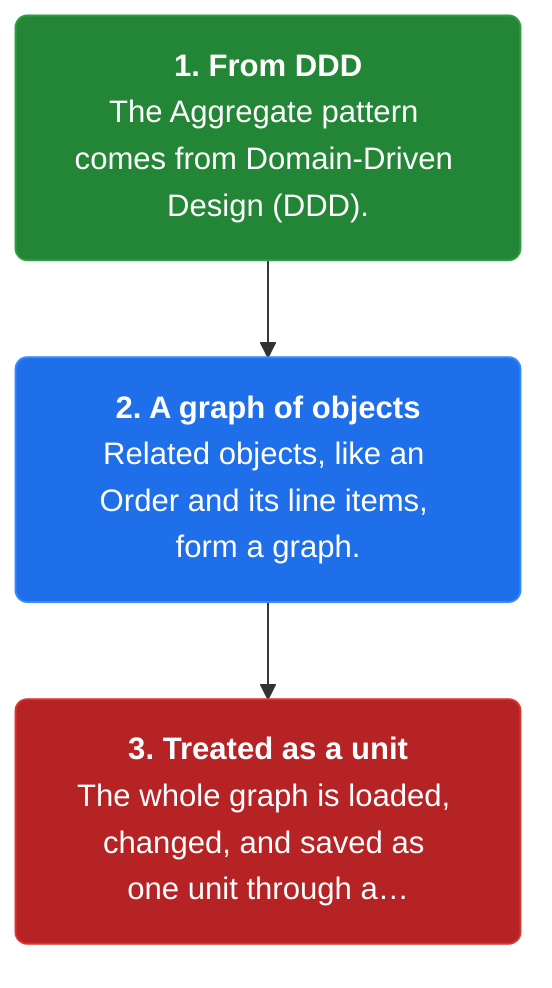
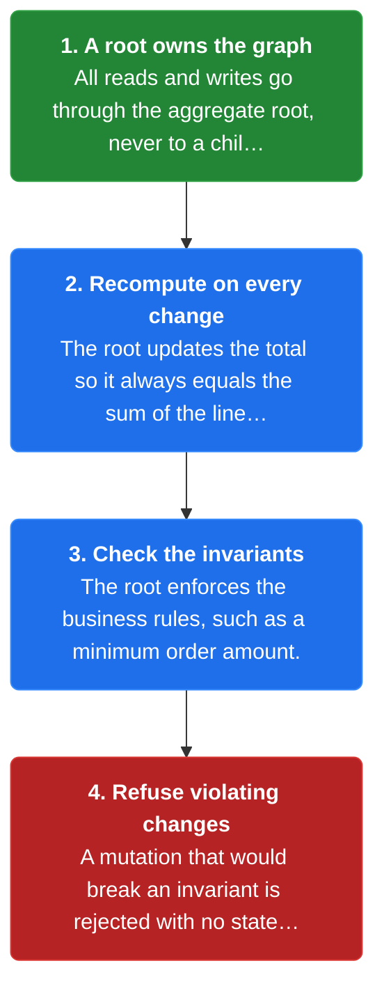
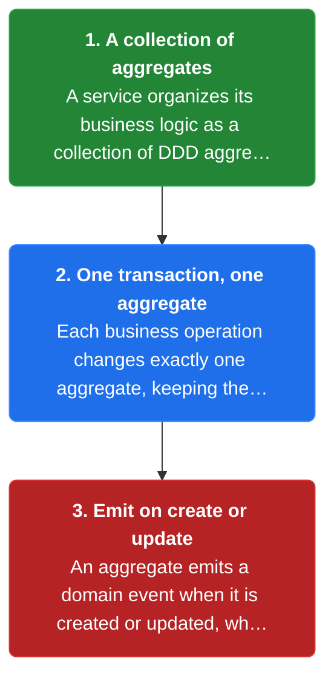

# Chapter 16: Aggregate

> A graph of objects that can be treated as a unit, forming the boundary within which business rules and invariants are enforced.

_Also known as: Chris Richardson · Microservice Patterns Ch.16 (p.150) · microservices.io /patterns/data/aggregate.html_

## Flow

### A graph of objects treated as a unit

> **Why this matters:** Domain objects come in clusters: an Order is nothing without its line items. The Aggregate pattern, from Domain-Driven Design, models such a cluster as a graph of objects that can be treated as a unit, reached by one root.



1. **From DDD** — The Aggregate pattern comes from Domain-Driven Design (DDD).

2. **A graph of objects** — Related objects, like an Order and its line items, form a graph.

3. **Treated as a unit** — The whole graph is loaded, changed, and saved as one unit through a single root.

```java
// ORDER AGGREGATE SIDE — from DDD: a graph of objects can be treated as a unit, reached by one root
// PARTIES: SVC = Order Service · AG = the Order aggregate (root Order entity + its line-item value objects)
// DEF: item — a line-item object the aggregate root owns and sums into the total = { product:"BOOK-1", price:30.00 }
// STATE (before) — two floating objects with no owning root:
//    order : { id:"PO-2001", total:0.00 }
//    item_a : { product:"BOOK-1", price:30.00 }
//    item_b : { product:"BOOK-2", price:5.00 }
// DEF: treat_as_unit · CALLED BY: SVC when it makes the objects one aggregate
// -> aggregate_root : "PO-2001"
//    step 1 · item_a hangs off the root   // item_a : {product:"BOOK-1"} -> order.items[0]  BECAUSE the root now owns it
//    step 2 · item_b hangs off the root   // item_b : {product:"BOOK-2"} -> order.items[1]  BECAUSE both children are reached through the one root
//    step 3 · the root recomputes the total over its items   // order.total : 0.00 -> 35.00  BECAUSE 30.00 + 5.00 = 35.00
// <- outcome : order : { id:"PO-2001", items:[{BOOK-1},{BOOK-2}], total:35.00 } · a graph treated as a unit
```

### Business rules and invariants at the root

> **Why this matters:** Treating the graph as a unit only pays off if the boundary is where the rules are enforced. Every change goes through the root, which re-checks the invariants and refuses any mutation that would break them.



1. **A root owns the graph** — All reads and writes go through the aggregate root, never to a child object directly.

2. **Recompute on every change** — The root updates the total so it always equals the sum of the line items.

3. **Check the invariants** — The root enforces the business rules, such as a minimum order amount.

4. **Refuse violating changes** — A mutation that would break an invariant is rejected with no state change.

```java
// ORDER AGGREGATE SIDE — the root enforces every invariant after every mutation; a violating change is refused
// PARTIES: SVC = Order Service (sole owner of this aggregate) · AG = Order aggregate (root Order entity + line-item value objects)
// STATE (before):
//    order : { id:"PO-2001", state:"NEW", items:[], total:0.00 }
//    MINIMUM : 25.00          // business rule: an order must total at least 25.00
// DEF: add_line_item · CALLED BY: SVC on the aggregate root
// -> item : { product:"BOOK-1", price:30.00, quantity:1 }
//    step 1 · root appends the item        // order.items : [] -> [{product:"BOOK-1",price:30.00,quantity:1}]
//    step 2 · root recomputes total        // order.total : 0.00 -> 30.00  BECAUSE 30.00 × 1 = 30.00
//    step 3 · invariant total >= MINIMUM : 30.00 >= 25.00 -> holds
// <- outcome : order.total : 30.00
// DEF: add_line_item (second call) · CALLED BY: SVC on the aggregate root
// -> item : { product:"BOOK-2", price:5.00, quantity:2 }
//    step 1 · root appends the item        // order.items : [{BOOK-1}] -> [{BOOK-1},{BOOK-2}]
//    step 2 · root recomputes total        // order.total : 30.00 -> 40.00  BECAUSE 30.00 + (5.00 × 2) = 40.00
//    step 3 · invariant total >= MINIMUM : 40.00 >= 25.00 -> holds
// <- outcome : order.total : 40.00
// DEF: place_order · CALLED BY: SVC when the customer confirms
// -> command : "place_order"
//    step 1 · invariant total >= MINIMUM : 40.00 >= 25.00 -> holds
//    step 2 · state transition NEW -> PLACED   // order.state : "NEW" -> "PLACED"
// <- outcome : order.state : "PLACED"
// DEF: remove_line_item · CALLED BY: SVC trying to drop BOOK-1 from a placed order
// -> item : "BOOK-1"
//    step 1 · root refuses BECAUSE state is "PLACED" (a placed order is immutable)   // order.total : 40.00 -> 40.00 (no change)
// <- outcome : order.total : 40.00 · the root rejected a mutation that would violate the state invariant
```

### Aggregates structure the business logic of a service

> **Why this matters:** An aggregate is not just a data shape — it is how a service organizes its logic. The service becomes a collection of aggregates, each one changed by its own transaction and emitting a domain event when it is created or updated.



1. **A collection of aggregates** — A service organizes its business logic as a collection of DDD aggregates.

2. **One transaction, one aggregate** — Each business operation changes exactly one aggregate, keeping the unit of consistency intact.

3. **Emit on create or update** — An aggregate emits a domain event when it is created or updated, which the service publishes.

```java
// ORDER SERVICE SIDE — the business logic is a collection of aggregates, and an aggregate emits a domain event when it changes
// PARTIES: SVC = Order Service · AG = Order aggregate · EVT = the domain event the aggregate emits
// STATE (before):
//    aggregates : { "PO-2001" : { state:"NEW", total:40.00 }, "CUST-7" : { credit:500.00 } }   // two aggregates, each with its own root
//    events : []
// DEF: place_order · CALLED BY: SVC on the Order aggregate root
// -> aggregate_id : "PO-2001"
//    step 1 · the change is routed through the root   // aggregates["PO-2001"].state : "NEW" -> "PLACED"
//    step 2 · the aggregate emits an event on update   // events : [] -> [{type:"OrderPlaced", order_id:"PO-2001"}]
//    step 3 · other aggregates are untouched by this transaction   // aggregates["CUST-7"].credit : 500.00 -> 500.00 (one transaction = one aggregate)
// <- outcome : events : [{type:"OrderPlaced", order_id:"PO-2001"}] · the service publishes these events for other services
```


## Key Concepts

### The Problem

**A graph of objects is hard to keep consistent.** Related objects need one boundary so that every change keeps them consistent with each other.


### The Solution

Model the cluster as an aggregate — a graph of objects that can be treated as a unit, with a root and the objects it owns.


### Key Facts

| Fact | Detail | In the wild |
|---|---|---|
| Aggregate: a graph treated as a unit | Model the cluster as an aggregate — a graph of objects that can be treated as a unit, with a root and the objects it owns. | The Order root owns its line items and recomputes the total after every change. |
| One root, one path for every change | Routing every change through the root means no other code can mutate a child object behind the root, but it also couples all edits to one path. | A service changes an Order only by calling the Order root, never the line items. |
| A consistency unit, not a storage unit | An aggregate delimits what one transaction may touch, so it must be sized so that each business operation changes exactly one aggregate. | Placing an Order changes only the Order aggregate, not the Customer aggregate. |


### Tradeoffs & When

- Routing every change through the root means no other code can mutate a child object behind the root, but it also couples all edits to one path.
- An aggregate delimits what one transaction may touch, so it must be sized so that each business operation changes exactly one aggregate.


<details><summary>All concepts (index)</summary>

### Problem: A graph of objects is hard to keep consistent

**Why.** Business objects come in clusters, like an Order with its line items, whose values must stay in sync.

**Claim.** Related objects need one boundary so that every change keeps them consistent with each other.

**Grounding.** The pattern comes from Domain-Driven Design and models a graph of objects that can be treated as a unit.

**In the wild.** An Order and its line items, where the total must equal the sum of the lines.
### Solution: Aggregate: a graph treated as a unit

**Why.** Reaching the whole graph through one root keeps changes to it consistent.

**Claim.** Model the cluster as an aggregate — a graph of objects that can be treated as a unit, with a root and the objects it owns.

**Grounding.** All reads and writes go through the root, so the aggregate is the unit of consistency.

**In the wild.** The Order root owns its line items and recomputes the total after every change.
### Tradeoff: One root, one path for every change

**Why.** Consistency is easy when there is a single entry point to the graph.

**Claim.** Routing every change through the root means no other code can mutate a child object behind the root, but it also couples all edits to one path.

**Grounding.** External code must not reach past the root to change a line item directly.

**In the wild.** A service changes an Order only by calling the Order root, never the line items.
### Tradeoff: A consistency unit, not a storage unit

**Why.** The boundary exists to make invariants hold, not to dictate tables.

**Claim.** An aggregate delimits what one transaction may touch, so it must be sized so that each business operation changes exactly one aggregate.

**Grounding.** The pattern is used to structure the business logic of a service into a collection of aggregates.

**In the wild.** Placing an Order changes only the Order aggregate, not the Customer aggregate.

</details>


## Quiz

1. The Aggregate pattern comes from which source?

   - A. CQRS
   - B. Domain-Driven Design (DDD)
   - C. Two-phase commit
   - D. The Transactional Outbox

<details><summary>Reveal answer</summary>

**B.** The Aggregate pattern is from Domain-Driven Design. CQRS and the Transactional Outbox are different, later patterns, and two-phase commit is unrelated to aggregates.

</details>

2. What is an aggregate?

   - A. A graph of objects that can be treated as a unit
   - B. A database transaction that spans services
   - C. A message event published to a broker
   - D. A load balancer in front of a service

<details><summary>Reveal answer</summary>

**A.** An aggregate is a graph of objects that can be treated as a unit. B, C, and D describe transactions, events, and infrastructure respectively, not an aggregate.

</details>

3. What does the Aggregate pattern do for a service?

   - A. Structures its business logic into a collection of aggregates
   - B. Publishes messages to the broker
   - C. Balances load across replicas
   - D. Caches query results

<details><summary>Reveal answer</summary>

**A.** The Aggregate pattern is used to structure the business logic of a service as a collection of aggregates. Publishing, load balancing, and caching are other concerns handled by other patterns.

</details>

4. What do aggregates do when they are created or updated?

   - A. Emit domain events
   - B. Roll back all databases
   - C. Call the API gateway
   - D. Open a socket to the client

<details><summary>Reveal answer</summary>

**A.** Aggregates emit domain events when they are created or updated. The other options are not responsibilities of an aggregate.

</details>

