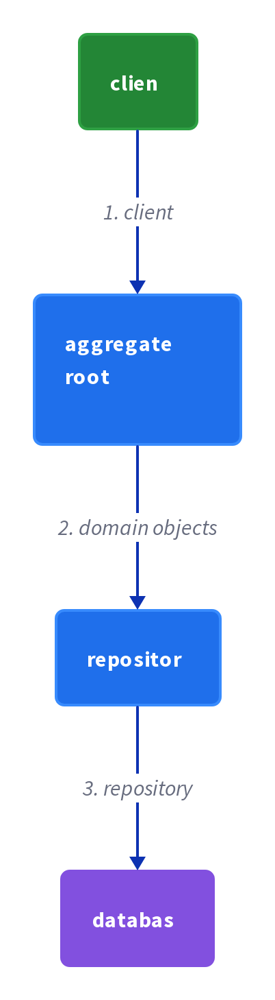

# Chapter 16: Aggregate

> A graph of objects that can be treated as a unit, forming the boundary within which business rules and invariants are enforced.

_Also known as: Chris Richardson · Microservice Patterns Ch.16 (p.150) · microservices.io /patterns/data/aggregate.html_

## Flow

### A graph of objects treated as a unit

> **Why this matters:** Domain objects come in clusters: an Order is nothing without its line items. The Aggregate pattern, from Domain-Driven Design, models such a cluster as a graph of objects that can be treated as a unit, reached by one root.

1. **From DDD** — The Aggregate pattern comes from Domain-Driven Design (DDD).

2. **A graph of objects** — Related objects, like an Order and its line items, form a graph.

3. **Treated as a unit** — The whole graph is loaded, changed, and saved as one unit through a single root.

```java
// ORDER AGGREGATE SIDE — from DDD: a graph of objects can be treated as a unit, reached by one root
// PARTIES: SVC = Order Service · AG = the Order aggregate (root Order entity + its line-item value objects)
// DEF: item — a line-item object the aggregate root owns and sums into the total = { product:"BOOK-1", price:30.00 }
// STATE (before) — two floating objects with no owning root:
//    order : { id:"PO-2001", total:0.00 }
//    item_a : { product:"BOOK-1", price:30.00 }
//    item_b : { product:"BOOK-2", price:5.00 }
// DEF: treat_as_unit · CALLED BY: SVC when it makes the objects one aggregate
// -> aggregate_root : "PO-2001"
//    step 1 · item_a hangs off the root   // item_a : {product:"BOOK-1"} -> order.items[0]  BECAUSE the root now owns it
//    step 2 · item_b hangs off the root   // item_b : {product:"BOOK-2"} -> order.items[1]  BECAUSE both children are reached through the one root
//    step 3 · the root recomputes the total over its items   // order.total : 0.00 -> 35.00  BECAUSE 30.00 + 5.00 = 35.00
// <- outcome : order : { id:"PO-2001", items:[{BOOK-1},{BOOK-2}], total:35.00 } · a graph treated as a unit
//    alt read path : a query loads the root and reads it back : query "GET /orders/PO-2001" -> returns { total:35.00 }   BECAUSE all children are reached through the one root
```

### Business rules and invariants at the root

> **Why this matters:** Treating the graph as a unit only pays off if the boundary is where the rules are enforced. Every change goes through the root, which re-checks the invariants and refuses any mutation that would break them.

1. **A root owns the graph** — All reads and writes go through the aggregate root, never to a child object directly.

2. **Recompute on every change** — The root updates the total so it always equals the sum of the line items.

3. **Check the invariants** — The root enforces the business rules, such as a minimum order amount.

4. **Refuse violating changes** — A mutation that would break an invariant is rejected with no state change.

```java
// ORDER AGGREGATE SIDE — the root enforces every invariant after every mutation; a violating change is refused
// PARTIES: SVC = Order Service (sole owner of this aggregate) · AG = Order aggregate (root Order entity + line-item value objects)
// STATE (before):
//    order : { id:"PO-2001", state:"NEW", items:[], total:0.00 }
//    MINIMUM : 25.00          // business rule: an order must total at least 25.00
// DEF: add_line_item · CALLED BY: SVC on the aggregate root
// -> item : { product:"BOOK-1", price:30.00, quantity:1 }
//    step 1 · root appends the item        // order.items : [] -> [{product:"BOOK-1",price:30.00,quantity:1}]
//    step 2 · root recomputes total        // order.total : 0.00 -> 30.00  BECAUSE 30.00 × 1 = 30.00
//    step 3 · invariant total >= MINIMUM : 30.00 >= 25.00 -> holds
// <- outcome : order.total : 30.00
// DEF: add_line_item (second call) · CALLED BY: SVC on the aggregate root
// -> item : { product:"BOOK-2", price:5.00, quantity:2 }
//    step 1 · root appends the item        // order.items : [{BOOK-1}] -> [{BOOK-1},{BOOK-2}]
//    step 2 · root recomputes total        // order.total : 30.00 -> 40.00  BECAUSE 30.00 + (5.00 × 2) = 40.00
//    step 3 · invariant total >= MINIMUM : 40.00 >= 25.00 -> holds
// <- outcome : order.total : 40.00
// DEF: place_order · CALLED BY: SVC when the customer confirms
// -> command : "place_order"
//    step 1 · invariant total >= MINIMUM : 40.00 >= 25.00 -> holds
//    step 2 · state transition NEW -> PLACED   // order.state : "NEW" -> "PLACED"
// <- outcome : order.state : "PLACED"
// DEF: remove_line_item · CALLED BY: SVC trying to drop BOOK-1 from a placed order
// -> item : "BOOK-1"
//    step 1 · root refuses BECAUSE state is "PLACED" (a placed order is immutable)   // order.total : 40.00 -> 40.00 (no change)
// <- outcome : order.total : 40.00 · the root rejected a mutation that would violate the state invariant
```

### Aggregates structure the business logic of a service

> **Why this matters:** An aggregate is not just a data shape — it is how a service organizes its logic. The service becomes a collection of aggregates, each one changed by its own transaction and emitting a domain event when it is created or updated.

1. **A collection of aggregates** — A service organizes its business logic as a collection of DDD aggregates.

2. **One transaction, one aggregate** — Each business operation changes exactly one aggregate, keeping the unit of consistency intact.

3. **Emit on create or update** — An aggregate emits a domain event when it is created or updated, which the service publishes.

```java
// ORDER SERVICE SIDE — the business logic is a collection of aggregates, and an aggregate emits a domain event when it changes
// PARTIES: SVC = Order Service · AG = Order aggregate · EVT = the domain event the aggregate emits
// STATE (before):
//    aggregates : { "PO-2001" : { state:"NEW", total:40.00 }, "CUST-7" : { credit:500.00 } }   // two aggregates, each with its own root
//    events : []
// DEF: place_order · CALLED BY: SVC on the Order aggregate root
// -> aggregate_id : "PO-2001"
//    step 1 · the change is routed through the root   // aggregates["PO-2001"].state : "NEW" -> "PLACED"
//    step 2 · the aggregate emits an event on update   // events : [] -> [{type:"OrderPlaced", order_id:"PO-2001"}]
//    step 3 · other aggregates are untouched by this transaction   // aggregates["CUST-7"].credit : 500.00 -> 500.00 (one transaction = one aggregate)
// <- outcome : events : [{type:"OrderPlaced", order_id:"PO-2001"}] · the service publishes these events for other services
```


## System Design Interview

> **The question:** Design the unit of consistency for domain objects. Premise: a client loads an aggregate root, mutates its domain objects under one transaction, and the repository persists the whole aggregate atomically.

**The pipeline:** client → aggregate root (domain objects) → repository → database



### client — calls the aggregate

_Role: client_

- Sends a command to the aggregate
- Treats the aggregate as one unit

### order aggregate root (order + line items) — the aggregate

_Role: aggregate root_

- Enforces invariants on the order
- Adds the line item and recomputes the total

### repository — the repository

_Role: repository_

- Loads the aggregate
- Persists the aggregate after the command

### PostgreSQL 16 @ orders-db-1 — the database

_Role: database_

- Stores the aggregate as one consistency boundary

```java
// SYSTEM DESIGN — aggregate as a pipeline: client -> aggregate root (domain objects) -> repository -> database (one unit of consistency per command)
// PARTIES: CLI = client (calls the aggregate) · AG = order aggregate root (order + line items) · REPO = repository · DB = PostgreSQL 16 @ orders-db-1
// DEF: orders — the aggregate's stored form; here ("PO-77", total 35.00), ("PO-2001", total 125.00)
// DEF: items — the order's line items; here [ {"BOOK-1", 25.00}, {"BOOK-2", 10.00} ]
// DEF: total — the order's running total; here 35.00 -> 60.00
// DEF: status — the command's outcome; here "none" -> "saved"
// STATE (before):
//    orders : [ ("PO-77", total 35.00), ("PO-2001", total 125.00) ]
//    items  : [ {"BOOK-1", 25.00} ]
//    total  : 35.00
//    status : "none"
// DEF: add_item · CALLED BY: CLI adding CHAIR-1 to PO-77
// -> command : {"order_id":"PO-77","item":"CHAIR-1","price":25.00}
//    step 1 · REPO loads the aggregate    status : "none" -> "loaded"   BECAUSE the repository reads order PO-77 and its line items from DB
//    step 2 · AG adds CHAIR-1    items : [{"BOOK-1",25.00}] -> [{"BOOK-1",25.00},{"CHAIR-1",25.00}]   BECAUSE the aggregate root updates its line items as one unit
//    step 3 · AG recomputes the total    total : 35.00 -> 60.00   BECAUSE the new total is the sum of all line items
//    step 4 · REPO saves the aggregate    orders : [("PO-77",total 35.00)] -> [("PO-77",total 60.00)]   BECAUSE the repository persists the changed aggregate
// <- outcome : status "saved" · order PO-77 total 35.00 -> 60.00 (one consistency boundary)
```

## Interview Questions

### Q1

Your Order and its line items live as separate objects, and every time a line changes some other code must remember to recompute the total. You want to treat Order plus its line items as one thing.

**Interviewer's question:** What is an aggregate, and how does a root turn a graph of objects into a unit?

**Solution:** An aggregate is a graph of objects treated as a unit, reached through one root that owns the others; all reads and writes go through the root.

**System-design components:**
- Order — the aggregate root
- Line items — child objects owned by the root
- Total — recomputed from the lines
- Root — the single entry point

```java
// ORDER AGGREGATE SIDE — from DDD: a graph of objects can be treated as a unit, reached by one root
// PARTIES: SVC = Order Service · AG = the Order aggregate (root Order entity + its line-item value objects)
// DEF: item — a line-item object the aggregate root owns and sums into the total = { product:"BOOK-1", price:30.00 }
// STATE (before) — two floating objects with no owning root:
//    order : { id:"PO-77", total:0.00 }
//    item_a : { product:"BOOK-1", price:30.00 }
//    item_b : { product:"BOOK-2", price:5.00 }
// DEF: treat_as_unit · CALLED BY: SVC when it makes the objects one aggregate
// -> aggregate_root : "PO-77"
//    step 1 · item_a hangs off the root : item_a : {product:"BOOK-1"} -> order.items[0]   BECAUSE the root now owns it
//    step 2 · item_b hangs off the root : item_b : {product:"BOOK-2"} -> order.items[1]   BECAUSE both children are reached through the one root
//    step 3 · the root recomputes the total : order.total : 0.00 -> 35.00   BECAUSE 30.00 + 5.00 = 35.00
// <- outcome : order : { id:"PO-77", items:[{BOOK-1},{BOOK-2}], total:35.00 } · a graph treated as a unit
```

_This is the Aggregate — a graph of objects treated as a unit through a single root._

_Covers:_ A graph of objects treated as a unit

_From the 28 problems:_ 26-payment-system · 22-hotel-reservation

### Q2

Your order must never exceed a maximum total, and the cap must hold after every edit. You want every rule checked in one place so a bad change is refused.

**Interviewer's question:** How does the aggregate root enforce business rules and invariants on every change?

**Solution:** Every mutation goes through the root, which recomputes dependent state and checks invariants, refusing any change that would break them.

**System-design components:**
- Root — the only path for mutations
- Invariant — e.g. total <= cap
- Recompute — total from line items
- Refusal — rejecting a violating change

```java
// ORDER AGGREGATE SIDE — the root re-checks invariants after each mutation and refuses a violating change
// PARTIES: SVC = Order Service (sole owner) · AG = Order aggregate
// DEF: cap — the maximum order total the root enforces = 100.00
// STATE (before):
//    order : { id:"PO-77", state:"NEW", items:[], total:0.00 }
// DEF: add_line_item · CALLED BY: SVC on the root
// -> item : { product:"CHAIR-1", price:60.00, quantity:1 }
//    step 1 · root appends the item : order.items : [] -> [{product:"CHAIR-1",price:60.00,quantity:1}]
//    step 2 · root recomputes total : order.total : 0.00 -> 60.00   BECAUSE 60.00 x 1 = 60.00
//    step 3 · check total <= cap : 60.00 <= 100.00 -> holds
// <- outcome : order.total : 60.00
// DEF: add_line_item (second call) · CALLED BY: SVC on the root
// -> item : { product:"DESK-2", price:50.00, quantity:1 }
//    step 1 · root appends the item : order.items : [{CHAIR-1}] -> [{CHAIR-1},{DESK-2}]
//    step 2 · root recomputes total : order.total : 60.00 -> 110.00   BECAUSE 60.00 + 50.00 = 110.00
//    step 3 · check total <= cap : 110.00 <= 100.00 -> VIOLATED
//    step 4 · root refuses the change : order.items : [{CHAIR-1},{DESK-2}] -> [{CHAIR-1}] · order.total : 110.00 -> 60.00   BECAUSE the mutation that broke the cap is rejected
// <- outcome : order.total : 60.00 · the root refused a change that would exceed the 100.00 cap
```

_This is the Aggregate enforcing invariants at the root — a violating mutation is refused with no state change._

_Covers:_ Business rules and invariants at the root

_From the 28 problems:_ 26-payment-system · 22-hotel-reservation

### Q3

Your service holds two aggregates — Order and Customer — and you want a downstream service to react every time an order is placed, without touching the Customer aggregate.

**Interviewer's question:** How do aggregates structure a service's business logic, and what happens when one is created or updated?

**Solution:** The service is a collection of aggregates; each business operation changes exactly one aggregate, and that aggregate emits a domain event when created or updated.

**System-design components:**
- Order aggregate — changes on place
- Customer aggregate — untouched by the order write
- Domain event — emitted on update
- One transaction — one aggregate

```java
// ORDER SERVICE SIDE — the business logic is a collection of aggregates, and an aggregate emits a domain event when it changes
// PARTIES: SVC = Order Service · AG = Order aggregate · EVT = the domain event the aggregate emits
// STATE (before):
//    aggregates : { "PO-77" : { state:"NEW", total:40.00 }, "CUST-7" : { credit:500.00 } }   // two aggregates, each with its own root
//    events : []
// DEF: place_order · CALLED BY: SVC on the Order aggregate root
// -> aggregate_id : "PO-77"
//    step 1 · the change is routed through the root : aggregates["PO-77"].state : "NEW" -> "PLACED"
//    step 2 · the aggregate emits an event on update : events : [] -> [{type:"OrderPlaced", order_id:"PO-77"}]
//    step 3 · other aggregates are untouched by this transaction : aggregates["CUST-7"].credit : 500.00 -> 500.00 (one transaction = one aggregate)
// <- outcome : events : [{type:"OrderPlaced", order_id:"PO-77"}] · the service publishes these events for other services
```

_This is the Aggregate structuring a service — one transaction per aggregate, emitting a domain event on change._

_Covers:_ Aggregates structure the business logic of a service

_From the 28 problems:_ 26-payment-system · 22-hotel-reservation

### Q4

A developer wants to bump a line item's quantity directly, bypassing the Order root, because it is just one field. You want to explain why that path must not exist.

**Interviewer's question:** Why must every change to an aggregate go through its root, and what does that say about how to size an aggregate?

**Solution:** Routing every change through the root is what keeps invariants enforced and children consistent; the aggregate is sized so each business operation changes exactly one aggregate, never a child directly.

**System-design components:**
- Root — the only mutation path
- Child objects — not addressable from outside
- Invariant — enforced only at the root
- Sizing — one operation, one aggregate

```java
// ORDER AGGREGATE SIDE — every mutation must go through the root; reaching a child directly is refused
// PARTIES: SVC = Order Service · AG = Order aggregate
// DEF: child — a line item owned by the root = order.items[0] = { product:"BOOK-1", qty:2, unit:25.00 }
// STATE (before):
//    order : { id:"PO-77", state:"NEW", items:[{product:"BOOK-1",qty:2,unit:25.00}], total:50.00 }
// DEF: change_qty_via_root · CALLED BY: SVC calling order.revise("BOOK-1", 5)
// -> newQty : 5
//    step 1 · root validates and mutates its own child : order.items[0].qty : 2 -> 5
//    step 2 · root recomputes the total : order.total : 50.00 -> 125.00   BECAUSE 5 x 25.00 = 125.00
// <- outcome : order.total : 125.00 · the invariant stayed enforced because the root did the change
// DEF: change_qty_direct · CALLED BY: SVC trying order.items[0].qty = 9 directly (bypassing the root)
// -> newQty : 9
//    step 1 · the child is mutated behind the root : order.items[0].qty : 5 -> 9
//    step 2 · no root call runs, so the total is not recomputed : order.total : 125.00 -> 125.00   BECAUSE the root never saw the change
// <- outcome : order.total : 125.00 but the lines now sum to 225.00 — the graph is inconsistent BECAUSE the mutation skipped the root
```

_This is the Aggregate's single-path rule — the root is the only entry point, which is why direct child edits break consistency._

_Covers:_ Business rules and invariants at the root

_From the 28 problems:_ 26-payment-system · 22-hotel-reservation

## Key Concepts

### The Problem

**A graph of objects is hard to keep consistent.** Related objects need one boundary so that every change keeps them consistent with each other.


### The Solution

Model the cluster as an aggregate — a graph of objects that can be treated as a unit, with a root and the objects it owns.

```java
// ORDER AGGREGATE SIDE — from DDD: a graph of objects can be treated as a unit, reached by one root
// PARTIES: SVC = Order Service · AG = the Order aggregate (root Order entity + its line-item value objects)
// DEF: item — a line-item object the aggregate root owns and sums into the total = { product:"BOOK-1", price:30.00 }
// STATE (before) — two floating objects with no owning root:
//    order : { id:"PO-77", total:0.00 }
//    item_a : { product:"BOOK-1", price:30.00 }
//    item_b : { product:"BOOK-2", price:5.00 }
// DEF: treat_as_unit · CALLED BY: SVC when it makes the objects one aggregate
// -> aggregate_root : "PO-77"
//    step 1 · item_a hangs off the root : item_a : {product:"BOOK-1"} -> order.items[0]   BECAUSE the root now owns it
//    step 2 · item_b hangs off the root : item_b : {product:"BOOK-2"} -> order.items[1]   BECAUSE both children are reached through the one root
//    step 3 · the root recomputes the total : order.total : 0.00 -> 35.00   BECAUSE 30.00 + 5.00 = 35.00
// <- outcome : order : { id:"PO-77", items:[{BOOK-1},{BOOK-2}], total:35.00 } · a graph treated as a unit
```


### Key Facts

| Fact | Detail | In the wild |
|---|---|---|
| Aggregate: a graph treated as a unit | Model the cluster as an aggregate — a graph of objects that can be treated as a unit, with a root and the objects it owns. | The Order root owns its line items and recomputes the total after every change. |
| One root, one path for every change | Routing every change through the root means no other code can mutate a child object behind the root, but it also couples all edits to one path. | A service changes an Order only by calling the Order root, never the line items. |
| A consistency unit, not a storage unit | An aggregate delimits what one transaction may touch, so it must be sized so that each business operation changes exactly one aggregate. | Placing an Order changes only the Order aggregate, not the Customer aggregate. |


### Tradeoffs & When

- Routing every change through the root means no other code can mutate a child object behind the root, but it also couples all edits to one path.
- An aggregate delimits what one transaction may touch, so it must be sized so that each business operation changes exactly one aggregate.


<details><summary>All concepts (index)</summary>

### Problem: A graph of objects is hard to keep consistent

**Why.** Business objects come in clusters, like an Order with its line items, whose values must stay in sync.

**Claim.** Related objects need one boundary so that every change keeps them consistent with each other.

**Grounding.** The pattern comes from Domain-Driven Design and models a graph of objects that can be treated as a unit.

**In the wild.** An Order and its line items, where the total must equal the sum of the lines.
### Solution: Aggregate: a graph treated as a unit

**Why.** Reaching the whole graph through one root keeps changes to it consistent.

**Claim.** Model the cluster as an aggregate — a graph of objects that can be treated as a unit, with a root and the objects it owns.

**Grounding.** All reads and writes go through the root, so the aggregate is the unit of consistency.

**In the wild.** The Order root owns its line items and recomputes the total after every change.
### Tradeoff: One root, one path for every change

**Why.** Consistency is easy when there is a single entry point to the graph.

**Claim.** Routing every change through the root means no other code can mutate a child object behind the root, but it also couples all edits to one path.

**Grounding.** External code must not reach past the root to change a line item directly.

**In the wild.** A service changes an Order only by calling the Order root, never the line items.
### Tradeoff: A consistency unit, not a storage unit

**Why.** The boundary exists to make invariants hold, not to dictate tables.

**Claim.** An aggregate delimits what one transaction may touch, so it must be sized so that each business operation changes exactly one aggregate.

**Grounding.** The pattern is used to structure the business logic of a service into a collection of aggregates.

**In the wild.** Placing an Order changes only the Order aggregate, not the Customer aggregate.

</details>


## Quiz

1. The Aggregate pattern comes from which source?

   - A. CQRS
   - B. Domain-Driven Design (DDD)
   - C. Two-phase commit
   - D. The Transactional Outbox

<details><summary>Reveal answer</summary>

**B.** The Aggregate pattern is from Domain-Driven Design. CQRS and the Transactional Outbox are different, later patterns, and two-phase commit is unrelated to aggregates.

</details>

2. What is an aggregate?

   - A. A graph of objects that can be treated as a unit
   - B. A database transaction that spans services
   - C. A message event published to a broker
   - D. A load balancer in front of a service

<details><summary>Reveal answer</summary>

**A.** An aggregate is a graph of objects that can be treated as a unit. B, C, and D describe transactions, events, and infrastructure respectively, not an aggregate.

</details>

3. What does the Aggregate pattern do for a service?

   - A. Structures its business logic into a collection of aggregates
   - B. Publishes messages to the broker
   - C. Balances load across replicas
   - D. Caches query results

<details><summary>Reveal answer</summary>

**A.** The Aggregate pattern is used to structure the business logic of a service as a collection of aggregates. Publishing, load balancing, and caching are other concerns handled by other patterns.

</details>

4. What do aggregates do when they are created or updated?

   - A. Emit domain events
   - B. Roll back all databases
   - C. Call the API gateway
   - D. Open a socket to the client

<details><summary>Reveal answer</summary>

**A.** Aggregates emit domain events when they are created or updated. The other options are not responsibilities of an aggregate.

</details>

