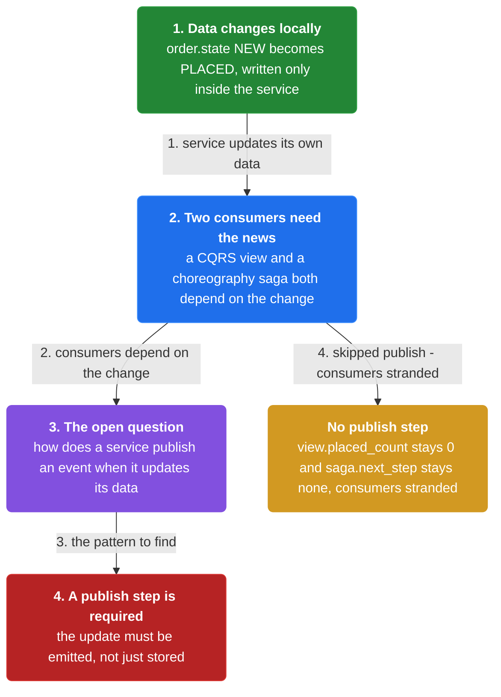
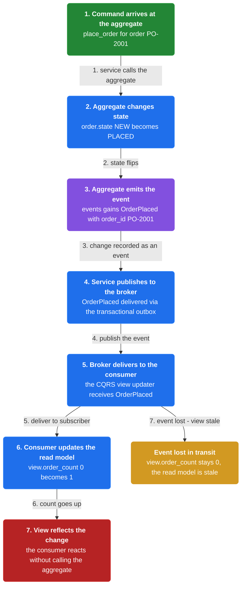
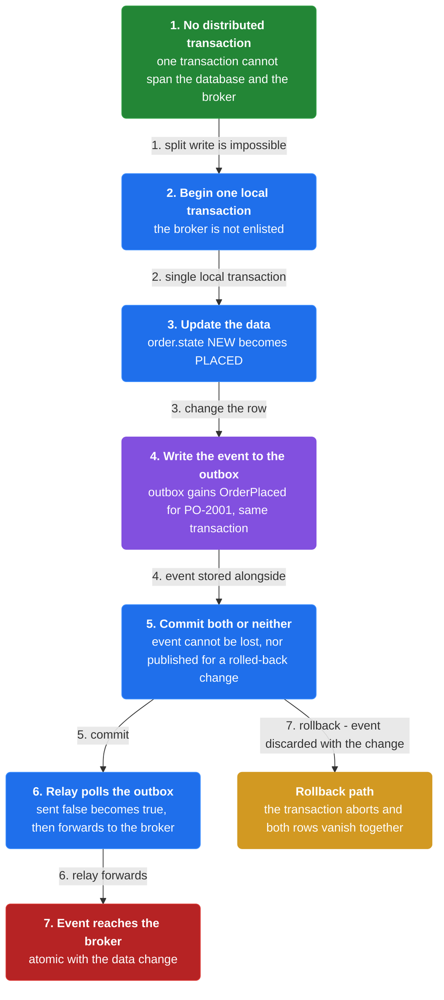

# Chapter 17: Domain Event

> Organize the business logic of a service as a collection of DDD aggregates that emit domain events when created or updated, and publish those events for other services to consume.

_Also known as: Chris Richardson · Microservice Patterns Ch.17 (p.160) · microservices.io /patterns/data/domain-event.html_

## Flow

### The need: publish when data changes

> **Why this matters:** A service often needs to publish events when it updates its data — to keep a CQRS view fresh or to participate in a choreography-based saga. Without a publish step, an update is invisible to the consumers that need it.



1. **Data changes silently** — A service updates its own data, but the update is local to that service.

2. **Consumers need to know** — Events may be needed to update a CQRS view or to coordinate a choreography-based saga.

3. **The open question** — How does a service publish an event when it updates its data?

```java
// ORDER SERVICE SIDE — the problem the pattern solves: data changes, but the consumers that need to know are never told
// PARTIES: SVC = Order Service (writes) · VIEW = a CQRS read model · SAGA = a choreography-based saga coordinated via events
// STATE (before):
//    order : { id:"PO-2001", state:"NEW" }
//    view : { placed_count : 0 }
//    saga : { next_step : "none" }
// DEF: place_order_without_publish · CALLED BY: SVC
// -> command : "place_order"
//    step 1 · SVC writes its own data locally   // order.state : "NEW" -> "PLACED"
//    step 2 · the CQRS view is not notified and stays stale   // view.placed_count : 0 -> 0
//    step 3 · the saga is not triggered and never advances   // saga.next_step : "none" -> "none"
// <- outcome : order.state : "PLACED" · but every consumer still sees the old state, so the service needs a way to publish events when it updates data
```

### Aggregates emit domain events

> **Why this matters:** The solution puts the event at the source of the change: DDD aggregates emit a domain event when they are created or updated, and the service publishes it so other services can consume it.



1. **Aggregates hold the business logic** — The business logic of a service is organized as a collection of DDD aggregates.

2. **Emit on create or update** — An aggregate emits a domain event when it is created or updated.

3. **Publish for consumers** — The service publishes the domain events so they can be consumed by other services.

```java
// ORDER SERVICE SIDE — an aggregate emits a domain event when it changes, and a consumer reacts to it
// PARTIES: AG = Order aggregate (in Order Service) · BRK = message broker · CSVC = the consuming service (a CQRS view updater)
// STATE (before):
//    order : { id:"PO-2001", state:"NEW" }
//    events : []            // domain events the aggregate has emitted
//    view : { order_count : 0 }   // a CQRS read model owned by the consumer
// DEF: place_order · CALLED BY: the service on the aggregate
// -> command : "place_order"
//    step 1 · aggregate changes state   // order.state : "NEW" -> "PLACED"
//    step 2 · aggregate emits an event   // events : [] -> [{type:"OrderPlaced", order_id:"PO-2001"}]
//    step 3 · service publishes "OrderPlaced" to BRK (via transactional outbox, same database transaction)
// <- output : event "OrderPlaced" { order_id:"PO-2001" } published
// DEF: consume · CALLED BY: the consumer's event handler when BRK delivers "OrderPlaced"
// -> event : { type:"OrderPlaced", order_id:"PO-2001" }
//    step 1 · handler updates the read model   // view : { order_count : 0 } -> { order_count : 1 }  BECAUSE one more order was placed
// <- outcome : view.order_count : 1 · the CQRS view now reflects the aggregate's change, without the consumer calling the aggregate
```

### Publish atomically with the data change

> **Why this matters:** Publishing must not lose the event or emit it for a change that rolled back. Because a service cannot enlist both its database and the broker in one distributed transaction, it uses the Transactional Outbox to write the event in the same transaction as the data.



1. **No distributed transaction** — A service cannot span one transaction across its database and the message broker.

2. **Write the event in-transaction** — The Transactional Outbox stores the event in the same local transaction as the data update.

3. **Relay publishes later** — A separate process publishes the outbox rows to the broker after the commit.

```java
// ORDER SERVICE SIDE — publishing reliably: the event is written to the outbox in the SAME transaction as the data change
// PARTIES: SVC = Order Service · DB = its database · BRK = the message broker
// STATE (before):
//    order : { id:"PO-2001", state:"NEW" }
//    outbox : []
// DEF: place_order_and_publish · CALLED BY: SVC
// -> command : "place_order"
//    step 1 · begin one local transaction on DB (the broker is NOT enlisted — no distributed transaction)
//    step 2 · update the data   // order.state : "NEW" -> "PLACED"
//    step 3 · write the event to the outbox in the same transaction   // outbox : [] -> [{event:"OrderPlaced", order_id:"PO-2001"}]
//    step 4 · COMMIT -> both rows durable or neither, so the event cannot be lost or published for a rolled-back change
//    step 5 · a relay later polls the outbox and marks the row sent   // outbox : [{event:"OrderPlaced",sent:false}] -> [{event:"OrderPlaced",sent:true}]
// <- outcome : event "OrderPlaced" published to BRK, atomically coupled to the data update
```


## Key Concepts

### The Problem

**A service changes data, but others need to know.** Those events might be needed to update a CQRS view, or to let the service participate in a choreography-based saga that uses events for coordination.


### The Solution

Organize the business logic of a service as a collection of DDD aggregates that emit domain events when they are created or updated.


### Key Facts

| Fact | Detail | In the wild |
|---|---|---|
| Aggregates emit events on create or update | Organize the business logic of a service as a collection of DDD aggregates that emit domain events when they are created or updated. | The Order aggregate emits OrderPlaced, and the service publishes it. |
| Events are asynchronous and eventually consistent | The read side catches up asynchronously, so a CQRS view is briefly stale after the event is emitted. | A view updated by a consumer shows the new count only after the event is delivered. |
| Publishing must be atomic with the change | A service cannot enlist both its database and the broker in one distributed transaction, so it must use the Transactional Outbox to publish events as part of the database transaction. | The outbox row is written in the same transaction as the order update, then relayed to the broker. |


### Tradeoffs & When

- The read side catches up asynchronously, so a CQRS view is briefly stale after the event is emitted.
- A service cannot enlist both its database and the broker in one distributed transaction, so it must use the Transactional Outbox to publish events as part of the database transaction.


<details><summary>All concepts (index)</summary>

### Problem: A service changes data, but others need to know

**Why.** A service often needs to publish events when it updates its data.

**Claim.** Those events might be needed to update a CQRS view, or to let the service participate in a choreography-based saga that uses events for coordination.

**Grounding.** Without a publish step, an update stays local and the consumers never learn of it.

**In the wild.** A placed order that a read model must count, or a saga step that the next service must run.
### Solution: Aggregates emit events on create or update

**Why.** The aggregate is the unit that changes, so it is the natural place to record the change.

**Claim.** Organize the business logic of a service as a collection of DDD aggregates that emit domain events when they are created or updated.

**Grounding.** The service publishes these domain events so that they can be consumed by other services.

**In the wild.** The Order aggregate emits OrderPlaced, and the service publishes it.
### Tradeoff: Events are asynchronous and eventually consistent

**Why.** A consumer reacts to a published event later, not inside the write.

**Claim.** The read side catches up asynchronously, so a CQRS view is briefly stale after the event is emitted.

**Grounding.** The event is published so other services can consume it — consumption is decoupled from the update.

**In the wild.** A view updated by a consumer shows the new count only after the event is delivered.
### Tradeoff: Publishing must be atomic with the change

**Why.** An event emitted for a rolled-back change is a lie, and a lost event breaks the consumers.

**Claim.** A service cannot enlist both its database and the broker in one distributed transaction, so it must use the Transactional Outbox to publish events as part of the database transaction.

**Grounding.** Event sourcing is sometimes used instead to publish domain events.

**In the wild.** The outbox row is written in the same transaction as the order update, then relayed to the broker.

</details>


## Quiz

1. When does a service need to publish events?

   - A. Only when it shuts down
   - B. When it updates its data
   - C. Only during deployment
   - D. When it has no consumers

<details><summary>Reveal answer</summary>

**B.** A service often needs to publish events when it updates its data, for example to update a CQRS view or coordinate a saga. The other options are not the trigger for publishing.

</details>

2. What emits the domain events?

   - A. DDD aggregates, when they are created or updated
   - B. The message broker
   - C. The API gateway
   - D. The database schema

<details><summary>Reveal answer</summary>

**A.** DDD aggregates emit domain events when they are created or updated; the service then publishes them. The broker only carries the events, and the gateway and schema do not emit domain events.

</details>

3. Which patterns create the need for the Domain Event pattern?

   - A. Saga and CQRS
   - B. Service mesh and sidecar
   - C. Health check and audit logging
   - D. Circuit breaker and access token

<details><summary>Reveal answer</summary>

**A.** The Saga and CQRS patterns create the need for domain events: CQRS needs events to update views, and a choreography-based saga uses events for coordination. The others do not require domain events.

</details>

4. Which pattern publishes events as part of a database transaction?

   - A. Transactional Outbox
   - B. Client-side discovery
   - C. Self-registration
   - D. Serverless deployment

<details><summary>Reveal answer</summary>

**A.** The Transactional Outbox pattern publishes events as part of the database transaction, so the event and the data change commit or roll back together. The others are unrelated to event publishing.

</details>

