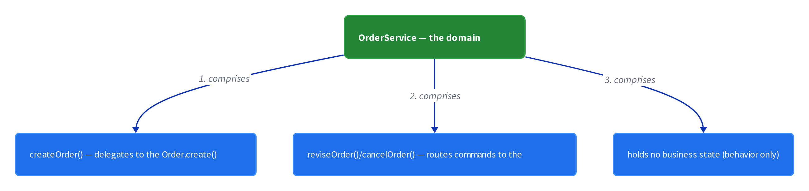
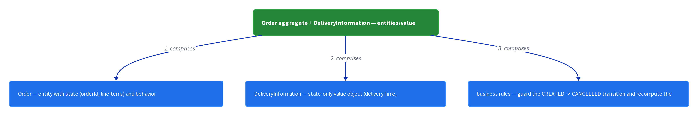
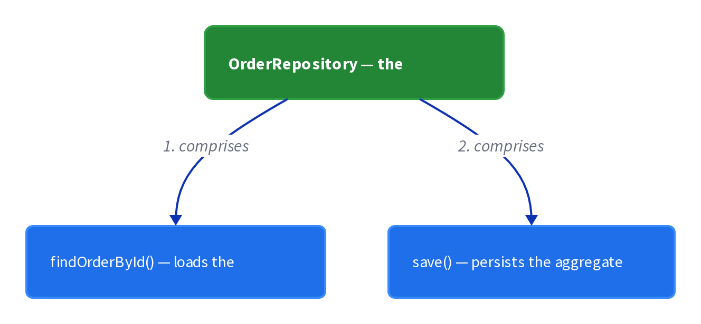
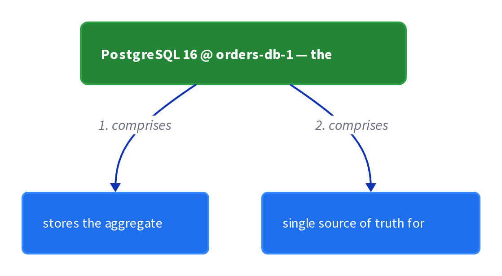

# Chapter 18: Domain Model

> Organize the business logic as an object model consisting of classes that have state and behavior.

_Also known as: Chris Richardson · Microservice Patterns Ch.5 · microservices.io /patterns/decomposition/domain-model.html_

## Flow

### Model the domain, not the procedure

> **Why this matters:** Writing one script per request skips class design entirely, but the moment the logic gets complex those scripts grow into an unmaintainable tangle — the same way a monolith keeps growing. An object model keeps each piece of logic attached to the concept it governs.

1. **Resist the procedural default** — A script per request only works while logic stays simple; its classes split behavior from state and rely on few OOP capabilities.

2. **Build a network of small classes** — Each class corresponds directly to a concept from the problem domain, not to a database table or a request.

3. **Let a class own both state and behavior** — Most classes hold state and the methods that change it — the hallmark of a well-designed class.

4. **Delegate from thin service classes** — OrderService still exposes create/revise/cancel, but it forwards to the aggregate rather than doing the work itself.

```java
// DOMAIN MODEL SIDE — a factory method constructs an aggregate that owns both its data and its behavior
// PARTIES: SVC = OrderService (behavior only) · REPO = OrderRepository (behavior only) · DI = DeliveryInformation (state only)
// STATE (before):
//    order : { orderId:null, status:"CREATED", lineItems:[], total:0.00 }   // empty aggregate the factory will populate
// DEF: Order.create · CALLED BY: SVC.createOrder() delegating to the static factory on the class
// -> orderId : "PO-100" · -> lineItems : [{sku:"S1", qty:2, unit:25.00}]
//    step 1 · copy identity : order.orderId : null -> "PO-100"   BECAUSE the factory writes the command id onto the object
//    step 2 · attach the lines : order.lineItems : [] -> [{sku:"S1",qty:2,unit:25.00}]
//    step 3 · compute the total : order.total : 0.00 -> 50.00   BECAUSE 2 lines x 25.00 per unit = 50.00
// <- order : { orderId:"PO-100", status:"CREATED", lineItems:[{sku:"S1",qty:2,unit:25.00}], total:50.00 }
//    alt empty order : lineItems = [] -> create() returns an Order with total 0.00 and no lines
```

### Encapsulate behavior with the state it changes

> **Why this matters:** When behavior sits in a stateless script, the script must reach into the object's fields to change them, so every rule about those fields gets duplicated wherever the object is used. Moving the method onto the object keeps the rule in one place.

1. **Put the mutation on the object** — A method such as revise() lives on Order, not in OrderService.

2. **Check the invariant first** — The method tests its own status before touching its data, so invalid transitions are impossible from outside.

3. **Re-derive dependent state** — After mutating a line item, the aggregate recomputes the total from its own lines.

```java
// ORDER AGGREGATE SIDE — a behavior method mutates only the state it owns, after checking its own invariant
// PARTIES: SVC = OrderService (delegates only) · REPO = OrderRepository (persists the aggregate)
// STATE (before):
//    guard : false                                // the method's precondition, not yet evaluated
//    order : { orderId:"PO-100", status:"CREATED", lineItems:[{sku:"S1",qty:2,unit:25.00}], total:50.00 }
// DEF: revise · CALLED BY: SVC.reviseOrder(orderId, newQty) — the service hands the command to the aggregate
// -> newQty : 5
//    step 1 · evaluate the invariant : guard : false -> true   BECAUSE status "CREATED" is not "CANCELLED", so revision is allowed
//    step 2 · mutate the line : order.lineItems[0].qty : 2 -> 5
//    step 3 · re-derive the total : order.total : 50.00 -> 125.00   BECAUSE the aggregate recomputes 5 x 25.00 = 125.00 from its own lines
// <- order : { orderId:"PO-100", status:"CREATED", lineItems:[{sku:"S1",qty:5,unit:25.00}], total:125.00 }
//    alt revise a cancelled order : status "CANCELLED" fails step 1 -> no mutation, order stays at total 50.00
```

### Guard life-cycle transitions inside the method

> **Why this matters:** A state machine that lives in a script can be bypassed by any caller that sets a field directly. A method like cancel() owns the transition, so the valid from-state and the resulting state are enforced in one place.

1. **Name the valid transition** — cancel() is only valid from the CREATED state, and the method checks it.

2. **Transition the aggregate state** — The method flips status CREATED to CANCELLED itself.

3. **Make invalid calls fail fast** — Calling cancel() on an already-cancelled order throws, leaving the object untouched.

```java
// ORDER AGGREGATE SIDE — a lifecycle method transitions the object between its own states, guarding the transition
// PARTIES: SVC = OrderService (routes the command) · REPO = OrderRepository (loads and saves the aggregate)
// STATE (before):
//    guard : false
//    order : { orderId:"PO-100", status:"CREATED", lineItems:[{sku:"S1",qty:5,unit:25.00}], total:125.00 }
//    store : {}                                    // what OrderRepository.save persists to
// DEF: cancel · CALLED BY: SVC.cancelOrder(orderId) — the service locates the aggregate and invokes its behavior
// -> orderId : "PO-100"
//    step 1 · check the transition : guard : false -> true   BECAUSE cancel is valid only from status "CREATED"
//    step 2 · transition the state : order.status : "CREATED" -> "CANCELLED"
//    step 3 · persist the aggregate : store : {} -> { "PO-100": {status:"CANCELLED", total:125.00} }   BECAUSE REPO.save writes the object back
// <- order : { orderId:"PO-100", status:"CANCELLED", lineItems:[{sku:"S1",qty:5,unit:25.00}], total:125.00 }
//    alt already cancelled : status "CANCELLED" fails step 1 -> the method throws, and the object is left unchanged
```

### Mix state-only, behavior-only, and both

> **Why this matters:** Not every concept deserves the full object treatment, and forcing it adds ceremony. The domain model deliberately mixes three kinds of classes so value-like data stays dumb while the aggregate owns its transitions.

1. **Keep value objects as state only** — DeliveryInformation holds deliveryTime and deliveryAddress and no behavior.

2. **Keep repositories as behavior only** — OrderRepository exposes findOrderById() and holds no business state.

3. **Let the aggregate hold both** — Order carries orderId and orderLineItems plus create(), revise() and cancel().

```java
// DOMAIN MODEL SIDE — three class roles cooperate on one request: state-only, behavior-only, and both
// PARTIES: SVC = OrderService (behavior only) · REPO = OrderRepository (behavior only) · DI = DeliveryInformation (state only)
// STATE (before):
//    orders : { "PO-100": { orderId:"PO-100", status:"CREATED", lineItems:[{sku:"S1",qty:2,unit:25.00}], total:50.00 } }
//    DI : { deliveryTime:null, deliveryAddress:null }       // a state-only value object, not yet filled
// DEF: REPO.findOrderById · CALLED BY: SVC before invoking a behavior — a behavior-only class with no fields of its own
// -> orderId : "PO-100"
//    step 1 · look up the aggregate : found : false -> true   BECAUSE orders contains the key "PO-100"
//    step 2 · return it : result : null -> { orderId:"PO-100", status:"CREATED", lineItems:[{sku:"S1",qty:2,unit:25.00}], total:50.00 }
// <- order : { orderId:"PO-100", status:"CREATED", lineItems:[{sku:"S1",qty:2,unit:25.00}], total:50.00 }
//
// DEF: DI · a state-only class — filled with the request's delivery values, and it has no methods
// -> deliveryTime : "2026-09-21 09:00" · -> deliveryAddress : "12 Main St"
//    step 1 · hold the time : DI.deliveryTime : null -> "2026-09-21 09:00"
//    step 2 · hold the address : DI.deliveryAddress : null -> "12 Main St"
// <- DI : { deliveryTime:"2026-09-21 09:00", deliveryAddress:"12 Main St" }
```


## System Design Interview

> **The question:** Design business logic around domain objects. Premise: a client calls a domain service, which mutates entities and value objects (Order plus DeliveryInformation) and persists them through a repository, so rules live with the data.

**The pipeline:** client → domain service → entities/value objects → repository → database

### OrderService — the domain service

_Role: domain service_



### Order aggregate + DeliveryInformation — entities/value objects

_Role: entities/value objects_



### OrderRepository — the repository

_Role: repository_



### PostgreSQL 16 @ orders-db-1 — the database

_Role: database_



```java
// SYSTEM DESIGN — domain model as a pipeline: client -> domain service (OrderService) -> entities/value objects (Order + DeliveryInformation) -> repository (OrderRepository) -> database (PostgreSQL 16 @ orders-db-1)
// PARTIES: CLI = client · SVC = OrderService (domain service: behavior only) · ORD = Order aggregate (entity: state + behavior) · VO = DeliveryInformation (state-only value object) · REPO = OrderRepository (repository) · DB = PostgreSQL 16 @ orders-db-1
// DEF: entity — a class with both state and behavior; here Order holds orderId "PO-100" + lineItems and methods create()/revise()/cancel()
// DEF: value_object — a class with state only; here DeliveryInformation holds deliveryTime "2026-09-21 09:00" + deliveryAddress "12 Main St"
// DEF: rule — an invariant the aggregate enforces; here cancel() is legal only from status "CREATED"
// STATE (before):
//    order : { orderId:"PO-100", status:"CREATED", lineItems:[{sku:"S1", qty:2, unit:25.00}], total:50.00 }
//    store : {}
// DEF: revise_order · CALLED BY: CLI via SVC.reviseOrder("PO-100", 5)
// -> order_id : "PO-100" · -> new_qty : 5
//    step 1 · SVC delegates to the aggregate    REPO.findOrderById -> order : { status:"CREATED" } loaded
//    step 2 · ORD.revise mutates its own line and re-derives the total    order.lineItems[0].qty : 2 -> 5 · order.total : 50.00 -> 125.00  BECAUSE 5 x 25.00 = 125.00
//    step 3 · REPO.save persists the aggregate    store : {} -> { "PO-100" : { status:"CREATED", total:125.00 } }
//    step 4 · a later read    findOrderById("PO-100") -> store["PO-100"] : { status:"CREATED", total:125.00 } returned
// <- outcome : DB row "PO-100" holds total 125.00 and is read back  BECAUSE the service wrote via the repository and the repository writes to the database
```

## Interview Questions

### Q1

Your order service has grown from a simple script into a tangle of procedures that each recompute line totals and know every field of the Order. You want to model the domain instead.

**Interviewer's question:** How does a factory method like Order.create construct an order, and why is it called instead of a bare constructor?

**Solution:** The domain model expresses behavior through methods on domain objects; a factory method like Order.create runs the construction logic so callers get a fully-valid order.

**System-design components:**
- Order — the domain object
- create — a factory method on Order
- Line items — data passed into the factory
- Total — computed by the factory

```java
// ORDER SERVICE SIDE — the domain model uses a factory method to construct a valid order, instead of an ad-hoc script
// PARTIES: SVC = Order Service · ORD = the Order domain object · LN = a line item passed to the factory
// DEF: item — one line supplied to the factory = { sku:"B-9", qty:3, unit_price:40.00 }
// STATE (before):
//    orders : {}
// DEF: create · CALLED BY: SVC when the client places an order
// -> order_id : "PO-77" · -> customer_id : "CUST-7" · -> item : { sku:"B-9", qty:3, unit_price:40.00 }
//    step 1 · factory makes the Order : orders : {} -> {"PO-77": { state:"CREATED", total:0.00 }}
//    step 2 · factory attaches the line : orders["PO-77"].items : [] -> [{ sku:"B-9", qty:3, unit_price:40.00 }]
//    step 3 · factory computes the total : orders["PO-77"].total : 0.00 -> 120.00   BECAUSE 3 x 40.00 = 120.00
// <- outcome : orders : { "PO-77" : { state:"CREATED", total:120.00, items:[{ sku:"B-9", qty:3 }] } } · the factory returns a fully-valid order
```

_This is the Domain Model replacing a script — Order.create encapsulates the construction logic._

_Covers:_ Model the domain, not the procedure

_From the 28 problems:_ 03-framework-for-system-design-interviews

### Q2

A client wants to change the quantity on an existing order, and the new total must be recalculated inside the domain object, not by the caller.

**Interviewer's question:** How does a method like revise encapsulate behavior with the state it changes?

**Solution:** The behavior that changes an order's data lives as a method on the order, so it recomputes the total in the same place as the state it mutates.

**System-design components:**
- Order.revise — behavior on the domain object
- quantity — the state being changed
- total — recomputed by the method
- Caller — passes only the new values

```java
// ORDER SERVICE SIDE — behavior and state live together: revise mutates the order and recomputes its total
// PARTIES: SVC = Order Service (caller) · ORD = Order domain object
// STATE (before):
//    order : { id:"PO-77", state:"CREATED", items:[{ sku:"B-9", qty:3, unit_price:40.00 }], total:120.00 }
// DEF: revise · CALLED BY: SVC on the order object
// -> sku : "B-9" · -> new_qty : 5
//    step 1 · method changes the line quantity : order.items[0].qty : 3 -> 5
//    step 2 · method recomputes the total : order.total : 120.00 -> 200.00   BECAUSE 5 x 40.00 = 200.00
//    step 3 · the caller receives the mutated object : order : { qty:3, total:120.00 } -> { qty:5, total:200.00 }
// <- outcome : order : { id:"PO-77", items:[{ sku:"B-9", qty:5 }], total:200.00 } · the total changed with the state it depends on
```

_This is the Domain Model encapsulating behavior with its state — the caller never computes the total itself._

_Covers:_ Encapsulate behavior with the state it changes

_From the 28 problems:_ 03-framework-for-system-design-interviews

### Q3

An order can only be cancelled from the CREATED state, and a cancel on an already-shipped order must be rejected. The guard must live inside the object.

**Interviewer's question:** How does a domain method guard life-cycle transitions, and what happens on an illegal transition?

**Solution:** The method checks the current state before transitioning; if the transition is illegal it throws, so the object can never reach an invalid state.

**System-design components:**
- Order.cancel — the life-cycle method
- State check — CREATED allowed
- Throw — on an illegal transition
- State — transitions to CANCELLED

```java
// ORDER SERVICE SIDE — the domain method guards the life-cycle transition so the object cannot reach an invalid state
// PARTIES: SVC = Order Service (caller) · ORD = Order domain object
// DEF: legal_state — the only state a cancel is allowed from = "CREATED"
// STATE (before):
//    order : { id:"PO-77", state:"CREATED" }
// DEF: cancel · CALLED BY: SVC on the order
// -> command : "cancel"
//    step 1 · method checks the transition is legal : order.state : "CREATED" == "CREATED" -> legal
//    step 2 · method transitions the state : order.state : "CREATED" -> "CANCELLED"
// <- outcome : order : { id:"PO-77", state:"CANCELLED" }
// DEF: cancel (second call) · CALLED BY: SVC after the order has shipped
// -> command : "cancel" on order : { id:"PO-77", state:"SHIPPED" }
//    step 1 · method checks the transition is legal : order.state : "SHIPPED" == "CREATED" -> ILLEGAL
//    step 2 · method throws instead of transitioning : order.state : "SHIPPED" -> "SHIPPED"   BECAUSE SHIPPED cannot be cancelled
// <- outcome : throws "IllegalState" · the object stays SHIPPED
```

_This is the Domain Model guarding transitions — cancel throws unless the order is still CREATED._

_Covers:_ Guard life-cycle transitions inside the method

_From the 28 problems:_ 03-framework-for-system-design-interviews

### Q4

Your model has a repository that loads orders, a delivery-information object that just holds data, and an order that carries behavior plus state. You want to organize these three kinds of classes.

**Interviewer's question:** How do state-only, behavior-only, and mixed classes fit together in a domain model?

**Solution:** Behavior-only services or repositories carry the operations, state-only value objects carry immutable data, and entities mix state with behavior that changes it.

**System-design components:**
- OrderRepository — behavior-only, loads orders
- Order — entity with state and behavior
- DeliveryInformation — state-only value object
- findOrderById — behavior on the repository

```java
// ORDER SERVICE SIDE — the three kinds of classes in a domain model: behavior-only, state-only, and a mix of both
// PARTIES: SVC = Order Service · REPO = OrderRepository · ORD = Order entity · DLVRY = DeliveryInformation
// STATE (before):
//    order_rows : { "PO-77" : { sku:"B-9", qty:3, unit_price:40.00, total:120.00, ship_to:"12 High St" } }
// DEF: findOrderById · CALLED BY: SVC on the behavior-only repository
// -> order_id : "PO-77"
//    step 1 · repository loads the row and builds the entity : loaded : "none" -> order_rows["PO-77"]
//    step 2 · the repository builds the mixed entity : order : "none" -> { state:"CREATED", total:120.00, method:"revise" }
//    step 3 · the entity holds a state-only value object : order.delivery : "none" -> { ship_to:"12 High St" }   BECAUSE DeliveryInformation only carries data
// <- outcome : order "PO-77" returned · state-only data, behavior-only repository, and a mixed entity share the workload
```

_This is the Domain Model organizing its classes — entities mix behavior and state, value objects hold data, and repositories hold operations._

_Covers:_ Mix state-only, behavior-only, and both

_From the 28 problems:_ 03-framework-for-system-design-interviews

## Key Concepts

### The Problem

**Complex logic outgrows a script per request.** When business logic becomes complex, procedural transaction scripts become a nightmare to maintain — they grow continually, the same way a monolith keeps growing.


### The Solution

Organize business logic as an object model — a network of relatively small classes that correspond directly to concepts from the problem domain, where most classes have both state and behavior.

```java
// ORDER SERVICE SIDE — the domain model uses a factory method to construct a valid order, instead of an ad-hoc script
// PARTIES: SVC = Order Service · ORD = the Order domain object · LN = a line item passed to the factory
// DEF: item — one line supplied to the factory = { sku:"B-9", qty:3, unit_price:40.00 }
// STATE (before):
//    orders : {}
// DEF: create · CALLED BY: SVC when the client places an order
// -> order_id : "PO-77" · -> customer_id : "CUST-7" · -> item : { sku:"B-9", qty:3, unit_price:40.00 }
//    step 1 · factory makes the Order : orders : {} -> {"PO-77": { state:"CREATED", total:0.00 }}
//    step 2 · factory attaches the line : orders["PO-77"].items : [] -> [{ sku:"B-9", qty:3, unit_price:40.00 }]
//    step 3 · factory computes the total : orders["PO-77"].total : 0.00 -> 120.00   BECAUSE 3 x 40.00 = 120.00
// <- outcome : orders : { "PO-77" : { state:"CREATED", total:120.00, items:[{ sku:"B-9", qty:3 }] } } · the factory returns a fully-valid order
```


### Key Facts

| Fact | Detail | In the wild |
|---|---|---|
| Model the domain as a network of small classes | Organize business logic as an object model — a network of relatively small classes that correspond directly to concepts from the problem domain, where most classes have both state and behavior. | An Order holds orderId and orderLineItems while exposing create(), revise() and cancel(); an OrderRepository exposes findOrderById(). |
| Some classes hold only state or only behavior | In a domain model some classes have only state, some have only behavior, and many have both — the both-form is the hallmark of a well-designed class. | Value-like classes such as DeliveryInformation stay dumb data while Order owns the transitions that touch it. |
| An object model costs more design up front | The Domain model pays its way only when logic is complex; for simple logic the procedural Transaction script is the appropriate, cheaper choice. | Teams pick Domain model for the core Order aggregate but keep trivial side logic as scripts. |


### Tradeoffs & When

- In a domain model some classes have only state, some have only behavior, and many have both — the both-form is the hallmark of a well-designed class.
- The Domain model pays its way only when logic is complex; for simple logic the procedural Transaction script is the appropriate, cheaper choice.


<details><summary>All concepts (index)</summary>

### Problem: Complex logic outgrows a script per request

**Why.** The procedural style separates behavior (a service class) from state (a data class), so as rules multiply the logic spreads across scripts with nothing tying each change to the data it touches.

**Claim.** When business logic becomes complex, procedural transaction scripts become a nightmare to maintain — they grow continually, the same way a monolith keeps growing.

**Grounding.** The book warns that unless you are writing an extremely simple application, you should resist procedural code and apply the Domain model pattern instead.

**In the wild.** A single OrderService holding create, revise and cancel scripts accumulates every edge case, so each new rule means editing a shared script.
### Solution: Model the domain as a network of small classes

**Why.** Keeping logic with the data it changes lets each class enforce its own rules and shrink what any one change touches.

**Claim.** Organize business logic as an object model — a network of relatively small classes that correspond directly to concepts from the problem domain, where most classes have both state and behavior.

**Grounding.** The pattern definition: organize the business logic as an object model consisting of classes that have state and behavior.

**In the wild.** An Order holds orderId and orderLineItems while exposing create(), revise() and cancel(); an OrderRepository exposes findOrderById().
### Tradeoff: Some classes hold only state or only behavior

**Why.** Not every concept needs the full object treatment; forcing it adds ceremony without benefit.

**Claim.** In a domain model some classes have only state, some have only behavior, and many have both — the both-form is the hallmark of a well-designed class.

**Grounding.** Figure 5.3: DeliveryInformation carries only deliveryTime and deliveryAddress (state); OrderService and OrderRepository carry only behavior; Order carries both.

**In the wild.** Value-like classes such as DeliveryInformation stay dumb data while Order owns the transitions that touch it.
### Tradeoff: An object model costs more design up front

**Why.** Writing procedural code is seductive because you can ship without carefully organizing classes.

**Claim.** The Domain model pays its way only when logic is complex; for simple logic the procedural Transaction script is the appropriate, cheaper choice.

**Grounding.** The book treats the object-oriented approach as overkill for simple business logic, and says you should not be ashamed to use a procedural design when it is appropriate.

**In the wild.** Teams pick Domain model for the core Order aggregate but keep trivial side logic as scripts.

</details>


## Quiz

1. What is the hallmark of a well-designed class in a domain model?

   - A. It has only behavior
   - B. It has only state
   - C. It has both state and behavior
   - D. It has no fields

<details><summary>Reveal answer</summary>

**C.** A well-designed class combines state and behavior; state-only and behavior-only classes also exist (DeliveryInformation vs OrderService), but the both-form is what the book singles out as the hallmark. D is wrong because domain classes always hold something.

</details>

2. For which situation does the book prefer the Transaction script over the Domain model?

   - A. Simple business logic
   - B. Complex business logic
   - C. Logic needing temporal queries
   - D. Logic shared across many aggregates

<details><summary>Reveal answer</summary>

**A.** The book says the object-oriented approach is overkill for simple logic, where a procedural script is the better fit; complex logic is exactly what drives you to the Domain model, so B is backwards.

</details>

3. What is the Domain model pattern's solution statement?

   - A. Organize logic as one procedural script per request
   - B. Organize logic as an object model of classes with state and behavior
   - C. Store every change as an append-only event
   - D. Keep all logic in a stateless service class

<details><summary>Reveal answer</summary>

**B.** The pattern is to model the domain as classes that hold state and behavior; A and D describe the Transaction script, and C describes Event sourcing.

</details>

4. In Figure 5.3, which class has both state and behavior?

   - A. OrderService
   - B. OrderRepository
   - C. DeliveryInformation
   - D. Order

<details><summary>Reveal answer</summary>

**D.** Order holds orderId and orderLineItems and defines revise(), cancel() and static create(). OrderService and OrderRepository are behavior-only, and DeliveryInformation is state-only.

</details>

