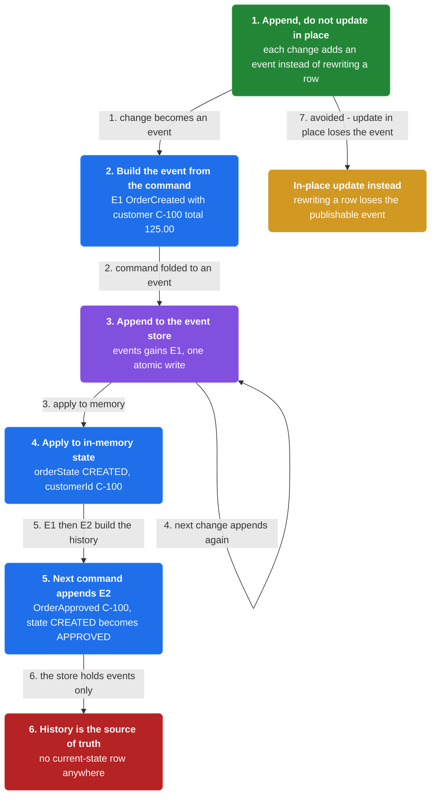
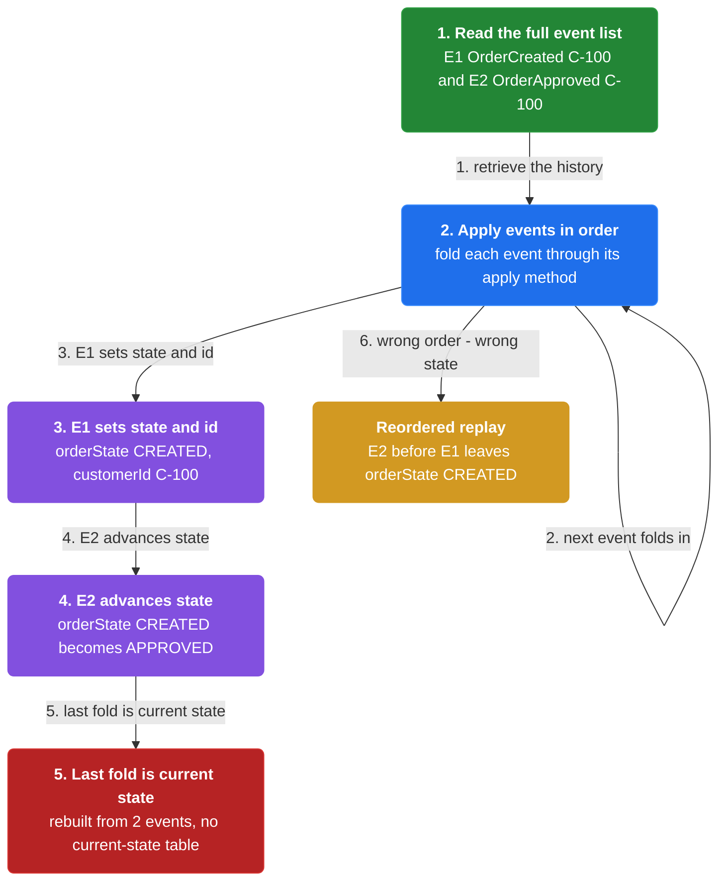
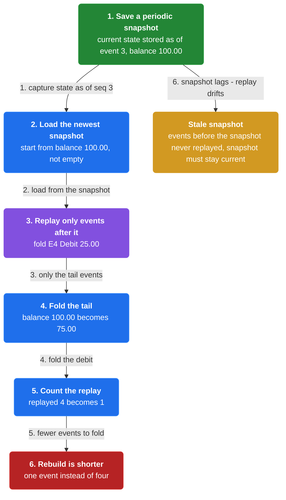
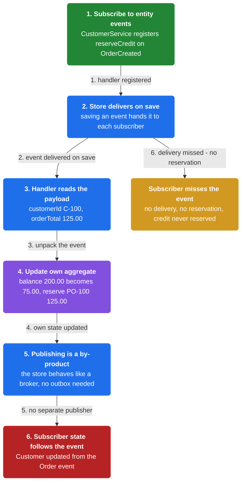
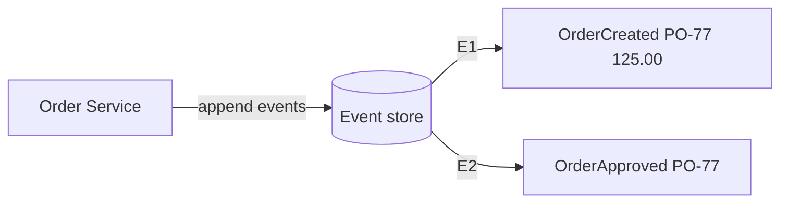
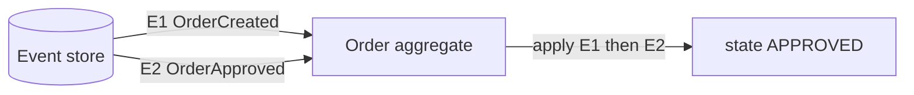
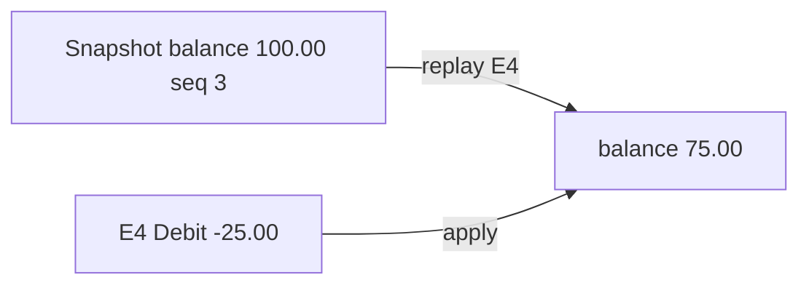
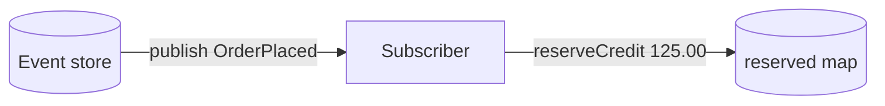

# Chapter 19: Event Sourcing

> Persist a business entity as a sequence of state-changing events and rebuild its current state by replaying them.

_Also known as: Chris Richardson · Microservice Patterns · microservices.io /patterns/data/event-sourcing.html_

## Flow

### Persist state as a sequence of events

> **Why this matters:** A command that must update the database and publish an event cannot do both atomically with 2PC, yet letting them drift corrupts the data. Appending one event makes the state change and its publishable event the same single write.



1. **Append, do not update in place** — Instead of rewriting a current-state row, each change appends a new event to the list of events for that entity.

2. **Store the events in an event store** — A database of events with an API for adding and retrieving the events of an entity.

3. **Rely on the single-write atomicity** — Saving one event is one operation, so it is inherently atomic — no 2PC with the broker.

```java
// EVENT SOURCING SIDE — the store holds events, not current state; each change is one atomic append
// PARTIES: SVC = Order Service · ES = EventStoreDB 24 @ orders-events-1 · CS = CustomerService (subscriber)
// STATE (before):
//    events : []                        // the Order's event list — its full history, empty before creation
//    state : { orderState:null, customerId:null }
// DEF: create order · CALLED BY: SVC processing a CreateOrderCommand
// -> customerId : "C-100" · -> orderTotal : 125.00
//    step 1 · build the event : E1 = OrderCreatedEvent("C-100", 125.00)   // the command becomes an event
//    step 2 · append to the store : events : [] -> [E1:OrderCreated("C-100",125.00)]   BECAUSE saving an event is a single operation, inherently atomic
//    step 3 · apply to memory : state.orderState : null -> "CREATED" · state.customerId : null -> "C-100"
// <- event : E1:OrderCreated("C-100",125.00) · delivered to every subscriber, including CS
//
// DEF: approve order · CALLED BY: SVC processing an ApproveOrderCommand
// -> customerId : "C-100"
//    step 1 · build : E2 = OrderApprovedEvent("C-100")
//    step 2 · append : events : [E1:OrderCreated("C-100",125.00)] -> [E1:OrderCreated("C-100",125.00), E2:OrderApproved("C-100")]
//    step 3 · apply : state.orderState : "CREATED" -> "APPROVED"
// <- event : E2:OrderApproved("C-100") · delivered to every subscriber
```

### Rebuild current state by replaying events

> **Why this matters:** Because the store holds history instead of a ready-to-read row, the application must fold the events back into current state. Replay order is the write order, so the reconstructed state is deterministic.



1. **Read the full event list** — The application retrieves the full sequence of events for the aggregate.

2. **Apply each event in order** — An apply() method per event type folds it into state — OrderCreated sets CREATED and the customer id.

3. **Stop at the last event** — The final folded value is the current state, with no separate current-state table.

```java
// EVENT SOURCING SIDE — current state is never stored; it is re-derived by folding every event in order
// PARTIES: SVC = Order Service · ES = EventStoreDB 24 @ orders-events-1
// STATE (before):
//    events : [E1:OrderCreated("C-100",125.00), E2:OrderApproved("C-100")]
//    state : { orderState:null, customerId:null }      // empty before replay
// DEF: replay · CALLED BY: SVC loading the Order — reads the event list and applies each event in sequence
// -> entityId : "PO-100"
//    step 1 · apply E1 sets state : state.orderState : null -> "CREATED"
//    step 2 · apply E1 copies id : state.customerId : null -> "C-100"   BECAUSE apply(OrderCreatedEvent) sets state and copies the customer id
//    step 3 · apply E2 : state.orderState : "CREATED" -> "APPROVED"   BECAUSE apply(OrderApprovedEvent) sets state to APPROVED
// <- state : { orderState:"APPROVED", customerId:"C-100" } · replayed from 2 events
//    alt wrong order : replaying E2 before E1 would leave orderState "CREATED", so event order must be preserved
```

### Shorten replay with snapshots

> **Why this matters:** Entities such as a Customer accumulate many events, so replaying everything is wasteful. A periodic snapshot of current state means only the events since that snapshot need to be folded.



1. **Save a snapshot of current state** — Periodically persist the current state of the entity as of some event.

2. **Load the newest snapshot** — To reconstruct, find the most recent snapshot instead of starting empty.

3. **Replay only the later events** — Fold the events since the snapshot, so there are fewer events to replay.

```java
// EVENT SOURCING SIDE — a snapshot shortens replay: load the newest snapshot, then fold only the events after it
// PARTIES: SVC = Customer Service · ES = EventStoreDB 24 @ orders-events-1
// STATE (before):
//    snapshot : { balance:100.00, seq:3 }      // Customer's state saved at event 3
//    events : [E1:Created, E2:Credit+50.00, E3:Credit+50.00, E4:Debit-25.00]
// DEF: load · CALLED BY: SVC reading the Customer — finds the most recent snapshot, then only the events since it
// -> entityId : "C-100"
//    step 1 · start from the snapshot : state.balance : null -> 100.00   BECAUSE the snapshot already folded E1..E3
//    step 2 · replay only E4 : state.balance : 100.00 -> 75.00   BECAUSE Debit-25.00 subtracts from the snapshot balance
//    step 3 · count the replay : replayed : 4 -> 1   BECAUSE only the events after seq 3 need folding
// <- state : { balance:75.00 } · rebuilt from 1 event instead of 4
```

### Let the event store deliver to subscribers

> **Why this matters:** The reliable-publish problem dissolves because the store itself behaves like a message broker: a subscriber receives each saved event, so publishing is a by-product of persisting.



1. **Subscribe to entity events** — A service registers a handler such as CustomerService.reserveCredit on OrderCreatedEvent.

2. **Receive the event on save** — When a service saves an event, the store delivers it to every interested subscriber.

3. **Update the subscriber state** — The handler reads the event payload and updates its own aggregate, reserving credit for the order.

```java
// EVENT SOURCING SIDE — the event store doubles as a broker, so a subscriber reacts to another service's events
// PARTIES: SVC = CustomerService (subscriber) · ES = EventStoreDB 24 @ orders-events-1 (delivers like a broker)
// STATE (before):
//    reserved : {}                       // credit the Customer has reserved per order, empty
//    balance : 200.00
// DEF: reserveCredit · CALLED BY: ES delivering an OrderCreatedEvent to the subscribed CustomerService
// -> event : OrderCreatedEvent("C-100", 125.00) · -> orderId : "PO-100"
//    step 1 · read the payload : customerId : null -> "C-100" · orderTotal : null -> 125.00   BECAUSE the handler unpacks the event it received
//    step 2 · reserve credit : balance : 200.00 -> 75.00   BECAUSE reserveCredit subtracts the order total 125.00 from the 200.00 available
//    step 3 · record the reservation : reserved : {} -> { "PO-100":125.00 }
// <- state : { balance:75.00, reserved:{"PO-100":125.00} } · the Customer's own state updated from the Order's event
```


## Interview Questions

### Q1

Your order state is stored as the current row only, so you cannot answer how the order got to APPROVED or rebuild it later. You want the full history persisted.

**Interviewer's question:** How does event sourcing persist state, and what does an event record look like?

**Solution:** Instead of storing current state, the service stores the sequence of events that changed it; each event is a record of a state change.

**System-design components:**
- Event store — holds events
- Event record — one state change
- OrderCreated — first event
- OrderApproved — a later event



```java
// ORDER SERVICE SIDE — persist state as a sequence of events instead of the current row
// PARTIES: SVC = Order Service · STORE = EventStoreDB 24 @ orders-events-1
// STATE (before):
//    events : []
//    current_state : {}   // nothing stored as a row
// DEF: append_event · CALLED BY: SVC on each state change
// -> event : { order_id:"C-55", type:"OrderCreated", total:125.00 }
//    step 1 · append the first event : events : [] -> [{ seq:1, order_id:"C-55", type:"OrderCreated", total:125.00 }]
//    step 2 · append the next event after approval : events : [{seq:1}] -> [{seq:1},{ seq:2, order_id:"C-55", type:"OrderApproved" }]
//    step 3 · state is derived by replaying events : current_state : {} -> { status:"APPROVED", total:125.00 }   BECAUSE E1 then E2 rebuild it
// <- outcome : events : [E1 OrderCreated(125.00), E2 OrderApproved] · the full history is stored, not just the current APPROVED state
```

_This is Event Sourcing — persist the state-changing events themselves as the source of truth._

_Covers:_ Persist state as a sequence of events

_From the 28 problems:_ 26-payment-system · 28-stock-exchange

### Q2

You have an event store full of order events, and you need the current state of order C-55 to serve a read request.

**Interviewer's question:** How does replaying events rebuild the current state of an aggregate?

**Solution:** The service reads the aggregate's events in order and applies each one, accumulating the current state as it goes.

**System-design components:**
- Event store — the source of events
- Order aggregate — the object being rebuilt
- apply — folds each event into state
- Replay — reads events in order



```java
// ORDER SERVICE SIDE — rebuild current state by replaying the aggregate's events in order
// PARTIES: SVC = Order Service · STORE = EventStoreDB 24 @ orders-events-1 · AGG = the Order aggregate being rebuilt
// STATE (before):
//    events : [{ seq:1, order_id:"C-55", type:"OrderCreated", total:125.00 }, { seq:2, order_id:"C-55", type:"OrderApproved" }]
//    order : { state:"none" }
// DEF: replay · CALLED BY: SVC to load order "C-55"
// -> order_id : "C-55"
//    step 1 · read the events in sequence : loaded : "none" -> [E1, E2]
//    step 2 · apply E1 : order : { state:"none" } -> { state:"CREATED", total:125.00 }
//    step 3 · apply E2 : order : { state:"CREATED" } -> { state:"APPROVED", total:125.00 }
// <- outcome : order : { state:"APPROVED", total:125.00 } · current state rebuilt from E1 then E2
```

_This is Event Sourcing replay — apply each event in order to rebuild the aggregate's current state._

_Covers:_ Rebuild current state by replaying events

_From the 28 problems:_ 26-payment-system · 28-stock-exchange

### Q3

Replaying a million events to load an account balance is too slow. You want to load most of the state and replay only the tail.

**Interviewer's question:** How does a snapshot shorten replay, and how is the balance rebuilt from it?

**Solution:** The service stores a snapshot of the aggregate's state up to a sequence number, then replays only the events after that snapshot.

**System-design components:**
- Snapshot — state at sequence 3
- Events after the snapshot — the tail
- Replay — only the tail
- Current state — snapshot plus tail



```java
// ACCOUNT SERVICE SIDE — shorten replay with a snapshot: load the snapshot, replay only the events after it
// PARTIES: SVC = Account Service · STORE = EventStoreDB 24 @ orders-events-1 · ACC = the Account aggregate
// STATE (before):
//    snapshot : { seq:3, balance:100.00 }
//    events_after : [{ seq:4, type:"Debit", amount:25.00 }]
//    account : { balance:"none" }
// DEF: load · CALLED BY: SVC to read the balance
// -> account_id : "ACC-9"
//    step 1 · load the snapshot : account : { balance:"none" } -> { balance:100.00, seq:3 }
//    step 2 · replay only the tail : replayed : 0 -> 1   BECAUSE only E4 is after the snapshot
//    step 3 · apply E4 : account.balance : 100.00 -> 75.00   BECAUSE 100.00 - 25.00 = 75.00
// <- outcome : account : { balance:75.00, seq:4 } · rebuilt by replaying 1 event instead of 4
```

_This is Event Sourcing with snapshots — the snapshot avoids replaying the full history, leaving only the tail._

_Covers:_ Shorten replay with snapshots

_From the 28 problems:_ 26-payment-system · 28-stock-exchange

### Q4

A customer service wants to track reservations the moment an order reserves credit, without rebuilding any order from its events. You want the event store to push new events out.

**Interviewer's question:** How does an event store deliver events to subscribers, and what does the subscriber build?

**Solution:** The event store publishes each new event as it is persisted, and subscribers react to build their own state or trigger workflows.

**System-design components:**
- Event store — persists and publishes
- Subscriber — reacts to new events
- OrderPlaced event — a change to deliver
- reserved map — built by the subscriber



```java
// ACCOUNT SERVICE SIDE — the event store delivers new events to subscribers, who build their own state
// PARTIES: STORE = EventStoreDB 24 @ orders-events-1 · SUB = the subscriber in Account Service · BAL = the account balance
// STATE (before):
//    balance : 200.00
//    reserved : {}
// DEF: persist_and_publish · CALLED BY: STORE when the order aggregate appends an event
// -> event : { type:"OrderPlaced", order_id:"PO-77", total:125.00 }
//    step 1 · the store persists the event : persisted : "none" -> { seq:7, type:"OrderPlaced", order_id:"PO-77" }
//    step 2 · the store delivers it to SUB : delivered : "none" -> "OrderPlaced"
//    step 3 · SUB reserves credit from the balance : balance : 200.00 -> 75.00   BECAUSE 200.00 - 125.00 = 75.00
//    step 4 · SUB records the reservation : reserved : {} -> { "PO-77" : 125.00 }
// <- outcome : balance : 75.00 · reserved : { "PO-77" : 125.00 } · the subscriber reacted without replaying the order
```

_This is Event Sourcing letting the store deliver to subscribers — new events are pushed so subscribers build their own state._

_Covers:_ Let the event store deliver to subscribers

_From the 28 problems:_ 26-payment-system · 28-stock-exchange

## Key Concepts

### The Problem

**Updating the database and publishing events is not atomic.** Without a distributed transaction the two cannot be made reliable: a message sent mid-transaction may not commit, and a message sent after commit may never be sent if the service crashes first.


### The Solution

Event sourcing persists a business entity (an Order or a Customer) as a sequence of state-changing events; whenever state changes a new event is appended, and current state is rebuilt by replaying them.


### Key Facts

| Fact | Detail | In the wild |
|---|---|---|
| Persist state as a sequence of events | Event sourcing persists a business entity (an Order or a Customer) as a sequence of state-changing events; whenever state changes a new event is appended, and current state is rebuilt by replaying them. | The Eventuate Customers and Orders example stores each Order as a sequence of events rather than a row in an ORDERS table. |
| Replay is expensive and queries become hard | The event store is difficult to query because typical queries must reconstruct state, which is complex and inefficient — so reads are moved to CQRS, and the system must handle eventually consistent data. | A read of a Customer means replaying its events unless a snapshot shortens the work. |
| A new programming style with real benefits | Event sourcing is an unfamiliar style with a learning curve, but it reliably publishes events on every state change, avoids object-relational impedance mismatch, gives a 100% reliable audit log, and enables temporal queries of state at any point in time. | Event-sourced services exchange events loosely, which the book says eases migration from a monolith to microservices. |


### Tradeoffs & When

- The event store is difficult to query because typical queries must reconstruct state, which is complex and inefficient — so reads are moved to CQRS, and the system must handle eventually consistent data.
- Event sourcing is an unfamiliar style with a learning curve, but it reliably publishes events on every state change, avoids object-relational impedance mismatch, gives a 100% reliable audit log, and enables temporal queries of state at any point in time.


<details><summary>All concepts (index)</summary>

### Problem: Updating the database and publishing events is not atomic

**Why.** A service command must update or delete aggregates in the database and send messages to a broker at the same time, or data and messages drift apart.

**Claim.** Without a distributed transaction the two cannot be made reliable: a message sent mid-transaction may not commit, and a message sent after commit may never be sent if the service crashes first.

**Grounding.** The pattern rules out 2PC because the database or broker may not support it, and coupling the service to both is undesirable.

**In the wild.** A saga participant or a service publishing a domain event faces exactly this database-plus-message atomicity problem.
### Solution: Persist state as a sequence of events

**Why.** Appending one event is a single operation, so the state change and the publishable event are the same write and cannot diverge.

**Claim.** Event sourcing persists a business entity (an Order or a Customer) as a sequence of state-changing events; whenever state changes a new event is appended, and current state is rebuilt by replaying them.

**Grounding.** Events live in an event store that adds and retrieves an entity's events and also delivers them to subscribers like a message broker.

**In the wild.** The Eventuate Customers and Orders example stores each Order as a sequence of events rather than a row in an ORDERS table.
### Tradeoff: Replay is expensive and queries become hard

**Why.** The store holds history, not a ready-to-read current state, so answering a question means folding events first.

**Claim.** The event store is difficult to query because typical queries must reconstruct state, which is complex and inefficient — so reads are moved to CQRS, and the system must handle eventually consistent data.

**Grounding.** The resulting context lists the difficult-to-query store as a drawback that forces CQRS and eventual consistency.

**In the wild.** A read of a Customer means replaying its events unless a snapshot shortens the work.
### Tradeoff: A new programming style with real benefits

**Why.** The team trades a familiar pattern for capabilities that are hard to get any other way.

**Claim.** Event sourcing is an unfamiliar style with a learning curve, but it reliably publishes events on every state change, avoids object-relational impedance mismatch, gives a 100% reliable audit log, and enables temporal queries of state at any point in time.

**Grounding.** The resulting context enumerates the learning curve as a drawback and the audit-log and temporal-query abilities as benefits.

**In the wild.** Event-sourced services exchange events loosely, which the book says eases migration from a monolith to microservices.

</details>


## Quiz

1. Event sourcing persists an entity's state as what?

   - A. A single current-state row
   - B. A sequence of state-changing events
   - C. A snapshot only
   - D. A set of database triggers

<details><summary>Reveal answer</summary>

**B.** The pattern stores a business entity as a sequence of events, appending a new one each time state changes; A is the traditional approach it replaces, and C is only an optimization layered on top.

</details>

2. Why is saving an event inherently atomic?

   - A. It uses a 2PC distributed transaction
   - B. It enlists the message broker in the transaction
   - C. It applies a compensating saga
   - D. Saving a single event is a single operation

<details><summary>Reveal answer</summary>

**D.** One append is one write, so the state change and its publishable event cannot split; A and B describe the 2PC approach the pattern explicitly rejects.

</details>

3. How does an application reconstruct an entity's current state?

   - A. By querying the latest row
   - B. By reading only the newest snapshot
   - C. By replaying the sequence of events
   - D. By asking the message broker

<details><summary>Reveal answer</summary>

**C.** Current state is rebuilt by folding the events in order; a snapshot only reduces how many events must be replayed, so B is incomplete.

</details>

4. What does the event store also behave like?

   - A. A message broker
   - B. A cache
   - C. A load balancer
   - D. A relational view

<details><summary>Reveal answer</summary>

**A.** The store delivers each saved event to interested subscribers, so it plays the broker's role in publishing events on state change.

</details>

