# Chapter 20: Transaction Script

> Organize the business logic as a collection of procedural transaction scripts, one for each type of request.

_Also known as: Chris Richardson · Microservice Patterns Ch.5 · microservices.io /patterns/decomposition/transaction-script.html_

## Flow

### One procedural method per request type

> **Why this matters:** When the logic is simple, an object model is overkill; a plain method per request is easier to read and write. The script pulls the request's data into an object and hands it to the database.

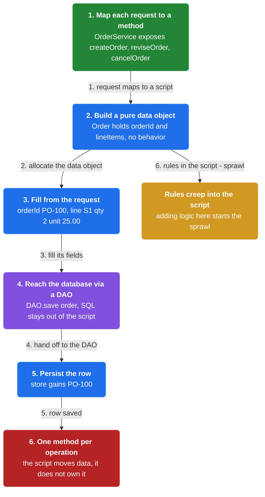

1. **Map each request to a method** — A service class exposes one method per system operation — createOrder(), reviseOrder(), cancelOrder().

2. **Build a pure data object** — The script fills an Order (orderId, orderLineItems) that has no behavior.

3. **Reach the database through a DAO** — OrderDao exposes save(Order) and findOrderById(), keeping SQL out of the script.

```java
// TRANSACTION SCRIPT SIDE — one procedural method per request; the script moves data, it does not own it
// PARTIES: SVC = OrderService (holds the scripts, no state) · DAO = OrderDao (data access) · DB = PostgreSQL 16 @ orders-db-1
// STATE (before):
//    orders : {}                        // the data store, empty — Order is a pure data object
// DEF: createOrder · CALLED BY: the presentation tier issuing a POST /orders request
// -> orderId : "PO-100" · -> lineItems : [{sku:"S1", qty:2, unit:25.00}]
//    step 1 · allocate the data object : order : null -> { orderId:null, lineItems:[] }   BECAUSE the script builds an Order (pure data) from the request
//    step 2 · fill from the request : order.orderId : null -> "PO-100" · order.lineItems : [] -> [{sku:"S1",qty:2,unit:25.00}]
//    step 3 · hand off to the DAO : DAO.save(order)     // save(Order) is data access, not business logic
//    step 4 · persist : orders : {} -> { "PO-100": { orderId:"PO-100", lineItems:[{sku:"S1",qty:2,unit:25.00}] } }
// <- order : { orderId:"PO-100", lineItems:[{sku:"S1",qty:2,unit:25.00}] } · saved to DB
```

### Keep behavior and state in separate classes

> **Why this matters:** The signature of the pattern is that the classes implementing behavior are separate from those storing state. That split is what makes the style read like plain procedural C, for better and for worse.

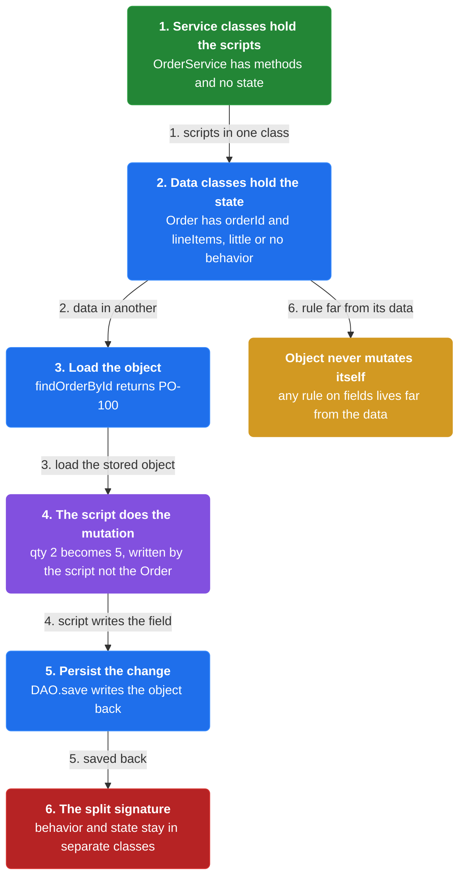

1. **Service classes hold the scripts** — OrderService has methods and no meaningful state.

2. **Data classes hold the state** — Order holds orderId and orderLineItems and little or no behavior.

3. **The script does all mutation** — A change to a field is written by the script, never by the data object itself.

```java
// TRANSACTION SCRIPT SIDE — the script mutates a data object; the object never mutates itself
// PARTIES: SVC = OrderService (behavior, stateless) · DAO = OrderDao (find + save) · DB = PostgreSQL 16 @ orders-db-1
// STATE (before):
//    orders : { "PO-100": { orderId:"PO-100", lineItems:[{sku:"S1",qty:2,unit:25.00}] } }
// DEF: reviseOrder · CALLED BY: the presentation tier issuing a revise request
// -> orderId : "PO-100" · -> newQty : 5
//    step 1 · load : order : null -> { orderId:"PO-100", lineItems:[{sku:"S1",qty:2,unit:25.00}] }   BECAUSE DAO.findOrderById returns the stored data object
//    step 2 · the SCRIPT mutates a field : order.lineItems[0].qty : 2 -> 5   BECAUSE the change is written by the script, not by the Order
//    step 3 · persist : orders : { "PO-100": {...,qty:2,...} } -> { "PO-100": {...,qty:5,...} }   BECAUSE DAO.save writes the object back
// <- order : { orderId:"PO-100", lineItems:[{sku:"S1",qty:5,unit:25.00}] }
```

### Use scripts for simple logic only

> **Why this matters:** The procedural style is seductive because you skip class design, and that is fine while the rules are few. The same method that reads cleanly for simple logic becomes a nightmare as the rules multiply.

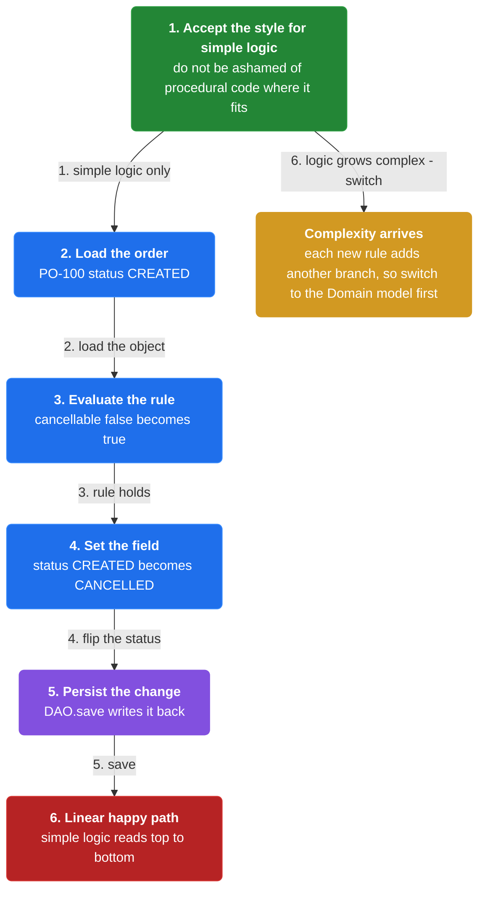

1. **Accept the style when logic is simple** — Do not be ashamed of procedural code where it is appropriate.

2. **Watch for sprawl** — Each new rule is another branch inside the same script, so it grows with the logic.

3. **Switch when complexity arrives** — For complex logic, move to the Domain model before the script becomes unmaintainable.

```java
// TRANSACTION SCRIPT SIDE — simple logic reads top-to-bottom; the same method sprawls when the rules multiply
// PARTIES: SVC = OrderService (the script) · DAO = OrderDao (data access)
// STATE (before):
//    orders : { "PO-100": { orderId:"PO-100", status:"CREATED", lineItems:[{sku:"S1",qty:2,unit:25.00}] } }
// DEF: cancelOrder · CALLED BY: the presentation tier issuing a cancel request
// -> orderId : "PO-100"
//    step 1 · load : order : null -> { orderId:"PO-100", status:"CREATED", lineItems:[{sku:"S1",qty:2,unit:25.00}] }
//    step 2 · evaluate the rule : cancellable : false -> true   BECAUSE status "CREATED" is cancellable
//    step 3 · set the field : order.status : "CREATED" -> "CANCELLED"
//    step 4 · persist : orders : { "PO-100": {...,status:"CREATED",...} } -> { "PO-100": {...,status:"CANCELLED",...} }   BECAUSE DAO.save writes it back
// <- order : { orderId:"PO-100", status:"CANCELLED", lineItems:[{sku:"S1",qty:2,unit:25.00}] }
//    alt complex rules : each extra rule adds another if-block to the SAME method, so the script grows with the logic
```


## System Design Interview

**The pipeline:** presentation tier → transaction script (OrderService) → DAO (OrderDao) → database

### presentation tier

_Role: presentation tier_

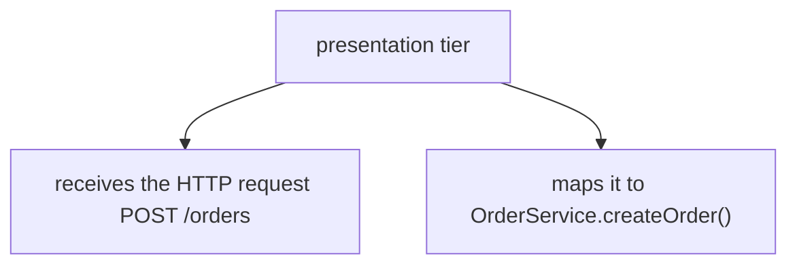

### OrderService — the transaction script

_Role: transaction script (service class)_

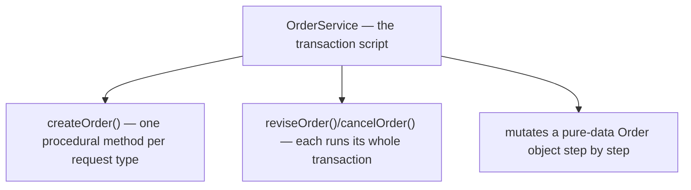

### OrderDao — the DAO

_Role: DAO_

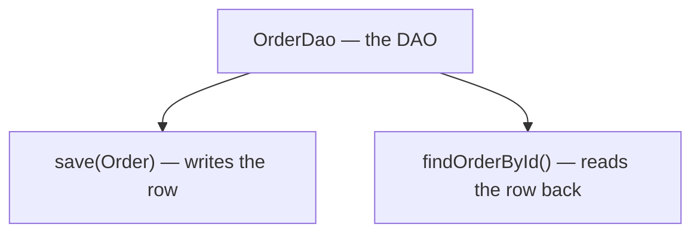

### PostgreSQL 16 @ orders-db-1 — the database

_Role: database_

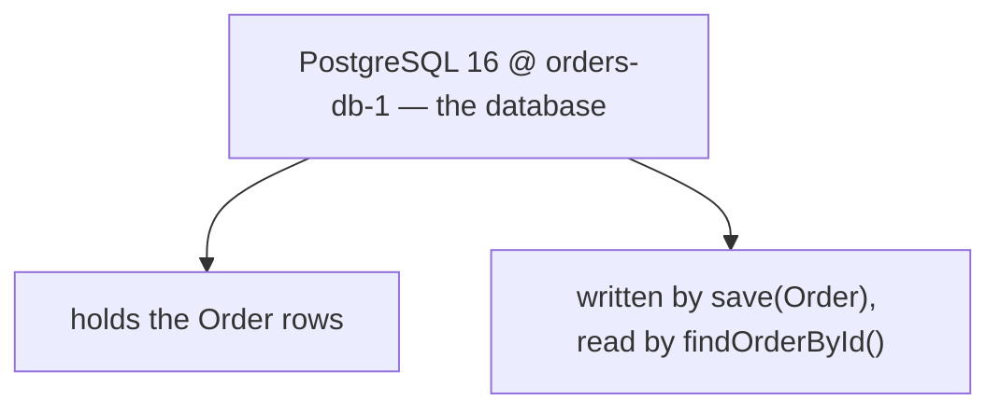

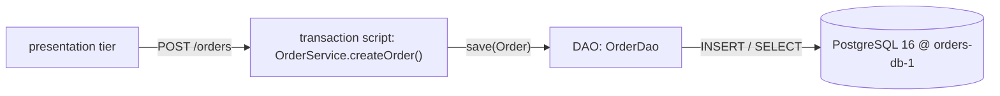

```java
// SYSTEM DESIGN — transaction script as a pipeline: presentation tier -> transaction script (OrderService) -> DAO (OrderDao) -> database (PostgreSQL 16 @ orders-db-1)
// PARTIES: WEB = presentation tier (client) · SVC = OrderService (transaction script service class) · DAO = OrderDao (data access object) · DB = PostgreSQL 16 @ orders-db-1
// DEF: script — one procedural method per request type; here createOrder() runs request "PO-100" top-to-bottom
// DEF: order — a pure-data object with no behavior; here { orderId:"PO-100", lineItems:[{sku:"S1", qty:2, unit:25.00}] }
// DEF: dao — the data-access layer; here save(Order) writes row "PO-100" and findOrderById() reads it back
// STATE (before):
//    order : { orderId:null, lineItems:[] }
//    rows  : {}
// DEF: create_order · CALLED BY: WEB issuing POST /orders
// -> order_id : "PO-100" · -> line_items : [{sku:"S1", qty:2, unit:25.00}]
//    step 1 · script fills the data object    order : { orderId:null, lineItems:[] } -> { orderId:"PO-100", lineItems:[{sku:"S1", qty:2, unit:25.00}] }
//    step 2 · script hands off to the DAO    DAO.save(order) -> rows : {} -> { "PO-100" : { lineItems:[{sku:"S1", qty:2, unit:25.00}] } }
//    step 3 · script reads it back through the DAO    findOrderById("PO-100") -> rows["PO-100"] : { orderId:"PO-100", lineItems:[{sku:"S1", qty:2, unit:25.00}] } returned
//    step 4 · WEB receives the row    response : "none" -> { orderId:"PO-100", lineItems:[{sku:"S1", qty:2, unit:25.00}] }
// <- outcome : DB row "PO-100" persisted and returned  BECAUSE the script wrote through OrderDao.save and read back through OrderDao.findOrderById
```

## Interview Questions

### Q1

Your business logic is simple, and you want each HTTP request handled by one procedural method that does the work directly against the database.

**Interviewer's question:** How does the transaction-script pattern organize business logic, and what does one method do?

**Solution:** The pattern uses one procedural method per request type; the method runs the whole transaction and uses a DAO to access the database.

**System-design components:**
- TransactionScript — one method per request
- createOrder — the method
- OrderDao — data access object
- Database — rows the DAO writes

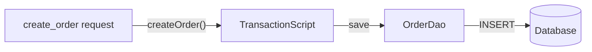

```java
// ORDER SERVICE SIDE — the transaction-script pattern: one procedural method per request type, using a DAO for the database
// PARTIES: WEB = the request handler · TS = the transaction script · DAO = the data access object
// STATE (before):
//    orders : {}
// DEF: createOrder · CALLED BY: WEB on a create_order request
// -> order_id : "PO-77" · -> total : 45.00
//    step 1 · script builds the row : row : "none" -> { id:"PO-77", total:45.00, state:"CREATED" }
//    step 2 · script calls the DAO : dao.save(row) -> orders : {} -> { "PO-77" : { total:45.00, state:"CREATED" } }
//    step 3 · script returns : created : "none" -> "PO-77"
// <- outcome : orders : { "PO-77" : { total:45.00, state:"CREATED" } } · one method did the whole request
```

_This is the Transaction Script — one procedural method per request type, accessing data via a DAO._

_Covers:_ One procedural method per request type

_From the 28 problems:_ 03-framework-for-system-design-interviews

### Q2

Your scripts hold no data themselves — a script mutates an order's quantity and total, which live in separate DAO-loaded objects.

**Interviewer's question:** How does the transaction-script pattern separate behavior and state?

**Solution:** The behavior lives in the script (procedures), while the state lives in separate DAO-accessed data objects that the script loads, mutates, and saves.

**System-design components:**
- Script — holds the behavior
- Order row — holds the state
- OrderDao — loads and saves the row
- Mutate — the script changes the row

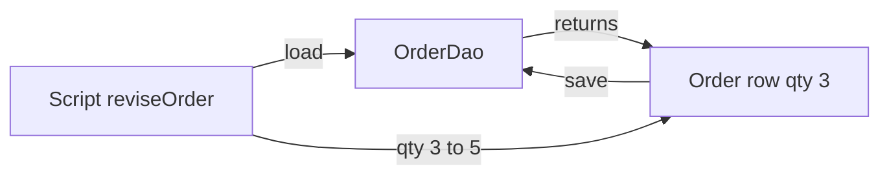

```java
// ORDER SERVICE SIDE — behavior and state are in separate classes: the script mutates a DAO-loaded data object
// PARTIES: TS = the transaction script · DAO = the data access object · ROW = the state object
// STATE (before):
//    order_row : { id:"PO-77", qty:3, total:120.00 }
// DEF: reviseOrder · CALLED BY: TS on a revise_order request
// -> order_id : "PO-77" · -> new_qty : 5
//    step 1 · script loads the state via the DAO : row : "none" -> { id:"PO-77", qty:3, total:120.00 }
//    step 2 · script mutates the loaded object : row.qty : 3 -> 5
//    step 3 · script recomputes the total : row.total : 120.00 -> 200.00   BECAUSE 5 x 40.00 = 200.00
//    step 4 · script saves the row back : dao.save(row) -> persisted : { qty:3, total:120.00 } -> { qty:5, total:200.00 }
// <- outcome : order_row : { id:"PO-77", qty:5, total:200.00 } · the behavior stayed in the script, the state in the row
```

_This is the Transaction Script keeping behavior and state separate — the script mutates a DAO-loaded data object._

_Covers:_ Keep behavior and state in separate classes

_From the 28 problems:_ 03-framework-for-system-design-interviews

### Q3

Your service needs to cancel an order, and the only rule is that the order must still be in the CREATED state. The logic is short enough for a script.

**Interviewer's question:** When is the transaction-script pattern the right choice, and what does a simple cancel script do?

**Solution:** The pattern fits simple, low-complexity logic; a cancel script loads the order, checks one guard, flips the state, and saves it.

**System-design components:**
- cancelOrder — the script
- State check — CREATED allowed
- Flip — CREATED to CANCELLED
- Save — the row persists the change

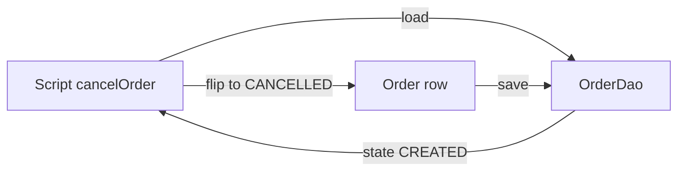

```java
// ORDER SERVICE SIDE — simple logic is the pattern's sweet spot: a cancel script with one guard
// PARTIES: TS = the transaction script · DAO = the data access object
// STATE (before):
//    order_row : { id:"PO-77", state:"CREATED" }
// DEF: cancelOrder · CALLED BY: TS on a cancel_order request
// -> order_id : "PO-77"
//    step 1 · script loads the order : row : "none" -> { id:"PO-77", state:"CREATED" }
//    step 2 · script checks the guard : row.state : "CREATED" == "CREATED" -> allowed
//    step 3 · script flips the state : row.state : "CREATED" -> "CANCELLED"
//    step 4 · script saves : dao.save(row) -> persisted : { state:"CREATED" } -> { state:"CANCELLED" }
// <- outcome : order_row : { id:"PO-77", state:"CANCELLED" } · a short script with one rule — exactly what the pattern is for
```

_This is the Transaction Script at its best — simple logic handled by a short procedural method._

_Covers:_ Use scripts for simple logic only

_From the 28 problems:_ 03-framework-for-system-design-interviews

### Q4

The business keeps adding rules — discounts, then approvals, then split shipments — and your once-simple script now has a long chain of branches.

**Interviewer's question:** What happens to a transaction script as business logic grows, and what is the fix?

**Solution:** The script accumulates branches and duplicated rules until it is hard to change, at which point you should refactor into a richer domain model.

**System-design components:**
- One script — grows with each rule
- Branches — a chain of ifs
- Duplication — rules repeated across scripts
- Domain model — the refactor target

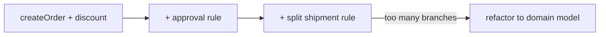

```java
// ORDER SERVICE SIDE — the pattern sprawls as rules multiply: a script that grows a branch per new business rule
// PARTIES: TS = the transaction script · DAO = the data access object
// STATE (before):
//    order_row : { id:"PO-77", total:100.00, state:"CREATED" }
//    branch_count : 1
// DEF: createOrder · CALLED BY: TS on a create_order request
// -> order_id : "PO-77"
//    step 1 · rule 1, discount : branch_count : 1 -> 1 · order.total : 100.00 -> 90.00   BECAUSE a 10% discount applies
//    step 2 · rule 2, approval : branch_count : 1 -> 2 · order.state : "CREATED" -> "PENDING_APPROVAL"   BECAUSE orders over 50.00 need approval
//    step 3 · rule 3, split shipment : branch_count : 2 -> 3 · order.shipment : "none" -> "SPLIT"   BECAUSE the order has multiple lines
// <- outcome : order : { total:90.00, state:"PENDING_APPROVAL", shipment:"SPLIT" } · branch_count : 3 · each new rule adds a branch and repeated checks
```

_This is the Transaction Script's weakness — it sprawls as logic grows, so complex domains should move to a domain model._

_Covers:_ Use scripts for simple logic only

_From the 28 problems:_ 03-framework-for-system-design-interviews

## Key Concepts

### The Problem

**Complex logic sprawls when behavior and state are split.** The procedural Transaction script style tends not to be a good way to implement complex business logic — scripts grow continually, just as a monolith keeps growing.


### The Solution

Organize business logic as a collection of procedural transaction scripts, one for each type of request, each located in a service class and reaching the database through data access objects.


### Key Facts

| Fact | Detail | In the wild |
|---|---|---|
| One procedural script per request type | Organize business logic as a collection of procedural transaction scripts, one for each type of request, each located in a service class and reaching the database through data access objects. | A POST /orders request maps directly to OrderService.createOrder(). |
| Behavior classes and state classes stay separate | The scripts sit in stateless service classes, while the data objects such as Order are pure data with little or no behavior. | Order has orderId and orderLineItems but no methods; OrderService has methods but no fields. |
| Right for simple logic, wrong for complex | Use a script when business logic is simple; when it becomes complex, switch to the Domain model — but do not be ashamed of procedural code where it is appropriate. | Teams script trivial CRUD requests and reserve an object model for the parts of the domain with real rules. |


### Tradeoffs & When

- The scripts sit in stateless service classes, while the data objects such as Order are pure data with little or no behavior.
- Use a script when business logic is simple; when it becomes complex, switch to the Domain model — but do not be ashamed of procedural code where it is appropriate.


<details><summary>All concepts (index)</summary>

### Problem: Complex logic sprawls when behavior and state are split

**Why.** Separating the classes that implement behavior from those that store state means every rule lives in a script far from the data it changes.

**Claim.** The procedural Transaction script style tends not to be a good way to implement complex business logic — scripts grow continually, just as a monolith keeps growing.

**Grounding.** The book lists this as the pattern's central drawback after noting the approach uses few of the capabilities of an OOP language.

**In the wild.** An OrderService holding create, revise and cancel scripts absorbs every edge case, so each new rule means editing a shared method.
### Solution: One procedural script per request type

**Why.** A method per request keeps the happy path linear and obvious when the logic is simple.

**Claim.** Organize business logic as a collection of procedural transaction scripts, one for each type of request, each located in a service class and reaching the database through data access objects.

**Grounding.** The pattern definition, plus the Figure 5.2 example: OrderService exposes createOrder(), reviseOrder() and cancelOrder(); OrderDao exposes save(Order) and findOrderById(); Order is pure data.

**In the wild.** A POST /orders request maps directly to OrderService.createOrder().
### Tradeoff: Behavior classes and state classes stay separate

**Why.** The design deliberately keeps data dumb, so it is quick to write and easy to follow.

**Claim.** The scripts sit in stateless service classes, while the data objects such as Order are pure data with little or no behavior.

**Grounding.** The book calls this separation an important characteristic of the approach, and says the style reads like C or another non-OOP language.

**In the wild.** Order has orderId and orderLineItems but no methods; OrderService has methods but no fields.
### Tradeoff: Right for simple logic, wrong for complex

**Why.** The procedural style is seductive because you can code without carefully organizing classes.

**Claim.** Use a script when business logic is simple; when it becomes complex, switch to the Domain model — but do not be ashamed of procedural code where it is appropriate.

**Grounding.** The book recommends the script when the object-oriented approach is overkill and says simple logic is exactly that situation.

**In the wild.** Teams script trivial CRUD requests and reserve an object model for the parts of the domain with real rules.

</details>


## Quiz

1. The Transaction script pattern organizes business logic as what?

   - A. An object model of classes with state and behavior
   - B. A collection of procedural transaction scripts, one per request type
   - C. A sequence of state-changing events
   - D. A set of database stored procedures

<details><summary>Reveal answer</summary>

**B.** The pattern is one procedural script per type of request; A is the Domain model, C is Event sourcing, and D is not what the book describes.

</details>

2. Which classes implement the behavior in a transaction-script design?

   - A. The data objects (Order)
   - B. The DAOs (OrderDao)
   - C. The service classes (OrderService)
   - D. The presentation tier

<details><summary>Reveal answer</summary>

**C.** Scripts live in service classes such as OrderService; the Order data object has little or no behavior, and OrderDao only reads and writes the database.

</details>

3. In the Transaction script pattern, the Order data object is what?

   - A. Pure data with little or no behavior
   - B. The class that enforces invariants
   - C. A behavior-only class
   - D. The database row itself

<details><summary>Reveal answer</summary>

**A.** Order holds orderId and orderLineItems but no meaningful methods; it is a data object, which is why the script must do all the work.

</details>

4. For which kind of logic is the Transaction script the appropriate choice?

   - A. Complex business logic
   - B. Logic needing an audit log
   - C. Logic needing temporal queries
   - D. Simple business logic

<details><summary>Reveal answer</summary>

**D.** The book says the procedural script fits simple logic and that complex logic is where it becomes a maintenance nightmare, so A is backwards; B and C point at other patterns.

</details>

