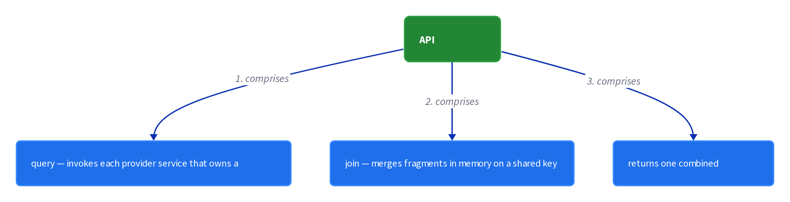
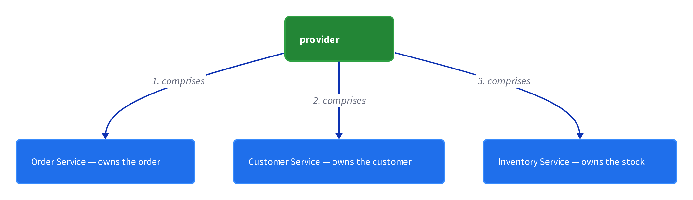
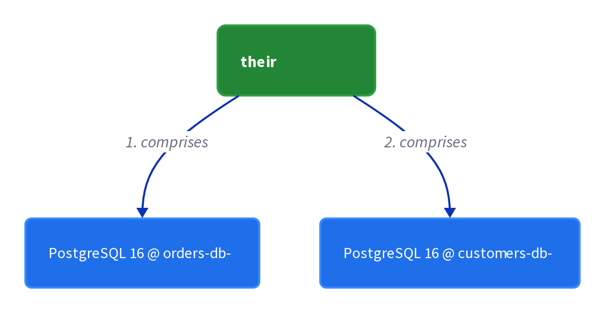

# Chapter 21: API Composition

> Implement a query by defining an API Composer, which invokes the services that own the data and performs an in-memory join of the results.

_Also known as: Chris Richardson · Microservice Patterns Ch. 21 · microservices.io /patterns/data/api-composition.html_

## Flow

### Why queries break across services

> **Why this matters:** Once you apply Database per Service, a query that needs data from several services can no longer run as a single SQL JOIN — the rows live in different, service-owned databases.

1. **Apply Database per service** — Each service owns a private database that no other service may read or write directly.

2. **One query now spans several owners** — A single logical result needs columns that are owned by two or more services.

3. **No shared table to JOIN** — There is no single database where one SQL statement can combine the rows.

```java
// QUERY SIDE — why one logical query can no longer be a single SQL JOIN
// PARTIES: CLI = client rendering an order page · CUST = Customer Service · ORD = Order Service
// DEF: db — a service-owned database that holds only its own service's rows = a keyed store; here cust_db = {"C-77":{name:"Ada"}} and ord_db = {"O-101":{cust_id:"C-77", total:120.00}}
// STATE (before):
//    cust_db : { "C-77": {name:"Ada"} }                          // rows owned by CUST only
//    ord_db  : { "O-101": {cust_id:"C-77", total:120.00} }       // rows owned by ORD only
//    result  : {}
// DEF: get_order_with_name · CALLED BY: CLI assembling an order page
// -> order_id : "O-101"
//    step 1 · ORD.fetch(order_id)    // order_row : null -> {cust_id:"C-77", total:120.00}  BECAUSE the order row lives in ORD's own database
//    step 2 · CUST.fetch("C-77")     // cust_row  : null -> {name:"Ada"}                      BECAUSE the customer row lives in CUST's own database
//    step 3 · join the two rows in memory    // result : {} -> {"O-101":{name:"Ada", total:120.00}}
// <- result : {"O-101":{name:"Ada", total:120.00}}
//    alt pre-microservice monolith : one database held both tables -> one SQL JOIN returned this same row in a single statement
```

### Define the API Composer

> **Why this matters:** An API Composer invokes the services that own the data and performs an in-memory join of the results, so one endpoint can answer a query that spans services.

1. **Introduce a composer component** — A dedicated API Composer (often the API Gateway) owns the joined query.

2. **Invoke the owning services** — The composer calls each service that owns a piece of the result.

3. **Join the partial results** — The composer merges the returned fragments into one response object.

```java
// COMPOSER SIDE — the API Composer fans out to the services that own the data
// PARTIES: CMP = API Composer · ORD = Order Service · CUST = Customer Service · INV = Inventory Service
// STATE (before):
//    joined : {}                         // assembled result, empty before the fan-out
//    calls  : 0                           // round-trips made so far
// DEF: compose_order_details · CALLED BY: CMP answering one order query
// -> query : {"order_id":"O-101"}         // the one logical query to answer
//    step 1 · ORD.fetch("O-101")    // joined : {} -> {cust_id:"C-77", total:120.00}     · calls : 0 -> 1
//    step 2 · CUST.fetch("C-77")    // joined : {cust_id:"C-77", total:120.00} -> {cust_id:"C-77", total:120.00, name:"Ada"}    · calls : 1 -> 2
//    step 3 · INV.fetch("O-101")    // joined : {cust_id:"C-77", total:120.00, name:"Ada"} -> {cust_id:"C-77", total:120.00, name:"Ada", stock:3}    · calls : 2 -> 3
// <- output : {cust_id:"C-77", total:120.00, name:"Ada", stock:3}
//    alt INV is down : step 3 raises -> calls stays at 2 -> the joined result is missing the stock field
```

### The in-memory join

> **Why this matters:** The join is the pattern's core mechanism: fragments arrive keyed by a shared id, and the composer merges them in memory rather than in SQL.

1. **Fragment by a shared key** — Each partial result is keyed by the same id, e.g. the order id.

2. **Merge rows in memory** — The composer combines fragments with matching keys into one row.

3. **Emit the assembled response** — The joined object is returned as if one query had produced it.

```java
// COMPOSER SIDE — the in-memory join merges fragments on the shared key
// PARTIES: CMP = API Composer · ORD = Order Service · CUST = Customer Service
// DEF: row — one fragment/record returned by a service, keyed by the shared id = one element of ord_rows or cust_rows; here the order row {"O-101":{total:120.00}} and the customer row {"C-77":{name:"Ada"}}
// STATE (before):
//    ord_rows  : [{"O-101":{total:120.00}}, {"O-102":{total:80.00}}]        // fetched from ORD
//    cust_rows : [{"C-77":{name:"Ada"}}]                                     // fetched from CUST
//    joined    : []
//    matched   : null
// DEF: join_fragments · CALLED BY: CMP merging two partial results
// -> key : "O-101"                                    // the shared id the join matches on
//    step 1 · match ord_rows[0]    // matched : null -> {"O-101":{total:120.00}}
//    step 2 · attach name by id    // matched : {"O-101":{total:120.00}} -> {"O-101":{total:120.00, name:"Ada"}}
//    step 3 · append to joined    // joined : [] -> [{"O-101":{total:120.00, name:"Ada"}}]
// <- joined : [{"O-101":{total:120.00, name:"Ada"}}]
//    alt the key "O-102" has no matching cust row : matched : {"O-102":{total:80.00}} -> {"O-102":{total:80.00, name:null}}  BECAUSE the composer cannot invent a name it was never given
```

### When it stops being simple

> **Why this matters:** The tradeoff is efficiency: some queries force an in-memory join of large datasets, which is exactly the case where API composition breaks down.

1. **Recognize the large-dataset case** — Some queries pull big result sets from several services before joining.

2. **The join happens in the composer's memory** — All fragments must be loaded into memory to be combined.

3. **Prefer CQRS for those queries** — When the join is too large or too hot, CQRS is the alternative solution.

```java
// COMPOSER SIDE — the tradeoff: joining a large dataset in memory gets inefficient
// PARTIES: CMP = API Composer · ORD = Order Service · CUST = Customer Service
// DEF: row — one order or customer record pulled from a service = one element of ord_rows; here ORD.fetch_all("last 30 days") returns 900000 order rows
// STATE (before):
//    ord_rows  : []                         // order rows pulled from ORD
//    cust_rows : []                         // customer rows pulled from CUST
//    joined    : []                         // the assembled result
// DEF: join_large_dataset · CALLED BY: CMP answering a full-history query
// -> scope : "last 30 days"                 // the query asks for the whole set, not one row
//    step 1 · ORD.fetch_all(scope)    // ord_rows  : [] -> [900000 rows]  BECAUSE the query selects the full history rather than one id
//    step 2 · CUST.fetch_all()        // cust_rows : [] -> [120000 rows]  BECAUSE every referenced customer must also be pulled
//    step 3 · join in CMP memory      // joined    : [] -> [900000 rows]  BECAUSE all 900000 order rows are combined in the composer's RAM
// <- joined : [900000 rows] · CMP materializes 900000 rows in memory at once
//    alt the query targets one order : ORD.fetch_all returns 1 row -> CMP joins 1 row -> the in-memory cost is negligible
```


## System Design Interview

> **The question:** Design a query that spans services. Premise: an API composer calls several provider services and their databases and joins the results, so a client gets one response without a shared database.

**The pipeline:** client → API composer → provider services → their databases

### API Composer

_Role: API composer_



### provider services

_Role: provider services_



### their databases

_Role: databases_



```java
// SYSTEM DESIGN — API composition as a pipeline: client -> API composer -> provider services -> their databases
// PARTIES: CLI = client · CMP = API Composer (query orchestrator) · ORD = Order Service (provider service) · CUST = Customer Service (provider service) · ORDDB = PostgreSQL 16 @ orders-db-1 · CUSTDB = PostgreSQL 16 @ customers-db-1
// DEF: fragment — one partial result a provider returns, keyed by a shared id; here the order fragment { order_id:"O-101", cust_id:"C-77", total:120.00 }
// DEF: join — merging fragments in memory on the shared key; here cust_id "C-77" pulls in name "Ada"
// DEF: db — a service-owned database; here ORDDB holds "O-101" and CUSTDB holds "C-77"
// STATE (before):
//    orders    : [ { order_id:"O-101", cust_id:"C-77", total:120.00 } ]
//    customers : [ { id:"C-77", name:"Ada" } ]
//    joined    : {}
// DEF: compose_order · CALLED BY: CLI asking for order "O-101"
// -> order_id : "O-101"
//    step 1 · CMP queries ORD    order_row : "none" -> { order_id:"O-101", cust_id:"C-77", total:120.00 }  BECAUSE ORD reads its own ORDDB
//    step 2 · CMP queries CUST by the foreign key    cust_row : "none" -> { id:"C-77", name:"Ada" }
//    step 3 · CMP joins in memory    joined : {} -> { order_id:"O-101", cust_id:"C-77", total:120.00, name:"Ada" }
//    step 4 · CMP returns one response    response : "none" -> { order_id:"O-101", name:"Ada", total:120.00 }
// <- outcome : CLI gets { order_id:"O-101", name:"Ada", total:120.00 }  BECAUSE the composer read each provider's fragment from its own database and joined them in memory
```

## Interview Questions

### Q1

Your client needs an order with its customer name, but the order lives in Order Service and the customer in Customer Service. A single SQL join can no longer fetch both.

**Interviewer's question:** Why do queries break when data is split across services, and what does API Composition do about it?

**Solution:** Database-per-service makes cross-service joins impossible; an API composer queries each service and joins the results in memory.

**System-design components:**
- Order Service — owns the order
- Customer Service — owns the customer
- API Composer — orchestrates the query
- In-memory join — done by the composer

```java
// API COMPOSER SIDE — the problem: a query spans two services, so the composer joins their results in memory
// PARTIES: CLIENT = the caller · AC = the API Composer · ORD = Order Service · CUST = Customer Service
// STATE (before):
//    order : { id:"PO-77", customer_id:"CUST-7", total:45.00 }
//    customer : { id:"CUST-7", name:"Ada" }
//    joined : {}
// DEF: get_order_details · CALLED BY: CLIENT on AC
// -> order_id : "PO-77"
//    step 1 · AC queries ORD : order : "none" -> { id:"PO-77", customer_id:"CUST-7", total:45.00 }
//    step 2 · AC queries CUST using the foreign key : customer : "none" -> { id:"CUST-7", name:"Ada" }
//    step 3 · AC joins the two in memory : joined : {} -> { id:"PO-77", customer_id:"CUST-7", total:45.00, customer_name:"Ada" }
// <- outcome : joined : { id:"PO-77", customer_name:"Ada", total:45.00 } · the client got a joined view without a SQL join
```

_This is API Composition — the composer queries each service and joins results in memory because SQL joins no longer span services._

_Covers:_ Why queries break across services

_From the 28 problems:_ 01-scale-from-zero-to-millions

### Q2

A client asks for an order plus its customer and payment status, and you want a single component to fan the request out to three services and combine the answers.

**Interviewer's question:** How does the API Composer fan a request out to multiple services and return one response?

**Solution:** The composer receives the query, calls each provider service that owns part of the answer, and assembles a single response from the results.

**System-design components:**
- API Composer — the coordinator
- Order Service — provider 1
- Customer Service — provider 2
- Payment Service — provider 3

```java
// API COMPOSER SIDE — fan out to three providers and combine their results into one response
// PARTIES: CLIENT = the caller · AC = the API Composer · ORD = Order Service · CUST = Customer Service · PAY = Payment Service
// STATE (before):
//    parts : {}
//    calls : 0
// DEF: get_order_details · CALLED BY: CLIENT on AC
// -> order_id : "PO-77"
//    step 1 · call Order Service : calls : 0 -> 1 · parts : {} -> { order:{ id:"PO-77", total:45.00 } }
//    step 2 · call Customer Service : calls : 1 -> 2 · parts : { order } -> { order, customer:{ id:"CUST-7", name:"Ada" } }
//    step 3 · call Payment Service : calls : 2 -> 3 · parts : { order, customer } -> { order, customer, payment:{ status:"PAID" } }
//    step 4 · combine into one response : combined : "none" -> { id:"PO-77", total:45.00, customer_name:"Ada", status:"PAID" }
// <- outcome : combined : { id:"PO-77", customer_name:"Ada", status:"PAID" } · three calls, one response
```

_This is API Composition fanning out — the composer calls each provider and returns a single combined response._

_Covers:_ Define the API Composer

_From the 28 problems:_ 01-scale-from-zero-to-millions

### Q3

You are joining the order with its customer, and the composer must match the order's customer_id to the customer's id without a database join.

**Interviewer's question:** How does the API Composer perform the in-memory join, and what key does it use?

**Solution:** The composer uses the order's customer_id to look up the customer in the second service's response, matching rows on that shared key.

**System-design components:**
- order.customer_id — the join key
- customer.id — the matching key
- Composer — does the lookup
- Result — merged on the key

```java
// API COMPOSER SIDE — the in-memory join matches rows on a shared key instead of a SQL join
// PARTIES: AC = the API Composer · ORD = Order Service · CUST = Customer Service
// STATE (before):
//    order : { id:"PO-77", customer_id:"CUST-7" }
//    customers : [ { id:"CUST-7", name:"Ada" }, { id:"CUST-9", name:"Bo" } ]
//    joined : {}
// DEF: join_in_memory · CALLED BY: AC after fetching both
// -> order : { id:"PO-77", customer_id:"CUST-7" } · -> customers : [ { id:"CUST-7", name:"Ada" }, { id:"CUST-9", name:"Bo" } ]
//    step 1 · take the join key from the order : key : "none" -> "CUST-7"
//    step 2 · find the matching customer by id : match : "none" -> { id:"CUST-7", name:"Ada" }
//    step 3 · merge on the key : joined : {} -> { id:"PO-77", customer_id:"CUST-7", customer_name:"Ada" }
// <- outcome : joined : { id:"PO-77", customer_name:"Ada" } · the composer matched CUST-7 to the customer id without a database join
```

_This is the in-memory join — the composer matches results on a shared key (customer_id to id) instead of SQL._

_Covers:_ The in-memory join

_From the 28 problems:_ 01-scale-from-zero-to-millions

### Q4

Your composer now joins two large result sets on the same node, and each request pulls hundreds of thousands of rows just to keep a few.

**Interviewer's question:** When does API Composition stop being efficient, and what alternative should you consider?

**Solution:** It becomes inefficient for large in-memory joins and heavy fan-out; when the query-side needs differ from the write model, switch to CQRS with materialized views.

**System-design components:**
- Composer — does the join in memory
- Large result sets — the source of the cost
- In-memory join — the bottleneck
- CQRS — the alternative at scale

```java
// API COMPOSER SIDE — the pattern degrades at scale: joining huge result sets in memory, where CQRS is the better fit
// PARTIES: AC = the API Composer · DB1 = PostgreSQL 16 @ orders-db-1 · DB2 = PostgreSQL 16 @ customers-db-1
// STATE (before):
//    memory_used : 0
//    kept : 0
// DEF: get_order_report · CALLED BY: a reporting client on AC
// -> report : "orders by customer"
//    step 1 · AC pulls all orders : rows_fetched : 0 -> 900000 · memory_used : 0 -> 900000 rows in memory
//    step 2 · AC pulls all customers : rows_fetched : 900000 -> 1020000   BECAUSE 120000 more rows are fetched
//    step 3 · AC joins in memory and keeps few : kept : 0 -> 45   BECAUSE only 45 rows survive the report
// <- outcome : kept 45 rows but the composer held 1020000 rows in memory — an inefficient join that a CQRS materialized view would precompute
```

_This is when API Composition stops being simple — large in-memory joins point to CQRS with precomputed views._

_Covers:_ When it stops being simple

_From the 28 problems:_ 01-scale-from-zero-to-millions

## Key Concepts

### The Problem

**Cross-service joins break.** Any query that needs data from several services is no longer straightforward to implement.


### The Solution

An API Composer invokes the services that own the data and performs an in-memory join of the results.

```java
// API COMPOSER SIDE — the problem: a query spans two services, so the composer joins their results in memory
// PARTIES: CLIENT = the caller · AC = the API Composer · ORD = Order Service · CUST = Customer Service
// STATE (before):
//    order : { id:"PO-77", customer_id:"CUST-7", total:45.00 }
//    customer : { id:"CUST-7", name:"Ada" }
//    joined : {}
// DEF: get_order_details · CALLED BY: CLIENT on AC
// -> order_id : "PO-77"
//    step 1 · AC queries ORD : order : "none" -> { id:"PO-77", customer_id:"CUST-7", total:45.00 }
//    step 2 · AC queries CUST using the foreign key : customer : "none" -> { id:"CUST-7", name:"Ada" }
//    step 3 · AC joins the two in memory : joined : {} -> { id:"PO-77", customer_id:"CUST-7", total:45.00, customer_name:"Ada" }
// <- outcome : joined : { id:"PO-77", customer_name:"Ada", total:45.00 } · the client got a joined view without a SQL join
```


### Key Facts

| Fact | Detail | In the wild |
|---|---|---|
| The API Composer | An API Composer invokes the services that own the data and performs an in-memory join of the results. | An API Gateway often does API composition, per the reference example. |
| Simple to build | It is a simple way to query data in a microservice architecture. | A gateway that fans out to a few services for a single page is quick to implement. |
| Inefficient at scale | Some queries result in inefficient, in-memory joins of large datasets. | A query over a full order history joined with customer data — the alternative for such queries is CQRS. |


### Tradeoffs & When

- It is a simple way to query data in a microservice architecture.
- Some queries result in inefficient, in-memory joins of large datasets.


<details><summary>All concepts (index)</summary>

### Problem: Cross-service joins break

**Why.** The Database per Service pattern gives each service its own private data, so there is no single database left to query.

**Claim.** Any query that needs data from several services is no longer straightforward to implement.

**Grounding.** The reference context: after applying the Microservices architecture and Database per Service, it is no longer straightforward to implement queries that join data from multiple services.

**In the wild.** A product or order detail page whose columns are split across Product, Pricing, Inventory, and Review services.
### Solution: The API Composer

**Why.** To answer a multi-service query you need one component that owns the assembled result.

**Claim.** An API Composer invokes the services that own the data and performs an in-memory join of the results.

**Grounding.** This is the reference solution, verbatim: define an API Composer that invokes the owning services and joins the results in memory.

**In the wild.** An API Gateway often does API composition, per the reference example.
### Tradeoff: Simple to build

**Why.** The pattern needs no new infrastructure, only a small orchestrating component.

**Claim.** It is a simple way to query data in a microservice architecture.

**Grounding.** The reference lists simplicity as the pattern's first benefit.

**In the wild.** A gateway that fans out to a few services for a single page is quick to implement.
### Tradeoff: Inefficient at scale

**Why.** The join happens in the composer's memory, so the whole dataset must be loaded there.

**Claim.** Some queries result in inefficient, in-memory joins of large datasets.

**Grounding.** This is the reference drawback, stated as the pattern's only listed drawback.

**In the wild.** A query over a full order history joined with customer data — the alternative for such queries is CQRS.

</details>


## Quiz

1. What is the core mechanism of the API Composition pattern?

   - A. Replicating every service's data into a shared warehouse
   - B. An API Composer that invokes the owning services and joins the results in memory
   - C. A single SQL query that reaches across service databases
   - D. Replacing queries with command messages

<details><summary>Reveal answer</summary>

**B.** The pattern defines an API Composer that calls the services owning the data and performs an in-memory join. A shared warehouse is CQRS-adjacent, not API composition; a cross-database SQL JOIN is impossible under Database per Service; and commands are not queries.

</details>

2. Which pattern creates the need for API composition?

   - A. API Gateway
   - B. Saga
   - C. Database per Service
   - D. Event sourcing

<details><summary>Reveal answer</summary>

**C.** Database per Service scatters the data across service-owned databases, which is what makes joined queries hard. The API Gateway is a common place where composition runs, Saga manages transactions, and Event sourcing is a persistence style — none of these is the cause named in the reference.

</details>

3. What is the pattern's main drawback?

   - A. It requires a new database
   - B. It adds a network hop
   - C. Inefficient in-memory joins of large datasets
   - D. It breaks distributed transactions

<details><summary>Reveal answer</summary>

**C.** The reference drawback is that some queries would result in inefficient, in-memory joins of large datasets. The other options describe other patterns or concerns not listed for API composition.

</details>

4. Which pattern is listed as an alternative solution to API composition?

   - A. CQRS
   - B. Saga
   - C. Transactional outbox
   - D. Domain event

<details><summary>Reveal answer</summary>

**A.** The reference names CQRS as the alternative solution to API composition. Saga and Transactional outbox concern transactions, and Domain event is about publishing events, not querying.

</details>

