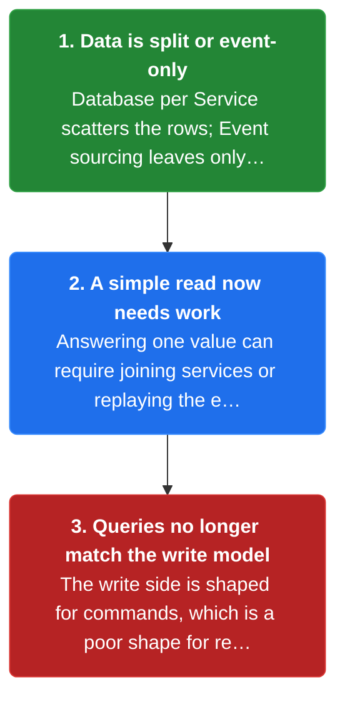
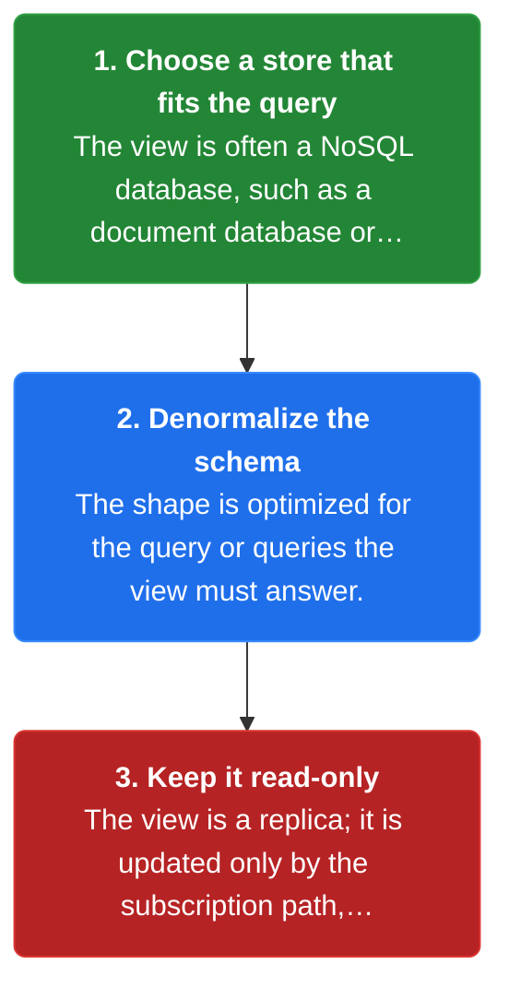
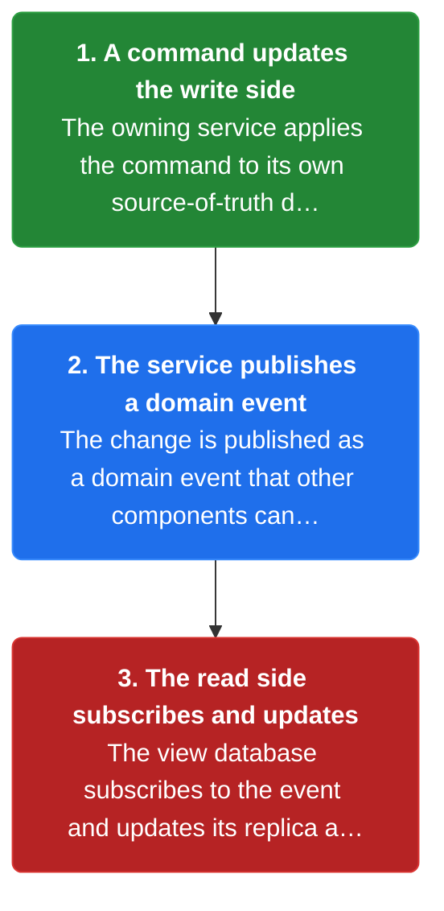
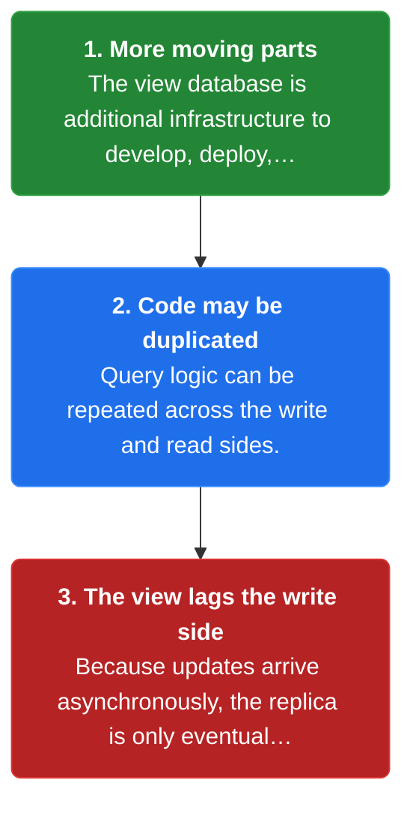

# Chapter 22: CQRS

> Define a read-only view database optimized for a query, kept up to date by subscribing to domain events published by the services that own the data.

_Also known as: Chris Richardson · Microservice Patterns Ch. 22 · microservices.io /patterns/data/cqrs.html_

## Flow

### Why current state gets hard to read

> **Why this matters:** Under Database per Service there is no shared table to join, and under Event sourcing the data is stored only as an event log — so the current state is no longer easily queried.



1. **Data is split or event-only** — Database per Service scatters the rows; Event sourcing leaves only appended events, not a current-state table.

2. **A simple read now needs work** — Answering one value can require joining services or replaying the event log.

3. **Queries no longer match the write model** — The write side is shaped for commands, which is a poor shape for reads.

```java
// QUERY SIDE — why current state is hard to read when only events are stored
// PARTIES: QR = a query reader · EVS = Event Store
// STATE (before):
//    event_log : [ {type:"order_created", order_id:"O-101", total:120.00},
//                  {type:"order_updated", order_id:"O-101", total:95.00} ]   // append-only, no current-state row
//    running : 0.00
//    current : null
// DEF: read_current_total · CALLED BY: QR asking for the order's current total
// -> order_id : "O-101"
//    step 1 · replay order_created    // running : 0.00 -> 120.00  BECAUSE the first event sets the total
//    step 2 · replay order_updated    // running : 120.00 -> 95.00  BECAUSE the second event overwrites the total
//    step 3 · fold to current state    // current : null -> 95.00
// <- current : 95.00  · produced by replaying 2 events, not by reading one row
//    alt the data lived in a current-state table : one row read returns 95.00 directly -> no replay needed
```

### Define the view database

> **Why this matters:** A view database is a read-only replica designed specifically to support one query or a group of related queries, with a schema and database type optimized for that query.



1. **Choose a store that fits the query** — The view is often a NoSQL database, such as a document database or a key-value store.

2. **Denormalize the schema** — The shape is optimized for the query or queries the view must answer.

3. **Keep it read-only** — The view is a replica; it is updated only by the subscription path, never by clients.

```java
// READ SIDE — the view database is a read-only replica optimized for its query
// PARTIES: VDB = View Database · QR = query reader
// STATE (before):
//    view_db : {}                             // the replica, empty and read-only by design
//    doc     : {}
// DEF: build_view_schema · CALLED BY: the team shaping the read side
// -> query : "order history for one customer"
//    step 1 · choose the store type    // store : "relational" -> "document"  BECAUSE the schema must match the query, and a document or key-value NoSQL store fits
//    step 2 · denormalize the shape    // doc : {} -> {customer_id:"C-77", orders:[{order_id:"O-101", total:120.00}, {order_id:"O-102", total:80.00}]}
//    step 3 · insert the view    // view_db : {} -> {"order_history":{customer_id:"C-77", orders:[{order_id:"O-101", total:120.00}, {order_id:"O-102", total:80.00}]}}
// <- view_db : {"order_history":{customer_id:"C-77", orders:[{order_id:"O-101", total:120.00}, {order_id:"O-102", total:80.00}]}}  · one document read answers the whole query
//    alt the read side reused a relational schema : the same query would need a multi-table JOIN across service-owned tables
```

### Keep the view up to date via domain events

> **Why this matters:** The application keeps the view database up to date by subscribing to domain events published by the services that own the data — a command updates the write side, and an event updates the read side.



1. **A command updates the write side** — The owning service applies the command to its own source-of-truth database.

2. **The service publishes a domain event** — The change is published as a domain event that other components can subscribe to.

3. **The read side subscribes and updates** — The view database subscribes to the event and updates its replica accordingly.

```java
// COMMAND, THEN READ SIDE — a write updates the write side, then an event updates the view
// PARTIES: WR = Order Service (write side) · BRK = message broker · RD = Order History Service (read side)
// STATE (before):
//    write_db : { "O-101": {total:120.00} }        // the source of truth, in WR
//    view_db  : { "O-101": {total:120.00} }        // the replica, about to go stale
//    outbox   : []                                 // WR's outbox of events to publish
// DEF: change_order_total · CALLED BY: WR receiving a command
// -> command : {"order_id":"O-101", "total":95.00}
//    step 1 · update the write side    // write_db : {"O-101":{total:120.00}} -> {"O-101":{total:95.00}}
//    step 2 · publish a domain event    // outbox : [] -> [{"type":"order_updated","order_id":"O-101","total":95.00}]
//    step 3 · RD subscribes and updates the view    // view_db : {"O-101":{total:120.00}} -> {"O-101":{total:95.00}}
// <- view_db : {"O-101":{total:95.00}}  · the replica caught up to the write side via the event
//    alt the event is delayed : view_db stays at {"O-101":{total:120.00}} -> the view is eventually consistent, not instant
```

### The tradeoffs

> **Why this matters:** CQRS buys fast, denormalized, scalable views, but at the cost of complexity, potential code duplication, and replication lag that leaves views eventually consistent.



1. **More moving parts** — The view database is additional infrastructure to develop, deploy, and run.

2. **Code may be duplicated** — Query logic can be repeated across the write and read sides.

3. **The view lags the write side** — Because updates arrive asynchronously, the replica is only eventually consistent.

```java
// READ SIDE — the view lags the write side, so it is only eventually consistent
// PARTIES: WR = Order Service · RD = Order History Service · BRK = message broker
// STATE (before):
//    write_db : { "O-101": {total:95.00} }        // just updated by WR
//    view_db  : { "O-101": {total:120.00} }       // still shows the old total
//    lag      : 0                                   // seconds behind the write side
// DEF: measure_lag · CALLED BY: RD watching its own staleness
// -> event : {"type":"order_updated","order_id":"O-101","total":95.00}   // published but not yet consumed by RD
//    step 1 · event sits in the broker queue    // lag : 0 -> 2  BECAUSE the event waits before RD processes it
//    step 2 · RD processes the event    // view_db : {"O-101":{total:120.00}} -> {"O-101":{total:95.00}}
//    step 3 · the view catches up    // lag : 2 -> 0  BECAUSE the replica now matches the write side
// <- view_db : {"O-101":{total:95.00}}  after a 2-second lag
//    alt a reader queries during the lag : it reads 120.00 from view_db -> the reader sees an older total than the write side holds
```


## Key Concepts

### The Problem

**Queries clash with the write model.** The current state is no longer easily queried, so reads cannot reuse the write model.


### The Solution

Define a read-only view database designed for a query, kept up to date by subscribing to domain events published by the services that own the data.


### Key Facts

| Fact | Detail | In the wild |
|---|---|---|
| The view database | Define a read-only view database designed for a query, kept up to date by subscribing to domain events published by the services that own the data. | The book's FTGO example uses an Order History Service that implements this pattern. |
| Fast views, more complexity | CQRS supports multiple denormalized views that are scalable and performant, and it separates the command and query models. | The cost is increased complexity — another store to build, deploy, and manage. |
| Eventually consistent views | Replication lag leaves the view eventually consistent, and query logic can be duplicated across sides. | A reader can briefly see a stale total until the event is consumed and the view catches up. |


### Tradeoffs & When

- CQRS supports multiple denormalized views that are scalable and performant, and it separates the command and query models.
- Replication lag leaves the view eventually consistent, and query logic can be duplicated across sides.


<details><summary>All concepts (index)</summary>

### Problem: Queries clash with the write model

**Why.** Database per Service splits the data, and Event sourcing stores only an append-only event log.

**Claim.** The current state is no longer easily queried, so reads cannot reuse the write model.

**Grounding.** The reference context: after applying these patterns, it is no longer straightforward to implement queries that join data, and event-sourced data is no longer easily queried.

**In the wild.** Reading an order's current total requires replaying its events or joining several services.
### Solution: The view database

**Why.** A read needs a store shaped for the read, not for the write.

**Claim.** Define a read-only view database designed for a query, kept up to date by subscribing to domain events published by the services that own the data.

**Grounding.** This is the reference solution; it notes the database type and schema are optimized for the query, often a NoSQL document or key-value store.

**In the wild.** The book's FTGO example uses an Order History Service that implements this pattern.
### Tradeoff: Fast views, more complexity

**Why.** The view is denormalized and purpose-built, so it reads fast and scales.

**Claim.** CQRS supports multiple denormalized views that are scalable and performant, and it separates the command and query models.

**Grounding.** These are the reference benefits, listed alongside being necessary in an event-sourced architecture.

**In the wild.** The cost is increased complexity — another store to build, deploy, and manage.
### Tradeoff: Eventually consistent views

**Why.** The replica is updated asynchronously from events, so it trails the source of truth.

**Claim.** Replication lag leaves the view eventually consistent, and query logic can be duplicated across sides.

**Grounding.** The reference drawbacks are increased complexity, potential code duplication, and replication lag / eventually consistent views.

**In the wild.** A reader can briefly see a stale total until the event is consumed and the view catches up.

</details>


## Quiz

1. What does the CQRS pattern define?

   - A. A shared database every service writes to
   - B. A read-only view database optimized for a query
   - C. A single SQL JOIN across service tables
   - D. A message queue for all commands

<details><summary>Reveal answer</summary>

**B.** The pattern defines a view database, a read-only replica designed specifically to support a query or a group of related queries. A shared database is the anti-pattern CQRS avoids, a cross-service JOIN is impossible, and a command queue is not the pattern.

</details>

2. How is the view database kept up to date?

   - A. Clients write directly to it
   - B. A nightly batch copy of every database
   - C. By subscribing to domain events published by the services that own the data
   - D. By a shared SQL trigger on the write side

<details><summary>Reveal answer</summary>

**C.** The reference states the application keeps the view up to date by subscribing to domain events published by the services that own the data. Direct client writes violate the read-only replica rule, and batch copies and SQL triggers are not the mechanism.

</details>

3. Which is a stated benefit of CQRS?

   - A. It removes the need for any database
   - B. It supports denormalized views that are scalable and performant
   - C. It guarantees strong consistency across services
   - D. It eliminates all code duplication

<details><summary>Reveal answer</summary>

**B.** The reference lists scalable, performant denormalized views, simpler command and query models, and being necessary in an event-sourced architecture as benefits. CQRS still needs databases, is only eventually consistent, and can duplicate code — ruling out A, C, and D.

</details>

4. Which is a stated drawback of CQRS?

   - A. It cannot work with Event sourcing
   - B. It forces every query to use API composition
   - C. Replication lag leaves views eventually consistent
   - D. It requires a single relational schema

<details><summary>Reveal answer</summary>

**C.** The reference drawbacks are increased complexity, potential code duplication, and replication lag / eventually consistent views. CQRS is often used with Event sourcing (not incompatible), and it is an alternative to API composition, not a trigger for it.

</details>

