# Chapter 22: CQRS

> Define a read-only view database optimized for a query, kept up to date by subscribing to domain events published by the services that own the data.

_Also known as: Chris Richardson · Microservice Patterns Ch. 22 · microservices.io /patterns/data/cqrs.html_

## Flow

### Why current state gets hard to read

> **Why this matters:** Under Database per Service there is no shared table to join, and under Event sourcing the data is stored only as an event log — so the current state is no longer easily queried.

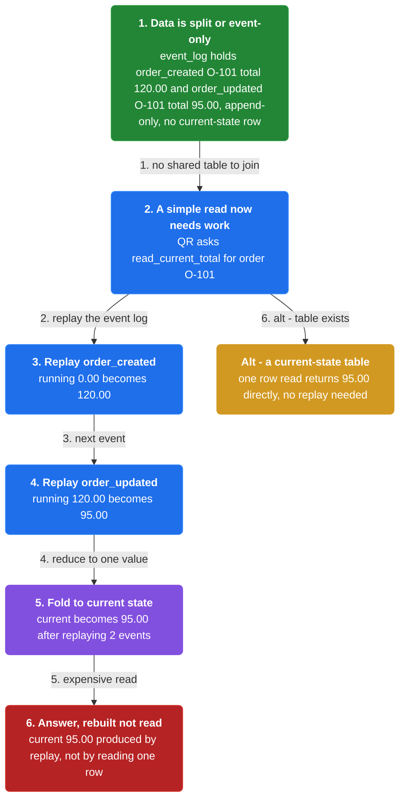

1. **Data is split or event-only** — Database per Service scatters the rows; Event sourcing leaves only appended events, not a current-state table.

2. **A simple read now needs work** — Answering one value can require joining services or replaying the event log.

3. **Queries no longer match the write model** — The write side is shaped for commands, which is a poor shape for reads.

```java
// QUERY SIDE — why current state is hard to read when only events are stored
// PARTIES: QR = a query reader · EVS = EventStoreDB 24 @ orders-events-1
// DEF: event — an immutable fact appended to the log; here {type:"order_created", order_id:"O-101", total:120.00}
// STATE (before):
//    event_log : [ {type:"order_created", order_id:"O-101", total:120.00},
//                  {type:"order_updated", order_id:"O-101", total:95.00} ]   // append-only, no current-state row
//    running : 0.00
//    current : null
// DEF: read_current_total · CALLED BY: QR asking for the order's current total
// -> order_id : "O-101"
//    step 1 · replay order_created    // running : 0.00 -> 120.00  BECAUSE the first event sets the total
//    step 2 · replay order_updated    // running : 120.00 -> 95.00  BECAUSE the second event overwrites the total
//    step 3 · fold to current state    // current : null -> 95.00
// <- current : 95.00  · produced by replaying 2 events, not by reading one row
//    alt the data lived in a current-state table : one row read returns 95.00 directly -> no replay needed
```

### Define the view database

> **Why this matters:** A view database is a read-only replica designed specifically to support one query or a group of related queries, with a schema and database type optimized for that query.

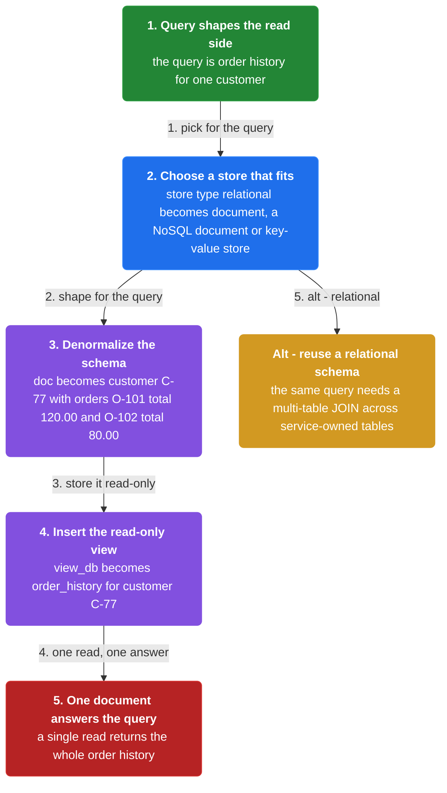

1. **Choose a store that fits the query** — The view is often a NoSQL database, such as a document database or a key-value store.

2. **Denormalize the schema** — The shape is optimized for the query or queries the view must answer.

3. **Keep it read-only** — The view is a replica; it is updated only by the subscription path, never by clients.

```java
// READ SIDE — the view database is a read-only replica optimized for its query
// PARTIES: VDB = MongoDB 7 @ orders-view-1 · QR = query reader
// DEF: view — a precomputed, denormalized read model for ONE query; here {"order_history":{customer_id:"C-77", orders:[{order_id:"O-101", total:120.00}, {order_id:"O-102", total:80.00}]}}
// DEF: db — a database holding records = a keyed store; here view_db = {"order_history":{customer_id:"C-77", orders:[{order_id:"O-101", total:120.00}, {order_id:"O-102", total:80.00}]}}
// STATE (before):
//    view_db : {}                             // the replica, empty and read-only by design
//    doc     : {}
// DEF: build_view_schema · CALLED BY: the team shaping the read side
// -> query : "order history for one customer"
//    step 1 · choose the store type    // store : "relational" -> "document"  BECAUSE the schema must match the query, and a document or key-value NoSQL store fits
//    step 2 · denormalize the shape    // doc : {} -> {customer_id:"C-77", orders:[{order_id:"O-101", total:120.00}, {order_id:"O-102", total:80.00}]}
//    step 3 · insert the view    // view_db : {} -> {"order_history":{customer_id:"C-77", orders:[{order_id:"O-101", total:120.00}, {order_id:"O-102", total:80.00}]}}
// <- view_db : {"order_history":{customer_id:"C-77", orders:[{order_id:"O-101", total:120.00}, {order_id:"O-102", total:80.00}]}}  · one document read answers the whole query
//    alt the read side reused a relational schema : the same query would need a multi-table JOIN across service-owned tables
```

### Keep the view up to date via domain events

> **Why this matters:** The application keeps the view database up to date by subscribing to domain events published by the services that own the data — a command updates the write side, and an event updates the read side.

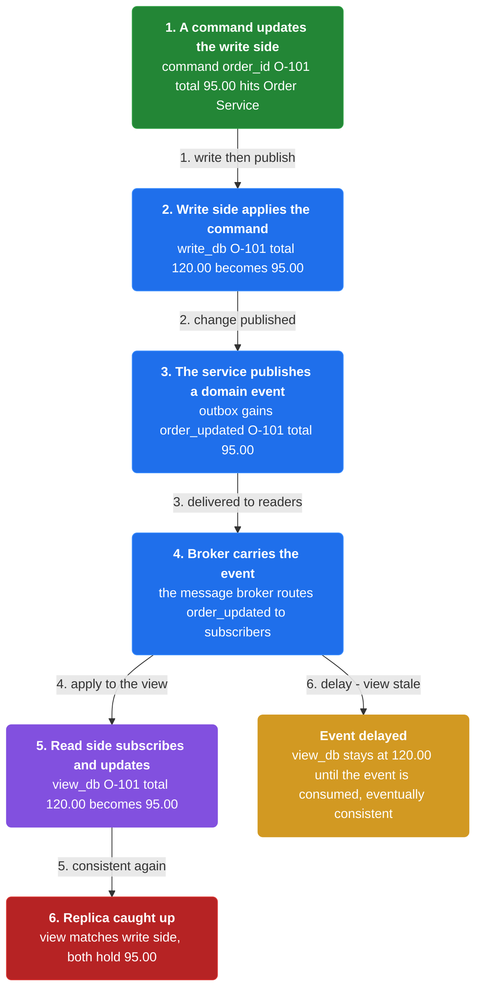

1. **A command updates the write side** — The owning service applies the command to its own source-of-truth database.

2. **The service publishes a domain event** — The change is published as a domain event that other components can subscribe to.

3. **The read side subscribes and updates** — The view database subscribes to the event and updates its replica accordingly.

```java
// COMMAND, THEN READ SIDE — a write updates the write side, then an event updates the view
// PARTIES: WR = Order Service (write side) · BRK = message broker · RD = Order History Service (read side)
// DEF: db — a database holding an order row = a keyed store; here write_db = {"O-101":{total:120.00}} and view_db = {"O-101":{total:120.00}}
// DEF: view — the read-only replica updated by subscribed domain events = a keyed store; here view_db = {"O-101":{total:120.00}} -> {"O-101":{total:95.00}}
// DEF: write — the source-of-truth side updated by commands = a keyed store; here write_db = {"O-101":{total:120.00}} -> {"O-101":{total:95.00}}
// STATE (before):
//    write_db : { "O-101": {total:120.00} }        // the source of truth, in WR
//    view_db  : { "O-101": {total:120.00} }        // the replica, about to go stale
//    outbox   : []                                 // WR's outbox of events to publish
// DEF: change_order_total · CALLED BY: WR receiving a command
// -> command : {"order_id":"O-101", "total":95.00}
//    step 1 · update the write side    // write_db : {"O-101":{total:120.00}} -> {"O-101":{total:95.00}}
//    step 2 · publish a domain event    // outbox : [] -> [{"type":"order_updated","order_id":"O-101","total":95.00}]
//    step 3 · RD subscribes and updates the view    // view_db : {"O-101":{total:120.00}} -> {"O-101":{total:95.00}}
// <- view_db : {"O-101":{total:95.00}}  · the replica caught up to the write side via the event
//    alt the event is delayed : view_db stays at {"O-101":{total:120.00}} -> the view is eventually consistent, not instant
```

### The tradeoffs

> **Why this matters:** CQRS buys fast, denormalized, scalable views, but at the cost of complexity, potential code duplication, and replication lag that leaves views eventually consistent.

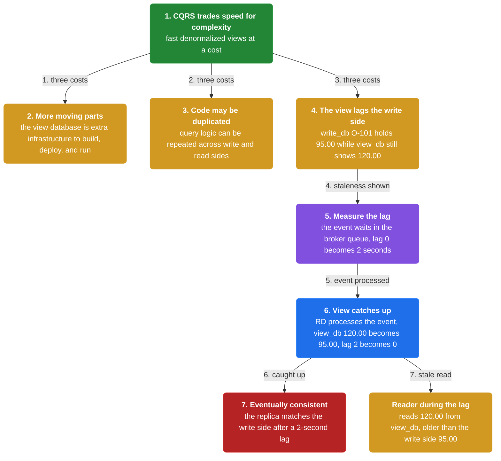

1. **More moving parts** — The view database is additional infrastructure to develop, deploy, and run.

2. **Code may be duplicated** — Query logic can be repeated across the write and read sides.

3. **The view lags the write side** — Because updates arrive asynchronously, the replica is only eventually consistent.

```java
// READ SIDE — the view lags the write side, so it is only eventually consistent
// PARTIES: WR = Order Service · RD = Order History Service · BRK = message broker
// DEF: db — a database holding an order row = a keyed store; here write_db = {"O-101":{total:95.00}} and view_db = {"O-101":{total:120.00}}
// DEF: view — the read-only replica that lags behind the write side = a keyed store; here view_db = {"O-101":{total:120.00}} while the write side holds 95.00
// DEF: write — the source-of-truth side = a keyed store; here write_db = {"O-101":{total:95.00}}
// STATE (before):
//    write_db : { "O-101": {total:95.00} }        // just updated by WR
//    view_db  : { "O-101": {total:120.00} }       // still shows the old total
//    lag      : 0                                   // seconds behind the write side
// DEF: measure_lag · CALLED BY: RD watching its own staleness
// -> event : {"type":"order_updated","order_id":"O-101","total":95.00}   // published but not yet consumed by RD
//    step 1 · event sits in the broker queue    // lag : 0 -> 2  BECAUSE the event waits before RD processes it
//    step 2 · RD processes the event    // view_db : {"O-101":{total:120.00}} -> {"O-101":{total:95.00}}
//    step 3 · the view catches up    // lag : 2 -> 0  BECAUSE the replica now matches the write side
// <- view_db : {"O-101":{total:95.00}}  after a 2-second lag
//    alt a reader queries during the lag : it reads 120.00 from view_db -> the reader sees an older total than the write side holds
```


## System Design Interview

**The pipeline:** command side → event store → projections → query side

### Order Service — command side

_Role: command side_

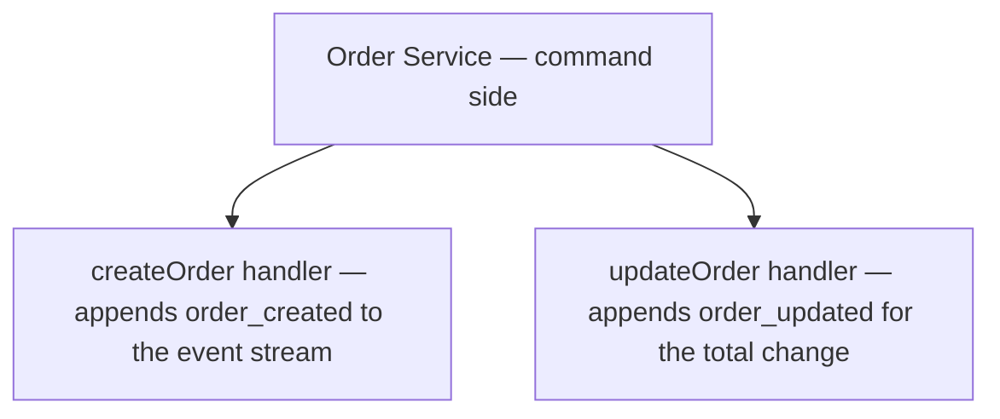

### Event store — the write model

_Role: event store_

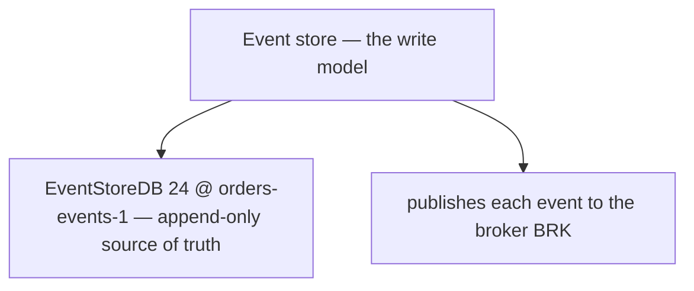

### Order History Service — query side

_Role: projections + query side_

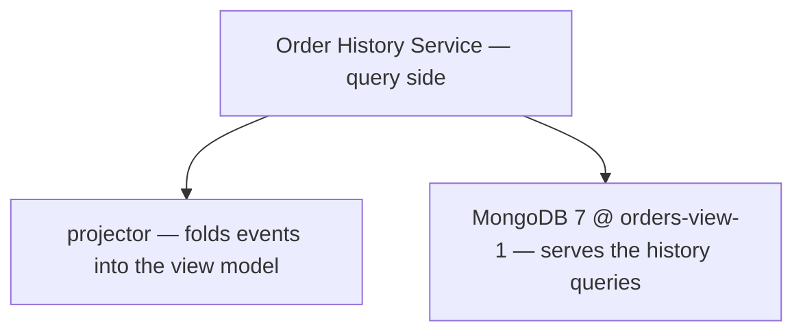

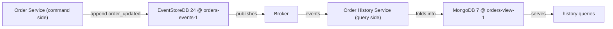

```java
// SYSTEM DESIGN — CQRS: command side -> event store -> projections -> query side, one order updated end to end
// PARTIES: SVC = Order Service (command side) · ES = EventStoreDB 24 @ orders-events-1 · OH = Order History Service (query side) · VDB = MongoDB 7 @ orders-view-1
// DEF: event — an append-only fact in the write model; here order_created {"orderId":"O-101","total":120.00} then order_updated {"total":95.00}
// DEF: projection — a read model the query side folds events into; here the order total, 120.00 -> 95.00
// STATE (before):
//    events : []                        // the event stream for order O-101, empty
//    view : { "O-101": { "total": 120.00 } }   // the read model before the update
// DEF: update_order · CALLED BY: SVC when the customer changes order O-101
// -> order_id : "O-101"
//    step 1 · SVC appends order_updated to the event store   // events : [] -> ["order_created","order_updated"]   BECAUSE the command side writes events, not tables
//    step 2 · ES publishes the event to the broker, OH folds it in   // view["O-101"].total : 120.00 -> 95.00   BECAUSE the projector subtracts the change from the old total
//    step 3 · VDB stores the updated view and serves the query   // query : 0 -> 1   BECAUSE the query side reads its own materialized view
// <- outcome : view["O-101"].total = 95.00 · a command wrote once, a projection read once, the write and read models stay separate
```

## Interview Questions

### Q1

Your order service writes to a normalized Order table, but queries must compute totals, discounts, and joins by replaying past events every time. Reads have become expensive and slow.

**Interviewer's question:** Why does the current state get hard to read when the write model is normalized, and what does CQRS change?

**Solution:** A normalized write model makes reads require costly joins and replay; CQRS defines separate query and command models so reads use a shape optimized for them.

**System-design components:**
- Write model — normalized, for commands
- Read model — for queries
- Replay — what reads must avoid
- CQRS — separates the two models

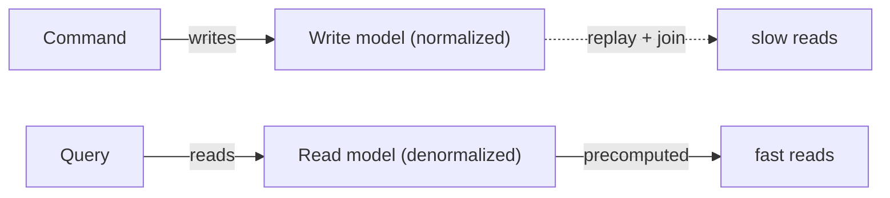

```java
// ORDER SERVICE SIDE — the problem CQRS fixes: reading the current state from a normalized write model means replaying and joining
// PARTIES: SVC = Order Service · WM = the normalized write model
// STATE (before):
//    events : [{ type:"order_created", total:120.00 }, { type:"order_updated", total:95.00 }]
//    computed : { total:"none" }
// DEF: read_order_total · CALLED BY: a query on the normalized write model
// -> order_id : "PO-77"
//    step 1 · replay event 1 : computed.total : "none" -> 120.00
//    step 2 · replay event 2 : computed.total : 120.00 -> 95.00   BECAUSE order_updated changed the total
//    step 3 · join with other tables to finish the read : computed.total : 95.00 -> 95.00 (plus joins)
// <- outcome : computed.total : 95.00 · every read replays events and joins, so a dedicated read model would be faster
```

_This is CQRS's motivation — the normalized write model makes reads expensive, so queries need their own model._

_Covers:_ Why current state gets hard to read

_From the 28 problems:_ 21-ad-click-aggregation · 13-search-autocomplete

### Q2

You want a query that returns an order with its customer name and line totals in one lookup, without any join at read time.

**Interviewer's question:** How does the view database serve queries, and what does a denormalized document look like?

**Solution:** The query side uses a view database whose data is denormalized into documents matching the query shape, so a read is a single lookup.

**System-design components:**
- View database — the query-side store
- Denormalized document — matches the query
- Document store — the storage engine
- Single lookup — how the read is served

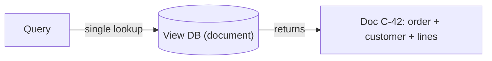

```java
// ORDER SERVICE SIDE — the view database serves queries from a denormalized document, one lookup per read
// PARTIES: QRY = the query · VDB = MongoDB 7 @ orders-view-1 (document store)
// STATE (before):
//    docs : {}
// DEF: build_view_document · CALLED BY: VDB when the view is materialized
// -> order_id : "C-42"
//    step 1 · denormalize the order plus its customer and lines : doc : "none" -> { id:"C-42", total:95.00, customer:"Ada", lines:[{sku:"B-9",qty:2}] }
//    step 2 · store the document : docs : {} -> { "C-42" : { id:"C-42", total:95.00, customer:"Ada", lines:[...] } }
//    step 3 · serve the read as one lookup : read : "none" -> docs["C-42"]
// <- outcome : read : { id:"C-42", total:95.00, customer:"Ada" } · the query is one document read, no join at query time
```

_This is CQRS's view database — denormalized documents make each read a single lookup._

_Covers:_ Define the view database

_From the 28 problems:_ 21-ad-click-aggregation · 13-search-autocomplete

### Q3

The write model updated an order's total, and the view database still shows the old number. You want the view to track the write model as changes happen.

**Interviewer's question:** How does the view database stay up to date with the write model?

**Solution:** The view is updated by subscribing to domain events published by the write model; each event handler updates the corresponding document.

**System-design components:**
- Write model — publishes events
- OrderUpdated event — carries the change
- View database — stores the document
- Event handler — applies the update

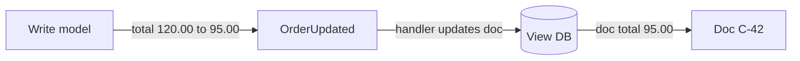

```java
// ORDER SERVICE SIDE — the view stays up to date by consuming the write model's domain events
// PARTIES: WM = the write model · EVT = a domain event · VDB = MongoDB 7 @ orders-view-1
// STATE (before):
//    write_db : { id:"C-42", total:120.00 }
//    view_db : { id:"C-42", total:120.00 }
// DEF: update_total · CALLED BY: WM on a command
// -> order_id : "C-42" · -> new_total : 95.00
//    step 1 · write model updates its own data : write_db["C-42"].total : 120.00 -> 95.00
//    step 2 · write model publishes the event : event : "none" -> { type:"OrderUpdated", order_id:"C-42", total:95.00 }
//    step 3 · view handler applies the event : view_db["C-42"].total : 120.00 -> 95.00   BECAUSE the handler copied the new total into the document
// <- outcome : view_db : { id:"C-42", total:95.00 } · the view now matches the write model
```

_This is CQRS keeping the view up to date — domain events from the write model drive the view database._

_Covers:_ Keep the view up to date via domain events

_From the 28 problems:_ 21-ad-click-aggregation · 13-search-autocomplete

### Q4

Immediately after an order total changed, a reader queries the view and still sees the old total for a short while before it catches up.

**Interviewer's question:** Why is a CQRS view eventually consistent, and what does a reader observe during the lag?

**Solution:** The view updates asynchronously after the write's event is delivered, so a reader can see the previous total until the handler applies the event.

**System-design components:**
- Write model — commits and publishes
- Event delivery — asynchronous
- View handler — applies the event later
- Reader — observes the lag

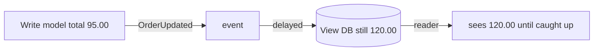

```java
// ORDER SERVICE SIDE — the view is eventually consistent, so a reader can see the old total during the lag window
// PARTIES: WM = the write model · VDB = MongoDB 7 @ orders-view-1 · READER = a client querying the view
// STATE (before):
//    view_db : { id:"C-42", total:120.00 }
//    write_db : { id:"C-42", total:95.00 }
//    lag : 0
// DEF: update_total · CALLED BY: WM at t=0ms
// -> order_id : "C-42" · -> new_total : 95.00
//    step 1 · write model commits : write_db["C-42"].total : 120.00 -> 95.00
//    step 2 · the event is queued but the view has not applied it yet : view_db["C-42"].total : 120.00 -> 120.00 · lag : 0 -> 2   BECAUSE delivery and handling are asynchronous
// <- state : view_db still 120.00 · a reader querying now sees 120.00, the old total
// DEF: apply_event · CALLED BY: VDB when the event arrives
// -> event : { type:"OrderUpdated", order_id:"C-42", total:95.00 }
//    step 1 · handler applies the event : view_db["C-42"].total : 120.00 -> 95.00
//    step 2 · the view catches up : lag : 2 -> 0
// <- outcome : view_db : { id:"C-42", total:95.00 } · the reader who waited now sees 95.00
```

_This is CQRS's eventual-consistency tradeoff — the view lags the write model until its event is applied._

_Covers:_ The tradeoffs

_From the 28 problems:_ 21-ad-click-aggregation · 13-search-autocomplete

## Key Concepts

### The Problem

**Queries clash with the write model.** The current state is no longer easily queried, so reads cannot reuse the write model.


### The Solution

Define a read-only view database designed for a query, kept up to date by subscribing to domain events published by the services that own the data.


### Key Facts

| Fact | Detail | In the wild |
|---|---|---|
| The view database | Define a read-only view database designed for a query, kept up to date by subscribing to domain events published by the services that own the data. | The book's FTGO example uses an Order History Service that implements this pattern. |
| Fast views, more complexity | CQRS supports multiple denormalized views that are scalable and performant, and it separates the command and query models. | The cost is increased complexity — another store to build, deploy, and manage. |
| Eventually consistent views | Replication lag leaves the view eventually consistent, and query logic can be duplicated across sides. | A reader can briefly see a stale total until the event is consumed and the view catches up. |


### Tradeoffs & When

- CQRS supports multiple denormalized views that are scalable and performant, and it separates the command and query models.
- Replication lag leaves the view eventually consistent, and query logic can be duplicated across sides.


<details><summary>All concepts (index)</summary>

### Problem: Queries clash with the write model

**Why.** Database per Service splits the data, and Event sourcing stores only an append-only event log.

**Claim.** The current state is no longer easily queried, so reads cannot reuse the write model.

**Grounding.** The reference context: after applying these patterns, it is no longer straightforward to implement queries that join data, and event-sourced data is no longer easily queried.

**In the wild.** Reading an order's current total requires replaying its events or joining several services.
### Solution: The view database

**Why.** A read needs a store shaped for the read, not for the write.

**Claim.** Define a read-only view database designed for a query, kept up to date by subscribing to domain events published by the services that own the data.

**Grounding.** This is the reference solution; it notes the database type and schema are optimized for the query, often a NoSQL document or key-value store.

**In the wild.** The book's FTGO example uses an Order History Service that implements this pattern.
### Tradeoff: Fast views, more complexity

**Why.** The view is denormalized and purpose-built, so it reads fast and scales.

**Claim.** CQRS supports multiple denormalized views that are scalable and performant, and it separates the command and query models.

**Grounding.** These are the reference benefits, listed alongside being necessary in an event-sourced architecture.

**In the wild.** The cost is increased complexity — another store to build, deploy, and manage.
### Tradeoff: Eventually consistent views

**Why.** The replica is updated asynchronously from events, so it trails the source of truth.

**Claim.** Replication lag leaves the view eventually consistent, and query logic can be duplicated across sides.

**Grounding.** The reference drawbacks are increased complexity, potential code duplication, and replication lag / eventually consistent views.

**In the wild.** A reader can briefly see a stale total until the event is consumed and the view catches up.

</details>


## Quiz

1. What does the CQRS pattern define?

   - A. A shared database every service writes to
   - B. A read-only view database optimized for a query
   - C. A single SQL JOIN across service tables
   - D. A message queue for all commands

<details><summary>Reveal answer</summary>

**B.** The pattern defines a view database, a read-only replica designed specifically to support a query or a group of related queries. A shared database is the anti-pattern CQRS avoids, a cross-service JOIN is impossible, and a command queue is not the pattern.

</details>

2. How is the view database kept up to date?

   - A. Clients write directly to it
   - B. A nightly batch copy of every database
   - C. By subscribing to domain events published by the services that own the data
   - D. By a shared SQL trigger on the write side

<details><summary>Reveal answer</summary>

**C.** The reference states the application keeps the view up to date by subscribing to domain events published by the services that own the data. Direct client writes violate the read-only replica rule, and batch copies and SQL triggers are not the mechanism.

</details>

3. Which is a stated benefit of CQRS?

   - A. It removes the need for any database
   - B. It supports denormalized views that are scalable and performant
   - C. It guarantees strong consistency across services
   - D. It eliminates all code duplication

<details><summary>Reveal answer</summary>

**B.** The reference lists scalable, performant denormalized views, simpler command and query models, and being necessary in an event-sourced architecture as benefits. CQRS still needs databases, is only eventually consistent, and can duplicate code — ruling out A, C, and D.

</details>

4. Which is a stated drawback of CQRS?

   - A. It cannot work with Event sourcing
   - B. It forces every query to use API composition
   - C. Replication lag leaves views eventually consistent
   - D. It requires a single relational schema

<details><summary>Reveal answer</summary>

**C.** The reference drawbacks are increased complexity, potential code duplication, and replication lag / eventually consistent views. CQRS is often used with Event sourcing (not incompatible), and it is an alternative to API composition, not a trigger for it.

</details>

