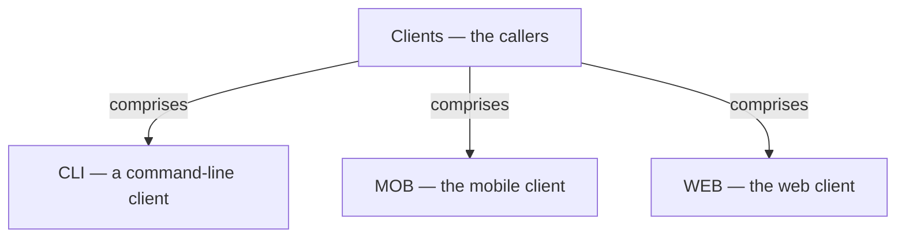
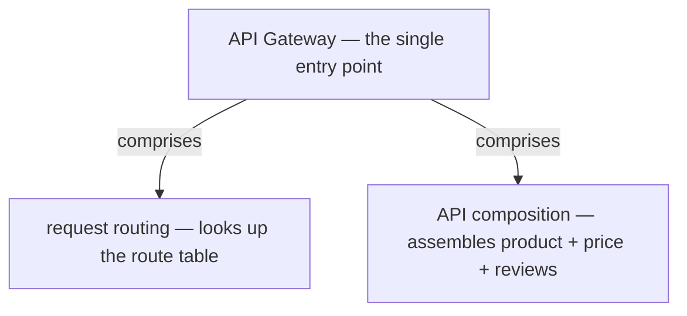
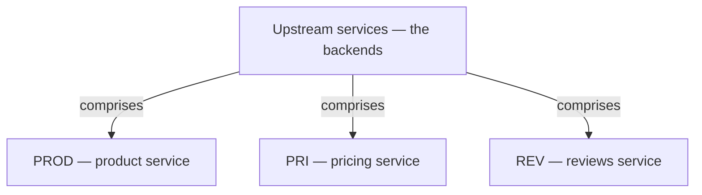

# Chapter 23: API Gateway

> Implement an API gateway that is the single entry point for all clients, proxying some requests and fanning others out to multiple services.

_Also known as: Chris Richardson · Microservice Patterns Ch. 23 · microservices.io /patterns/apigateway.html_

## Flow

### Why clients cannot chase fine-grained APIs

> **Why this matters:** Microservices expose fine-grained APIs, so one page needs data from many services — and a slow mobile network can only afford a few round-trips.

1. **One page spans many services** — Product details data is spread over Product Info, Pricing, Order, Inventory, Review, and more.

2. **Clients must call each service** — A client needing the details of one product must fetch data from numerous services.

3. **Mobile can only afford a few calls** — A mobile network is much slower, so the client should make few round-trips.

```java
// CLIENT SIDE — before a gateway, one client talks to many services directly
// PARTIES: MOB = mobile client · PROD = Product Info Service · PRI = Pricing Service · INV = Inventory Service · REV = Review Service
// STATE (before):
//    page : {}                              // the product page the client assembles
//    roundtrips : 0                          // network calls made so far
// DEF: render_product_page · CALLED BY: MOB displaying one product
// -> product : "P-9"                         // the product the client must display
//    step 1 · call PROD    // page : {} -> {title:"POJOs in Action", author:"Chris Richardson"}  · roundtrips : 0 -> 1
//    step 2 · call PRI     // page : {title:"POJOs in Action", author:"Chris Richardson"} -> {title:"POJOs in Action", author:"Chris Richardson", price:39.99}  · roundtrips : 1 -> 2
//    step 3 · call INV     // page : {title:"POJOs in Action", author:"Chris Richardson", price:39.99} -> {title:"POJOs in Action", author:"Chris Richardson", price:39.99, stock:3}  · roundtrips : 2 -> 3
//    step 4 · call REV     // page : {title:"POJOs in Action", author:"Chris Richardson", price:39.99, stock:3} -> {title:"POJOs in Action", author:"Chris Richardson", price:39.99, stock:3, reviews:12}  · roundtrips : 3 -> 4
// <- page : {title:"POJOs in Action", author:"Chris Richardson", price:39.99, stock:3, reviews:12}  · 4 round-trips over a slow mobile network
//    alt the client is on a LAN : 4 round-trips are cheap -> a server-side web app can afford them, the mobile client cannot
```

### Proxy a request to one service

> **Why this matters:** The gateway handles a request in two ways: some are simply proxied or routed to the appropriate service, while others fan out.

1. **The client hits the single entry point** — Every client sends its request to the API gateway, not to individual services.

2. **The gateway routes to the right service** — For a simple request, the gateway proxies it to the appropriate service.

3. **The response returns through the gateway** — The client receives the answer without learning the service instance or location.

```java
// GATEWAY SIDE — a simple request is proxied straight to one service
// PARTIES: CLI = client · GW = API Gateway · PROD = Product Info Service
// DEF: route — a path-to-service mapping the gateway proxies on = one entry of route_table; here route_table maps "/products" -> "PROD"
// STATE (before):
//    route_table : {"/products" : "PROD"}      // the gateway's route map
//    response : null
// DEF: route_request · CALLED BY: GW handling one request
// -> request : "GET /products/P-9"             // the client sends one request to the gateway
//    step 1 · match the path    // path : null -> "/products"  BECAUSE the gateway looks the URL up in its route table
//    step 2 · forward to the service    // target : null -> "PROD"  BECAUSE route_table maps "/products" to the Product Info Service
//    step 3 · return the response    // response : null -> {title:"POJOs in Action", author:"Chris Richardson"}
// <- response : {title:"POJOs in Action", author:"Chris Richardson"}  · the client never learned PROD's host or port
//    alt the route table changes : "/products" now maps to "PROD-v2" -> the client keeps sending to the gateway unchanged
```

### Fan out to many services

> **Why this matters:** For a page that needs several services, the gateway fans out to multiple services and returns one composed response, cutting the client down to a single round-trip.

1. **One request enters the gateway** — The client sends a single request for the whole page.

2. **The gateway fans out** — The gateway calls the several services that own pieces of the page.

3. **The gateway composes and returns** — It merges the partial results and sends one response back to the client.

```java
// GATEWAY SIDE — a page request is handled by fanning out to multiple services
// PARTIES: CLI = client · GW = API Gateway · PROD = Product Info Service · PRI = Pricing Service · REV = Review Service
// STATE (before):
//    response : {}                              // the composed response the gateway builds
// DEF: compose_product_details · CALLED BY: GW answering one page request
// -> request : "GET /product/P-9"               // the client sends one request, not four
//    step 1 · call PROD    // response : {} -> {title:"POJOs in Action", author:"Chris Richardson"}
//    step 2 · call PRI     // response : {title:"POJOs in Action", author:"Chris Richardson"} -> {title:"POJOs in Action", author:"Chris Richardson", price:39.99}
//    step 3 · call REV     // response : {title:"POJOs in Action", author:"Chris Richardson", price:39.99} -> {title:"POJOs in Action", author:"Chris Richardson", price:39.99, reviews:12}
// <- response : {title:"POJOs in Action", author:"Chris Richardson", price:39.99, reviews:12}  · one round-trip for the client
//    alt one service call fails : the gateway's circuit breaker opens -> the gateway returns a partial page instead of hanging
```

### The costs and variations

> **Why this matters:** The gateway adds a network hop and is another moving part, but it also insulates clients from partitioning and instance locations — and can expose a different API per client.

1. **An extra hop, usually insignificant** — Every request passes through the gateway, adding one more network leg.

2. **A different API per client** — Rather than one-size-fits-all, the gateway can expose an API suited to each client.

3. **A Backends for frontends variation** — A separate gateway per client type is the Backends for frontends variation.

```java
// GATEWAY SIDE — the gateway adds one network hop, a small and usually insignificant cost
// PARTIES: CLI = client · GW = API Gateway · PROD = Product Info Service
// STATE (before):
//    hops : []                                // network legs recorded so far
//    latency_ms : 0                            // total time tallied
// DEF: measure_hop · CALLED BY: GW tallying one request's latency
// -> request : "GET /product/P-9"
//    step 1 · CLI to GW    // hops : [] -> ["CLI->GW"]  · latency_ms : 0 -> 12
//    step 2 · GW to PROD   // hops : ["CLI->GW"] -> ["CLI->GW","GW->PROD"]  · latency_ms : 12 -> 24
//    step 3 · back to CLI  // hops : ["CLI->GW","GW->PROD"] -> ["CLI->GW","GW->PROD","GW->CLI"]  · latency_ms : 24 -> 36
// <- latency_ms : 36 over 3 hops  · the extra gateway hop added 12 ms, insignificant for most applications
//    alt no gateway existed : the client calls PROD directly in 24 ms -> but it must then locate and call every other service itself
```


## System Design Interview

> **The question:** Design one entry point for many services. Premise: a client sends one product request to the gateway, which composes calls to upstream services and returns one response, so clients never talk to services directly.

**The pipeline:** client → gateway → upstream services

### Clients — the callers

_Role: client_



### API Gateway — the single entry point

_Role: gateway_



### Upstream services — the backends

_Role: upstream services_



```java
// SYSTEM DESIGN — API gateway: client -> gateway -> upstream services, one product request composed end to end
// PARTIES: WEB = the web client · GW = API Gateway · PROD = Product service · PRI = Pricing service · REV = Reviews service
// DEF: route — a path-to-backend mapping in the gateway's routing table; here "/products" -> "PROD"
// STATE (before):
//    routes : { "/products": "PROD" }   // the gateway's routing table, one entry
//    response : {}                      // the composed product view, empty
// DEF: get_product · CALLED BY: WEB requesting the product page for P-9
// -> path : "/products/P-9"
//    step 1 · GW looks up the route table   // match : "" -> "PROD"   BECAUSE /products is registered to the product service
//    step 2 · GW calls PROD for the product, PRI for the price, and REV for the reviews   // gathered : 0 -> 3   BECAUSE the gateway composes several upstream calls into one response
//    step 3 · GW assembles the pieces and returns one JSON   // response : {} -> {"id":"P-9","price":39.99,"stock":3,"reviews":12}
// <- outcome : response = {"id":"P-9","price":39.99,"stock":3,"reviews":12} · one client call, three upstream calls, one composed reply
```

## Interview Questions

### Q1

A mobile client starts returning 404s on the product page. The on-call engineer suspects the gateway is sending "/products" to the wrong service and wants to trace exactly what the gateway does with one request.

**Interviewer's question:** Walk me through how the API gateway proxies a simple request — what does it look up, what does it forward, and why does the client never learn the service's location?

**Solution:** The gateway matches the request path against its route table and proxies the request to the mapped service, then returns the response without exposing the service host or port.

**System-design components:**
- Mobile client
- API gateway
- route_table (path to service)
- Product Info Service

```java
// GATEWAY SIDE — a GET /products/P-9 is proxied through a route-table lookup
// PARTIES: CLI = mobile client · GW = API gateway · PROD = Product Info Service
// DEF: route — one path-to-service entry the gateway proxies on; here route_table["/products"] = "PROD"
// STATE (before):
//    route_table : {"/products" : "PROD", "/pricing" : "PRI"}   // the gateway's route map
//    path : ""                               // the path parsed out of the request URL
//    target : ""                             // the service the gateway will call
//    response : null                         // what comes back from the service
// DEF: route_request · CALLED BY: CLI sending one request to the gateway
// -> request : "GET /products/P-9"
//    step 1 · parse the URL path    path : "" -> "/products"  BECAUSE the gateway strips the host and query string to find the path
//    step 2 · look the path up    target : "" -> "PROD"  BECAUSE route_table["/products"] maps to the Product Info Service
//    step 3 · forward and read back    response : null -> {"title":"POJOs in Action","author":"Chris Richardson"}  BECAUSE PROD answers the proxied request
// <- response : {"title":"POJOs in Action","author":"Chris Richardson"} · the client never learned PROD's host or port
//    alt route_table changes : route_table["/products"] : "PROD" -> "PROD-v2"  BECAUSE a new version is deployed -> the client keeps sending to the gateway unchanged
```

_This is the gateway's proxy-a-request-to-one-service path from the chapter, plus the insulation benefit of the single entry point._

_Covers:_ Proxy a request to one service · The costs and variations

_From the 28 problems:_ 01-scale-from-zero-to-millions · 03-framework-for-system-design-interviews

### Q2

The product details page needs the title and author from Product Info, the price from Pricing, and the review count from Review. The mobile client is on a slow network and can afford only one round-trip.

**Interviewer's question:** How does the gateway turn one request into a composed page, and what happens to the client's round-trip count versus calling each service directly?

**Solution:** The gateway fans out to each service that owns a piece of the page, merges the partial results, and returns one composed response — one round-trip for the client instead of one per service.

**System-design components:**
- Mobile client
- API gateway
- Product Info Service
- Pricing Service
- Review Service

```java
// GATEWAY SIDE — one page request fans out to three services and returns one composed response
// PARTIES: CLI = client · GW = API gateway · PROD = Product Info Service · PRI = Pricing Service · REV = Review Service
// DEF: composed — the merged response GW returns to the client; here {title:"POJOs in Action", price:39.99, reviews:12}
// STATE (before):
//    response : {}                           // the composed page being assembled
//    roundtrips : 0                          // network calls the client makes
// DEF: compose_product_details · CALLED BY: GW answering one page request
// -> request : "GET /product/P-9"
//    step 1 · call PROD    response : {} -> {"title":"POJOs in Action","author":"Chris Richardson"}
//    step 2 · call PRI     response : {"title":"POJOs in Action","author":"Chris Richardson"} -> {"title":"POJOs in Action","author":"Chris Richardson","price":39.99}
//    step 3 · call REV     response : {"title":"POJOs in Action","author":"Chris Richardson","price":39.99} -> {"title":"POJOs in Action","author":"Chris Richardson","price":39.99,"reviews":12}
//    step 4 · send one reply    roundtrips : 0 -> 1  BECAUSE the gateway fans out internally, so the client makes one round-trip instead of three
// <- response : {"title":"POJOs in Action","author":"Chris Richardson","price":39.99,"reviews":12} · roundtrips : 1
//    alt one service call fails : the gateway's circuit breaker opens -> the gateway returns a partial page instead of hanging
```

_This is the fan-out-to-many-services path: the gateway composes one response and cuts the client down to a single round-trip._

_Covers:_ Fan out to many services · Why clients cannot chase fine-grained APIs

_From the 28 problems:_ 01-scale-from-zero-to-millions · 03-framework-for-system-design-interviews

### Q3

A latency review flags that every request now passes through the gateway. The team wants to quantify the extra hop before deciding whether the gateway is worth it for a latency-sensitive client.

**Interviewer's question:** How do you measure the cost the gateway adds, and how does that hop trade off against the round-trips it saves?

**Solution:** Measure the per-hop latency: the gateway adds one network leg (client to gateway to service and back), a cost the chapter calls usually insignificant for most applications, in exchange for fewer client round-trips.

**System-design components:**
- Client
- API gateway
- Product Info Service
- latency tally

```java
// GATEWAY SIDE — measure the extra hop the gateway adds to every request
// PARTIES: CLI = client · GW = API gateway · PROD = Product Info Service
// DEF: hop — one network leg between two parties; here the leg "CLI->GW" = 8 ms
// STATE (before):
//    hops : []                               // network legs recorded so far
//    latency_ms : 0                          // total time tallied
// DEF: measure_request · CALLED BY: GW tallying one request's latency
// -> request : "GET /product/P-9"
//    step 1 · CLI sends to GW    hops : [] -> ["CLI->GW"]  · latency_ms : 0 -> 8
//    step 2 · GW proxies to PROD    hops : ["CLI->GW"] -> ["CLI->GW","GW->PROD"]  · latency_ms : 8 -> 20
//    step 3 · the reply travels back    hops : ["CLI->GW","GW->PROD"] -> ["CLI->GW","GW->PROD","PROD->CLI"]  · latency_ms : 20 -> 28
// <- latency_ms : 28 over 3 hops · the gateway's extra leg cost 16 ms — insignificant for most applications
//    alt no gateway : the client calls PROD directly in 12 ms -> but must then locate and call every other service itself
```

_This is the chapter's extra-hop tradeoff: one more network leg that is usually insignificant, against the round-trips the gateway saves._

_Covers:_ The costs and variations · Fan out to many services

_From the 28 problems:_ 01-scale-from-zero-to-millions · 03-framework-for-system-design-interviews

### Q4

Web and mobile need different product-page shapes, and a Pricing Service outage is hanging the whole page. The team wants one entry point that serves each client its own API and still degrades gracefully.

**Interviewer's question:** The gateway can expose a different API per client and insulate clients from failures — how does that play out, and which variation takes it further?

**Solution:** The gateway runs client-specific adapter code so each client gets its own shape, and a circuit breaker keeps one failed service from hanging the page; the Backends for frontends variation gives each client type its own gateway.

**System-design components:**
- Web client
- Mobile client
- API gateway
- Circuit breaker
- Backends for frontends gateway

```java
// GATEWAY SIDE — one gateway exposes a different API per client, and a circuit breaker protects the page
// PARTIES: WEB = desktop client · MOB = mobile client · GW = API gateway · PRI = Pricing Service
// DEF: adapter — the client-specific code GW runs per client; here the web shape holds 4 fields, the mobile shape holds 2
// STATE (before):
//    payload : {}                            // what GW returns to the calling client
//    breaker : "closed"                      // circuit breaker state for PRI
// DEF: serve_page · CALLED BY: WEB and MOB requesting the product page
// -> web_request : {"client":"WEB","product":"P-9"}
// -> mobile_request : {"client":"MOB","product":"P-9"}
//    step 1 · WEB gets the full shape    payload : {} -> {"title":"POJOs in Action","author":"Chris Richardson","price":39.99,"reviews":12}
//    step 2 · MOB gets a trimmed shape    payload : {"title":"POJOs in Action","author":"Chris Richardson","price":39.99,"reviews":12} -> {"title":"POJOs in Action","price":39.99}
//    step 3 · PRI fails on the next WEB call    breaker : "closed" -> "open"  BECAUSE Pricing Service errors trip the circuit breaker
//    step 4 · GW returns a partial page    payload : {"title":"POJOs in Action","price":39.99} -> {"title":"POJOs in Action","reviews":12}  BECAUSE the gateway drops the failed Pricing call and keeps the rest of the page
// <- output : WEB and MOB each got their own API; the failed PRI call became a partial page, not a hang
//    alt Backends for frontends : each client gets its OWN gateway process -> no shared adapter, one API per client team
```

_This is the chapter's per-client API plus circuit-breaker insulation, with the Backends for frontends variation it names._

_Covers:_ The costs and variations · Fan out to many services

_From the 28 problems:_ 01-scale-from-zero-to-millions · 03-framework-for-system-design-interviews

## Key Concepts

### The Problem

**Clients cannot chase fine-grained APIs.** A client needing the details of a product must fetch data from numerous services, over a network whose speed differs per client type.


### The Solution

An API gateway is the single entry point for all clients; it proxies simple requests and fans others out to multiple services, and may expose a different API for each client.

```java
// GATEWAY SIDE — a GET /products/P-9 is proxied through a route-table lookup
// PARTIES: CLI = mobile client · GW = API gateway · PROD = Product Info Service
// DEF: route — one path-to-service entry the gateway proxies on; here route_table["/products"] = "PROD"
// STATE (before):
//    route_table : {"/products" : "PROD", "/pricing" : "PRI"}   // the gateway's route map
//    path : ""                               // the path parsed out of the request URL
//    target : ""                             // the service the gateway will call
//    response : null                         // what comes back from the service
// DEF: route_request · CALLED BY: CLI sending one request to the gateway
// -> request : "GET /products/P-9"
//    step 1 · parse the URL path    path : "" -> "/products"  BECAUSE the gateway strips the host and query string to find the path
//    step 2 · look the path up    target : "" -> "PROD"  BECAUSE route_table["/products"] maps to the Product Info Service
//    step 3 · forward and read back    response : null -> {"title":"POJOs in Action","author":"Chris Richardson"}  BECAUSE PROD answers the proxied request
// <- response : {"title":"POJOs in Action","author":"Chris Richardson"} · the client never learned PROD's host or port
//    alt route_table changes : route_table["/products"] : "PROD" -> "PROD-v2"  BECAUSE a new version is deployed -> the client keeps sending to the gateway unchanged
```


### Key Facts

| Fact | Detail | In the wild |
|---|---|---|
| The API gateway | An API gateway is the single entry point for all clients; it proxies simple requests and fans others out to multiple services, and may expose a different API for each client. | Netflix runs an API gateway with client-specific adapter code. |
| Fewer round-trips, one more hop | It reduces the number of requests and round-trips — essential for mobile — but adds one network hop through the gateway. | A mobile client retrieves data from multiple services in a single round-trip. |
| Yet another moving part | It insulates clients from partitioning and instance locations, but at the cost of increased complexity. | The gateway often also authenticates users, uses a Circuit Breaker to invoke services, and implements API Composition. |


### Tradeoffs & When

- It reduces the number of requests and round-trips — essential for mobile — but adds one network hop through the gateway.
- It insulates clients from partitioning and instance locations, but at the cost of increased complexity.


<details><summary>All concepts (index)</summary>

### Problem: Clients cannot chase fine-grained APIs

**Why.** Microservices give fine-grained APIs, so one page needs data from many services.

**Claim.** A client needing the details of a product must fetch data from numerous services, over a network whose speed differs per client type.

**Grounding.** The reference problem — how clients access the individual services — with the forces of granularity mismatch, different clients needing different data, and differing network performance.

**In the wild.** A product details page spread over Product Info, Pricing, Order, Inventory, and Review services.
### Solution: The API gateway

**Why.** Clients need one entry point and an API matched to their needs.

**Claim.** An API gateway is the single entry point for all clients; it proxies simple requests and fans others out to multiple services, and may expose a different API for each client.

**Grounding.** This is the reference solution, including the Netflix client-specific adapter example.

**In the wild.** Netflix runs an API gateway with client-specific adapter code.
### Tradeoff: Fewer round-trips, one more hop

**Why.** The gateway fans out internally, so the client makes one round-trip instead of many.

**Claim.** It reduces the number of requests and round-trips — essential for mobile — but adds one network hop through the gateway.

**Grounding.** Both are in the reference: the round-trip benefit, and the drawback of increased response time from the extra hop, called insignificant for most applications.

**In the wild.** A mobile client retrieves data from multiple services in a single round-trip.
### Tradeoff: Yet another moving part

**Why.** The gateway sits in front of every request, so it must be built, deployed, and managed.

**Claim.** It insulates clients from partitioning and instance locations, but at the cost of increased complexity.

**Grounding.** The reference benefits — insulating clients from partitioning and from locating instances — balanced against the drawback of increased complexity.

**In the wild.** The gateway often also authenticates users, uses a Circuit Breaker to invoke services, and implements API Composition.

</details>


## Quiz

1. How does an API gateway handle requests?

   - A. Only by proxying every request to one fixed service
   - B. By proxying simple requests and fanning others out to multiple services
   - C. Only by fanning out to every service on every request
   - D. By storing a copy of every service's database

<details><summary>Reveal answer</summary>

**B.** The reference says the gateway handles requests in two ways: some are simply proxied or routed to the appropriate service, and others are handled by fanning out to multiple services. A and C each name only one way, and D is not part of the gateway's job.

</details>

2. Which is a force the API gateway addresses?

   - A. The granularity of microservice APIs differs from what a client needs
   - B. Services cannot communicate with each other
   - C. Databases cannot be partitioned
   - D. Clients never need to authenticate

<details><summary>Reveal answer</summary>

**A.** A listed force is that microservices provide fine-grained APIs while clients need coarser data, so a client must interact with multiple services. The other options are not forces named in the reference.

</details>

3. Which is a stated benefit of the API gateway?

   - A. It eliminates all network latency
   - B. It reduces the number of requests and round-trips
   - C. It removes the need for service discovery
   - D. It guarantees a single database for all services

<details><summary>Reveal answer</summary>

**B.** The reference lists reducing requests and round-trips as a benefit — a client can retrieve data from multiple services in a single round-trip. It does not eliminate latency (it adds a hop), does not remove service discovery (it must use it), and does not unify databases.

</details>

4. What is a stated drawback of the API gateway?

   - A. It forces every client to use the same API
   - B. It cannot implement security
   - C. Increased complexity and increased response time from an extra hop
   - D. It requires a message broker

<details><summary>Reveal answer</summary>

**C.** The reference drawbacks are increased complexity and increased response time from the additional network hop. The gateway can expose a different API per client and may implement security, ruling out A and B; a broker is not required.

</details>

