# Chapter 24: Backends for Frontends

> Implement a separate API gateway for each type of client, owned and operated by that client's team.

_Also known as: Chris Richardson · Microservice Patterns Ch. 24 · microservices.io /patterns/apigateway.html_

## Flow

### Why one shared gateway cannot fit every client

> **Why this matters:** A single one-size-fits-all API serves every client the same payload, even though each client needs different data over a different network.

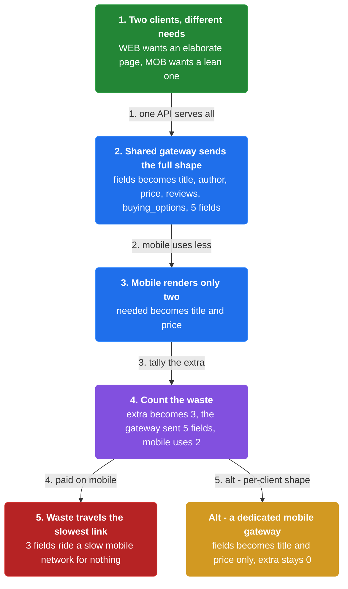

1. **Clients have different needs** — A desktop page is more elaborate than a mobile page, so each wants different data.

2. **One API must serve all** — A single shared gateway returns the same shape to every client that calls it.

3. **The mismatch wastes the slowest link** — A mobile client downloads fields it never renders, over a slow mobile network.

```java
// GATEWAY SIDE — one shared gateway cannot fit two clients with different needs
// PARTIES: GW = shared gateway · WEB = desktop web client · MOB = mobile client
// STATE (before):
//    fields : []                                   // the fields the shared gateway returns
//    needed : []                                   // the fields the requesting client actually renders
//    extra  : 0                                    // fields sent but not needed
// DEF: serve_product_page · CALLED BY: GW answering a mobile request
// -> request : {"client":"MOB", "product":"P-9"}   // the mobile client asks for the product page
//    step 1 · gateway sends the full desktop shape    // fields : [] -> ["title","author","price","reviews","buying_options"]
//    step 2 · mobile renders only two of them    // needed : [] -> ["title","price"]
//    step 3 · count the waste    // extra : 0 -> 3  BECAUSE the gateway sent 5 fields and the mobile client uses only 2
// <- extra : 3  · fields = 5, needed = 2, so 3 fields travel a slow mobile network for nothing
//    alt a dedicated mobile gateway existed : fields : [] -> ["title","price"] -> extra : 0 -> 0
```

### One gateway per client

> **Why this matters:** Backends for frontends defines a separate API gateway for each type of client, so each client gets an API shaped exactly for its needs.

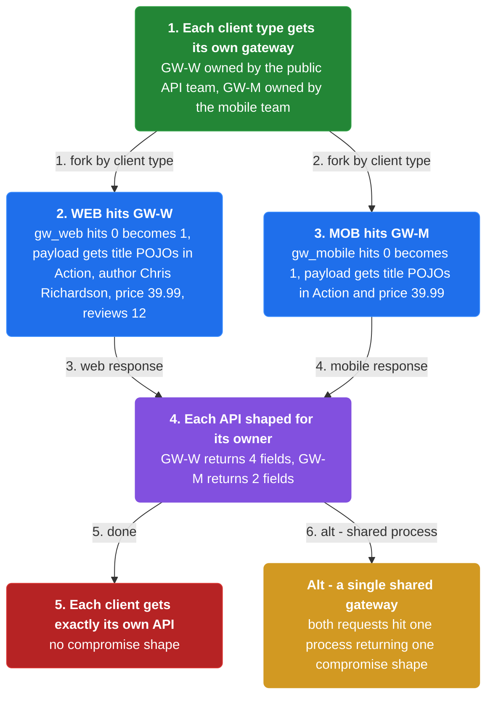

1. **Give each client type its own gateway** — The web, mobile, and third-party clients each get their own API gateway.

2. **Shape each API for its owner** — Each gateway exposes an API that is best suited to its one client.

3. **The client team owns its module** — Each API module is developed and operated by the team that owns the client.

```java
// GATEWAY SIDE — two clients hit two different gateways, each shaped for its owner
// PARTIES: WEB = desktop web client · MOB = mobile client · GW-W = Web gateway · GW-M = Mobile gateway
// STATE (before):
//    gw_web    : {owner:"public API team", hits:0}      // the web client's own gateway
//    gw_mobile : {owner:"mobile team", hits:0}          // the mobile client's own gateway
//    payload   : {}
//    total_hits : 0
// DEF: route_by_client · CALLED BY: WEB and MOB each hitting their own gateway
// -> web_request    : "GET /web/product/P-9"
// -> mobile_request : "GET /mobile/product/P-9"
//    step 1 · WEB hits GW-W    // gw_web.hits : 0 -> 1  · payload : {} -> {title:"POJOs in Action", author:"Chris Richardson", price:39.99, reviews:12}
//    step 2 · MOB hits GW-M    // gw_mobile.hits : 0 -> 1  · payload : {} -> {title:"POJOs in Action", price:39.99}
//    step 3 · tally both gateways    // total_hits : 0 -> 2  BECAUSE each request was served by its own separate gateway process
// <- output : GW-W returns 4 fields to WEB · GW-M returns 2 fields to MOB · each gateway writes its client's own payload (write) and serves it back (read)
//    alt a single shared gateway existed : both requests hit one process -> total_hits : 0 -> 2 on a single gateway returning one compromise shape
```

### Isolation buys reliability

> **Why this matters:** Because each API module is its own standalone process, one misbehaving API cannot easily impact the others — and each can be observed and scaled independently.

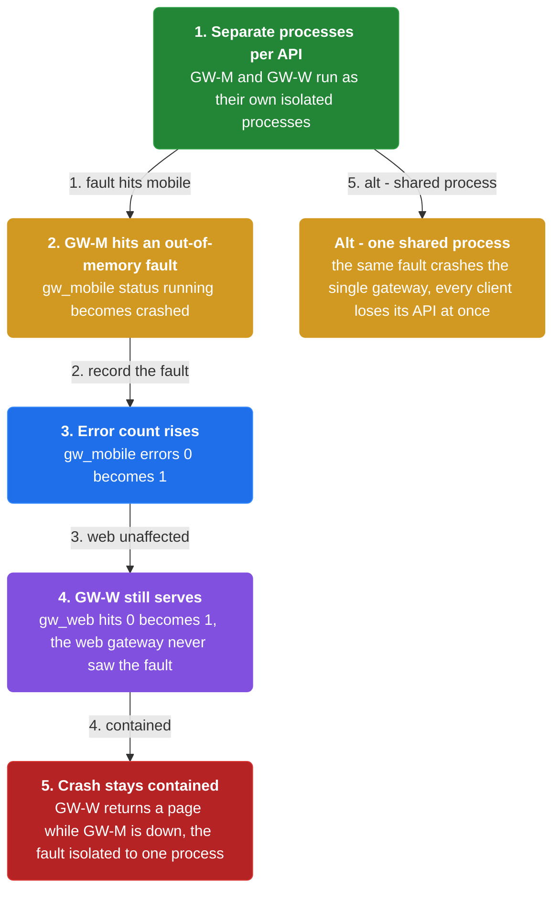

1. **Separate processes per API** — Each API module runs as its own process, isolated from the others.

2. **A fault stays contained** — One misbehaving API cannot easily impact other APIs.

3. **Observe and scale independently** — Different modules are different processes, so they are observable and independently scalable.

```java
// GATEWAY SIDE — one misbehaving module cannot take down the others
// PARTIES: GW-M = Mobile gateway · GW-W = Web gateway
// STATE (before):
//    gw_mobile : {status:"running", errors:0}     // mobile's own process
//    gw_web    : {status:"running", hits:0}       // web's separate process
// DEF: crash_one_gateway · CALLED BY: GW-M hitting an out-of-memory fault
// -> fault : {"api":"mobile", "error":"out-of-memory"}
//    step 1 · GW-M crashes    // gw_mobile.status : "running" -> "crashed"
//    step 2 · its error count rises    // gw_mobile.errors : 0 -> 1  BECAUSE the mobile API hit an out-of-memory fault
//    step 3 · GW-W still serves    // gw_web.hits : 0 -> 1  BECAUSE the web gateway runs in a different process and never saw the fault
// <- output : GW-W returns 1 page to its client while GW-M is down  · the crash is contained to one process
//    alt both APIs shared one process : the same fault crashes the single gateway -> every client loses its API at once
```

### The duplication and bottleneck risks

> **Why this matters:** Separate gateways risk duplicating common functionality and becoming a development bottleneck, so the common code should be a shared library and the update process lightweight.

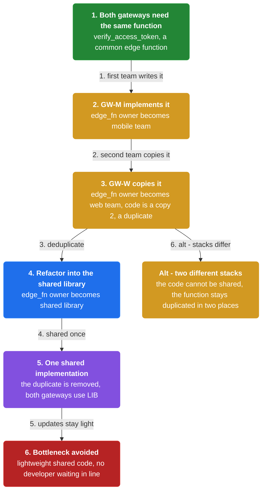

1. **Common code can be duplicated** — Different gateways may each re-implement common functionality such as edge functions.

2. **Share the common library** — Ideally all gateways use the same stack, with common functionality in a shared library.

3. **Keep updates lightweight** — If updating the gateway is slow, developers are forced to wait in line — the gateway becomes a bottleneck.

```java
// GATEWAY SIDE — two stacks would duplicate common functionality unless it is shared
// PARTIES: GW-M = Mobile gateway · GW-W = Web gateway · LIB = shared edge-function library
// DEF: edge — the gateway edge where per-client logic such as auth runs = the "verify_access_token" function held in edge_fn
// DEF: fn — one named unit of common code (a function) = "verify_access_token", shared by GW-M and GW-W instead of duplicated
// STATE (before):
//    edge_fn : {}                              // where the auth edge function lives
// DEF: add_edge_function · CALLED BY: GW-M and GW-W both needing the same function
// -> function : "verify_access_token"          // a common function both gateways need
//    step 1 · GW-M implements it    // edge_fn : {} -> {owner:"mobile team", code:"verify_access_token"}
//    step 2 · GW-W copies it    // edge_fn : {owner:"mobile team", code:"verify_access_token"} -> {owner:"web team", code:"verify_access_token (copy 2)"}
//    step 3 · refactor into LIB    // edge_fn : {owner:"web team", code:"verify_access_token (copy 2)"} -> {owner:"shared library", code:"verify_access_token"}
// <- edge_fn : {owner:"shared library", code:"verify_access_token"}  · one shared implementation used by both gateways, the duplicate removed
//    alt the two gateways used different stacks : the code could not be shared -> the function stays duplicated in two places
```


## System Design Interview

> **The question:** Design a gateway per client type. Premise: each client (mobile or web) gets its own gateway that fetches and shapes one product from upstream services, so each client gets exactly the fields it needs.

**The pipeline:** client → per-client gateway → upstream services

### Clients — two device shapes

_Role: client_

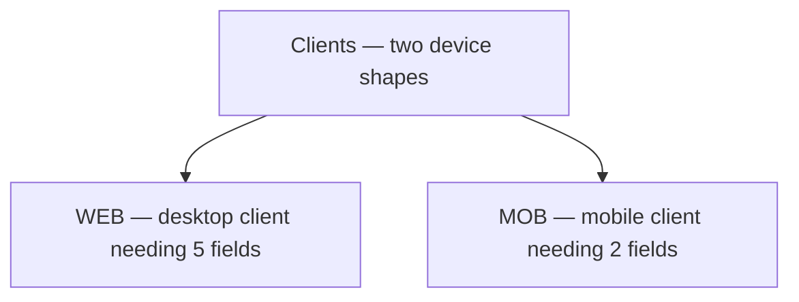

### Per-client gateways — the BFFs

_Role: per-client gateway_

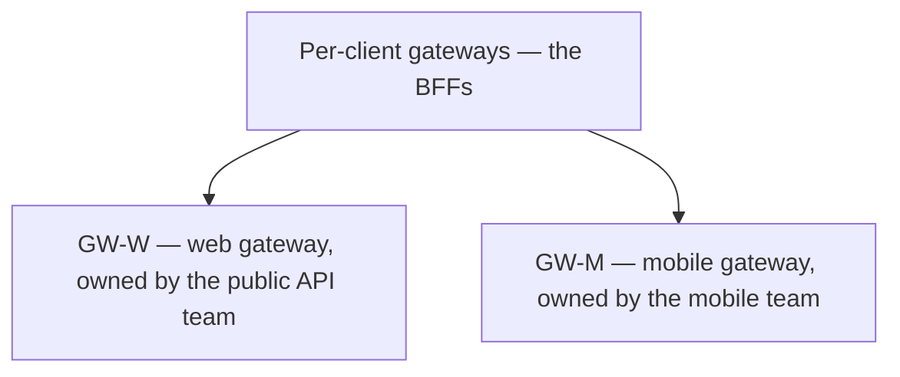

### Upstream services + shared library

_Role: upstream services_

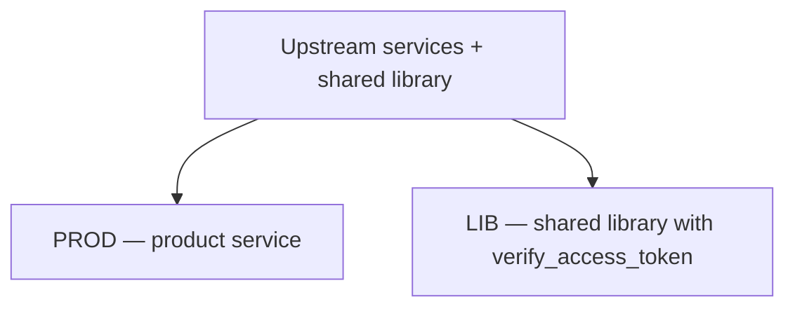

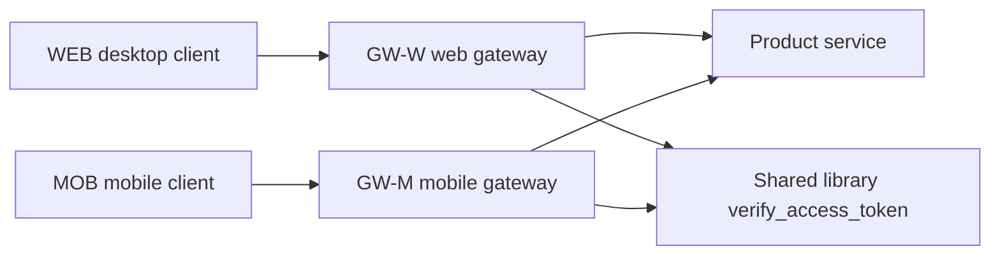

```java
// SYSTEM DESIGN — BFF: client -> per-client gateway -> upstream services, one product fetched for two devices
// PARTIES: WEB = the desktop client · MOB = the mobile client · GWW = web gateway (public API team) · GWM = mobile gateway (mobile team) · PROD = Product service
// DEF: api_shape — the fields a gateway tailors for one client; here WEB gets 5 fields and MOB gets 2
// STATE (before):
//    response : {}                      // the tailored response, empty
// DEF: fetch_product · CALLED BY: GWW then GWM, each for its own client
// -> path : "/products/P-9"
//    step 1 · GWW calls PROD and keeps 5 fields for the desktop   // response : {} -> {"5 fields"}   BECAUSE the web API team tailors the response to the desktop UI
//    step 2 · GWM calls the SAME PROD and keeps only 2 fields for mobile   // response : {"5 fields"} -> {"2 fields"}   BECAUSE the mobile team trims it for a small screen
//    step 3 · both gateways verify the access token via the shared library   // checks : 0 -> 2   BECAUSE verify_access_token is shared, not duplicated
// <- outcome : WEB gets 5 fields, MOB gets 2 · one upstream service, two tailored API shapes, no duplicated auth logic
```

## Interview Questions

### Q1

A single shared gateway serves the product page to both the desktop web client and the mobile client. The desktop renders five fields; the mobile client renders only two, over a slow mobile network, and pays to download the other three.

**Interviewer's question:** Why does one shared gateway fail these two clients, and what is the concrete cost of that mismatch?

**Solution:** A one-size-fits-all gateway sends every client the same shape, so the mobile client downloads fields it never renders — the wasted fields travel the slowest link for nothing.

**System-design components:**
- Shared gateway
- Desktop web client
- Mobile client
- wasted-fields counter

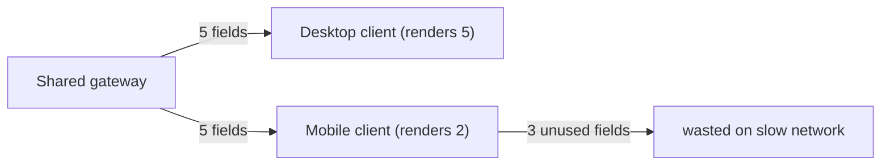

```java
// GATEWAY SIDE — one shared gateway sends both clients the same shape, wasting the slowest link
// PARTIES: GW = shared gateway · WEB = desktop web client · MOB = mobile client
// STATE (before):
//    fields : []                              // the fields the shared gateway returns
//    needed : []                              // the fields the requesting client actually renders
//    extra : 0                                // fields sent but not needed
// DEF: serve_product_page · CALLED BY: GW answering a mobile request
// -> request : {"client":"MOB","product":"P-9"}    // the mobile client asks for the product page
//    step 1 · gateway sends the full desktop shape    fields : [] -> ["title","author","price","reviews","buying_options"]
//    step 2 · mobile renders only two of them    needed : [] -> ["title","price"]
//    step 3 · count the waste    extra : 0 -> 3  BECAUSE the gateway sent 5 fields and the mobile client uses only 2
// <- extra : 3 · fields = 5, needed = 2, so 3 fields travel a slow mobile network for nothing
//    alt a dedicated mobile gateway existed : fields : ["title","author","price","reviews","buying_options"] -> ["title","price"] -> extra : 0 -> 0
```

_This is the chapter's opening problem: a single one-size-fits-all API cannot fit every client's data or network._

_Covers:_ Why one shared gateway cannot fit every client

_From the 28 problems:_ 01-scale-from-zero-to-millions · 03-framework-for-system-design-interviews

### Q2

The web team wants the full product payload, while the mobile team wants only title and price — and each team wants to change its API without asking the other. They decide to split the single gateway.

**Interviewer's question:** What does the Backends for frontends pattern define, and who owns and operates each resulting API module?

**Solution:** A separate API gateway for each type of client, each exposing an API shaped for its one client and developed and operated by the team that owns that client.

**System-design components:**
- Web gateway (public API team)
- Mobile gateway (mobile team)
- Desktop web client
- Mobile client

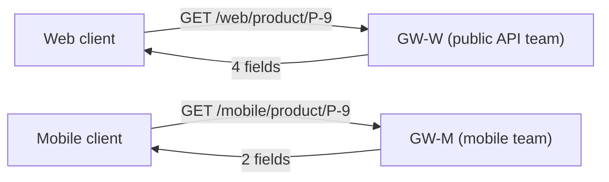

```java
// GATEWAY SIDE — two clients hit two different gateways, each shaped for its owner
// PARTIES: WEB = desktop web client · MOB = mobile client · GWW = Web gateway · GWM = Mobile gateway
// STATE (before):
//    gw_web : {owner:"public API team", hits:0}     // the web client's own gateway
//    gw_mobile : {owner:"mobile team", hits:0}       // the mobile client's own gateway
//    payload : {}                                    // what the last gateway returned
//    total_hits : 0
// DEF: route_by_client · CALLED BY: WEB and MOB each hitting their own gateway
// -> web_request : "GET /web/product/P-9"
// -> mobile_request : "GET /mobile/product/P-9"
//    step 1 · WEB hits GWW    gw_web.hits : 0 -> 1  · payload : {} -> {"title":"POJOs in Action","author":"Chris Richardson","price":39.99,"reviews":12}
//    step 2 · MOB hits GWM    gw_mobile.hits : 0 -> 1  · payload : {"title":"POJOs in Action","author":"Chris Richardson","price":39.99,"reviews":12} -> {"title":"POJOs in Action","price":39.99}
//    step 3 · tally both gateways    total_hits : 0 -> 2  BECAUSE each request was served by its own separate gateway process
// <- output : GWW returns 4 fields to WEB · GWM returns 2 fields to MOB · each client gets exactly its own API
//    alt a single shared gateway existed : both requests hit one process -> total_hits : 0 -> 2 on one gateway returning one compromise shape
```

_This is the chapter's core solution: one gateway per client, each owned and operated by a single client team._

_Covers:_ One gateway per client

_From the 28 problems:_ 01-scale-from-zero-to-millions · 03-framework-for-system-design-interviews

### Q3

The mobile gateway hits an out-of-memory fault in production. The team needs to know whether the web client's page also goes down.

**Interviewer's question:** Why does running each API module as its own process matter, and what happens to the web client when the mobile gateway crashes?

**Solution:** Because each API module is a standalone process, a fault in one cannot easily impact the others — the web gateway keeps serving while the mobile gateway is down, and each is independently observable and scalable.

**System-design components:**
- Mobile gateway process
- Web gateway process
- out-of-memory fault

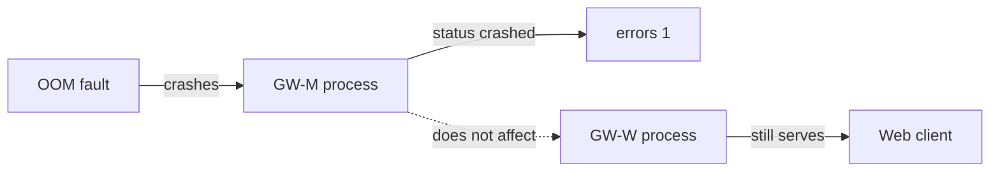

```java
// GATEWAY SIDE — one misbehaving module cannot take down the others
// PARTIES: GWM = Mobile gateway · GWW = Web gateway
// STATE (before):
//    gw_mobile : {status:"running", errors:0}      // mobile's own process
//    gw_web : {status:"running", hits:0}           // web's separate process
// DEF: crash_one_gateway · CALLED BY: GWM hitting an out-of-memory fault
// -> fault : {"api":"mobile","error":"out-of-memory"}
//    step 1 · GWM crashes    gw_mobile.status : "running" -> "crashed"
//    step 2 · its error count rises    gw_mobile.errors : 0 -> 1  BECAUSE the mobile API hit an out-of-memory fault
//    step 3 · GWW still serves    gw_web.hits : 0 -> 1  BECAUSE the web gateway runs in a different process and never saw the fault
// <- output : GWW returns 1 page to its client while GWM is down · the crash is contained to one process
//    alt both APIs shared one process : the same fault crashes the single gateway -> every client loses its API at once
```

_This is the chapter's isolation benefit: separate processes keep one misbehaving API from taking down the others._

_Covers:_ Isolation buys reliability

_From the 28 problems:_ 01-scale-from-zero-to-millions · 03-framework-for-system-design-interviews

### Q4

The web and mobile gateways each hand-write an auth edge function, and the two copies are drifting. The team wants one implementation both gateways can share.

**Interviewer's question:** What duplication risk do separate gateways introduce, and how should the common code be handled so it does not block the teams?

**Solution:** Separate gateways can re-implement the same edge functionality; the common code should live in a shared library used by all gateways, and the update process must stay lightweight or the gateway becomes a bottleneck.

**System-design components:**
- Mobile gateway
- Web gateway
- shared edge-function library
- verify_access_token

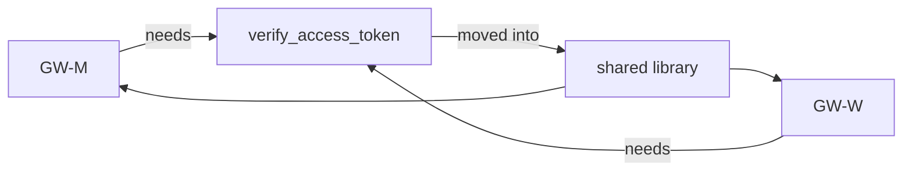

```java
// GATEWAY SIDE — two stacks would duplicate a common edge function unless it is shared
// PARTIES: GWM = Mobile gateway · GWW = Web gateway · LIB = shared edge-function library
// DEF: edge — the gateway edge where per-client logic such as auth runs; here the function "verify_access_token" held in edge_fn
// STATE (before):
//    edge_fn : {}                              // where the auth edge function lives
// DEF: add_edge_function · CALLED BY: GWM and GWW both needing the same function
// -> function : "verify_access_token"          // a common function both gateways need
//    step 1 · GWM implements it    edge_fn : {} -> {owner:"mobile team", code:"verify_access_token"}
//    step 2 · GWW copies it    edge_fn : {owner:"mobile team", code:"verify_access_token"} -> {owner:"web team", code:"verify_access_token (copy 2)"}
//    step 3 · refactor into LIB    edge_fn : {owner:"web team", code:"verify_access_token (copy 2)"} -> {owner:"shared library", code:"verify_access_token"}
// <- edge_fn : {owner:"shared library", code:"verify_access_token"} · one shared implementation used by both gateways, the duplicate removed
//    alt the two gateways used different stacks : the code could not be shared -> the function stays duplicated in two places
```

_This is the chapter's duplication-and-bottleneck risk, resolved by putting common edge functionality in a shared library._

_Covers:_ The duplication and bottleneck risks

_From the 28 problems:_ 01-scale-from-zero-to-millions · 03-framework-for-system-design-interviews

## Key Concepts

### The Problem

**One-size-fits-all APIs fail.** A single shared gateway cannot serve every client well, so it must either bloat one client or starve another.


### The Solution

Implement a separate API gateway for each type of client, owned and operated by a single client team.


### Key Facts

| Fact | Detail | In the wild |
|---|---|---|
| A gateway per client | Implement a separate API gateway for each type of client, owned and operated by a single client team. | The public API team owns their gateway, the mobile team owns theirs, and so on. |
| Isolation improves reliability | The modules are isolated, so one misbehaving API cannot easily impact others; they are also more observable, independently scalable, and faster to start. | Different API modules being different processes makes each easier to observe. |
| Duplication and bottleneck risk | There is a risk of duplicated code, and of the gateway becoming a development bottleneck if its update process is not lightweight. | The common functionality, such as edge functions, should live in a shared library implemented by the API gateway team. |


### Tradeoffs & When

- The modules are isolated, so one misbehaving API cannot easily impact others; they are also more observable, independently scalable, and faster to start.
- There is a risk of duplicated code, and of the gateway becoming a development bottleneck if its update process is not lightweight.


<details><summary>All concepts (index)</summary>

### Problem: One-size-fits-all APIs fail

**Why.** Different clients need different data, and each runs over a different network.

**Claim.** A single shared gateway cannot serve every client well, so it must either bloat one client or starve another.

**Grounding.** The reference notes Netflix initially attempted a one-size-fits-all API, which did not work well because of the diverse devices and their needs.

**In the wild.** Netflix's streaming service spans hundreds of device types.
### Solution: A gateway per client

**Why.** Each client type deserves an API built for it alone.

**Claim.** Implement a separate API gateway for each type of client, owned and operated by a single client team.

**Grounding.** The reference solution; the pattern was pioneered by Phil Calcado and his colleagues at SoundCloud.

**In the wild.** The public API team owns their gateway, the mobile team owns theirs, and so on.
### Tradeoff: Isolation improves reliability

**Why.** Each API module is its own standalone process.

**Claim.** The modules are isolated, so one misbehaving API cannot easily impact others; they are also more observable, independently scalable, and faster to start.

**Grounding.** These are the reference benefits, stated alongside clearly defined responsibilities.

**In the wild.** Different API modules being different processes makes each easier to observe.
### Tradeoff: Duplication and bottleneck risk

**Why.** Several gateways may re-implement the same edge functionality, and one team's gate may block others.

**Claim.** There is a risk of duplicated code, and of the gateway becoming a development bottleneck if its update process is not lightweight.

**Grounding.** The reference warns both: different stacks risk duplicating common functionality, and the update process must be lightweight or developers wait in line.

**In the wild.** The common functionality, such as edge functions, should live in a shared library implemented by the API gateway team.

</details>


## Quiz

1. What does the Backends for frontends pattern define?

   - A. A single gateway that serves every client
   - B. A separate API gateway for each type of client
   - C. A database replica per frontend
   - D. A message queue per client team

<details><summary>Reveal answer</summary>

**B.** The reference defines a separate API gateway for each type of client. A single shared gateway is exactly what the pattern replaces, and the other options are not the pattern.

</details>

2. Who owns and operates a BFF API module?

   - A. A central API gateway team
   - B. The database team
   - C. The client team
   - D. The network operations team

<details><summary>Reveal answer</summary>

**C.** Each API module is developed and operated by a single client team, so they can change the client and its API module without asking a shared gateway team. A central team is the one the pattern removes from the loop.

</details>

3. Which is a stated benefit of BFF?

   - A. The API modules are isolated, improving reliability and observability
   - B. It guarantees a single shared database
   - C. It eliminates the need to deploy any gateway
   - D. It removes all code duplication

<details><summary>Reveal answer</summary>

**A.** The reference benefits include isolation (one misbehaving API cannot easily impact others), better observability, independent scalability, faster startup, and clearly defined responsibilities. BFF still deploys gateways and can still duplicate code, ruling out C and D.

</details>

4. Which is a drawback of BFF, shared with the API gateway pattern?

   - A. It forces all clients to share one API
   - B. It is yet another highly available component that must be developed, deployed, and managed
   - C. It cannot be scaled independently
   - D. It requires every team to use a different stack

<details><summary>Reveal answer</summary>

**B.** The reference drawback is that it is yet another highly available component to develop, deploy, and manage, plus a possible development bottleneck. Each API is independently scalable and teams ideally share one stack, ruling out C and D.

</details>

