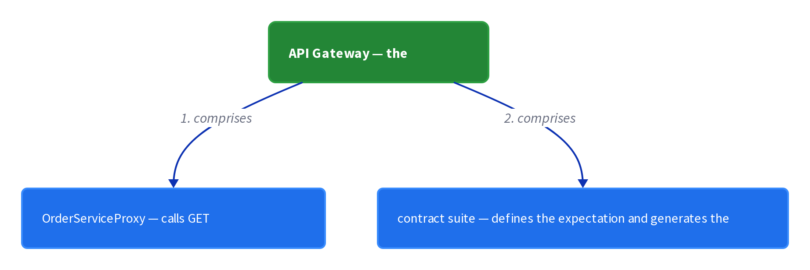

# Chapter 25: Consumer-Driven Contract Test

> Verify that a service meets the expectations of its clients.

_Also known as: Chris Richardson · Microservice Patterns Ch. · microservices.io /patterns/testing/consumer-driven-contract-test.html_

## Flow

### Agreement between two services

> **Why this matters:** Every interaction between a pair of services is an agreement; without a test pinning it down, either side can drift and break the other silently.

1. **Name the relationship** — Each interacting pair is a **consumer-provider** relationship: API Gateway is a consumer, Order Service is a provider.

2. **Agree on channel and shape** — Services must agree on the event message structure and channel, the REST endpoints, or the command and reply formats.

3. **Enumerate the REST shape** — A contract test verifies the HTTP method and path, headers, request body, and the response status, headers, and body.

```java
// PROVIDER SIDE — the GET /orders/{orderId} contract test verifies the API shape, not business logic
// PARTIES: GW = API Gateway (consumer) · SVC = Order Service (provider) · TST = contract test
// STATE (before):
//    shape : { method:"", path:"", headers:{}, status:0, body:{} }
// DEF: expect_order_endpoint · CALLED BY: GW team encoding what OrderServiceProxy needs
// -> order_id : "ORD-4007"
//    step 1 · expected method+path : shape.method : "" -> "GET" · shape.path : "" -> "/orders/{orderId}"  BECAUSE OrderServiceProxy calls GET /orders/{orderId}
//    step 2 · expected headers : shape.headers : {} -> {"Accept":"application/json"}  BECAUSE the proxy sends Accept and reads JSON
//    step 3 · expected status : shape.status : 0 -> 200  BECAUSE the proxy needs a success code to parse the body
//    step 4 · expected body : shape.body : {} -> {"orderId":"ORD-4007","state":"CREATED"}  BECAUSE the proxy reads the order's JSON from the reply
// <- contract : {"method":"GET","path":"/orders/ORD-4007","headers":{"Accept":"application/json"},"status":200,"body":{"orderId":"ORD-4007","state":"CREATED"}}
//    alt provider deviates : SVC answers 404  BECAUSE the provider changed the endpoint -> the suite fails with "expected 200, got 404"
```

### Consumers publish their expectations

> **Why this matters:** Confidence in a dependency comes from the consumer spelling out what it needs, not from hoping the provider guesses it.

1. **The consumer team writes the suite** — The team that develops the consumer writes a contract test suite for the aspects of the API it uses.

2. **Contribute it to the provider** — The suite is added to the provider's test suite, for example via a pull request.

3. **Every consumer contributes** — Each service that invokes Order Service contributes its own suite, so the provider sees every consumer's expectations.

```java
// PROVIDER SIDE — each consumer team contributes its own suite to Order Service's test suite
// PARTIES: GW = API Gateway team · OH = Order History Service team · SVC = Order Service (provider)
// STATE (before):
//    suites : []                         // the provider's collection of contributed suites, empty
//    test_count : 0
// DEF: contribute_suite · CALLED BY: GW team opening a pull request
// -> contributor : "GW" · -> suite_name : "gateway-orders"
//    step 1 · author tests : test_count : 0 -> 1  BECAUSE the gateway suite needs one test for GET /orders/{orderId}
//    step 2 · merge PR : suites : [] -> [{"owner":"GW","name":"gateway-orders","tests":1}]  BECAUSE the suite is added to the provider's test suite via pull request
// <- suites : 1 entry · owner : "GW" · test_count : 1
//
// DEF: contribute_suite · CALLED BY: OH team, a second consumer, via another pull request
// -> contributor : "OH" · -> suite_name : "history-events"
//    step 1 · author tests : test_count : 1 -> 2  BECAUSE Order History adds a suite that checks the published events
//    step 2 · merge PR : suites : [{"owner":"GW","name":"gateway-orders","tests":1}] -> [{"owner":"GW","name":"gateway-orders","tests":1},{"owner":"OH","name":"history-events","tests":1}]  BECAUSE the second suite tests the event aspects relevant to this consumer
// <- suites : 2 entries · owners : ["GW"] -> ["GW","OH"]
```

### The provider pipeline verifies everyone

> **Why this matters:** The provider's deployment pipeline runs all contributed suites, so a breaking change is caught before it ships to any consumer.

1. **Run the suites in the pipeline** — The contributed test suites are executed by the deployment pipeline for Order Service.

2. **Compare expected versus actual** — Each test checks that the actual response matches the consumer's expected status, headers, and body.

3. **A failure means a breaking change** — When a consumer contract test fails, the producer team must fix the API or talk to the consumer team.

```java
// PROVIDER SIDE — the deployment pipeline compares the consumer's expected response against the actual
// PARTIES: SVC = Order Service (provider) · GW = API Gateway (consumer) · PIPE = deployment pipeline
// STATE (before):
//    expected : { status:200, body:{"orderId":"ORD-4007","state":"CREATED"} }
//    actual : { status:0, body:{} }
//    matches : 0
// DEF: verify_one_request · CALLED BY: PIPE running the gateway-orders suite
// -> order_id : "ORD-4007"
//    step 1 · invoke provider : actual.status : 0 -> 200  BECAUSE SVC serves GET /orders/ORD-4007
//    step 2 · read body : actual.body : {} -> {"orderId":"ORD-4007","state":"CREATED"}  BECAUSE SVC returns the order's JSON
//    step 3 · compare status : matches : 0 -> 1  BECAUSE actual.status 200 equals expected.status 200
//    step 4 · compare body : matches : 1 -> 2  BECAUSE actual.body equals expected.body, so both checks hold
// <- verdict : "pass"  BECAUSE matches equals 2 (status and body both agree)
//    alt provider breaks the API : SVC drops GET /orders/{orderId}
//       actual.status : 200 -> 404  BECAUSE the endpoint was removed or renamed
//       verdict : "pass" -> "fail"  BECAUSE 404 does not equal expected.status 200
//       PIPE fails the suite -> the producer team must fix the API or talk to the consumer team
```

### Testing by example

> **Why this matters:** Instead of exhaustively testing every input, a contract is defined by a small set of examples of the messages exchanged in one interaction.

1. **Define contracts as examples** — The interaction between a consumer and a provider is defined by a set of examples, known as contracts.

2. **One interaction, two messages** — Each contract consists of the example messages exchanged during one interaction: the request and the reply.

3. **They are mock controller tests** — Consumer contract tests for a REST API are mock controller tests, not full business-logic tests.

```java
// PROVIDER SIDE — testing by example: a contract is the pair of example messages for ONE interaction
// PARTIES: GW = API Gateway (consumer) · SVC = Order Service (provider)
// STATE (before):
//    contract : { request:{}, reply:{} }
//    kind : ""
// DEF: define_contract · CALLED BY: GW team, using testing by example
// -> order_id : "ORD-4007"
//    step 1 · example request : contract.request : {} -> {"method":"GET","path":"/orders/ORD-4007","headers":{"Accept":"application/json"}}  BECAUSE the example request is one message of the interaction
//    step 2 · example reply : contract.reply : {} -> {"status":200,"body":{"orderId":"ORD-4007","state":"CREATED"}}  BECAUSE the example reply is the second message of the interaction
//    step 3 · identify the test style : kind : "" -> "mock-controller"  BECAUSE consumer contract tests for a REST API are mock controller tests
// <- contract : {"request":{"method":"GET","path":"/orders/ORD-4007"},"reply":{"status":200,"body":{"orderId":"ORD-4007","state":"CREATED"}}}
//    alt another example : order_id : "ORD-4007" -> "ORD-4008"  BECAUSE each contract is one example; a second contract covers a second order
```


## System Design Interview

> **The question:** Design contract testing driven by the consumer. Premise: the consumer (API Gateway) records its expectation in a Pact broker, and the provider verifies against it, so the two sides stay compatible without shared code.

**The pipeline:** consumer → contract/expectation → provider verification → provider

<a href="../diagrams/d2/decomp/ch25-0.png"></a>

### API Gateway — the consumer

_Role: consumer_

- OrderServiceProxy — calls GET /orders/{orderId}
- contract suite — defines the expectation and generates the contract

### Pact broker — the contract repo

_Role: contract broker/repo_

- stores the example request/reply contract
- serves the contract back to the provider pipeline

### Order Service — the provider

_Role: provider verification + provider_

- verifies the actual response against the contract
- keeps the promise: serves GET /orders/ORD-4007 with status 200

```java
// SYSTEM DESIGN — consumer-driven contract test: consumer (API Gateway) -> contract/expectation (Pact broker) -> provider verification (deployment pipeline) -> provider (Order Service)
// PARTIES: GW = API Gateway (consumer) · PACT = Pact broker (contract repo, holds the expectation) · PIPE = deployment pipeline (verifier, runs the suite) · SVC = Order Service (provider)
// DEF: contract — the example request/reply pair one interaction is pinned to; here {"request":{"method":"GET","path":"/orders/ORD-4007"},"reply":{"status":200,"body":{"orderId":"ORD-4007","state":"CREATED"}}}
// DEF: expectation — what the consumer needs the provider to keep; here GET /orders/ORD-4007 answered with status 200 and a JSON body
// DEF: verdict — the pass/fail the verifier reaches; here "pass" when actual equals expected
// STATE (before):
//    contracts : {}          // PACT holds no contract yet
//    actual : { status:0, body:{} }
//    verdict : ""
// DEF: pin_and_verify · CALLED BY: GW publishing its expectation, then PIPE verifying SVC
// -> order_id : "ORD-4007"
//    step 1 · GW defines the expectation and PACT stores it    contracts : {} -> {"gateway-orders":{"request":{"method":"GET","path":"/orders/ORD-4007"},"reply":{"status":200,"body":{"orderId":"ORD-4007","state":"CREATED"}}}}
//    step 2 · PIPE reads the contract and invokes SVC    actual.status : 0 -> 200 · actual.body : {} -> {"orderId":"ORD-4007","state":"CREATED"}
//    step 3 · PIPE compares actual against expected    verdict : "" -> "pass"  BECAUSE actual 200 equals expected 200 and the body matches
// <- outcome : verdict "pass" · SVC keeps its promise  BECAUSE the provider serves GET /orders/ORD-4007 exactly as the contract pins it
```

## Interview Questions

### Q1

The API Gateway team's OrderServiceProxy calls GET /orders/{orderId} on Order Service. The gateway needs a test that pins down the exact HTTP shape it relies on, before the provider silently changes it.

**Interviewer's question:** What does a consumer-driven contract test verify about a REST endpoint, and which concrete pieces of the shape are enumerated?

**Solution:** It verifies the HTTP method and path, the request headers and body, and the response status, headers, and body — the shape, not the provider's business logic.

**System-design components:**
- API Gateway (consumer)
- Order Service (provider)
- contract test
- OrderServiceProxy

```java
// PROVIDER SIDE — the GET /orders/{orderId} contract test enumerates the API shape, not business logic
// PARTIES: GW = API Gateway (consumer) · SVC = Order Service (provider) · TST = contract test
// STATE (before):
//    shape : { method:"", path:"", headers:{}, status:0, body:{} }
// DEF: expect_order_endpoint · CALLED BY: GW team encoding what OrderServiceProxy needs
// -> order_id : "ORD-4007"
//    step 1 · expected method and path : shape.method : "" -> "GET" · shape.path : "" -> "/orders/{orderId}"  BECAUSE OrderServiceProxy calls GET /orders/{orderId}
//    step 2 · expected headers : shape.headers : {} -> {"Accept":"application/json"}  BECAUSE the proxy sends Accept and reads JSON
//    step 3 · expected status : shape.status : 0 -> 200  BECAUSE the proxy needs a success code to parse the body
//    step 4 · expected body : shape.body : {} -> {"orderId":"ORD-4007","state":"CREATED"}  BECAUSE the proxy reads the order's JSON from the reply
// <- contract : {"method":"GET","path":"/orders/ORD-4007","headers":{"Accept":"application/json"},"status":200,"body":{"orderId":"ORD-4007","state":"CREATED"}}
//    alt provider deviates : SVC answers 404  BECAUSE the provider changed the endpoint -> the suite fails with "expected 200, got 404"
```

_This is the chapter's enumerated REST shape: method, path, headers, body, and the response status, headers, and body._

_Covers:_ Agreement between two services

_From the 28 problems:_ 03-framework-for-system-design-interviews

### Q2

Order Service has two consumers — the API Gateway (REST) and Order History Service (published events). Each depends on a different part of Order Service's API, and the provider cannot guess both.

**Interviewer's question:** Who writes a consumer-driven contract test suite, and how does it reach the provider's test suite?

**Solution:** Each consumer team writes its own suite for the aspects of the API it uses and contributes it to the provider's test suite, for example via a pull request.

**System-design components:**
- API Gateway team
- Order History Service team
- Order Service (provider)
- pull request

```java
// PROVIDER SIDE — each consumer team contributes its own suite to Order Service's test suite
// PARTIES: GW = API Gateway team · OH = Order History Service team · SVC = Order Service (provider)
// STATE (before):
//    suites : []                               // the provider's collection of contributed suites, empty
//    test_count : 0
// DEF: contribute_suite · CALLED BY: GW team opening a pull request
// -> contributor : "GW" · -> suite_name : "gateway-orders"
//    step 1 · author the test : test_count : 0 -> 1  BECAUSE the gateway suite needs one test for GET /orders/{orderId}
//    step 2 · merge the PR : suites : [] -> [{"owner":"GW","name":"gateway-orders","tests":1}]  BECAUSE the suite is added to the provider's test suite via pull request
// <- suites : 1 entry · owner : "GW" · test_count : 1
//
// DEF: contribute_suite · CALLED BY: OH team, a second consumer, via another pull request
// -> contributor : "OH" · -> suite_name : "history-events"
//    step 1 · author the test : test_count : 1 -> 2  BECAUSE Order History adds a suite that checks the published events
//    step 2 · merge the PR : suites : [{"owner":"GW","name":"gateway-orders","tests":1}] -> [{"owner":"GW","name":"gateway-orders","tests":1},{"owner":"OH","name":"history-events","tests":1}]  BECAUSE the second suite tests the event aspects relevant to this consumer
// <- suites : 2 entries · owners : ["GW"] -> ["GW","OH"]
```

_This is the chapter's contribute-your-suite mechanism: every consumer adds its own expectations to the provider's suite._

_Covers:_ Consumers publish their expectations

_From the 28 problems:_ 03-framework-for-system-design-interviews

### Q3

Order Service renamed GET /orders/{orderId} during a refactor. The gateway's contributed suite is running in the provider's deployment pipeline, and the team needs to know whether the change will ship.

**Interviewer's question:** When the provider's pipeline runs the contributed suites, how does a test compare expected versus actual, and what does a failure mean?

**Solution:** Each test invokes the provider and compares the actual status, headers, and body against the consumer's expected values; a failure means the producer made a breaking change and must fix the API or talk to the consumer team.

**System-design components:**
- Order Service (provider)
- deployment pipeline
- gateway-orders suite
- expected vs actual comparison

```java
// PROVIDER SIDE — the deployment pipeline compares the consumer's expected response against the actual
// PARTIES: SVC = Order Service (provider) · GW = API Gateway (consumer) · PIPE = deployment pipeline
// STATE (before):
//    expected : { status:200, body:{"orderId":"ORD-4007","state":"CREATED"} }
//    actual : { status:0, body:{} }
//    matches : 0
// DEF: verify_one_request · CALLED BY: PIPE running the gateway-orders suite
// -> order_id : "ORD-4007"
//    step 1 · invoke the provider : actual.status : 0 -> 200  BECAUSE SVC serves GET /orders/ORD-4007
//    step 2 · read the body : actual.body : {} -> {"orderId":"ORD-4007","state":"CREATED"}  BECAUSE SVC returns the order's JSON
//    step 3 · compare the status : matches : 0 -> 1  BECAUSE actual.status 200 equals expected.status 200
//    step 4 · compare the body : matches : 1 -> 2  BECAUSE actual.body equals expected.body, so both checks hold
// <- verdict : "pass"  BECAUSE matches equals 2 (status and body both agree)
//    alt provider breaks the API : SVC drops GET /orders/{orderId}
//       actual.status : 200 -> 404  BECAUSE the endpoint was removed or renamed
//       verdict : "pass" -> "fail"  BECAUSE 404 does not equal expected.status 200
//       PIPE fails the suite -> the producer team must fix the API or talk to the consumer team
```

_This is the chapter's pipeline verdict: a failing contributed suite is a breaking change the producer must fix or negotiate._

_Covers:_ The provider pipeline verifies everyone

_From the 28 problems:_ 03-framework-for-system-design-interviews

### Q4

The gateway team wants to specify the order interaction without exhaustively testing every input. They settle on a small set of examples, one per interaction.

**Interviewer's question:** How does testing by example specify a contract, and what kind of test is a consumer contract test for a REST API?

**Solution:** The interaction is defined by examples called contracts, each made of the example messages exchanged during one interaction — the request and the reply; for a REST API these are mock controller tests, not business-logic tests.

**System-design components:**
- API Gateway (consumer)
- Order Service (provider)
- example request
- example reply

```java
// PROVIDER SIDE — testing by example: a contract is the pair of example messages for ONE interaction
// PARTIES: GW = API Gateway (consumer) · SVC = Order Service (provider)
// STATE (before):
//    contract : { request:{}, reply:{} }
//    kind : ""
// DEF: define_contract · CALLED BY: GW team, using testing by example
// -> order_id : "ORD-4007"
//    step 1 · example request : contract.request : {} -> {"method":"GET","path":"/orders/ORD-4007","headers":{"Accept":"application/json"}}  BECAUSE the example request is one message of the interaction
//    step 2 · example reply : contract.reply : {} -> {"status":200,"body":{"orderId":"ORD-4007","state":"CREATED"}}  BECAUSE the example reply is the second message of the interaction
//    step 3 · identify the test style : kind : "" -> "mock-controller"  BECAUSE consumer contract tests for a REST API are mock controller tests
// <- contract : {"request":{"method":"GET","path":"/orders/ORD-4007"},"reply":{"status":200,"body":{"orderId":"ORD-4007","state":"CREATED"}}}
//    alt another example : order_id : "ORD-4007" -> "ORD-4008"  BECAUSE each contract is one example; a second contract covers a second order
```

_This is the chapter's testing-by-example specification: contracts are example request/reply message pairs, i.e. mock controller tests._

_Covers:_ Testing by example

_From the 28 problems:_ 03-framework-for-system-design-interviews

## Key Concepts

### The Problem

**Two services, one implicit agreement.** You need confidence that the services you consume have stable APIs, and that you do not unintentionally break your own API.


### The Solution

Verify that a service meets the expectations of its clients: each consumer team writes a contract test suite and adds it to the provider's test suite via a pull request.

```java
// PROVIDER SIDE — the GET /orders/{orderId} contract test enumerates the API shape, not business logic
// PARTIES: GW = API Gateway (consumer) · SVC = Order Service (provider) · TST = contract test
// STATE (before):
//    shape : { method:"", path:"", headers:{}, status:0, body:{} }
// DEF: expect_order_endpoint · CALLED BY: GW team encoding what OrderServiceProxy needs
// -> order_id : "ORD-4007"
//    step 1 · expected method and path : shape.method : "" -> "GET" · shape.path : "" -> "/orders/{orderId}"  BECAUSE OrderServiceProxy calls GET /orders/{orderId}
//    step 2 · expected headers : shape.headers : {} -> {"Accept":"application/json"}  BECAUSE the proxy sends Accept and reads JSON
//    step 3 · expected status : shape.status : 0 -> 200  BECAUSE the proxy needs a success code to parse the body
//    step 4 · expected body : shape.body : {} -> {"orderId":"ORD-4007","state":"CREATED"}  BECAUSE the proxy reads the order's JSON from the reply
// <- contract : {"method":"GET","path":"/orders/ORD-4007","headers":{"Accept":"application/json"},"status":200,"body":{"orderId":"ORD-4007","state":"CREATED"}}
//    alt provider deviates : SVC answers 404  BECAUSE the provider changed the endpoint -> the suite fails with "expected 200, got 404"
```


### Key Facts

| Fact | Detail | In the wild |
|---|---|---|
| Consumer-driven contract test | Verify that a service meets the expectations of its clients: each consumer team writes a contract test suite and adds it to the provider's test suite via a pull request. | Order Service's deployment pipeline runs every contributed suite and flags a failure as a breaking change. |
| Shape, not business logic | It verifies the HTTP method and path, headers, request body, and the response status, headers, and body — the shape, not the provider's business logic. | A suite that asserts a 200 and a matching JSON body catches an API break without executing the order's domain rules. |
| One suite per consumer | Every team that develops a service consuming Order Service's API contributes its own suite for the aspects it uses. | When any one suite fails, the producer team must fix the API or talk to that consumer team. |


### Tradeoffs & When

- It verifies the HTTP method and path, headers, request body, and the response status, headers, and body — the shape, not the provider's business logic.
- Every team that develops a service consuming Order Service's API contributes its own suite for the aspects it uses.


<details><summary>All concepts (index)</summary>

### Problem: Two services, one implicit agreement

**Why.** Every interaction between a pair of services is an agreement — an event message structure and channel, a REST endpoint, or a command and reply format — but nothing pins that agreement down.

**Claim.** You need confidence that the services you consume have stable APIs, and that you do not unintentionally break your own API.

**Grounding.** Order Service and Order History Service must agree on event structure and channel; the API gateway and the services must agree on REST endpoints.

**In the wild.** A change to GET /orders/{orderId} that breaks the API Gateway's OrderServiceProxy is a broken contract.
### Solution: Consumer-driven contract test

**Why.** Running both services and invoking an end-to-end flow is slow and drags in transitive dependencies, so it cannot pin down low-level IPC cheaply.

**Claim.** Verify that a service meets the expectations of its clients: each consumer team writes a contract test suite and adds it to the provider's test suite via a pull request.

**Grounding.** The API Gateway team contributes a suite; Order History Service contributes another; each covers only the aspects of Order Service's API that consumer uses.

**In the wild.** Order Service's deployment pipeline runs every contributed suite and flags a failure as a breaking change.
### Tradeoff: Shape, not business logic

**Why.** A contract test is deliberately shallow, so it cannot be a substitute for unit testing.

**Claim.** It verifies the HTTP method and path, headers, request body, and the response status, headers, and body — the shape, not the provider's business logic.

**Grounding.** Thoroughly testing business logic is the job of unit tests; consumer contract tests for a REST API are in fact mock controller tests.

**In the wild.** A suite that asserts a 200 and a matching JSON body catches an API break without executing the order's domain rules.
### Tradeoff: One suite per consumer

**Why.** Different consumers depend on different parts of one provider, so a single generic test cannot represent them all.

**Claim.** Every team that develops a service consuming Order Service's API contributes its own suite for the aspects it uses.

**Grounding.** Order History Service's suite verifies that Order Service publishes the expected events, while the gateway's suite verifies the REST endpoint.

**In the wild.** When any one suite fails, the producer team must fix the API or talk to that consumer team.

</details>


## Quiz

1. What does a consumer-driven contract test verify about a REST endpoint?

   - A. That the provider's business logic is fully correct
   - B. The method, path, headers, request body, and the response status, headers, and body
   - C. That the database is transactional
   - D. That the message broker is reachable

<details><summary>Reveal answer</summary>

**B.** A contract test verifies the shape of the API (method, path, headers, body, and response status/headers/body). It does not thoroughly test business logic — that is the job of unit tests — and it says nothing about the database or the broker.

</details>

2. Who writes a consumer-driven contract test suite, and where does it run?

   - A. The provider team writes it and runs it locally
   - B. The consumer team writes it and adds it to the provider's suite, which the provider's deployment pipeline runs
   - C. An external auditor
   - D. The operations team in production

<details><summary>Reveal answer</summary>

**B.** The team that develops the consumer writes the suite and contributes it (for example via a pull request) to the provider's test suite; those suites are executed by the provider's deployment pipeline. The other options misplace authorship or the run location.

</details>

3. When a consumer contract test fails, what does it tell the producer team?

   - A. Nothing meaningful
   - B. They have made a breaking change to the API and must fix it or talk to the consumer team
   - C. The database is down
   - D. The network is slow

<details><summary>Reveal answer</summary>

**B.** A failing consumer contract test signals a breaking change to the API; the producer team must either fix the API or talk to the consumer team. It is not a signal about infrastructure such as the database or network.

</details>

4. How are the interactions in consumer-driven contract testing specified?

   - A. By fuzzing random inputs
   - B. By testing by example — contracts made of the example messages exchanged during one interaction
   - C. By a manual checklist
   - D. By replaying production logs

<details><summary>Reveal answer</summary>

**B.** The pattern typically uses testing by example: the interaction between a consumer and provider is defined by examples called contracts, each consisting of the example messages exchanged during one interaction. Fuzzing, checklists, and log replay are not the mechanism.

</details>

