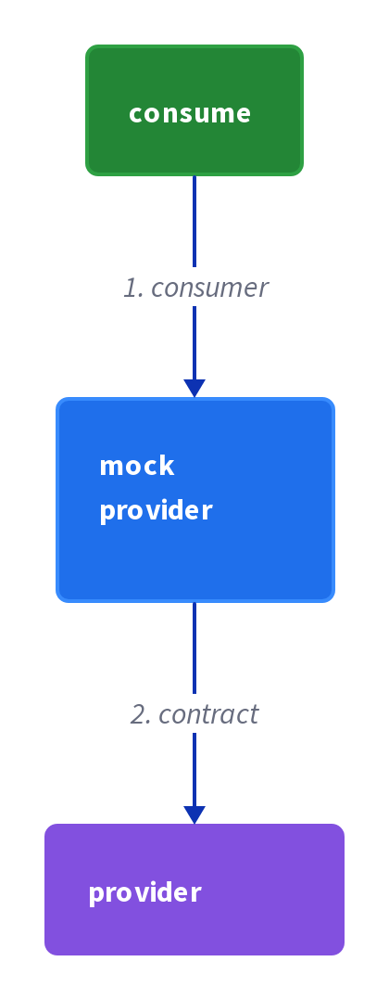

# Chapter 26: Consumer-Side Contract Test

> Verify that the client of a service can communicate with the service.

_Also known as: Chris Richardson · Microservice Patterns Ch. · microservices.io /patterns/testing/consumer-side-contract-test.html_

## Flow

### The client's half of the contract

> **Why this matters:** Every contract has two sides; this pattern puts the client under test and asks whether it can still talk to the service it depends on.

1. **The client is the subject** — The client is the service's caller — the side that forms requests and reads replies — and it is what the test verifies.

2. **Communicate means two directions** — Communication means sending a well-formed request and consuming the service's reply, so the test checks both.

3. **Contrast with consumer-driven** — The consumer-driven test checks the **provider** meets expectations; the consumer-side test checks the **client** can talk.

```java
// CLIENT SIDE — verify the client can communicate with the service (the client's half of the contract)
// PARTIES: CLI = OrderServiceProxy (the client) · SVC = Order Service (the service) · TST = the client-side test
// STATE (before):
//    request : { method:"", path:"", headers:{} }
//    response : { status:0, body:{} }
// DEF: call_get_order · CALLED BY: TST exercising the client against the service contract
// -> order_id : "ORD-4007"
//    step 1 · form request : request.method : "" -> "GET" · request.path : "" -> "/orders/ORD-4007"  BECAUSE the client must send the service's expected method and path
//    step 2 · send and receive : response.status : 0 -> 200  BECAUSE the service answers the well-formed request
//    step 3 · parse body : response.body : {} -> {"orderId":"ORD-4007","state":"CREATED"}  BECAUSE the client reads the order's JSON from the reply
// <- verdict : "pass" · response.status : 200  BECAUSE the client sent a valid request and consumed the reply
//    alt client cannot communicate : response.status : 200 -> 500  BECAUSE the client sent a malformed path
//       verdict : "pass" -> "fail"  BECAUSE the client no longer reaches the service's contract
```

### Forming the outgoing request

> **Why this matters:** The first half of "can communicate" is the request: the client must send the method, path, and headers the service expects, or nothing downstream works.

1. **Method** — The client must use the HTTP method the service's contract specifies, such as GET.

2. **Path** — The client must substitute the concrete id into the path template, such as /orders/{orderId}.

3. **Headers** — The client must advertise the format it can read, such as an Accept header.

```java
// CLIENT SIDE — the outgoing request: the client must form the service's expected method, path, and headers
// PARTIES: CLI = OrderServiceProxy · SVC = Order Service
// STATE (before):
//    outbound : { method:"", path:"", headers:{} }
//    verdict : ""
// DEF: build_request · CALLED BY: the client-side test
// -> order_id : "ORD-4007" · -> accept : "application/json"
//    step 1 · method : outbound.method : "" -> "GET"  BECAUSE the contract says GET /orders/{orderId}
//    step 2 · path : outbound.path : "" -> "/orders/ORD-4007"  BECAUSE the client substitutes the order id into the path template
//    step 3 · headers : outbound.headers : {} -> {"Accept":"application/json"}  BECAUSE the client advertises the format it can read
// <- outbound : {"method":"GET","path":"/orders/ORD-4007","headers":{"Accept":"application/json"}}
//    alt wrong path : outbound.path : "/orders/ORD-4007" -> "/order/ORD-4007"  BECAUSE a client typo drops the plural
//       verdict : "pass" -> "fail"  BECAUSE the service expects /orders, not /order
```

### Consuming the incoming response

> **Why this matters:** The second half is the reply: the client must read the status, headers, and body correctly, or it will misparse a healthy service.

1. **Read the status** — The client must confirm the call succeeded before trying to parse anything.

2. **Read the headers** — The client must check the content type so it decodes the body the right way.

3. **Decode the body** — The client must turn the reply body into its own fields, such as orderId and state.

```java
// CLIENT SIDE — the incoming response: the client must read the service's status, headers, and body correctly
// PARTIES: CLI = OrderServiceProxy · SVC = Order Service
// STATE (before):
//    received : { status:0, headers:{}, body:{} }
//    parsed : { orderId:"", state:"" }
// DEF: consume_response · CALLED BY: the client-side test after the call returns
// -> raw_reply : {"status":200,"headers":{"Content-Type":"application/json"},"body":{"orderId":"ORD-4007","state":"CREATED"}}
//    step 1 · read status : received.status : 0 -> 200  BECAUSE the client confirms the call succeeded before parsing
//    step 2 · read headers : received.headers : {} -> {"Content-Type":"application/json"}  BECAUSE the client checks the body is JSON before decoding
//    step 3 · decode body : parsed.orderId : "" -> "ORD-4007" · parsed.state : "" -> "CREATED"  BECAUSE the client decodes the JSON body into its own fields
// <- parsed : {"orderId":"ORD-4007","state":"CREATED"} · received.status : 200
//    alt unexpected body : received.body : {} -> {"error":"not found"}  BECAUSE the service returned an error shape instead
//       parsed.orderId : "ORD-4007" -> ""  BECAUSE an error body carries no orderId to decode
```

### The client is the thing under test

> **Why this matters:** Placing the test on the client side means a client regression is caught where it is written, before it ships to every service it calls.

1. **Assert on the client's own behavior** — The test checks what the client sends and what it reads, not the provider's internals.

2. **Both assertions must hold** — A passing test means the request assertion and the response assertion both succeeded.

3. **A wrong path fails fast** — If the client forms the wrong path, it cannot reach the service's endpoint and the test fails.

```java
// CLIENT SIDE — the client is the subject under test, not the provider
// PARTIES: CLI = OrderServiceProxy (subject) · SVC = Order Service (the service it talks to)
// DEF: behavior — the client's observable actions = what it sends ("GET /orders/ORD-4007") and reads ("orderId,state"), held in cli_behavior
// STATE (before):
//    cli_behavior : { sends:"", reads:"" }
//    checks : 0
//    failures : 0
// DEF: assert_client_can_talk · CALLED BY: the consumer-side test
// -> order_id : "ORD-4007"
//    step 1 · check outgoing : cli_behavior.sends : "" -> "GET /orders/ORD-4007"  BECAUSE the test asserts the client forms the correct request
//    step 2 · check incoming : cli_behavior.reads : "" -> "orderId,state"  BECAUSE the test asserts the client parses the reply's fields
//    step 3 · tally : checks : 0 -> 2  BECAUSE both the request and the response assertions pass
// <- failures : 0  BECAUSE the client can communicate with the service
//    alt client cannot talk : cli_behavior.sends : "GET /orders/ORD-4007" -> "GET /order/ORD-4007"  BECAUSE the client used the wrong path
//       failures : 0 -> 1  BECAUSE the wrong path means the client cannot reach the service's endpoint
```


## System Design Interview

> **The question:** Design provider testing from the consumer's contract. Premise: the consumer tests against a mock provider built from its contract stub, and the real provider is verified against the same contract.

**The pipeline:** consumer → mock provider (contract) → provider service



### OrderServiceProxy — the consumer under test

_Role: consumer (test)_

- builds the request: GET /orders/ORD-4007 + Accept header
- parses the reply into orderId and state

### mock provider stub

_Role: mock provider (contract)_

- returns the canned reply: status 200 + JSON body
- stands in for the real Order Service during the test

### Order Service — the real provider

_Role: provider service_

- owns the real contract: GET /orders/{orderId}
- answers the well-formed request in production

```java
// SYSTEM DESIGN — consumer-side contract test: consumer (OrderServiceProxy) -> mock provider (contract stub) -> provider service (real Order Service)
// PARTIES: CLI = OrderServiceProxy (consumer under test) · STUB = mock provider stub (contract double) · SVC = Order Service (the real provider service)
// DEF: contract — the shape the client must speak; here GET /orders/ORD-4007 answered with status 200 and body {"orderId":"ORD-4007","state":"CREATED"}
// DEF: request — the outbound message the client forms; here {"method":"GET","path":"/orders/ORD-4007","headers":{"Accept":"application/json"}}
// DEF: reply — the incoming message the client parses; here {"status":200,"body":{"orderId":"ORD-4007","state":"CREATED"}}
// STATE (before):
//    request : { method:"", path:"", headers:{} }
//    reply : { status:0, body:{} }
//    verdict : ""
// DEF: exercise_client · CALLED BY: the client-side test driving CLI against STUB
// -> order_id : "ORD-4007"
//    step 1 · CLI forms the request    request : { method:"", path:"" } -> { method:"GET", path:"/orders/ORD-4007" }
//    step 2 · STUB returns the canned reply    reply : { status:0, body:{} } -> { status:200, body:{"orderId":"ORD-4007","state":"CREATED"} }
//    step 3 · CLI parses the reply    verdict : "" -> "pass"  BECAUSE the client read status 200 and decoded orderId and state
// <- outcome : verdict "pass" · the client can communicate  BECAUSE it sent a well-formed request and consumed the stub's reply, which mirrors SVC's real contract
```

## Interview Questions

### Q1

Order Service changed its endpoint, and the OrderServiceProxy stopped talking to it. The team wants a test whose subject is the client itself — not the provider — asking whether the proxy can still communicate.

**Interviewer's question:** What does a consumer-side contract test verify, and which two directions of communication does "can communicate" cover?

**Solution:** It verifies that the client of a service can communicate with the service: the client sends a well-formed request and consumes the service's reply.

**System-design components:**
- OrderServiceProxy (client)
- Order Service
- client-side test
- request + reply assertions

```java
// CLIENT SIDE — verify the client can communicate with the service (the client's half of the contract)
// PARTIES: CLI = OrderServiceProxy (the client) · SVC = Order Service (the service) · TST = the client-side test
// STATE (before):
//    request : { method:"", path:"", headers:{} }
//    response : { status:0, body:{} }
// DEF: call_get_order · CALLED BY: TST exercising the client against the service contract
// -> order_id : "ORD-4007"
//    step 1 · form the request : request.method : "" -> "GET" · request.path : "" -> "/orders/ORD-4007"  BECAUSE the client must send the service's expected method and path
//    step 2 · send and receive : response.status : 0 -> 200  BECAUSE the service answers the well-formed request
//    step 3 · parse the body : response.body : {} -> {"orderId":"ORD-4007","state":"CREATED"}  BECAUSE the client reads the order's JSON from the reply
// <- verdict : "pass" · response.status : 200  BECAUSE the client sent a valid request and consumed the reply
//    alt client cannot communicate : response.status : 200 -> 500  BECAUSE the client sent a malformed path
//       verdict : "pass" -> "fail"  BECAUSE the client no longer reaches the service's contract
```

_This is the chapter's core statement: the client is the thing under test, and communicating means both sending and reading._

_Covers:_ The client's half of the contract

_From the 28 problems:_ 03-framework-for-system-design-interviews

### Q2

A developer typos the path template in OrderServiceProxy, changing /orders to /order. The request leaves the client but never reaches a valid endpoint.

**Interviewer's question:** What three pieces must the client get right in its outgoing request, and how does a wrong path fail the test?

**Solution:** The client must send the method, substitute the concrete id into the path template, and advertise the headers it needs; a wrong path means the request misses the service's endpoint and the test fails.

**System-design components:**
- OrderServiceProxy
- Order Service
- method/path/headers builder

```java
// CLIENT SIDE — the outgoing request: the client must form the service's expected method, path, and headers
// PARTIES: CLI = OrderServiceProxy · SVC = Order Service
// STATE (before):
//    outbound : { method:"", path:"", headers:{} }
//    verdict : ""
// DEF: build_request · CALLED BY: the client-side test
// -> order_id : "ORD-4007" · -> accept : "application/json"
//    step 1 · method : outbound.method : "" -> "GET"  BECAUSE the contract says GET /orders/{orderId}
//    step 2 · path : outbound.path : "" -> "/orders/ORD-4007"  BECAUSE the client substitutes the order id into the path template
//    step 3 · headers : outbound.headers : {} -> {"Accept":"application/json"}  BECAUSE the client advertises the format it can read
// <- outbound : {"method":"GET","path":"/orders/ORD-4007","headers":{"Accept":"application/json"}}
//    alt wrong path : outbound.path : "/orders/ORD-4007" -> "/order/ORD-4007"  BECAUSE a client typo drops the plural
//       verdict : "pass" -> "fail"  BECAUSE the service expects /orders, not /order
```

_This is the chapter's first half of "can communicate": forming the outgoing request correctly._

_Covers:_ Forming the outgoing request

_From the 28 problems:_ 03-framework-for-system-design-interviews

### Q3

The service now returns a Content-Type header and a JSON body, and the proxy must decode them into its own fields. A client that misparses a healthy reply is still broken.

**Interviewer's question:** What must the client do with the incoming response, in order?

**Solution:** The client confirms the status is a success, checks the content-type header, then decodes the body into its own fields such as orderId and state.

**System-design components:**
- OrderServiceProxy
- Order Service
- status check
- header check
- body decoder

```java
// CLIENT SIDE — the incoming response: the client must read the service's status, headers, and body correctly
// PARTIES: CLI = OrderServiceProxy · SVC = Order Service
// STATE (before):
//    received : { status:0, headers:{}, body:{} }
//    parsed : { orderId:"", state:"" }
// DEF: consume_response · CALLED BY: the client-side test after the call returns
// -> raw_reply : {"status":200,"headers":{"Content-Type":"application/json"},"body":{"orderId":"ORD-4007","state":"CREATED"}}
//    step 1 · read the status : received.status : 0 -> 200  BECAUSE the client confirms the call succeeded before parsing
//    step 2 · read the headers : received.headers : {} -> {"Content-Type":"application/json"}  BECAUSE the client checks the body is JSON before decoding
//    step 3 · decode the body : parsed.orderId : "" -> "ORD-4007" · parsed.state : "" -> "CREATED"  BECAUSE the client decodes the JSON body into its own fields
// <- parsed : {"orderId":"ORD-4007","state":"CREATED"} · received.status : 200
//    alt unexpected body : received.body : {} -> {"error":"not found"}  BECAUSE the service returned an error shape instead
//       parsed.orderId : "ORD-4007" -> ""  BECAUSE an error body carries no orderId to decode
```

_This is the chapter's second half of "can communicate": consuming the incoming response correctly._

_Covers:_ Consuming the incoming response

_From the 28 problems:_ 03-framework-for-system-design-interviews

### Q4

The team debates where to put the test: on the provider (consumer-driven) or on the client (consumer-side). They need the test to catch a client regression the moment it is written.

**Interviewer's question:** Which side is the subject under test in a consumer-side contract test, and how does it relate to the consumer-driven contract test?

**Solution:** The client is the subject: the test asserts what the client sends and what it reads, and both assertions must hold; it complements the consumer-driven test, which checks the provider meets expectations.

**System-design components:**
- OrderServiceProxy (subject)
- Order Service
- request assertion
- response assertion

```java
// CLIENT SIDE — the client is the subject under test, not the provider
// PARTIES: CLI = OrderServiceProxy (subject) · SVC = Order Service (the service it talks to)
// DEF: behavior — the client's observable actions; here what it sends ("GET /orders/ORD-4007") and reads ("orderId,state"), held in cli_behavior
// STATE (before):
//    cli_behavior : { sends:"", reads:"" }
//    checks : 0
//    failures : 0
// DEF: assert_client_can_talk · CALLED BY: the consumer-side test
// -> order_id : "ORD-4007"
//    step 1 · check outgoing : cli_behavior.sends : "" -> "GET /orders/ORD-4007"  BECAUSE the test asserts the client forms the correct request
//    step 2 · check incoming : cli_behavior.reads : "" -> "orderId,state"  BECAUSE the test asserts the client parses the reply's fields
//    step 3 · tally : checks : 0 -> 2  BECAUSE both the request and the response assertions pass
// <- failures : 0  BECAUSE the client can communicate with the service
//    alt client cannot talk : cli_behavior.sends : "GET /orders/ORD-4007" -> "GET /order/ORD-4007"  BECAUSE the client used the wrong path
//       failures : 0 -> 1  BECAUSE the wrong path means the client cannot reach the service's endpoint
```

_This is the chapter's framing: the client is the subject, and the two assertions together prove it can communicate._

_Covers:_ The client is the thing under test · The client's half of the contract

_From the 28 problems:_ 03-framework-for-system-design-interviews

## Key Concepts

### The Problem

**The client's half goes unverified.** You need an automated check that the client of a service can still communicate with that service.


### The Solution

Verify that the client of a service can communicate with the service.

```java
// CLIENT SIDE — verify the client can communicate with the service (the client's half of the contract)
// PARTIES: CLI = OrderServiceProxy (the client) · SVC = Order Service (the service) · TST = the client-side test
// STATE (before):
//    request : { method:"", path:"", headers:{} }
//    response : { status:0, body:{} }
// DEF: call_get_order · CALLED BY: TST exercising the client against the service contract
// -> order_id : "ORD-4007"
//    step 1 · form the request : request.method : "" -> "GET" · request.path : "" -> "/orders/ORD-4007"  BECAUSE the client must send the service's expected method and path
//    step 2 · send and receive : response.status : 0 -> 200  BECAUSE the service answers the well-formed request
//    step 3 · parse the body : response.body : {} -> {"orderId":"ORD-4007","state":"CREATED"}  BECAUSE the client reads the order's JSON from the reply
// <- verdict : "pass" · response.status : 200  BECAUSE the client sent a valid request and consumed the reply
//    alt client cannot communicate : response.status : 200 -> 500  BECAUSE the client sent a malformed path
//       verdict : "pass" -> "fail"  BECAUSE the client no longer reaches the service's contract
```


### Key Facts

| Fact | Detail | In the wild |
|---|---|---|
| Consumer-side contract test | Verify that the client of a service can communicate with the service. | A consumer-side suite asserts the proxy sends GET /orders/{orderId} and decodes the returned order. |
| Verifies the client, not the provider | This pattern checks the client's side, while the consumer-driven contract test checks the provider's side. | A client that sends a well-formed request still fails if the service returns a 404. |
| Send and read, nothing in between | The test verifies the client forms the expected request (method, path, headers, body) and consumes the expected response (status, headers, body). | A miss on the path or a misparse of the body is caught, while deeper business logic is left to other tests. |


### Tradeoffs & When

- This pattern checks the client's side, while the consumer-driven contract test checks the provider's side.
- The test verifies the client forms the expected request (method, path, headers, body) and consumes the expected response (status, headers, body).


<details><summary>All concepts (index)</summary>

### Problem: The client's half goes unverified

**Why.** A service can change, and a client can regress, without anyone noticing that the two no longer fit together.

**Claim.** You need an automated check that the client of a service can still communicate with that service.

**Grounding.** The pattern's own statement names the client as the thing under test, not the service.

**In the wild.** An OrderServiceProxy that builds the wrong path silently stops talking to Order Service.
### Solution: Consumer-side contract test

**Why.** Communication is the client's own responsibility, so it deserves its own test.

**Claim.** Verify that the client of a service can communicate with the service.

**Grounding.** The test exercises the client's outgoing request and its parsing of the incoming reply.

**In the wild.** A consumer-side suite asserts the proxy sends GET /orders/{orderId} and decodes the returned order.
### Tradeoff: Verifies the client, not the provider

**Why.** Passing this test proves only that the client speaks the contract; it says nothing about whether the provider behaves correctly.

**Claim.** This pattern checks the client's side, while the consumer-driven contract test checks the provider's side.

**Grounding.** The two pattern statements are complementary: the provider meets expectations, and the client can communicate.

**In the wild.** A client that sends a well-formed request still fails if the service returns a 404.
### Tradeoff: Send and read, nothing in between

**Why.** "Communicate" is concrete, so the test targets two moments and nothing else.

**Claim.** The test verifies the client forms the expected request (method, path, headers, body) and consumes the expected response (status, headers, body).

**Grounding.** Those are the same shape fields a REST contract carries on the consumer-provider relationship.

**In the wild.** A miss on the path or a misparse of the body is caught, while deeper business logic is left to other tests.

</details>


## Quiz

1. What does a consumer-side contract test verify?

   - A. That the provider meets every client's expectations
   - B. That the client of a service can communicate with the service
   - C. That the database is consistent
   - D. That messages are encrypted

<details><summary>Reveal answer</summary>

**B.** The pattern statement is: verify that the client of a service can communicate with the service. Verifying the provider meets expectations is the consumer-driven test, and the other options are unrelated.

</details>

2. Which side is the subject under test in a consumer-side contract test?

   - A. The provider
   - B. The client
   - C. The message broker
   - D. The network

<details><summary>Reveal answer</summary>

**B.** The name and the pattern statement both point at the client as the subject under test. The provider is the subject of the consumer-driven test instead, and the broker or network are not the subject.

</details>

3. What two directions of communication does "can communicate" concretely cover?

   - A. Sending a well-formed request and consuming the reply
   - B. Reading and writing the database
   - C. Encrypting and decrypting
   - D. Logging and tracing

<details><summary>Reveal answer</summary>

**A.** Communicating with a service means the client forms the outgoing request and consumes the incoming response — status, headers, and body. Database, encryption, and observability concerns are not what this pattern verifies.

</details>

4. How does a consumer-side contract test relate to a consumer-driven contract test?

   - A. They are the same thing
   - B. Consumer-side checks the client can talk; consumer-driven checks the provider meets clients' expectations
   - C. The consumer-side test replaces the provider
   - D. The consumer-driven test only tests the client

<details><summary>Reveal answer</summary>

**B.** They are complementary halves: consumer-driven verifies the provider against consumers' expectations, while consumer-side verifies the client can communicate. They are not identical, and neither replaces the provider.

</details>

