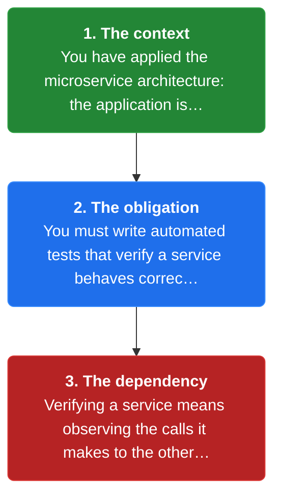
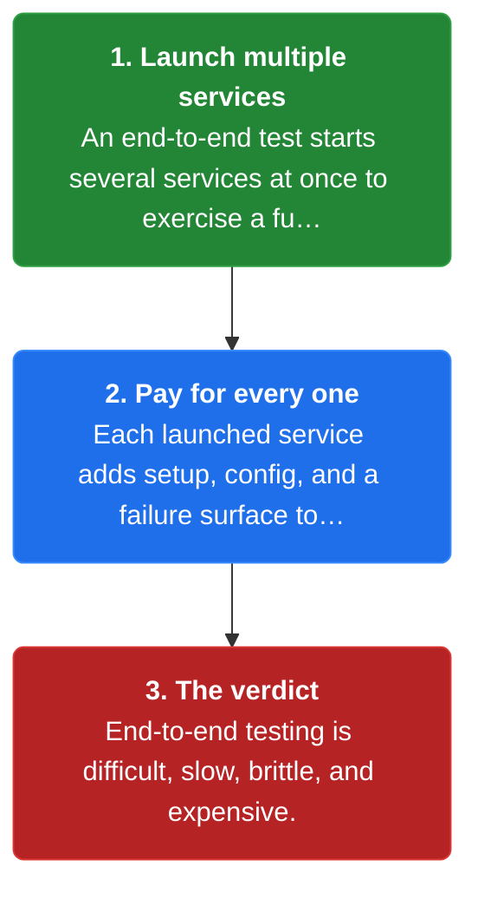
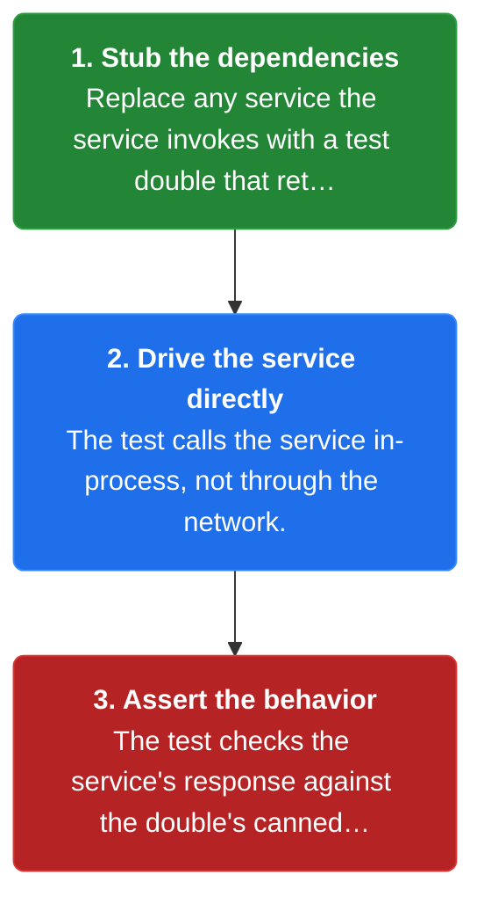
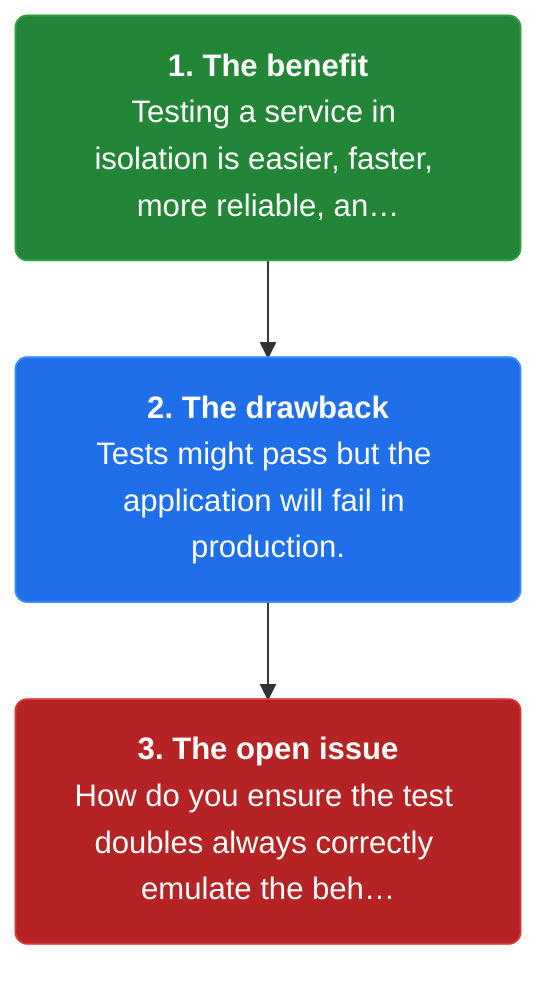

# Chapter 27: Service Component Test

> A test suite that tests a service in isolation using test doubles for any services that it invokes.

_Also known as: Chris Richardson · Microservice Patterns Ch. · microservices.io /patterns/testing/service-component-test.html_

## Flow

### A service among many services

> **Why this matters:** A service rarely stands alone; it invokes other services, so verifying it behaves correctly means exercising it and its outbound calls.



1. **The context** — You have applied the microservice architecture: the application is numerous services that often invoke each other.

2. **The obligation** — You must write automated tests that verify a service behaves correctly.

3. **The dependency** — Verifying a service means observing the calls it makes to the other services it invokes.

```java
// SERVICE SIDE — a service invokes other services, so automated tests must verify it behaves correctly
// PARTIES: OSVC = Order Service · KSVC = Kitchen Service (dependency)
// STATE (before):
//    order : { id:"", state:"PENDING", ticket:"" }
//    calls : []
// DEF: place_order · CALLED BY: a client of Order Service
// -> order_id : "ORD-4007"
//    step 1 · create order : order.id : "" -> "ORD-4007"  BECAUSE the service records the incoming order
//    step 2 · start cooking : order.ticket : "" -> "T-88"  BECAUSE Order Service invokes Kitchen Service to create a ticket
//    step 3 · record the call : calls : [] -> ["KitchenService.createTicket"]  BECAUSE the outbound call must be tracked for the test
// <- order : {"id":"ORD-4007","state":"PENDING","ticket":"T-88"} · calls.length : 1
//    alt another order : order.id : "ORD-4007" -> "ORD-4008"  BECAUSE a second scenario starts a fresh order
```

### Why end-to-end tests fail you

> **Why this matters:** A test that launches every service is the obvious approach and the wrong one: one flaky service takes down the whole run.



1. **Launch multiple services** — An end-to-end test starts several services at once to exercise a full flow.

2. **Pay for every one** — Each launched service adds setup, config, and a failure surface to the test.

3. **The verdict** — End-to-end testing is difficult, slow, brittle, and expensive.

```java
// E2E SIDE — an end-to-end test launches multiple services, which makes it slow and brittle
// PARTIES: TST = end-to-end test · OSVC = Order Service · KSVC = Kitchen Service · DSVC = Delivery Service
// STATE (before):
//    launched : []
//    checks : 0
// DEF: run_e2e · CALLED BY: TST to verify an order flows through the system
// -> order_id : "ORD-4007"
//    step 1 · launch all : launched : [] -> ["OrderService","KitchenService","DeliveryService"]  BECAUSE the test must start every service the flow touches
//    step 2 · configure : checks : 0 -> 1  BECAUSE the test wires each service's data and config before running
//    step 3 · one flake fails all : launched : ["OrderService","KitchenService","DeliveryService"] -> ["OrderService","KitchenService","DeliveryService","FAILED:DeliveryService"]  BECAUSE one flaky service fails the whole run
// <- launched.length : 4 · result : "brittle"  BECAUSE the test depends on every service being up
//    alt isolated test : launched : ["OrderService","KitchenService","DeliveryService","FAILED:DeliveryService"] -> ["OrderService"]  BECAUSE a component test starts only the service under test
```

### Test the service in isolation

> **Why this matters:** Swap the real dependencies for test doubles and the service becomes a small, fast, dependable thing to test.



1. **Stub the dependencies** — Replace any service the service invokes with a test double that returns canned replies.

2. **Drive the service directly** — The test calls the service in-process, not through the network.

3. **Assert the behavior** — The test checks the service's response against the double's canned reply.

```java
// SERVICE SIDE — test the service in isolation using test doubles for the services it invokes
// PARTIES: OSVC = Order Service (under test) · DBLE = test double for Kitchen Service
// STATE (before):
//    real_dep : "KitchenService"        // the real dependency, not launched
//    double : { createTicket:"" }
//    order : { id:"", state:"PENDING" }
//    ticket_seen : ""
// DEF: test_in_isolation · CALLED BY: the service component test
// -> order_id : "ORD-4007"
//    step 1 · stub the dependency : double.createTicket : "" -> "T-88"  BECAUSE the test double returns a fixed ticket instead of a real Kitchen Service
//    step 2 · drive the service : order.id : "" -> "ORD-4007"  BECAUSE the test calls Order Service directly, not over the network
//    step 3 · assert : ticket_seen : "" -> "T-88"  BECAUSE the service read the double's reply
// <- order : {"id":"ORD-4007","state":"PENDING"} · double.createTicket : "T-88" · real_dep not launched
//    alt double drifts : double.createTicket : "T-88" -> "T-99"  BECAUSE the double now returns a shape the real service no longer returns
//       ticket_seen : "T-88" -> "T-99"  BECAUSE the test now trusts a stale reply, hiding a production mismatch
```

### The resulting context

> **Why this matters:** Isolation buys speed and reliability, but it introduces a new risk: a test can be green while production is red.



1. **The benefit** — Testing a service in isolation is easier, faster, more reliable, and cheap.

2. **The drawback** — Tests might pass but the application will fail in production.

3. **The open issue** — How do you ensure the test doubles always correctly emulate the behavior of the invoked services?

```java
// SERVICE SIDE — resulting context: isolation is cheap, but doubles can drift from the real service
// PARTIES: OSVC = Order Service · DBLE = test double · PROD = production
// STATE (before):
//    test_result : ""
//    prod_result : ""
//    drift : false
// DEF: run_suite · CALLED BY: the pipeline, then compared against production
// -> suite : "order-service-component"
//    step 1 · run in isolation : test_result : "" -> "green"  BECAUSE testing one service is fast, reliable, and cheap
//    step 2 · double is stale : drift : false -> true  BECAUSE the double still returns an old Kitchen Service reply shape
//    step 3 · deploy : prod_result : "" -> "red"  BECAUSE the real Kitchen Service changed and the test never caught it
// <- test_result : "green" · prod_result : "red"  BECAUSE tests can pass while the application fails in production
//    alt doubles stay faithful : drift : true -> false  BECAUSE the doubles are kept in sync with the invoked services' contracts
//       prod_result : "red" -> "green"  BECAUSE the test now mirrors the real behavior
```


## Key Concepts

### The Problem

**A service is never alone.** You must write automated tests that verify that a service behaves correctly — which means covering its outbound calls.


### The Solution

Test a service in isolation using test doubles for any services that it invokes.


### Key Facts

| Fact | Detail | In the wild |
|---|---|---|
| Service component test | Test a service in isolation using test doubles for any services that it invokes. | A suite stubs Kitchen Service, drives Order Service directly, and asserts the order's behavior. |
| Isolation is cheap, production is the truth | Testing a service in isolation is easier, faster, more reliable, and cheap — but tests might pass while the application fails in production. | A green component suite does not prove the real Kitchen Service still accepts the ticket the double returns. |
| Doubles must stay faithful | The open issue is how to ensure that the test doubles always correctly emulate the behavior of the invoked services. | When the double returns an old reply shape, the suite stays green while production breaks. |


### Tradeoffs & When

- Testing a service in isolation is easier, faster, more reliable, and cheap — but tests might pass while the application fails in production.
- The open issue is how to ensure that the test doubles always correctly emulate the behavior of the invoked services.


<details><summary>All concepts (index)</summary>

### Problem: A service is never alone

**Why.** In a microservice architecture the application consists of numerous services, and services often invoke other services.

**Claim.** You must write automated tests that verify that a service behaves correctly — which means covering its outbound calls.

**Grounding.** The pattern's context states the services-and-dependencies shape directly.

**In the wild.** Order Service invokes Kitchen Service, so an order's correct behavior depends on that call.
### Solution: Service component test

**Why.** Launching every service for a test is difficult, slow, brittle, and expensive.

**Claim.** Test a service in isolation using test doubles for any services that it invokes.

**Grounding.** Spring Cloud Contract is an open source project that supports this style of testing.

**In the wild.** A suite stubs Kitchen Service, drives Order Service directly, and asserts the order's behavior.
### Tradeoff: Isolation is cheap, production is the truth

**Why.** Isolation is a benefit precisely because it removes the real services, but that removal is also the risk.

**Claim.** Testing a service in isolation is easier, faster, more reliable, and cheap — but tests might pass while the application fails in production.

**Grounding.** The pattern lists this benefit and this drawback side by side.

**In the wild.** A green component suite does not prove the real Kitchen Service still accepts the ticket the double returns.
### Tradeoff: Doubles must stay faithful

**Why.** A test double is only as good as its imitation of the real service.

**Claim.** The open issue is how to ensure that the test doubles always correctly emulate the behavior of the invoked services.

**Grounding.** The pattern's resulting context names this as an unresolved issue.

**In the wild.** When the double returns an old reply shape, the suite stays green while production breaks.

</details>


## Quiz

1. What is a service component test?

   - A. A test that launches every service
   - B. A test suite that tests a service in isolation using test doubles for any services it invokes
   - C. A load test
   - D. A security audit

<details><summary>Reveal answer</summary>

**B.** The solution is a test suite that tests a service in isolation using test doubles for any services it invokes. Launching every service is the end-to-end approach the pattern warns against, and load or security testing is unrelated.

</details>

2. What is the problem with end-to-end testing, per the pattern's forces?

   - A. It is too cheap
   - B. It is difficult, slow, brittle, and expensive
   - C. It never finds bugs
   - D. It requires no services

<details><summary>Reveal answer</summary>

**B.** The pattern states that end-to-end testing — tests that launch multiple services — is difficult, slow, brittle, and expensive. The other options invert or distort that verdict.

</details>

3. What is a key drawback of service component tests?

   - A. They are slower than end-to-end tests
   - B. Tests might pass but the application will fail in production
   - C. They need no test doubles
   - D. They require a distributed transaction

<details><summary>Reveal answer</summary>

**B.** The listed drawback is that tests might pass but the application will fail in production. Isolation is faster, not slower, and the pattern depends on test doubles rather than avoiding them.

</details>

4. What open issue does the pattern leave unresolved?

   - A. How to ensure the test doubles always correctly emulate the behavior of the invoked services
   - B. How to remove all services
   - C. How to avoid writing any tests
   - D. How to merge services into one

<details><summary>Reveal answer</summary>

**A.** The resulting context raises the issue of how to ensure the test doubles always correctly emulate the invoked services' behavior. The other options are not part of the pattern.

</details>

