# Chapter 28: Access Token

> The API gateway authenticates each request and passes an access token that securely identifies the requestor to every service that handles the request.

_Also known as: Chris Richardson · Microservice Patterns Ch. 28 · microservices.io /patterns/security/access-token.html_

## Flow

### Authenticate at the gateway

> **Why this matters:** The API gateway is the single entry point for every client request. If each downstream service re-authenticated the same requestor, the cost and the attack surface would multiply; authenticating once at the gateway and minting a portable token buys a single, trusted identity statement for the whole system.

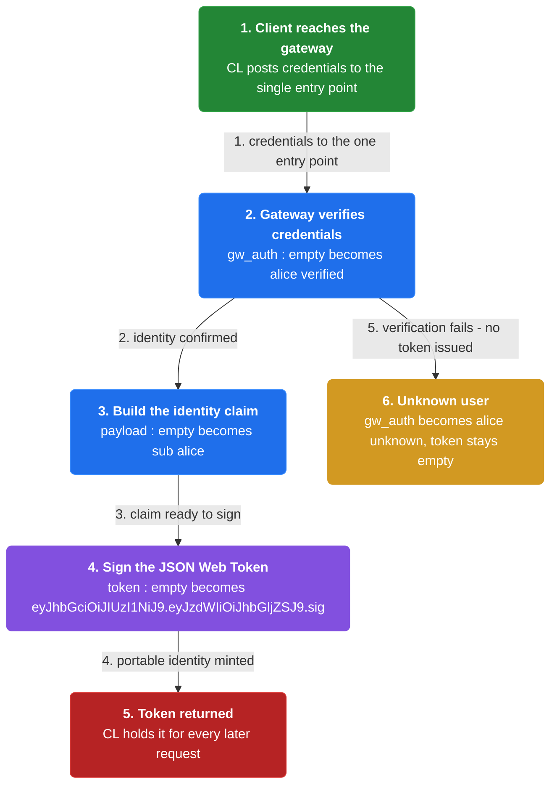

1. **Client reaches the single entry point** — The client sends its request, with credentials, to the API gateway — the one entry point for all client requests.

2. **The gateway authenticates the request** — The gateway authenticates the request, confirming who the requestor is.

3. **The gateway issues an access token** — The gateway mints an access token, e.g. a JSON Web Token, that securely identifies the requestor to ride along with later requests.

```java
// API GATEWAY SIDE — authenticate the requestor once and mint a token that carries their identity
// PARTIES: CL = client app · GW = API Gateway (single entry point) · SVC = order service
// DEF: auth — confirming WHO the requestor is, once, at the gateway; here gw_auth = {"alice":"verified"}
// STATE (before):
//    gw_auth : {}                         // identities GW has verified this session
//    payload : ""                         // the identity claim GW will sign into the token
//    token : ""                           // the access token GW will hand back
// DEF: authenticate · CALLED BY: CL posting credentials to the login route
// -> credentials : {"user":"alice","password":"hunter2"}
//    step 1 · GW verifies the credentials    // gw_auth : {} -> {"alice":"verified"}
//    step 2 · GW builds the identity claim    // payload : "" -> {"sub":"alice"}
//    step 3 · GW signs the claim into a JSON Web Token    // token : "" -> "eyJhbGciOiJIUzI1NiJ9.eyJzdWIiOiJhbGljZSJ9.sig"  BECAUSE the signature lets any service verify the identity without re-authenticating
// <- token : "eyJhbGciOiJIUzI1NiJ9.eyJzdWIiOiJhbGljZSJ9.sig" returned to CL for every later request
//    alt unknown user : gw_auth : {} -> {"alice":"unknown"} · token : "" -> ""  BECAUSE there is no verified identity to sign, so no token is issued
```

### Verify identity and authorization at the service

> **Why this matters:** A token only helps if services can trust it. Each service must be able to confirm who made the request and that they are allowed to perform the operation, without a round-trip back to the gateway.

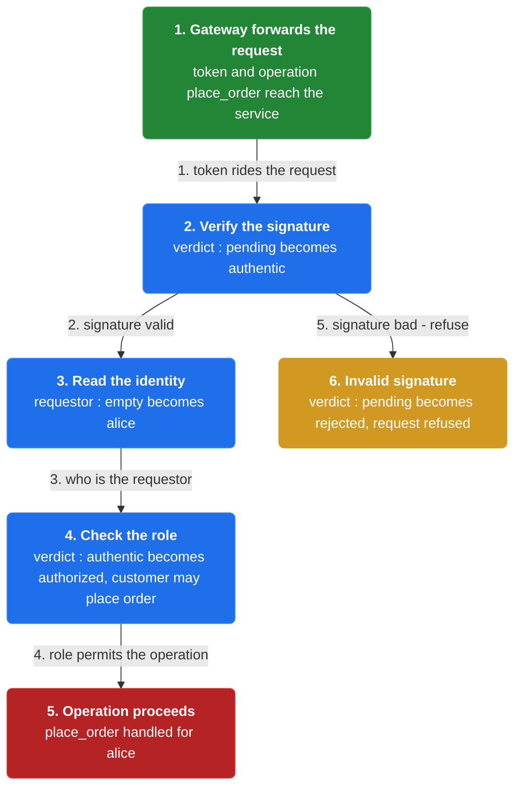

1. **The gateway forwards the token** — The gateway passes the access token in each request it forwards to a service.

2. **The service verifies the requestor** — The receiving service checks the token to learn the identity of the requestor.

3. **The service checks authorization** — The service verifies that the requestor is authorized to perform the requested operation.

```java
// ORDER SERVICE SIDE — verify the requestor identity and authorization straight from the token
// PARTIES: GW = API Gateway · SVC = order service · CL = client app
// DEF: allowed — whether the requestor may perform the operation; here "alice" is allowed = verdict "authorized"
// DEF: role — the category of actor a requestor belongs to; here role = "customer" from allowed_roles {"alice":"customer"}
// STATE (before):
//    allowed_roles : {"alice":"customer"}    // roles that may act on orders
//    requestor : ""                          // identity read out of the token
//    verdict : "pending"                     // the authorization decision, not yet made
// DEF: handle_order · CALLED BY: GW forwarding a request that carries the token
// -> token : "eyJhbGciOiJIUzI1NiJ9.eyJzdWIiOiJhbGljZSJ9.sig" · -> operation : "place_order"
//    step 1 · SVC verifies the token signature    // verdict : "pending" -> "authentic"
//    step 2 · SVC reads the identity from the token claims    // requestor : "" -> "alice"
//    step 3 · SVC checks the role against the operation    // verdict : "authentic" -> "authorized"  BECAUSE allowed_roles maps "alice" to "customer", which may place an order
// <- verdict : "authorized" — SVC proceeds with "place_order"
//    alt invalid signature : verdict : "pending" -> "rejected" — SVC refuses the request
```

### Propagate the token across service calls

> **Why this matters:** Requests are not one hop; a service often invokes other services to satisfy a request. Passing the same token onward keeps the requestor's identity intact across the entire call chain, so no service has to re-establish it.

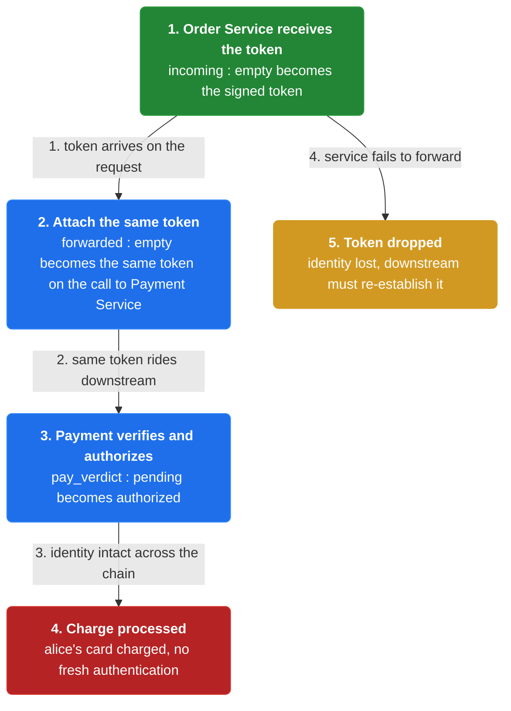

1. **A service receives the token** — An intermediate service receives a request that carries the access token.

2. **It includes the token downstream** — When that service invokes another service, it includes the same access token in the request.

3. **The next service verifies from the same token** — The downstream service verifies identity and authorization from that token, with no fresh authentication.

```java
// PAYMENT SERVICE SIDE — a service includes the token when it calls another service
// PARTIES: SVC = order service · PAY = payment service · CL = client app
// DEF: verdict — the authorization decision a service reaches about a request; here pay_verdict = "pending" then "authorized"
// STATE (before):
//    incoming : ""                     // token SVC received on its own request
//    forwarded : ""                    // token SVC sends onward to PAY
//    pay_verdict : "pending"           // PAY's authorization decision
// DEF: invoke_payment · CALLED BY: SVC needing to charge the customer's card
// -> token : "eyJhbGciOiJIUzI1NiJ9.eyJzdWIiOiJhbGljZSJ9.sig"
//    step 1 · SVC stores the token it received    // incoming : "" -> "eyJhbGciOiJIUzI1NiJ9.eyJzdWIiOiJhbGljZSJ9.sig"
//    step 2 · SVC attaches the same token to its call to PAY    // forwarded : "" -> "eyJhbGciOiJIUzI1NiJ9.eyJzdWIiOiJhbGljZSJ9.sig"
//    step 3 · PAY verifies the token and authorizes the charge    // pay_verdict : "pending" -> "authorized"  BECAUSE the token still identifies "alice", whose role permits the charge
// <- pay_verdict : "authorized" — the charge is processed for "alice"
```


## System Design Interview

**The pipeline:** client → identity provider (token issuance) → API gateway (validation) → service

### identity provider — the token issuer

_Role: identity provider (token issuance)_

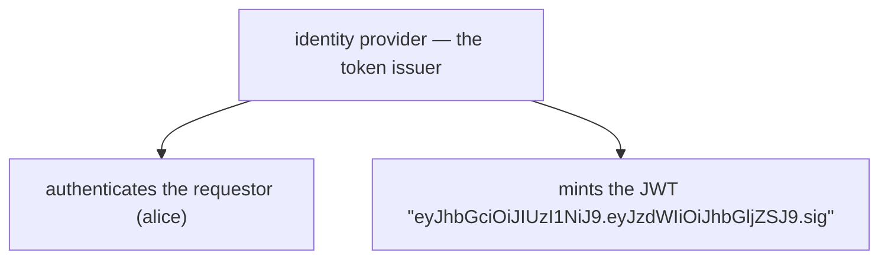

### API gateway — the single entry point

_Role: API gateway (validation)_

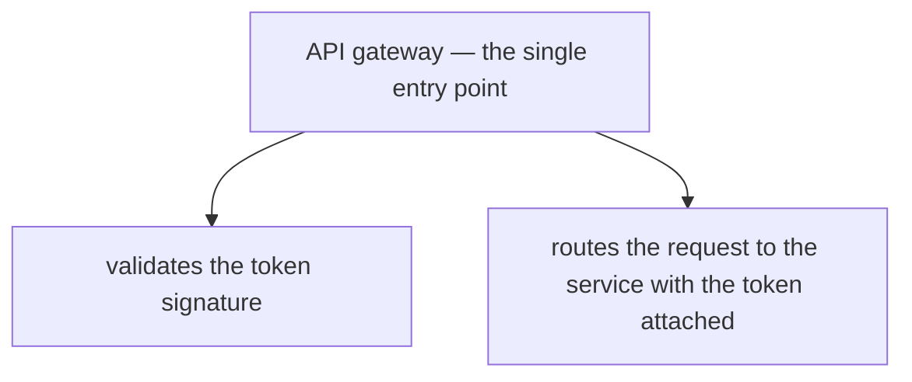

### Order Service — the verifier

_Role: service_

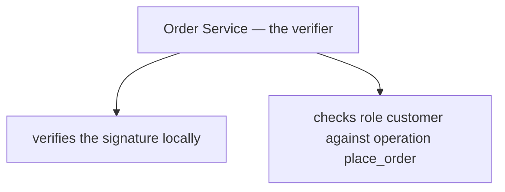

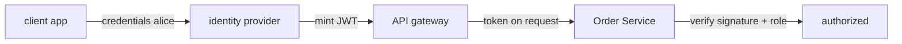

```java
// SYSTEM DESIGN — access token: client -> identity provider (token issuance) -> API gateway (validation) -> service (Order Service verifies + authorizes)
// PARTIES: CL = client app (requestor) · IDP = identity provider (token issuer) · GW = API gateway (validates and routes) · SVC = Order Service (verifies and authorizes)
// DEF: token — the signed credential that identifies the requestor; here "eyJhbGciOiJIUzI1NiJ9.eyJzdWIiOiJhbGljZSJ9.sig" (a JSON Web Token with claim {"sub":"alice"})
// DEF: role — the category the requestor belongs to; here "customer" from {"alice":"customer"}
// DEF: verdict — the authorization decision a service reaches; here "authorized"
// STATE (before):
//    auth : {}             // identities the provider has verified
//    token : ""
//    verdict : "pending"
// DEF: authenticate_and_route · CALLED BY: CL posting credentials on the login route
// -> credentials : {"user":"alice","password":"hunter2"}
//    step 1 · IDP authenticates alice    auth : {} -> {"alice":"verified"}
//    step 2 · IDP mints the JWT    token : "" -> "eyJhbGciOiJIUzI1NiJ9.eyJzdWIiOiJhbGljZSJ9.sig"  BECAUSE the signature lets any service verify the identity without re-authenticating
//    step 3 · GW validates the signature and routes the token to SVC    token : "eyJhbGciOiJIUzI1NiJ9.eyJzdWIiOiJhbGljZSJ9.sig" -> "eyJhbGciOiJIUzI1NiJ9.eyJzdWIiOiJhbGljZSJ9.sig"
//    step 4 · SVC reads the claim and checks the role    verdict : "pending" -> "authorized"  BECAUSE {"sub":"alice"} maps to role "customer" which may place the order
// <- outcome : verdict "authorized" · no gateway round-trip  BECAUSE each service validates the token locally
```

## Interview Questions

### Q1

The API gateway is the single entry point for every client request. Instead of having each downstream service re-authenticate the same requestor, the team wants one trusted identity statement that rides along with later requests.

**Interviewer's question:** Who authenticates the requestor and issues the access token, and what does that token carry?

**Solution:** The API gateway authenticates the request and mints an access token — e.g. a JSON Web Token — that securely identifies the requestor for every later request.

**System-design components:**
- Client app
- API gateway
- JSON Web Token
- identity claim

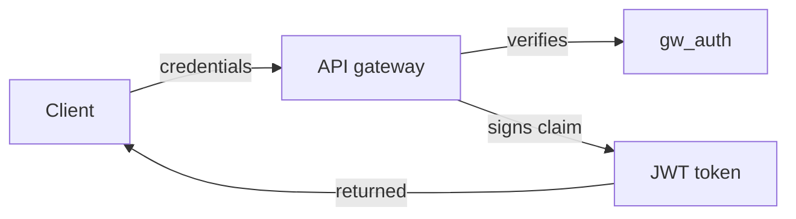

```java
// API GATEWAY SIDE — authenticate the requestor once and mint a token that carries their identity
// PARTIES: CL = client app · GW = API Gateway (single entry point) · SVC = order service
// DEF: auth — confirming WHO the requestor is, once, at the gateway; here gw_auth = {"alice":"verified"}
// STATE (before):
//    gw_auth : {}                              // identities GW has verified this session
//    payload : ""                              // the identity claim GW will sign into the token
//    token : ""                                // the access token GW will hand back
// DEF: authenticate · CALLED BY: CL posting credentials to the login route
// -> credentials : {"user":"alice","password":"hunter2"}
//    step 1 · GW verifies the credentials    gw_auth : {} -> {"alice":"verified"}
//    step 2 · GW builds the identity claim    payload : "" -> {"sub":"alice"}
//    step 3 · GW signs the claim into a JSON Web Token    token : "" -> "eyJhbGciOiJIUzI1NiJ9.eyJzdWIiOiJhbGljZSJ9.sig"  BECAUSE the signature lets any service verify the identity without re-authenticating
// <- token : "eyJhbGciOiJIUzI1NiJ9.eyJzdWIiOiJhbGljZSJ9.sig" returned to CL for every later request
//    alt unknown user : gw_auth : {} -> {"alice":"unknown"} · token : "" -> ""  BECAUSE there is no verified identity to sign, so no token is issued
```

_This is the chapter's authenticate-at-the-gateway step: one authentication mints a portable signed token._

_Covers:_ Authenticate at the gateway

_From the 28 problems:_ 26-payment-system · 27-digital-wallet

### Q2

A service receives a forwarded request carrying the token and must decide, without a round-trip to the gateway, whether the requestor may perform the operation.

**Interviewer's question:** How does a service verify the requestor and check authorization straight from the token?

**Solution:** The service verifies the token signature to confirm identity, reads the identity from the token's claims, then checks the requestor's role against the operation before proceeding.

**System-design components:**
- Order service
- token signature check
- role map
- authorization verdict

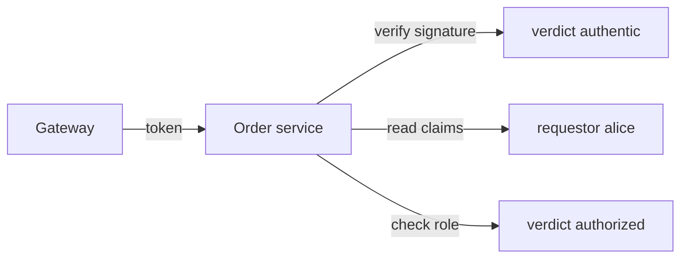

```java
// ORDER SERVICE SIDE — verify the requestor identity and authorization straight from the token
// PARTIES: GW = API Gateway · SVC = order service · CL = client app
// DEF: role — the category of actor a requestor belongs to; here "customer" from allowed_roles {"alice":"customer"}
// STATE (before):
//    allowed_roles : {"alice":"customer"}     // roles that may act on orders
//    requestor : ""                           // identity read out of the token
//    verdict : "pending"                      // the authorization decision, not yet made
// DEF: handle_order · CALLED BY: GW forwarding a request that carries the token
// -> token : "eyJhbGciOiJIUzI1NiJ9.eyJzdWIiOiJhbGljZSJ9.sig" · -> operation : "place_order"
//    step 1 · SVC verifies the token signature    verdict : "pending" -> "authentic"
//    step 2 · SVC reads the identity from the token claims    requestor : "" -> "alice"
//    step 3 · SVC checks the role against the operation    verdict : "authentic" -> "authorized"  BECAUSE allowed_roles maps "alice" to "customer", which may place an order
// <- verdict : "authorized" — SVC proceeds with "place_order"
//    alt invalid signature : verdict : "pending" -> "rejected" — SVC refuses the request
```

_This is the chapter's verify-at-the-service step: identity and authorization come from the token, with no gateway round-trip._

_Covers:_ Verify identity and authorization at the service

_From the 28 problems:_ 26-payment-system · 27-digital-wallet

### Q3

Order Service needs to charge the customer's card, so it calls Payment Service. The requestor's identity must survive that second hop intact.

**Interviewer's question:** When one service invokes another, what should it do with the access token, and why?

**Solution:** The service includes the same access token in the request it makes to the other service, so the downstream service verifies identity and authorization from the same token with no fresh authentication.

**System-design components:**
- Order service
- Payment service
- forwarded token
- payment verdict

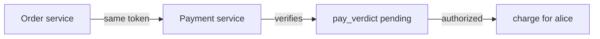

```java
// PAYMENT SERVICE SIDE — a service includes the token when it calls another service
// PARTIES: SVC = order service · PAY = payment service · CL = client app
// STATE (before):
//    incoming : ""                       // token SVC received on its own request
//    forwarded : ""                      // token SVC sends onward to PAY
//    pay_verdict : "pending"             // PAY's authorization decision
// DEF: invoke_payment · CALLED BY: SVC needing to charge the customer's card
// -> token : "eyJhbGciOiJIUzI1NiJ9.eyJzdWIiOiJhbGljZSJ9.sig"
//    step 1 · SVC stores the token it received    incoming : "" -> "eyJhbGciOiJIUzI1NiJ9.eyJzdWIiOiJhbGljZSJ9.sig"
//    step 2 · SVC attaches the same token to its call to PAY    forwarded : "" -> "eyJhbGciOiJIUzI1NiJ9.eyJzdWIiOiJhbGljZSJ9.sig"
//    step 3 · PAY verifies the token and authorizes the charge    pay_verdict : "pending" -> "authorized"  BECAUSE the token still identifies "alice", whose role permits the charge
// <- pay_verdict : "authorized" — the charge is processed for "alice"
```

_This is the chapter's propagate-the-token step: the same token rides along the whole call chain._

_Covers:_ Propagate the token across service calls

_From the 28 problems:_ 26-payment-system · 27-digital-wallet

### Q4

Every service in the chain must now validate the token itself. The team worries about the cost and attack surface of spreading verification duty across services.

**Interviewer's question:** What does the Access Token pattern buy, and what new duty does it push onto every service?

**Solution:** It buys that the requestor's identity is securely passed around the system, so services can verify authorization without consulting the gateway — at the cost that each service must implement token validation.

**System-design components:**
- API gateway
- token-carrying request
- per-service validation
- distributed authorization

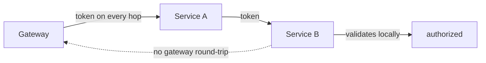

```java
// SERVICE SIDE — the token lets each service authorize locally, without a round-trip back to the gateway
// PARTIES: GW = API gateway · SVCA = order service · SVCB = payment service
// DEF: verdict — the authorization decision a service reaches about a request; here "authorized"
// STATE (before):
//    token : "eyJhbGciOiJIUzI1NiJ9.eyJzdWIiOiJhbGljZSJ9.sig"
//    gateway_consulted : 0                // how many times a service asked GW to re-check
//    svcb_verdict : "pending"
// DEF: authorize_locally · CALLED BY: SVCB handling a forwarded request
// -> operation : "charge_card"
//    step 1 · SVCB reads the token it was given    token : "eyJhbGciOiJIUzI1NiJ9.eyJzdWIiOiJhbGljZSJ9.sig" -> "eyJhbGciOiJIUzI1NiJ9.eyJzdWIiOiJhbGljZSJ9.sig"
//    step 2 · SVCB validates and authorizes locally    svcb_verdict : "pending" -> "authorized"  BECAUSE the token already identifies "alice" and the service checks the role itself
//    step 3 · no gateway round-trip    gateway_consulted : 0 -> 0  BECAUSE verification duty is distributed to the services, not delegated back to GW
// <- svcb_verdict : "authorized" · gateway_consulted : 0 · each service must implement its own token validation
//    alt no token pattern : each hop re-authenticates -> every service duplicates authentication logic and the chain slows to a crawl
```

_This is the chapter's resulting benefit and its tradeoff: identity flows with every request, but validation duty spreads to every service._

_Covers:_ Verify identity and authorization at the service · Propagate the token across service calls

_From the 28 problems:_ 26-payment-system · 27-digital-wallet

## Key Concepts

### The Problem

**Communicating the requestor identity.** Each service needs to know who made the request without re-authenticating on every hop.


### The Solution

The API gateway passes an access token (e.g. a JSON Web Token) that securely identifies the requestor in each request; a service may include it in requests to other services.


### Key Facts

| Fact | Detail | In the wild |
|---|---|---|
| Pass an access token with each request | The API gateway passes an access token (e.g. a JSON Web Token) that securely identifies the requestor in each request; a service may include it in requests to other services. | JSON Web Token is the canonical format; the reference points to JWT usage examples and supporting libraries. |
| Identity now flows with every request | The benefit is that the identity of the requestor is securely passed around the system. | The cost is that each forwarded request must carry the token, so the credential travels on every hop. |
| Authorization is distributed to the services | With the token in hand, each service can verify that the requestor is authorized, without consulting the gateway. | The tradeoff is that verification duty is spread across every service, so each one must implement token validation. |


### Tradeoffs & When

- The benefit is that the identity of the requestor is securely passed around the system.
- With the token in hand, each service can verify that the requestor is authorized, without consulting the gateway.


<details><summary>All concepts (index)</summary>

### Problem: Communicating the requestor identity

**Why.** The API gateway authenticates a request and forwards it to numerous services, which may in turn invoke other services.

**Claim.** Each service needs to know who made the request without re-authenticating on every hop.

**Grounding.** The reference problem: how to communicate the identity of the requestor to the services that handle the request.

**In the wild.** Without a shared credential, every service duplicates authentication logic and each hop needs its own proof of identity.
### Solution: Pass an access token with each request

**Why.** The gateway can authenticate once and stamp the requestor identity into a portable, signed credential.

**Claim.** The API gateway passes an access token (e.g. a JSON Web Token) that securely identifies the requestor in each request; a service may include it in requests to other services.

**Grounding.** This is the reference solution, nearly verbatim.

**In the wild.** JSON Web Token is the canonical format; the reference points to JWT usage examples and supporting libraries.
### Tradeoff: Identity now flows with every request

**Why.** The token has to reach every service in the call chain to be useful.

**Claim.** The benefit is that the identity of the requestor is securely passed around the system.

**Grounding.** Listed as the first benefit in the resulting context.

**In the wild.** The cost is that each forwarded request must carry the token, so the credential travels on every hop.
### Tradeoff: Authorization is distributed to the services

**Why.** Services often need to verify that a user is authorized to perform an operation.

**Claim.** With the token in hand, each service can verify that the requestor is authorized, without consulting the gateway.

**Grounding.** Listed as the second benefit in the resulting context.

**In the wild.** The tradeoff is that verification duty is spread across every service, so each one must implement token validation.

</details>


## Quiz

1. What problem does the Access Token pattern solve?

   - A. How to split a monolith into services
   - B. How to communicate the identity of the requestor to the services that handle the request
   - C. How to discover the network location of a service
   - D. How to store configuration outside the code

<details><summary>Reveal answer</summary>

**B.** The pattern exists because once the API gateway authenticates a request, downstream services still need to know who made it. The reference problem is exactly: how to communicate the requestor's identity to the services that handle the request. A and C describe other patterns (decomposition, service discovery), and D describes Externalized Configuration.

</details>

2. Who authenticates the request and issues the access token?

   - A. Every service independently
   - B. The database
   - C. The API gateway
   - D. The client

<details><summary>Reveal answer</summary>

**C.** The API gateway is the single entry point; it authenticates the request and passes the token to services. Each service verifies the token rather than re-authenticating, which rules out A; B and D never authenticate or issue tokens in this pattern.

</details>

3. When one service calls another, what should it do with the access token?

   - A. Drop it and re-authenticate as itself
   - B. Include the access token in the request it makes to the other service
   - C. Replace it with the database credentials
   - D. Send it only to the API gateway

<details><summary>Reveal answer</summary>

**B.** The reference states a service can include the access token in requests it makes to other services, so the requestor identity survives the whole call chain. Dropping it (A) loses the identity; C and D are not part of the pattern.

</details>

4. What is a stated benefit of the Access Token pattern?

   - A. The requestor's identity is securely passed around the system, and services can verify authorization
   - B. The service runs in multiple environments without modification
   - C. A service knows the network location of other services
   - D. Requests never need authentication again

<details><summary>Reveal answer</summary>

**A.** Both listed benefits — identity securely passed around, and services verifying authorization — are stated in the resulting context. B is Externalized Configuration's benefit, C is service discovery, and D overstates it (authentication still happens, just once at the gateway).

</details>

