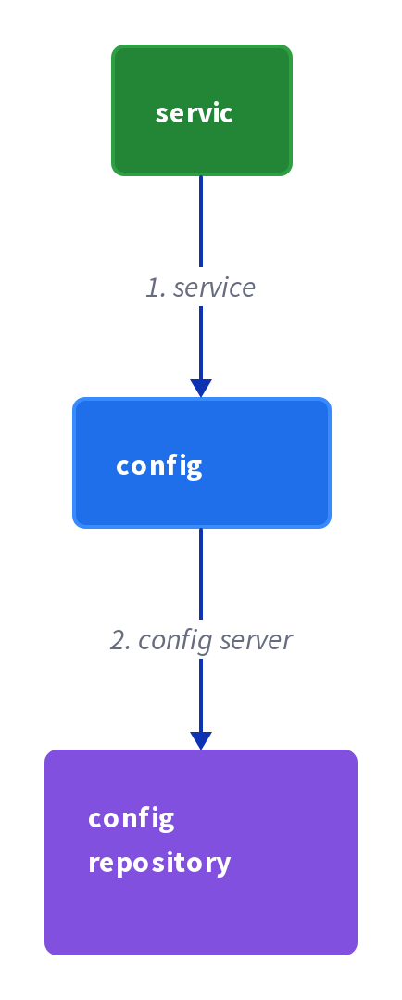

# Chapter 29: Externalized Configuration

> A service reads all of its configuration — database credentials and network locations — from an external source at startup, so the same code runs unchanged in every environment.

_Also known as: Chris Richardson · Microservice Patterns Ch. 29 · microservices.io /patterns/externalized-configuration.html_

## Flow

### Read configuration at startup from the environment

> **Why this matters:** A service needs database credentials and network locations to connect to its dependencies. If those are compiled into the code, a build made for QA cannot talk to the production database; reading them from an external source at startup means the same artifact picks up whatever its environment supplies.

1. **The service starts** — On startup, the service needs configuration telling it how to connect to external and third-party services.

2. **It reads the values externally** — The service reads its configuration from an external source, e.g. OS environment variables, property files, or command-line arguments.

3. **It connects with those values** — The service uses the resolved values, e.g. the database network location and credentials, to open its connections.

```java
// ORDER SERVICE SIDE — on startup, read DB credentials and location from the environment, not the code
// PARTIES: SVC = order service · ENV = deployment environment (OS) · DB = MySQL 8 @ prod-db
// STATE (before):
//    config : {}                          // SVC holds no DB settings yet at launch
//    connection : ""                      // no DB connection established yet
// DEF: startup · CALLED BY: the runtime launching SVC
// -> env : {"DB_URL":"jdbc:mysql://prod-db:3306/orders","DB_PASSWORD":"prod-secret"}
//    step 1 · SVC reads DB_URL from the environment    // config : {} -> {"db_url":"jdbc:mysql://prod-db:3306/orders"}
//    step 2 · SVC reads DB_PASSWORD from the environment    // config : {"db_url":"jdbc:mysql://prod-db:3306/orders"} -> {"db_url":"jdbc:mysql://prod-db:3306/orders","db_password":"prod-secret"}
//    step 3 · SVC opens a connection using those values    // connection : "" -> "open"  BECAUSE the config now holds a URL and a password the DB accepts
// <- config : {"db_url":"jdbc:mysql://prod-db:3306/orders","db_password":"prod-secret"} · connection : "open"
//    alt DB_PASSWORD missing from ENV : connection : "" -> "failed"  BECAUSE the supplied configuration does not match what the service expects
```

### Run unchanged across environments

> **Why this matters:** Dev, test, QA, staging, and production each run different instances of the same dependencies — a QA database versus the production database, a test credit-card account versus the production one. Externalizing configuration lets one build serve all of them without modification or recompilation.

1. **One artifact, many environments** — The same build is deployed to each environment with no modification or recompilation.

2. **Each environment supplies its own values** — Each environment injects its own instances, e.g. a QA database vs a production database.

3. **Each instance connects to its own dependency** — The same code resolves different database locations and credentials per environment.

```java
// DEPLOYMENT SIDE — the SAME build runs in QA and production because each environment supplies its own values
// PARTIES: ENV-QA = QA environment · ENV-PROD = production environment · DB = MySQL 8 @ qa-db and prod-db
// DEF: config — the key/value settings a service reads at startup; here qa_config = {"db_url":"jdbc:mysql://qa-db:3306/orders","db_password":"qa-secret"}
// DEF: connection — the open link to a dependency, established from config; here connection = "qa-db"
// STATE (before):
//    artifact : "orders-service.jar"      // the identical, unmodified build
//    qa_config : {}                        // what the QA deployment resolves at startup
//    prod_config : {}                      // what the production deployment resolves at startup
//    qa_connection : ""                    // DB connection the QA instance opens
//    prod_connection : ""                  // DB connection the production instance opens
// DEF: deploy · CALLED BY: a release pipeline pushing the same artifact to two environments
// -> artifact : "orders-service.jar"      // one build, no recompilation for either environment
//    step 1 · ENV-QA injects its DB values    // qa_config : {} -> {"db_url":"jdbc:mysql://qa-db:3306/orders","db_password":"qa-secret"}
//    step 2 · ENV-PROD injects different DB values    // prod_config : {} -> {"db_url":"jdbc:mysql://prod-db:3306/orders","db_password":"prod-secret"}
//    step 3 · the QA instance connects to its own DB    // qa_connection : "" -> "qa-db"  BECAUSE qa_config points at the QA database
//    step 4 · the production instance connects to its own DB    // prod_connection : "" -> "prod-db"  BECAUSE prod_config points at the production database
// <- connections : qa = "qa-db" · prod = "prod-db" — one artifact "orders-service.jar", two different databases
```

### Resolve logical names via discovery

> **Why this matters:** Configuration can name a dependency logically rather than pinning a network location. A logical name like REGISTRATION-SERVICE stays valid when instances move, because client-side discovery turns it into a real address at call time.

1. **Config names the dependency logically** — The configuration holds a logical name (e.g. USER_REGISTRATION_URL: http://REGISTRATION-SERVICE/user), not a host and port.

2. **Client-side discovery resolves it** — The logical name REGISTRATION-SERVICE is resolved using client-side discovery into a real network location.

3. **The component calls the resolved service** — A component like RegistrationServiceProxy uses the resolved address to invoke the registration service.

```java
// WEB SERVICE SIDE — config names the dependency logically; client-side discovery resolves the real location
// PARTIES: WEB = web service (RegistrationServiceProxy) · REG = registration service · DISC = client-side discovery
// DEF: call — the invocation the proxy makes to the dependency; here call_target = "http://10.0.0.7:8080/user"
// DEF: resolved — turned from a logical name into a real network address; here resolved_url = "http://10.0.0.7:8080/user"
// DEF: target — the specific address the proxy will call; here target = "http://10.0.0.7:8080/user"
// DEF: url — the network location string held in config; here url = "http://REGISTRATION-SERVICE/user" resolving to "http://10.0.0.7:8080/user"
// STATE (before):
//    config : {}                           // WEB holds no registration URL yet
//    resolved_url : ""                     // real network location, not yet found
//    call_target : ""                      // the resolved address the proxy will call
// DEF: startup · CALLED BY: the runtime launching WEB with an injected environment variable
// -> env : {"USER_REGISTRATION_URL":"http://REGISTRATION-SERVICE/user"}
//    step 1 · WEB binds the variable user_registration_url from the environment    // config : {} -> {"user_registration_url":"http://REGISTRATION-SERVICE/user"}
//    step 2 · WEB asks DISC to resolve the logical name REGISTRATION-SERVICE    // resolved_url : "" -> "http://10.0.0.7:8080/user"  BECAUSE REGISTRATION-SERVICE is a logical name, not a network location
//    step 3 · the proxy calls the resolved instance    // call_target : "" -> "http://10.0.0.7:8080/user"
// <- resolved_url : "http://10.0.0.7:8080/user" — RegistrationServiceProxy reaches REG
```


## System Design Interview

> **The question:** Design configuration without redeploys. Premise: a service pulls its configuration from a config server backed by git, so changing a setting never requires rebuilding the service.

**The pipeline:** service → config server → config repository (git/VCS)



### Order Service — the consumer of config

_Role: service_

- pulls config at startup (DB_URL, DB_PASSWORD)
- refreshes when the config changes

### Spring Cloud Config server

_Role: config server_

- serves configuration over HTTP
- versions each property change

### git repository — the config source

_Role: config repository (git/VCS)_

- stores the property files per environment
- is the versioned source of truth

```java
// SYSTEM DESIGN — externalized configuration: service (Order Service) -> config server (Spring Cloud Config) -> config repository (git/VCS)
// PARTIES: SVC = Order Service (config consumer, pulls at startup) · CS = Spring Cloud Config server (config server, serves over HTTP) · GIT = git repository (config repository, VCS source of truth)
// DEF: config — the key/value settings a service reads at startup; here {"db_url":"jdbc:mysql://prod-db:3306/orders","db_password":"prod-secret"}
// DEF: repo — the versioned property file git stores; here the file with keys "db_url" and "db_password"
// DEF: connection — the open link built from the resolved values; here "open"
// STATE (before):
//    config : {}
//    connection : ""
// DEF: pull_and_connect · CALLED BY: the runtime launching SVC
// -> env : {"DB_URL":"jdbc:mysql://prod-db:3306/orders","DB_PASSWORD":"prod-secret"}
//    step 1 · SVC pulls the config from CS at startup    config : {} -> {"db_url":"jdbc:mysql://prod-db:3306/orders","db_password":"prod-secret"}
//    step 2 · CS reads the file from GIT and serves it over HTTP    config : {"db_url":"jdbc:mysql://prod-db:3306/orders"} -> {"db_url":"jdbc:mysql://prod-db:3306/orders","db_password":"prod-secret"}  BECAUSE git stores the versioned property file
//    step 3 · SVC opens a connection with the values    connection : "" -> "open"  BECAUSE the config now holds the URL and password the database accepts
// <- outcome : connection "open" · the same artifact runs unchanged in every environment
```

## Interview Questions

### Q1

Order Service needs a database URL and password to connect on startup. The team compiled those values into a QA build and now that build cannot talk to the production database.

**Interviewer's question:** What does Externalized Configuration solve, and when does the service read its configuration?

**Solution:** It lets one service run in multiple environments without modification: on startup the service reads its configuration — database credentials and network location — from an external source such as OS environment variables.

**System-design components:**
- Order Service
- OS environment
- database server
- DB_URL / DB_PASSWORD

```java
// ORDER SERVICE SIDE — on startup, read DB credentials and location from the environment, not the code
// PARTIES: SVC = order service · ENV = deployment environment (OS) · DB = MySQL 8 @ prod-db
// STATE (before):
//    config : {}                               // SVC holds no DB settings yet at launch
//    connection : ""                           // no DB connection established yet
// DEF: startup · CALLED BY: the runtime launching SVC
// -> env : {"DB_URL":"jdbc:mysql://prod-db:3306/orders","DB_PASSWORD":"prod-secret"}
//    step 1 · SVC reads DB_URL from the environment    config : {} -> {"db_url":"jdbc:mysql://prod-db:3306/orders"}
//    step 2 · SVC reads DB_PASSWORD from the environment    config : {"db_url":"jdbc:mysql://prod-db:3306/orders"} -> {"db_url":"jdbc:mysql://prod-db:3306/orders","db_password":"prod-secret"}
//    step 3 · SVC opens a connection using those values    connection : "" -> "open"  BECAUSE the config now holds a URL and a password the DB accepts
// <- config : {"db_url":"jdbc:mysql://prod-db:3306/orders","db_password":"prod-secret"} · connection : "open"
//    alt DB_PASSWORD missing from ENV : connection : "" -> "failed"  BECAUSE the supplied configuration does not match what the service expects
```

_This is the chapter's startup read: configuration comes from the environment, not the code._

_Covers:_ Read configuration at startup from the environment

_From the 28 problems:_ 01-scale-from-zero-to-millions

### Q2

The release pipeline pushes one orders-service.jar to QA and production. QA must talk to a QA database; production must talk to the production database — without rebuilding anything.

**Interviewer's question:** How does one build serve two environments without modification or recompilation?

**Solution:** Each environment injects its own values at startup, so the same artifact resolves different database locations and credentials — the QA instance connects to the QA database, production to the production database.

**System-design components:**
- orders-service.jar (one artifact)
- QA environment
- production environment
- per-environment DB values

```java
// DEPLOYMENT SIDE — the SAME build runs in QA and production because each environment supplies its own values
// PARTIES: ENVQA = QA environment · ENVPROD = production environment · DB = MySQL 8 @ qa-db and prod-db
// DEF: connection — the open link to a dependency, established from config; here "qa-db" or "prod-db"
// STATE (before):
//    artifact : "orders-service.jar"        // the identical, unmodified build
//    qa_config : {}                         // what the QA deployment resolves at startup
//    prod_config : {}                       // what the production deployment resolves at startup
//    qa_connection : ""                     // DB connection the QA instance opens
//    prod_connection : ""                   // DB connection the production instance opens
// DEF: deploy · CALLED BY: a release pipeline pushing the same artifact to two environments
// -> artifact : "orders-service.jar"        // one build, no recompilation for either environment
//    step 1 · ENVQA injects its DB values    qa_config : {} -> {"db_url":"jdbc:mysql://qa-db:3306/orders","db_password":"qa-secret"}
//    step 2 · ENVPROD injects different DB values    prod_config : {} -> {"db_url":"jdbc:mysql://prod-db:3306/orders","db_password":"prod-secret"}
//    step 3 · the QA instance connects to its own DB    qa_connection : "" -> "qa-db"  BECAUSE qa_config points at the QA database
//    step 4 · the production instance connects to its own DB    prod_connection : "" -> "prod-db"  BECAUSE prod_config points at the production database
// <- connections : qa = "qa-db" · prod = "prod-db" — one artifact "orders-service.jar", two different databases
```

_This is the chapter's run-unchanged-across-environments step: the differences live in the environment, not the build._

_Covers:_ Run unchanged across environments

_From the 28 problems:_ 01-scale-from-zero-to-millions

### Q3

The web service's RegistrationServiceProxy is configured with a logical name REGISTRATION-SERVICE instead of a host and port. Instances move, but the name must stay valid.

**Interviewer's question:** In the RegistrationServiceProxy example, what is REGISTRATION-SERVICE, and how does it become a real address?

**Solution:** REGISTRATION-SERVICE is the logical name of the service; client-side discovery resolves it into a real network location that the proxy then calls.

**System-design components:**
- Web service (RegistrationServiceProxy)
- registration service
- client-side discovery
- USER_REGISTRATION_URL

```java
// WEB SERVICE SIDE — config names the dependency logically; client-side discovery resolves the real location
// PARTIES: WEB = web service (RegistrationServiceProxy) · REG = registration service · DISC = client-side discovery
// DEF: url — the network location string held in config; here "http://REGISTRATION-SERVICE/user" resolving to "http://10.0.0.7:8080/user"
// STATE (before):
//    config : {}                              // WEB holds no registration URL yet
//    resolved_url : ""                        // real network location, not yet found
//    call_target : ""                         // the resolved address the proxy will call
// DEF: startup · CALLED BY: the runtime launching WEB with an injected environment variable
// -> env : {"USER_REGISTRATION_URL":"http://REGISTRATION-SERVICE/user"}
//    step 1 · WEB binds the variable user_registration_url from the environment    config : {} -> {"user_registration_url":"http://REGISTRATION-SERVICE/user"}
//    step 2 · WEB asks DISC to resolve the logical name REGISTRATION-SERVICE    resolved_url : "" -> "http://10.0.0.7:8080/user"  BECAUSE REGISTRATION-SERVICE is a logical name, not a network location
//    step 3 · the proxy calls the resolved instance    call_target : "" -> "http://10.0.0.7:8080/user"
// <- resolved_url : "http://10.0.0.7:8080/user" — RegistrationServiceProxy reaches REG
```

_This is the chapter's logical-name resolution: externalized config defers the location problem to client-side discovery._

_Covers:_ Resolve logical names via discovery

_From the 28 problems:_ 01-scale-from-zero-to-millions

### Q4

A deployment ships with a missing DB_PASSWORD, or a wrong database URL. The code is unchanged and correct, but the environment supplied bad values.

**Interviewer's question:** What new failure mode does externalizing configuration open up, and what issue does the pattern leave unresolved?

**Solution:** Once configuration lives outside the code, a deployment can be given the wrong values; the open issue is how to ensure the supplied configuration matches what the service expects.

**System-design components:**
- Service
- deployment environment
- supplied config
- startup validation

```java
// SERVICE SIDE — the environment supplied the wrong values, so the unchanged code fails to connect
// PARTIES: SVC = order service · ENV = deployment environment · DB = MySQL 8 @ prod-db
// DEF: supplied — the configuration the environment injects at startup; here missing the DB_PASSWORD key
// STATE (before):
//    config : {}                              // what SVC resolves at startup
//    connection : ""                          // the DB connection SVC opens
//    expected_keys : ["db_url","db_password"]  // the keys the service needs
// DEF: startup · CALLED BY: the runtime launching SVC with an incomplete environment
// -> env : {"DB_URL":"jdbc:mysql://prod-db:3306/orders"}     // DB_PASSWORD is missing
//    step 1 · SVC reads only what the environment supplied    config : {} -> {"db_url":"jdbc:mysql://prod-db:3306/orders"}
//    step 2 · SVC finds a missing key    expected_keys : ["db_url","db_password"] -> ["db_url","db_password"]  BECAUSE db_password is absent from config
//    step 3 · the connection fails    connection : "" -> "failed"  BECAUSE the supplied configuration does not match what the service expects
// <- connection : "failed" · the open issue : how to ensure the supplied configuration matches what is expected at deploy time
//    alt validation in place : the pipeline checks expected_keys against the supplied config -> the deploy is refused before SVC ever starts
```

_This is the chapter's resulting-context issue: portability is bought with a new verification duty at deploy time._

_Covers:_ Read configuration at startup from the environment · Resolve logical names via discovery

_From the 28 problems:_ 01-scale-from-zero-to-millions

## Key Concepts

### The Problem

**Running in many environments without modification.** The service must run in dev, test, QA, staging, and production without modification or recompilation, even though each environment has different service instances.


### The Solution

Externalize all configuration, including database credentials and network location; on startup the service reads it from an external source such as OS environment variables.

```java
// ORDER SERVICE SIDE — on startup, read DB credentials and location from the environment, not the code
// PARTIES: SVC = order service · ENV = deployment environment (OS) · DB = MySQL 8 @ prod-db
// STATE (before):
//    config : {}                               // SVC holds no DB settings yet at launch
//    connection : ""                           // no DB connection established yet
// DEF: startup · CALLED BY: the runtime launching SVC
// -> env : {"DB_URL":"jdbc:mysql://prod-db:3306/orders","DB_PASSWORD":"prod-secret"}
//    step 1 · SVC reads DB_URL from the environment    config : {} -> {"db_url":"jdbc:mysql://prod-db:3306/orders"}
//    step 2 · SVC reads DB_PASSWORD from the environment    config : {"db_url":"jdbc:mysql://prod-db:3306/orders"} -> {"db_url":"jdbc:mysql://prod-db:3306/orders","db_password":"prod-secret"}
//    step 3 · SVC opens a connection using those values    connection : "" -> "open"  BECAUSE the config now holds a URL and a password the DB accepts
// <- config : {"db_url":"jdbc:mysql://prod-db:3306/orders","db_password":"prod-secret"} · connection : "open"
//    alt DB_PASSWORD missing from ENV : connection : "" -> "failed"  BECAUSE the supplied configuration does not match what the service expects
```


### Key Facts

| Fact | Detail | In the wild |
|---|---|---|
| Externalize all application configuration | Externalize all configuration, including database credentials and network location; on startup the service reads it from an external source such as OS environment variables. | Spring Boot externalized configuration reads values from OS environment variables, property files, and command-line arguments. |
| Logical names still need resolving | The logical name is resolved using client-side discovery, which supplies the real network location. | The tradeoff is that externalized config defers the location problem to the service discovery patterns, which solve it separately. |
| Supplied config may not match expectations | The open issue is how to ensure that, when an application is deployed, the supplied configuration matches what is expected. | The tradeoff is that portability is bought with a new verification duty at deploy time. |


### Tradeoffs & When

- The logical name is resolved using client-side discovery, which supplies the real network location.
- The open issue is how to ensure that, when an application is deployed, the supplied configuration matches what is expected.


<details><summary>All concepts (index)</summary>

### Problem: Running in many environments without modification

**Why.** A service must be told how to connect to its external and third-party services — the database network location and credentials, for example.

**Claim.** The service must run in dev, test, QA, staging, and production without modification or recompilation, even though each environment has different service instances.

**Grounding.** These are the reference forces, nearly verbatim: a QA database vs the production database, a test credit-card account vs the production one.

**In the wild.** Any value baked into the code forces a separate build per environment.
### Solution: Externalize all application configuration

**Why.** The only way one build serves many environments is to move the differences out of the build.

**Claim.** Externalize all configuration, including database credentials and network location; on startup the service reads it from an external source such as OS environment variables.

**Grounding.** This is the reference solution.

**In the wild.** Spring Boot externalized configuration reads values from OS environment variables, property files, and command-line arguments.
### Tradeoff: Logical names still need resolving

**Why.** Config can hold a logical name like REGISTRATION-SERVICE, but code cannot connect to a name.

**Claim.** The logical name is resolved using client-side discovery, which supplies the real network location.

**Grounding.** The RegistrationServiceProxy example configures user_registration_url and resolves REGISTRATION-SERVICE via client-side discovery.

**In the wild.** The tradeoff is that externalized config defers the location problem to the service discovery patterns, which solve it separately.
### Tradeoff: Supplied config may not match expectations

**Why.** Once configuration lives outside the code, a deployment can be given the wrong values.

**Claim.** The open issue is how to ensure that, when an application is deployed, the supplied configuration matches what is expected.

**Grounding.** This is the issue listed in the resulting context.

**In the wild.** The tradeoff is that portability is bought with a new verification duty at deploy time.

</details>


## Quiz

1. What problem does Externalized Configuration solve?

   - A. How to authenticate a requestor
   - B. How to enable a service to run in multiple environments without modification
   - C. How to pass identity between services
   - D. How to aggregate data across services

<details><summary>Reveal answer</summary>

**B.** The reference problem is exactly: how to enable a service to run in multiple environments without modification. A and C belong to the Access Token pattern, and D is API composition.

</details>

2. What must be externalized, according to the solution?

   - A. Only the application's business logic
   - B. All application configuration, including database credentials and network location
   - C. Only the log output format
   - D. Only the service's public API

<details><summary>Reveal answer</summary>

**B.** The solution says externalize all application configuration including the database credentials and network location. The other options narrow the scope to things the pattern does not target.

</details>

3. When does the service read its externalized configuration?

   - A. On startup, from an external source such as OS environment variables
   - B. At compile time
   - C. Only when a request arrives
   - D. Never — it is generated at runtime

<details><summary>Reveal answer</summary>

**A.** The reference solution states that on startup a service reads the configuration from an external source, e.g. OS environment variables. Reading at compile time (B) would defeat externalization; C and D contradict the startup read.

</details>

4. In the RegistrationServiceProxy example, what is REGISTRATION-SERVICE?

   - A. A hardcoded IP address
   - B. The logical name of the service, resolved using client-side discovery
   - C. A database table name
   - D. The name of a Docker image

<details><summary>Reveal answer</summary>

**B.** The reference says REGISTRATION-SERVICE is the logical name of the service, resolved using client-side discovery. It is not an IP (A), a table (C), or an image (D).

</details>

