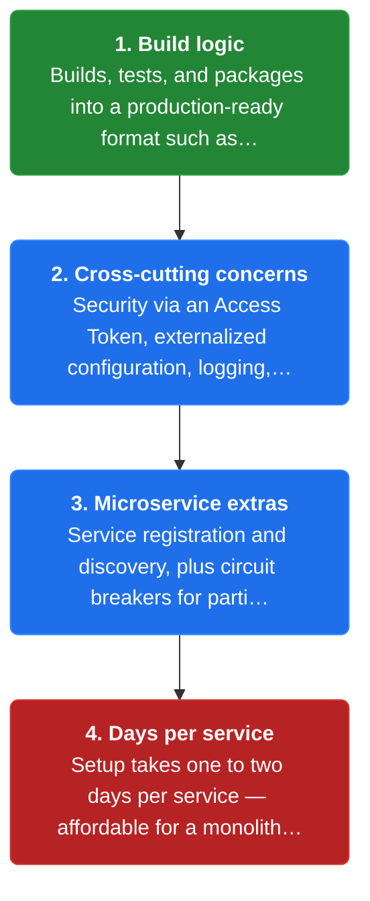
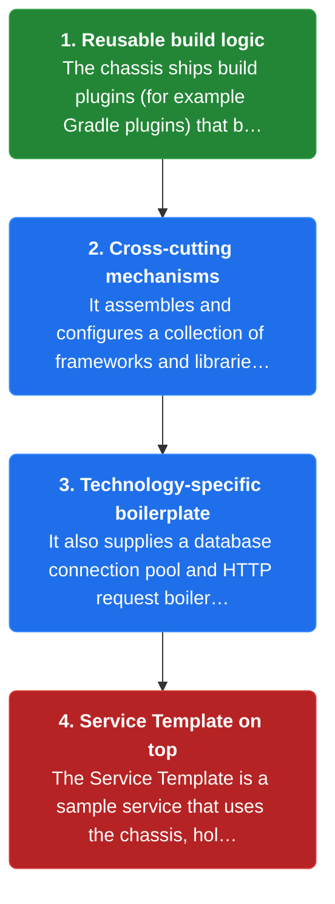
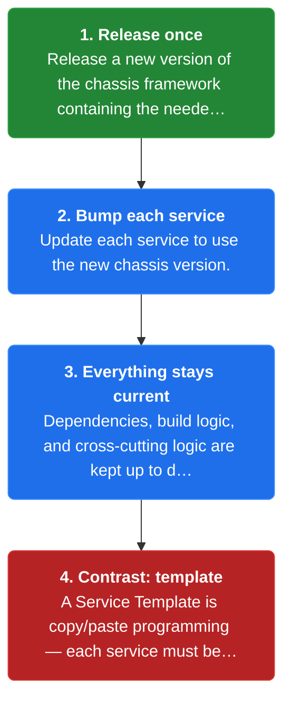
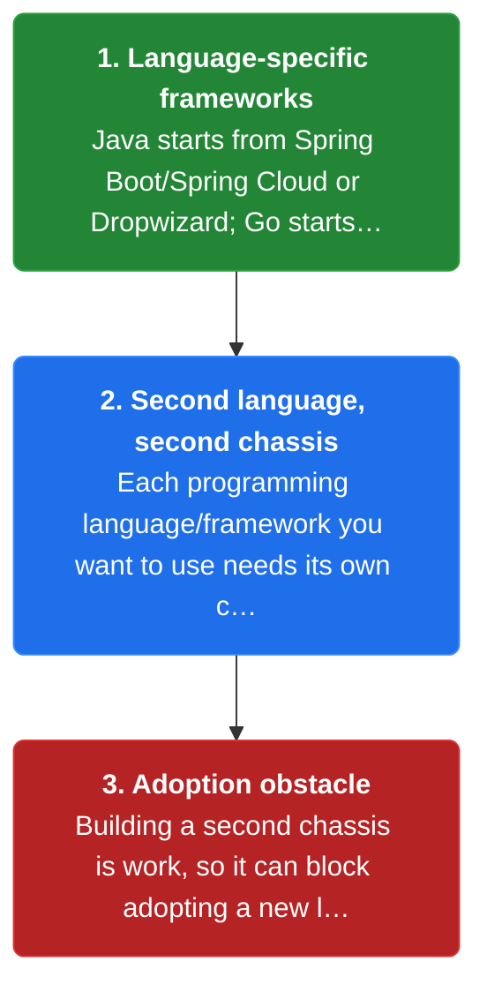

# Chapter 30: Microservice Chassis

> A shared framework that packages reusable build logic and cross-cutting-concern mechanisms so every new service starts production-ready instead of re-wiring setup.

_Also known as: Chris Richardson · Microservice Patterns Ch. 30 (p.379) · microservices.io /patterns/microservice-chassis.html_

## Flow

### The setup tax

> **Why this matters:** Every service must be built, tested, packaged, and given cross-cutting concerns before its business logic can start. That one-to-two-day cost is trivial for one monolith but unaffordable across tens or hundreds of services.



1. **Build logic** — Builds, tests, and packages into a production-ready format such as a Docker image — in Java, Gradle or Maven plus CI config (CircleCI, GitHub Actions).

2. **Cross-cutting concerns** — Security via an Access Token, externalized configuration, logging, a health-check URL, metrics, and distributed tracing.

3. **Microservice extras** — Service registration and discovery, plus circuit breakers for partial failure, add to the per-service burden.

4. **Days per service** — Setup takes one to two days per service — affordable for a monolith, not for tens of services.

```java
// TEAM SIDE — wiring six cross-cutting concerns once per service versus once in a chassis
// PARTIES: SVC1 = Order Service · SVC2 = Customer Service · SVC3 = Kitchen Service
// DEF: chassis — the shared framework that wires the 6 cross-cutting concerns once, not per service; here chassis_wiring = { chassis: 0 }
// DEF: manual — wired by hand, one service at a time; here manual_wiring = { SVC1: 0, SVC2: 0, SVC3: 0 } = 18 wirings total
// DEF: wiring — the act of connecting a cross-cutting concern to a service; here 3 services x 6 concerns = 18 wirings
// STATE (before):
//    manual_wiring : { SVC1: 0, SVC2: 0, SVC3: 0 }       // concerns wired by hand, per service
//    chassis_wiring : { chassis: 0 }                     // concerns wired once, inside the chassis
// DEF: setup · CALLED BY: a team standing up 3 new services
// -> concern_count : 6   // = security + config + logging + health + metrics + tracing
// -> service_count : 3
//    step 1 · wire SVC1 by hand    manual_wiring.SVC1 : 0 -> 6   BECAUSE each service re-implements the 6 concerns
//    step 2 · wire SVC2 by hand    manual_wiring.SVC2 : 0 -> 6
//    step 3 · wire SVC3 by hand    manual_wiring.SVC3 : 0 -> 6
//    step 4 · total by hand = 3 services x 6 concerns = 18 wirings
// <- outcome : manual_wiring : { SVC1: 6, SVC2: 6, SVC3: 6 } = 18 wirings total
//    alt chassis : wire once -> chassis_wiring.chassis : 0 -> 6, then SVC1/SVC2/SVC3 inherit = 6 wirings, not 18
```

### What the chassis implements

> **Why this matters:** The chassis is the foundation: reusable build logic and mechanisms for cross-cutting concerns, assembled once and inherited by each service. Adopting it wires a new service in minutes instead of days.



1. **Reusable build logic** — The chassis ships build plugins (for example Gradle plugins) that build, test, and package a service.

2. **Cross-cutting mechanisms** — It assembles and configures a collection of frameworks and libraries for security, logging, health checks, metrics, and tracing.

3. **Technology-specific boilerplate** — It also supplies a database connection pool and HTTP request boilerplate.

4. **Service Template on top** — The Service Template is a sample service that uses the chassis, holding the code and configuration that does not belong in it.

```java
// ORDER SERVICE SIDE — a new service adopts the chassis and inherits the cross-cutting wiring
// PARTIES: SVC = Order Service · CHS = chassis framework 2.4.0 · REG = service registry
// STATE (before):
//    svc : { build: "none", security: "none", metrics: "none", tracing: "none", registered: false }
// DEF: adopt_chassis · CALLED BY: a developer scaffolding SVC
// -> chassis_version : "2.4.0"
//    step 1 · add the chassis Gradle plugin          svc.build : "none" -> "gradle-plugin:2.4.0"
//    step 2 · chassis wires access-token security    svc.security : "none" -> "access-token-check"
//    step 3 · chassis wires metrics                  svc.metrics : "none" -> "counter:orders_created"
//    step 4 · chassis wires tracing                  svc.tracing : "none" -> "trace-id-filter"
//    step 5 · chassis self-registers SVC with REG    svc.registered : false -> true
// <- outcome : svc : { build:"gradle-plugin:2.4.0", security:"access-token-check", metrics:"counter:orders_created", tracing:"trace-id-filter", registered:true }
```

### Updating via version bumps

> **Why this matters:** Build logic and cross-cutting concerns change over time. With a chassis, a fix is made once and reaches every service through a version bump; with a Service Template it is copy/pasted into each codebase.



1. **Release once** — Release a new version of the chassis framework containing the needed change.

2. **Bump each service** — Update each service to use the new chassis version.

3. **Everything stays current** — Dependencies, build logic, and cross-cutting logic are kept up to date together.

4. **Contrast: template** — A Service Template is copy/paste programming — each service must be edited individually when logic changes.

```java
// TEAM SIDE — a chassis upgrade delivers one fix to every service via a version bump
// PARTIES: SVC1 = Order Service · SVC2 = Customer Service · SVC3 = Kitchen Service
// STATE (before):
//    deps : { SVC1: "chassis:2.3.0", SVC2: "chassis:2.3.0", SVC3: "chassis:2.3.0" }
// DEF: upgrade · CALLED BY: the team releasing chassis 2.4.0 (a logging fix)
// -> new_version : "2.4.0"
//    step 1 · release the chassis once at "2.4.0"
//    step 2 · SVC1 bumps its dependency     deps.SVC1 : "chassis:2.3.0" -> "chassis:2.4.0"
//    step 3 · SVC2 bumps its dependency     deps.SVC2 : "chassis:2.3.0" -> "chassis:2.4.0"
//    step 4 · SVC3 bumps its dependency     deps.SVC3 : "chassis:2.3.0" -> "chassis:2.4.0"
// <- outcome : deps : { SVC1: "chassis:2.4.0", SVC2: "chassis:2.4.0", SVC3: "chassis:2.4.0" } · the fix reaches all 3 services
//    alt service template : the fix is copied-and-pasted into 3 separate codebases, one edit per service
```

### One chassis per language

> **Why this matters:** A chassis is tied to a programming language and framework, so a second language forces a second chassis. That is the pattern's main issue: it can be an obstacle to adopting a new language or framework.



1. **Language-specific frameworks** — Java starts from Spring Boot/Spring Cloud or Dropwizard; Go starts from Gizmo, Micro, or Go kit.

2. **Second language, second chassis** — Each programming language/framework you want to use needs its own chassis.

3. **Adoption obstacle** — Building a second chassis is work, so it can block adopting a new language or framework.

```java
// TEAM SIDE — a second language forces a second chassis, so upkeep doubles
// PARTIES: JVM = Java services · GO = Go services
// STATE (before):
//    chassis : { JVM: "chassis-java:2.4.0", GO: "none" }
//    chassis_count : 1
//    concerns_in_go : 0
// DEF: adopt_go · CALLED BY: the team adding its first Go service
// -> new_language : "Go"
//    step 1 · the JVM chassis cannot run Go -> build a second one   chassis_count : 1 -> 2
//    step 2 · build chassis-go on a Go framework base               chassis.GO : "none" -> "chassis-go:1.0.0"   BECAUSE Gizmo/Micro/Go kit serve Go, not Java
//    step 3 · re-implement the same concerns in Go                  concerns_in_go : 0 -> 6   BECAUSE security+config+logging+health+metrics+tracing all repeat
// <- outcome : chassis : { JVM: "chassis-java:2.4.0", GO: "chassis-go:1.0.0" } · concerns_in_go : 6 · 2 chassis to keep current
//    alt single-language : only 1 chassis to maintain, but Go adoption stays blocked
```


## Key Concepts

### The Problem

**The per-service setup tax.** One or two days of setup per service is fine for a monolith, but unaffordable across tens or hundreds of microservices.


### The Solution

A microservice chassis provides reusable build logic and mechanisms for cross-cutting concerns as one framework; the Service Template is a sample service built on it.


### Key Facts

| Fact | Detail | In the wild |
|---|---|---|
| A shared chassis framework | A microservice chassis provides reusable build logic and mechanisms for cross-cutting concerns as one framework; the Service Template is a sample service built on it. | Services depend on the chassis and inherit the wiring instead of re-implementing it. |
| Version bumps vs copy/paste | The chassis lets a team release one new version and bump each service, while a Service Template forces per-service edits — copy/paste programming. | The Service Template survives as a sample that holds code and configuration that does not belong in the chassis. |
| One chassis per language | Adopting a new language or framework requires building a second chassis, which is an obstacle to adoption. | A Java chassis does not run Go services, so a Go team rebuilds the same wiring. |


### Tradeoffs & When

- The chassis lets a team release one new version and bump each service, while a Service Template forces per-service edits — copy/paste programming.
- Adopting a new language or framework requires building a second chassis, which is an obstacle to adoption.


<details><summary>All concepts (index)</summary>

### Problem: The per-service setup tax

**Why.** Every new service needs build logic and cross-cutting concerns before any business logic can start.

**Claim.** One or two days of setup per service is fine for a monolith, but unaffordable across tens or hundreds of microservices.

**Grounding.** The reference lists build logic (Gradle/Maven, Docker packaging, CI config) plus six cross-cutting concerns — security, externalized configuration, logging, health check, metrics, distributed tracing — and microservice extras like registration/discovery and circuit breakers.

**In the wild.** Teams re-created this wiring by hand for every service until the chassis centralised it.
### Solution: A shared chassis framework

**Why.** Every service needs the same build logic and cross-cutting mechanisms.

**Claim.** A microservice chassis provides reusable build logic and mechanisms for cross-cutting concerns as one framework; the Service Template is a sample service built on it.

**Grounding.** The chassis ships build plugins (Gradle plugins) and assembles frameworks for security, logging, health checks, metrics, and tracing; Java starts from Spring Boot/Spring Cloud or Dropwizard, Go from Gizmo, Micro, or Go kit.

**In the wild.** Services depend on the chassis and inherit the wiring instead of re-implementing it.
### Tradeoff: Version bumps vs copy/paste

**Why.** Build logic and cross-cutting concerns change over time.

**Claim.** The chassis lets a team release one new version and bump each service, while a Service Template forces per-service edits — copy/paste programming.

**Grounding.** The reference benefit: it is faster and easier to keep dependencies, build logic, and cross-cutting logic up to date by releasing a new chassis version.

**In the wild.** The Service Template survives as a sample that holds code and configuration that does not belong in the chassis.
### Tradeoff: One chassis per language

**Why.** A chassis is tied to a programming language and framework.

**Claim.** Adopting a new language or framework requires building a second chassis, which is an obstacle to adoption.

**Grounding.** The reference issue: you need a microservice chassis for each programming language/framework you want to use.

**In the wild.** A Java chassis does not run Go services, so a Go team rebuilds the same wiring.

</details>


## Quiz

1. What is the main drawback of the Service Template approach?

   - A. It requires a separate template per programming language.
   - B. It is copy/paste programming — when build logic or cross-cutting concerns change, each service must be updated individually.
   - C. It cannot package services into Docker images.
   - D. It cannot include build logic.

<details><summary>Reveal answer</summary>

**B.** A Service Template is a source code template you copy, so a change must be repeated in every service — the copy/paste drawback the chassis avoids. Option A describes the chassis's own per-language issue, and C and D are false: templates do package services and include build logic.

</details>

2. Which of these is a cross-cutting concern the reference lists?

   - A. Service registration and discovery.
   - B. Business rules for order validation.
   - C. Database schema design.
   - D. Feature flags for a UI.

<details><summary>Reveal answer</summary>

**A.** Service registration and discovery is one of the additional microservice cross-cutting concerns, alongside circuit breakers. Options B, C, and D are business or domain concerns, not cross-cutting concerns.

</details>

3. How do services receive updates to build logic and cross-cutting concerns under the chassis pattern?

   - A. Each service re-implements them by hand.
   - B. You release a new chassis version and update each service to use it.
   - C. A shared runtime patches services automatically.
   - D. Changes are never needed.

<details><summary>Reveal answer</summary>

**B.** The benefit is releasing a new chassis version and bumping each service. Option A is the naive per-service approach, and C and D are not in the reference — updates are explicit version bumps, and changes do occur.

</details>

4. What is one issue of the Microservice Chassis pattern?

   - A. It only works for Java.
   - B. It needs a chassis per programming language/framework, an obstacle to adopting a new language.
   - C. It prevents the use of Gradle or Maven.
   - D. It forces a monolith.

<details><summary>Reveal answer</summary>

**B.** The reference states you need a chassis for each language/framework you want to use, which can block adopting a new one. Option A is false (Go has Gizmo/Micro/Go kit), and C and D contradict the reference (Gradle/Maven are supported and the pattern is for microservices).

</details>

