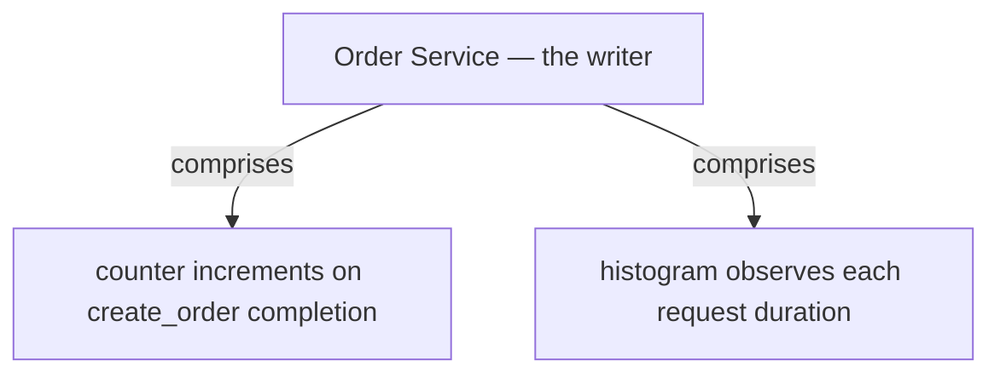
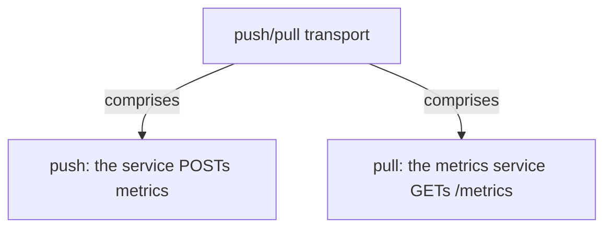
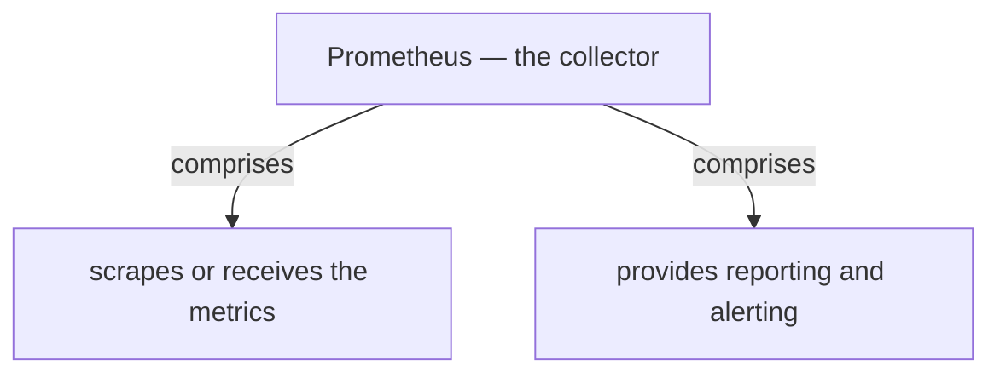
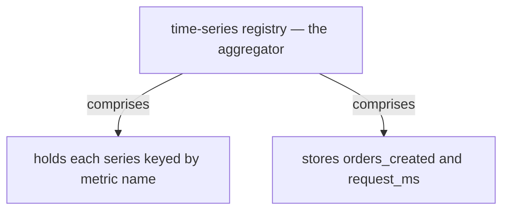
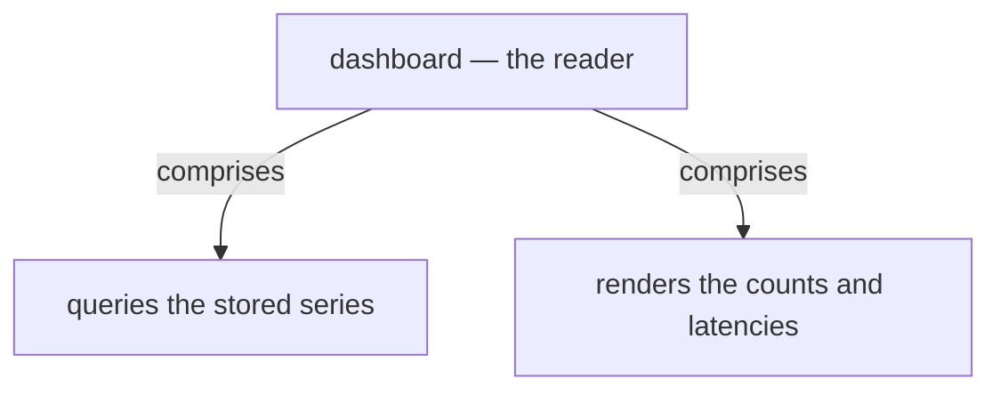

# Chapter 31: Application Metrics

> Instrument a service to gather statistics about its operations and aggregate them in a centralized metrics service for reporting and alerting.

_Also known as: Chris Richardson · Microservice Patterns Ch. 31 (p.373) · microservices.io /patterns/observability/application-metrics.html_

## Flow

### Instrumenting an operation

> **Why this matters:** The pattern's answer to "how do we understand application behavior and troubleshoot problems?" is to instrument a service to gather statistics about individual operations. A counter increments on each completed operation with minimal runtime overhead.

1. **Gather statistics** — Instrument the service to collect statistics about individual operations.

2. **Count completions** — A counter increments each time an operation such as create_order completes.

3. **Minimal overhead** — The force is that any solution must have minimal runtime overhead — an in-memory counter add is cheap.

```java
// ORDER SERVICE SIDE — a counter gathers statistics about one operation, with minimal overhead
// PARTIES: SVC = Order Service · MS = metrics service (Prometheus)
// STATE (before):
//    counters : { orders_created: 0 }
// DEF: create_order · CALLED BY: client requests arriving at SVC
// -> request1 : "PO-2001"
//    step 1 · handle request1, increment the counter    counters.orders_created : 0 -> 1   BECAUSE one create_order completed
// -> request2 : "PO-2002"
//    step 2 · handle request2, increment                counters.orders_created : 1 -> 2
// -> request3 : "PO-2003"
//    step 3 · handle request3, increment                counters.orders_created : 2 -> 3
// <- outcome : counters : { orders_created: 3 } · the increment is one in-memory add per call, not a per-request network hop
```

### Aggregating: push and pull

> **Why this matters:** Individual counters are useful only when aggregated in a centralized metrics service that provides reporting and alerting. The reference describes two aggregation models: push and pull.

1. **Central metrics service** — Aggregate metrics in a centralized metrics service that provides reporting and alerting.

2. **Push model** — The service pushes metrics to the metrics service.

3. **Pull model** — The metrics service pulls (scrapes) metrics from the service.

4. **Aggregation services** — Prometheus and AWS CloudWatch are the listed metrics aggregation services.

```java
// AGGREGATION SIDE — the central metrics service receives two values via push or via pull
// PARTIES: SVC = Order Service · MS = metrics service
// STATE (before):
//    MS.view : { orders_created: 0, request_ms_sum: 0 }
// DEF: aggregate · CALLED BY: MS reporting and alerting on the values
// -> counter : 3 · -> sum : 123                // = 3 create_order calls, 3 x 41 ms = 123 ms
//    step 1 (push) · SVC POSTs {"orders_created":3} to MS      MS.view.orders_created : 0 -> 3
//    step 2 (push) · SVC POSTs {"request_ms_sum":123} to MS    MS.view.request_ms_sum : 0 -> 123
//    step 3 (push) · MS now has both values to report and alert on
// <- outcome : MS.view : { orders_created: 3, request_ms_sum: 123 } · push = the service pushes metrics to the metrics service
//    alt pull : MS GETs /metrics -> body "orders_created 3 request_ms_sum 123" -> MS.view : {0,0} -> {3,123}   BECAUSE the metrics service pulls the metric from the service
```

### What it costs

> **Why this matters:** Metrics give deep insight, but they are not free: the metric code is intertwined with business logic, making it more complicated, and aggregating metrics can require significant infrastructure.

1. **Deep insight** — The benefit is deep insight into application behavior.

2. **Intertwined code** — The drawback is that metrics code is intertwined with business logic, making it more complicated.

3. **A histogram inline** — A histogram observes each request duration from inside the business method.

4. **Infrastructure** — Aggregating metrics can require significant infrastructure.

```java
// ORDER SERVICE SIDE — the histogram increment sits inline in business logic, tangling the code
// PARTIES: SVC = Order Service
// STATE (before):
//    hist : { request_ms: [] }
// DEF: create_order · CALLED BY: three client requests
// -> request1 : "PO-2004" · started_at : 100 · ended_at : 141
//    step 1 · save order, then observe : hist.request_ms : [] -> [41]          BECAUSE 141 - 100 = 41 ms
// -> request2 : "PO-2005" · started_at : 200 · ended_at : 237
//    step 2 · save order, then observe : hist.request_ms : [41] -> [41,37]     BECAUSE 237 - 200 = 37 ms
// -> request3 : "PO-2006" · started_at : 300 · ended_at : 348
//    step 3 · save order, then observe : hist.request_ms : [41,37] -> [41,37,48]   BECAUSE 348 - 300 = 48 ms
// <- outcome : hist : { request_ms: [41,37,48] } · three observe() calls are woven between the save() calls
```


## System Design Interview

> **The question:** Design a metrics pipeline for services. Premise: an instrumented Order Service pushes or pulls metrics, Prometheus collects them, and a dashboard reads them, so operators watch each service's behavior live.

**The pipeline:** writer (instrumented service) → transport (push/pull) → collector (metrics service) → aggregator (store/registry) → reader (dashboard)

### Order Service — the writer

_Role: writer (instrumented service)_



### push/pull transport

_Role: transport (push/pull)_



### Prometheus — the collector

_Role: collector (metrics service)_



### time-series registry — the aggregator

_Role: aggregator/store (registry)_



### dashboard — the reader

_Role: reader (dashboard)_



```java
// SYSTEM DESIGN — application metrics pipeline: writer (Order Service, instrumented) -> transport (push/pull) -> collector (Prometheus metrics service) -> aggregator (time-series registry) -> reader (dashboard)
// PARTIES: SVC = Order Service (writer, instrumented) · MS = Prometheus (collector, metrics service) · STO = time-series registry (aggregator, holds each series) · DSH = dashboard (reader)
// DEF: metric — a measured quantity per operation; here counter orders_created = 3 and request_ms_sum = 123
// DEF: series — one stored time series keyed by metric name; here {"orders_created":3,"request_ms":[41,37,48]}
// DEF: transport — how metrics travel; here push (SVC POSTs) or pull (MS GETs /metrics every 15 s)
// STATE (before):
//    series : {}
//    counter : { orders_created: 0 }
// DEF: instrument_and_aggregate · CALLED BY: SVC counting completions, MS scraping on an interval
// -> request1 : "PO-2001"
//    step 1 · SVC increments the counter across 3 completions    counter.orders_created : 0 -> 3
//    step 2 · SVC pushes {"orders_created":3} to MS    series : {} -> {"orders_created":3,"request_ms":[41,37,48]}
//    step 3 · MS stores each metric as a series    series : {"orders_created":3} -> {"orders_created":3,"request_ms":[41,37,48]}  BECAUSE orders_created and request_ms each become a stored series
//    step 4 · DSH queries the series and renders the chart    series : {"orders_created":3,"request_ms":[41,37,48]} -> {"orders_created":3,"request_ms":[41,37,48]}  BECAUSE the dashboard reads the counts and latencies back
// <- outcome : DSH renders orders_created 3 · request_ms [41,37,48]  BECAUSE the writer shipped the values over the transport, the collector stored them, and the reader pulled them back
```

## Interview Questions

### Q1

The team cannot tell how many orders are being created, because the service is a black box beyond its request totals. They instrument create_order with a counter.

**Interviewer's question:** What is the Application Metrics solution, and why must the instrumentation have minimal runtime overhead?

**Solution:** Instrument the service to gather statistics about individual operations — a counter increments on each completed operation — and the increment must be cheap because the force is minimal runtime overhead.

**System-design components:**
- Order Service
- counter (orders_created)
- metrics service
- create_order operation

```java
// ORDER SERVICE SIDE — a counter gathers statistics about one operation, with minimal overhead
// PARTIES: SVC = Order Service · MS = metrics service (Prometheus)
// STATE (before):
//    counters : { orders_created: 0 }
// DEF: create_order · CALLED BY: client requests arriving at SVC
// -> request1 : "PO-2001"
//    step 1 · handle request1, increment the counter    counters.orders_created : 0 -> 1   BECAUSE one create_order completed
// -> request2 : "PO-2002"
//    step 2 · handle request2, increment                counters.orders_created : 1 -> 2
// -> request3 : "PO-2003"
//    step 3 · handle request3, increment                counters.orders_created : 2 -> 3
// <- outcome : counters : { orders_created: 3 } · the increment is one in-memory add per call, not a per-request network hop
```

_This is the chapter's instrument-an-operation step: a counter gathers per-operation statistics at minimal overhead._

_Covers:_ Instrumenting an operation

_From the 28 problems:_ 20-metrics-monitoring

### Q2

The counters on each service are only useful once collected somewhere central. The team is choosing between having the service push or the metrics service pull.

**Interviewer's question:** Which two aggregation models does the pattern describe, and what lands in the central service?

**Solution:** Push — the service pushes metrics to the metrics service — and pull — the metrics service pulls (scrapes) metrics from the service. Either way the central service holds the values for reporting and alerting.

**System-design components:**
- Order Service
- central metrics service
- push model
- pull model

```java
// AGGREGATION SIDE — the central metrics service receives two values via push or via pull
// PARTIES: SVC = Order Service · MS = metrics service
// STATE (before):
//    MS.view : { orders_created: 0, request_ms_sum: 0 }
// DEF: aggregate · CALLED BY: MS reporting and alerting on the values
// -> counter : 3 · -> sum : 123                // = 3 create_order calls, 3 x 41 ms = 123 ms
//    step 1 (push) · SVC POSTs {"orders_created":3} to MS      MS.view.orders_created : 0 -> 3
//    step 2 (push) · SVC POSTs {"request_ms_sum":123} to MS    MS.view.request_ms_sum : 0 -> 123
//    step 3 (push) · MS now has both values to report and alert on
// <- outcome : MS.view : { orders_created: 3, request_ms_sum: 123 } · push = the service pushes metrics to the metrics service
//    alt pull : MS GETs /metrics -> body "orders_created 3 request_ms_sum 123" -> MS.view : {0,0} -> {3,123}   BECAUSE the metrics service pulls the metric from the service
```

_This is the chapter's push-and-pull aggregation step: the central service turns per-service counters into reporting and alerting._

_Covers:_ Aggregating: push and pull

_From the 28 problems:_ 20-metrics-monitoring

### Q3

A code review finds observe() calls for the request-duration histogram woven between the save() calls inside the business method, making the flow hard to read.

**Interviewer's question:** What does it cost to instrument with metrics, beyond the runtime overhead?

**Solution:** The drawback is that metrics code is intertwined with business logic, making the business logic more complicated — the histogram increment sits inline in the business method.

**System-design components:**
- Order Service
- histogram (request_ms)
- observe() calls
- save() calls

```java
// ORDER SERVICE SIDE — the histogram increment sits inline in business logic, tangling the code
// PARTIES: SVC = Order Service
// STATE (before):
//    hist : { request_ms: [] }
// DEF: create_order · CALLED BY: three client requests
// -> request1 : "PO-2004" · started_at : 100 · ended_at : 141
//    step 1 · save order, then observe : hist.request_ms : [] -> [41]          BECAUSE 141 - 100 = 41 ms
// -> request2 : "PO-2005" · started_at : 200 · ended_at : 237
//    step 2 · save order, then observe : hist.request_ms : [41] -> [41,37]     BECAUSE 237 - 200 = 37 ms
// -> request3 : "PO-2006" · started_at : 300 · ended_at : 348
//    step 3 · save order, then observe : hist.request_ms : [41,37] -> [41,37,48]   BECAUSE 348 - 300 = 48 ms
// <- outcome : hist : { request_ms: [41,37,48] } · three observe() calls are woven between the save() calls
```

_This is the chapter's intertwined-code drawback: observe() and save() sit side by side, complicating the business logic._

_Covers:_ What it costs

_From the 28 problems:_ 20-metrics-monitoring

### Q4

The metrics service must hold many series and run somewhere, and the team wants to know what that costs before committing to Prometheus.

**Interviewer's question:** What infrastructure does aggregating metrics require, and how does it trade against the per-request overhead?

**Solution:** Aggregating metrics can require significant infrastructure — running a central metrics service such as Prometheus or AWS CloudWatch — even though the per-request overhead stays low.

**System-design components:**
- central metrics service
- Prometheus / AWS CloudWatch
- many time series

```java
// METRICS SERVICE SIDE — the central service holds many series, so aggregation costs real infrastructure
// PARTIES: SVC = Order Service · MS = metrics service (Prometheus)
// STATE (before):
//    series : {}                              // time series MS holds, keyed by metric name
//    series_count : 0
//    per_request_cost : "in-memory add"       // what each increment costs in the service
// DEF: scrape · CALLED BY: MS pulling metrics from SVC on an interval
// -> interval_seconds : 15
//    step 1 · MS scrapes /metrics    series : {} -> {"orders_created":3,"request_ms":[41,37,48]}
//    step 2 · MS counts the series it now stores    series_count : 0 -> 2  BECAUSE orders_created and request_ms each become a stored series
//    step 3 · the per-request cost stays cheap    per_request_cost : "in-memory add" -> "in-memory add"  BECAUSE the overhead is in the service's counter, not the scrape
// <- series_count : 2 · the central service runs as extra infrastructure, while each request still costs one in-memory add
//    alt no central service : counters stay on individual services -> no dashboard, no alerting, and each service's numbers die with its process
```

_This is the chapter's aggregation-infrastructure issue: the central metrics service is operational cost, even though per-request overhead is minimal._

_Covers:_ Aggregating: push and pull · What it costs

_From the 28 problems:_ 20-metrics-monitoring

## Key Concepts

### The Problem

**Understanding behavior.** The problem is: how to understand the behavior of an application and troubleshoot problems.


### The Solution

Instrument a service to gather statistics about individual operations and aggregate them in a centralized metrics service that provides reporting and alerting.

```java
// ORDER SERVICE SIDE — a counter gathers statistics about one operation, with minimal overhead
// PARTIES: SVC = Order Service · MS = metrics service (Prometheus)
// STATE (before):
//    counters : { orders_created: 0 }
// DEF: create_order · CALLED BY: client requests arriving at SVC
// -> request1 : "PO-2001"
//    step 1 · handle request1, increment the counter    counters.orders_created : 0 -> 1   BECAUSE one create_order completed
// -> request2 : "PO-2002"
//    step 2 · handle request2, increment                counters.orders_created : 1 -> 2
// -> request3 : "PO-2003"
//    step 3 · handle request3, increment                counters.orders_created : 2 -> 3
// <- outcome : counters : { orders_created: 3 } · the increment is one in-memory add per call, not a per-request network hop
```


### Key Facts

| Fact | Detail | In the wild |
|---|---|---|
| Instrument and aggregate | Instrument a service to gather statistics about individual operations and aggregate them in a centralized metrics service that provides reporting and alerting. | A counter and a histogram feed the central service, which turns them into dashboards and alerts. |
| Intertwined code | Metrics code is intertwined with business logic, making the business logic more complicated. | observe() and save() calls sit side by side, so reading the business flow means reading past metric lines. |
| Aggregation infrastructure | Aggregating metrics can require significant infrastructure. | Running Prometheus or AWS CloudWatch adds operational cost even though per-request overhead stays low. |


### Tradeoffs & When

- Metrics code is intertwined with business logic, making the business logic more complicated.
- Aggregating metrics can require significant infrastructure.


<details><summary>All concepts (index)</summary>

### Problem: Understanding behavior

**Why.** In a microservice architecture it is hard to understand what an application is doing or troubleshoot problems.

**Claim.** The problem is: how to understand the behavior of an application and troubleshoot problems.

**Grounding.** The reference states the applied context is the Microservice architecture pattern, and the force is that any solution must have minimal runtime overhead.

**In the wild.** Without instrumentation, services are a black box beyond their request totals.
### Solution: Instrument and aggregate

**Why.** Individual operations are invisible unless measured.

**Claim.** Instrument a service to gather statistics about individual operations and aggregate them in a centralized metrics service that provides reporting and alerting.

**Grounding.** Two aggregation models: push (the service pushes metrics to the metrics service) and pull (the metrics service pulls metrics from the service). Libraries: Coda Hale/Yammer Java Metrics Library and Prometheus client libraries; services: Prometheus and AWS CloudWatch.

**In the wild.** A counter and a histogram feed the central service, which turns them into dashboards and alerts.
### Tradeoff: Intertwined code

**Why.** Instrumentation is written inside the methods it measures.

**Claim.** Metrics code is intertwined with business logic, making the business logic more complicated.

**Grounding.** The reference lists this as the pattern's drawback.

**In the wild.** observe() and save() calls sit side by side, so reading the business flow means reading past metric lines.
### Tradeoff: Aggregation infrastructure

**Why.** A centralized metrics service has to run somewhere and hold many series.

**Claim.** Aggregating metrics can require significant infrastructure.

**Grounding.** The reference lists this as one of the pattern's issues.

**In the wild.** Running Prometheus or AWS CloudWatch adds operational cost even though per-request overhead stays low.

</details>


## Quiz

1. What is the solution of the Application metrics pattern?

   - A. Instrument a service to gather statistics about individual operations and aggregate them in a centralized metrics service.
   - B. Store every request as a database row.
   - C. Attach a unique id to each request.
   - D. Wrap services in a chassis framework.

<details><summary>Reveal answer</summary>

**A.** The reference solution is to instrument a service to gather statistics about individual operations and aggregate them centrally for reporting and alerting. Option B is audit logging, C is distributed tracing, and D is the microservice chassis — all different patterns.

</details>

2. Which two aggregation models does the pattern describe?

   - A. push and pull.
   - B. push and poll.
   - C. sync and async.
   - D. batch and stream.

<details><summary>Reveal answer</summary>

**A.** The reference names exactly two models: push (the service pushes metrics to the metrics service) and pull (the metrics service pulls metrics from the service). The other pairs are not in the reference.

</details>

3. What is a drawback of application metrics?

   - A. It has high runtime overhead.
   - B. Metrics code is intertwined with business logic, making it more complicated.
   - C. It cannot alert.
   - D. It removes all insight.

<details><summary>Reveal answer</summary>

**B.** The reference drawback is that metrics code is intertwined with business logic. Option A contradicts the minimal-overhead force, and C and D are false — reporting and alerting are the point of the pattern.

</details>

4. Which of these is listed as an instrumentation library or aggregation service?

   - A. Prometheus client libraries / Prometheus.
   - B. Spring Cloud Sleuth.
   - C. Zipkin.
   - D. RabbitMQ.

<details><summary>Reveal answer</summary>

**A.** The reference lists Coda Hale/Yammer Java Metrics Library and Prometheus client libraries as instrumentation libraries, and Prometheus and AWS CloudWatch as aggregation services. Options B, C, and D belong to distributed tracing, not metrics.

</details>

