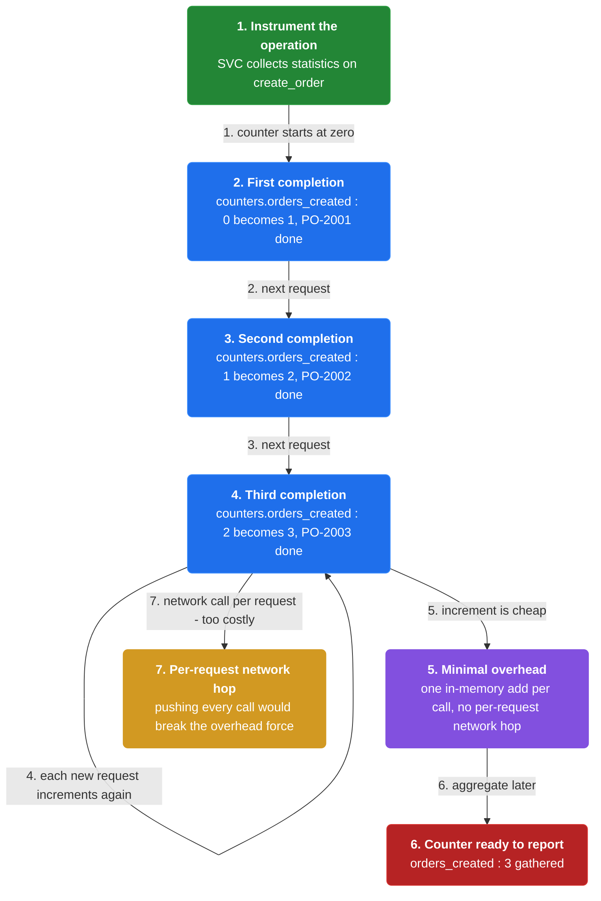
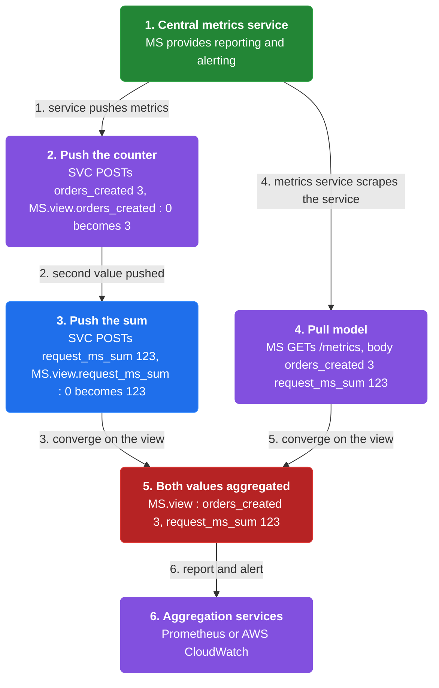
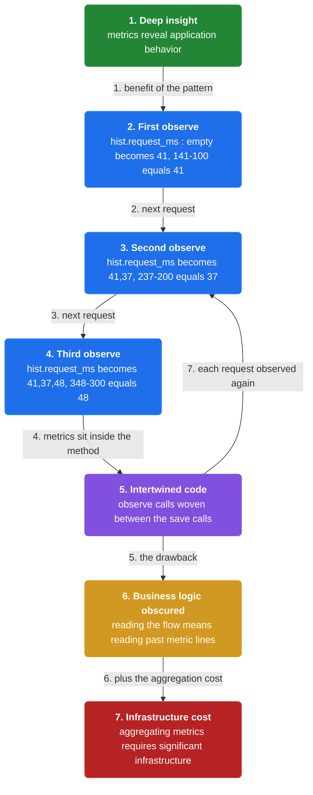

# Chapter 31: Application Metrics

> Instrument a service to gather statistics about its operations and aggregate them in a centralized metrics service for reporting and alerting.

_Also known as: Chris Richardson · Microservice Patterns Ch. 31 (p.373) · microservices.io /patterns/observability/application-metrics.html_

## Flow

### Instrumenting an operation

> **Why this matters:** The pattern's answer to "how do we understand application behavior and troubleshoot problems?" is to instrument a service to gather statistics about individual operations. A counter increments on each completed operation with minimal runtime overhead.



1. **Gather statistics** — Instrument the service to collect statistics about individual operations.

2. **Count completions** — A counter increments each time an operation such as create_order completes.

3. **Minimal overhead** — The force is that any solution must have minimal runtime overhead — an in-memory counter add is cheap.

```java
// ORDER SERVICE SIDE — a counter gathers statistics about one operation, with minimal overhead
// PARTIES: SVC = Order Service · MS = metrics service (Prometheus)
// STATE (before):
//    counters : { orders_created: 0 }
// DEF: create_order · CALLED BY: client requests arriving at SVC
// -> request1 : "PO-2001"
//    step 1 · handle request1, increment the counter    counters.orders_created : 0 -> 1   BECAUSE one create_order completed
// -> request2 : "PO-2002"
//    step 2 · handle request2, increment                counters.orders_created : 1 -> 2
// -> request3 : "PO-2003"
//    step 3 · handle request3, increment                counters.orders_created : 2 -> 3
// <- outcome : counters : { orders_created: 3 } · the increment is one in-memory add per call, not a per-request network hop
```

### Aggregating: push and pull

> **Why this matters:** Individual counters are useful only when aggregated in a centralized metrics service that provides reporting and alerting. The reference describes two aggregation models: push and pull.



1. **Central metrics service** — Aggregate metrics in a centralized metrics service that provides reporting and alerting.

2. **Push model** — The service pushes metrics to the metrics service.

3. **Pull model** — The metrics service pulls (scrapes) metrics from the service.

4. **Aggregation services** — Prometheus and AWS CloudWatch are the listed metrics aggregation services.

```java
// AGGREGATION SIDE — the central metrics service receives two values via push or via pull
// PARTIES: SVC = Order Service · MS = metrics service
// STATE (before):
//    MS.view : { orders_created: 0, request_ms_sum: 0 }
// DEF: aggregate · CALLED BY: MS reporting and alerting on the values
// -> counter : 3 · -> sum : 123                // = 3 create_order calls, 3 x 41 ms = 123 ms
//    step 1 (push) · SVC POSTs {"orders_created":3} to MS      MS.view.orders_created : 0 -> 3
//    step 2 (push) · SVC POSTs {"request_ms_sum":123} to MS    MS.view.request_ms_sum : 0 -> 123
//    step 3 (push) · MS now has both values to report and alert on
// <- outcome : MS.view : { orders_created: 3, request_ms_sum: 123 } · push = the service pushes metrics to the metrics service
//    alt pull : MS GETs /metrics -> body "orders_created 3 request_ms_sum 123" -> MS.view : {0,0} -> {3,123}   BECAUSE the metrics service pulls the metric from the service
```

### What it costs

> **Why this matters:** Metrics give deep insight, but they are not free: the metric code is intertwined with business logic, making it more complicated, and aggregating metrics can require significant infrastructure.



1. **Deep insight** — The benefit is deep insight into application behavior.

2. **Intertwined code** — The drawback is that metrics code is intertwined with business logic, making it more complicated.

3. **A histogram inline** — A histogram observes each request duration from inside the business method.

4. **Infrastructure** — Aggregating metrics can require significant infrastructure.

```java
// ORDER SERVICE SIDE — the histogram increment sits inline in business logic, tangling the code
// PARTIES: SVC = Order Service
// STATE (before):
//    hist : { request_ms: [] }
// DEF: create_order · CALLED BY: three client requests
// -> request1 : "PO-2004" · started_at : 100 · ended_at : 141
//    step 1 · save order, then observe : hist.request_ms : [] -> [41]          BECAUSE 141 - 100 = 41 ms
// -> request2 : "PO-2005" · started_at : 200 · ended_at : 237
//    step 2 · save order, then observe : hist.request_ms : [41] -> [41,37]     BECAUSE 237 - 200 = 37 ms
// -> request3 : "PO-2006" · started_at : 300 · ended_at : 348
//    step 3 · save order, then observe : hist.request_ms : [41,37] -> [41,37,48]   BECAUSE 348 - 300 = 48 ms
// <- outcome : hist : { request_ms: [41,37,48] } · three observe() calls are woven between the save() calls
```


## Key Concepts

### The Problem

**Understanding behavior.** The problem is: how to understand the behavior of an application and troubleshoot problems.


### The Solution

Instrument a service to gather statistics about individual operations and aggregate them in a centralized metrics service that provides reporting and alerting.


### Key Facts

| Fact | Detail | In the wild |
|---|---|---|
| Instrument and aggregate | Instrument a service to gather statistics about individual operations and aggregate them in a centralized metrics service that provides reporting and alerting. | A counter and a histogram feed the central service, which turns them into dashboards and alerts. |
| Intertwined code | Metrics code is intertwined with business logic, making the business logic more complicated. | observe() and save() calls sit side by side, so reading the business flow means reading past metric lines. |
| Aggregation infrastructure | Aggregating metrics can require significant infrastructure. | Running Prometheus or AWS CloudWatch adds operational cost even though per-request overhead stays low. |


### Tradeoffs & When

- Metrics code is intertwined with business logic, making the business logic more complicated.
- Aggregating metrics can require significant infrastructure.


<details><summary>All concepts (index)</summary>

### Problem: Understanding behavior

**Why.** In a microservice architecture it is hard to understand what an application is doing or troubleshoot problems.

**Claim.** The problem is: how to understand the behavior of an application and troubleshoot problems.

**Grounding.** The reference states the applied context is the Microservice architecture pattern, and the force is that any solution must have minimal runtime overhead.

**In the wild.** Without instrumentation, services are a black box beyond their request totals.
### Solution: Instrument and aggregate

**Why.** Individual operations are invisible unless measured.

**Claim.** Instrument a service to gather statistics about individual operations and aggregate them in a centralized metrics service that provides reporting and alerting.

**Grounding.** Two aggregation models: push (the service pushes metrics to the metrics service) and pull (the metrics service pulls metrics from the service). Libraries: Coda Hale/Yammer Java Metrics Library and Prometheus client libraries; services: Prometheus and AWS CloudWatch.

**In the wild.** A counter and a histogram feed the central service, which turns them into dashboards and alerts.
### Tradeoff: Intertwined code

**Why.** Instrumentation is written inside the methods it measures.

**Claim.** Metrics code is intertwined with business logic, making the business logic more complicated.

**Grounding.** The reference lists this as the pattern's drawback.

**In the wild.** observe() and save() calls sit side by side, so reading the business flow means reading past metric lines.
### Tradeoff: Aggregation infrastructure

**Why.** A centralized metrics service has to run somewhere and hold many series.

**Claim.** Aggregating metrics can require significant infrastructure.

**Grounding.** The reference lists this as one of the pattern's issues.

**In the wild.** Running Prometheus or AWS CloudWatch adds operational cost even though per-request overhead stays low.

</details>


## Quiz

1. What is the solution of the Application metrics pattern?

   - A. Instrument a service to gather statistics about individual operations and aggregate them in a centralized metrics service.
   - B. Store every request as a database row.
   - C. Attach a unique id to each request.
   - D. Wrap services in a chassis framework.

<details><summary>Reveal answer</summary>

**A.** The reference solution is to instrument a service to gather statistics about individual operations and aggregate them centrally for reporting and alerting. Option B is audit logging, C is distributed tracing, and D is the microservice chassis — all different patterns.

</details>

2. Which two aggregation models does the pattern describe?

   - A. push and pull.
   - B. push and poll.
   - C. sync and async.
   - D. batch and stream.

<details><summary>Reveal answer</summary>

**A.** The reference names exactly two models: push (the service pushes metrics to the metrics service) and pull (the metrics service pulls metrics from the service). The other pairs are not in the reference.

</details>

3. What is a drawback of application metrics?

   - A. It has high runtime overhead.
   - B. Metrics code is intertwined with business logic, making it more complicated.
   - C. It cannot alert.
   - D. It removes all insight.

<details><summary>Reveal answer</summary>

**B.** The reference drawback is that metrics code is intertwined with business logic. Option A contradicts the minimal-overhead force, and C and D are false — reporting and alerting are the point of the pattern.

</details>

4. Which of these is listed as an instrumentation library or aggregation service?

   - A. Prometheus client libraries / Prometheus.
   - B. Spring Cloud Sleuth.
   - C. Zipkin.
   - D. RabbitMQ.

<details><summary>Reveal answer</summary>

**A.** The reference lists Coda Hale/Yammer Java Metrics Library and Prometheus client libraries as instrumentation libraries, and Prometheus and AWS CloudWatch as aggregation services. Options B, C, and D belong to distributed tracing, not metrics.

</details>

