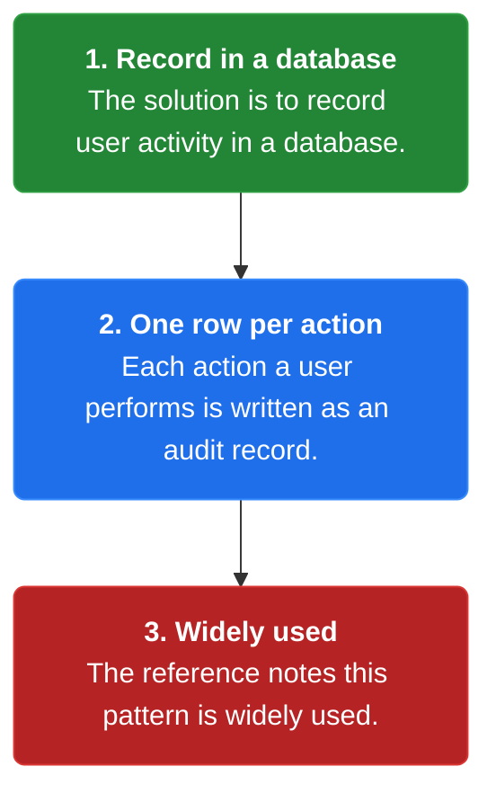
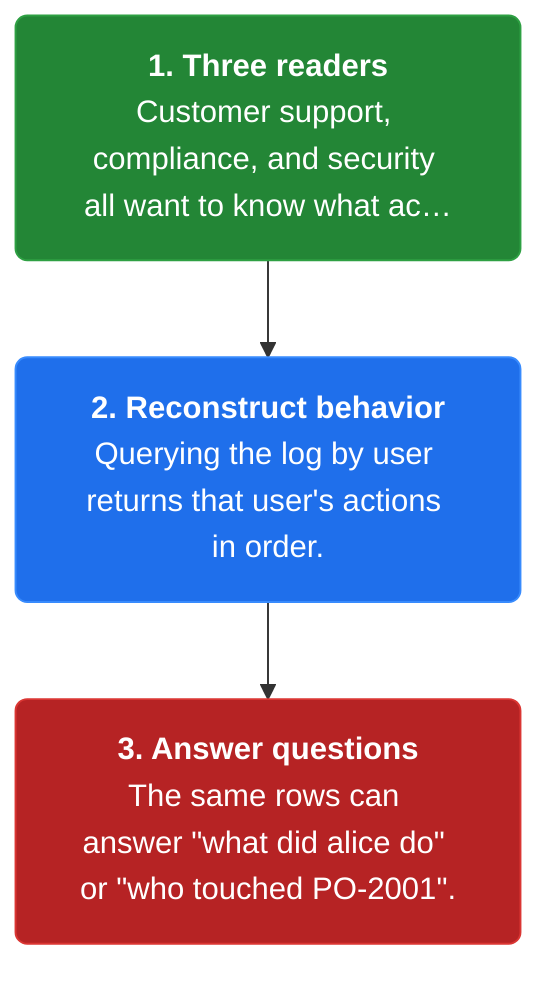
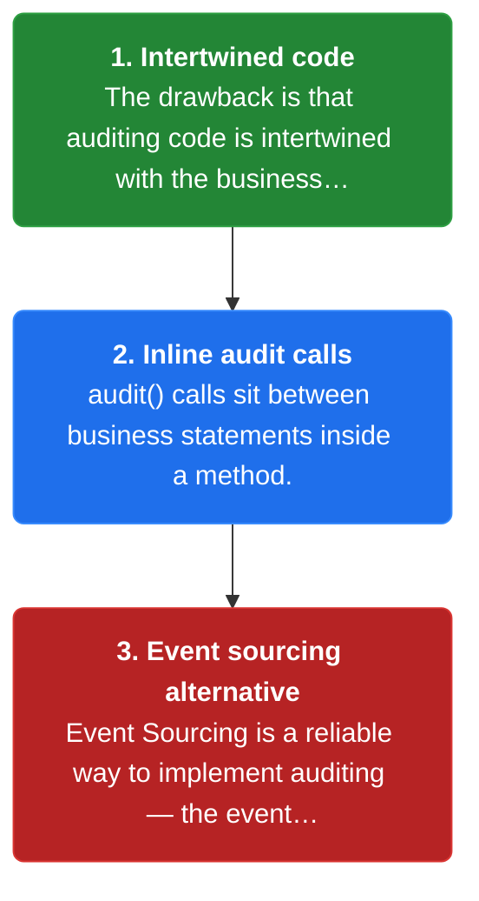

# Chapter 32: Audit Logging

> Record user activity in a database so support, compliance, and security can reconstruct what a user did.

_Also known as: Chris Richardson · Microservice Patterns Ch. 32 (p.377) · microservices.io /patterns/observability/audit-logging.html_

## Flow

### Recording user activity

> **Why this matters:** The pattern answers "how to understand the behavior of users and the application?" by recording user activity in a database. Each user action becomes a durable row naming who did what, and when.



1. **Record in a database** — The solution is to record user activity in a database.

2. **One row per action** — Each action a user performs is written as an audit record.

3. **Widely used** — The reference notes this pattern is widely used.

```java
// ORDER SERVICE SIDE — every user action becomes one audit row in the database
// PARTIES: U1 = user alice · SVC = Order Service · DB = audit database
// DEF: audit — a durable row recording who did what to which target and when; here (1,"alice","view_order","PO-2001",now)
// STATE (before):
//    audit_log : []                                 // rows: (id, user, action, target, at)
// DEF: record_activity · CALLED BY: U1 performing actions
// -> action1 : ("alice","view_order","PO-2001")
//    step 1 · INSERT audit row id=1   audit_log : [] -> [(1,"alice","view_order","PO-2001",now)]
// -> action2 : ("alice","create_order","PO-2001")
//    step 2 · INSERT audit row id=2   audit_log : [1 row] -> [(1,"alice","view_order","PO-2001",now),(2,"alice","create_order","PO-2001",now)]
// -> action3 : ("alice","pay_order","PO-2001")
//    step 3 · INSERT audit row id=3   audit_log : [2 rows] -> [(1,"alice","view_order","PO-2001",now),(2,"alice","create_order","PO-2001",now),(3,"alice","pay_order","PO-2001",now)]
// <- outcome : audit_log : 3 rows · WHO=alice, WHAT=view/create/pay, WHEN=timestamp   BECAUSE the DB now holds a record of her actions
```

### Who reads the log

> **Why this matters:** The force behind audit logging is knowing what a user recently performed — for customer support, compliance, and security. Reading the log reconstructs a user's recent behavior.



1. **Three readers** — Customer support, compliance, and security all want to know what actions a user recently performed.

2. **Reconstruct behavior** — Querying the log by user returns that user's actions in order.

3. **Answer questions** — The same rows can answer "what did alice do" or "who touched PO-2001".

```java
// SUPPORT SIDE — reading the audit log reconstructs what one user did, for support/compliance/security
// PARTIES: SUP = support agent · DB = audit database
// DEF: audit — a durable row recording who did what to which target and when, read back to reconstruct a user's actions; here (1,"alice","view_order","PO-2001",t1)
// STATE (before):
//    audit_log : [(1,"alice","view_order","PO-2001",t1),(2,"alice","create_order","PO-2001",t2),(3,"alice","pay_order","PO-2001",t3)]
//    answer : []                                // the reconstruction SUP builds
// DEF: recent_actions · CALLED BY: SUP investigating "did alice pay?"
// -> user : "alice"
//    step 1 · match row id=1    answer : [] -> [(1,"alice","view_order","PO-2001",t1)]
//    step 2 · match row id=2    answer : [(1,"alice","view_order","PO-2001",t1)] -> [(1,"alice","view_order","PO-2001",t1),(2,"alice","create_order","PO-2001",t2)]
//    step 3 · match row id=3    answer : [(1,"alice","view_order","PO-2001",t1),(2,"alice","create_order","PO-2001",t2)] -> [(1,"alice","view_order","PO-2001",t1),(2,"alice","create_order","PO-2001",t2),(3,"alice","pay_order","PO-2001",t3)]
// <- outcome : answer : 3 rows · row id=3 is the payment -> SUP confirms "yes, alice paid at t3"
//    alt compliance : query "target=PO-2001" to learn who touched it · alt security: query "action=pay_order"
```

### Auditing and event sourcing

> **Why this matters:** Audit logging is not free: the auditing code is intertwined with the business logic, making it more complicated. The related pattern Event Sourcing offers a reliable way to implement auditing.



1. **Intertwined code** — The drawback is that auditing code is intertwined with the business logic, making it more complicated.

2. **Inline audit calls** — audit() calls sit between business statements inside a method.

3. **Event sourcing alternative** — Event Sourcing is a reliable way to implement auditing — the event log itself is the audit trail.

```java
// ORDER SERVICE SIDE — audit code interleaves with business logic; event sourcing makes auditing implicit
// PARTIES: SVC = Order Service · ES = event store
// DEF: audit — a hand-written row recording what happened, appended by an explicit audit() call; here (1,"create_order","PO-2001")
// DEF: event — a domain fact appended to the event store that doubles as the audit record; here (1,"OrderCreated")
// DEF: inline — audit code that sits between business statements inside one method; here the 2 audit() calls inside create_order
// STATE (before):
//    inline_audit : []                 // hand-written audit rows
//    event_log : []                    // event-sourced alternative: events ARE the audit record
// DEF: create_order · CALLED BY: a client request
// -> order_id : "PO-2001"
//    step 1 · save the order, then call audit()     inline_audit : [] -> [(1,"create_order","PO-2001")]
//    step 2 · publish, then call audit()            inline_audit : [1 row] -> [(1,"create_order","PO-2001"),(2,"order_published","PO-2001")]
//    step 3 · the 2 audit() calls sit between business statements -> the method is harder to read
// <- outcome : inline_audit : 2 rows · business logic more complicated   BECAUSE the auditing code is intertwined with it
//    alt event sourcing : append 2 domain events   event_log : [] -> [(1,"OrderCreated"),(2,"OrderPublished")] · the audit is a read of event_log, no audit() calls
```


## Key Concepts

### The Problem

**Who did what.** The problem is how to understand the behavior of users and the application, and troubleshoot problems.


### The Solution

Record user activity in a database, giving a record of user actions.


### Key Facts

| Fact | Detail | In the wild |
|---|---|---|
| Record user activity | Record user activity in a database, giving a record of user actions. | Each action becomes a row with who, what, and when. |
| Intertwined code | The auditing code is intertwined with the business logic, which makes the business logic more complicated. | audit() calls sit between business statements, so the flow is harder to read. |
| Event sourcing alternative | Event Sourcing is a reliable way to implement auditing — the event log itself is the audit trail. | Adopting event sourcing removes the audit() calls but is a larger architectural commitment. |


### Tradeoffs & When

- The auditing code is intertwined with the business logic, which makes the business logic more complicated.
- Event Sourcing is a reliable way to implement auditing — the event log itself is the audit trail.


<details><summary>All concepts (index)</summary>

### Problem: Who did what

**Why.** After the fact, you need to know what a user has been doing.

**Claim.** The problem is how to understand the behavior of users and the application, and troubleshoot problems.

**Grounding.** The reference force: it is useful to know what actions a user recently performed — for customer support, compliance, and security.

**In the wild.** A support agent needs to reconstruct a user's recent actions to answer a complaint.
### Solution: Record user activity

**Why.** Without a durable record, user actions are lost as soon as they happen.

**Claim.** Record user activity in a database, giving a record of user actions.

**Grounding.** The reference solution is exactly that — record user activity in a database — and notes the pattern is widely used.

**In the wild.** Each action becomes a row with who, what, and when.
### Tradeoff: Intertwined code

**Why.** The audit write happens inside the business method it records.

**Claim.** The auditing code is intertwined with the business logic, which makes the business logic more complicated.

**Grounding.** The reference lists this as the pattern's drawback.

**In the wild.** audit() calls sit between business statements, so the flow is harder to read.
### Tradeoff: Event sourcing alternative

**Why.** A separate audit call is extra work that can drift from what actually happened.

**Claim.** Event Sourcing is a reliable way to implement auditing — the event log itself is the audit trail.

**Grounding.** The reference lists Event Sourcing as the related pattern for reliable auditing.

**In the wild.** Adopting event sourcing removes the audit() calls but is a larger architectural commitment.

</details>


## Quiz

1. What is the solution of the Audit logging pattern?

   - A. Record user activity in a database.
   - B. Log every HTTP status code.
   - C. Sample a fraction of requests.
   - D. Store metrics in a time-series database.

<details><summary>Reveal answer</summary>

**A.** The reference solution is to record user activity in a database. Option D is application metrics, and B and C are not the audit logging solution.

</details>

2. Which forces motivate knowing a user's recent actions?

   - A. Load balancing and scaling.
   - B. Customer support, compliance, and security.
   - C. Reducing build time.
   - D. Service discovery.

<details><summary>Reveal answer</summary>

**B.** The reference force names customer support, compliance, and security as the readers who need to know what a user recently performed. The other options are unrelated concerns.

</details>

3. What is the main drawback of audit logging?

   - A. It is unreliable.
   - B. The auditing code is intertwined with the business logic, making it more complicated.
   - C. It cannot be stored in a database.
   - D. It removes all user actions.

<details><summary>Reveal answer</summary>

**B.** The reference drawback is that auditing code is intertwined with business logic, making it more complicated. Options A, C, and D are false — the pattern records to a database and provides a record, not removes one.

</details>

4. Which related pattern is described as a reliable way to implement auditing?

   - A. Event Sourcing.
   - B. CQRS.
   - C. API composition.
   - D. Circuit breaker.

<details><summary>Reveal answer</summary>

**A.** The reference states Event Sourcing is a reliable way to implement auditing, because the event log itself is the audit trail. The other patterns are not tied to auditing in the reference.

</details>

