# Chapter 33: Distributed Tracing

> Assign each external request a unique id, pass it through every service, and record per-operation timing in a centralized trace store.

_Also known as: Chris Richardson · Microservice Patterns Ch. 33 (p.370) · microservices.io /patterns/observability/distributed-tracing.html_

## Flow

### Assigning the request id

> **Why this matters:** Requests span multiple services, but external monitoring only reports overall response time and invocation counts — no insight into individual operations. The first fix is to assign each external request a unique id.

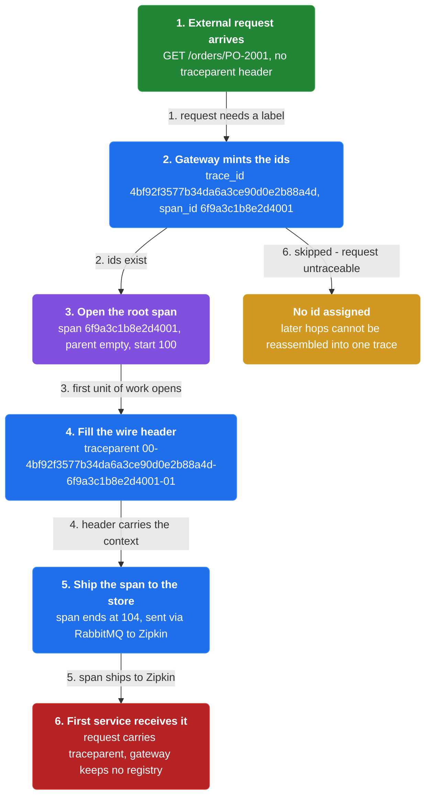

1. **Unique external request id** — Instrument services with code that assigns each external request a unique external request id.

2. **Carry it on the request** — The id is attached to the request as it enters the service graph.

3. **Chassis-provided** — This instrumentation might be part of the functionality provided by a Microservice Chassis framework.

```java
// API GATEWAY SIDE — the gateway mints the ids, opens the root span, and hands the context to the first service
// PARTIES: GW = API gateway (mints the ids) · SVC = first service process · BRK = RabbitMQ broker (async span transport to the collector) · ZIP = Zipkin distributed tracing system (collector + storage + query UI)
// DEF: trace_id — 128 random bits encoded as 32 hex chars, one per external request; here "4bf92f3577b34da6a3ce90d0e2b88a4d"
// DEF: span_id — 64 random bits encoded as 16 hex chars, one per operation; here "6f9a3c1b8e2d4001"
// DEF: span — one unit of work {span_id, parent, name, start, end}; here ("6f9a3c1b8e2d4001", parent="", name="GET /orders/PO-2001", start=100, end=104)
// DEF: header — the outbound key-value carrier {trace_id, span_id}; here { trace_id:"4bf92f3577b34da6a3ce90d0e2b88a4d", span_id:"6f9a3c1b8e2d4001" }
// DEF: traceparent — the wire form of the header = "00-<trace_id>-<span_id>-01"; here "00-4bf92f3577b34da6a3ce90d0e2b88a4d-6f9a3c1b8e2d4001-01"
// STATE (before):
//    spans  : []                                // spans opened so far for this request
//    header : { trace_id: "", span_id: "" }     // the outbound context, empty before GW fills it
// DEF: receive_request · CALLED BY: the client HTTP request arriving at GW
// -> request : "GET /orders/PO-2001"
//    step 1 · GW mints the ids    trace_id = 128 random bits -> 32 hex chars = "4bf92f3577b34da6a3ce90d0e2b88a4d" · span_id = 64 random bits -> 16 hex chars = "6f9a3c1b8e2d4001"
//    step 2 · GW opens the root span    spans : [] -> [("6f9a3c1b8e2d4001", parent="", name="GET /orders/PO-2001", start=100)]
//    step 3 · GW fills the header    header : { trace_id:"", span_id:"" } -> { trace_id:"4bf92f3577b34da6a3ce90d0e2b88a4d", span_id:"6f9a3c1b8e2d4001" }   // wire form "00-4bf9...-6f9a...-01"
//    step 4 · GW reports the span    span : open -> on BRK queue "zipkin" · ZIP collector consumes it and the storage stores it (start=100, end=104)
// <- outcome : SVC receives traceparent "00-4bf92f3577b34da6a3ce90d0e2b88a4d-6f9a3c1b8e2d4001-01" · ZIP storage holds the root span (GW keeps no registry)
//    alt B3 header : "X-B3-TraceId: 4bf92f3577b34da6a3ce90d0e2b88a4d" + "X-B3-SpanId: 6f9a3c1b8e2d4001" (same ids, different header names)
```

### Propagating through services

> **Why this matters:** The id is useless unless every service that handles the request receives it. Each hop opens a child span naming its parent, so one request becomes a chain of spans.

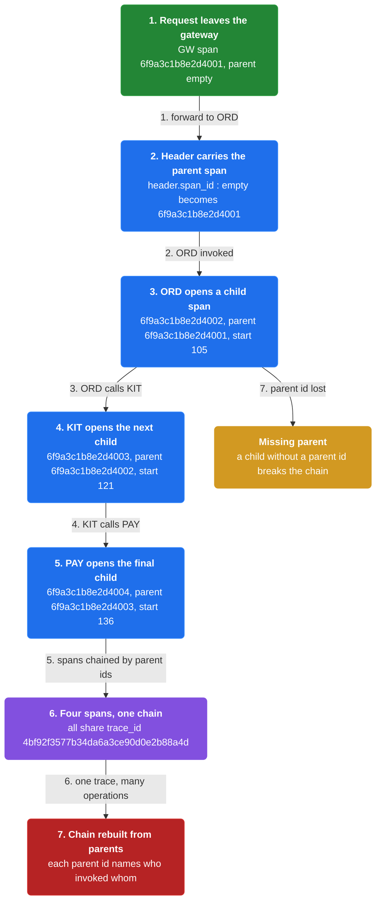

1. **Pass the id** — Pass the external request id to all services involved in handling the request.

2. **Child spans** — Each service opens a span whose parent is the span of the previous hop.

3. **One trace, many operations** — Each service performs one or more operations — database queries, message publishes — captured as spans.

```java
// SERVICE SIDE — each service reads the inbound header, opens a child span of the previous hop, and forwards the updated header
// PARTIES: GW = API gateway process · ORD = Order Service process · KIT = Kitchen Service process · PAY = Payment Service process
// DEF: span — one unit of work {span_id, parent, name, start, end}; here ("6f9a3c1b8e2d4002", parent="6f9a3c1b8e2d4001", name="GET /orders/PO-2001", start=105, end=120)
// DEF: parent — a span's parent span_id (which hop invoked it); here "6f9a3c1b8e2d4001" for a child, "" for the root
// DEF: header — the in-memory carrier {trace_id, span_id} read from and written to the wire; here { trace_id:"4bf92f3577b34da6a3ce90d0e2b88a4d", span_id:"6f9a3c1b8e2d4001" }
// DEF: traceparent — the wire form "00-<trace_id>-<span_id>-01"; here "00-4bf92f3577b34da6a3ce90d0e2b88a4d-6f9a3c1b8e2d4001-01"
// STATE (before):
//    spans  : [("6f9a3c1b8e2d4001", parent="", name="GET /orders/PO-2001", start=100, end=104)]
//    header : { trace_id: "4bf92f3577b34da6a3ce90d0e2b88a4d", span_id: "6f9a3c1b8e2d4001" }   // what the inbound request carried
// DEF: handle_request · CALLED BY: the request moving GW -> ORD -> KIT -> PAY
// -> trace_id : "4bf92f3577b34da6a3ce90d0e2b88a4d"
//    step 1 · ORD reads the inbound header    parent : "" -> "6f9a3c1b8e2d4001"  (the span id of the hop that invoked it)
//    step 2 · ORD mints a child id    span_id = 64 random bits -> 16 hex chars = "6f9a3c1b8e2d4002"  (trace_id stays the SAME across all hops)
//    step 3 · ORD opens the child span    spans : [1 span] -> [1 span, ("6f9a3c1b8e2d4002", parent="6f9a3c1b8e2d4001", start=105, end=120)]
//    step 4 · ORD forwards the updated header    header : { span_id:"6f9a3c1b8e2d4001" } -> { span_id:"6f9a3c1b8e2d4002" }   // wire form "00-...-6f9a3c1b8e2d4002-01"
//    step 5 · KIT and PAY repeat steps 1-4    spans : [2 spans] -> [2 spans, ("6f9a3c1b8e2d4003", parent="6f9a3c1b8e2d4002", start=121, end=135)] -> [3 spans, ("6f9a3c1b8e2d4004", parent="6f9a3c1b8e2d4003", start=136, end=150)]
// <- outcome : 4 spans chained by parent ids, all carrying trace_id "4bf92f3577b34da6a3ce90d0e2b88a4d" · each hop's span reported to ZIP
```

### Collecting spans in the trace store

> **Why this matters:** Spans must be recorded in a centralized service so the whole request can be reconstructed. The reference example delivers traces to a Zipkin server via RabbitMQ, where Zipkin gathers and displays them.

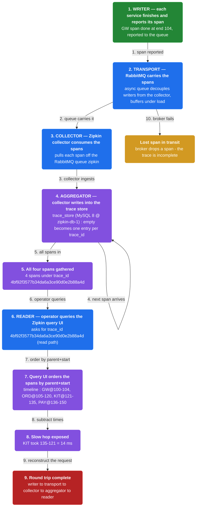

1. **Record in a central service** — Record information about requests and operations — for example start time and end time — in a centralized service.

2. **Sleuth and Zipkin** — Spring Cloud Sleuth instruments components and delivers trace information to a Zipkin server.

3. **Deliver via RabbitMQ** — RabbitMQ is used to deliver traces to Zipkin; the Zipkin server is a Spring Boot app with @EnableZipkinStreamServer.

4. **Latency from times** — Start and end times per span let Zipkin derive per-operation latency.

```java
// TRACE STORE SIDE — the system pipeline: writer (each instrumented service) -> transport (RabbitMQ) -> collector (Zipkin collector) -> aggregator (trace store = MySQL 8 @ zipkin-db-1) -> reader (Zipkin query UI + operator); latency = end - start
// PARTIES: GW = gateway process (writer) · ORD = Order Service process (writer) · BRK = RabbitMQ broker (async span transport: decouples writers from the collector, buffers under load) · ZIP = Zipkin distributed tracing system = collector (ingests spans from BRK) + storage — the trace store (MySQL 8 @ zipkin-db-1, the aggregator) + query UI (serves timelines to OP) · OP = operator (reader)
// DEF: trace — the set of all spans sharing one trace_id; here trace "4bf92f3577b34da6a3ce90d0e2b88a4d" = 4 spans
// DEF: span — one unit of work {span_id, parent, start, end}; here ("6f9a3c1b8e2d4001", parent="", start=100, end=104)
// DEF: latency — how long one span took = end - start; here 104 - 100 = 4
// DEF: writer — the instrumented service that finishes an operation and REPORTS its span; here GW reports ("6f9a3c1b8e2d4001", start=100, end=104), ORD/KIT/PAY report theirs
// DEF: collector — the Zipkin sub-service that CONSUMES spans off the RabbitMQ queue "zipkin" and writes them into the trace store; here it ingests 4 spans
// DEF: aggregator — the trace store itself (MySQL 8 @ zipkin-db-1) that gathers spans by trace_id; here {"4bf92f3577b34da6a3ce90d0e2b88a4d" : 4 spans}
// DEF: reader — the Zipkin query UI the operator uses to pull one trace back as a timeline; here OP asks for "4bf92f3577b34da6a3ce90d0e2b88a4d" and gets 4 spans
// DEF: timeline — the spans of one trace ordered by parent+start; here [GW@100-104, ORD@105-120, KIT@121-135, PAY@136-150]
// STATE (before):
//    trace_store : {}   // trace_id -> spans, kept by the aggregator (ZIP storage)
//    timeline    : []   // the ordered spans served back on a read
// DEF: collect_spans · CALLED BY: each writer finishing its operation
// -> trace_id : "4bf92f3577b34da6a3ce90d0e2b88a4d" · -> span1 : ("6f9a3c1b8e2d4001", parent="", start=100, end=104)
//    step 1 · writer GW reports span1 to BRK queue "zipkin"    span1 : ("6f9a3c1b8e2d4001", 100, 104) -> on the wire to BRK (transport hop 1)
//    step 2 · collector consumes span1 off BRK and writes it    trace_store : {} -> {"4bf92f3577b34da6a3ce90d0e2b88a4d" : [("6f9a3c1b8e2d4001", parent="", start=100, end=104)]}
//    step 3 · ORD span via BRK -> collector -> store    trace_store : {"4bf92f3577b34da6a3ce90d0e2b88a4d" : 1 span} -> {"4bf92f3577b34da6a3ce90d0e2b88a4d" : [("6f9a3c1b8e2d4001", start=100, end=104), ("6f9a3c1b8e2d4002", parent="6f9a3c1b8e2d4001", start=105, end=120)]}
//    step 4 · KIT span via BRK -> collector -> store    trace_store : {"4bf92f3577b34da6a3ce90d0e2b88a4d" : 2 spans} -> {"4bf92f3577b34da6a3ce90d0e2b88a4d" : [2 spans, ("6f9a3c1b8e2d4003", parent="6f9a3c1b8e2d4002", start=121, end=135)]}
//    step 5 · PAY span via BRK -> collector -> store    trace_store : {"4bf92f3577b34da6a3ce90d0e2b88a4d" : 3 spans} -> {"4bf92f3577b34da6a3ce90d0e2b88a4d" : [3 spans, ("6f9a3c1b8e2d4004", parent="6f9a3c1b8e2d4003", start=136, end=150)]}
//    step 6 · reader OP queries the ZIP query UI for the trace id    trace_store : {"4bf92f3577b34da6a3ce90d0e2b88a4d" : 4 spans} -> returns the 4 spans (read, nothing written)
//    step 7 · ZIP query UI orders them by parent+start    timeline : [] -> [GW@100-104, ORD@105-120, KIT@121-135, PAY@136-150]
// <- outcome : OP sees the timeline for trace "4bf92f3577b34da6a3ce90d0e2b88a4d" · slow hop = KIT (135 - 121 = 14 ms)   BECAUSE the writer's spans travel BRK -> collector -> store, and the reader pulls them back ordered by parent+start
```

### Searching logs by request id

> **Why this matters:** Because the request id is included in every log message, a developer can search aggregated logs for it and see how one request was handled — but aggregating and storing traces can require significant infrastructure.

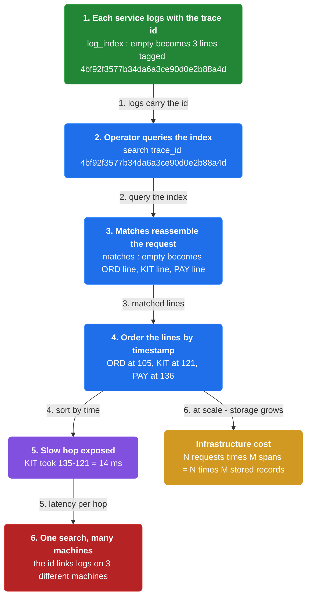

1. **Include id in logs** — Include the external request id in all log messages, per the instrumentation.

2. **Search aggregated logs** — The benefit is searching across aggregated logs for the external request id to see how an individual request was handled.

3. **Find the slow hop** — Ordering the matched lines by time exposes the sources of latency.

4. **Infrastructure cost** — The issue is that aggregating and storing traces can require significant infrastructure.

```java
// OPERATOR SIDE — the trace id is printed into every log line, so one search reassembles a request across machines
// PARTIES: OP = operator (reader) · LOGS = log-aggregation index (Elasticsearch 8 @ logs-es-1) · ZIP = Zipkin distributed tracing system (collector + storage + query UI)
// DEF: trace_id — the id printed in every log line of one request; here "4bf92f3577b34da6a3ce90d0e2b88a4d"
// DEF: match — one stored log line that satisfies the search; here 3 lines for one trace_id
// STATE (before):
//    log_index : []   // every stored log line, tagged with its trace id (kept by LOGS)
//    matches   : []   // what a search returns
// DEF: search · CALLED BY: OP debugging one slow request
// -> trace_id : "4bf92f3577b34da6a3ce90d0e2b88a4d"
//    step 1 · each service logs with the id inline   log_index : [] -> ["[4bf92f3577b34da6a3ce90d0e2b88a4d] ORD line", "[4bf92f3577b34da6a3ce90d0e2b88a4d] KIT line", "[4bf92f3577b34da6a3ce90d0e2b88a4d] PAY line"]
//    step 2 · OP queries the index for the id   matches : [] -> [ORD line, KIT line, PAY line]
//    step 3 · OP orders the 3 lines by timestamp   matches : [3 lines] -> [ORD@105, KIT@121, PAY@136]
// <- outcome : matches = 3 lines for one id · slow hop = KIT (135 - 121 = 14 ms)   BECAUSE the id links log lines on 3 different machines
//    alt infra cost : at scale N requests x M spans = N x M records -> needs real storage infrastructure
```


## System Design Interview

**The pipeline:** writer → transport → collector → aggregator/store → reader

### each service process (GW, Order, Kitchen, Payment) — the writer

_Role: writer_

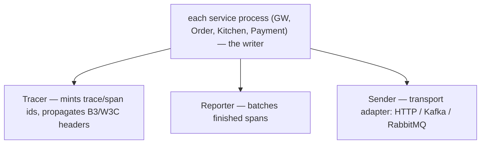

### RabbitMQ broker — the transport

_Role: transport_

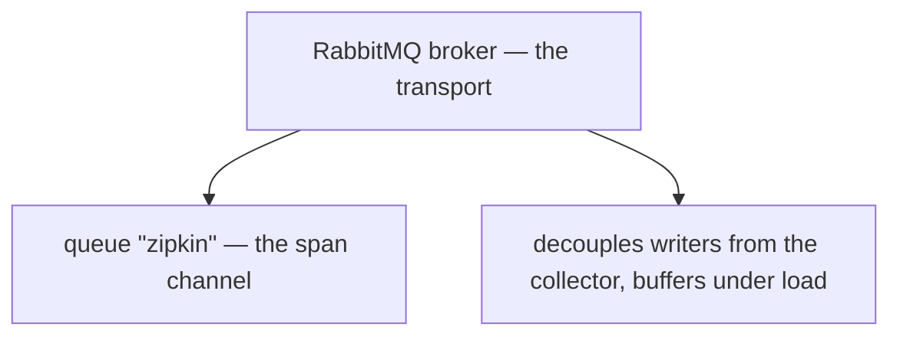

### Zipkin server (one central process, NOT per-host) — collector + aggregator + reader

_Role: collector + aggregator/store + reader_

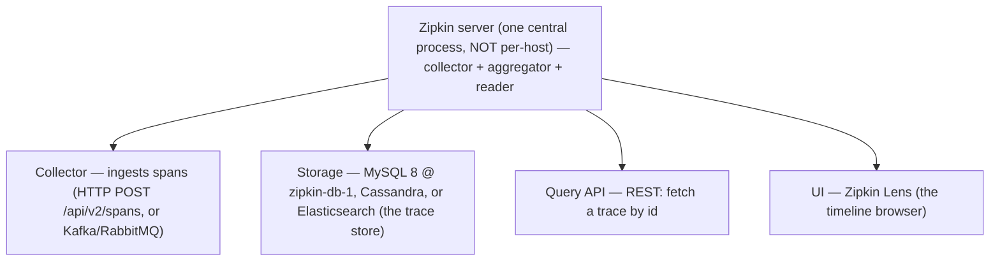

### operator — the reader

_Role: reader_

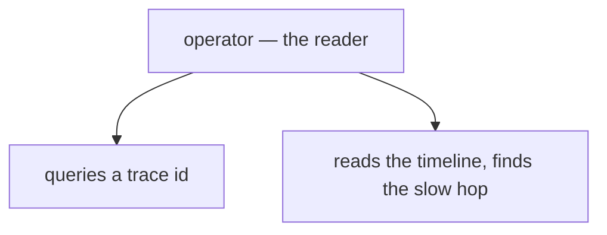

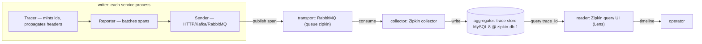

```java
// SYSTEM DESIGN — tracing as a pipeline: writer (in-process Tracer -> Reporter -> Sender) -> transport (RabbitMQ) -> collector (Zipkin collector) -> aggregator (trace store MySQL 8 @ zipkin-db-1) -> reader (Zipkin query UI + operator)
// PARTIES: APP = each service process (writer; internals Tracer -> Reporter -> Sender) · BRK = RabbitMQ broker (transport: queue "zipkin") · ZIP = Zipkin server (collector + storage + query UI) · OP = operator (reader)
// DEF: tracer — (in-process, inside APP) mints the trace_id/span ids and propagates B3/W3C headers; here mints trace_id "4bf92f3577b34da6a3ce90d0e2b88a4d"
// DEF: reporter — (in-process, inside APP) batches finished spans; here batches span ("6f9a3c1b8e2d4001", parent="", start=100, end=104)
// DEF: sender — (in-process, inside APP) the transport adapter (HTTP / Kafka / RabbitMQ); here the RabbitMQ sender publishes to queue "zipkin"
// DEF: queue — the RabbitMQ channel "zipkin" that carries spans from the senders to the collector; here it carries 4 spans
// DEF: trace — the set of all spans sharing one trace_id; here trace "4bf92f3577b34da6a3ce90d0e2b88a4d" = 4 spans
// DEF: collector — (inside ZIP) ingests spans off BRK (HTTP POST /api/v2/spans or the queue consumer); here consumes 4 spans
// DEF: aggregator — (inside ZIP) the trace store = MySQL 8 @ zipkin-db-1 gathering spans by trace_id; here {"4bf92f3577b34da6a3ce90d0e2b88a4d" : 4 spans}
// DEF: reader — (inside ZIP) Query API GET /api/v2/traces/<traceId> + Lens UI serving OP; here returns 4 spans as a timeline
// STATE (before):
//    zipkin_queue : []   // BRK queue "zipkin" (transport)
//    trace_store  : {}   // inside ZIP storage (aggregator)
// DEF: trace_one_request · CALLED BY: one external request finishing across GW -> ORD -> KIT -> PAY
// -> trace_id : "4bf92f3577b34da6a3ce90d0e2b88a4d"
//    step 1 · GW tracer mints the ids    trace_id = 128 random bits -> 32 hex chars = "4bf92f3577b34da6a3ce90d0e2b88a4d"
//    step 2 · GW reporter batches the finished span    span : ("6f9a3c1b8e2d4001", parent="", start=100, end=104) -> queued
//    step 3 · GW sender publishes to BRK    zipkin_queue : [] -> [span 6f9a3c1b8e2d4001]
//    step 4 · ZIP collector consumes and writes    trace_store : {} -> {"4bf92f3577b34da6a3ce90d0e2b88a4d" : [span 6f9a3c1b8e2d4001]}
//    step 5 · ORD/KIT/PAY repeat steps 1-4    trace_store : {1 span} -> {4 spans: 6f9a3c1b8e2d4001..04}   BECAUSE each of the 4 services is its own writer with its own Tracer -> Reporter -> Sender
//    step 6 · OP queries ZIP Query API    GET /api/v2/traces/4bf92f3577b34da6a3ce90d0e2b88a4d -> the 4 spans (read, nothing written)
//    step 7 · ZIP Lens UI orders by parent+start    timeline : [] -> [GW@100-104, ORD@105-120, KIT@121-135, PAY@136-150]
// <- outcome : OP sees the timeline · slow hop = KIT (135 - 121 = 14 ms)   BECAUSE each writer's in-process Tracer -> Reporter -> Sender ships spans over BRK (transport) to ZIP's collector -> storage (aggregator), and ZIP's query UI serves them back (reader)
```

## Interview Questions

### Q1

External monitoring reports only overall response time and invocation counts, so a slow request looks fine in aggregate. The team instruments the gateway to label each external request before it enters the services.

**Interviewer's question:** What is the first thing distributed tracing instrumentation does for each external request, and what is the id's relationship to the first span?

**Solution:** It assigns each external request a unique external request id, attaches it to the request, and opens the root span — the first span of the trace, with no parent.

**System-design components:**
- API gateway
- trace_id
- root span
- Zipkin
- operator read-back

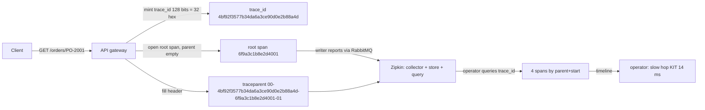

```java
// API GATEWAY SIDE — the gateway mints the ids, opens the root span, and hands the context to the first service
// PARTIES: GW = API gateway (mints the ids) · SVC = first service process · BRK = RabbitMQ broker (async span transport to the collector) · ZIP = Zipkin distributed tracing system (collector + storage + query UI)
// DEF: trace_id — 128 random bits encoded as 32 hex chars, one per external request; here "4bf92f3577b34da6a3ce90d0e2b88a4d"
// DEF: span_id — 64 random bits encoded as 16 hex chars, one per operation; here "6f9a3c1b8e2d4001"
// DEF: span — one unit of work {span_id, parent, name, start, end}; here ("6f9a3c1b8e2d4001", parent="", name="GET /orders/PO-2001", start=100, end=104)
// DEF: header — the outbound key-value carrier {trace_id, span_id}; here { trace_id:"4bf92f3577b34da6a3ce90d0e2b88a4d", span_id:"6f9a3c1b8e2d4001" }
// DEF: traceparent — the wire form of the header = "00-<trace_id>-<span_id>-01"; here "00-4bf92f3577b34da6a3ce90d0e2b88a4d-6f9a3c1b8e2d4001-01"
// STATE (before):
//    spans  : []                                // spans opened so far for this request
//    header : { trace_id: "", span_id: "" }     // the outbound context, empty before GW fills it
// DEF: receive_request · CALLED BY: the client HTTP request arriving at GW
// -> request : "GET /orders/PO-2001"
//    step 1 · GW mints the ids    trace_id = 128 random bits -> 32 hex chars = "4bf92f3577b34da6a3ce90d0e2b88a4d" · span_id = 64 random bits -> 16 hex chars = "6f9a3c1b8e2d4001"
//    step 2 · GW opens the root span    spans : [] -> [("6f9a3c1b8e2d4001", parent="", name="GET /orders/PO-2001", start=100)]
//    step 3 · GW fills the header    header : { trace_id:"", span_id:"" } -> { trace_id:"4bf92f3577b34da6a3ce90d0e2b88a4d", span_id:"6f9a3c1b8e2d4001" }   // wire form "00-4bf9...-6f9a...-01"
//    step 4 · GW reports the span    span : open -> on BRK queue "zipkin" · ZIP collector consumes it and the storage stores it (start=100, end=104)
// <- outcome : SVC receives traceparent "00-4bf92f3577b34da6a3ce90d0e2b88a4d-6f9a3c1b8e2d4001-01" · ZIP storage holds the root span (GW keeps no registry)
//    alt B3 header : "X-B3-TraceId: 4bf92f3577b34da6a3ce90d0e2b88a4d" + "X-B3-SpanId: 6f9a3c1b8e2d4001" (same ids, different header names)
```

_This is the chapter's assign-the-request-id step: a unique id plus the root span begin the trace._

_Covers:_ Assigning the request id

_From the 28 problems:_ 20-metrics-monitoring

### Q2

One request travels GW to Order Service to Kitchen Service to Payment Service. Each hop must keep the trace intact so the whole journey can be reconstructed.

**Interviewer's question:** How does the request id propagate through services, and how do the spans relate to one another?

**Solution:** Each service passes the id onward, and each hop opens a child span whose parent is the previous hop's span, chaining one request into a sequence of spans.

**System-design components:**
- API gateway
- Order Service
- Kitchen Service
- Payment Service


```java
// SERVICE SIDE — each service reads the inbound header, opens a child span of the previous hop, and forwards the updated header
// PARTIES: GW = API gateway process · ORD = Order Service process · KIT = Kitchen Service process · PAY = Payment Service process
// DEF: span — one unit of work {span_id, parent, name, start, end}; here ("6f9a3c1b8e2d4002", parent="6f9a3c1b8e2d4001", name="GET /orders/PO-2001", start=105, end=120)
// DEF: parent — a span's parent span_id (which hop invoked it); here "6f9a3c1b8e2d4001" for a child, "" for the root
// DEF: header — the in-memory carrier {trace_id, span_id} read from and written to the wire; here { trace_id:"4bf92f3577b34da6a3ce90d0e2b88a4d", span_id:"6f9a3c1b8e2d4001" }
// DEF: traceparent — the wire form "00-<trace_id>-<span_id>-01"; here "00-4bf92f3577b34da6a3ce90d0e2b88a4d-6f9a3c1b8e2d4001-01"
// STATE (before):
//    spans  : [("6f9a3c1b8e2d4001", parent="", name="GET /orders/PO-2001", start=100, end=104)]
//    header : { trace_id: "4bf92f3577b34da6a3ce90d0e2b88a4d", span_id: "6f9a3c1b8e2d4001" }   // what the inbound request carried
// DEF: handle_request · CALLED BY: the request moving GW -> ORD -> KIT -> PAY
// -> trace_id : "4bf92f3577b34da6a3ce90d0e2b88a4d"
//    step 1 · ORD reads the inbound header    parent : "" -> "6f9a3c1b8e2d4001"  (the span id of the hop that invoked it)
//    step 2 · ORD mints a child id    span_id = 64 random bits -> 16 hex chars = "6f9a3c1b8e2d4002"  (trace_id stays the SAME across all hops)
//    step 3 · ORD opens the child span    spans : [1 span] -> [1 span, ("6f9a3c1b8e2d4002", parent="6f9a3c1b8e2d4001", start=105, end=120)]
//    step 4 · ORD forwards the updated header    header : { span_id:"6f9a3c1b8e2d4001" } -> { span_id:"6f9a3c1b8e2d4002" }   // wire form "00-...-6f9a3c1b8e2d4002-01"
//    step 5 · KIT and PAY repeat steps 1-4    spans : [2 spans] -> [2 spans, ("6f9a3c1b8e2d4003", parent="6f9a3c1b8e2d4002", start=121, end=135)] -> [3 spans, ("6f9a3c1b8e2d4004", parent="6f9a3c1b8e2d4003", start=136, end=150)]
// <- outcome : 4 spans chained by parent ids, all carrying trace_id "4bf92f3577b34da6a3ce90d0e2b88a4d" · each hop's span reported to ZIP
```

_This is the chapter's propagate-through-services step: each hop opens a child span of the previous one, forming the trace chain._

_Covers:_ Propagating through services

_From the 28 problems:_ 20-metrics-monitoring

### Q3

The four spans from GW, Order, Kitchen, and Payment must land in one place where the whole request can be reconstructed with per-operation timing.

**Interviewer's question:** How are spans recorded centrally — walking the writer, collector, and aggregator — and how is per-operation latency derived?

**Solution:** The instrumented services are the writers: each reports its finished span to RabbitMQ, the async transport that decouples them from the backend and buffers under load. The Zipkin collector consumes those spans off the queue and writes them into the trace store (the aggregator, MySQL 8), where the query UI serves the operator a timeline. Zipkin derives each operation's latency as end minus start.

**System-design components:**
- writers (instrumented GW/Order/Kitchen/Payment)
- RabbitMQ broker (transport)
- Zipkin collector
- trace store MySQL 8 (aggregator)
- Zipkin query UI (reader)


```java
// TRACE STORE SIDE — the system pipeline: writer (each instrumented service) -> transport (RabbitMQ) -> collector (Zipkin collector) -> aggregator (trace store = MySQL 8 @ zipkin-db-1) -> reader (Zipkin query UI + operator); latency = end - start
// PARTIES: GW = gateway process (writer) · ORD = Order Service process (writer) · BRK = RabbitMQ broker (async span transport: decouples writers from the collector, buffers under load) · ZIP = Zipkin distributed tracing system = collector (ingests spans from BRK) + storage — the trace store (MySQL 8 @ zipkin-db-1, the aggregator) + query UI (serves timelines to OP) · OP = operator (reader)
// DEF: trace — the set of all spans sharing one trace_id; here trace "4bf92f3577b34da6a3ce90d0e2b88a4d" = 4 spans
// DEF: span — one unit of work {span_id, parent, start, end}; here ("6f9a3c1b8e2d4001", parent="", start=100, end=104)
// DEF: latency — how long one span took = end - start; here 104 - 100 = 4
// DEF: writer — the instrumented service that finishes an operation and REPORTS its span; here GW reports ("6f9a3c1b8e2d4001", start=100, end=104), ORD/KIT/PAY report theirs
// DEF: collector — the Zipkin sub-service that CONSUMES spans off the RabbitMQ queue "zipkin" and writes them into the trace store; here it ingests 4 spans
// DEF: aggregator — the trace store itself (MySQL 8 @ zipkin-db-1) that gathers spans by trace_id; here {"4bf92f3577b34da6a3ce90d0e2b88a4d" : 4 spans}
// DEF: reader — the Zipkin query UI the operator uses to pull one trace back as a timeline; here OP asks for "4bf92f3577b34da6a3ce90d0e2b88a4d" and gets 4 spans
// DEF: timeline — the spans of one trace ordered by parent+start; here [GW@100-104, ORD@105-120, KIT@121-135, PAY@136-150]
// STATE (before):
//    trace_store : {}   // trace_id -> spans, kept by the aggregator (ZIP storage)
//    timeline    : []   // the ordered spans served back on a read
// DEF: collect_spans · CALLED BY: each writer finishing its operation
// -> trace_id : "4bf92f3577b34da6a3ce90d0e2b88a4d" · -> span1 : ("6f9a3c1b8e2d4001", parent="", start=100, end=104)
//    step 1 · writer GW reports span1 to BRK queue "zipkin"    span1 : ("6f9a3c1b8e2d4001", 100, 104) -> on the wire to BRK (transport hop 1)
//    step 2 · collector consumes span1 off BRK and writes it    trace_store : {} -> {"4bf92f3577b34da6a3ce90d0e2b88a4d" : [("6f9a3c1b8e2d4001", parent="", start=100, end=104)]}
//    step 3 · ORD span via BRK -> collector -> store    trace_store : {"4bf92f3577b34da6a3ce90d0e2b88a4d" : 1 span} -> {"4bf92f3577b34da6a3ce90d0e2b88a4d" : [("6f9a3c1b8e2d4001", start=100, end=104), ("6f9a3c1b8e2d4002", parent="6f9a3c1b8e2d4001", start=105, end=120)]}
//    step 4 · KIT span via BRK -> collector -> store    trace_store : {"4bf92f3577b34da6a3ce90d0e2b88a4d" : 2 spans} -> {"4bf92f3577b34da6a3ce90d0e2b88a4d" : [2 spans, ("6f9a3c1b8e2d4003", parent="6f9a3c1b8e2d4002", start=121, end=135)]}
//    step 5 · PAY span via BRK -> collector -> store    trace_store : {"4bf92f3577b34da6a3ce90d0e2b88a4d" : 3 spans} -> {"4bf92f3577b34da6a3ce90d0e2b88a4d" : [3 spans, ("6f9a3c1b8e2d4004", parent="6f9a3c1b8e2d4003", start=136, end=150)]}
//    step 6 · reader OP queries the ZIP query UI for the trace id    trace_store : {"4bf92f3577b34da6a3ce90d0e2b88a4d" : 4 spans} -> returns the 4 spans (read, nothing written)
//    step 7 · ZIP query UI orders them by parent+start    timeline : [] -> [GW@100-104, ORD@105-120, KIT@121-135, PAY@136-150]
// <- outcome : OP sees the timeline for trace "4bf92f3577b34da6a3ce90d0e2b88a4d" · slow hop = KIT (135 - 121 = 14 ms)   BECAUSE the writer's spans travel BRK -> collector -> store, and the reader pulls them back ordered by parent+start
```

_This is the chapter's collect-spans-in-the-trace-store step: Zipkin gathers spans via RabbitMQ and derives per-operation latency._

_Covers:_ Collecting spans in the trace store

_From the 28 problems:_ 20-metrics-monitoring

### Q4

An operator debugging one slow order needs to see every log line for it across three machines, ordered by time, to find the slow hop.

**Interviewer's question:** What benefit does distributed tracing provide for debugging, and how does the request id enable it?

**Solution:** Because the request id is included in every log message, a developer can search aggregated logs for the id to see how one request was handled — ordering the matched lines by time exposes the sources of latency.

**System-design components:**
- operator
- log-aggregation index
- trace_id
- ordered matches

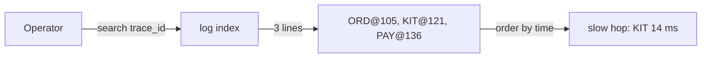

```java
// OPERATOR SIDE — the trace id is printed into every log line, so one search reassembles a request across machines
// PARTIES: OP = operator (reader) · LOGS = log-aggregation index (Elasticsearch 8 @ logs-es-1) · ZIP = Zipkin distributed tracing system (collector + storage + query UI)
// DEF: trace_id — the id printed in every log line of one request; here "4bf92f3577b34da6a3ce90d0e2b88a4d"
// DEF: match — one stored log line that satisfies the search; here 3 lines for one trace_id
// STATE (before):
//    log_index : []   // every stored log line, tagged with its trace id (kept by LOGS)
//    matches   : []   // what a search returns
// DEF: search · CALLED BY: OP debugging one slow request
// -> trace_id : "4bf92f3577b34da6a3ce90d0e2b88a4d"
//    step 1 · each service logs with the id inline   log_index : [] -> ["[4bf92f3577b34da6a3ce90d0e2b88a4d] ORD line", "[4bf92f3577b34da6a3ce90d0e2b88a4d] KIT line", "[4bf92f3577b34da6a3ce90d0e2b88a4d] PAY line"]
//    step 2 · OP queries the index for the id   matches : [] -> [ORD line, KIT line, PAY line]
//    step 3 · OP orders the 3 lines by timestamp   matches : [3 lines] -> [ORD@105, KIT@121, PAY@136]
// <- outcome : matches = 3 lines for one id · slow hop = KIT (135 - 121 = 14 ms)   BECAUSE the id links log lines on 3 different machines
//    alt infra cost : at scale N requests x M spans = N x M records -> needs real storage infrastructure
```

_This is the chapter's search-logs-by-request-id benefit, paired with its infrastructure-cost issue._

_Covers:_ Searching logs by request id

_From the 28 problems:_ 20-metrics-monitoring

## Key Concepts

### The Problem

**Totals hide operations.** External monitoring only reports overall response time and number of invocations, with no insight into individual operations, and log entries for a request are scattered across numerous logs.


### The Solution

Instrument services to assign each external request a unique id, pass it to all involved services, include it in all log messages, and record operation start and end times in a centralized service.


### Key Facts

| Fact | Detail | In the wild |
|---|---|---|
| Assign, pass, include, record | Instrument services to assign each external request a unique id, pass it to all involved services, include it in all log messages, and record operation start and end times in a centralized service. | Spring Cloud Sleuth instruments Spring components and delivers traces to a Zipkin server. |
| Writer → Collector → Aggregator → Reader | The tracing pipeline has four system roles wired in order — the writer (each instrumented service reports its finished span), the transport (RabbitMQ decouples writers from the backend and buffers under load), the collector (the Zipkin collector consumes spans off the queue), and the aggregator (the trace store, MySQL 8) — with the reader (Zipkin query UI) serving the operator a timeline. | The same writer → transport → collector → aggregator → reader shape reappears in log shipping and metrics pipelines, so it is the interview's system-design anchor. |
| Trace storage infrastructure | Aggregating and storing traces can require significant infrastructure. | A Zipkin server plus RabbitMQ delivery is extra operational surface for the visibility gained. |
| Sampling vs overhead | The solution must have minimal runtime overhead, so tracing samples requests — and sampling less trades completeness for less overhead. | Sampling every request gives full traces; sampling a fraction is cheaper but can miss a slow request. |


### Tradeoffs & When

- Aggregating and storing traces can require significant infrastructure.
- The solution must have minimal runtime overhead, so tracing samples requests — and sampling less trades completeness for less overhead.


<details><summary>All concepts (index)</summary>

### Problem: Totals hide operations

**Why.** A request spans multiple services, each performing one or more operations such as database queries or publishing messages.

**Claim.** External monitoring only reports overall response time and number of invocations, with no insight into individual operations, and log entries for a request are scattered across numerous logs.

**Grounding.** These are the reference forces, along with minimal runtime overhead.

**In the wild.** A slow request looks fine in aggregate until its individual operations are traced.
### Solution: Assign, pass, include, record

**Why.** An unlabeled request cannot be reassembled across services.

**Claim.** Instrument services to assign each external request a unique id, pass it to all involved services, include it in all log messages, and record operation start and end times in a centralized service.

**Grounding.** These are the four instrumentation steps from the reference; the instrumentation might be part of a Microservice Chassis.

**In the wild.** Spring Cloud Sleuth instruments Spring components and delivers traces to a Zipkin server.
### Solution: Writer → Collector → Aggregator → Reader

**Why.** A span is useless unless the whole system path is connected: who produces it, how it travels, where it concentrates, and who reads it back.

**Claim.** The tracing pipeline has four system roles wired in order — the writer (each instrumented service reports its finished span), the transport (RabbitMQ decouples writers from the backend and buffers under load), the collector (the Zipkin collector consumes spans off the queue), and the aggregator (the trace store, MySQL 8) — with the reader (Zipkin query UI) serving the operator a timeline.

**Grounding.** This is the system-design wiring behind the reference's "deliver traces to Zipkin via RabbitMQ": Zipkin is a distributed tracing system made of a collector, storage, and a query UI, and RabbitMQ is the async transport in front of it, not part of Zipkin.

**In the wild.** The same writer → transport → collector → aggregator → reader shape reappears in log shipping and metrics pipelines, so it is the interview's system-design anchor.
### Tradeoff: Trace storage infrastructure

**Why.** Every span and trace has to be stored and indexed somewhere.

**Claim.** Aggregating and storing traces can require significant infrastructure.

**Grounding.** The reference lists this as the pattern's issue.

**In the wild.** A Zipkin server plus RabbitMQ delivery is extra operational surface for the visibility gained.
### Tradeoff: Sampling vs overhead

**Why.** Instrumenting every request costs runtime overhead and storage.

**Claim.** The solution must have minimal runtime overhead, so tracing samples requests — and sampling less trades completeness for less overhead.

**Grounding.** The reference force demands minimal overhead, and the example sets SPRING_SLEUTH_SAMPLER_PERCENTAGE: 1 to sample all requests.

**In the wild.** Sampling every request gives full traces; sampling a fraction is cheaper but can miss a slow request.

</details>


## Quiz

1. What does distributed tracing instrumentation do first for each external request?

   - A. Assigns a unique external request id.
   - B. Stores the request body.
   - C. Aggregates the request into a metric.
   - D. Blocks the request for sampling.

<details><summary>Reveal answer</summary>

**A.** The first solution step is to assign each external request a unique external request id. Option C is application metrics, and B and D are not in the reference.

</details>

2. Why is external monitoring insufficient for troubleshooting?

   - A. It only reports overall response time and invocation counts, with no insight into individual operations.
   - B. It costs too much.
   - C. It requires a database.
   - D. It cannot measure latency.

<details><summary>Reveal answer</summary>

**A.** The reference force states external monitoring tells you only overall response time and number of invocations, with no insight into individual operations. Options B, C, and D are not the stated force.

</details>

3. Which benefit does distributed tracing provide?

   - A. It shows how an individual request is handled by searching aggregated logs for its external request id.
   - B. It removes the need for services.
   - C. It guarantees low latency.
   - D. It replaces metrics.

<details><summary>Reveal answer</summary>

**A.** The reference benefit is that developers can see how an individual request is handled by searching across aggregated logs for its external request id. The other options are not stated benefits.

</details>

4. What is an issue of distributed tracing?

   - A. It only works in Java.
   - B. Aggregating and storing traces can require significant infrastructure.
   - C. It cannot use a message broker.
   - D. It makes logs smaller.

<details><summary>Reveal answer</summary>

**B.** The reference issue is that aggregating and storing traces can require significant infrastructure. Option C is false (RabbitMQ delivers traces to Zipkin), and A and D are not in the reference.

</details>

