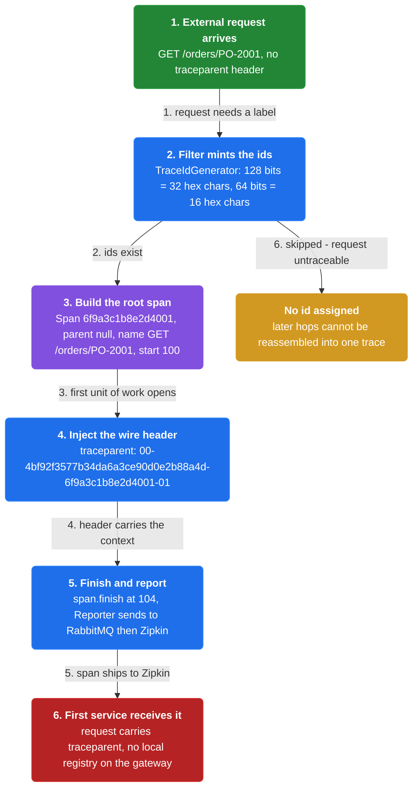
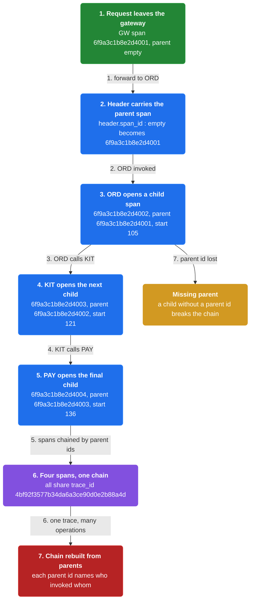
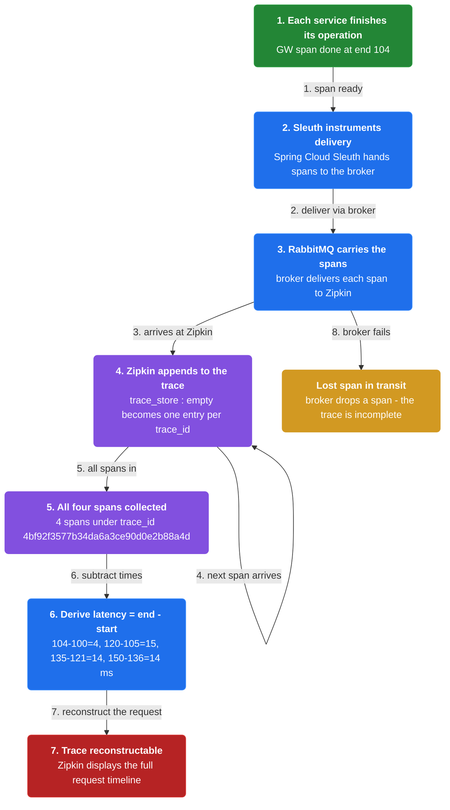
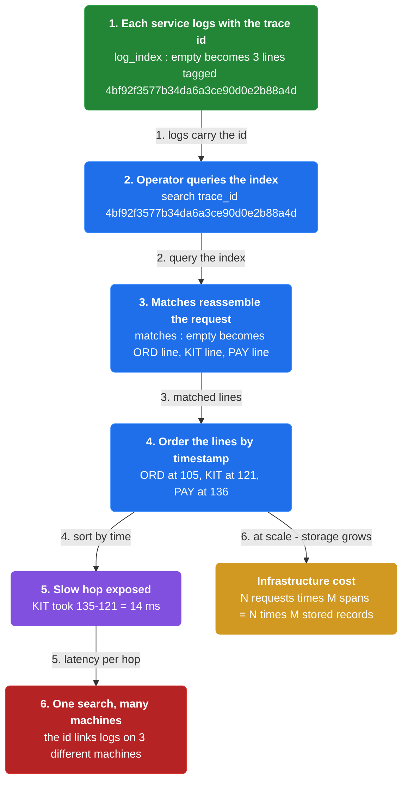
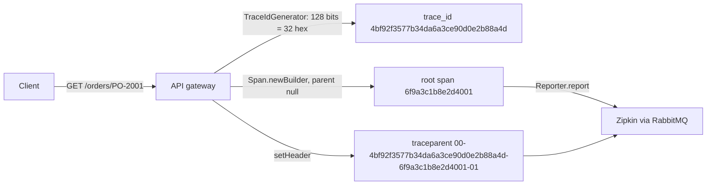
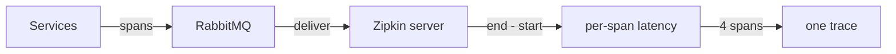
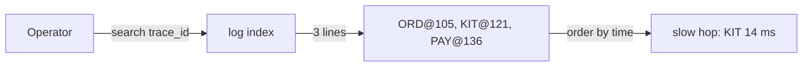

# Chapter 33: Distributed Tracing

> Assign each external request a unique id, pass it through every service, and record per-operation timing in a centralized trace store.

_Also known as: Chris Richardson · Microservice Patterns Ch. 33 (p.370) · microservices.io /patterns/observability/distributed-tracing.html_

## Flow

### Assigning the request id

> **Why this matters:** Requests span multiple services, but external monitoring only reports overall response time and invocation counts — no insight into individual operations. The first fix is to assign each external request a unique id.



1. **Unique external request id** — Instrument services with code that assigns each external request a unique external request id.

2. **Carry it on the request** — The id is attached to the request as it enters the service graph.

3. **Chassis-provided** — This instrumentation might be part of the functionality provided by a Microservice Chassis framework.

```java
// API GATEWAY SIDE — the servlet filter that starts a trace when no upstream span exists (Spring Cloud Sleuth / Brave)
// PARTIES: GW = API gateway (gateway JVM) · SVC = first service JVM · BRK = RabbitMQ broker · ZIP = Zipkin server JVM
// DEF: Span — one unit of work = value object {traceId, spanId, parentId, name, timestamp, duration}; here ("4bf92f3577b34da6a3ce90d0e2b88a4d","6f9a3c1b8e2d4001",null,"GET /orders/PO-2001",100,4)
// DEF: Tracer — the instrumentation object, OWNED BY the GW JVM, CREATED once (1 per process) at startup by Tracer.newBuilder().build()
// DEF: TraceIdGenerator — mints ids from randomness: 128 bits = 16 bytes x 8 bits/byte = 32 hex chars x 4 bits/char (trace_id) · 64 bits = 8 bytes x 8 = 16 hex chars x 4 (span_id); CALLED BY the tracer
// DEF: Reporter — async sender, OWNED BY the GW JVM; ships each finished span (1 here) to ZIP via BRK queue "zipkin"
// STATE (before):
//    tracer : Tracer = Tracer.newBuilder().build()    // one per process, reused by every request
//    spans  : []                                       // List<Span> — the spans this request's thread has started
// DEF: TracingFilter.doFilter · CALLED BY: the servlet container thread on each HTTP request
// -> request  : HttpServletRequest  ("GET /orders/PO-2001", inbound header "traceparent" absent)
// -> response : HttpServletResponse (status 200; will carry the injected "traceparent" header)
//    step 1 · extract inbound context    parent : null  BECAUSE no "traceparent" header -> this request is the ROOT of the trace
//    step 2 · mint the ids    traceId = TraceIdGenerator.nextId() = 16 random bytes -> "4bf92f3577b34da6a3ce90d0e2b88a4d" · spanId = 8 random bytes -> "6f9a3c1b8e2d4001"
//    step 3 · build the root span    span = Span.newBuilder().traceId("4bf92f3577b34da6a3ce90d0e2b88a4d").id("6f9a3c1b8e2d4001").parentId(null).name("GET /orders/PO-2001").timestamp(100).build()
//    step 4 · start it    spans : [] -> [ span ] · span.state : NEW -> STARTED
//    step 5 · inject the wire header    request.setHeader("traceparent", "00-4bf92f3577b34da6a3ce90d0e2b88a4d-6f9a3c1b8e2d4001-01")  // version 00 - traceId - spanId - flags 01(sampled)
//    step 6 · finish + report    span.finish(104) -> duration = 104 - 100 = 4 · Reporter.report(span) -> BRK queue "zipkin" (async, does not block the response)
// <- outcome : SVC receives traceparent "00-4bf92f3577b34da6a3ce90d0e2b88a4d-6f9a3c1b8e2d4001-01" · the finished span is en route to ZIP (GW keeps NO trace registry)
// CALL GRAPH: servlet container -> TracingFilter.doFilter -> TraceIdGenerator.nextId -> Span.newBuilder -> Reporter.report
// OWNED BY: Tracer/Reporter = GW JVM · the finished span = ZIP (via BRK) · the queue = BRK
//    alt Sleuth B3 header : "X-B3-TraceId: 4bf92f3577b34da6a3ce90d0e2b88a4d" + "X-B3-SpanId: 6f9a3c1b8e2d4001" (same ids, different header names)
```

### Propagating through services

> **Why this matters:** The id is useless unless every service that handles the request receives it. Each hop opens a child span naming its parent, so one request becomes a chain of spans.



1. **Pass the id** — Pass the external request id to all services involved in handling the request.

2. **Child spans** — Each service opens a span whose parent is the span of the previous hop.

3. **One trace, many operations** — Each service performs one or more operations — database queries, message publishes — captured as spans.

```java
// SERVICE SIDE — each hop's filter extracts the inbound trace context, opens a child span, and injects the outbound header (Spring Cloud Sleuth / Brave)
// PARTIES: GW = API gateway JVM · ORD = Order Service JVM · KIT = Kitchen Service JVM · PAY = Payment Service JVM
// DEF: Span — one unit of work = value object {traceId, spanId, parentId, name, timestamp, duration}; here ("4bf92f3577b34da6a3ce90d0e2b88a4d","6f9a3c1b8e2d4002","6f9a3c1b8e2d4001","GET /orders/PO-2001",105,15)
// DEF: TraceContext — what a hop extracts from "traceparent" {traceId, spanId, sampled}; here ("4bf92f3577b34da6a3ce90d0e2b88a4d","6f9a3c1b8e2d4001","01")
// DEF: header — the in-memory carrier {trace_id, span_id} read from / written to the wire "traceparent"; here { trace_id:"4bf92f3577b34da6a3ce90d0e2b88a4d", span_id:"6f9a3c1b8e2d4001" }
// DEF: Propagation — the wire codec: extracts "traceparent" on entry, injects "00-<traceId>-<spanId>-<flags>" on exit
// STATE (before):
//    spans  : []                                        // List<Span> — spans THIS service's thread has opened
//    header : { trace_id: "4bf92f3577b34da6a3ce90d0e2b88a4d", span_id: "6f9a3c1b8e2d4001" }  // what the inbound request carried
// DEF: TracingFilter.doFilter · CALLED BY: the servlet container thread of ORD, then KIT, then PAY
// -> request  : HttpServletRequest  ("GET /orders/PO-2001", inbound header "traceparent: 00-4bf92f3577b34da6a3ce90d0e2b88a4d-6f9a3c1b8e2d4001-01")
// -> response : HttpServletResponse (status 200; outbound "traceparent" will hold the CHILD span id)
//    step 1 · extract inbound context    parent : null -> TraceContext{ traceId="4bf92f3577b34da6a3ce90d0e2b88a4d", spanId="6f9a3c1b8e2d4001" }
//    step 2 · mint the child id    childId = TraceIdGenerator.nextId() = 8 random bytes -> "6f9a3c1b8e2d4002"  (trace_id stays the SAME across all hops)
//    step 3 · build the child span    span = Span.newBuilder().traceId("4bf92f3577b34da6a3ce90d0e2b88a4d").id("6f9a3c1b8e2d4002").parentId("6f9a3c1b8e2d4001").name("GET /orders/PO-2001").timestamp(105).build()
//    step 4 · open + close the hop    span.start() · span.finish(120) -> duration = 120 - 105 = 15 · spans : [] -> [ span ]
//    step 5 · inject the child into the outbound header    request.setHeader("traceparent", "00-4bf92f3577b34da6a3ce90d0e2b88a4d-6f9a3c1b8e2d4002-01")
//    step 6 · report    Reporter.report(span) -> BRK queue "zipkin"
// <- outcome : each hop forwards "traceparent: 00-4bf92f3577b34da6a3ce90d0e2b88a4d-<new child span>-01"; the chain is 6f9a...001 -> ...002 -> ...003 -> ...004
// CALL GRAPH: servlet container -> TracingFilter.doFilter -> Propagation.extract -> TraceIdGenerator.nextId -> Span.newBuilder -> Reporter.report
// OWNED BY: Tracer/Reporter = each service JVM · finished spans = ZIP (via BRK) · the queue = BRK
//    alt 3 hops : ORD builds child "...002" (parent "...001", 105..120) · KIT builds "...003" (parent "...002", 121..135) · PAY builds "...004" (parent "...003", 136..150)
```

### Collecting spans in the trace store

> **Why this matters:** Spans must be recorded in a centralized service so the whole request can be reconstructed. The reference example delivers traces to a Zipkin server via RabbitMQ, where Zipkin gathers and displays them.



1. **Record in a central service** — Record information about requests and operations — for example start time and end time — in a centralized service.

2. **Sleuth and Zipkin** — Spring Cloud Sleuth instruments components and delivers trace information to a Zipkin server.

3. **Deliver via RabbitMQ** — RabbitMQ is used to deliver traces to Zipkin; the Zipkin server is a Spring Boot app with @EnableZipkinStreamServer.

4. **Latency from times** — Start and end times per span let Zipkin derive per-operation latency.

```java
// TRACE STORE SIDE — finished spans arrive at Zipkin via RabbitMQ and are stored per trace; latency = end - start
// PARTIES: GW = gateway JVM · ORD = Order Service JVM · BRK = RabbitMQ broker · ZIP = Zipkin server JVM (owns the trace store = MySQL 8 @ zipkin-db-1)
// DEF: trace — the set of all spans sharing one trace_id; here trace "4bf92f3577b34da6a3ce90d0e2b88a4d" = 4 spans
// DEF: Span — one unit of work = value object {traceId, spanId, parentId, name, timestamp, duration}; here ("4bf92f3577b34da6a3ce90d0e2b88a4d","6f9a3c1b8e2d4001",null,"GET /orders/PO-2001",100,4)
// DEF: latency — how long one span took = end - start; here 104 - 100 = 4
// DEF: SpanConsumer — a listener on BRK queue "zipkin", OWNED BY the ZIP JVM; deserializes each span and writes it into trace_store
// STATE (before):
//    trace_store : {}   // Map<traceId, List<Span>> — OWNED BY ZIP, keyed by trace id
// DEF: consume · CALLED BY: BRK delivering a span to SpanConsumer
// -> span1 : Span("4bf92f3577b34da6a3ce90d0e2b88a4d", "6f9a3c1b8e2d4001", null, "GET /orders/PO-2001", 100, 104)
//    step 1 · store the root span    trace_store : {} -> {"4bf92f3577b34da6a3ce90d0e2b88a4d" : [ Span("6f9a3c1b8e2d4001", null, 100, 104) ]}
//    step 2 · store the 2nd hop      trace_store : {"4bf92f3577b34da6a3ce90d0e2b88a4d" : 1 span} -> {"4bf92f3577b34da6a3ce90d0e2b88a4d" : [ Span("6f9a3c1b8e2d4001", null, 100, 104), Span("6f9a3c1b8e2d4002", "6f9a3c1b8e2d4001", 105, 120) ]}
//    step 3 · store the 3rd hop      trace_store : {"4bf92f3577b34da6a3ce90d0e2b88a4d" : 2 spans} -> {"4bf92f3577b34da6a3ce90d0e2b88a4d" : [ 2 spans, Span("6f9a3c1b8e2d4003", "6f9a3c1b8e2d4002", 121, 135) ]}
//    step 4 · store the 4th hop      trace_store : {"4bf92f3577b34da6a3ce90d0e2b88a4d" : 3 spans} -> {"4bf92f3577b34da6a3ce90d0e2b88a4d" : [ 3 spans, Span("6f9a3c1b8e2d4004", "6f9a3c1b8e2d4003", 136, 150) ]}
// <- outcome : trace_store holds 4 spans for trace "4bf92f3577b34da6a3ce90d0e2b88a4d" · ZIP derives latency = end - start: 104-100=4, 120-105=15, 135-121=14, 150-136=14
// CALL GRAPH: BRK -> SpanConsumer.consume -> trace_store.put(traceId, span) -> ZIP UI reads trace_store
// OWNED BY: trace_store = ZIP JVM (MySQL 8 @ zipkin-db-1) · spans = produced by services, consumed by ZIP · the queue = BRK
```

### Searching logs by request id

> **Why this matters:** Because the request id is included in every log message, a developer can search aggregated logs for it and see how one request was handled — but aggregating and storing traces can require significant infrastructure.



1. **Include id in logs** — Include the external request id in all log messages, per the instrumentation.

2. **Search aggregated logs** — The benefit is searching across aggregated logs for the external request id to see how an individual request was handled.

3. **Find the slow hop** — Ordering the matched lines by time exposes the sources of latency.

4. **Infrastructure cost** — The issue is that aggregating and storing traces can require significant infrastructure.

```java
// OPERATOR SIDE — the trace id is written into every log line, so one search reassembles a request across machines
// PARTIES: OP = operator · LOGS = log-aggregation index (Elasticsearch 8 @ logs-es-1) · ZIP = Zipkin server JVM
// DEF: trace_id — the id printed in every log line of one request; here "4bf92f3577b34da6a3ce90d0e2b88a4d"
// DEF: match — one stored log line that satisfies the search; here 3 lines for one trace_id
// DEF: LogAppender — the logging code that formats each line as "<timestamp> [trace_id] <message>"; OWNED BY each service JVM
// STATE (before):
//    log_index : []   // the aggregated index of every log line, each tagged with its trace id (OWNED BY LOGS)
//    matches   : []   // List<String> — what a query returns
// DEF: search · CALLED BY: OP debugging one slow request
// -> trace_id : "4bf92f3577b34da6a3ce90d0e2b88a4d"
//    step 1 · each service logs with the id inline    LogAppender.format("order fetched", trace_id) -> "2026-09-20T10:00:01Z [4bf92f3577b34da6a3ce90d0e2b88a4d] order fetched"
//    step 2 · LOGS indexes the 3 lines    log_index : [] -> [ "[4bf92f3577b34da6a3ce90d0e2b88a4d] ORD line", "[4bf92f3577b34da6a3ce90d0e2b88a4d] KIT line", "[4bf92f3577b34da6a3ce90d0e2b88a4d] PAY line" ]
//    step 3 · OP queries for the id    matches : [] -> [ ORD line @105, KIT line @121, PAY line @136 ]
//    step 4 · OP orders by timestamp    matches : [3 lines] -> [ ORD@105, KIT@121, PAY@136 ]
// <- outcome : matches = 3 lines for one id · slow hop = KIT (135 - 121 = 14 ms)   BECAUSE the id links log lines on 3 different machines
// CALL GRAPH: service LogAppender.format -> LOGS index -> OP search -> order by timestamp
// OWNED BY: log_index = LOGS (Elasticsearch 8 @ logs-es-1) · LogAppender = each service JVM
//    alt infra cost : at scale N requests x M spans = N x M records -> needs real storage infrastructure
```


## Interview Questions

### Q1

External monitoring reports only overall response time and invocation counts, so a slow request looks fine in aggregate. The team instruments the gateway to label each external request before it enters the services.

**Interviewer's question:** What is the first thing distributed tracing instrumentation does for each external request, and what is the id's relationship to the first span?

**Solution:** It assigns each external request a unique external request id, attaches it to the request, and opens the root span — the first span of the trace, with no parent.

**System-design components:**
- API gateway
- trace_id
- root span
- trace registry



```java
// API GATEWAY SIDE — the servlet filter that starts a trace when no upstream span exists (Spring Cloud Sleuth / Brave)
// PARTIES: GW = API gateway (gateway JVM) · SVC = first service JVM · BRK = RabbitMQ broker · ZIP = Zipkin server JVM
// DEF: Span — one unit of work = value object {traceId, spanId, parentId, name, timestamp, duration}; here ("4bf92f3577b34da6a3ce90d0e2b88a4d","6f9a3c1b8e2d4001",null,"GET /orders/PO-2001",100,4)
// DEF: Tracer — the instrumentation object, OWNED BY the GW JVM, CREATED once (1 per process) at startup by Tracer.newBuilder().build()
// DEF: TraceIdGenerator — mints ids from randomness: 128 bits = 16 bytes x 8 bits/byte = 32 hex chars x 4 bits/char (trace_id) · 64 bits = 8 bytes x 8 = 16 hex chars x 4 (span_id); CALLED BY the tracer
// DEF: Reporter — async sender, OWNED BY the GW JVM; ships each finished span (1 here) to ZIP via BRK queue "zipkin"
// STATE (before):
//    tracer : Tracer = Tracer.newBuilder().build()    // one per process, reused by every request
//    spans  : []                                       // List<Span> — the spans this request's thread has started
// DEF: TracingFilter.doFilter · CALLED BY: the servlet container thread on each HTTP request
// -> request  : HttpServletRequest  ("GET /orders/PO-2001", inbound header "traceparent" absent)
// -> response : HttpServletResponse (status 200; will carry the injected "traceparent" header)
//    step 1 · extract inbound context    parent : null  BECAUSE no "traceparent" header -> this request is the ROOT of the trace
//    step 2 · mint the ids    traceId = TraceIdGenerator.nextId() = 16 random bytes -> "4bf92f3577b34da6a3ce90d0e2b88a4d" · spanId = 8 random bytes -> "6f9a3c1b8e2d4001"
//    step 3 · build the root span    span = Span.newBuilder().traceId("4bf92f3577b34da6a3ce90d0e2b88a4d").id("6f9a3c1b8e2d4001").parentId(null).name("GET /orders/PO-2001").timestamp(100).build()
//    step 4 · start it    spans : [] -> [ span ] · span.state : NEW -> STARTED
//    step 5 · inject the wire header    request.setHeader("traceparent", "00-4bf92f3577b34da6a3ce90d0e2b88a4d-6f9a3c1b8e2d4001-01")  // version 00 - traceId - spanId - flags 01(sampled)
//    step 6 · finish + report    span.finish(104) -> duration = 104 - 100 = 4 · Reporter.report(span) -> BRK queue "zipkin" (async, does not block the response)
// <- outcome : SVC receives traceparent "00-4bf92f3577b34da6a3ce90d0e2b88a4d-6f9a3c1b8e2d4001-01" · the finished span is en route to ZIP (GW keeps NO trace registry)
// CALL GRAPH: servlet container -> TracingFilter.doFilter -> TraceIdGenerator.nextId -> Span.newBuilder -> Reporter.report
// OWNED BY: Tracer/Reporter = GW JVM · the finished span = ZIP (via BRK) · the queue = BRK
//    alt Sleuth B3 header : "X-B3-TraceId: 4bf92f3577b34da6a3ce90d0e2b88a4d" + "X-B3-SpanId: 6f9a3c1b8e2d4001" (same ids, different header names)
```

_This is the chapter's assign-the-request-id step: a unique id plus the root span begin the trace._

_Covers:_ Assigning the request id

_From the 28 problems:_ 20-metrics-monitoring

### Q2

One request travels GW to Order Service to Kitchen Service to Payment Service. Each hop must keep the trace intact so the whole journey can be reconstructed.

**Interviewer's question:** How does the request id propagate through services, and how do the spans relate to one another?

**Solution:** Each service passes the id onward, and each hop opens a child span whose parent is the previous hop's span, chaining one request into a sequence of spans.

**System-design components:**
- API gateway
- Order Service
- Kitchen Service
- Payment Service


```java
// SERVICE SIDE — each hop's filter extracts the inbound trace context, opens a child span, and injects the outbound header (Spring Cloud Sleuth / Brave)
// PARTIES: GW = API gateway JVM · ORD = Order Service JVM · KIT = Kitchen Service JVM · PAY = Payment Service JVM
// DEF: Span — one unit of work = value object {traceId, spanId, parentId, name, timestamp, duration}; here ("4bf92f3577b34da6a3ce90d0e2b88a4d","6f9a3c1b8e2d4002","6f9a3c1b8e2d4001","GET /orders/PO-2001",105,15)
// DEF: TraceContext — what a hop extracts from "traceparent" {traceId, spanId, sampled}; here ("4bf92f3577b34da6a3ce90d0e2b88a4d","6f9a3c1b8e2d4001","01")
// DEF: header — the in-memory carrier {trace_id, span_id} read from / written to the wire "traceparent"; here { trace_id:"4bf92f3577b34da6a3ce90d0e2b88a4d", span_id:"6f9a3c1b8e2d4001" }
// DEF: Propagation — the wire codec: extracts "traceparent" on entry, injects "00-<traceId>-<spanId>-<flags>" on exit
// STATE (before):
//    spans  : []                                        // List<Span> — spans THIS service's thread has opened
//    header : { trace_id: "4bf92f3577b34da6a3ce90d0e2b88a4d", span_id: "6f9a3c1b8e2d4001" }  // what the inbound request carried
// DEF: TracingFilter.doFilter · CALLED BY: the servlet container thread of ORD, then KIT, then PAY
// -> request  : HttpServletRequest  ("GET /orders/PO-2001", inbound header "traceparent: 00-4bf92f3577b34da6a3ce90d0e2b88a4d-6f9a3c1b8e2d4001-01")
// -> response : HttpServletResponse (status 200; outbound "traceparent" will hold the CHILD span id)
//    step 1 · extract inbound context    parent : null -> TraceContext{ traceId="4bf92f3577b34da6a3ce90d0e2b88a4d", spanId="6f9a3c1b8e2d4001" }
//    step 2 · mint the child id    childId = TraceIdGenerator.nextId() = 8 random bytes -> "6f9a3c1b8e2d4002"  (trace_id stays the SAME across all hops)
//    step 3 · build the child span    span = Span.newBuilder().traceId("4bf92f3577b34da6a3ce90d0e2b88a4d").id("6f9a3c1b8e2d4002").parentId("6f9a3c1b8e2d4001").name("GET /orders/PO-2001").timestamp(105).build()
//    step 4 · open + close the hop    span.start() · span.finish(120) -> duration = 120 - 105 = 15 · spans : [] -> [ span ]
//    step 5 · inject the child into the outbound header    request.setHeader("traceparent", "00-4bf92f3577b34da6a3ce90d0e2b88a4d-6f9a3c1b8e2d4002-01")
//    step 6 · report    Reporter.report(span) -> BRK queue "zipkin"
// <- outcome : each hop forwards "traceparent: 00-4bf92f3577b34da6a3ce90d0e2b88a4d-<new child span>-01"; the chain is 6f9a...001 -> ...002 -> ...003 -> ...004
// CALL GRAPH: servlet container -> TracingFilter.doFilter -> Propagation.extract -> TraceIdGenerator.nextId -> Span.newBuilder -> Reporter.report
// OWNED BY: Tracer/Reporter = each service JVM · finished spans = ZIP (via BRK) · the queue = BRK
//    alt 3 hops : ORD builds child "...002" (parent "...001", 105..120) · KIT builds "...003" (parent "...002", 121..135) · PAY builds "...004" (parent "...003", 136..150)
```

_This is the chapter's propagate-through-services step: each hop opens a child span of the previous one, forming the trace chain._

_Covers:_ Propagating through services

_From the 28 problems:_ 20-metrics-monitoring

### Q3

The four spans from GW, Order, Kitchen, and Payment must land in one place where the whole request can be reconstructed with per-operation timing.

**Interviewer's question:** How are spans recorded centrally, and how is per-operation latency derived?

**Solution:** Spans are recorded in a centralized trace store — Spring Cloud Sleuth delivers them to a Zipkin server, via RabbitMQ — and Zipkin derives each operation's latency as end minus start.

**System-design components:**
- Gateway/Order/Kitchen/Payment spans
- RabbitMQ broker
- Zipkin server
- latency derivation



```java
// TRACE STORE SIDE — finished spans arrive at Zipkin via RabbitMQ and are stored per trace; latency = end - start
// PARTIES: GW = gateway JVM · ORD = Order Service JVM · BRK = RabbitMQ broker · ZIP = Zipkin server JVM (owns the trace store = MySQL 8 @ zipkin-db-1)
// DEF: trace — the set of all spans sharing one trace_id; here trace "4bf92f3577b34da6a3ce90d0e2b88a4d" = 4 spans
// DEF: Span — one unit of work = value object {traceId, spanId, parentId, name, timestamp, duration}; here ("4bf92f3577b34da6a3ce90d0e2b88a4d","6f9a3c1b8e2d4001",null,"GET /orders/PO-2001",100,4)
// DEF: latency — how long one span took = end - start; here 104 - 100 = 4
// DEF: SpanConsumer — a listener on BRK queue "zipkin", OWNED BY the ZIP JVM; deserializes each span and writes it into trace_store
// STATE (before):
//    trace_store : {}   // Map<traceId, List<Span>> — OWNED BY ZIP, keyed by trace id
// DEF: consume · CALLED BY: BRK delivering a span to SpanConsumer
// -> span1 : Span("4bf92f3577b34da6a3ce90d0e2b88a4d", "6f9a3c1b8e2d4001", null, "GET /orders/PO-2001", 100, 104)
//    step 1 · store the root span    trace_store : {} -> {"4bf92f3577b34da6a3ce90d0e2b88a4d" : [ Span("6f9a3c1b8e2d4001", null, 100, 104) ]}
//    step 2 · store the 2nd hop      trace_store : {"4bf92f3577b34da6a3ce90d0e2b88a4d" : 1 span} -> {"4bf92f3577b34da6a3ce90d0e2b88a4d" : [ Span("6f9a3c1b8e2d4001", null, 100, 104), Span("6f9a3c1b8e2d4002", "6f9a3c1b8e2d4001", 105, 120) ]}
//    step 3 · store the 3rd hop      trace_store : {"4bf92f3577b34da6a3ce90d0e2b88a4d" : 2 spans} -> {"4bf92f3577b34da6a3ce90d0e2b88a4d" : [ 2 spans, Span("6f9a3c1b8e2d4003", "6f9a3c1b8e2d4002", 121, 135) ]}
//    step 4 · store the 4th hop      trace_store : {"4bf92f3577b34da6a3ce90d0e2b88a4d" : 3 spans} -> {"4bf92f3577b34da6a3ce90d0e2b88a4d" : [ 3 spans, Span("6f9a3c1b8e2d4004", "6f9a3c1b8e2d4003", 136, 150) ]}
// <- outcome : trace_store holds 4 spans for trace "4bf92f3577b34da6a3ce90d0e2b88a4d" · ZIP derives latency = end - start: 104-100=4, 120-105=15, 135-121=14, 150-136=14
// CALL GRAPH: BRK -> SpanConsumer.consume -> trace_store.put(traceId, span) -> ZIP UI reads trace_store
// OWNED BY: trace_store = ZIP JVM (MySQL 8 @ zipkin-db-1) · spans = produced by services, consumed by ZIP · the queue = BRK
```

_This is the chapter's collect-spans-in-the-trace-store step: Zipkin gathers spans via RabbitMQ and derives per-operation latency._

_Covers:_ Collecting spans in the trace store

_From the 28 problems:_ 20-metrics-monitoring

### Q4

An operator debugging one slow order needs to see every log line for it across three machines, ordered by time, to find the slow hop.

**Interviewer's question:** What benefit does distributed tracing provide for debugging, and how does the request id enable it?

**Solution:** Because the request id is included in every log message, a developer can search aggregated logs for the id to see how one request was handled — ordering the matched lines by time exposes the sources of latency.

**System-design components:**
- operator
- log-aggregation index
- trace_id
- ordered matches



```java
// OPERATOR SIDE — the trace id is written into every log line, so one search reassembles a request across machines
// PARTIES: OP = operator · LOGS = log-aggregation index (Elasticsearch 8 @ logs-es-1) · ZIP = Zipkin server JVM
// DEF: trace_id — the id printed in every log line of one request; here "4bf92f3577b34da6a3ce90d0e2b88a4d"
// DEF: match — one stored log line that satisfies the search; here 3 lines for one trace_id
// DEF: LogAppender — the logging code that formats each line as "<timestamp> [trace_id] <message>"; OWNED BY each service JVM
// STATE (before):
//    log_index : []   // the aggregated index of every log line, each tagged with its trace id (OWNED BY LOGS)
//    matches   : []   // List<String> — what a query returns
// DEF: search · CALLED BY: OP debugging one slow request
// -> trace_id : "4bf92f3577b34da6a3ce90d0e2b88a4d"
//    step 1 · each service logs with the id inline    LogAppender.format("order fetched", trace_id) -> "2026-09-20T10:00:01Z [4bf92f3577b34da6a3ce90d0e2b88a4d] order fetched"
//    step 2 · LOGS indexes the 3 lines    log_index : [] -> [ "[4bf92f3577b34da6a3ce90d0e2b88a4d] ORD line", "[4bf92f3577b34da6a3ce90d0e2b88a4d] KIT line", "[4bf92f3577b34da6a3ce90d0e2b88a4d] PAY line" ]
//    step 3 · OP queries for the id    matches : [] -> [ ORD line @105, KIT line @121, PAY line @136 ]
//    step 4 · OP orders by timestamp    matches : [3 lines] -> [ ORD@105, KIT@121, PAY@136 ]
// <- outcome : matches = 3 lines for one id · slow hop = KIT (135 - 121 = 14 ms)   BECAUSE the id links log lines on 3 different machines
// CALL GRAPH: service LogAppender.format -> LOGS index -> OP search -> order by timestamp
// OWNED BY: log_index = LOGS (Elasticsearch 8 @ logs-es-1) · LogAppender = each service JVM
//    alt infra cost : at scale N requests x M spans = N x M records -> needs real storage infrastructure
```

_This is the chapter's search-logs-by-request-id benefit, paired with its infrastructure-cost issue._

_Covers:_ Searching logs by request id

_From the 28 problems:_ 20-metrics-monitoring

## Key Concepts

### The Problem

**Totals hide operations.** External monitoring only reports overall response time and number of invocations, with no insight into individual operations, and log entries for a request are scattered across numerous logs.


### The Solution

Instrument services to assign each external request a unique id, pass it to all involved services, include it in all log messages, and record operation start and end times in a centralized service.


### Key Facts

| Fact | Detail | In the wild |
|---|---|---|
| Assign, pass, include, record | Instrument services to assign each external request a unique id, pass it to all involved services, include it in all log messages, and record operation start and end times in a centralized service. | Spring Cloud Sleuth instruments Spring components and delivers traces to a Zipkin server. |
| Trace storage infrastructure | Aggregating and storing traces can require significant infrastructure. | A Zipkin server plus RabbitMQ delivery is extra operational surface for the visibility gained. |
| Sampling vs overhead | The solution must have minimal runtime overhead, so tracing samples requests — and sampling less trades completeness for less overhead. | Sampling every request gives full traces; sampling a fraction is cheaper but can miss a slow request. |


### Tradeoffs & When

- Aggregating and storing traces can require significant infrastructure.
- The solution must have minimal runtime overhead, so tracing samples requests — and sampling less trades completeness for less overhead.


<details><summary>All concepts (index)</summary>

### Problem: Totals hide operations

**Why.** A request spans multiple services, each performing one or more operations such as database queries or publishing messages.

**Claim.** External monitoring only reports overall response time and number of invocations, with no insight into individual operations, and log entries for a request are scattered across numerous logs.

**Grounding.** These are the reference forces, along with minimal runtime overhead.

**In the wild.** A slow request looks fine in aggregate until its individual operations are traced.
### Solution: Assign, pass, include, record

**Why.** An unlabeled request cannot be reassembled across services.

**Claim.** Instrument services to assign each external request a unique id, pass it to all involved services, include it in all log messages, and record operation start and end times in a centralized service.

**Grounding.** These are the four instrumentation steps from the reference; the instrumentation might be part of a Microservice Chassis.

**In the wild.** Spring Cloud Sleuth instruments Spring components and delivers traces to a Zipkin server.
### Tradeoff: Trace storage infrastructure

**Why.** Every span and trace has to be stored and indexed somewhere.

**Claim.** Aggregating and storing traces can require significant infrastructure.

**Grounding.** The reference lists this as the pattern's issue.

**In the wild.** A Zipkin server plus RabbitMQ delivery is extra operational surface for the visibility gained.
### Tradeoff: Sampling vs overhead

**Why.** Instrumenting every request costs runtime overhead and storage.

**Claim.** The solution must have minimal runtime overhead, so tracing samples requests — and sampling less trades completeness for less overhead.

**Grounding.** The reference force demands minimal overhead, and the example sets SPRING_SLEUTH_SAMPLER_PERCENTAGE: 1 to sample all requests.

**In the wild.** Sampling every request gives full traces; sampling a fraction is cheaper but can miss a slow request.

</details>


## Quiz

1. What does distributed tracing instrumentation do first for each external request?

   - A. Assigns a unique external request id.
   - B. Stores the request body.
   - C. Aggregates the request into a metric.
   - D. Blocks the request for sampling.

<details><summary>Reveal answer</summary>

**A.** The first solution step is to assign each external request a unique external request id. Option C is application metrics, and B and D are not in the reference.

</details>

2. Why is external monitoring insufficient for troubleshooting?

   - A. It only reports overall response time and invocation counts, with no insight into individual operations.
   - B. It costs too much.
   - C. It requires a database.
   - D. It cannot measure latency.

<details><summary>Reveal answer</summary>

**A.** The reference force states external monitoring tells you only overall response time and number of invocations, with no insight into individual operations. Options B, C, and D are not the stated force.

</details>

3. Which benefit does distributed tracing provide?

   - A. It shows how an individual request is handled by searching aggregated logs for its external request id.
   - B. It removes the need for services.
   - C. It guarantees low latency.
   - D. It replaces metrics.

<details><summary>Reveal answer</summary>

**A.** The reference benefit is that developers can see how an individual request is handled by searching across aggregated logs for its external request id. The other options are not stated benefits.

</details>

4. What is an issue of distributed tracing?

   - A. It only works in Java.
   - B. Aggregating and storing traces can require significant infrastructure.
   - C. It cannot use a message broker.
   - D. It makes logs smaller.

<details><summary>Reveal answer</summary>

**B.** The reference issue is that aggregating and storing traces can require significant infrastructure. Option C is false (RabbitMQ delivers traces to Zipkin), and A and D are not in the reference.

</details>

