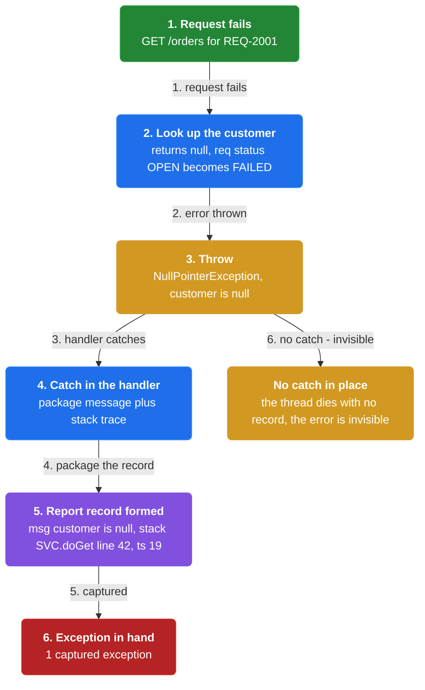
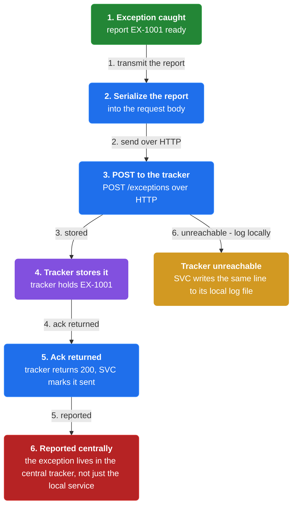
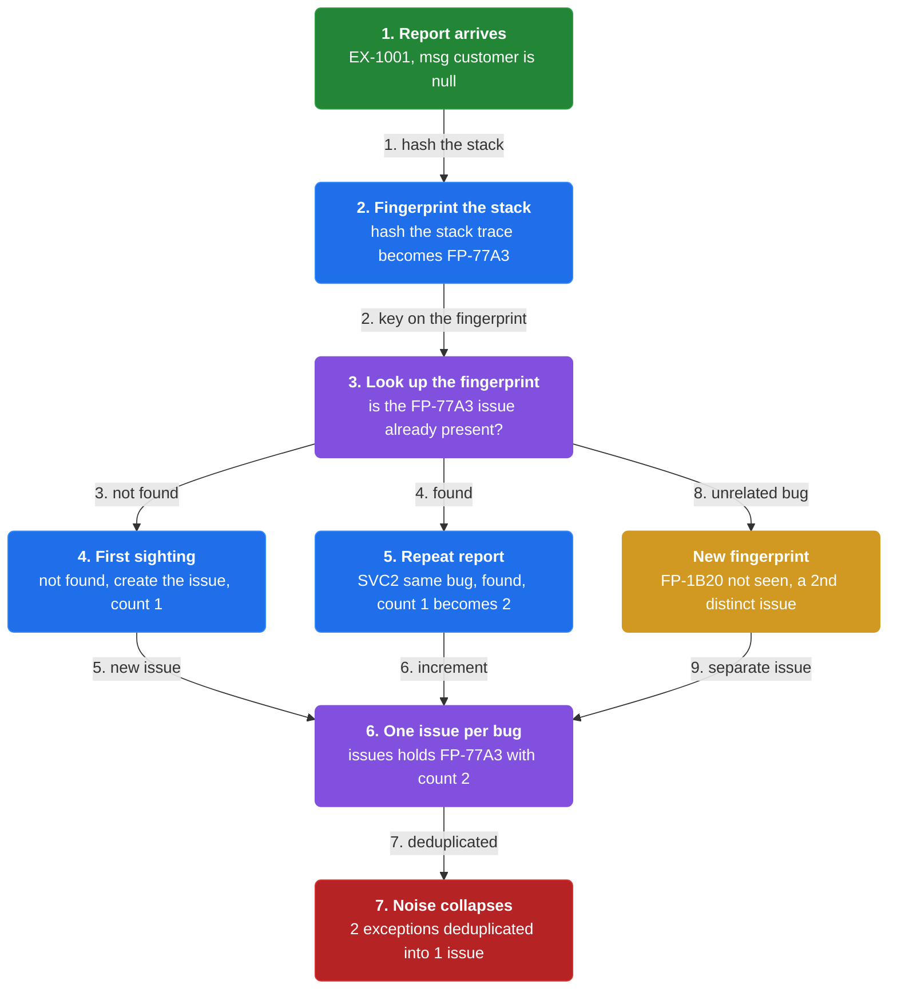
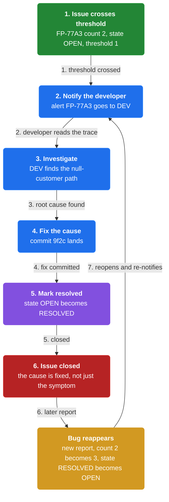

# Chapter 34: Exception Tracking

> Report all exceptions to a centralized service that aggregates, de-duplicates, and tracks them and notifies developers.

_Also known as: Chris Richardson · Microservice Patterns Ch. 34 · microservices.io /patterns/observability/exception-tracking.html_

## Flow

### Capture the exception

> **Why this matters:** A service throws an exception the moment a request fails; unless something captures the error message and the stack trace right there, the failure is invisible across a fleet of machines. Capturing at the source is what makes every later step possible.



1. **Throw on failure** — A service instance handling a request throws an exception when an error occurs.

2. **Carry message and stack trace** — The exception object holds an error message and a stack trace; both are the raw material for debugging.

3. **Catch in the handler** — The handler catches the exception and packages the message plus the stack trace into a reportable record.

```java
// ORDER SERVICE SIDE — one request throws; the handler captures the message and stack trace
// PARTIES: SVC = Order Service instance · U1 = the user making the request
// STATE (before):
//    req : { id:"REQ-2001", path:"/orders", status:"OPEN" }
//    report : {}                       // the captured exception, empty until the throw
// DEF: handle_request · CALLED BY: U1 submitting GET /orders with id REQ-2001
// -> req_id : "REQ-2001"
//    step 1 · look up the customer -> null   // req : {status:"OPEN"} -> {status:"FAILED"}
//    step 2 · throw NullPointerException("customer is null")   // err : null -> "customer is null"
//    step 3 · catch in the handler, capture message + stack trace   // report : {} -> {msg:"customer is null", stack:"SVC.doGet line 42", ts:19}
// <- exception : report = {msg:"customer is null", stack:"SVC.doGet line 42", ts:19} · 1 exception now in hand
//    alt no catch in place : the thread dies with no record -> the error is invisible to everyone
```

### Report to a centralized tracker

> **Why this matters:** One instance's log is not a place developers watch; a centralized exception tracking service is. Reporting every exception to that service is the whole point of the pattern.



1. **Point at the tracking service** — The service sends each caught exception to the centralized exception tracking service.

2. **Send message and stack trace** — The report carries the error message and the stack trace so the tracker can group and display them.

3. **Get an acknowledgement** — The service receives an acknowledgement once the tracker has stored the exception.

4. **Also log it** — Exceptions should be logged as well as reported to the tracking service, pairing this pattern with Log aggregation.

```java
// ORDER SERVICE SIDE — the captured exception is reported to the centralized tracker
// PARTIES: SVC = Order Service instance · TRK = centralized exception tracking service
// STATE (before):
//    report : { id:"EX-1001", msg:"customer is null", stack:"SVC.doGet line 42", ts:19 }
//    sent : false                      // the report has not been transmitted yet
// DEF: report_exception · CALLED BY: the handler, right after it catches, over HTTP
// -> ex_id : "EX-1001"
//    step 1 · serialize the report into the request body   // payload : {} -> {id:"EX-1001", msg:"customer is null", stack:"SVC.doGet line 42"}
//    step 2 · POST /exceptions to TRK -> TRK stores the exception   // tracker : [] -> ["EX-1001"]
//    step 3 · TRK returns 200, SVC marks it sent   // sent : false -> true
// <- ack : "EX-1001 stored" · the exception now lives in the central tracker, not just the local service
//    alt TRK unreachable : SVC still writes the same line to its local log file -> Log aggregation (ch36) keeps a copy
```

### De-duplicate and aggregate

> **Why this matters:** The same bug can throw thousands of times across many instances. If each throw becomes a separate row, the noise buries the signal; de-duplication collapses repeats into one tracked issue.



1. **Fingerprint by stack trace** — The tracker keys each exception on a fingerprint of its stack trace.

2. **Create the issue on first sight** — The first report with a new fingerprint creates a new tracked issue.

3. **Increment on repeat** — Later reports with the same fingerprint are folded into the existing issue instead of creating a new one.

4. **Track resolution state** — The issue records its state so developers can track it from open to resolved.

```java
// TRACKER SIDE — two instances of the same bug collapse into a single tracked issue
// PARTIES: SVC1 = Order Service instance 1 · SVC2 = Order Service instance 2 · TRK = exception tracking service
// STATE (before):
//    issues : {}                     // fingerprint -> issue map, the tracker's store, empty
// DEF: ingest · CALLED BY: TRK for each reported exception, keyed on the stack-trace hash
// -> ex1 : { id:"EX-1001", msg:"customer is null", fp:"FP-77A3" }
//    step 1 · hash the stack trace into a fingerprint   // fp : null -> "FP-77A3"
//    step 2 · look up issues["FP-77A3"] -> not found, so create the issue   // issues : {} -> {"FP-77A3":{count:1}}
//    step 3 · later SVC2 reports the same bug, fp "FP-77A3" -> seen, so increment   // issues["FP-77A3"].count : 1 -> 2
// <- aggregate : issues = {"FP-77A3": {count:2, msg:"customer is null"}} · 2 exceptions deduplicated into 1 issue
//    alt a new fingerprint "FP-1B20" : issues : {"FP-77A3":{count:2}} -> {"FP-77A3":{count:2}, "FP-1B20":{count:1}} · a 2nd distinct issue
```

### Notify developers and resolve

> **Why this matters:** Aggregation alone does not fix anything; a human has to investigate and close the issue. Notifying developers and recording resolution turns a pile of exceptions into a fixed product.



1. **Notify on the issue** — The tracking service notifies developers when an issue needs attention.

2. **Investigate** — A developer reads the error message and the stack trace to find the underlying cause.

3. **Resolve the underlying issue** — The developer fixes the cause and marks the issue resolved.

```java
// TRACKER SIDE — a crossing issue notifies a developer, who investigates and resolves it
// PARTIES: TRK = exception tracking service · DEV = the developer on call
// STATE (before):
//    issue : { fp:"FP-77A3", count:2, msg:"customer is null", state:"OPEN" }
//    alert : []                        // notifications sent, none yet
// DEF: notify_and_resolve · CALLED BY: TRK when an issue's count crosses the threshold 1
// -> issue_fp : "FP-77A3"
//    step 1 · count 2 crosses threshold 1 -> notify DEV   // alert : [] -> ["FP-77A3 -> DEV"]
//    step 2 · DEV investigates, finds the null-customer path, commits a fix   // fix : null -> "commit-9f2c"
//    step 3 · DEV marks the issue resolved   // issue.state : "OPEN" -> "RESOLVED"
// <- resolution : issue.state = "RESOLVED" · the underlying issue is closed, not just the symptom logged
//    alt the bug reappears : a new report with fp "FP-77A3" -> count : 2 -> 3 and state : "RESOLVED" -> "OPEN"
```


## Key Concepts

### The Problem

**Scattered exceptions with no view.** Without a shared place for them, the exceptions those errors throw cannot be seen or tracked as a whole.


### The Solution

Report all exceptions to a centralized exception tracking service that aggregates and tracks them and notifies developers.


### Key Facts

| Fact | Detail | In the wild |
|---|---|---|
| Centralized exception tracking service | Report all exceptions to a centralized exception tracking service that aggregates and tracks them and notifies developers. | Exceptions are logged as well as reported to the tracking service, pairing this pattern with Log aggregation. |
| One more service to run | The exception tracking service is additional infrastructure. | You trade a self-contained service for the ability to view exceptions and track their resolution. |
| Overhead must stay minimal | Any solution should have minimal runtime overhead. | The pattern reports a lightweight record (message plus stack trace) rather than heavy state, so a service keeps handling requests. |


### Tradeoffs & When

- The exception tracking service is additional infrastructure.
- Any solution should have minimal runtime overhead.


<details><summary>All concepts (index)</summary>

### Problem: Scattered exceptions with no view

**Why.** A microservice application is many services and instances on many machines, and errors occur while handling requests.

**Claim.** Without a shared place for them, the exceptions those errors throw cannot be seen or tracked as a whole.

**Grounding.** Each failing instance throws an exception carrying an error message and a stack trace, but nothing aggregates them.

**In the wild.** The context is an application of multiple services and instances running on multiple machines, so exceptions are thrown in many places at once.
### Solution: Centralized exception tracking service

**Why.** Developers need one place to see every exception and follow each one to resolution.

**Claim.** Report all exceptions to a centralized exception tracking service that aggregates and tracks them and notifies developers.

**Grounding.** The service de-duplicates and records exceptions so developers can investigate and resolve the underlying issue.

**In the wild.** Exceptions are logged as well as reported to the tracking service, pairing this pattern with Log aggregation.
### Tradeoff: One more service to run

**Why.** A central tracker is a distinct piece of software that must be provisioned and operated.

**Claim.** The exception tracking service is additional infrastructure.

**Grounding.** The reference lists this as the stated drawback of the pattern.

**In the wild.** You trade a self-contained service for the ability to view exceptions and track their resolution.
### Tradeoff: Overhead must stay minimal

**Why.** Reporting must not slow down the request path it is observing.

**Claim.** Any solution should have minimal runtime overhead.

**Grounding.** This is a stated force: exceptions are de-duplicated, recorded, investigated, and resolved, all without taxing the hot path.

**In the wild.** The pattern reports a lightweight record (message plus stack trace) rather than heavy state, so a service keeps handling requests.

</details>


## Quiz

1. What does the Exception tracking pattern report to a centralized service?

   - A. Every successful response a service sends
   - B. All exceptions, carrying an error message and a stack trace
   - C. Only HTTP 500 responses
   - D. The size of each log file

<details><summary>Reveal answer</summary>

**B.** A service instance throws an exception that contains an error message and a stack trace, and the pattern reports all exceptions to the centralized tracking service. A and C are wrong because the pattern reports exceptions, not normal responses or status codes. D is wrong because log-file size is not part of the pattern.

</details>

2. What must happen to exceptions after they reach the tracker?

   - A. They are de-duplicated, recorded, investigated, and the underlying issue resolved
   - B. They are encrypted and archived permanently
   - C. They are replayed to end users
   - D. They are deleted after one day

<details><summary>Reveal answer</summary>

**A.** The reference states exceptions must be de-duplicated, recorded, investigated by developers, and the underlying issue resolved. B, C, and D describe actions the pattern does not require.

</details>

3. Which is a stated drawback of Exception tracking?

   - A. It raises runtime overhead on every request
   - B. The exception tracking service is additional infrastructure
   - C. It removes stack traces from errors
   - D. It forces a monolithic deployment

<details><summary>Reveal answer</summary>

**B.** The reference lists the additional infrastructure as the drawback. A is wrong because the pattern demands minimal runtime overhead. C and D are not in the reference.

</details>

4. How should Exception tracking relate to logging?

   - A. Exceptions replace all logging
   - B. Exceptions should be logged as well as reported to a tracking service
   - C. Exceptions must never be logged
   - D. Only stack traces are logged, never messages

<details><summary>Reveal answer</summary>

**B.** The related Log aggregation pattern states exceptions should be logged as well as reported to a tracking service. A, C, and D contradict that guidance.

</details>

