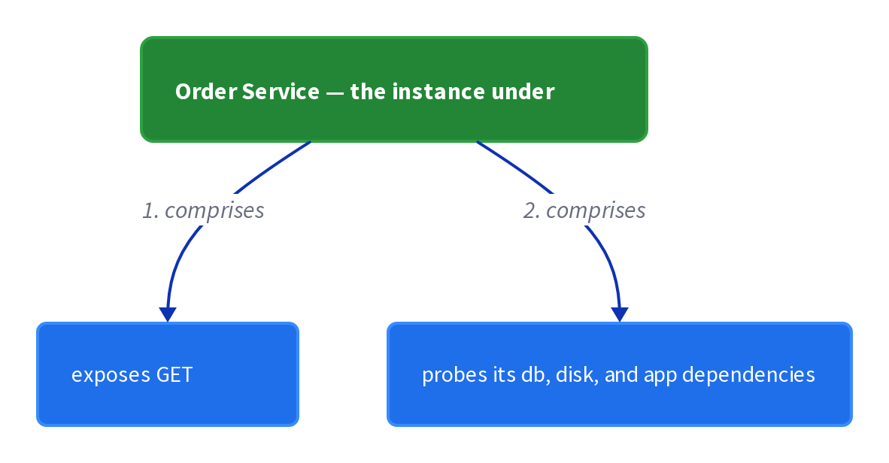
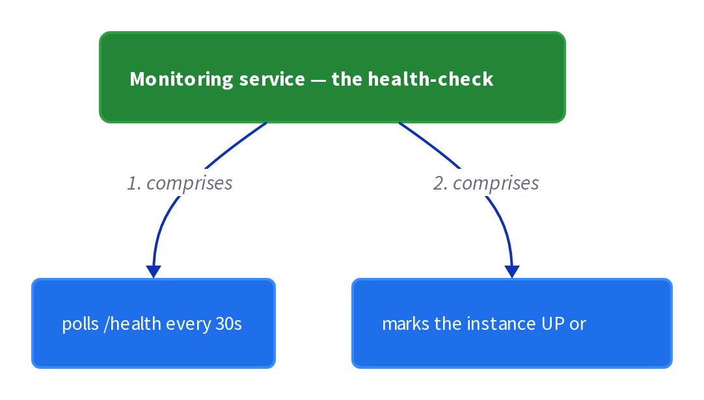
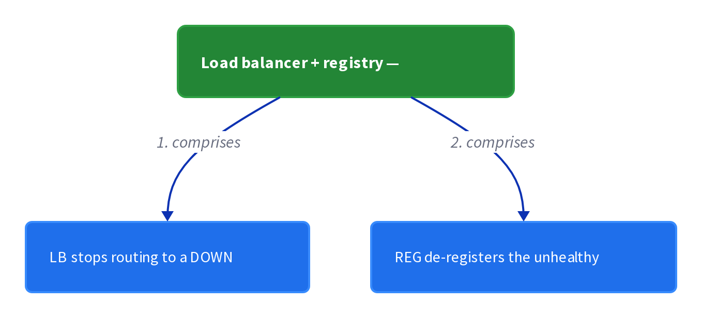

# Chapter 35: Health Check API

> A service exposes a health check endpoint that a monitoring service, registry, or load balancer periodically calls to detect whether an instance can handle requests.

_Also known as: Chris Richardson · Microservice Patterns Ch. 35 · microservices.io /patterns/observability/health-check-api.html_

## Flow

### Expose a health check endpoint

> **Why this matters:** A service instance can be running yet unable to handle requests; without an endpoint that reports its health, nothing outside the instance can tell the difference. Exposing /health is the entry point for both alerting and routing.

1. **Add the endpoint** — The service exposes a health check API endpoint such as HTTP /health.

2. **Return the health** — The endpoint returns the health of the service as its result.

3. **Run it on every poll** — A health check client invokes the endpoint to check the health of the instance.

```java
// ORDER SERVICE SIDE — the /health handler reports whether its database dependency is up
// PARTIES: SVC = Order Service instance · DB = PostgreSQL 16 @ orders-db-1 · MON = monitoring service
// STATE (before):
//    health : { db:"UNKNOWN", status:null }
// DEF: health_check · CALLED BY: MON polling GET /health every 30 s
// -> req : "GET /health"
//    step 1 · probe the DB connection pool -> open   // health.db : "UNKNOWN" -> "UP"
//    step 2 · combine all checks into one verdict   // health.status : null -> "UP"
//    step 3 · respond with the verdict as the body   // body : {} -> {"status":"UP"}
// <- health : {"db":"UP", "status":"UP"} · MON now marks the instance healthy
//    alt DB pool exhausted : probe -> closed, health.db : "UNKNOWN" -> "DOWN", status : null -> "DOWN", body : {"status":"DOWN"}
```

### Check the things that can fail

> **Why this matters:** Health is not a boolean the process knows on its own; it is the result of probing real dependencies. A handler that checks connections, the host, and application logic can actually detect the running-but-broken state.

1. **Check infrastructure connections** — The handler checks the status of the connections to the infrastructure services the instance uses.

2. **Check the host** — The handler checks the status of the host, such as disk space.

3. **Run application-specific logic** — The handler runs application-specific checks on top of the generic ones.

```java
// ORDER SERVICE SIDE — one handler runs three checks: infra connections, host disk, app logic
// PARTIES: SVC = Order Service instance · DB = PostgreSQL 16 @ orders-db-1 · HOST = the machine it runs on
// STATE (before):
//    checks : { db:"UNKNOWN", disk:"UNKNOWN", app:"UNKNOWN" }
// DEF: run_checks · CALLED BY: the /health handler on each poll
// -> poll : 1 incoming GET /health
//    step 1 · check the status of connections to infrastructure services -> open   // checks.db : "UNKNOWN" -> "UP"
//    step 2 · check the host's disk space -> 12 free, above the 1 floor   // checks.disk : "UNKNOWN" -> "UP"
//    step 3 · run application-specific logic -> passes   // checks.app : "UNKNOWN" -> "UP"
// <- result : checks = {"db":"UP","disk":"UP","app":"UP"} · healthy only if all 3 are UP
//    alt one check fails : checks.db : "UP" -> "DOWN" -> the whole instance reports DOWN
```

### Invoke it periodically

> **Why this matters:** A single health check is a snapshot; failures happen between snapshots. A client that polls on a fixed interval catches transitions from healthy to unhealthy over time.

1. **Choose a client** — A monitoring service, service registry, or load balancer acts as the health check client.

2. **Poll on an interval** — The client periodically invokes the endpoint on each instance.

3. **Compare with the previous result** — The client notices when an instance flips from UP to DOWN.

```java
// MONITORING SERVICE SIDE — a health-check client polls every instance on a fixed interval
// PARTIES: MON = monitoring service · SVC1 = instance 1 · SVC2 = instance 2
// STATE (before):
//    seen : { "SVC1":"UP", "SVC2":"UP" }        // health recorded on the last tick
// DEF: poll_loop · CALLED BY: MON's scheduler, every 30 s
// -> tick : 2
//    step 1 · GET /health on SVC1 -> "UP"   // seen["SVC1"] : "UP" -> "UP" (no change)
//    step 2 · GET /health on SVC2 -> "DOWN"   // seen["SVC2"] : "UP" -> "DOWN"
//    step 3 · count the healthy instances   // healthy : 2 -> 1   BECAUSE SVC2 flipped to DOWN
// <- observation : seen = {"SVC1":"UP","SVC2":"DOWN"} · MON raises an alert and SVC2 is pulled from routing
//    alt both UP this tick : healthy : 1 -> 2 -> no alert, routing unchanged
```

### Route and alert on the result

> **Why this matters:** The value of a health check is what you do with the answer: keep traffic off broken instances and wake a human. Routing and alerting are the two actions that consume the endpoint's verdict.

1. **Stop routing to failed instances** — The load balancer or service registry does not route requests to a failed instance.

2. **Generate an alert** — The monitoring system generates an alert when a service instance fails.

3. **Recover into the pool** — When the instance reports healthy again, it returns to routing.

```java
// LOAD BALANCER SIDE — routing drops the failed instance and monitoring raises an alert
// PARTIES: LB = load balancer · REG = service registry · SVC1 = healthy instance · SVC2 = failed instance
// STATE (before):
//    pool : { "SVC1":"UP", "SVC2":"DOWN" }       // the routing pool with per-instance health
// DEF: route_and_alert · CALLED BY: LB after a health check reports SVC2 DOWN
// -> health : "SVC2 DOWN"
//    step 1 · LB removes SVC2 from its routing table   // pool : {"SVC1":"UP","SVC2":"DOWN"} -> {"SVC1":"UP"}
//    step 2 · the next request is routed only to a working instance   // target : null -> "SVC1"
//    step 3 · REG drops SVC2 and MON raises an alert   // alert : null -> "SVC2 DOWN at tick 2"
// <- outcome : pool = {"SVC1":"UP"} · requests route only to working instances, and an alert is generated
//    alt SVC2 recovers : health "SVC2 UP" -> pool : {"SVC1":"UP"} -> {"SVC1":"UP","SVC2":"UP"}
```


## System Design Interview

> **The question:** Design liveness for service instances. Premise: each instance exposes a /health endpoint; a health-check client polls it and drives routing and alerting, so traffic stops reaching unhealthy instances.

**The pipeline:** service instance → /health endpoint → health-check client → routing/alert

### Order Service — the instance under check

_Role: service instance_



### Monitoring service — the health-check client

_Role: health-check client_



### Load balancer + registry — routing/alert

_Role: routing/alert_



```java
// SYSTEM DESIGN — health check: service instance -> /health endpoint -> health-check client -> routing/alert
// PARTIES: SVC = Order Service (instance under check) · MON = monitoring service (health-check client) · DB = PostgreSQL 16 @ orders-db-1 (the checked database) · LB = load balancer (routing) · REG = service registry (registration)
// DEF: health — the answer /health returns; here "UP" when db, disk, and app all pass
// DEF: check — one probe against a dependency; here "db", "disk", "app"
// STATE (before):
//    status : { "db":"UP", "disk":"UP", "app":"UP" }   // all three probes green
//    alerts : 0        // nothing raised yet
// DEF: run_check · CALLED BY: MON polling /health every 30s
// -> endpoint : "/health"
//    step 1 · SVC probes db, disk, and app   // probes : 0 -> 3   BECAUSE /health checks all three dependencies in one call
//    step 2 · the db probe fails   // status : { "db":"UP","disk":"UP","app":"UP" } -> { "db":"DOWN","disk":"UP","app":"UP" }   BECAUSE PostgreSQL 16 @ orders-db-1 stops answering
//    step 3 · MON marks the instance DOWN and LB reroutes   // alerts : 0 -> 1   BECAUSE a failed check flips the instance from UP to DOWN
// <- outcome : status.db = "DOWN" · LB stops sending traffic  BECAUSE /health reported the db check failed
```

## Interview Questions

### Q1

Your order service is running but has quietly exhausted its database connection pool, so every new request fails even though the process is alive. A process check alone cannot see this state.

**Interviewer's question:** What does the Health Check API pattern expose, and what does the /health endpoint return when a dependency is down?

**Solution:** The service exposes an HTTP /health endpoint that returns the health of the service; the handler probes its dependencies and returns a DOWN verdict when one is broken.

**System-design components:**
- /health endpoint — the entry point
- Dependency probe — checks the DB pool
- Health verdict — UP or DOWN
- Health check client — polls the endpoint

```java
// ORDER SERVICE SIDE — the /health handler probes its database dependency and returns a verdict a client can read
// PARTIES: SVC = Order Service instance · DB = PostgreSQL 16 @ orders-db-1 · MON = monitoring service
// STATE (before):
//    health : { db:"UNKNOWN", status:null }
// DEF: health_check · CALLED BY: MON polling GET /health every 30 s
// -> req : "GET /health"
//    step 1 · probe the DB connection pool -> exhausted   // health.db : "UNKNOWN" -> "DOWN"   BECAUSE all 10 connections are busy
//    step 2 · combine all checks into one verdict   // health.status : null -> "DOWN"
//    step 3 · respond with the verdict as the body   // body : {} -> {"status":"DOWN"}
// <- health : {"db":"DOWN","status":"DOWN"} · MON now marks the instance unhealthy even though the process is alive
//    alt pool has a free connection : health.db : "UNKNOWN" -> "UP", status : null -> "UP", body : {"status":"UP"}
```

_This is the endpoint stage — exposing /health and returning the health of the service as its result._

_Covers:_ Expose a health check endpoint

_From the 28 problems:_ 01-scale-from-zero-to-millions · 03-framework-for-system-design-interviews

### Q2

Health is not a boolean the process knows on its own; it is the result of probing real dependencies. Your /health handler must check infrastructure connections, the host, and application logic.

**Interviewer's question:** Which three kinds of checks does the /health handler run, and when does the whole instance report unhealthy?

**Solution:** The handler checks the status of connections to infrastructure services, the status of the host such as disk space, and application-specific logic; it reports unhealthy if any one of them fails.

**System-design components:**
- Infrastructure connection check
- Host check — disk space
- Application-specific logic check
- Combined verdict — all must pass

```java
// ORDER SERVICE SIDE — one handler runs three checks: infra connections, host disk, and application logic
// PARTIES: SVC = Order Service instance · DB = PostgreSQL 16 @ orders-db-1 · HOST = the machine it runs on
// STATE (before):
//    checks : { db:"UNKNOWN", disk:"UNKNOWN", app:"UNKNOWN" }
// DEF: run_checks · CALLED BY: the /health handler on each poll
// -> poll : 1 incoming GET /health
//    step 1 · check the status of connections to infrastructure services -> open   // checks.db : "UNKNOWN" -> "UP"
//    step 2 · check the host's disk space -> 12 free, above the 1 floor   // checks.disk : "UNKNOWN" -> "UP"
//    step 3 · run application-specific logic -> the tax-rate table is empty   // checks.app : "UNKNOWN" -> "DOWN"
// <- result : checks = {"db":"UP","disk":"UP","app":"DOWN"} · unhealthy because one of the three is DOWN
//    alt all three pass : checks.app : "DOWN" -> "UP" -> the instance reports UP
```

_This is the checks stage — probing connections, the host, and application logic to build the verdict._

_Covers:_ Check the things that can fail

_From the 28 problems:_ 01-scale-from-zero-to-millions · 03-framework-for-system-design-interviews

### Q3

A single health check is a snapshot, and failures happen between snapshots. Your monitoring service must catch the exact moment an instance flips from UP to DOWN.

**Interviewer's question:** Who acts as the health check client, and how does it catch a transition from healthy to unhealthy?

**Solution:** A monitoring service, service registry, or load balancer periodically invokes the endpoint on each instance, and it notices when an instance flips from UP to DOWN between two polls.

**System-design components:**
- Health check client — MON/registry/LB
- Fixed polling interval
- Previous-result history
- Flip detection — UP to DOWN

```java
// MONITORING SERVICE SIDE — a health-check client polls one instance over three ticks and catches the UP -> DOWN flip
// PARTIES: MON = monitoring service · SVC = Order Service instance
// STATE (before):
//    history : { "SVC": ["UP","UP"] }   // the last two ticks' verdicts, both healthy
// DEF: poll_loop · CALLED BY: MON's scheduler, every 30 s
// -> tick : 3
//    step 1 · GET /health on SVC -> "DOWN"   // current : null -> "DOWN"   BECAUSE the DB pool exhausted since tick 2
//    step 2 · append the verdict to the history   // history["SVC"] : ["UP","UP"] -> ["UP","UP","DOWN"]
//    step 3 · compare with the previous result and detect the flip   // flip : false -> true   BECAUSE "UP" became "DOWN" between tick 2 and tick 3
// <- observation : SVC flipped UP -> DOWN at tick 3 · MON raises an alert for this instance
//    alt still UP : current : "DOWN" -> "UP", flip : true -> false -> no alert
```

_This is the polling stage — a client invokes the endpoint on a fixed interval and notices the UP-to-DOWN transition._

_Covers:_ Invoke it periodically

_From the 28 problems:_ 01-scale-from-zero-to-millions · 03-framework-for-system-design-interviews

### Q4

Your load balancer kept routing to an instance that was healthy a second ago and is broken now. You need to keep traffic off the failed instance, alert a human, and bring the instance back when it recovers.

**Interviewer's question:** How does the load balancer and monitoring system act on the health check verdict, and what happens when the instance recovers?

**Solution:** The load balancer and service registry stop routing to the failed instance and the monitoring system raises an alert; when the instance reports healthy again, it returns to routing.

**System-design components:**
- Routing pool — per-instance health
- Load balancer — drops failed instances
- Monitoring system — raises an alert
- Recovery — instance returns to the pool

```java
// LOAD BALANCER SIDE — a failed instance is pulled from routing, and when it recovers it is added back to the pool
// PARTIES: LB = load balancer · SVC1 = healthy instance · SVC2 = recovering instance
// STATE (before):
//    pool : { "SVC1":"UP" }   // SVC2 was dropped after its last DOWN report
// DEF: recover_instance · CALLED BY: LB when SVC2 reports UP again
// -> health : "SVC2 UP"
//    step 1 · verify SVC2 is healthy again -> "UP"   // recheck : null -> "UP"
//    step 2 · add SVC2 back into the routing pool   // pool : {"SVC1":"UP"} -> {"SVC1":"UP","SVC2":"UP"}
//    step 3 · clear the alert for SVC2   // alert : "SVC2 DOWN at tick 2" -> null
// <- outcome : pool = {"SVC1":"UP","SVC2":"UP"} · traffic may now flow to both instances again
//    alt SVC2 still DOWN : recheck : "UP" -> "DOWN", pool unchanged -> it stays out of routing
```

_This is the routing-and-alert stage — keeping traffic off failed instances, alerting, and recovering them into the pool._

_Covers:_ Route and alert on the result

_From the 28 problems:_ 01-scale-from-zero-to-millions · 03-framework-for-system-design-interviews

## Key Concepts

### The Problem

**Running but unable to serve.** Being alive is not the same as being healthy, so a process check alone is not enough to detect the failure.


### The Solution

A service has a health check API endpoint such as HTTP /health that returns the health of the service.

```java
// ORDER SERVICE SIDE — the /health handler probes its database dependency and returns a verdict a client can read
// PARTIES: SVC = Order Service instance · DB = PostgreSQL 16 @ orders-db-1 · MON = monitoring service
// STATE (before):
//    health : { db:"UNKNOWN", status:null }
// DEF: health_check · CALLED BY: MON polling GET /health every 30 s
// -> req : "GET /health"
//    step 1 · probe the DB connection pool -> exhausted   // health.db : "UNKNOWN" -> "DOWN"   BECAUSE all 10 connections are busy
//    step 2 · combine all checks into one verdict   // health.status : null -> "DOWN"
//    step 3 · respond with the verdict as the body   // body : {} -> {"status":"DOWN"}
// <- health : {"db":"DOWN","status":"DOWN"} · MON now marks the instance unhealthy even though the process is alive
//    alt pool has a free connection : health.db : "UNKNOWN" -> "UP", status : null -> "UP", body : {"status":"UP"}
```


### Key Facts

| Fact | Detail | In the wild |
|---|---|---|
| Health check API endpoint | A service has a health check API endpoint such as HTTP /health that returns the health of the service. | Spring Boot Actuator provides a /health endpoint customized through HealthIndicator beans whose health() method returns a Health value. |
| May miss a failure | The health check might not be sufficiently comprehensive, or the instance might fail between health checks. | A load balancer can send traffic to an instance that was healthy one second ago and is broken now. |
| One endpoint, three consumers | A health check client can be a monitoring service, a service registry, or a load balancer, each acting on the answer differently. | A monitoring service raises an alert, a service registry drops the instance, and a load balancer stops routing to it. |


### Tradeoffs & When

- The health check might not be sufficiently comprehensive, or the instance might fail between health checks.
- A health check client can be a monitoring service, a service registry, or a load balancer, each acting on the answer differently.


<details><summary>All concepts (index)</summary>

### Problem: Running but unable to serve

**Why.** A service instance can be incapable of handling requests yet still be running, for example when it has run out of database connections.

**Claim.** Being alive is not the same as being healthy, so a process check alone is not enough to detect the failure.

**Grounding.** The pattern exists to answer how to detect that a running service instance is unable to handle requests.

**In the wild.** When this state is missed, a monitoring system fails to alert and a load balancer keeps routing to the broken instance.
### Solution: Health check API endpoint

**Why.** The instance itself must report whether it can serve, via something a client can poll.

**Claim.** A service has a health check API endpoint such as HTTP /health that returns the health of the service.

**Grounding.** The handler checks infrastructure connections, host status such as disk space, and application-specific logic; a client periodically invokes the endpoint.

**In the wild.** Spring Boot Actuator provides a /health endpoint customized through HealthIndicator beans whose health() method returns a Health value.
### Tradeoff: May miss a failure

**Why.** A health check is a point-in-time sample, not a guarantee.

**Claim.** The health check might not be sufficiently comprehensive, or the instance might fail between health checks.

**Grounding.** The reference lists this as the drawback: requests might still be routed to a failed service instance.

**In the wild.** A load balancer can send traffic to an instance that was healthy one second ago and is broken now.
### Tradeoff: One endpoint, three consumers

**Why.** The same /health answer drives different decisions in different systems.

**Claim.** A health check client can be a monitoring service, a service registry, or a load balancer, each acting on the answer differently.

**Grounding.** The reference names all three as the client that periodically invokes the endpoint.

**In the wild.** A monitoring service raises an alert, a service registry drops the instance, and a load balancer stops routing to it.

</details>


## Quiz

1. What problem does the Health Check API pattern address?

   - A. A service instance can be running yet unable to handle requests
   - B. Services crash too often at startup
   - C. Databases are too slow to query
   - D. Load balancers are too expensive

<details><summary>Reveal answer</summary>

**A.** The context is a service instance that is still running but incapable of handling requests, for example because it ran out of database connections. B, C, and D are not the problem described.

</details>

2. Which checks does the /health handler perform?

   - A. Only CPU temperature and fan speed
   - B. Connections to infrastructure services, host status such as disk space, and application-specific logic
   - C. Only the number of open database connections
   - D. Only memory usage

<details><summary>Reveal answer</summary>

**B.** The reference lists the status of connections to infrastructure services, the status of the host such as disk space, and application-specific logic. A, C, and D are too narrow or not in the reference.

</details>

3. Who periodically invokes the health check endpoint?

   - A. The end user of the application
   - B. A health check client such as a monitoring service, service registry, or load balancer
   - C. The database server
   - D. Only a developer running it by hand

<details><summary>Reveal answer</summary>

**B.** The reference names a monitoring service, service registry, or load balancer as the client that periodically invokes the endpoint. A, C, and D are not the clients described.

</details>

4. What is the stated drawback of the Health Check API?

   - A. It requires a second database for every service
   - B. The check may not be sufficiently comprehensive, or the instance may fail between checks, so requests can still be routed to a failed instance
   - C. It removes the service registry from the architecture
   - D. It uses two-phase commit for every check

<details><summary>Reveal answer</summary>

**B.** The reference lists both gaps: the check might not be comprehensive, and an instance might fail between health checks. A, C, and D are not in the reference.

</details>

