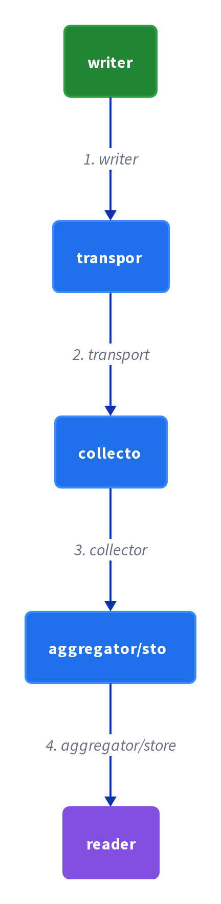

# Chapter 36: Log Aggregation

> Use a centralized logging service that aggregates logs from every service instance so they can be searched, analyzed, and alerted on.

_Also known as: Chris Richardson · Microservice Patterns Ch. 36 · microservices.io /patterns/observability/application-logging.html_

## Flow

### Write a structured log line

> **Why this matters:** Every instance already writes to its own log file, but those files are scattered across machines. A standardized format, with the request id baked in, is what lets one request be reassembled later.

1. **Write to a log file** — Each service instance writes information about what it is doing to a log file in a standardized format.

2. **Record the severity** — The log file contains errors, warnings, information, and debug messages.

3. **Tag with the request id** — Each line includes the external request id so it can be joined to the other lines of the same request.

```java
// ORDER SERVICE SIDE — one request writes a structured log line tagged with its request id
// PARTIES: SVC = Order Service · U1 = the user whose request this is
// STATE (before):
//    logfile : []                     // this instance's log file, append-only
// DEF: log_request · CALLED BY: SVC handling GET /orders for one request
// -> req_id : "REQ-3001"
//    step 1 · format the line in the standard shape   // line : null -> "10:00:01 INFO order-service REQ-3001 handle /orders"
//    step 2 · append the line to the instance log file   // logfile : [] -> ["10:00:01 INFO order-service REQ-3001 handle /orders"]
//    step 3 · hand the SAME req_id to the downstream call   // forwarded_id : null -> "REQ-3001"
// <- log written : logfile has 1 line tagged "REQ-3001" · the id rides with the request to the next service
//    alt the call errors : line : null -> "10:00:02 ERROR order-service REQ-3001 customer lookup failed"
```

### Ship logs to the centralized service

> **Why this matters:** A log on a local disk cannot be searched across the fleet. Shipping every instance's lines to one centralized logging service is what turns many files into one queryable index.

1. **Point at the logging service** — Use a centralized logging service to aggregate logs from each service instance.

2. **Forward each line** — Each instance ships its own log lines to the centralized service as they are written.

3. **Index by request id** — The service indexes the lines so one request id gathers its lines from every instance.

```java
// AGGREGATOR SIDE — three services ship their logs for one request into a single index
// PARTIES: SVC1 = Order Service · SVC2 = Customer Service · SVC3 = Payment Service · LOG = central logging service
// STATE (before):
//    index : {}                       // the central searchable index, empty
// DEF: ship_logs · CALLED BY: LOG collecting each instance's log file
// -> batch : 3 log lines, all tagged "REQ-3001"
//    step 1 · SVC1's line arrives -> "INFO order-service REQ-3001 handle /orders"   // index : {} -> {"REQ-3001":[1]}
//    step 2 · SVC2's line arrives -> "INFO customer-service REQ-3001 lookup customer 42"   // index["REQ-3001"] : [1] -> [1,2]
//    step 3 · SVC3's line arrives -> "INFO payment-service REQ-3001 charge 19.00"   // index["REQ-3001"] : [1,2] -> [1,2,3]
// <- aggregated : index["REQ-3001"] has 3 lines from 3 services · one key reconstructs the whole request
//    alt a second request "REQ-3002" : index : {"REQ-3001":[1,2,3]} -> {"REQ-3001":[1,2,3], "REQ-3002":[1]}
```

### Search across instances

> **Why this matters:** Understanding behavior means following one request across every service it touched. Search is the operation that turns a request id into the ordered story of that request.

1. **Query by request id** — Users search the aggregated logs, often by the external request id.

2. **Get hits from every instance** — A single query returns matching lines from all the services that handled the request.

3. **Order by time** — The lines are sorted by timestamp to reconstruct the path of the request.

```java
// DEVELOPER SIDE — one query against the index returns a request's logs in time order
// PARTIES: DEV = developer searching · LOG = central logging service
// STATE (before):
//    index : { "REQ-3001": [1,2,3] }    // 3 lines: order-service, customer-service, payment-service
// DEF: search · CALLED BY: DEV typing the request id into the search UI
// -> query : "REQ-3001"
//    step 1 · match the key "REQ-3001" -> 3 hits   // hits : 0 -> 3
//    step 2 · sort the hits by timestamp   // order : "unsorted" -> "t1, t2, t3"
//    step 3 · render the 3 lines as one path   // view : null -> "order-service -> customer-service -> payment-service"
// <- result : 3 lines across 3 services, in time order · one query shows the whole request path
//    alt query "REQ-9999" : hits : 3 -> 0 -> an empty result, that request was never logged
```

### Alert on patterns, and pay for volume

> **Why this matters:** You cannot watch logs by hand; alerts fire automatically when a configured message appears. But the volume that makes the index useful is exactly what makes it expensive.

1. **Configure alerts** — Users configure alerts that are triggered when certain messages appear in the logs.

2. **Fire on the pattern** — When an indexed line matches a configured pattern, the alert fires.

3. **Provision for volume** — Handling a large volume of logs requires substantial infrastructure.

```java
// LOG SERVICE SIDE — an alert fires when a configured message appears in the stream
// PARTIES: LOG = central logging service · DEV = on-call developer
// STATE (before):
//    rules : { "ERROR": {threshold:1, fired:false} }
// DEF: evaluate_alerts · CALLED BY: LOG as each new line is indexed
// -> line : "ERROR order-service REQ-3001 customer lookup failed"
//    step 1 · the configured rule "ERROR" matches this line   // match : false -> true
//    step 2 · bump the ERROR count to its threshold   // count : 0 -> 1
//    step 3 · fire the rule and notify DEV   // rules["ERROR"].fired : false -> true · alert : [] -> ["ERROR from order-service"]
// <- alert : "ERROR from order-service" delivered to DEV · 1 notification for this pattern
//    alt a plain INFO line : match : false -> false, count stays 0, no alert is raised
```


## System Design Interview

> **The question:** Design centralized logs for services. Premise: each service writes logs, a transport ships them, a collector aggregates them into a store, and a reader queries them, so one query spans all services.

**The pipeline:** writer → transport → collector → aggregator/store → reader



### Three services — the writers

_Role: writer_

- Order Service — writes a log line tagged REQ-3001
- Customer Service and Payment Service — write their own lines for REQ-3001

### Central logging service — collector + aggregator/store

_Role: collector / aggregator/store_

- collects the lines shipped by each service
- indexes them by request id into {"REQ-3001":[1,2,3]}

### Developer — the reader

_Role: reader_

- searches REQ-3001
- reads the 3 correlated lines from the index

```java
// SYSTEM DESIGN — log aggregation: writer -> transport -> collector -> aggregator/store -> reader
// PARTIES: SVC1 = Order Service (writer) · SVC2 = Customer Service (writer) · SVC3 = Payment Service (writer) · LOG = central logging service (collector + aggregator) · DEV = developer (reader)
// DEF: log — one service log line; here { "request_id":"REQ-3001", "level":"ERROR" }
// DEF: index — a store mapping a request id to the services that logged it; here { "REQ-3001":[1,2,3] }
// STATE (before):
//    index : {}        // no request correlated yet
//    entries : []      // no log lines stored yet
// DEF: aggregate_logs · CALLED BY: SVC1 writing, LOG indexing, DEV searching REQ-3001
// -> request_id : "REQ-3001"
//    step 1 · SVC1, SVC2, SVC3 each ship a log line   // entries : [] -> [3 lines]   BECAUSE all three services tag their lines with REQ-3001
//    step 2 · LOG indexes each line by request id   // index : {} -> { "REQ-3001":[1,2,3] }   BECAUSE the collector keys the store by request id
//    step 3 · DEV searches the index   // found : 0 -> 3   BECAUSE the reader queries the index and gets all three lines back
// <- outcome : index["REQ-3001"] = [1,2,3] · DEV reads 3 correlated lines  BECAUSE transport moved each write into one aggregated store
```

## Interview Questions

### Q1

A request to your order service fans out to the customer service, and each writes to its own log file. Later you need to reconstruct the whole request, but the two files are on two machines with no way to join them.

**Interviewer's question:** What must each service instance write to its log file in the Log aggregation pattern, and why is the request id baked into every line?

**Solution:** Each instance writes to a log file in a standardized format with a severity, and every line carries the external request id so the lines of one request can be joined.

**System-design components:**
- Log file — one per instance
- Standardized format — same shape
- Severity — error/warning/info/debug
- External request id — the join key

```java
// ORDER SERVICE SIDE — a request crossing two services writes a line in each, all tagged with the same request id
// PARTIES: SVC1 = Order Service · SVC2 = Customer Service · U1 = the user whose request this is
// STATE (before):
//    logfile_1 : []   // SVC1's local file
//    logfile_2 : []   // SVC2's local file
// DEF: log_across_services · CALLED BY: SVC1 then SVC2 for request REQ-3001
// -> req_id : "REQ-3001"
//    step 1 · SVC1 formats its line with severity INFO   // line1 : null -> "INFO order-service REQ-3001 handle /orders"
//    step 2 · SVC1 appends, then forwards the SAME id to SVC2   // logfile_1 : [] -> ["INFO order-service REQ-3001 handle /orders"]
//    step 3 · SVC2 formats its own line with the SAME id   // line2 : null -> "INFO customer-service REQ-3001 lookup customer 42"
//    step 4 · SVC2 appends   // logfile_2 : [] -> ["INFO customer-service REQ-3001 lookup customer 42"]
// <- two lines : logfile_1 has 1 line, logfile_2 has 1 line, both tagged "REQ-3001" · one id joins two files
//    alt no shared id : line2 : null -> "INFO customer-service ??? lookup customer 42" -> the two lines can never be joined
```

_This is the writing stage — a standardized log line, a severity, and the external request id in every message._

_Covers:_ Write a structured log line

_From the 28 problems:_ 20-metrics-monitoring

### Q2

A log on a local disk cannot be searched across the fleet. You have a centralized logging service, and each instance must ship its lines there as they are written.

**Interviewer's question:** How do log lines get from each instance into the centralized service, and how does the service index them?

**Solution:** Each instance ships its own log lines to the centralized logging service as they are written, and the service indexes the lines so one request id gathers its lines.

**System-design components:**
- Centralized logging service
- Log shipper — per instance
- Request-id index
- One key — one request

```java
// AGGREGATOR SIDE — one instance ships three lines as they are written, and the central service files them under two request ids
// PARTIES: SVC = Order Service · LOG = central logging service
// STATE (before):
//    index : {}   // the central searchable index, empty
// DEF: ship_stream · CALLED BY: LOG receiving SVC's lines in real time
// -> line1 : "INFO order-service REQ-3001 handle /orders"
//    step 1 · line1 arrives, key it by REQ-3001   // index : {} -> {"REQ-3001":[1]}
//    step 2 · line2 arrives with a NEW id REQ-3002   // index : {"REQ-3001":[1]} -> {"REQ-3001":[1], "REQ-3002":[1]}
//    step 3 · line3 arrives, same id as line1   // index["REQ-3001"] : [1] -> [1,2]
// <- aggregated : index = {"REQ-3001":[1,2], "REQ-3002":[1]} · 3 lines filed under 2 request ids
//    alt line arrives with no id : keyed under "" -> it can never be joined to its request
```

_This is the shipping stage — forwarding each line to the centralized service and indexing it by request id._

_Covers:_ Ship logs to the centralized service

_From the 28 problems:_ 20-metrics-monitoring

### Q3

A request crossed three services and you need to see the whole path. You type the request id into the search UI and expect every instance's lines back, in the order they happened.

**Interviewer's question:** What does a search of the aggregated logs return, and how is the request path reconstructed?

**Solution:** A query by the external request id returns matching lines from all the services that handled it, sorted by timestamp to reconstruct the path.

**System-design components:**
- Search UI — the query entry
- Request-id query
- Hit set — lines from all instances
- Time sort — rebuilds the path

```java
// DEVELOPER SIDE — one request-id query pulls hits from three instances and returns them in time order
// PARTIES: DEV = developer searching · LOG = central logging service
// STATE (before):
//    index : { "REQ-3001": [3,1,2] }   // 3 lines stored out of time order: payment(3), order(1), customer(2)
// DEF: search · CALLED BY: DEV typing the request id into the search UI
// -> query : "REQ-3001"
//    step 1 · match the key "REQ-3001" -> 3 hits   // hits : 0 -> 3
//    step 2 · sort the 3 hits by their timestamps   // order : [3,1,2] -> [1,2,3]
//    step 3 · reconstruct the path from the sorted lines   // view : null -> "order -> customer -> payment"
// <- result : hits = 3, order = [1,2,3] · the query returns every instance's line, in time order
//    alt query "REQ-9999" : hits : 0 -> 0 -> an empty result, that request was never logged
```

_This is the search stage — querying by request id and ordering the hits by timestamp to rebuild the path._

_Covers:_ Search across instances

_From the 28 problems:_ 20-metrics-monitoring

### Q4

You cannot watch logs by hand, so you configure an alert that fires when ERROR appears. But the volume that makes the index useful is also what makes it expensive.

**Interviewer's question:** How do alerts fire in the Log aggregation pattern, and what is the cost of a large log volume?

**Solution:** Users configure alerts that fire when a message matches a pattern; handling a large volume of logs requires substantial infrastructure.

**System-design components:**
- Configured alert rules
- Pattern match on each line
- Notification to on-call
- Growing index volume

```java
// LOG SERVICE SIDE — an alert fires on a configured message, and each new line adds to the volume that demands infrastructure
// PARTIES: LOG = central logging service · DEV = on-call developer
// STATE (before):
//    rules : { "ERROR": {threshold:1, fired:false} }
//    volume : 400000   // lines indexed so far today
// DEF: evaluate_alerts · CALLED BY: LOG as each new line is indexed
// -> line : "ERROR order-service REQ-3001 customer lookup failed"
//    step 1 · the configured rule "ERROR" matches this line   // match : false -> true
//    step 2 · bump the ERROR count to its threshold   // count : 0 -> 1
//    step 3 · fire the rule and notify DEV   // rules["ERROR"].fired : false -> true · alert : [] -> ["ERROR from order-service"]
//    step 4 · this line joins the growing index   // volume : 400000 -> 400001   BECAUSE every indexed line adds to the stored volume
// <- alert : "ERROR from order-service" delivered · volume : 400001 lines · one more line, one more unit of storage and search cost
//    alt a plain INFO line : match : false -> false, count stays 0, no alert raised, but volume still grows
```

_This is the alert-and-volume stage — firing on configured patterns and paying for the infrastructure the volume demands._

_Covers:_ Alert on patterns, and pay for volume

_From the 28 problems:_ 20-metrics-monitoring

## Key Concepts

### The Problem

**Logs scattered across machines.** With each instance writing to its own local log file, no one place shows the whole story of an application.


### The Solution

Use a centralized logging service that aggregates logs from each service instance; users can search and analyze the logs.

```java
// ORDER SERVICE SIDE — a request crossing two services writes a line in each, all tagged with the same request id
// PARTIES: SVC1 = Order Service · SVC2 = Customer Service · U1 = the user whose request this is
// STATE (before):
//    logfile_1 : []   // SVC1's local file
//    logfile_2 : []   // SVC2's local file
// DEF: log_across_services · CALLED BY: SVC1 then SVC2 for request REQ-3001
// -> req_id : "REQ-3001"
//    step 1 · SVC1 formats its line with severity INFO   // line1 : null -> "INFO order-service REQ-3001 handle /orders"
//    step 2 · SVC1 appends, then forwards the SAME id to SVC2   // logfile_1 : [] -> ["INFO order-service REQ-3001 handle /orders"]
//    step 3 · SVC2 formats its own line with the SAME id   // line2 : null -> "INFO customer-service REQ-3001 lookup customer 42"
//    step 4 · SVC2 appends   // logfile_2 : [] -> ["INFO customer-service REQ-3001 lookup customer 42"]
// <- two lines : logfile_1 has 1 line, logfile_2 has 1 line, both tagged "REQ-3001" · one id joins two files
//    alt no shared id : line2 : null -> "INFO customer-service ??? lookup customer 42" -> the two lines can never be joined
```


### Key Facts

| Fact | Detail | In the wild |
|---|---|---|
| Centralized logging service | Use a centralized logging service that aggregates logs from each service instance; users can search and analyze the logs. | AWS CloudWatch is named in the reference as an example of such a service. |
| Volume costs infrastructure | Handling a large volume of logs requires substantial infrastructure. | Storage, indexing, and search all scale with the number of instances writing lines. |
| Standardized format plus a request id | A standardized log format, with the external request id in each message, is what lets one request be reassembled. | Each severity (error, warning, information, debug) shares the same shape so one query covers them all. |


### Tradeoffs & When

- Handling a large volume of logs requires substantial infrastructure.
- A standardized log format, with the external request id in each message, is what lets one request be reassembled.


<details><summary>All concepts (index)</summary>

### Problem: Logs scattered across machines

**Why.** An application is multiple services and instances on multiple machines, and requests often span several instances.

**Claim.** With each instance writing to its own local log file, no one place shows the whole story of an application.

**Grounding.** Each service instance writes information about what it is doing to a log file in a standardized format.

**In the wild.** To understand a request that crossed three services you would otherwise have to read three files on three machines.
### Solution: Centralized logging service

**Why.** Aggregated logs become searchable and analyzable in one place.

**Claim.** Use a centralized logging service that aggregates logs from each service instance; users can search and analyze the logs.

**Grounding.** Users can also configure alerts that are triggered when certain messages appear in the logs.

**In the wild.** AWS CloudWatch is named in the reference as an example of such a service.
### Tradeoff: Volume costs infrastructure

**Why.** Aggregating every line from every instance accumulates a lot of data.

**Claim.** Handling a large volume of logs requires substantial infrastructure.

**Grounding.** The reference lists this as the resulting issue of the pattern.

**In the wild.** Storage, indexing, and search all scale with the number of instances writing lines.
### Tradeoff: Standardized format plus a request id

**Why.** Correlation across services only works if lines can be joined.

**Claim.** A standardized log format, with the external request id in each message, is what lets one request be reassembled.

**Grounding.** Distributed tracing is the related pattern, and the reference says to include the external request id in each log message.

**In the wild.** Each severity (error, warning, information, debug) shares the same shape so one query covers them all.

</details>


## Quiz

1. What does each service instance write in the Log aggregation pattern?

   - A. A shared database table
   - B. A log file in a standardized format
   - C. Nothing
   - D. Only metrics, never text

<details><summary>Reveal answer</summary>

**B.** Each service instance writes information about what it is doing to a log file in a standardized format. A, C, and D contradict the reference.

</details>

2. What does the centralized logging service do?

   - A. Aggregates logs from each instance, and users can search and analyze them
   - B. Stores logs but offers no search
   - C. Sends emails to every user
   - D. Replaces the service instances

<details><summary>Reveal answer</summary>

**A.** The solution is a centralized logging service that aggregates logs from each instance; users can search and analyze the logs, and configure alerts. B, C, and D are not the described behavior.

</details>

3. Which related pattern helps join one request's log lines across services?

   - A. Distributed tracing, by including the external request id in each log message
   - B. Circuit breaker
   - C. API gateway
   - D. Saga

<details><summary>Reveal answer</summary>

**A.** The related Distributed tracing pattern says to include the external request id in each log message, which is what lets lines from different services be joined. B, C, and D do not address log correlation.

</details>

4. What issue results from aggregating a large volume of logs?

   - A. Logs become free to store
   - B. Handling a large volume of logs requires substantial infrastructure
   - C. Logs can no longer be aggregated
   - D. Services must stop logging

<details><summary>Reveal answer</summary>

**B.** The reference lists the substantial infrastructure requirement as the resulting issue. A, C, and D are not in the reference.

</details>

