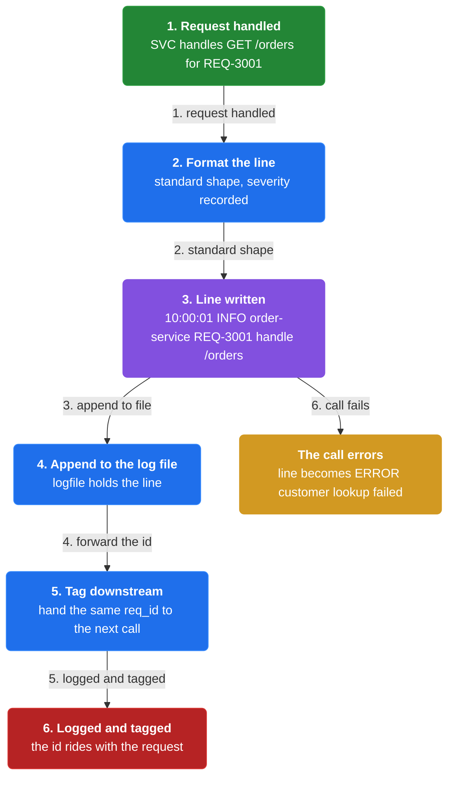
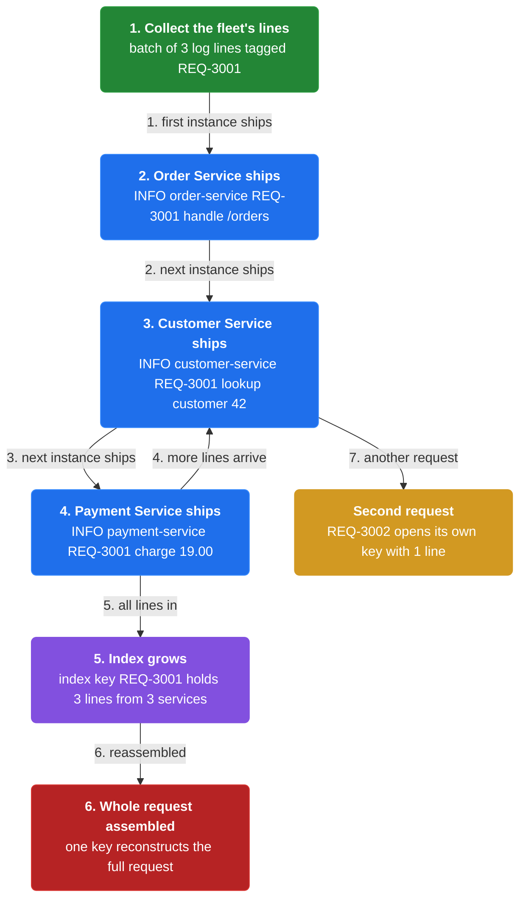
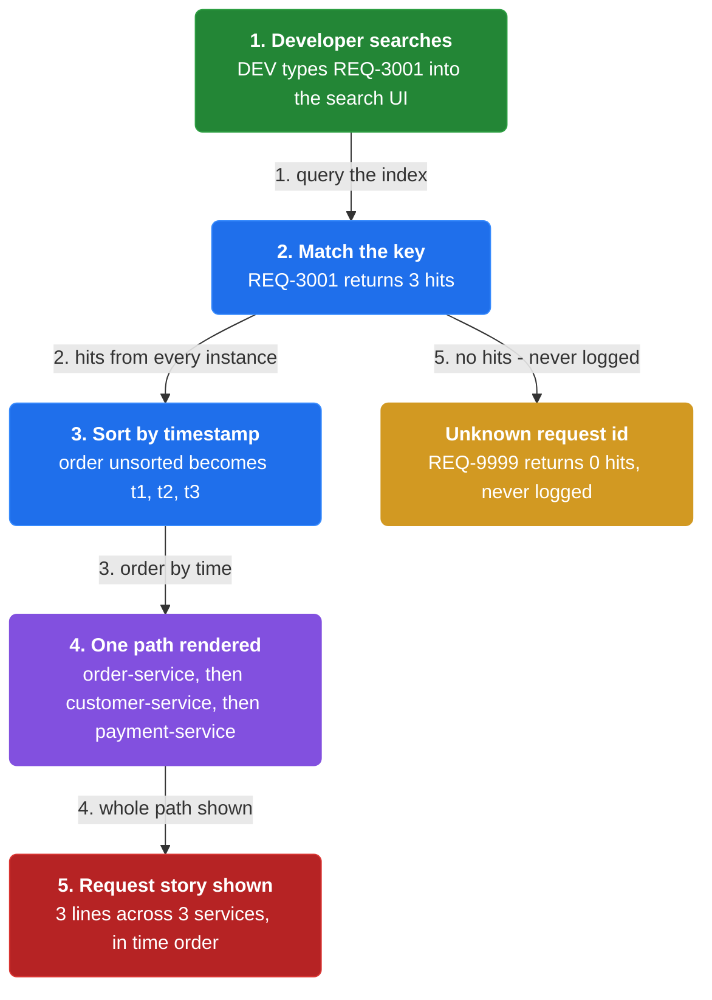
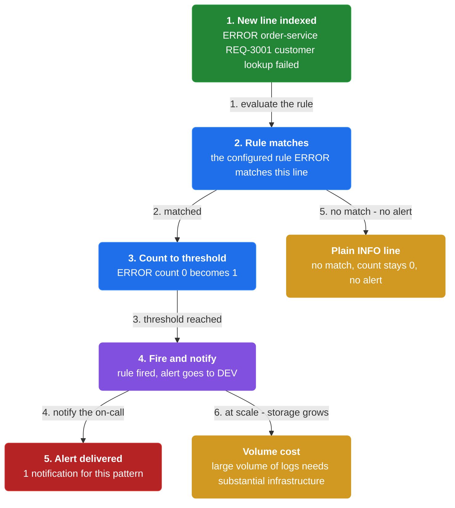

# Chapter 36: Log Aggregation

> Use a centralized logging service that aggregates logs from every service instance so they can be searched, analyzed, and alerted on.

_Also known as: Chris Richardson · Microservice Patterns Ch. 36 · microservices.io /patterns/observability/application-logging.html_

## Flow

### Write a structured log line

> **Why this matters:** Every instance already writes to its own log file, but those files are scattered across machines. A standardized format, with the request id baked in, is what lets one request be reassembled later.



1. **Write to a log file** — Each service instance writes information about what it is doing to a log file in a standardized format.

2. **Record the severity** — The log file contains errors, warnings, information, and debug messages.

3. **Tag with the request id** — Each line includes the external request id so it can be joined to the other lines of the same request.

```java
// ORDER SERVICE SIDE — one request writes a structured log line tagged with its request id
// PARTIES: SVC = Order Service · U1 = the user whose request this is
// STATE (before):
//    logfile : []                     // this instance's log file, append-only
// DEF: log_request · CALLED BY: SVC handling GET /orders for one request
// -> req_id : "REQ-3001"
//    step 1 · format the line in the standard shape   // line : null -> "10:00:01 INFO order-service REQ-3001 handle /orders"
//    step 2 · append the line to the instance log file   // logfile : [] -> ["10:00:01 INFO order-service REQ-3001 handle /orders"]
//    step 3 · hand the SAME req_id to the downstream call   // forwarded_id : null -> "REQ-3001"
// <- log written : logfile has 1 line tagged "REQ-3001" · the id rides with the request to the next service
//    alt the call errors : line : null -> "10:00:02 ERROR order-service REQ-3001 customer lookup failed"
```

### Ship logs to the centralized service

> **Why this matters:** A log on a local disk cannot be searched across the fleet. Shipping every instance's lines to one centralized logging service is what turns many files into one queryable index.



1. **Point at the logging service** — Use a centralized logging service to aggregate logs from each service instance.

2. **Forward each line** — Each instance ships its own log lines to the centralized service as they are written.

3. **Index by request id** — The service indexes the lines so one request id gathers its lines from every instance.

```java
// AGGREGATOR SIDE — three services ship their logs for one request into a single index
// PARTIES: SVC1 = Order Service · SVC2 = Customer Service · SVC3 = Payment Service · LOG = central logging service
// STATE (before):
//    index : {}                       // the central searchable index, empty
// DEF: ship_logs · CALLED BY: LOG collecting each instance's log file
// -> batch : 3 log lines, all tagged "REQ-3001"
//    step 1 · SVC1's line arrives -> "INFO order-service REQ-3001 handle /orders"   // index : {} -> {"REQ-3001":[1]}
//    step 2 · SVC2's line arrives -> "INFO customer-service REQ-3001 lookup customer 42"   // index["REQ-3001"] : [1] -> [1,2]
//    step 3 · SVC3's line arrives -> "INFO payment-service REQ-3001 charge 19.00"   // index["REQ-3001"] : [1,2] -> [1,2,3]
// <- aggregated : index["REQ-3001"] has 3 lines from 3 services · one key reconstructs the whole request
//    alt a second request "REQ-3002" : index : {"REQ-3001":[1,2,3]} -> {"REQ-3001":[1,2,3], "REQ-3002":[1]}
```

### Search across instances

> **Why this matters:** Understanding behavior means following one request across every service it touched. Search is the operation that turns a request id into the ordered story of that request.



1. **Query by request id** — Users search the aggregated logs, often by the external request id.

2. **Get hits from every instance** — A single query returns matching lines from all the services that handled the request.

3. **Order by time** — The lines are sorted by timestamp to reconstruct the path of the request.

```java
// DEVELOPER SIDE — one query against the index returns a request's logs in time order
// PARTIES: DEV = developer searching · LOG = central logging service
// STATE (before):
//    index : { "REQ-3001": [1,2,3] }    // 3 lines: order-service, customer-service, payment-service
// DEF: search · CALLED BY: DEV typing the request id into the search UI
// -> query : "REQ-3001"
//    step 1 · match the key "REQ-3001" -> 3 hits   // hits : 0 -> 3
//    step 2 · sort the hits by timestamp   // order : "unsorted" -> "t1, t2, t3"
//    step 3 · render the 3 lines as one path   // view : null -> "order-service -> customer-service -> payment-service"
// <- result : 3 lines across 3 services, in time order · one query shows the whole request path
//    alt query "REQ-9999" : hits : 3 -> 0 -> an empty result, that request was never logged
```

### Alert on patterns, and pay for volume

> **Why this matters:** You cannot watch logs by hand; alerts fire automatically when a configured message appears. But the volume that makes the index useful is exactly what makes it expensive.



1. **Configure alerts** — Users configure alerts that are triggered when certain messages appear in the logs.

2. **Fire on the pattern** — When an indexed line matches a configured pattern, the alert fires.

3. **Provision for volume** — Handling a large volume of logs requires substantial infrastructure.

```java
// LOG SERVICE SIDE — an alert fires when a configured message appears in the stream
// PARTIES: LOG = central logging service · DEV = on-call developer
// STATE (before):
//    rules : { "ERROR": {threshold:1, fired:false} }
// DEF: evaluate_alerts · CALLED BY: LOG as each new line is indexed
// -> line : "ERROR order-service REQ-3001 customer lookup failed"
//    step 1 · the configured rule "ERROR" matches this line   // match : false -> true
//    step 2 · bump the ERROR count to its threshold   // count : 0 -> 1
//    step 3 · fire the rule and notify DEV   // rules["ERROR"].fired : false -> true · alert : [] -> ["ERROR from order-service"]
// <- alert : "ERROR from order-service" delivered to DEV · 1 notification for this pattern
//    alt a plain INFO line : match : false -> false, count stays 0, no alert is raised
```


## Key Concepts

### The Problem

**Logs scattered across machines.** With each instance writing to its own local log file, no one place shows the whole story of an application.


### The Solution

Use a centralized logging service that aggregates logs from each service instance; users can search and analyze the logs.


### Key Facts

| Fact | Detail | In the wild |
|---|---|---|
| Centralized logging service | Use a centralized logging service that aggregates logs from each service instance; users can search and analyze the logs. | AWS CloudWatch is named in the reference as an example of such a service. |
| Volume costs infrastructure | Handling a large volume of logs requires substantial infrastructure. | Storage, indexing, and search all scale with the number of instances writing lines. |
| Standardized format plus a request id | A standardized log format, with the external request id in each message, is what lets one request be reassembled. | Each severity (error, warning, information, debug) shares the same shape so one query covers them all. |


### Tradeoffs & When

- Handling a large volume of logs requires substantial infrastructure.
- A standardized log format, with the external request id in each message, is what lets one request be reassembled.


<details><summary>All concepts (index)</summary>

### Problem: Logs scattered across machines

**Why.** An application is multiple services and instances on multiple machines, and requests often span several instances.

**Claim.** With each instance writing to its own local log file, no one place shows the whole story of an application.

**Grounding.** Each service instance writes information about what it is doing to a log file in a standardized format.

**In the wild.** To understand a request that crossed three services you would otherwise have to read three files on three machines.
### Solution: Centralized logging service

**Why.** Aggregated logs become searchable and analyzable in one place.

**Claim.** Use a centralized logging service that aggregates logs from each service instance; users can search and analyze the logs.

**Grounding.** Users can also configure alerts that are triggered when certain messages appear in the logs.

**In the wild.** AWS CloudWatch is named in the reference as an example of such a service.
### Tradeoff: Volume costs infrastructure

**Why.** Aggregating every line from every instance accumulates a lot of data.

**Claim.** Handling a large volume of logs requires substantial infrastructure.

**Grounding.** The reference lists this as the resulting issue of the pattern.

**In the wild.** Storage, indexing, and search all scale with the number of instances writing lines.
### Tradeoff: Standardized format plus a request id

**Why.** Correlation across services only works if lines can be joined.

**Claim.** A standardized log format, with the external request id in each message, is what lets one request be reassembled.

**Grounding.** Distributed tracing is the related pattern, and the reference says to include the external request id in each log message.

**In the wild.** Each severity (error, warning, information, debug) shares the same shape so one query covers them all.

</details>


## Quiz

1. What does each service instance write in the Log aggregation pattern?

   - A. A shared database table
   - B. A log file in a standardized format
   - C. Nothing
   - D. Only metrics, never text

<details><summary>Reveal answer</summary>

**B.** Each service instance writes information about what it is doing to a log file in a standardized format. A, C, and D contradict the reference.

</details>

2. What does the centralized logging service do?

   - A. Aggregates logs from each instance, and users can search and analyze them
   - B. Stores logs but offers no search
   - C. Sends emails to every user
   - D. Replaces the service instances

<details><summary>Reveal answer</summary>

**A.** The solution is a centralized logging service that aggregates logs from each instance; users can search and analyze the logs, and configure alerts. B, C, and D are not the described behavior.

</details>

3. Which related pattern helps join one request's log lines across services?

   - A. Distributed tracing, by including the external request id in each log message
   - B. Circuit breaker
   - C. API gateway
   - D. Saga

<details><summary>Reveal answer</summary>

**A.** The related Distributed tracing pattern says to include the external request id in each log message, which is what lets lines from different services be joined. B, C, and D do not address log correlation.

</details>

4. What issue results from aggregating a large volume of logs?

   - A. Logs become free to store
   - B. Handling a large volume of logs requires substantial infrastructure
   - C. Logs can no longer be aggregated
   - D. Services must stop logging

<details><summary>Reveal answer</summary>

**B.** The reference lists the substantial infrastructure requirement as the resulting issue. A, C, and D are not in the reference.

</details>

