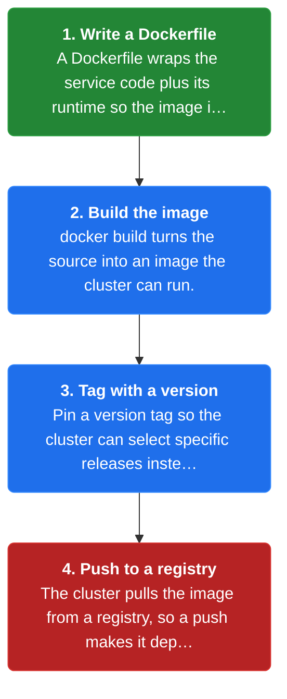
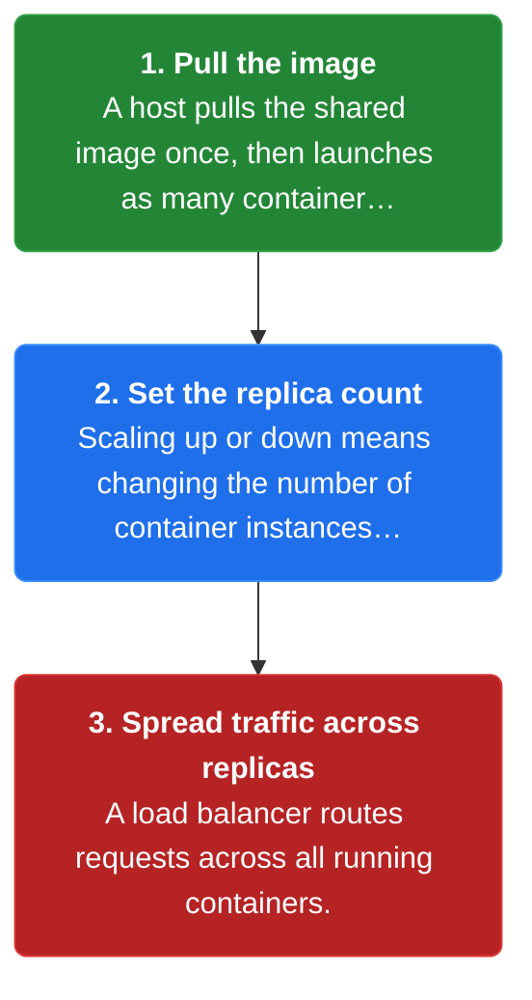
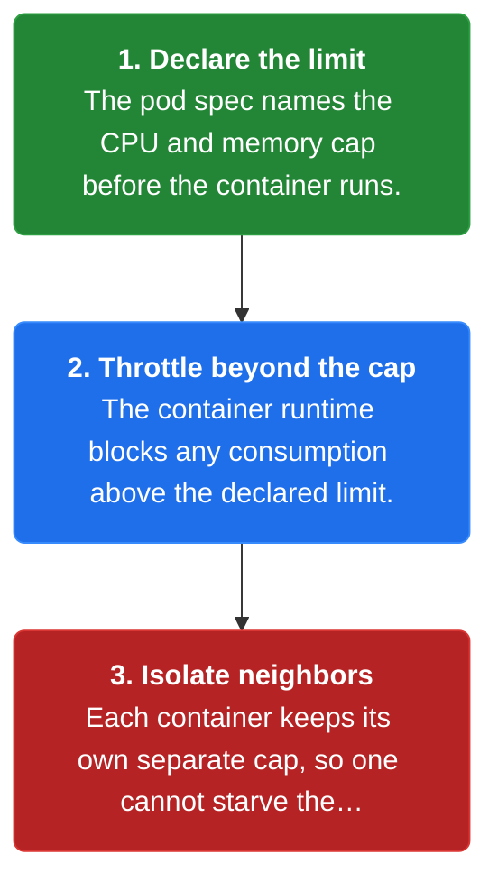
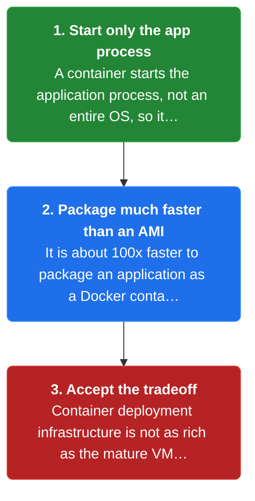

# Chapter 37: Service per Container

> Package each service as a (Docker) container image and deploy each service instance as a container.

_Also known as: Chris Richardson · Microservice Patterns p.393 · microservices.io /patterns/deployment/service-per-container.html_

## Flow

### Package the service as an image

> **Why this matters:** Without a uniform package, every service needs its own build and start procedure. A container image gives every service the same shape regardless of the language, framework, or version it was built with.



1. **Write a Dockerfile** — A Dockerfile wraps the service code plus its runtime so the image is self-contained.

2. **Build the image** — **docker build** turns the source into an image the cluster can run.

3. **Tag with a version** — Pin a version tag so the cluster can select specific releases instead of an unstable latest.

4. **Push to a registry** — The cluster pulls the image from a registry, so a push makes it deployable everywhere.

```java
// BUILD SIDE — turn one service's code into a container image so every tech stack deploys the same way
// PARTIES: BLD = build pipeline · REG = container registry
// STATE (before):
//    image : null                       // nothing built yet
//    tag : "latest"                     // default tag before versioning
// DEF: package version 1.4.2 · CALLED BY: BLD on every source commit
// -> service : "restaurant-service" · -> version : "1.4.2"
//    step 1 · docker build · image : null -> "rsvc:1.4.2"  BECAUSE the Dockerfile wraps the JAR plus its JVM runtime
//    step 2 · docker tag · tag : "latest" -> "1.4.2"       // pin the version so the cluster can select releases
//    step 3 · docker push · copies : 0 -> 1                BECAUSE REG now holds one copy the cluster can pull
// <- image : "rsvc:1.4.2" in REG · 1 image ready to run as N containers
//    alt next commit : version : "1.4.2" -> "1.4.3"        BECAUSE a new commit builds a fresh image tag
```

### Run each instance as a container

> **Why this matters:** Each service runs as multiple instances for throughput and availability. Deploying each instance as a container makes scaling a matter of changing a count.



1. **Pull the image** — A host pulls the shared image once, then launches as many containers as needed from it.

2. **Set the replica count** — Scaling up or down means changing the number of container instances, with no rebuild.

3. **Spread traffic across replicas** — A load balancer routes requests across all running containers.

```java
// RUNTIME SIDE — scale a service by changing its container count, with no rebuild or redeploy
// PARTIES: SVC = restaurant-service · CLUSTER = the Kubernetes cluster
// STATE (before):
//    replicas : 2                       // two containers currently serving traffic
//    image : "rsvc:1.4.2"               // the single image every replica runs
// DEF: scale to 4 · CALLED BY: CLUSTER when measured load rises
// -> desired_replicas : 4
//    step 1 · set replicas · replicas : 2 -> 4   BECAUSE Kubernetes starts 2 more containers from the same image
//    step 2 · schedule · unplaced : 2 -> 0       // both new containers land on healthy hosts
//    step 3 · route · endpoints : 2 -> 4         // the load balancer now spreads traffic over 4
// <- instances : 4  · same image "rsvc:1.4.2", zero rebuilds
//    alt load drops : replicas : 4 -> 1          BECAUSE Kubernetes terminates 3 containers to save resources
```

### Constrain CPU and memory per container

> **Why this matters:** A service must not consume unbounded resources. The container is the boundary where CPU and memory limits are imposed, and where each instance stays isolated from its neighbors.



1. **Declare the limit** — The pod spec names the CPU and memory cap before the container runs.

2. **Throttle beyond the cap** — The container runtime blocks any consumption above the declared limit.

3. **Isolate neighbors** — Each container keeps its own separate cap, so one cannot starve the others.

```java
// RUNTIME SIDE — constrain one container's CPU so a noisy neighbor cannot starve the others
// PARTIES: SVC = restaurant-service · HOST = the machine running the containers
// STATE (before):
//    caps : {}                           // per-container limits, none set yet
//    usage : 0.9                         // this container's current CPU (fraction of a core)
// DEF: set cpu cap 0.5 · CALLED BY: SVC's pod spec at deploy time
// -> cpu_limit : 0.5
//    step 1 · apply cap · caps : {} -> {"cpu":0.5}   BECAUSE the runtime records the limit before the container runs
//    step 2 · throttle · usage : 0.9 -> 0.5          // the excess 0.4 is blocked, not granted
//    step 3 · isolate · neighbors : 0 -> 1           // a second container keeps its own separate cap
// <- cpu_cap : 0.5  · one container cannot consume another's share
//    alt no cap declared : usage : 0.5 -> 0.9        BECAUSE without a limit the container grabs the idle CPU
```

### Fast to build and start, thinner infrastructure

> **Why this matters:** Containers are extremely fast to build and start, but the tooling around them is not as mature as the tooling for virtual machines. Choosing containers means trading infrastructure richness for speed.



1. **Start only the app process** — A container starts the application process, not an entire OS, so it boots much faster than a VM.

2. **Package much faster than an AMI** — It is about 100x faster to package an application as a Docker container than as an AMI.

3. **Accept the tradeoff** — Container deployment infrastructure is not as rich as the mature VM-based IaaS ecosystem.

```java
// TRADEOFF SIDE — one service, two packaging choices, measured start times
// PARTIES: CNT = container path · VMACH = virtual-machine path
// STATE (before):
//    boot : {"container":0, "vm":0}      // measured start times in seconds, both 0
// DEF: time start of service 1.4.2 · CALLED BY: a deploy test on the same service
// -> service : "rsvc:1.4.2"
//    step 1 · start container · boot.container : 0 -> 3    BECAUSE only the application process starts
//    step 2 · start VM · boot.vm : 0 -> 30                 BECAUSE an entire OS must boot first
//    step 3 · compare · ratio : 0 -> 10                    // 30 s / 3 s = 10x faster container start
// <- container : 3 s · VM : 30 s  · container wins on speed, loses on infrastructure maturity
//    alt package step : image : 0 -> 1 in ~seconds · AMI : 0 -> 1 in ~minutes  BECAUSE the reference notes ~100x faster packaging
```


## Key Concepts

### The Problem

**Many languages, one deployment path.** Without a uniform packaging unit, every service needs its own build and start procedure, so deployment cannot be reliable or fast.


### The Solution

Package the service as a Docker container image and deploy each service instance as a container; the container encapsulates the technology used to build the service.


### Key Facts

| Fact | Detail | In the wild |
|---|---|---|
| A container image per service | Package the service as a Docker container image and deploy each service instance as a container; the container encapsulates the technology used to build the service. | All services are started and stopped in exactly the same way because the container hides the runtime details. |
| Fast to build and start | Containers are extremely fast to build and start; it is about 100x faster to package an application as a Docker container than as an AMI, and a container starts much faster than a VM. | Teams that need rapid redeploys pick containers over VM images for exactly this speed. |
| Thinner infrastructure than VMs | The infrastructure for deploying containers is not as rich as the infrastructure for deploying virtual machines. | Teams may prefer the Service Instance per VM pattern when they need the mature IaaS tooling such as autoscaling groups and load balancers. |


### Tradeoffs & When

- Containers are extremely fast to build and start; it is about 100x faster to package an application as a Docker container than as an AMI, and a container starts much faster than a VM.
- The infrastructure for deploying containers is not as rich as the infrastructure for deploying virtual machines.


<details><summary>All concepts (index)</summary>

### Problem: Many languages, one deployment path

**Why.** A microservice system is built from services written in a variety of languages, frameworks, and framework versions, and each service runs as multiple instances for throughput and availability.

**Claim.** Without a uniform packaging unit, every service needs its own build and start procedure, so deployment cannot be reliable or fast.

**Grounding.** The pattern forces list the variety of technologies, the need for independent deployability and scalability, and the need to build and deploy quickly.

**In the wild.** Docker became an extremely popular way to package and deploy services because it gives every service one uniform shape.
### Solution: A container image per service

**Why.** Each service instance must be isolated, independently scalable, and constrained in the CPU and memory it consumes.

**Claim.** Package the service as a Docker container image and deploy each service instance as a container; the container encapsulates the technology used to build the service.

**Grounding.** The solution says the service is packaged as a container image and each instance is a container, clustered by Kubernetes, Marathon/Mesos, or Amazon EC2 Container Service.

**In the wild.** All services are started and stopped in exactly the same way because the container hides the runtime details.
### Tradeoff: Fast to build and start

**Why.** You must deploy the application quickly and cost-effectively.

**Claim.** Containers are extremely fast to build and start; it is about 100x faster to package an application as a Docker container than as an AMI, and a container starts much faster than a VM.

**Grounding.** The resulting context says a container starts faster because only the application process starts rather than an entire OS.

**In the wild.** Teams that need rapid redeploys pick containers over VM images for exactly this speed.
### Tradeoff: Thinner infrastructure than VMs

**Why.** You want deployment to be reliable and cost-effective.

**Claim.** The infrastructure for deploying containers is not as rich as the infrastructure for deploying virtual machines.

**Grounding.** The resulting context lists this as the main drawback of the container approach.

**In the wild.** Teams may prefer the Service Instance per VM pattern when they need the mature IaaS tooling such as autoscaling groups and load balancers.

</details>


## Quiz

1. What is the solution of the Service per Container pattern?

   - A. Package each service as a VM image and deploy each instance as a VM
   - B. Package the service as a Docker container image and deploy each instance as a container
   - C. Deploy the service as a language-specific JAR or WAR
   - D. Hide all servers behind a serverless platform

<details><summary>Reveal answer</summary>

**B.** The pattern packages each service as a container image and runs each instance as a container (B). A is the Service per VM pattern, C is language-specific packaging, and D is serverless deployment.

</details>

2. Which of these is NOT a benefit listed for the container approach?

   - A. Straightforward to scale up and down by changing the container count
   - B. Each service instance is isolated
   - C. A container imposes limits on CPU and memory
   - D. Container deployment infrastructure is richer than VM infrastructure

<details><summary>Reveal answer</summary>

**D.** The reference lists the opposite as a drawback — container infrastructure is not as rich as VM infrastructure, so D is false. A, B, and C are all listed benefits.

</details>

3. Why does a Docker container start much faster than a virtual machine?

   - A. The container runs in the cloud
   - B. Only the application process starts rather than an entire OS
   - C. Containers use less disk space
   - D. The container does not need a registry

<details><summary>Reveal answer</summary>

**B.** A container starts faster because only the application process starts rather than an entire OS (B). The other options are not the reason given in the reference.

</details>

4. Which clustering frameworks are named for deploying containers?

   - A. Kubernetes, Marathon/Mesos, and Amazon EC2 Container Service
   - B. Elastic Beanstalk and Lambda
   - C. CloudFoundry only
   - D. None — containers run directly on laptops

<details><summary>Reveal answer</summary>

**A.** The reference names Kubernetes, Marathon/Mesos, and Amazon EC2 Container Service (A). The other options are not named in the pattern.

</details>

