# Chapter 38: Service per VM

> Package each service as a virtual-machine image and deploy each service instance as a separate VM.

_Also known as: Chris Richardson · Microservice Patterns p.390 · microservices.io /patterns/deployment/service-per-vm.html_

## Flow

### Bake a VM image

> **Why this matters:** A VM image captures the service plus its technology stack, so every instance boots the same way and the details of the language and framework are hidden.

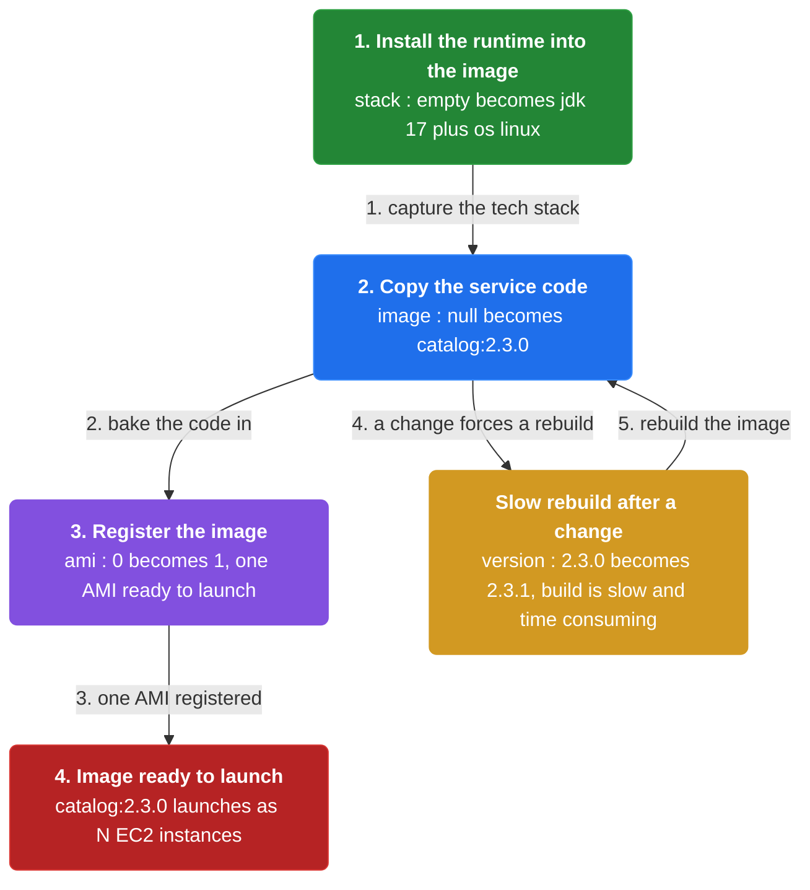

1. **Install the runtime into the image** — The image captures the service's technology stack, such as the JDK and OS.

2. **Copy the service code** — The service code is baked into the image so the instance is self-contained.

3. **Register the image** — The finished image is registered with the IaaS so instances can be launched from it.

```java
// BUILD SIDE — bake a service plus its tech stack into a VM image so each instance boots the same way
// PARTIES: BLD = build pipeline · AMI = the resulting machine image
// STATE (before):
//    image : null                       // no VM image yet
//    stack : {}                         // technology stack captured by the image, empty
// DEF: bake version 2.3.0 · CALLED BY: BLD on release
// -> service : "catalog-service" · -> version : "2.3.0"
//    step 1 · install runtime · stack : {} -> {"jdk":"17","os":"linux"}  BECAUSE the image captures the service's technology stack
//    step 2 · copy code · image : null -> "catalog:2.3.0"                // service code is baked into the image
//    step 3 · register · ami : 0 -> 1                                    BECAUSE one AMI is now registered for launch
// <- ami : "catalog:2.3.0"  · 1 image, ready to launch as N EC2 instances
//    alt rebuild after a change : version : "2.3.0" -> "2.3.1"  BECAUSE building a VM image is slow and time consuming
```

### Deploy each instance as a VM

> **Why this matters:** Each service instance is a separate VM, launched from the shared image. Isolation is strong, and scaling means launching more instances.

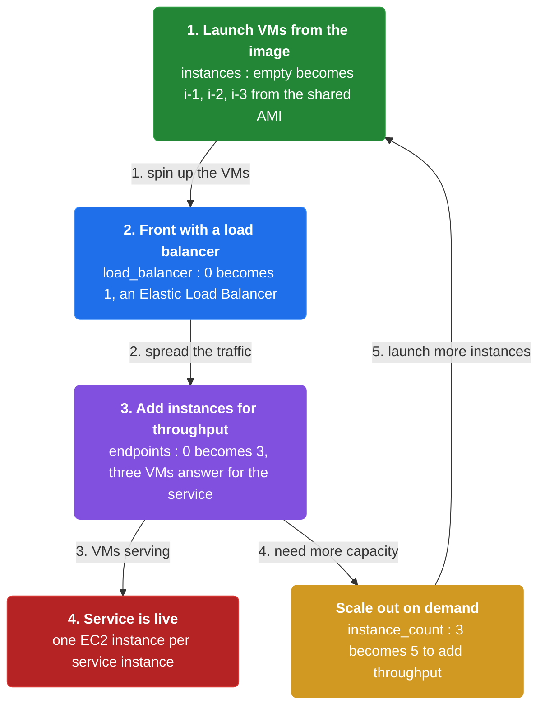

1. **Launch VMs from the image** — Each service instance is a separate VM started from the same image.

2. **Front with a load balancer** — An Elastic Load Balancer fronts the instances and spreads traffic.

3. **Add instances for throughput** — Scaling the service means increasing the number of instances.

```java
// RUNTIME SIDE — deploy one service instance per VM, launched from the shared AMI
// PARTIES: SVC = catalog-service · IaaS = the EC2 cloud
// STATE (before):
//    instances : {}                     // running VMs, none yet
//    ami : "catalog:2.3.0"              // the image every VM is launched from
// DEF: launch 3 instances · CALLED BY: a deploy of catalog-service
// -> instance_count : 3
//    step 1 · launch · instances : {} -> {"i-1","i-2","i-3"}  BECAUSE each instance is a separate VM from the same AMI
//    step 2 · attach · load_balancer : 0 -> 1                 // the Elastic Load Balancer fronts the instances
//    step 3 · serve · endpoints : 0 -> 3                      // 3 VMs now answer for the service
// <- instances : 3  · Netflix-style: one EC2 instance per service instance
//    alt scale out : instance_count : 3 -> 5   BECAUSE you increase the number of instances to add throughput
```

### Scale automatically on load

> **Why this matters:** A service must scale with load. The VM approach gets autoscaling almost for free because the IaaS already provides mature autoscaling groups.

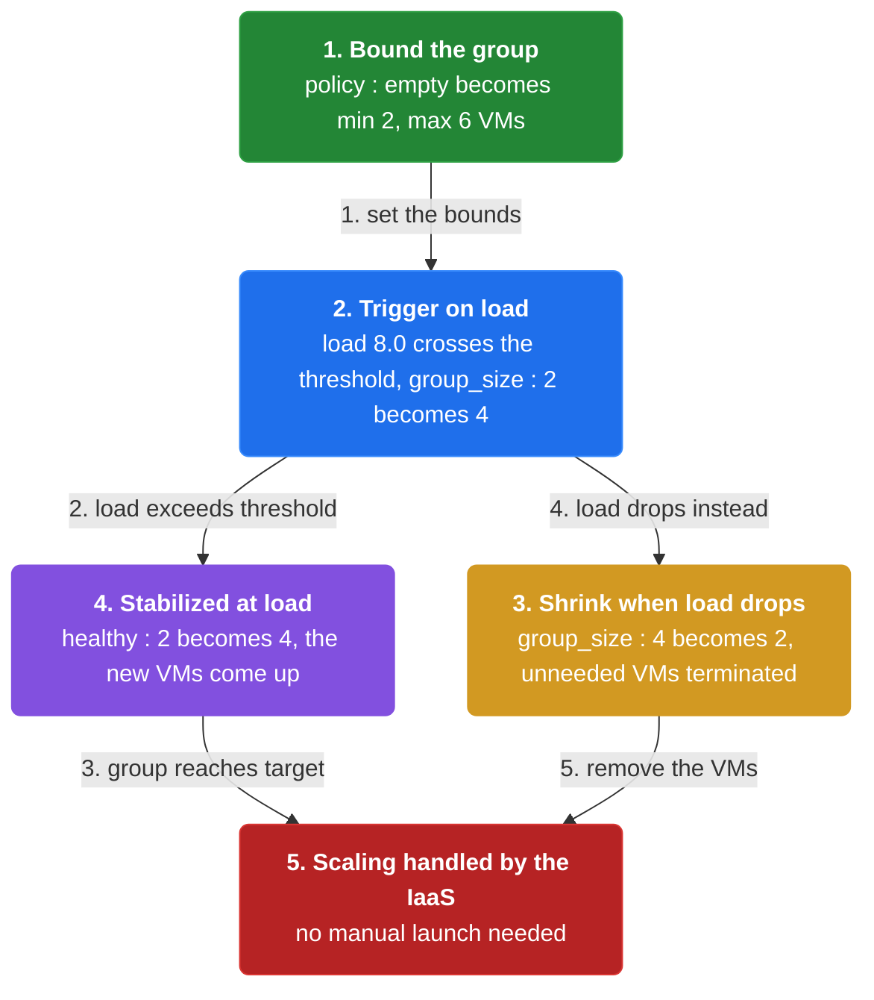

1. **Bound the group** — An autoscaling group is bounded by a minimum and maximum number of VMs.

2. **Trigger on load** — When load crosses a threshold, the group launches more VMs automatically.

3. **Shrink when load drops** — The group terminates VMs when they are no longer needed.

```java
// RUNTIME SIDE — scale the service automatically as load rises, no manual launch
// PARTIES: ASG = autoscaling group · SVC = catalog-service
// STATE (before):
//    group_size : 2                      // current VM count in the group
//    policy : {}                         // scaling policy, not yet triggered
// DEF: react to load 8.0 · CALLED BY: ASG monitoring CPU
// -> load : 8.0
//    step 1 · compare · policy : {} -> {"min":2,"max":6}   BECAUSE the group is bounded between 2 and 6 VMs
//    step 2 · trigger · group_size : 2 -> 4                // load exceeds threshold, so the group adds 2 VMs
//    step 3 · stabilize · healthy : 2 -> 4                 // the 2 new VMs come up healthy, total healthy = 4
// <- group_size : 4  · scaling happened automatically based on load
//    alt load drops : group_size : 4 -> 2   BECAUSE autoscaling removes VMs when they are unneeded
```

### Mature IaaS, slow builds

> **Why this matters:** The VM approach inherits a mature, feature-rich IaaS ecosystem, but every image build is slow and time consuming. That tradeoff defines when this pattern wins.

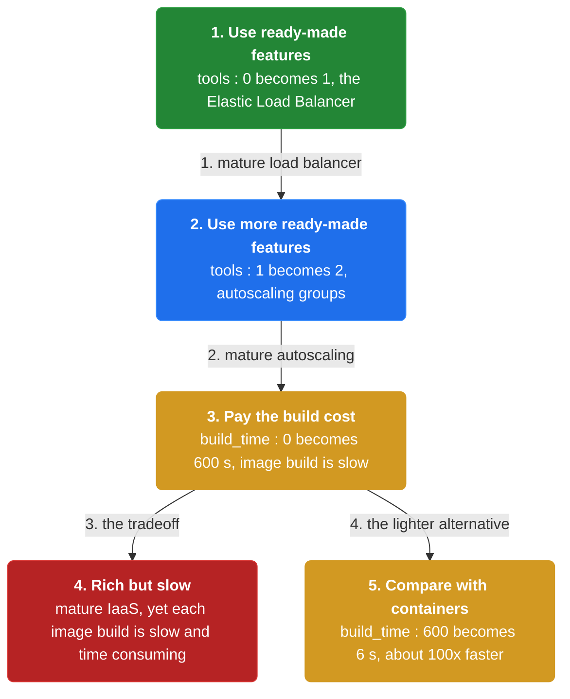

1. **Use ready-made features** — AWS provides mature infrastructure such as the Elastic Load Balancer and autoscaling groups.

2. **Pay the build cost** — Building a VM image is slow and time consuming.

3. **Compare with containers** — A container packages about 100x faster than an AMI, which is why containers are a lighter alternative.

```java
// TRADEOFF SIDE — mature cloud tooling on one side, slow image builds on the other
// PARTIES: VM = the VM approach · BLD = the build pipeline
// STATE (before):
//    image : "catalog:2.3.0"            // the image being rebuilt
//    tools : 0                          // count of ready-made IaaS features in use
//    build_time : 0                     // seconds to produce an image
// DEF: measure deploy of 2.3.0 · CALLED BY: a release engineer
// -> service : "catalog-service"
//    step 1 · use ELB · tools : 0 -> 1       BECAUSE AWS provides a mature load balancer out of the box
//    step 2 · use ASG · tools : 1 -> 2       // autoscaling groups are another ready-made feature
//    step 3 · build · build_time : 0 -> 600  BECAUSE building a VM image is slow and time consuming
// <- tools : 2  · build_time : 600 s  · rich infrastructure, but each image build is slow
//    alt container build : build_time : 600 -> 6   BECAUSE a container packages ~100x faster than an AMI
```


## System Design Interview

**The pipeline:** build pipeline → image (AMI) → IaaS → VM instances

### Build pipeline — the baker

_Role: build pipeline_

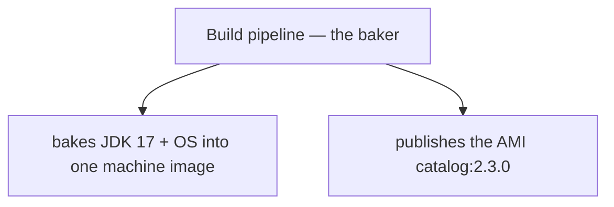

### EC2 IaaS — the provisioner

_Role: IaaS_

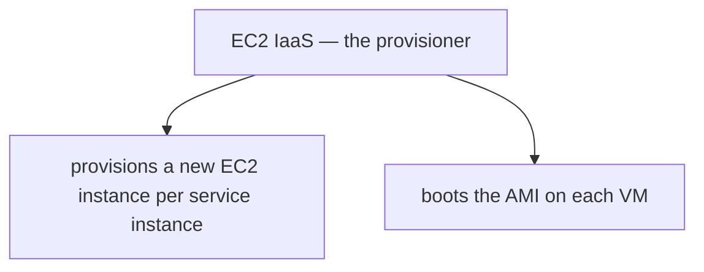

### Auto-scaling group + load balancer

_Role: VM instances_

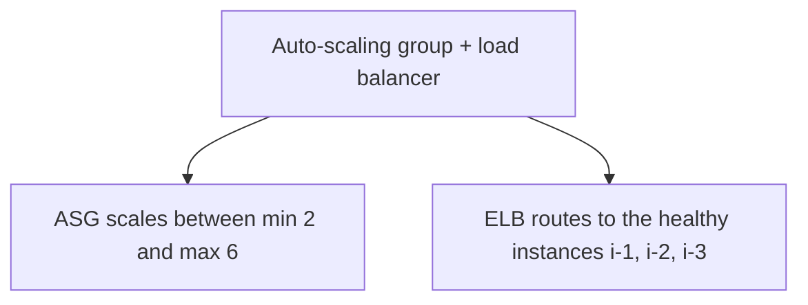

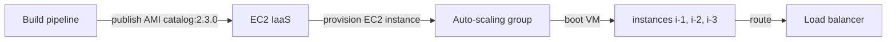

```java
// SYSTEM DESIGN — service per VM: build pipeline -> image (AMI) -> IaaS -> VM instances
// PARTIES: BLD = build pipeline (builder) · REG = AMI catalog (image repository) · IaaS = EC2 infrastructure service (provisions VMs) · ASG = auto-scaling group (scheduler) · ELB = load balancer (routing)
// DEF: image — a baked machine artifact; here AMI catalog:2.3.0 with JDK 17 + OS
// DEF: instance — one EC2 VM running the service; here i-1, i-2, i-3
// STATE (before):
//    instances : { "i-1":"UP", "i-2":"UP", "i-3":"UP" }   // three VMs behind the ELB
//    capacity : 3        // current running count
// DEF: scale_vm · CALLED BY: BLD baking, IaaS provisioning, ASG scaling
// -> image_name : "catalog:2.3.0"
//    step 1 · BLD bakes the AMI with JDK 17 + OS   // image : "" -> "catalog:2.3.0"   BECAUSE the build pipeline packages the runtime into one artifact
//    step 2 · IaaS provisions a fourth EC2 instance   // instances : { "i-1":"UP", "i-2":"UP", "i-3":"UP" } -> { "i-1":"UP", "i-2":"UP", "i-3":"UP", "i-4":"STARTING" }   BECAUSE the ASG raises capacity from 3 toward its max 6
//    step 3 · ELB adds the new VM to rotation   // capacity : 3 -> 4   BECAUSE the load balancer registers i-4
// <- outcome : instances = 4 · min 2, max 6  BECAUSE the ASG scales VM instances from the same AMI catalog:2.3.0
```

## Interview Questions

### Q1

Your catalog service must boot identically on every instance, hiding the JDK version and OS details behind one artifact. You need a machine image that captures the whole technology stack.

**Interviewer's question:** How does the Service per VM pattern produce a deployable machine image?

**Solution:** The image captures the service's technology stack such as the JDK and OS, the service code is baked into the image, and the finished image is registered with the IaaS so instances can be launched from it.

**System-design components:**
- Runtime install — JDK and OS
- Service code — baked in
- Registered image — the AMI
- IaaS — launches instances from it

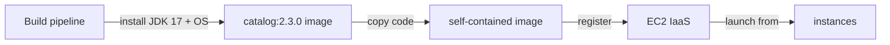

```java
// BUILD SIDE — bake the catalog service plus its tech stack into a VM image so every instance boots the same way
// PARTIES: BLD = build pipeline · IaaS = the EC2 cloud
// STATE (before):
//    image : null                       // no VM image yet
//    stack : {}                         // technology stack captured by the image, empty
// DEF: bake version 2.3.0 · CALLED BY: BLD on release
// -> service : "catalog-service" · -> version : "2.3.0"
//    step 1 · install the runtime   // stack : {} -> {"jdk":"17","os":"linux"}   BECAUSE the image captures the service's technology stack
//    step 2 · copy the service code   // image : null -> "catalog:2.3.0"   // the code is baked in, so the instance is self-contained
//    step 3 · register with the IaaS   // ami : 0 -> 1   BECAUSE one AMI is now registered for launch
// <- ami : "catalog:2.3.0" · one image, ready to launch as N EC2 instances
//    alt rebuild after a change : version : "2.3.0" -> "2.3.1"   BECAUSE building a VM image is slow and time consuming
```

_This is the bake stage — capturing the runtime and code into a self-contained image and registering it with the IaaS._

_Covers:_ Bake a VM image

_From the 28 problems:_ 01-scale-from-zero-to-millions

### Q2

You want each catalog service instance strongly isolated from its neighbors. A shared host with many processes is not acceptable; every instance must be its own machine.

**Interviewer's question:** How does the Service per VM pattern deploy instances, and what fronts them?

**Solution:** Each service instance is a separate VM launched from the shared image, an Elastic Load Balancer fronts the instances and spreads traffic, and scaling means launching more instances.

**System-design components:**
- Separate VM — one per instance
- Shared image — the launch source
- Elastic Load Balancer — fronts them
- More instances — the scaling knob

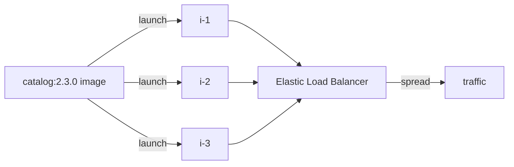

```java
// RUNTIME SIDE — deploy one catalog instance per VM, all launched from the shared AMI
// PARTIES: SVC = catalog-service · IaaS = the EC2 cloud
// STATE (before):
//    instances : {}                     // running VMs, none yet
//    ami : "catalog:2.3.0"              // the image every VM is launched from
// DEF: launch 3 instances · CALLED BY: a deploy of catalog-service
// -> instance_count : 3
//    step 1 · launch the VMs   // instances : {} -> {"i-1","i-2","i-3"}   BECAUSE each instance is a separate VM from the same AMI
//    step 2 · attach the load balancer   // load_balancer : 0 -> 1   // the ELB fronts the instances
//    step 3 · serve   // endpoints : 0 -> 3   // 3 VMs now answer for the service
// <- instances : 3 · Netflix-style: one EC2 instance per service instance
//    alt scale out : instance_count : 3 -> 5   BECAUSE you increase the number of instances to add throughput
```

_This is the launch stage — one VM per instance from the shared image, fronted by an Elastic Load Balancer._

_Covers:_ Deploy each instance as a VM

_From the 28 problems:_ 01-scale-from-zero-to-millions

### Q3

Your catalog service sees a nightly load spike, and you do not want an on-call engineer hand-launching VMs at 2 AM. The IaaS already knows how to scale on load.

**Interviewer's question:** How does the VM approach scale automatically on load?

**Solution:** An autoscaling group is bounded by a minimum and maximum number of VMs; when load crosses a threshold the group launches more VMs automatically, and it terminates VMs when load drops.

**System-design components:**
- Autoscaling group — bounded min/max
- Load threshold — the trigger
- Auto launch — adds VMs
- Auto terminate — removes VMs

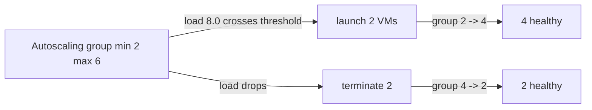

```java
// RUNTIME SIDE — the catalog service scales automatically as load rises, no manual launch
// PARTIES: ASG = autoscaling group · SVC = catalog-service
// STATE (before):
//    group_size : 2                      // current VM count in the group
//    policy : {}                         // scaling policy, not yet triggered
// DEF: react to load 8.0 · CALLED BY: ASG monitoring CPU
// -> load : 8.0
//    step 1 · compare against the bound   // policy : {} -> {"min":2,"max":6}   BECAUSE the group is bounded between 2 and 6 VMs
//    step 2 · trigger on load   // group_size : 2 -> 4   // load crosses the threshold, so the group adds 2 VMs
//    step 3 · stabilize   // healthy : 2 -> 4   // the 2 new VMs come up healthy, total healthy = 4
// <- group_size : 4 · scaling happened automatically based on load
//    alt load drops : group_size : 4 -> 2   BECAUSE autoscaling removes VMs when they are unneeded
```

_This is the autoscaling stage — bounding the group and adding or removing VMs as load crosses the threshold._

_Covers:_ Scale automatically on load

_From the 28 problems:_ 01-scale-from-zero-to-millions

### Q4

You must choose between the VM approach and containers. The VM path gives you ready-made AWS features, but every image build feels painfully slow.

**Interviewer's question:** What mature IaaS features does the VM approach inherit, and what is its main drawback?

**Solution:** AWS provides mature features such as the Elastic Load Balancer and autoscaling groups; the drawback is that building a VM image is slow and time consuming, while a container packages about 100x faster than an AMI.

**System-design components:**
- Elastic Load Balancer — ready-made
- Autoscaling groups — ready-made
- Slow image build — the cost
- ~100x faster container — the contrast

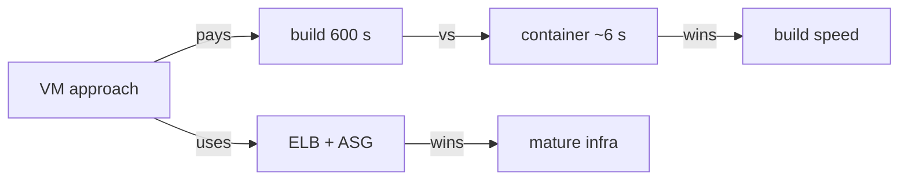

```java
// TRADEOFF SIDE — mature cloud tooling on one side, slow image builds on the other
// PARTIES: VM = the VM approach · BLD = the build pipeline
// STATE (before):
//    tools : 0                          // count of ready-made IaaS features in use
//    build_time : 0                     // seconds to produce an image
// DEF: measure deploy of 2.3.0 · CALLED BY: a release engineer
// -> service : "catalog-service"
//    step 1 · use the Elastic Load Balancer   // tools : 0 -> 1   BECAUSE AWS provides a mature load balancer out of the box
//    step 2 · use autoscaling groups   // tools : 1 -> 2   // another ready-made feature
//    step 3 · build the image   // build_time : 0 -> 600   BECAUSE building a VM image is slow and time consuming
// <- tools : 2 · build_time : 600 s · rich infrastructure, but each image build is slow
//    alt container build : build_time : 600 -> 6   BECAUSE a container packages ~100x faster than an AMI
```

_This is the tradeoff stage — mature AWS features in exchange for slow image builds that containers do ~100x faster._

_Covers:_ Mature IaaS, slow builds

_From the 28 problems:_ 01-scale-from-zero-to-millions

## Key Concepts

### The Problem

**How to package services that must scale and isolate.** Each instance must be isolated from the others and constrained in the CPU and memory it consumes, while the whole thing must be deployed reliably and cost-effectively.


### The Solution

Package the service as a virtual machine image and deploy each service instance as a separate VM.


### Key Facts

| Fact | Detail | In the wild |
|---|---|---|
| A VM image per service | Package the service as a virtual machine image and deploy each service instance as a separate VM. | A VM imposes limits on CPU and memory and keeps each instance isolated. |
| Mature, feature-rich IaaS | IaaS solutions such as AWS provide a mature and feature-rich infrastructure for deploying and managing virtual machines. | Netflix relies on this mature AWS tooling to run each service as an EC2 instance. |
| Slow image builds | Building a VM image is slow and time consuming, which works against rapid iteration. | Teams that need frequent redeploys prefer containers, which package about 100x faster than an AMI. |


### Tradeoffs & When

- IaaS solutions such as AWS provide a mature and feature-rich infrastructure for deploying and managing virtual machines.
- Building a VM image is slow and time consuming, which works against rapid iteration.


<details><summary>All concepts (index)</summary>

### Problem: How to package services that must scale and isolate

**Why.** Services are written in a variety of languages, frameworks, and versions, and each service runs as multiple instances that must be independently deployable and scalable.

**Claim.** Each instance must be isolated from the others and constrained in the CPU and memory it consumes, while the whole thing must be deployed reliably and cost-effectively.

**Grounding.** The pattern forces are identical to those of the container pattern: variety of technologies, multiple instances, isolation, and cost-effective deployment.

**In the wild.** These forces are what drive teams toward a per-VM or per-container packaging choice.
### Solution: A VM image per service

**Why.** You want the technology stack encapsulated so all services start and stop the same way.

**Claim.** Package the service as a virtual machine image and deploy each service instance as a separate VM.

**Grounding.** The solution states the service is packaged as a VM image; the example is Netflix packaging each service as an EC2 AMI and deploying each instance as an EC2 instance.

**In the wild.** A VM imposes limits on CPU and memory and keeps each instance isolated.
### Tradeoff: Mature, feature-rich IaaS

**Why.** You want deployment to be reliable without building every capability yourself.

**Claim.** IaaS solutions such as AWS provide a mature and feature-rich infrastructure for deploying and managing virtual machines.

**Grounding.** The resulting context names the Elastic Load Balancer and autoscaling groups as ready-made features, and notes autoscaling can react to load automatically.

**In the wild.** Netflix relies on this mature AWS tooling to run each service as an EC2 instance.
### Tradeoff: Slow image builds

**Why.** You need to be able to quickly build and deploy a service.

**Claim.** Building a VM image is slow and time consuming, which works against rapid iteration.

**Grounding.** The resulting context lists slow image builds as the main drawback of the VM approach.

**In the wild.** Teams that need frequent redeploys prefer containers, which package about 100x faster than an AMI.

</details>


## Quiz

1. What is the solution of the Service per VM pattern?

   - A. Package each service as a virtual machine image and deploy each instance as a separate VM
   - B. Package each service as a container image and deploy each instance as a container
   - C. Deploy each service as a JAR on a shared machine
   - D. Run each service inside a serverless function

<details><summary>Reveal answer</summary>

**A.** The pattern packages the service as a virtual machine image and deploys each instance as a separate VM (A). B is the container pattern, C is language-specific packaging, and D is serverless deployment.

</details>

2. Which company is given as the example of the Service per VM pattern?

   - A. Google
   - B. Amazon
   - C. Netflix
   - D. Spotify

<details><summary>Reveal answer</summary>

**C.** The reference uses Netflix, which packages each service as an EC2 AMI and deploys each instance as an EC2 instance (C). The others are not named.

</details>

3. What does the reference identify as the main drawback of the VM approach?

   - A. Instances are not isolated
   - B. Building a VM image is slow and time consuming
   - C. Services cannot be scaled
   - D. The technology stack is not encapsulated

<details><summary>Reveal answer</summary>

**B.** Building a VM image is slow and time consuming (B). The other options contradict the listed benefits: VMs are isolated, scalable, and encapsulate the tech stack.

</details>

4. Which mature IaaS features does the reference name for the VM approach?

   - A. Elastic Load Balancer and autoscaling groups
   - B. Docker and Kubernetes
   - C. AWS Lambda and API Gateway
   - D. Kinesis and S3

<details><summary>Reveal answer</summary>

**A.** The reference names the Elastic Load Balancer and autoscaling groups as mature AWS features (A). Docker and Kubernetes are container tooling, and Lambda, API Gateway, Kinesis, and S3 are not the VM-management features listed here.

</details>

