# Chapter 39: Language-Specific Packaging Format

> Deploy each service as a language-specific package — a Java JAR or WAR, a Node.js directory of modules, or a Go OS-specific executable.

_Also known as: Chris Richardson · Microservice Patterns p.387 · microservices.io /patterns/deployment/language-specific-packaging-format.html_

## Flow

### Package the service in its own language

> **Why this matters:** Every language has a native package format. Shipping that format directly is the simplest possible deployment, and its drawbacks are what motivate every other deployment option.

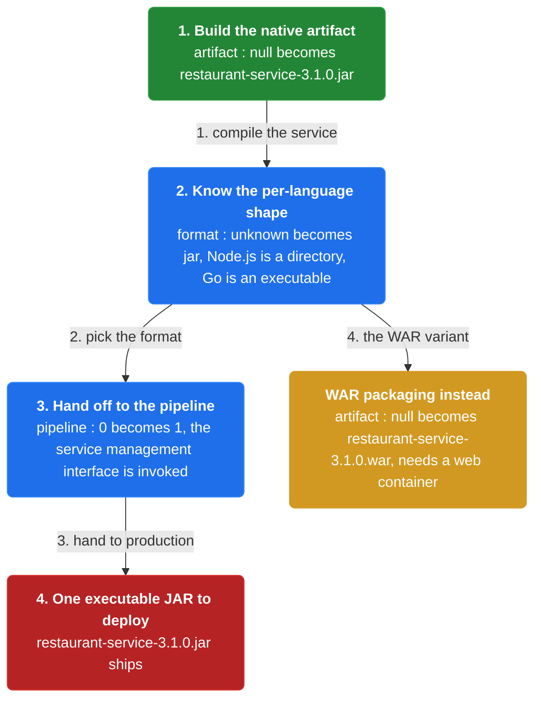

1. **Build the native artifact** — A Spring Boot Java service builds to an executable JAR file, or a WAR file.

2. **Know the per-language shape** — For Node.js a service is a directory of source code and modules; for Go it is an OS-specific executable.

3. **Hand off to the pipeline** — The deployment pipeline builds the JAR or WAR and invokes the production environment's service management interface.

```java
// BUILD SIDE — package the service in its language's native format so the pipeline can ship one artifact
// PARTIES: BLD = deployment pipeline · SVC = Restaurant Service
// STATE (before):
//    artifact : null                    // nothing built yet
//    src : "restaurant-service"         // Spring Boot Java source
// DEF: build version 3.1.0 · CALLED BY: BLD on commit
// -> service : "restaurant-service" · -> version : "3.1.0"
//    step 1 · compile · artifact : null -> "restaurant-service-3.1.0.jar"  BECAUSE a Spring Boot app packages as an executable JAR
//    step 2 · choose format · format : "unknown" -> "jar"                   // a JAR or WAR; a WAR would add a web container
//    step 3 · hand off · pipeline : 0 -> 1                                  BECAUSE the pipeline invokes the service management interface
// <- artifact : "restaurant-service-3.1.0.jar"  · one executable JAR to deploy
//    alt WAR packaging : artifact : null -> "restaurant-service-3.1.0.war"  BECAUSE a WAR also needs a web container installed
```

### Install the runtime and start the service

> **Why this matters:** The package does not carry its own runtime. The machine must be configured first — the JDK for a JAR, plus a web container such as Tomcat for a WAR — before the service can run.

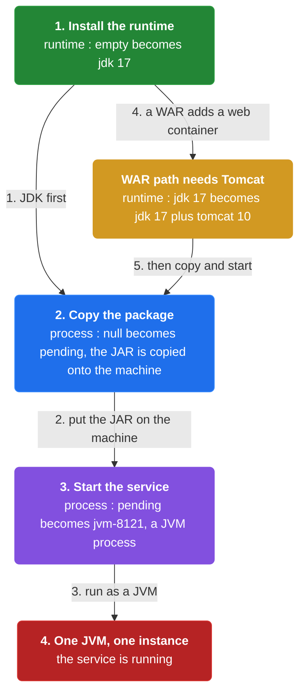

1. **Install the runtime** — For a Java service you install the JDK first; a WAR additionally needs Apache Tomcat.

2. **Copy the package** — Once the machine is configured, you copy the package to the machine.

3. **Start the service** — Each service instance runs as a JVM process.

```java
// RUNTIME SIDE — configure a machine, copy the package, and start it as a JVM process
// PARTIES: MACH = the production machine · SVC = Restaurant Service
// STATE (before):
//    runtime : {}                       // software installed on the machine, none yet
//    process : null                     // no service process running yet
// DEF: deploy JAR 3.1.0 · CALLED BY: the service management interface
// -> artifact : "restaurant-service-3.1.0.jar"
//    step 1 · install JDK · runtime : {} -> {"jdk":"17"}   BECAUSE a Java service needs the JDK installed first
//    step 2 · copy package · process : null -> "pending"   // the JAR is copied onto the machine
//    step 3 · start · process : "pending" -> "jvm-8121"    // the service starts as a JVM process
// <- process : "jvm-8121"  · one JVM running one service instance
//    alt WAR path : runtime : {"jdk":"17"} -> {"jdk":"17","tomcat":"10"}  BECAUSE a WAR also needs Apache Tomcat installed
```

### Run several instances on one machine

> **Why this matters:** You are not forced to one instance per machine. Multiple JVMs can run on a single machine, each running a single service instance.

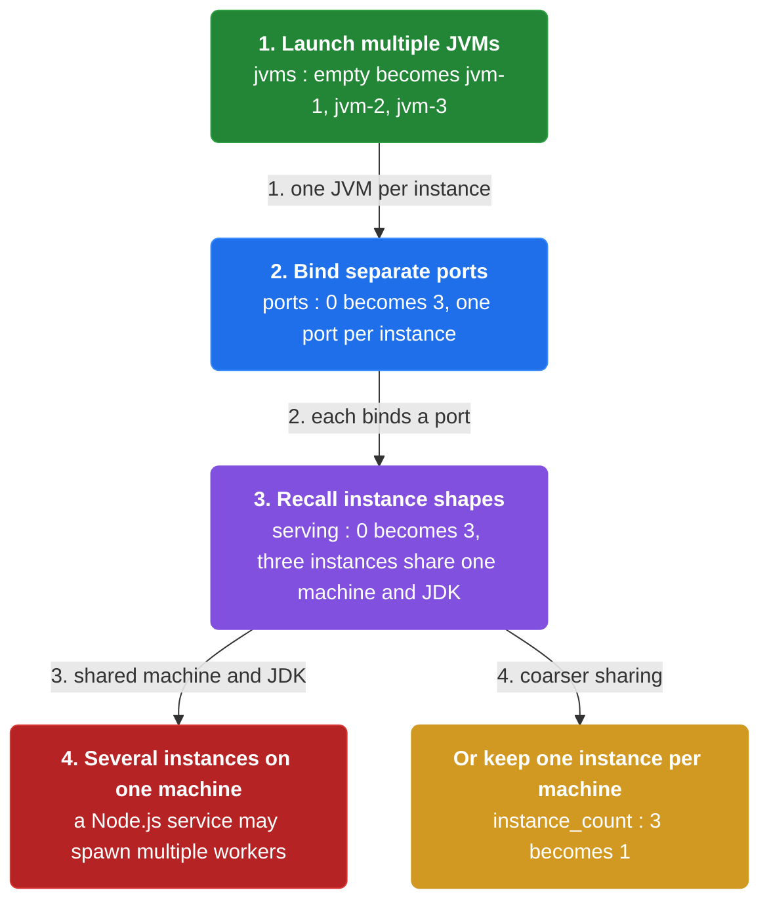

1. **Launch multiple JVMs** — Each JVM runs a single service instance, and a machine can host several JVMs.

2. **Bind separate ports** — Each instance binds its own port on the shared machine.

3. **Recall instance shapes** — An instance is usually a single process, but a Node.js service may spawn multiple worker processes.

```java
// RUNTIME SIDE — run several service instances on one machine, one JVM per instance
// PARTIES: MACH = the production machine · SVC = Restaurant Service
// STATE (before):
//    jvms : {}                          // JVM processes on this machine, none yet
//    jar : "restaurant-service-3.1.0.jar"
// DEF: start 3 instances · CALLED BY: a scale-up on one machine
// -> instance_count : 3
//    step 1 · launch JVMs · jvms : {} -> {"jvm-1","jvm-2","jvm-3"}  BECAUSE each JVM runs a single service instance
//    step 2 · bind ports · ports : 0 -> 3                          // each instance binds its own port on the machine
//    step 3 · serve · serving : 0 -> 3                             // 3 instances share the same machine and JDK
// <- instances : 3  · multiple JVMs share one machine
//    alt single instance : instance_count : 3 -> 1   BECAUSE some deployments keep one instance per machine
```

### Why this option motivates the others

> **Why this matters:** The language-specific package leaves the runtime outside the artifact, so the machine must be configured by hand. That unmanaged, shared runtime is exactly what the VM and container options fix by encapsulating the stack.

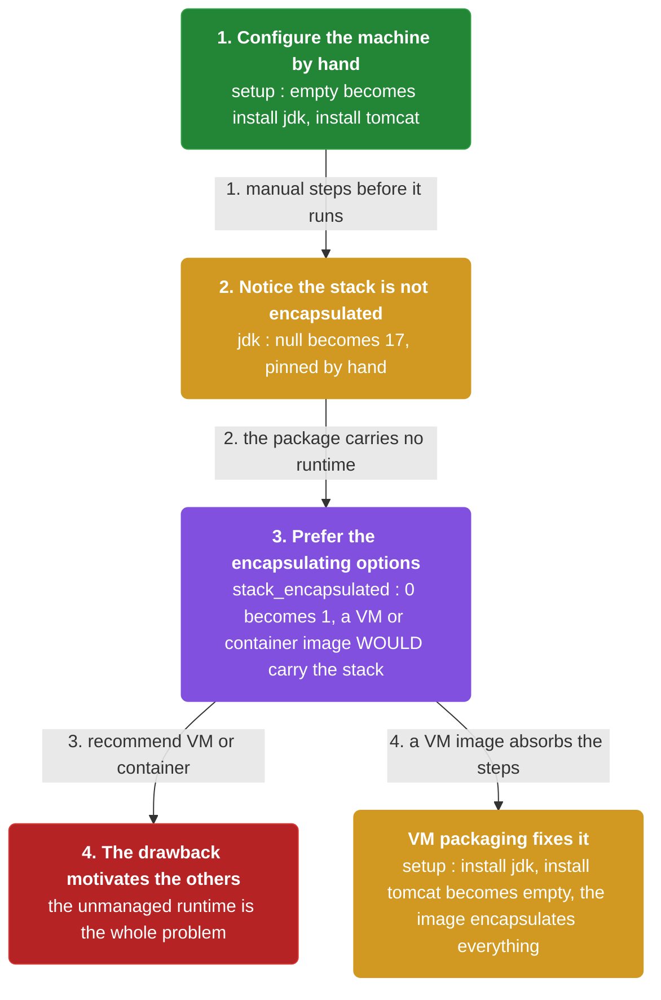

1. **Configure the machine by hand** — The JDK and, for a WAR, Tomcat must be installed and pinned before the service runs.

2. **Notice the stack is not encapsulated** — Unlike a VM or container image, the package does not carry its technology stack.

3. **Prefer the encapsulating options** — The book recommends one of the other options; this pattern's drawbacks motivate them.

```java
// TRADEOFF SIDE — the package runs on a shared, hand-configured runtime, which motivates VM and container packaging
// PARTIES: MACH = the machine · SVC = Restaurant Service
// STATE (before):
//    setup : []                         // manual steps required before the service can run
//    jdk : null                         // the runtime, not yet installed
// DEF: prepare machine for 3.1.0 · CALLED BY: an operator
// -> service : "restaurant-service"
//    step 1 · install runtime · setup : [] -> ["install jdk","install tomcat"]  BECAUSE the package does not carry its own runtime
//    step 2 · configure · jdk : null -> "17"                                     // the operator pins the JDK version by hand
//    step 3 · contrast · stack_encapsulated : 0 -> 1                             BECAUSE a VM or container image WOULD encapsulate the stack
// <- setup : 2 manual steps  · this unmanaged runtime is the drawback that motivates the other options
//    alt VM packaging : setup : ["install jdk","install tomcat"] -> []  BECAUSE a VM image encapsulates the whole technology stack
```


## System Design Interview

> **The question:** Design packaging for a JVM service. Premise: the build pipeline produces a language-specific package, and the machine runs it in a JVM process, so the runtime and the package match the language.

**The pipeline:** build pipeline → package → machine (runtime) → JVM process

### Deployment pipeline — the builder

_Role: build pipeline_

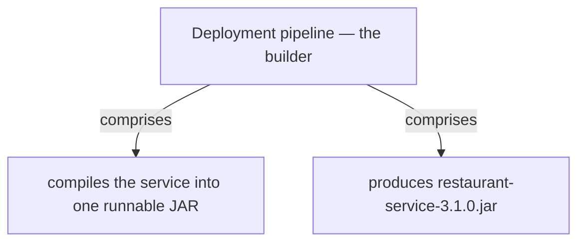

### Machine — the runtime host

_Role: machine (runtime)_

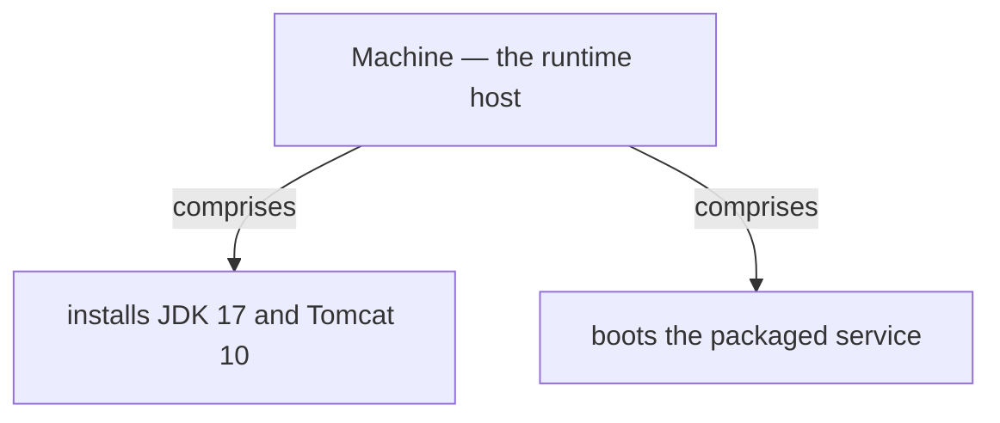

### JVM process — the running service

_Role: JVM process_

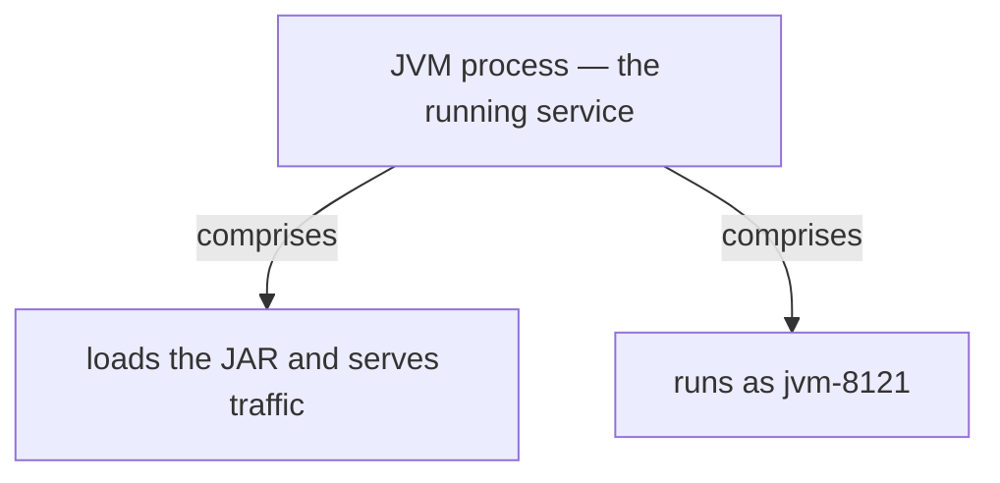

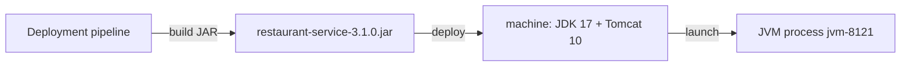

```java
// SYSTEM DESIGN — language-specific packaging: build pipeline -> package -> machine (runtime) -> JVM process
// PARTIES: BLD = deployment pipeline (builder) · PKG = restaurant-service-3.1.0.jar (the package) · MACH = machine (server host) · JVM = JVM process jvm-8121 (the runtime)
// DEF: package — the language-specific artifact; here restaurant-service-3.1.0.jar (a JAR)
// DEF: runtime — the software the package needs; here JDK 17 plus Tomcat 10
// STATE (before):
//    runtime : {}        // nothing installed yet
//    process : ""        // no JVM process yet
// DEF: deploy_jar · CALLED BY: BLD building, MACH provisioning, JVM serving
// -> artifact : "restaurant-service-3.1.0.jar"
//    step 1 · BLD produces the JAR   // package : "" -> "restaurant-service-3.1.0.jar"   BECAUSE the build pipeline compiles the service into one runnable JAR
//    step 2 · MACH installs JDK 17 and Tomcat 10   // runtime : {} -> { "jdk":17, "tomcat":10 }   BECAUSE a JAR needs the JDK and a web container to run
//    step 3 · the JVM starts and serves   // process : "" -> "jvm-8121"   BECAUSE the machine launches the packaged service
// <- outcome : process = "jvm-8121" · restaurant-service serves  BECAUSE the JAR plus JDK 17 plus Tomcat 10 boot one JVM process
```

## Interview Questions

### Q1

Your team wants the simplest possible deployment: build the service in its own language and ship that artifact directly, without a VM or container image in the middle.

**Interviewer's question:** What is the language-specific package for a Java service, and how does the pipeline ship it?

**Solution:** A Spring Boot Java service builds to an executable JAR file or a WAR file; the deployment pipeline builds the JAR or WAR and invokes the production environment's service management interface.

**System-design components:**
- Executable JAR — the Java artifact
- WAR — the web-container variant
- Deployment pipeline — builds it
- Service management interface — the handoff

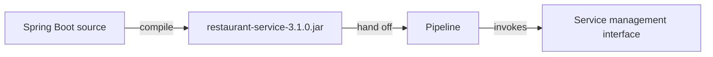

```java
// BUILD SIDE — package the service in its language's native format so the pipeline can ship one artifact
// PARTIES: BLD = deployment pipeline · SVC = Restaurant Service
// STATE (before):
//    artifact : null                    // nothing built yet
//    src : "restaurant-service"         // Spring Boot Java source
// DEF: build version 3.1.0 · CALLED BY: BLD on commit
// -> service : "restaurant-service" · -> version : "3.1.0"
//    step 1 · compile the source   // artifact : null -> "restaurant-service-3.1.0.jar"   BECAUSE a Spring Boot app packages as an executable JAR
//    step 2 · choose the format   // format : "unknown" -> "jar"   // a JAR or WAR; a WAR would add a web container
//    step 3 · hand off   // pipeline : 0 -> 1   BECAUSE the pipeline invokes the service management interface
// <- artifact : "restaurant-service-3.1.0.jar" · one executable JAR to deploy
//    alt WAR packaging : artifact : null -> "restaurant-service-3.1.0.war"   BECAUSE a WAR also needs a web container installed
```

_This is the packaging stage — building the language's native JAR or WAR and handing it to the service management interface._

_Covers:_ Package the service in its own language

_From the 28 problems:_ 01-scale-from-zero-to-millions

### Q2

The JAR you shipped will not start on a bare machine, because it does not carry its own runtime. Someone must configure the machine first.

**Interviewer's question:** What must be installed and done before a Java package runs, and how does the service start?

**Solution:** For a Java service you install the JDK first, and a WAR additionally needs Apache Tomcat; then you copy the package to the machine and start it, so each service instance runs as a JVM process.

**System-design components:**
- JDK — the required runtime
- Apache Tomcat — for a WAR
- Package copy — onto the machine
- JVM process — the running instance

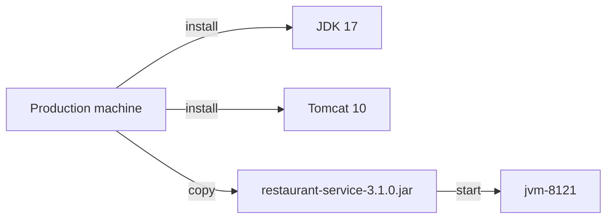

```java
// RUNTIME SIDE — configure a machine, copy the package, and start it as a JVM process
// PARTIES: MACH = the production machine · SVC = Restaurant Service
// STATE (before):
//    runtime : {}                       // software installed on the machine, none yet
//    process : null                     // no service process running yet
// DEF: deploy JAR 3.1.0 · CALLED BY: the service management interface
// -> artifact : "restaurant-service-3.1.0.jar"
//    step 1 · install the JDK   // runtime : {} -> {"jdk":"17"}   BECAUSE a Java service needs the JDK installed first
//    step 2 · copy the package   // process : null -> "pending"   // the JAR is copied onto the machine
//    step 3 · start   // process : "pending" -> "jvm-8121"   // the service starts as a JVM process
// <- process : "jvm-8121" · one JVM running one service instance
//    alt WAR path : runtime : {"jdk":"17"} -> {"jdk":"17","tomcat":"10"}   BECAUSE a WAR also needs Apache Tomcat installed
```

_This is the start stage — installing the runtime, copying the package, and running each instance as a JVM process._

_Covers:_ Install the runtime and start the service

_From the 28 problems:_ 01-scale-from-zero-to-millions

### Q3

You are not forced to dedicate a whole machine to one instance. You want three instances of the restaurant service running on a single box to save hardware.

**Interviewer's question:** How do several instances of a Java service run on one machine, and what does each bind?

**Solution:** Each JVM runs a single service instance and a machine can host several JVMs; each instance binds its own port on the shared machine, and a Node.js service may spawn multiple worker processes instead.

**System-design components:**
- Multiple JVMs — one per instance
- One machine — the shared host
- Separate ports — per instance
- Node.js workers — the process alternative

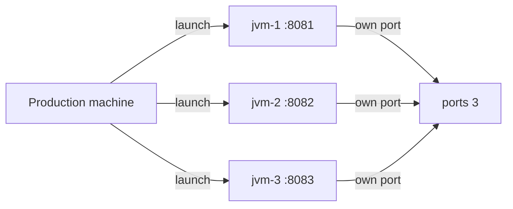

```java
// RUNTIME SIDE — run three service instances on one machine, one JVM per instance, each on its own port
// PARTIES: MACH = the production machine · SVC = Restaurant Service
// STATE (before):
//    jvms : {}                          // JVM processes on this machine, none yet
//    jar : "restaurant-service-3.1.0.jar"
// DEF: start 3 instances · CALLED BY: a scale-up on one machine
// -> instance_count : 3
//    step 1 · launch the JVMs   // jvms : {} -> {"jvm-1","jvm-2","jvm-3"}   BECAUSE each JVM runs a single service instance
//    step 2 · bind the ports   // ports : 0 -> 3   // each instance binds its own port on the machine
//    step 3 · serve   // serving : 0 -> 3   // 3 instances share the same machine and JDK
// <- instances : 3 · multiple JVMs share one machine
//    alt single instance : instance_count : 3 -> 1   BECAUSE some deployments keep one instance per machine
```

_This is the multi-instance stage — several JVMs on one machine, each binding its own port._

_Covers:_ Run several instances on one machine

_From the 28 problems:_ 01-scale-from-zero-to-millions

### Q4

Your JAR works, but the machine setup was manual and fragile: the JDK and Tomcat were hand-pinned, and no two machines are guaranteed to match.

**Interviewer's question:** Why does this pattern's drawback motivate the VM and container options?

**Solution:** The package does not carry its technology stack, so the machine must be configured with the JDK and Tomcat by hand; the VM and container patterns fix this by encapsulating the stack in the image.

**System-design components:**
- Hand-configured machine — the manual step
- No encapsulated stack — the gap
- VM image — encapsulates the stack
- Container image — the lighter alternative

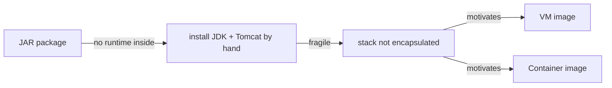

```java
// TRADEOFF SIDE — the package runs on a shared, hand-configured runtime, which motivates VM and container packaging
// PARTIES: MACH = the machine · SVC = Restaurant Service
// STATE (before):
//    setup : []                         // manual steps required before the service can run
//    jdk : null                         // the runtime, not yet installed
// DEF: prepare machine for 3.1.0 · CALLED BY: an operator
// -> service : "restaurant-service"
//    step 1 · install the runtime   // setup : [] -> ["install jdk","install tomcat"]   BECAUSE the package does not carry its own runtime
//    step 2 · pin the JDK by hand   // jdk : null -> "17"   // the operator configures the version manually
//    step 3 · contrast with the alternatives   // stack_encapsulated : 0 -> 1   BECAUSE a VM or container image WOULD encapsulate the stack
// <- setup : 2 manual steps · this unmanaged runtime is the drawback that motivates the other options
//    alt VM packaging : setup : ["install jdk","install tomcat"] -> []   BECAUSE a VM image encapsulates the whole technology stack
```

_This is the motivation stage — the unencapsulated runtime is the drawback that pushes teams to VM and container images._

_Covers:_ Why this option motivates the others

_From the 28 problems:_ 01-scale-from-zero-to-millions

## Key Concepts

### The Problem

**A package that needs a pre-installed runtime.** With a language-specific package, what is deployed is the package itself, and the machine must be configured with the runtime before the service can run.


### The Solution

Deploy the service in its language-specific package: an executable JAR or WAR for Java, a directory of source code and modules for Node.js, or an OS-specific executable for Go.


### Key Facts

| Fact | Detail | In the wild |
|---|---|---|
| Deploy the language-specific package | Deploy the service in its language-specific package: an executable JAR or WAR for Java, a directory of source code and modules for Node.js, or an OS-specific executable for Go. | A Java service instance is a process running the JVM; a Node.js service may spawn multiple worker processes. |
| One JVM per instance, many per machine | You can run multiple JVMs on a single machine, each JVM running a single service instance. | This gives coarser resource sharing than the VM or container patterns, where isolation is stronger. |
| The runtime is not encapsulated | Because the package does not carry its runtime, the machine must be configured first, which is a drawback. | Teams that want the stack bundled choose the VM or container options instead. |


### Tradeoffs & When

- You can run multiple JVMs on a single machine, each JVM running a single service instance.
- Because the package does not carry its runtime, the machine must be configured first, which is a drawback.


<details><summary>All concepts (index)</summary>

### Problem: A package that needs a pre-installed runtime

**Why.** A production environment must let developers create, update, and configure services, keep the desired number of instances running, monitor them, and route requests to them.

**Claim.** With a language-specific package, what is deployed is the package itself, and the machine must be configured with the runtime before the service can run.

**Grounding.** The book walks through deploying the Spring Boot Restaurant Service: install the JDK, and for a WAR install Apache Tomcat, then copy the package and start the service.

**In the wild.** Each service instance then runs as a JVM process on the configured machine.
### Solution: Deploy the language-specific package

**Why.** It is the simplest deployment option, and it is worth exploring even when you will choose another option.

**Claim.** Deploy the service in its language-specific package: an executable JAR or WAR for Java, a directory of source code and modules for Node.js, or an OS-specific executable for Go.

**Grounding.** The pattern text names each language's package shape and shows the deployment pipeline building an executable JAR or WAR and handing it to the service management interface.

**In the wild.** A Java service instance is a process running the JVM; a Node.js service may spawn multiple worker processes.
### Tradeoff: One JVM per instance, many per machine

**Why.** You may want to run more than one instance on a machine without extra packaging work.

**Claim.** You can run multiple JVMs on a single machine, each JVM running a single service instance.

**Grounding.** Figure 12.4 in the book shows multiple JVM processes on one machine, each running one service instance, and notes some languages support several instances per process.

**In the wild.** This gives coarser resource sharing than the VM or container patterns, where isolation is stronger.
### Tradeoff: The runtime is not encapsulated

**Why.** Deployment should be reliable and repeatable across machines.

**Claim.** Because the package does not carry its runtime, the machine must be configured first, which is a drawback.

**Grounding.** The book explicitly says its drawbacks motivate the other options, and the VM and container patterns are described as encapsulating the service's technology stack.

**In the wild.** Teams that want the stack bundled choose the VM or container options instead.

</details>


## Quiz

1. What is deployed and managed when using the Language-specific packaging format?

   - A. A container image
   - B. A virtual machine image
   - C. The service in its language-specific package, such as a JAR or WAR
   - D. A serverless function

<details><summary>Reveal answer</summary>

**C.** What is deployed is the service in its language-specific package — an executable JAR or WAR for Java (C). A container image, VM image, and serverless function are the other three deployment options.

</details>

2. What must you install before deploying a Java WAR file?

   - A. Only the JDK
   - B. The JDK and a web container such as Apache Tomcat
   - C. Docker
   - D. Nothing — the WAR carries its own runtime

<details><summary>Reveal answer</summary>

**B.** For a WAR file you install the JDK and also a web container such as Apache Tomcat (B). A JAR needs only the JDK; the WAR does not carry its runtime.

</details>

3. How does a Java service instance run in production?

   - A. As a JVM process
   - B. As a Kubernetes pod
   - C. As a Lambda function
   - D. As a Docker daemon

<details><summary>Reveal answer</summary>

**A.** A Java service instance is a process running the JVM (A). Pods, Lambda functions, and the Docker daemon belong to other deployment patterns.

</details>

4. Why does the book say this pattern's drawbacks motivate the other options?

   - A. The package does not encapsulate the technology stack, so the runtime must be installed and configured by hand
   - B. The package runs too fast
   - C. The package is impossible to scale
   - D. The package requires Kubernetes

<details><summary>Reveal answer</summary>

**A.** The language-specific package leaves the runtime outside, so a machine must be configured with the JDK and Tomcat before the service runs (A); the VM and container options fix this by encapsulating the stack. The other options are not the stated reason.

</details>

