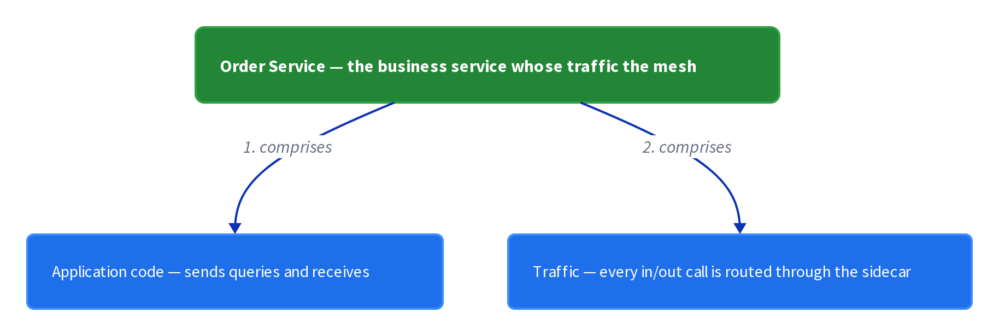
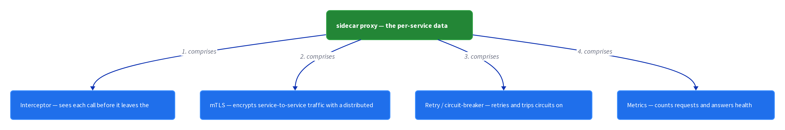
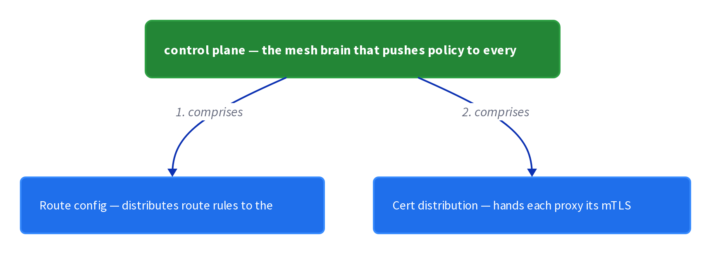

# Chapter 40: Service Mesh

> Use a service mesh that mediates all communication in and out of each service to handle cross-cutting concerns.

_Also known as: Chris Richardson · Microservice Patterns p.380 · microservices.io /patterns/deployment/service-mesh.html_

## Flow

### Mediate all traffic through the mesh

> **Why this matters:** Every service has cross-cutting concerns to implement, and repeating them in each service is error-prone. A mesh that mediates all communication in and out moves those concerns out of the service code.

1. **Sit between the service and the network** — The mesh mediates every call in and out of each service.

2. **Intercept the outbound call** — A proxy attached to the service sees each request before it leaves.

3. **Apply the concern at the proxy** — Cross-cutting behavior is applied on the traffic, not inside the service.

```java
// MESH SIDE — a proxy intercepts every call out of a service, mediating all communication
// PARTIES: SVC = Order Service · PROXY = its sidecar proxy · DB = PostgreSQL 16 @ orders-db-1
// STATE (before):
//    request : {}                       // the outbound call, not yet intercepted
//    trace_id : null                    // no distributed-tracing id yet
// DEF: intercept outbound call 1 to DB · CALLED BY: SVC sending a query
// -> call : "SELECT * FROM orders" · -> target : "db:5432"
//    step 1 · intercept · request : {} -> {"call":"SELECT * FROM orders","to":"db:5432"}  BECAUSE the mesh mediates ALL traffic in and out
//    step 2 · trace · trace_id : null -> "trc-9f2a"                                        // the proxy assigns a unique id to the request
//    step 3 · forward · sent : 0 -> 1                                                      // the proxy forwards the traced call to the DB
// <- call : "SELECT * FROM orders" delivered to db:5432 · trace_id "trc-9f2a" attached
//    alt inbound reply : reply : 0 -> 1   BECAUSE the same proxy also mediates the response back into SVC
```

### Distributed tracing across services

> **Why this matters:** When one external request fans out across services, you need to reconstruct the whole chain. The mesh instruments services with a unique identifier that is passed between them.

1. **Assign a unique id** — The proxy gives each external request a unique identifier.

2. **Pass the id between services** — The same id travels with the request from one service to the next.

3. **Record a span per hop** — Each service hop records a span against the shared id so the chain is reconstructable.

```java
// MESH SIDE — one unique id travels with the request across services so a call chain can be traced
// PARTIES: U1 = a user request · PROXY = sidecar of Order Service · SVCB = Customer Service
// DEF: trace — the whole chain of spans that share one trace_id for a single request; here trace_id "trc-9f2a" = the order-service -> customer-service chain
// STATE (before):
//    trace_id : "trc-9f2a"              // id assigned at the first proxy
//    hops : []                          // services the request has passed through
// DEF: propagate id trc-9f2a to next hop · CALLED BY: Order Service calling Customer Service
// -> next : "customer-service"
//    step 1 · carry · hops : [] -> ["order-service"]   BECAUSE the proxy passes the SAME unique id between services
//    step 2 · forward · hops : ["order-service"] -> ["order-service","customer-service"]  // the id rides to the next service
//    step 3 · record · spans : 0 -> 1                    // each hop records a span against the shared id
// <- trace_id : "trc-9f2a"  · spans : 1  · the whole chain is reconstructable from one id
//    alt untraced call : trace_id : "trc-9f2a" -> null   BECAUSE a call that bypasses the mesh carries no id
```

### Health checks and metrics

> **Why this matters:** Operators need to know whether a service is up and how it is performing. The mesh exposes a health URL and records metrics without changing the service.

1. **Expose a health URL** — The proxy provides a URL a monitoring service can ping to determine the health of the application.

2. **Record metrics** — The proxy measures what the application is doing and how it is performing.

3. **Report the measurements** — The measurements are emitted to the monitoring service.

```java
// MESH SIDE — a health URL and per-request metrics, both handled at the proxy without touching service code
// PARTIES: MON = monitoring service · PROXY = the sidecar proxy · SVC = Order Service
// STATE (before):
//    health : {}                        // health endpoint state, unknown
//    metric : 0                         // measured counter, zero
// DEF: ping health URL every 10 s · CALLED BY: MON
// -> health_url : "/health"
//    step 1 · ping · health : {} -> {"status":"UP"}   BECAUSE the proxy exposes a URL the monitor can ping
//    step 2 · measure · metric : 0 -> 1               // the proxy counts one successful request
//    step 3 · report · samples : 0 -> 1               // the measurement is emitted to the monitor
// <- health : "UP"  · metric : 1  · insight into what the service is doing, with no code change
//    alt DOWN : health : {"status":"UP"} -> {"status":"DOWN"}   BECAUSE the service process failed, so the ping reports DOWN
```

### Configuration and logging, plus the chassis link

> **Why this matters:** Credentials, network locations, and logging configuration are cross-cutting too. The mesh externalizes configuration and configures logging once, and it overlaps with two related patterns.

1. **Externalize configuration** — Credentials and network locations of external services such as databases and message brokers are supplied outside the service.

2. **Configure logging** — A logging framework such as log4j or logback is configured once, not per service.

3. **Relate to chassis and sidecar** — The microservice chassis is another way to implement some concerns, and a mesh is often implemented with the sidecar pattern.

```java
// MESH SIDE — credentials and network locations are injected by the mesh, and logging is configured once
// PARTIES: PROXY = sidecar proxy · SVC = Order Service · BRK = message broker
// STATE (before):
//    config : {}                        // externalized config, not yet loaded
//    logger : null                      // logging framework, not yet configured
// DEF: inject config with 3 entries · CALLED BY: PROXY at startup
// -> env : "prod"
//    step 1 · load config · config : {} -> {"db":"db:5432","broker":"brk:9092","secret":"s3cr3t"}  BECAUSE credentials and external locations are externalized
//    step 2 · configure logging · logger : null -> "logback"                                        // the proxy configures the logging framework once
//    step 3 · hand to SVC · injected : 0 -> 1                                                       // the service reads config from the proxy, not from code
// <- config : 3 entries  · logger : "logback"  · cross-cutting concerns live outside the service
//    alt no mesh : injected : 1 -> 0   BECAUSE without a mesh each service must implement these concerns itself
```


## System Design Interview

> **The question:** Design network behavior outside the services. Premise: each service has a sidecar proxy in the data plane, and a control plane configures them, so retries, timeouts, and TLS happen without changing the service.

**The pipeline:** service → sidecar proxy (data plane) → control plane

### Order Service — the business service whose traffic the mesh mediates

_Role: service_



### sidecar proxy — the per-service data plane

_Role: data plane_



### control plane — the mesh brain that pushes policy to every proxy

_Role: control plane_



```java
// SYSTEM DESIGN — service mesh: service -> sidecar proxy (data plane) -> control plane
// PARTIES: SVC = Order Service (business service) · PROXY = sidecar proxy (data plane: intercepts traffic, mTLS, retries/circuit-break, metrics) · CP = control plane (route-config distributor + certificate authority) · DB = PostgreSQL 16 @ orders-db-1 (the proxied backend)
// DEF: route — one control-plane rule mapping a target host to its backend; here "db:5432" -> "orders-db-1"
// DEF: trace — one shared id stamped on a request so its hops can be reassembled; here "trc-9f2a"
// DEF: cert — the mTLS identity the control plane distributes to each proxy; here "cert-7f21"
// DEF: mTLS — mutual TLS the proxy applies to service-to-service calls; here cert "cert-7f21"
// STATE (before):
//    request : {}                                 // the outbound call, not yet seen by the proxy
//    route_table : { "db:5432": "orders-db-1" }    // routes pushed by the control plane
// DEF: mediate_one_call · CALLED BY: the Order Service sending a query
// -> call : "SELECT * FROM orders" · -> target : "db:5432"
//    step 1 · the proxy intercepts the call    request : {} -> {"call":"SELECT * FROM orders","to":"db:5432"}   BECAUSE the mesh mediates ALL traffic in and out
//    step 2 · the proxy records the trace id    trace_id : "" -> "trc-9f2a"   // the data plane stamps a unique id
//    step 3 · the proxy reads the route and applies mTLS    sent : 0 -> 1   // cert "cert-7f21" encrypts the hop to the route "orders-db-1"
//    step 4 · the control plane pushes fresh routes    route_table : { "db:5432":"orders-db-1" } -> { "db:5432":"orders-db-1", "brk:9092":"broker-1" }   BECAUSE CP distributes config
// <- call : "SELECT * FROM orders" delivered to "db:5432" · trace_id "trc-9f2a"   BECAUSE the sidecar sits between the service and the network, and the response is routed back to SVC
```

## Interview Questions

### Q1

Every service in your fleet duplicates the same cross-cutting behavior — logging, metrics, tracing — and each implementation has drifted from the others. You want those concerns out of the service code entirely.

**Interviewer's question:** How does the Service mesh pattern move cross-cutting concerns out of each service?

**Solution:** A mesh that mediates all communication in and out of each service lets a proxy attached to the service intercept each outbound call and apply the concern on the traffic instead of inside the service.

**System-design components:**
- Mesh — mediates all traffic
- Sidecar proxy — per service
- Outbound interception — sees each call
- Concern applied on traffic — not in code

```java
// MESH SIDE — a proxy intercepts every call out of a service, mediating all communication
// PARTIES: SVC = Order Service · PROXY = its sidecar proxy · DB = PostgreSQL 16 @ orders-db-1
// STATE (before):
//    request : {}                       // the outbound call, not yet intercepted
//    trace_id : null                    // no distributed-tracing id yet
// DEF: intercept outbound call 1 to DB · CALLED BY: SVC sending a query
// -> call : "SELECT * FROM orders" · -> target : "db:5432"
//    step 1 · intercept   // request : {} -> {"call":"SELECT * FROM orders","to":"db:5432"}   BECAUSE the mesh mediates ALL traffic in and out
//    step 2 · trace   // trace_id : null -> "trc-9f2a"   // the proxy assigns a unique id to the request
//    step 3 · forward   // sent : 0 -> 1   // the proxy forwards the traced call to the DB
// <- call : "SELECT * FROM orders" delivered to db:5432 · trace_id "trc-9f2a" attached
//    alt inbound reply : reply : 0 -> 1   BECAUSE the same proxy also mediates the response back into SVC
```

_This is the mediation stage — intercepting every call in and out and applying the concern at the proxy._

_Covers:_ Mediate all traffic through the mesh

_From the 28 problems:_ 01-scale-from-zero-to-millions · 03-framework-for-system-design-interviews

### Q2

A single external request fans out across four services and you need to reconstruct the whole chain later. Each service logs locally, so nothing ties the pieces together.

**Interviewer's question:** How does the mesh enable distributed tracing across services?

**Solution:** The proxy gives each external request a unique identifier that is passed between services, and each service hop records a span against the shared id so the chain is reconstructable.

**System-design components:**
- Unique identifier — assigned by the proxy
- Shared id — passed between services
- Span per hop — recorded against the id
- Reconstructable chain — the goal

```java
// MESH SIDE — one unique id travels with the request across services so a call chain can be traced
// PARTIES: U1 = a user request · PROXY = sidecar of Order Service · SVCB = Customer Service
// DEF: trace — the whole chain of spans that share one trace_id for a single request; here trace_id "trc-9f2a" = the order-service -> customer-service chain
// STATE (before):
//    trace_id : "trc-9f2a"              // id assigned at the first proxy
//    hops : []                          // services the request has passed through
// DEF: propagate id trc-9f2a to next hop · CALLED BY: Order Service calling Customer Service
// -> next : "customer-service"
//    step 1 · carry the id   // hops : [] -> ["order-service"]   BECAUSE the proxy passes the SAME unique id between services
//    step 2 · forward   // hops : ["order-service"] -> ["order-service","customer-service"]   // the id rides to the next service
//    step 3 · record a span   // spans : 0 -> 1   // each hop records a span against the shared id
// <- trace_id : "trc-9f2a" · spans : 1 · the whole chain is reconstructable from one id
//    alt untraced call : trace_id : "trc-9f2a" -> null   BECAUSE a call that bypasses the mesh carries no id
```

_This is the tracing stage — assigning one id, passing it between services, and recording a span per hop._

_Covers:_ Distributed tracing across services

_From the 28 problems:_ 01-scale-from-zero-to-millions · 03-framework-for-system-design-interviews

### Q3

Your operators need to know whether the order service is up and how it is performing, but you cannot change the service to add monitoring code.

**Interviewer's question:** How does the mesh expose health and metrics without changing the service?

**Solution:** The proxy exposes a health URL a monitoring service can ping to determine the health of the application, and it records metrics about what the application is doing and reports them.

**System-design components:**
- Health URL — exposed by the proxy
- Monitoring service — pings it
- Metrics — recorded by the proxy
- Report — emitted to the monitor

```java
// MESH SIDE — a health URL and per-request metrics, both handled at the proxy without touching service code
// PARTIES: MON = monitoring service · PROXY = the sidecar proxy · SVC = Order Service
// STATE (before):
//    health : {}                        // health endpoint state, unknown
//    metric : 0                         // measured counter, zero
// DEF: ping health URL every 10 s · CALLED BY: MON
// -> health_url : "/health"
//    step 1 · answer the ping   // health : {} -> {"status":"UP"}   BECAUSE the proxy exposes a URL the monitor can ping
//    step 2 · measure   // metric : 0 -> 1   // the proxy counts one successful request
//    step 3 · report   // samples : 0 -> 1   // the measurement is emitted to the monitor
// <- health : "UP" · metric : 1 · insight into what the service is doing, with no code change
//    alt DOWN : health : {"status":"UP"} -> {"status":"DOWN"}   BECAUSE the service process failed, so the ping reports DOWN
```

_This is the observability stage — a health URL and metrics emitted by the proxy with no service change._

_Covers:_ Health checks and metrics

_From the 28 problems:_ 01-scale-from-zero-to-millions · 03-framework-for-system-design-interviews

### Q4

Credentials, database locations, and logging setup are cross-cutting too, and today each service hardcodes them. You want them externalized once, and you want to know how the mesh relates to two other patterns.

**Interviewer's question:** What does the mesh externalize, and which two patterns does the reference relate it to?

**Solution:** The mesh supplies credentials and network locations of external services outside the service and configures a logging framework such as log4j or logback once; it relates to the microservice chassis and is often implemented with the sidecar pattern.

**System-design components:**
- Externalized configuration — credentials and locations
- Logging framework — configured once
- Microservice chassis — an alternative
- Sidecar — the usual implementation

```java
// MESH SIDE — credentials and network locations are injected by the mesh, and logging is configured once
// PARTIES: PROXY = sidecar proxy · SVC = Order Service · BRK = message broker
// STATE (before):
//    config : {}                        // externalized config, not yet loaded
//    logger : null                      // logging framework, not yet configured
// DEF: inject config with 3 entries · CALLED BY: PROXY at startup
// -> env : "prod"
//    step 1 · load the config   // config : {} -> {"db":"db:5432","broker":"brk:9092","secret":"s3cr3t"}   BECAUSE credentials and external locations are externalized
//    step 2 · configure logging   // logger : null -> "logback"   // the proxy configures the logging framework once
//    step 3 · hand to the service   // injected : 0 -> 1   // the service reads config from the proxy, not from code
// <- config : 3 entries · logger : "logback" · cross-cutting concerns live outside the service
//    alt no mesh : injected : 1 -> 0   BECAUSE without a mesh each service must implement these concerns itself
```

_This is the configuration stage — externalizing credentials and locations, configuring logging once, and linking to the chassis and sidecar._

_Covers:_ Configuration and logging, plus the chassis link

_From the 28 problems:_ 01-scale-from-zero-to-millions · 03-framework-for-system-design-interviews

## Key Concepts

### The Problem

**Five cross-cutting concerns per service.** The pattern lists them: externalized configuration (credentials and network locations of databases and message brokers), logging, health checks, metrics, and distributed tracing.


### The Solution

Use a service mesh that mediates all communication in and out of each service.

```java
// MESH SIDE — a proxy intercepts every call out of a service, mediating all communication
// PARTIES: SVC = Order Service · PROXY = its sidecar proxy · DB = PostgreSQL 16 @ orders-db-1
// STATE (before):
//    request : {}                       // the outbound call, not yet intercepted
//    trace_id : null                    // no distributed-tracing id yet
// DEF: intercept outbound call 1 to DB · CALLED BY: SVC sending a query
// -> call : "SELECT * FROM orders" · -> target : "db:5432"
//    step 1 · intercept   // request : {} -> {"call":"SELECT * FROM orders","to":"db:5432"}   BECAUSE the mesh mediates ALL traffic in and out
//    step 2 · trace   // trace_id : null -> "trc-9f2a"   // the proxy assigns a unique id to the request
//    step 3 · forward   // sent : 0 -> 1   // the proxy forwards the traced call to the DB
// <- call : "SELECT * FROM orders" delivered to db:5432 · trace_id "trc-9f2a" attached
//    alt inbound reply : reply : 0 -> 1   BECAUSE the same proxy also mediates the response back into SVC
```


### Key Facts

| Fact | Detail | In the wild |
|---|---|---|
| A mesh that mediates all traffic | Use a service mesh that mediates all communication in and out of each service. | The same proxy that routes a request also attaches its trace id, records metrics, and answers health pings. |
| Concerns move out of the service code | The mesh centralizes concerns, so services no longer each implement configuration, logging, health checks, metrics, and tracing. | A service can change language or framework and keep identical observability behavior. |
| Overlaps with chassis and sidecar | The microservice chassis pattern is another way to implement some concerns, and a service mesh is often implemented using the sidecar pattern. | Teams choose a chassis for in-process concerns and a mesh for traffic-level concerns, often combining them. |


### Tradeoffs & When

- The mesh centralizes concerns, so services no longer each implement configuration, logging, health checks, metrics, and tracing.
- The microservice chassis pattern is another way to implement some concerns, and a service mesh is often implemented using the sidecar pattern.


<details><summary>All concepts (index)</summary>

### Problem: Five cross-cutting concerns per service

**Why.** In a set of microservices, every service must implement the same non-business concerns over and over.

**Claim.** The pattern lists them: externalized configuration (credentials and network locations of databases and message brokers), logging, health checks, metrics, and distributed tracing.

**Grounding.** The problem statement enumerates these concerns, including instrumenting services with a unique identifier passed between services for distributed tracing.

**In the wild.** Implementing each concern in every service leads to duplicated, drifting code across the system.
### Solution: A mesh that mediates all traffic

**Why.** If all traffic passes through one layer, that layer can carry every cross-cutting concern.

**Claim.** Use a service mesh that mediates all communication in and out of each service.

**Grounding.** The solution states the mesh mediates all in and out communication, so concerns are applied to the traffic rather than written in each service.

**In the wild.** The same proxy that routes a request also attaches its trace id, records metrics, and answers health pings.
### Tradeoff: Concerns move out of the service code

**Why.** Business code should stay focused, and concern code should not be duplicated per service.

**Claim.** The mesh centralizes concerns, so services no longer each implement configuration, logging, health checks, metrics, and tracing.

**Grounding.** The concerns named in the problem are exactly the ones the mesh takes over by mediating all traffic.

**In the wild.** A service can change language or framework and keep identical observability behavior.
### Tradeoff: Overlaps with chassis and sidecar

**Why.** There is more than one place to put cross-cutting concerns, and the patterns overlap.

**Claim.** The microservice chassis pattern is another way to implement some concerns, and a service mesh is often implemented using the sidecar pattern.

**Grounding.** The related-patterns section names both links directly.

**In the wild.** Teams choose a chassis for in-process concerns and a mesh for traffic-level concerns, often combining them.

</details>


## Quiz

1. What is the solution of the Service mesh pattern?

   - A. Package each service as a container
   - B. Use a mesh that mediates all communication in and out of each service
   - C. Deploy services as VMs
   - D. Use a message broker for all calls

<details><summary>Reveal answer</summary>

**B.** The solution is a service mesh that mediates all communication in and out of each service (B). The other options are unrelated deployment or communication choices.

</details>

2. Which of these is listed as a cross-cutting concern the mesh addresses?

   - A. Distributed tracing with a unique identifier passed between services
   - B. Database sharding
   - C. Event sourcing
   - D. API composition

<details><summary>Reveal answer</summary>

**A.** Distributed tracing — instrumenting services with a unique identifier passed between services — is one of the listed concerns (A). Sharding, event sourcing, and API composition are not in the mesh's concern list.

</details>

3. Which two patterns does the reference relate the service mesh to?

   - A. Saga and CQRS
   - B. Microservice chassis and Sidecar
   - C. API gateway and BFF
   - D. Outbox and event sourcing

<details><summary>Reveal answer</summary>

**B.** The related-patterns section says the microservice chassis is another way to implement some concerns, and a service mesh is often implemented using the sidecar pattern (B).

</details>

4. What does externalized configuration in the mesh include?

   - A. Credentials and network locations of external services such as databases and message brokers
   - B. Only the CPU and memory limits
   - C. Only the logging framework
   - D. Only the container image tag

<details><summary>Reveal answer</summary>

**A.** Externalized configuration includes credentials and network locations of external services such as databases and message brokers (A). CPU and memory limits, logging, and image tags are not what this concern covers.

</details>

