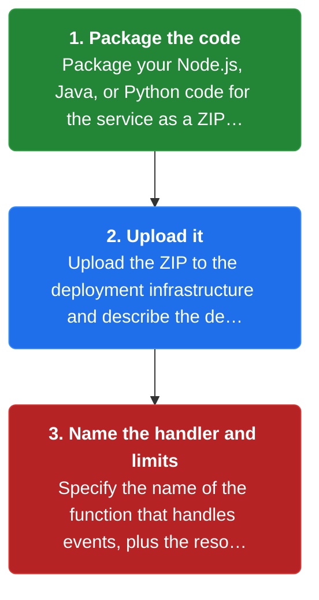
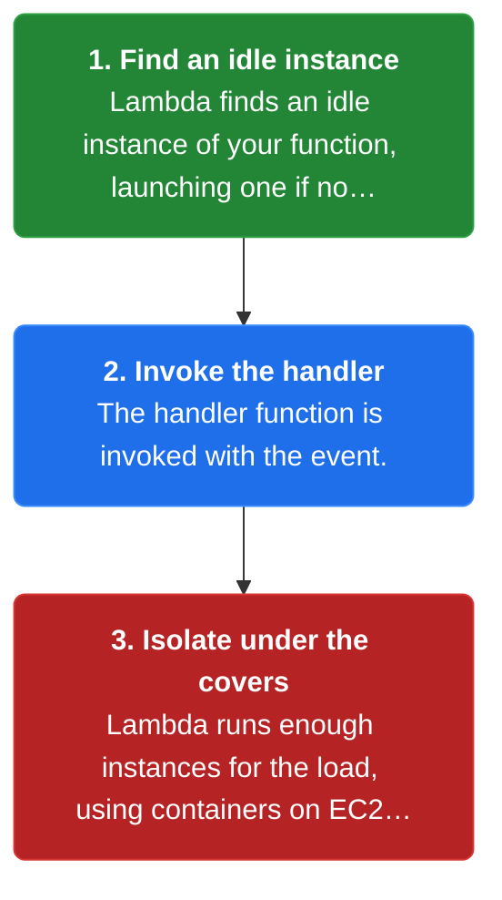
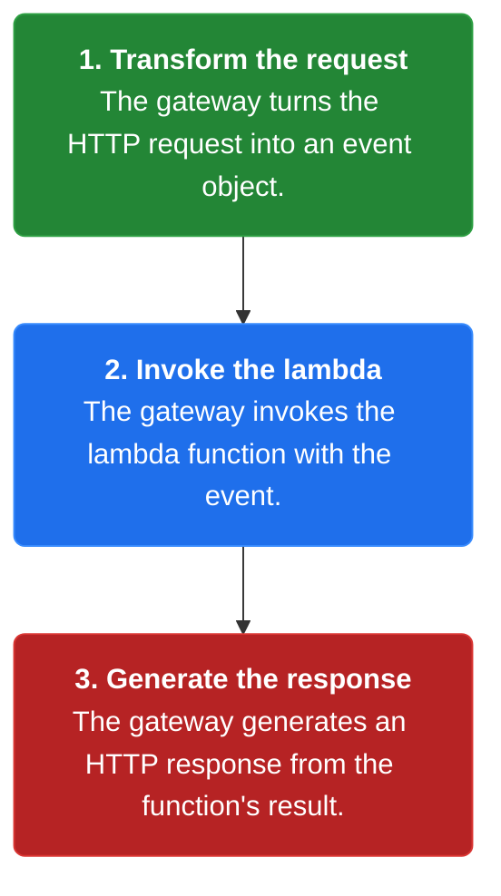
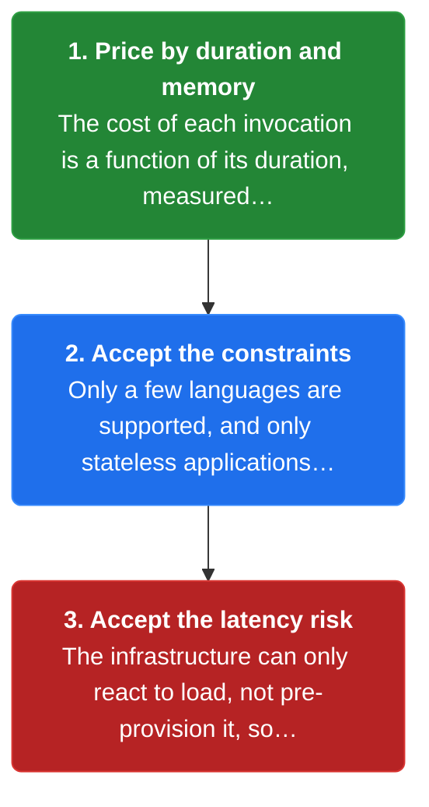

# Chapter 41: Serverless Deployment

> Use a deployment infrastructure that hides any concept of servers and runs your code, charging you for each request based on the resources consumed.

_Also known as: Chris Richardson · Microservice Patterns p.416 · microservices.io /patterns/deployment/serverless-deployment.html_

## Flow

### Package and upload the code

> **Why this matters:** Serverless removes the need to manage any low-level infrastructure — operating systems, virtual machines, containers. You hand the provider your code plus the handler name and resource limits, and it runs the code.



1. **Package the code** — Package your Node.js, Java, or Python code for the service as a ZIP file.

2. **Upload it** — Upload the ZIP to the deployment infrastructure and describe the desired performance characteristics.

3. **Name the handler and limits** — Specify the name of the function that handles events, plus the resource limits.

```java
// UPLOAD SIDE — hand the provider your code plus a handler name and resource limits, no servers to manage
// PARTIES: DEV = developer · LAMBDA = the serverless deployment infrastructure
// STATE (before):
//    function : null                    // nothing deployed yet
//    limits : {}                        // desired performance characteristics, unset
// DEF: deploy handler with memory 128 · CALLED BY: DEV uploading a ZIP
// -> code : "restaurant.zip" · -> handler : "index.handler" · -> memory : 128
//    step 1 · upload · function : null -> "restaurant"        BECAUSE the infrastructure takes your code and runs it
//    step 2 · describe · limits : {} -> {"memory":128}        // you specify resource limits, not servers
//    step 3 · register · handler : null -> "index.handler"    // the name of the function that handles events
// <- function : "restaurant"  · no OS, VM, or container is managed by anyone on your team
//    alt new version : code : "restaurant.zip" -> "restaurant-v2.zip"   BECAUSE a redeploy uploads a fresh ZIP
```

### Invoke on an event

> **Why this matters:** An AWS Lambda function is a stateless component invoked to handle events. When an event occurs, the infrastructure finds an idle instance — launching one if none exist — and invokes the handler.



1. **Find an idle instance** — Lambda finds an idle instance of your function, launching one if none are available.

2. **Invoke the handler** — The handler function is invoked with the event.

3. **Isolate under the covers** — Lambda runs enough instances for the load, using containers on EC2 instances to isolate each one — hidden from you.

```java
// INVOKE SIDE — an event fires and the infrastructure runs enough isolated instances of your function
// PARTIES: S3 = object store · LAMBDA = the deployment infrastructure · FUNC = the function instance
// STATE (before):
//    instances : {}                     // idle function instances, none yet
//    handler_runs : 0                   // how many times the handler has executed
// DEF: react to S3 object 1 · CALLED BY: LAMBDA when an object is created
// -> event : "object-created" · -> key : "photo-7.jpg"
//    step 1 · find idle instance · instances : {} -> {"i-1"}   BECAUSE Lambda finds an idle instance, launching one if none exist
//    step 2 · invoke · handler_runs : 0 -> 1                   // the handler function receives the event
//    step 3 · isolate · containers : 0 -> 1                    // under the covers a container isolates this instance
// <- handler_runs : 1  · the function handled event "object-created" for "photo-7.jpg"
//    alt no idle instance : instances : {} -> {"i-1"}  BECAUSE Lambda launches a fresh instance when none are available, which adds startup latency
```

### Route HTTP through an API gateway

> **Why this matters:** A serverless function can be invoked several ways. One of them is HTTP: a gateway transforms the HTTP request into an event object, invokes the function, and turns the result back into an HTTP response.



1. **Transform the request** — The gateway turns the HTTP request into an event object.

2. **Invoke the lambda** — The gateway invokes the lambda function with the event.

3. **Generate the response** — The gateway generates an HTTP response from the function's result.

```java
// GATEWAY SIDE — an HTTP request is transformed into an event, the function runs, and a response is generated
// PARTIES: CLIENT = the HTTP caller · GW = API Gateway · FUNC = the lambda function
// STATE (before):
//    http : {}                          // the incoming HTTP request, not yet transformed
//    response : null                    // nothing returned yet
// DEF: route GET /restaurants/42 · CALLED BY: CLIENT
// -> method : "GET" · -> path : "/restaurants/42"
//    step 1 · transform · http : {} -> {"method":"GET","path":"/restaurants/42"}  BECAUSE the gateway turns the HTTP request into an event object
//    step 2 · invoke · http : {"method":"GET","path":"/restaurants/42"} -> "handled"  // the event is passed to the lambda
//    step 3 · respond · response : null -> {"status":200}                            // the gateway builds an HTTP response from the result
// <- response : {"status":200}  · one HTTP call became one event and one reply
//    alt error path : response : null -> {"status":500}   BECAUSE the function returned an error result
```

### Pay per request, with constraints

> **Why this matters:** Serverless is extremely elastic and you pay per request rather than for underutilized VMs. But it carries real constraints: few languages, stateless-only, and latency risk when load spikes and nothing is pre-provisioned.



1. **Price by duration and memory** — The cost of each invocation is a function of its duration, measured in 100 millisecond increments, and the memory consumed.

2. **Accept the constraints** — Only a few languages are supported, and only stateless applications that run in response to a request fit.

3. **Accept the latency risk** — The infrastructure can only react to load, not pre-provision it, so sudden spikes can cause high latency.

```java
// COST SIDE — you pay per request for duration and memory, and you trade away pre-provisioned capacity
// PARTIES: LAMBDA = the provider · APP = the application being served
// STATE (before):
//    bill : 0                          // accumulated cost units, zero
//    latency : 0                       // measured response time in ms
//    handler : "index.handler"         // the function invoked for each event
// DEF: bill invocation of 300 ms · CALLED BY: LAMBDA after each handler run
// -> duration_ms : 300 · -> memory : 128
//    step 1 · bucket · increments : 0 -> 3          // 300 ms / 100 ms = 3 increments  BECAUSE duration is measured in 100 ms increments
//    step 2 · price · bill : 0 -> 3                 // the cost is a function of duration and the memory consumed
//    step 3 · react · latency : 0 -> 350            // provisioning plus initialization can add latency on a spike
// <- bill : 3 units  · latency : 350 ms  · pay per request, but you cannot pre-provision capacity
//    alt steady load : latency : 350 -> 10   BECAUSE a warm idle instance is found, so no startup cost
```


## Key Concepts

### The Problem

**Managing servers is undifferentiated heavy lifting.** That low-level infrastructure management is undifferentiated heavy lifting that distracts from the service code.


### The Solution

Use an infrastructure that hides any concept of reserved or preallocated resources — it takes your code and runs it, and you are charged for each request based on the resources consumed.


### Key Facts

| Fact | Detail | In the wild |
|---|---|---|
| Hide the servers, run the code, pay per request | Use an infrastructure that hides any concept of reserved or preallocated resources — it takes your code and runs it, and you are charged for each request based on the resources consumed. | AWS Lambda has the richest feature set, packaging Node.js, Java, or Python code in a ZIP. |
| Elastic and pay-per-request | The infrastructure is extremely elastic — it automatically scales to handle the load — and you pay for each request rather than for provisioned capacity. | A spike is absorbed by running more function instances, not by pre-provisioned servers. |
| Constraints: stateless, few languages, latency risk | Serverless has far more constraints than VM- or container-based infrastructure: only a few languages, only stateless request-driven applications, and a latency risk when load spikes because capacity cannot be pre-provisioned. | A database or a RabbitMQ subscriber does not fit the serverless model. |


### Tradeoffs & When

- The infrastructure is extremely elastic — it automatically scales to handle the load — and you pay for each request rather than for provisioned capacity.
- Serverless has far more constraints than VM- or container-based infrastructure: only a few languages, only stateless request-driven applications, and a latency risk when load spikes because capacity cannot be pre-provisioned.


<details><summary>All concepts (index)</summary>

### Problem: Managing servers is undifferentiated heavy lifting

**Why.** Services must be packaged and deployed, but someone must own operating systems, virtual machines, and other low-level infrastructure.

**Claim.** That low-level infrastructure management is undifferentiated heavy lifting that distracts from the service code.

**Grounding.** The solution says the infrastructure hides any concept of servers, and neither you nor anyone else in your organization is responsible for managing low-level infrastructure.

**In the wild.** Teams instead focus on their code while the provider runs the underlying machines.
### Solution: Hide the servers, run the code, pay per request

**Why.** You want a deployment infrastructure that scales without provisioning servers yourself.

**Claim.** Use an infrastructure that hides any concept of reserved or preallocated resources — it takes your code and runs it, and you are charged for each request based on the resources consumed.

**Grounding.** The solution describes uploading packaged code such as a ZIP and describing the desired performance characteristics; AWS Lambda, Google Cloud Functions, and Azure Functions are named examples.

**In the wild.** AWS Lambda has the richest feature set, packaging Node.js, Java, or Python code in a ZIP.
### Tradeoff: Elastic and pay-per-request

**Why.** You do not want to provision virtual machines or containers that sit underutilized.

**Claim.** The infrastructure is extremely elastic — it automatically scales to handle the load — and you pay for each request rather than for provisioned capacity.

**Grounding.** The benefits section lists eliminating undifferentiated heavy lifting, automatic elasticity, and per-request payment.

**In the wild.** A spike is absorbed by running more function instances, not by pre-provisioned servers.
### Tradeoff: Constraints: stateless, few languages, latency risk

**Why.** The freedom from servers comes with limits on what you can deploy.

**Claim.** Serverless has far more constraints than VM- or container-based infrastructure: only a few languages, only stateless request-driven applications, and a latency risk when load spikes because capacity cannot be pre-provisioned.

**Grounding.** The drawbacks section lists the language limits, the ban on long-running stateful applications such as databases or message brokers, the limited input sources, and the high-latency risk on sudden spikes.

**In the wild.** A database or a RabbitMQ subscriber does not fit the serverless model.

</details>


## Quiz

1. What does the serverless deployment infrastructure hide from you?

   - A. Only the networking layer
   - B. Any concept of servers — physical or virtual hosts, or containers
   - C. Only the database
   - D. Only the logging framework

<details><summary>Reveal answer</summary>

**B.** The infrastructure hides any concept of servers, including physical or virtual hosts and containers (B). The other options are narrower than what the pattern claims.

</details>

2. Which three serverless environments are named in the reference?

   - A. AWS Lambda, Google Cloud Functions, and Azure Functions
   - B. Kubernetes, Marathon, and ECS
   - C. EC2, S3, and Kinesis
   - D. CloudFoundry, Heroku, and OpenShift

<details><summary>Reveal answer</summary>

**A.** The reference names AWS Lambda, Google Cloud Functions, and Azure Functions (A), noting AWS Lambda has the richest feature set.

</details>

3. How is the cost of a Lambda invocation calculated?

   - A. A flat fee per function
   - B. As a function of the duration, measured in 100 ms increments, and the memory consumed
   - C. Only by the number of lines of code
   - D. Only by the number of HTTP requests

<details><summary>Reveal answer</summary>

**B.** Cost is a function of the invocation's duration, measured in 100 millisecond increments, and the memory consumed (B). The other options are not the stated cost model.

</details>

4. Why can serverless exhibit high latency during sudden load spikes?

   - A. The infrastructure can only react to load and cannot proactively pre-provision capacity
   - B. The functions are written in slow languages
   - C. The ZIP upload is slow
   - D. The bill is computed too slowly

<details><summary>Reveal answer</summary>

**A.** A serverless infrastructure can only react to increases in load — you cannot proactively pre-provision capacity — so provisioning and initialization add latency on sudden spikes (A).

</details>

