# Chapter 42: Sidecar

> Implement cross-cutting concerns in a sidecar process or container that runs alongside the service instance.

_Also known as: Chris Richardson · Microservice Patterns p.410 · microservices.io /patterns/deployment/sidecar.html_

## Flow

### Colocate a sidecar with each instance

> **Why this matters:** Cross-cutting concerns belong outside the service code. A sidecar process or container that runs alongside the service instance carries those concerns, so the service stays focused on business logic.

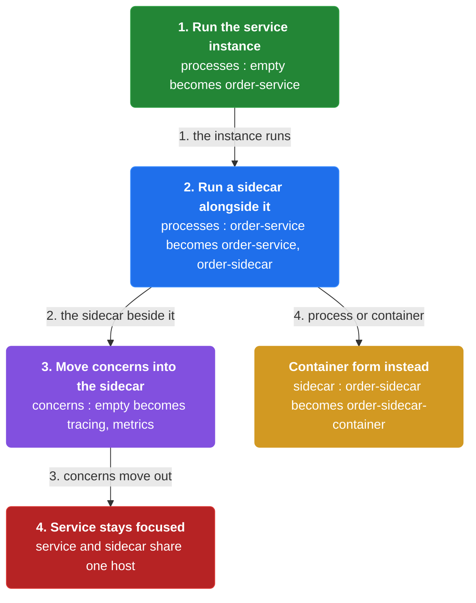

1. **Run the service instance** — The service instance runs as its own process or container.

2. **Run a sidecar alongside it** — A separate sidecar process or container runs alongside the service instance.

3. **Move concerns into the sidecar** — The sidecar implements the cross-cutting concerns instead of the service.

```java
// COLOCATE SIDE — run a sidecar process alongside each service instance so concerns live outside the service
// PARTIES: POD = the deployment unit (one host) · SVC = Order Service instance · SIDE = the sidecar
// STATE (before):
//    processes : {}                     // processes in this pod, none yet
//    concerns : []                      // cross-cutting concerns, not yet attached
// DEF: start 2 processes (service + sidecar) · CALLED BY: POD at deploy time
// -> service : "order-service" · -> sidecar : "order-sidecar"
//    step 1 · start SVC · processes : {} -> {"order-service"}   BECAUSE the service instance runs as its own process
//    step 2 · start SIDE · processes : {"order-service"} -> {"order-service","order-sidecar"}  // the sidecar runs ALONGSIDE the service
//    step 3 · attach concerns · concerns : [] -> ["tracing","metrics"]   // the sidecar carries cross-cutting concerns, not the service
// <- processes : 2  · concerns : 2  · the service and sidecar share one host
//    alt container form : sidecar : "order-sidecar" -> "order-sidecar-container"  BECAUSE a sidecar can be a container instead of a process
```

### Intercept outbound traffic

> **Why this matters:** The sidecar sits between the service and its outbound traffic, so it can act on every call that leaves. This is where a concern such as distributed tracing attaches a unique id.

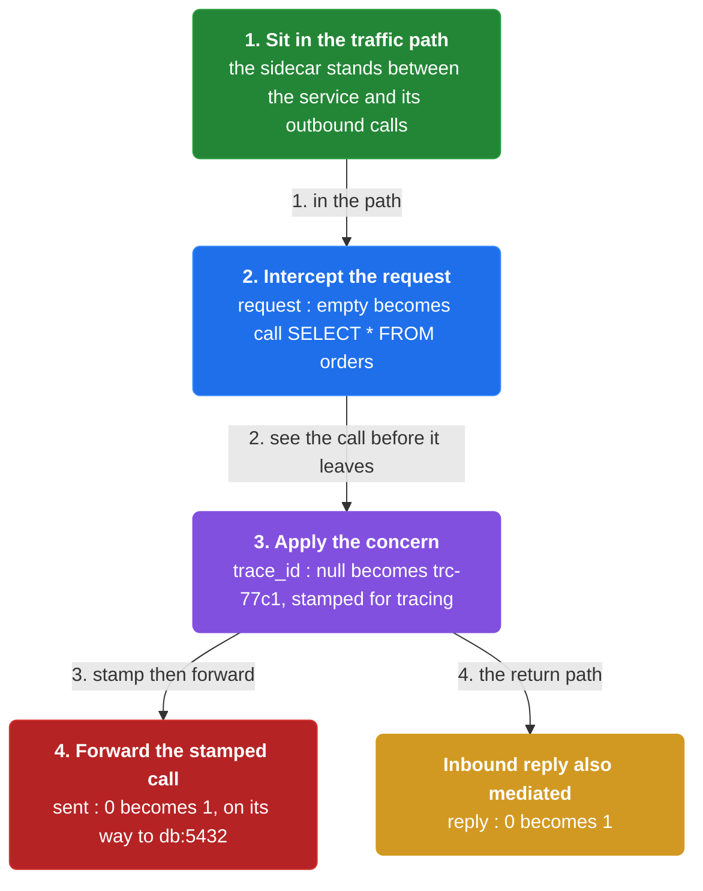

1. **Sit in the traffic path** — The sidecar stands between the service and its outbound calls.

2. **Intercept the request** — The sidecar sees each outbound request before it leaves.

3. **Apply the concern** — The sidecar stamps the request with a trace id and forwards it.

```java
// OUTBOUND SIDE — the sidecar mediates every call leaving the service, attaching a trace id
// PARTIES: SVC = Order Service · SIDE = its sidecar · DB = PostgreSQL 16 @ orders-db-1
// STATE (before):
//    request : {}                       // the outbound call before interception
//    trace_id : null                    // no id assigned yet
// DEF: mediate call 1 to DB · CALLED BY: SVC sending a query
// -> call : "SELECT * FROM orders" · -> target : "db:5432"
//    step 1 · intercept · request : {} -> {"call":"SELECT * FROM orders"}  BECAUSE the sidecar sits between the service and its outbound traffic
//    step 2 · trace · trace_id : null -> "trc-77c1"                        // the sidecar stamps a unique id for distributed tracing
//    step 3 · forward · sent : 0 -> 1                                      // the stamped call leaves for the DB
// <- call : "SELECT * FROM orders" sent to db:5432 · trace_id "trc-77c1"
//    alt reply path : reply : 0 -> 1   BECAUSE the same sidecar also mediates the inbound reply
```

### Intercept inbound traffic

> **Why this matters:** Inbound traffic passes through the sidecar too. A monitoring service can ping the sidecar for health, and the sidecar records metrics — observability without touching the service.

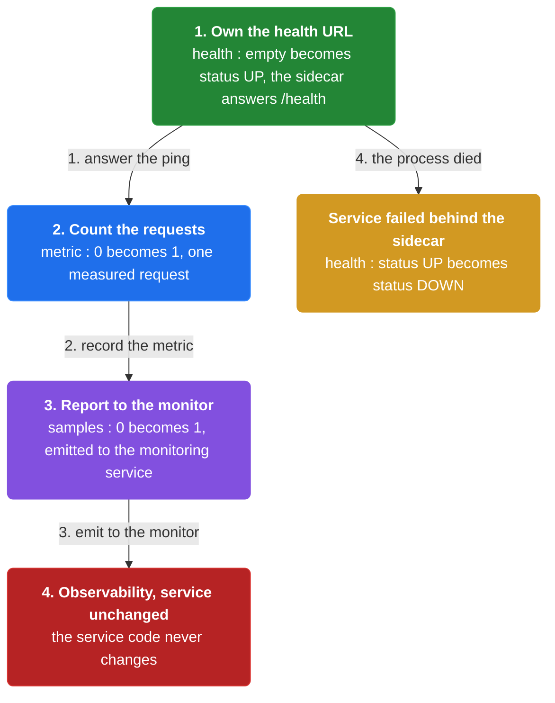

1. **Own the health URL** — The sidecar answers the health-check URL that a monitoring service pings.

2. **Count the requests** — The sidecar records metrics about the requests it mediates.

3. **Report to the monitor** — The measurements are emitted so operators can see what the service is doing.

```java
// INBOUND SIDE — a monitor pings the sidecar, which answers for the service without touching its code
// PARTIES: MON = monitoring service · SIDE = the sidecar · SVC = Order Service
// STATE (before):
//    health : {}                        // health endpoint state, unknown
//    metric : 0                         // request counter, zero
// DEF: ping health URL every 10 s · CALLED BY: MON
// -> health_url : "/health"
//    step 1 · answer · health : {} -> {"status":"UP"}   BECAUSE the sidecar owns the health-check URL the monitor pings
//    step 2 · count · metric : 0 -> 1                   // the sidecar records one measured request
//    step 3 · report · samples : 0 -> 1                 // the metric is emitted to the monitor
// <- health : "UP"  · metric : 1  · observability handled by the sidecar, service code unchanged
//    alt DOWN : health : {"status":"UP"} -> {"status":"DOWN"}   BECAUSE the service process failed behind the sidecar
```

### Sidecars form a service mesh

> **Why this matters:** A single sidecar handles one instance. When every instance has a sidecar, the set of sidecars collectively mediates all in and out traffic — which is how a service mesh is often implemented.

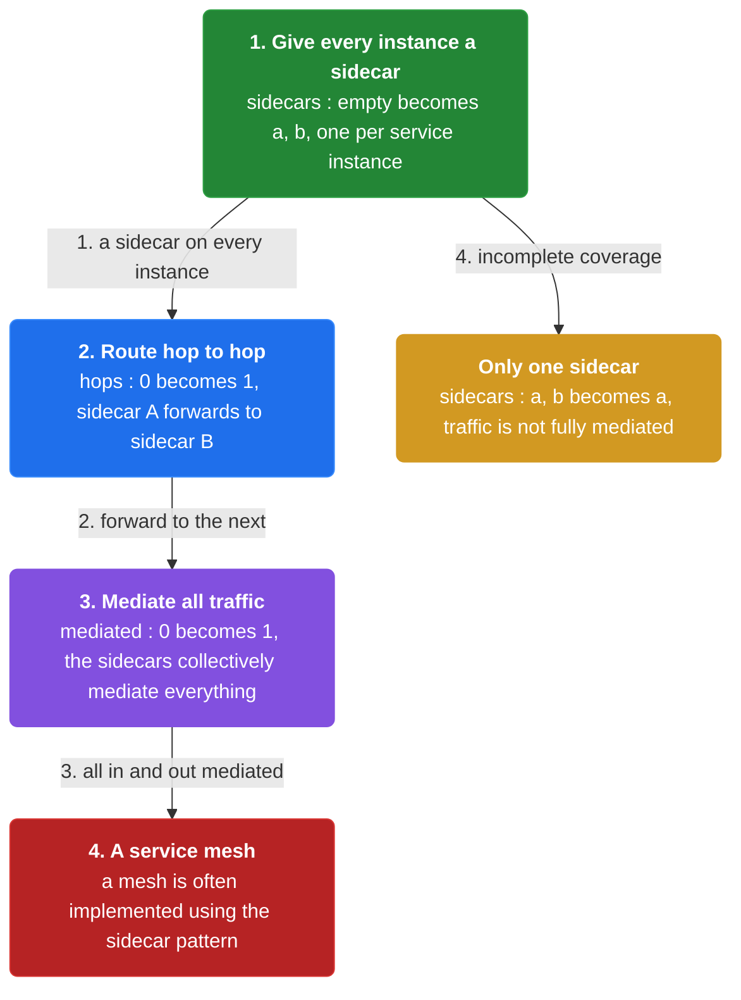

1. **Give every instance a sidecar** — Each service instance gets its own sidecar.

2. **Route hop to hop** — One sidecar forwards to the next, which hands the call to the next service.

3. **Mediate all traffic** — Together the sidecars mediate all communication in and out of every service.

```java
// MESH SIDE — when every instance has a sidecar, the set of sidecars mediates all traffic: a service mesh
// PARTIES: SIDEA = sidecar of Order Service · SIDEB = sidecar of Customer Service · SVCB = Customer Service
// STATE (before):
//    sidecars : {}                      // sidecars deployed across the system, none yet
//    hops : 0                           // mediated service-to-service hops
// DEF: make call 1 from A to B · CALLED BY: Order Service calling Customer Service
// -> next : "customer-service"
//    step 1 · deploy sidecars · sidecars : {} -> {"a","b"}   BECAUSE each service instance gets its own sidecar
//    step 2 · route · hops : 0 -> 1                          // SIDEA forwards to SIDEB, which hands it to SVCB
//    step 3 · form mesh · mediated : 0 -> 1                  // the sidecars collectively mediate all in/out communication
// <- hops : 1  · a mesh is often implemented using the sidecar pattern
//    alt one sidecar only : sidecars : {"a","b"} -> {"a"}   BECAUSE without sidecars on every service, traffic is not fully mediated
```


## System Design Interview

**The pipeline:** application container → sidecar container → shared resources

### application container — the Order Service that owns the business logic

_Role: application container_

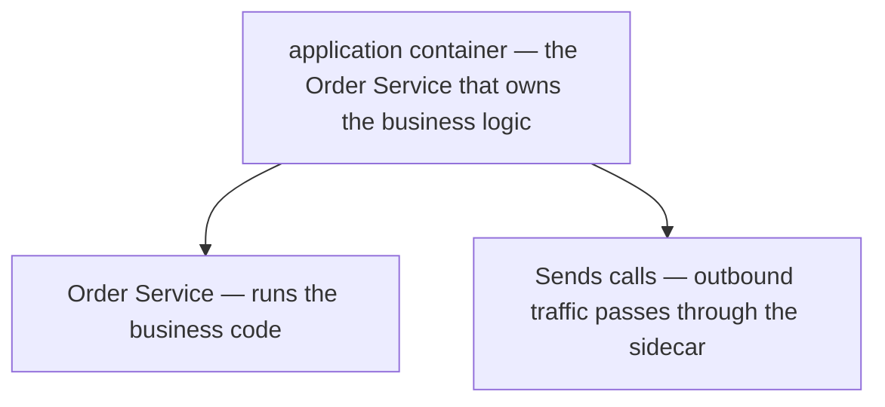

### sidecar container — the concern-carrying twin

_Role: sidecar container_

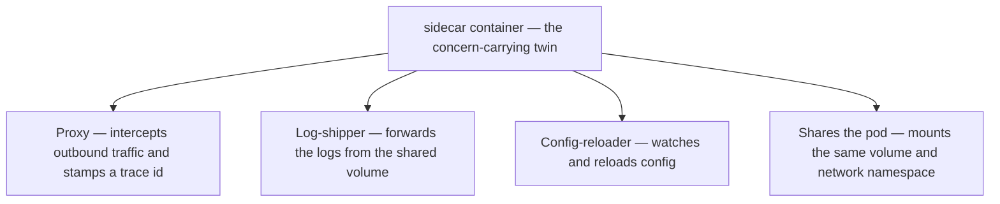

### shared resources — what both containers share

_Role: shared resources_

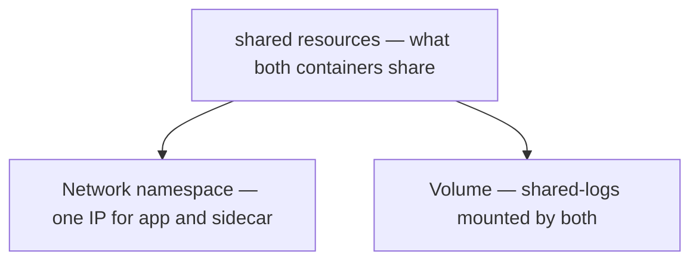

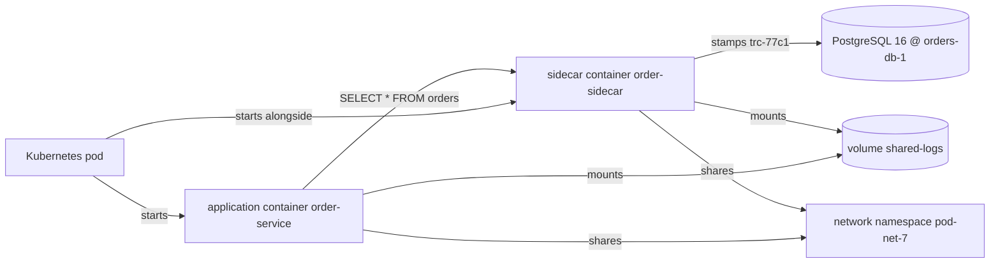

```java
// SYSTEM DESIGN — sidecar: application container -> sidecar container -> shared resources
// PARTIES: APP = application container (Order Service "order-service") · SIDE = sidecar container (proxy/log-shipper/config-reloader "order-sidecar") · SHARED = shared resources (the pod network namespace + the volume both containers mount)
// DEF: sidecar — the container that carries the cross-cutting concerns alongside the app; here "order-sidecar"
// DEF: concern — one cross-cutting job moved out of the service; here "tracing"
// DEF: namespace — the shared network both containers live in; here "pod-net-7"
// DEF: volume — the shared disk both containers mount; here "shared-logs"
// STATE (before):
//    containers : {}     // containers started in the pod, none yet
//    concerns : []       // cross-cutting concerns, not yet attached
// DEF: colocate_sidecar · CALLED BY: the pod at deploy time
// -> service : "order-service" · -> sidecar : "order-sidecar"
//    step 1 · the pod starts the app container    containers : {} -> {"order-service"}   BECAUSE the service runs as its own container
//    step 2 · the pod starts the sidecar container    containers : {"order-service"} -> {"order-service","order-sidecar"}   // the sidecar runs alongside, sharing the pod
//    step 3 · the sidecar attaches the concerns    concerns : [] -> ["tracing","metrics"]   // the app reads none of this; SIDE records it
//    step 4 · both mount the shared volume and share the namespace    mounts : 0 -> 2   // volume "shared-logs" and net "pod-net-7"
// <- containers : 2 in the pod · the sidecar reads the shared volume "shared-logs" and writes its own metrics   BECAUSE a sidecar shares the host, network, and volume with the service
```

## Interview Questions

### Q1

Your order service is polluted with configuration, logging, health-check, metrics, and tracing code that has nothing to do with orders. You want the business logic clean and the concerns moved somewhere else.

**Interviewer's question:** Where does the Sidecar pattern put cross-cutting concerns, and where does the sidecar run?

**Solution:** A sidecar process or container runs alongside the service instance and implements the cross-cutting concerns instead of the service, so the service stays focused on business logic.

**System-design components:**
- Service instance — its own process
- Sidecar — a separate process or container
- Shared host — they run alongside
- Cross-cutting concerns — moved into the sidecar

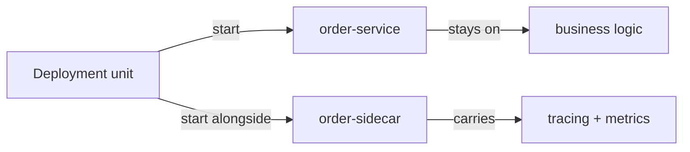

```java
// COLOCATE SIDE — run a sidecar process alongside each service instance so concerns live outside the service
// PARTIES: POD = the deployment unit (one host) · SVC = Order Service instance · SIDE = the sidecar
// STATE (before):
//    processes : {}                     // processes in this pod, none yet
//    concerns : []                      // cross-cutting concerns, not yet attached
// DEF: start 2 processes (service + sidecar) · CALLED BY: POD at deploy time
// -> service : "order-service" · -> sidecar : "order-sidecar"
//    step 1 · start the service   // processes : {} -> {"order-service"}   BECAUSE the service instance runs as its own process
//    step 2 · start the sidecar   // processes : {"order-service"} -> {"order-service","order-sidecar"}   // the sidecar runs ALONGSIDE the service
//    step 3 · attach the concerns   // concerns : [] -> ["tracing","metrics"]   // the sidecar carries cross-cutting concerns, not the service
// <- processes : 2 · concerns : 2 · the service and sidecar share one host
//    alt container form : sidecar : "order-sidecar" -> "order-sidecar-container"   BECAUSE a sidecar can be a container instead of a process
```

_This is the colocation stage — running a sidecar alongside each instance and moving the concerns into it._

_Covers:_ Colocate a sidecar with each instance

_From the 28 problems:_ 01-scale-from-zero-to-millions

### Q2

You need every outbound call from the order service to carry a trace id for distributed tracing, but you cannot modify the service to add it.

**Interviewer's question:** How does the sidecar act on outbound traffic?

**Solution:** The sidecar sits between the service and its outbound calls, sees each outbound request before it leaves, stamps it with a trace id, and forwards it.

**System-design components:**
- Traffic path — sidecar in the middle
- Outbound request — intercepted
- Trace id — stamped on the call
- Forward — the call leaves

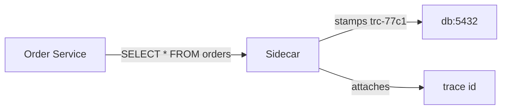

```java
// OUTBOUND SIDE — the sidecar mediates every call leaving the service, attaching a trace id
// PARTIES: SVC = Order Service · SIDE = its sidecar · DB = PostgreSQL 16 @ orders-db-1
// STATE (before):
//    request : {}                       // the outbound call before interception
//    trace_id : null                    // no id assigned yet
// DEF: mediate call 1 to DB · CALLED BY: SVC sending a query
// -> call : "SELECT * FROM orders" · -> target : "db:5432"
//    step 1 · intercept   // request : {} -> {"call":"SELECT * FROM orders"}   BECAUSE the sidecar sits between the service and its outbound traffic
//    step 2 · stamp the trace id   // trace_id : null -> "trc-77c1"   // the sidecar stamps a unique id for distributed tracing
//    step 3 · forward   // sent : 0 -> 1   // the stamped call leaves for the DB
// <- call : "SELECT * FROM orders" sent to db:5432 · trace_id "trc-77c1"
//    alt reply path : reply : 0 -> 1   BECAUSE the same sidecar also mediates the inbound reply
```

_This is the outbound stage — the sidecar intercepts each outgoing call and stamps it with a trace id before forwarding._

_Covers:_ Intercept outbound traffic

_From the 28 problems:_ 01-scale-from-zero-to-millions

### Q3

Your monitoring service pings /health on the order service, but you want the health answer and the metrics to come from the sidecar, not from service code.

**Interviewer's question:** How does the sidecar handle inbound traffic for observability?

**Solution:** The sidecar answers the health-check URL the monitoring service pings, records metrics about the requests it mediates, and emits the measurements to the monitor.

**System-design components:**
- Health URL — owned by the sidecar
- Monitoring service — pings it
- Request metrics — recorded by the sidecar
- Emission — to the monitor

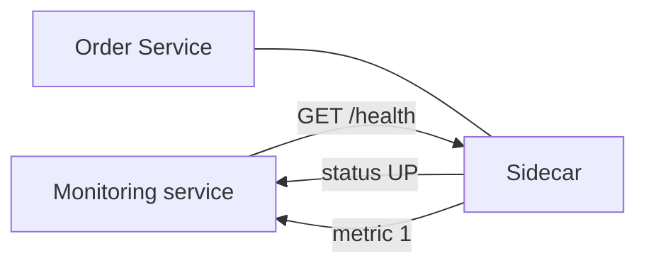

```java
// INBOUND SIDE — a monitor pings the sidecar, which answers for the service without touching its code
// PARTIES: MON = monitoring service · SIDE = the sidecar · SVC = Order Service
// STATE (before):
//    health : {}                        // health endpoint state, unknown
//    metric : 0                         // request counter, zero
// DEF: ping health URL every 10 s · CALLED BY: MON
// -> health_url : "/health"
//    step 1 · answer the ping   // health : {} -> {"status":"UP"}   BECAUSE the sidecar owns the health-check URL the monitor pings
//    step 2 · count the request   // metric : 0 -> 1   // the sidecar records one measured request
//    step 3 · report   // samples : 0 -> 1   // the metric is emitted to the monitor
// <- health : "UP" · metric : 1 · observability handled by the sidecar, service code unchanged
//    alt DOWN : health : {"status":"UP"} -> {"status":"DOWN"}   BECAUSE the service process failed behind the sidecar
```

_This is the inbound stage — the sidecar answers health pings and records and reports metrics without touching the service._

_Covers:_ Intercept inbound traffic

_From the 28 problems:_ 01-scale-from-zero-to-millions

### Q4

One sidecar only handles one instance. You want every instance covered so that, together, the sidecars mediate all traffic in and out of every service.

**Interviewer's question:** What do the sidecars collectively form, and how is the hop between services mediated?

**Solution:** When every instance gets its own sidecar, one sidecar forwards to the next, which hands the call to the next service, and together the sidecars mediate all communication — a service mesh.

**System-design components:**
- One sidecar per instance
- Hop-to-hop forwarding
- All traffic mediated
- A service mesh — the collective result

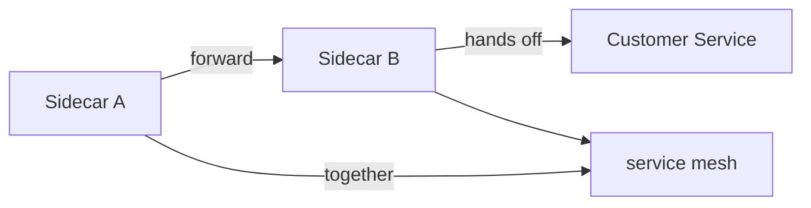

```java
// MESH SIDE — when every instance has a sidecar, the set of sidecars mediates all traffic: a service mesh
// PARTIES: SIDEA = sidecar of Order Service · SIDEB = sidecar of Customer Service · SVCB = Customer Service
// STATE (before):
//    sidecars : {}                      // sidecars deployed across the system, none yet
//    hops : 0                           // mediated service-to-service hops
// DEF: make call 1 from A to B · CALLED BY: Order Service calling Customer Service
// -> next : "customer-service"
//    step 1 · deploy the sidecars   // sidecars : {} -> {"a","b"}   BECAUSE each service instance gets its own sidecar
//    step 2 · route hop to hop   // hops : 0 -> 1   // SIDEA forwards to SIDEB, which hands it to SVCB
//    step 3 · form the mesh   // mediated : 0 -> 1   // the sidecars collectively mediate all in/out communication
// <- hops : 1 · a mesh is often implemented using the sidecar pattern
//    alt one sidecar only : sidecars : {"a","b"} -> {"a"}   BECAUSE without sidecars on every service, traffic is not fully mediated
```

_This is the mesh stage — every instance's sidecar collectively mediates all traffic, forming a service mesh._

_Covers:_ Sidecars form a service mesh

_From the 28 problems:_ 01-scale-from-zero-to-millions

## Key Concepts

### The Problem

**Cross-cutting concerns pollute service code.** Writing configuration, logging, health checks, metrics, and tracing into each service duplicates code and drags every service away from its business logic.


### The Solution

Implement cross-cutting concerns in a sidecar process or container that runs alongside the service instance.


### Key Facts

| Fact | Detail | In the wild |
|---|---|---|
| A sidecar alongside each instance | Implement cross-cutting concerns in a sidecar process or container that runs alongside the service instance. | The same sidecar answers health pings, attaches trace ids, and records metrics for its service. |
| Concerns out of the code, at the cost of another process | The sidecar centralizes cross-cutting concerns, but you now deploy and operate a second process or container per instance. | Teams accept the extra component because it keeps the service code clean and language-agnostic. |
| Sidecars are the building blocks of a mesh | When every instance has a sidecar, the sidecars collectively mediate all communication in and out of each service — a service mesh. | A full mesh is often just the sidecar pattern applied consistently to every instance. |


### Tradeoffs & When

- The sidecar centralizes cross-cutting concerns, but you now deploy and operate a second process or container per instance.
- When every instance has a sidecar, the sidecars collectively mediate all communication in and out of each service — a service mesh.


<details><summary>All concepts (index)</summary>

### Problem: Cross-cutting concerns pollute service code

**Why.** In a system of services, every instance must handle the same non-business concerns.

**Claim.** Writing configuration, logging, health checks, metrics, and tracing into each service duplicates code and drags every service away from its business logic.

**Grounding.** The sidecar pattern exists to implement cross-cutting concerns, which the service mesh chapter enumerates as externalized configuration, logging, health checks, metrics, and distributed tracing.

**In the wild.** The sidecar is the mechanism that moves those concerns out of the service.
### Solution: A sidecar alongside each instance

**Why.** The concern code should live somewhere that is not the service.

**Claim.** Implement cross-cutting concerns in a sidecar process or container that runs alongside the service instance.

**Grounding.** The solution states the sidecar runs alongside the service instance, so the two share a host and the sidecar can act on the service's traffic.

**In the wild.** The same sidecar answers health pings, attaches trace ids, and records metrics for its service.
### Tradeoff: Concerns out of the code, at the cost of another process

**Why.** You want observability and configuration without rewriting them per service.

**Claim.** The sidecar centralizes cross-cutting concerns, but you now deploy and operate a second process or container per instance.

**Grounding.** The solution says the sidecar is a separate process or container, so it is an extra runtime component alongside the service.

**In the wild.** Teams accept the extra component because it keeps the service code clean and language-agnostic.
### Tradeoff: Sidecars are the building blocks of a mesh

**Why.** One sidecar per instance scales naturally across a whole system.

**Claim.** When every instance has a sidecar, the sidecars collectively mediate all communication in and out of each service — a service mesh.

**Grounding.** The service mesh chapter notes a mesh is often implemented using the sidecar pattern, and the mesh mediates all traffic in and out.

**In the wild.** A full mesh is often just the sidecar pattern applied consistently to every instance.

</details>


## Quiz

1. What is the solution of the Sidecar pattern?

   - A. Run all services in one process
   - B. Implement cross-cutting concerns in a sidecar process or container running alongside the service instance
   - C. Package services as VMs
   - D. Use a serverless platform

<details><summary>Reveal answer</summary>

**B.** The solution is to implement cross-cutting concerns in a sidecar process or container that runs alongside the service instance (B). The other options describe different patterns.

</details>

2. Where does the sidecar run relative to the service instance?

   - A. In a separate data center
   - B. Alongside the service instance, sharing its host
   - C. Only in the cloud provider's control plane
   - D. Inside the service's own JVM

<details><summary>Reveal answer</summary>

**B.** The sidecar is a process or container that runs alongside the service instance (B), so it shares the host and can act on the service's traffic.

</details>

3. Which larger pattern is often implemented using sidecars?

   - A. The service mesh
   - B. The saga
   - C. CQRS
   - D. API composition

<details><summary>Reveal answer</summary>

**A.** A service mesh is often implemented using the sidecar pattern (A). Saga, CQRS, and API composition are unrelated patterns.

</details>

4. What kinds of concerns does the sidecar implement?

   - A. Cross-cutting concerns such as configuration, logging, health checks, metrics, and tracing
   - B. Business rules for order placement
   - C. Database schema migrations
   - D. UI rendering

<details><summary>Reveal answer</summary>

**A.** The sidecar implements cross-cutting concerns (A), such as the configuration, logging, health checks, metrics, and tracing listed in the service mesh chapter. The other options are business or unrelated responsibilities.

</details>

