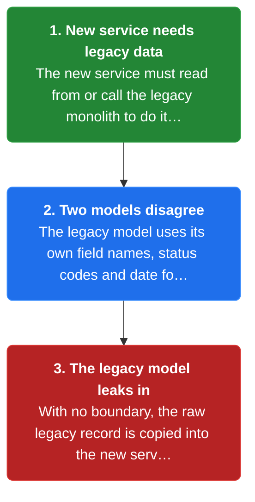
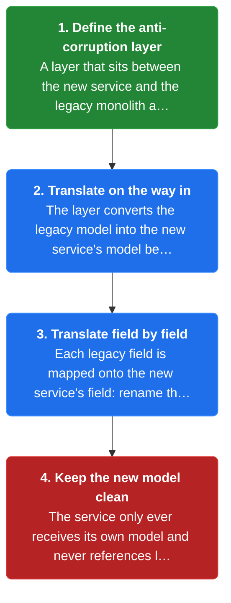
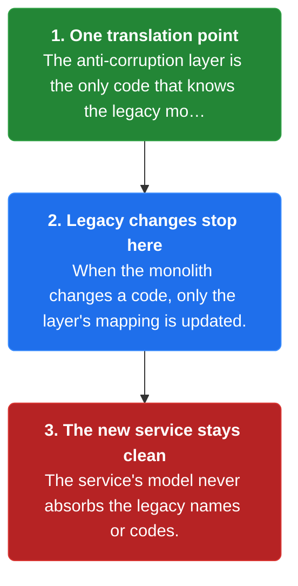

# Chapter 43: Anti-Corruption Layer

> An anti-corruption layer that translates between a legacy monolith's domain model and a new service's domain model, preventing the legacy model from polluting the new service.

_Also known as: Chris Richardson · Microservice Patterns Ch. 43 · microservices.io /patterns/refactoring/anti-corruption-layer.html_

## Flow

### The pollution problem

> **Why this matters:** A new service has to interoperate with a legacy monolith, but the legacy model's field names, codes and shapes differ from the new service's own vocabulary. Without a boundary, the raw legacy model is copied straight in and pollutes the new service.



1. **New service needs legacy data** — The new service must read from or call the legacy monolith to do its job.

2. **Two models disagree** — The legacy model uses its own field names, status codes and date formats, which differ from the new service's vocabulary.

3. **The legacy model leaks in** — With no boundary, the raw legacy record is copied into the new service, whose code now depends on legacy names like **cust_dob** and **status_cd**.

```java
// NEW SERVICE SIDE — a new Customer service reads a record straight from the legacy monolith, with no boundary
// PARTIES: NEW = new Customer service · LEG = legacy monolith customer table
// STATE (before):
//    leg_customer : { "cust_id": "C-1042", "cust_dob": "1987-04-03", "status_cd": "A" }
//    new_customer : {}
// DEF: fetch_customer · CALLED BY: NEW when it needs customer 1042
// -> customer_id : "C-1042"
//    step 1 · SELECT the legacy row by cust_id   // leg_customer : {} -> { "cust_id": "C-1042", "cust_dob": "1987-04-03", "status_cd": "A" }
//    step 2 · copy the raw legacy row into the new service's model   // new_customer : {} -> { "cust_id": "C-1042", "cust_dob": "1987-04-03", "status_cd": "A" }
//    step 3 · adopt the legacy 1-letter code as the service's own status   // new_customer.status : "" -> "A"   BECAUSE the code is copied over verbatim
// <- output : new_customer now holds legacy names "cust_dob" and "status_cd" plus the raw code "A" — the legacy model polluted the new service

```

### The translation boundary

> **Why this matters:** The anti-corruption layer is the fix: a component that sits between the new service and the legacy monolith and translates between the two domain models, so each side keeps its own language.



1. **Define the anti-corruption layer** — A layer that sits between the new service and the legacy monolith and owns all translation.

2. **Translate on the way in** — The layer converts the legacy model into the new service's model before the service ever sees it.

3. **Translate field by field** — Each legacy field is mapped onto the new service's field: rename the field, and translate its value where the two models disagree.

4. **Keep the new model clean** — The service only ever receives its own model and never references legacy names.

```java
// ACL SIDE — the anti-corruption layer translates a legacy record into the new service's own model
// PARTIES: NEW = new Customer service · ACL = anti-corruption layer · LEG = legacy monolith
// STATE (before):
//    legacy : { "cust_id": "C-1042", "cust_dob": "1987-04-03", "status_cd": "A" }
//    domain : {}                              // the new service's model, empty before translation
// DEF: translate · CALLED BY: NEW when it needs a customer in its own vocabulary
// -> legacy : { "cust_id": "C-1042", "cust_dob": "1987-04-03", "status_cd": "A" }
//    step 1 · map cust_id to id unchanged   // domain.id : "" -> "C-1042"   BECAUSE the identifier is already clean
//    step 2 · rename cust_dob to dateOfBirth   // domain.dateOfBirth : "" -> "1987-04-03"
//    step 3 · translate the 1-letter code to a word   // domain.status : "" -> "ACTIVE"   BECAUSE legacy code "A" means active
// <- output : domain = { "id": "C-1042", "dateOfBirth": "1987-04-03", "status": "ACTIVE" } — the service sees only its own model

```

### Containing the legacy model

> **Why this matters:** Because the translation lives in one place, the legacy vocabulary stays inside the anti-corruption layer. A change to the legacy model is absorbed at the boundary instead of rippling into the new service.



1. **One translation point** — The anti-corruption layer is the only code that knows the legacy model's vocabulary.

2. **Legacy changes stop here** — When the monolith changes a code, only the layer's mapping is updated.

3. **The new service stays clean** — The service's model never absorbs the legacy names or codes.

```java
// ACL SIDE — the legacy monolith renames its active-status code; the change stops inside the ACL
// PARTIES: NEW = new Customer service · ACL = anti-corruption layer · LEG = legacy monolith
// STATE (before):
//    mapping : { "status_cd": "A" }           // the ACL's translation table: legacy code -> word
//    domain  : { "id": "C-1042", "status": "ACTIVE" }
// DEF: absorb_change · CALLED BY: ACL when LEG changes its active code
// -> legacy_code : "A"
//    step 1 · LEG starts writing "1" for active   // mapping.status_cd : "A" -> "1"
//    step 2 · the ACL retranslates through the updated table   // translated : "" -> "ACTIVE"   BECAUSE the mapping table owns the code, not the service
//    step 3 · the service reads its own model and sees the word   // read_status : "" -> "ACTIVE"
// <- output : domain.status stays "ACTIVE" while the legacy code is now "1" — the rename is confined to the ACL

```


## Key Concepts

### The Problem

**Legacy model pollution.** If the legacy model is copied in directly, its field names, status codes and shapes leak into the new service's domain model, and the new service ends up speaking the old system's language.


### The Solution

Define an anti-corruption layer that translates between the two domain models, so the legacy model is converted into the new service's model at the boundary.


### Key Facts

| Fact | Detail | In the wild |
|---|---|---|
| Anti-corruption layer | Define an anti-corruption layer that translates between the two domain models, so the legacy model is converted into the new service's model at the boundary. | A layer that maps legacy cust_id, cust_dob and status_cd onto the new service's id, dateOfBirth and status. |
| Extra translation code | You trade the pollution risk for a permanent translation component that must be maintained for as long as the two models coexist. | A mapping table that grows one entry per legacy field until the monolith is retired. |
| Boundary discipline | Any call that bypasses the anti-corruption layer reintroduces the pollution it was meant to stop. | A team that agrees never to read the legacy database directly, only through the layer. |


### Tradeoffs & When

- You trade the pollution risk for a permanent translation component that must be maintained for as long as the two models coexist.
- Any call that bypasses the anti-corruption layer reintroduces the pollution it was meant to stop.


<details><summary>All concepts (index)</summary>

### Problem: Legacy model pollution

**Why.** A new service almost always has to interoperate with the legacy monolith, reading its data or calling its APIs.

**Claim.** If the legacy model is copied in directly, its field names, status codes and shapes leak into the new service's domain model, and the new service ends up speaking the old system's language.

**Grounding.** This is the pattern's problem statement: prevent a legacy monolith's domain model from polluting the domain model of a new service.

**In the wild.** A new customer service that imports legacy cust_dob and status_cd fields instead of its own dateOfBirth and status.
### Solution: Anti-corruption layer

**Why.** Translation has to live somewhere, and that somewhere must be a dedicated boundary rather than scattered mapping code inside the new service.

**Claim.** Define an anti-corruption layer that translates between the two domain models, so the legacy model is converted into the new service's model at the boundary.

**Grounding.** This is the pattern's solution statement: define an anti-corruption layer, which translates between the two domain models.

**In the wild.** A layer that maps legacy cust_id, cust_dob and status_cd onto the new service's id, dateOfBirth and status.
### Tradeoff: Extra translation code

**Why.** The layer is code you must write and keep in sync as either model changes.

**Claim.** You trade the pollution risk for a permanent translation component that must be maintained for as long as the two models coexist.

**Grounding.** The solution introduces a layer, and every legacy field the new service touches needs a mapping, so the cost grows with the number of translated fields.

**In the wild.** A mapping table that grows one entry per legacy field until the monolith is retired.
### Tradeoff: Boundary discipline

**Why.** The layer only works if every interaction with the legacy system goes through it.

**Claim.** Any call that bypasses the anti-corruption layer reintroduces the pollution it was meant to stop.

**Grounding.** The pattern's whole point is to prevent pollution, so a bypassed layer solves nothing: the legacy model reaches the new service again.

**In the wild.** A team that agrees never to read the legacy database directly, only through the layer.

</details>


## Quiz

1. What is the anti-corruption layer's job?

   - A. To speed up calls between a new service and the legacy monolith
   - B. To translate between two domain models
   - C. To replace the legacy monolith's database
   - D. To route requests to the nearest service instance

<details><summary>Reveal answer</summary>

**B.** The solution statement is to define a layer that translates between the two domain models. A and D describe unrelated concerns, and C is wrong because the layer translates models; it does not replace the database.

</details>

2. Which problem does the anti-corruption layer solve?

   - A. A legacy monolith's domain model polluting a new service's domain model
   - B. A service discovering where other services are located
   - C. A database running out of storage
   - D. A service failing under high load

<details><summary>Reveal answer</summary>

**A.** The problem statement is exactly how to prevent a legacy monolith's domain model from polluting a new service's domain model. B, C and D belong to different patterns entirely.

</details>

3. After you apply the pattern, where should the legacy vocabulary (field names and codes) live?

   - A. Spread across the new service's code
   - B. In the anti-corruption layer only
   - C. Nowhere, it is deleted from the monolith
   - D. In the user's browser

<details><summary>Reveal answer</summary>

**B.** The layer is the single translation point, so the legacy names and codes are confined there and the new service only sees its own model. A is the pollution the pattern prevents, C is wrong because the monolith keeps its own model, and D is irrelevant.

</details>

4. A legacy record has cust_id = 'C-1042', cust_dob = '1987-04-03', and status_cd = 'A'. Which is a correct translation into the new service's model?

   - A. id = 'C-1042', dateOfBirth = '1987-04-03', status = 'A'
   - B. id = 'C-1042', dateOfBirth = '1987-04-03', status = 'ACTIVE'
   - C. cust_id = 'C-1042', cust_dob = '1987-04-03', status_cd = 'A'
   - D. id = 'C-1042', dateOfBirth = 'ACTIVE', status = '1987-04-03'

<details><summary>Reveal answer</summary>

**B.** The layer maps the legacy code 'A' to the word 'ACTIVE' and renames the fields, so B is right. A keeps the raw code, C is the untranslated legacy record, and D swaps the field values.

</details>

